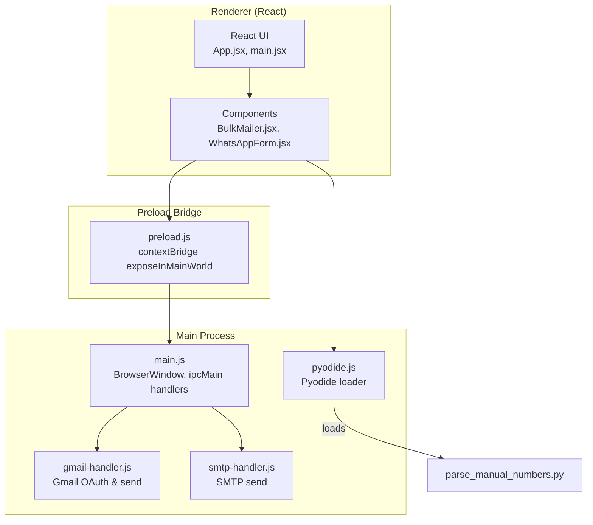
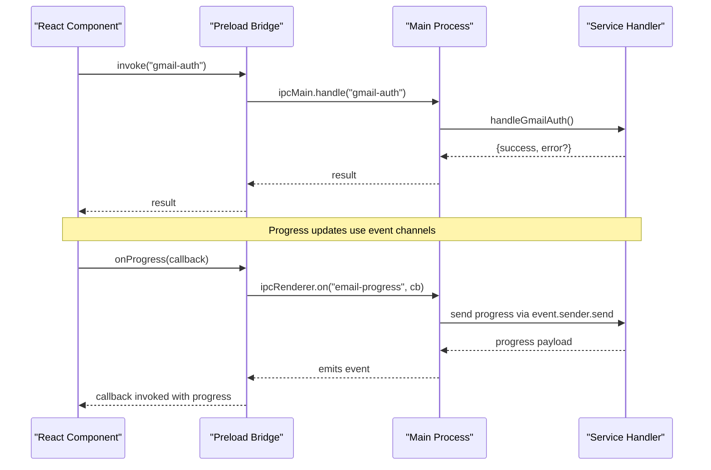
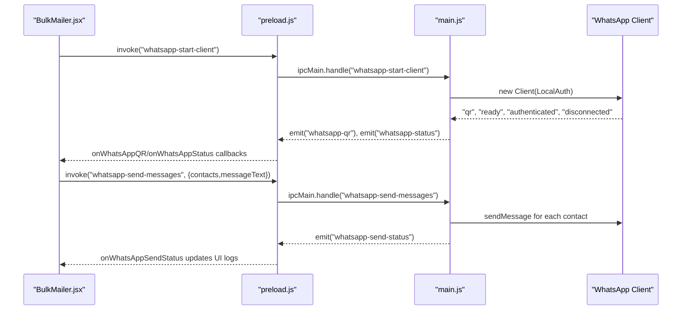
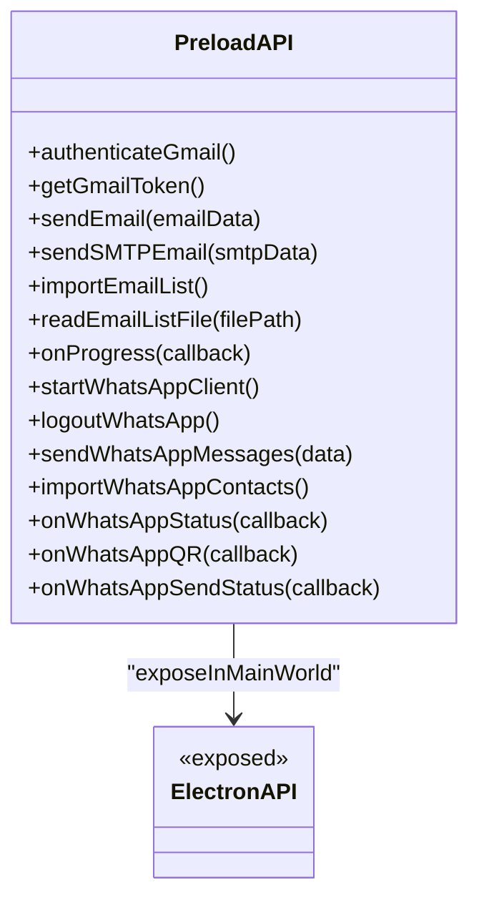
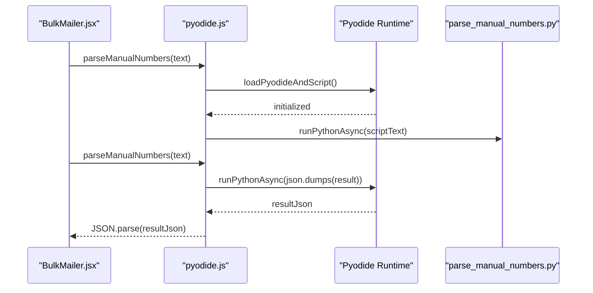
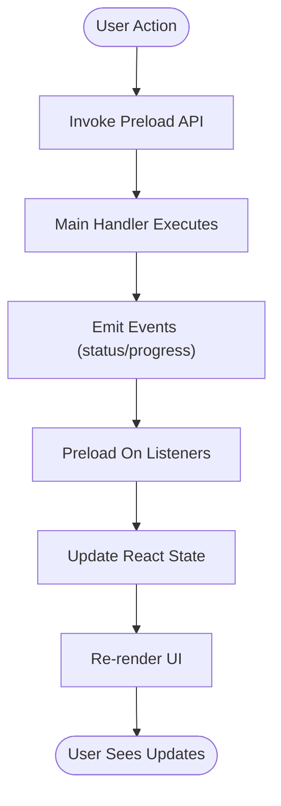
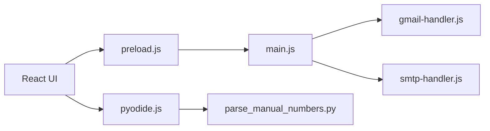

# UI service integration and IPC communication

## Introduction
This page explains how the React-based UI integrates with Electron's main process through Inter-Process Communication (IPC), how the preload script exposes secure Node.js APIs to the renderer, and how Pyodide enables browser-based Python execution. It covers message passing patterns, error handling across process boundaries, UI update coordination, and security considerations such as context isolation.

## Project structure
The Electron application is organized into:
- UI layer: React components under electron/src/ui and electron/src/components
- Electron main process: electron/src/electron/main.js orchestrates windows, IPC handlers, and services
- Preload bridge: electron/src/electron/preload.js exposes a controlled API surface to the renderer
- Services: Gmail and SMTP handlers under electron/src/electron
- Pyodide utilities: electron/src/utils/pyodide.js and Python scripts under electron/dist-react/py and electron/public/py

```mermaid
graph TB
subgraph "Renderer (React)"
UI["React UI<br/>App.jsx, main.jsx"]
Components["Components<br/>BulkMailer.jsx, WhatsAppForm.jsx"]
end
subgraph "Preload Bridge"
Preload["preload.js<br/>contextBridge exposeInMainWorld"]
end
subgraph "Main Process"
Main["main.js<br/>BrowserWindow, ipcMain handlers"]
Gmail["gmail-handler.js<br/>Gmail OAuth & send"]
SMTP["smtp-handler.js<br/>SMTP send"]
PyUtil["pyodide.js<br/>Pyodide loader"]
end
UI --> Components
Components --> Preload
Preload --> Main
Main --> Gmail
Main --> SMTP
Components --> PyUtil
PyUtil --> |"loads"| PyScript["parse_manual_numbers.py"]
```

## Core components
- Electron main process: Creates the BrowserWindow with context isolation enabled, registers IPC handlers for Gmail, SMTP, and WhatsApp, and manages the WhatsApp client lifecycle.
- Preload bridge: Exposes a typed API surface to the renderer via contextBridge, wrapping ipcRenderer.invoke and ipcRenderer.on.
- React UI: BulkMailer coordinates tabs and state, wires UI events to preload APIs, and renders real-time status updates.
- Pyodide integration: Dynamically loads Pyodide and executes a Python script to parse manual phone numbers in the renderer.

Key responsibilities:
- Secure exposure of Node.js capabilities through a minimal, typed API
- Real-time status updates via event-driven IPC channels
- Controlled rate-limiting and error propagation across processes
- Browser-based Python execution for contact parsing

## Architecture overview
The UI communicates with the main process using two primary patterns:
- Request-response via ipcRenderer.invoke and ipcMain.handle for synchronous operations
- Event streaming via ipcRenderer.on and event.sender.send for progress/status updates

```mermaid
sequenceDiagram
participant UI as "React Component"
participant Preload as "Preload Bridge"
participant Main as "Main Process"
participant Service as "Service Handler"
UI->>Preload : invoke("gmail-auth")
Preload->>Main : ipcMain.handle("gmail-auth")
Main->>Service : handleGmailAuth()
Service-->>Main : {success, error?}
Main-->>Preload : result
Preload-->>UI : result
Note over UI,Service : Progress updates use event channels
UI->>Preload : onProgress(callback)
Preload->>Main : ipcRenderer.on("email-progress", cb)
Main->>Service : send progress via event.sender.send
Service-->>Main : progress payload
Main-->>Preload : emits event
Preload-->>UI : callback invoked with progress
```

## Detailed component analysis

### IPC handlers and UI coordination
- Gmail authentication and sending:
  - Preload exposes authenticateGmail, getGmailToken, and sendEmail
  - Main registers ipcMain.handle for gmail-auth, gmail-token, and send-email
  - Gmail handler opens an OAuth window, exchanges tokens, stores credentials, and streams progress via email-progress events
- SMTP sending:
  - Preload exposes sendSMTPEmail
  - Main registers smtp-send handler that verifies transport, sends emails, and streams progress
- WhatsApp integration:
  - Preload exposes startWhatsAppClient, logoutWhatsApp, sendWhatsAppMessages, importWhatsAppContacts, and status listeners
  - Main creates a WhatsApp client with QR generation, emits status and QR events, and handles mass messaging with per-contact delays

```mermaid
sequenceDiagram
participant UI as "BulkMailer.jsx"
participant Preload as "preload.js"
participant Main as "main.js"
participant WA as "WhatsApp Client"
UI->>Preload : invoke("whatsapp-start-client")
Preload->>Main : ipcMain.handle("whatsapp-start-client")
Main->>WA : new Client(LocalAuth)
WA-->>Main : "qr", "ready", "authenticated", "disconnected"
Main-->>Preload : emit("whatsapp-qr"), emit("whatsapp-status")
Preload-->>UI : onWhatsAppQR/onWhatsAppStatus callbacks
UI->>Preload : invoke("whatsapp-send-messages", {contacts,messageText})
Preload->>Main : ipcMain.handle("whatsapp-send-messages")
Main->>WA : sendMessage for each contact
Main-->>Preload : emit("whatsapp-send-status")
Preload-->>UI : onWhatsAppSendStatus updates UI logs
```

### Preload script and security context
- The preload script uses contextBridge.exposeInMainWorld to publish a single API object electronAPI
- It wraps:
  - Gmail: authenticateGmail, getGmailToken, sendEmail
  - SMTP: sendSMTPEmail
  - File operations: importEmailList, readEmailListFile
  - Progress: onProgress
  - WhatsApp: startWhatsAppClient, logoutWhatsApp, sendWhatsAppMessages, importWhatsAppContacts, and three status listeners
- Security settings in BrowserWindow webPreferences:
  - nodeIntegration: false
  - contextIsolation: true
  - enableRemoteModule: false
  - webSecurity: true
  - preload path set to preload.js

```mermaid
classDiagram
class PreloadAPI {
+authenticateGmail()
+getGmailToken()
+sendEmail(emailData)
+sendSMTPEmail(smtpData)
+importEmailList()
+readEmailListFile(filePath)
+onProgress(callback)
+startWhatsAppClient()
+logoutWhatsApp()
+sendWhatsAppMessages(data)
+importWhatsAppContacts()
+onWhatsAppStatus(callback)
+onWhatsAppQR(callback)
+onWhatsAppSendStatus(callback)
}
class ElectronAPI {
<<exposed>>
}
PreloadAPI --> ElectronAPI : "exposeInMainWorld"
```

### Pyodide integration for browser-based Python execution
- The UI invokes parseManualNumbers from BulkMailer.jsx, which calls a utility in pyodide.js
- pyodide.js dynamically loads Pyodide from a CDN, initializes it, loads the Python script from the app's built resources, and executes a function that parses phone numbers
- The Python script cleans and validates phone numbers, supports name-number pairs, and returns structured contact data

```mermaid
sequenceDiagram
participant UI as "BulkMailer.jsx"
participant Util as "pyodide.js"
participant Py as "Pyodide Runtime"
participant Script as "parse_manual_numbers.py"
UI->>Util : parseManualNumbers(text)
Util->>Py : loadPyodideAndScript()
Py-->>Util : initialized
Util->>Script : runPythonAsync(scriptText)
UI->>Util : parseManualNumbers(text)
Util->>Py : runPythonAsync(json.dumps(result))
Py-->>Util : resultJson
Util-->>UI : JSON.parse(resultJson)
```

### UI update coordination and status streams
- WhatsApp status and QR updates:
  - Main process emits "whatsapp-status", "whatsapp-qr", and "whatsapp-send-status"
  - Preload forwards these via ipcRenderer.on listeners
  - BulkMailer subscribes in useEffect and updates local state for display
- Email progress:
  - Gmail and SMTP handlers send "email-progress" events during batch operations
  - Preload exposes onProgress; BulkMailer uses it to render live progress and results

```mermaid
flowchart TD
Start(["User Action"]) --> Invoke["Invoke Preload API"]
Invoke --> Handler["Main Handler Executes"]
Handler --> Emit["Emit Events (status/progress)"]
Emit --> Listener["Preload On Listeners"]
Listener --> UIState["Update React State"]
UIState --> Render["Re-render UI"]
Render --> End(["User Sees Updates"])
```

## Dependency analysis
- UI depends on preload for IPC primitives and on pyodide.js for Python parsing
- Preload depends on main process handlers for all operations
- Main process handlers depend on external libraries (Google APIs, Nodemailer, WhatsApp Web)
- Build system uses Vite to bundle the UI and serve from./dist-react

```mermaid
graph LR
UI["React UI"] --> Preload["preload.js"]
Preload --> Main["main.js"]
Main --> Gmail["gmail-handler.js"]
Main --> SMTP["smtp-handler.js"]
UI --> PyUtil["pyodide.js"]
PyUtil --> PyScript["parse_manual_numbers.py"]
```

## Performance considerations
- Rate limiting: Both Gmail and SMTP handlers introduce delays between emails to avoid throttling and respect provider limits
- Batch processing: WhatsApp sends messages with deliberate pauses to prevent rate limits and improve reliability
- Resource cleanup: Main process deletes cached WhatsApp files on logout and app close to free disk space and avoid stale sessions
- UI responsiveness: Event-driven updates keep the UI responsive while long-running tasks execute in the main process

[No sources needed since this section provides general guidance]

## Troubleshooting guide
Common issues and resolutions:
- Electron API not available in renderer:
  - Ensure preload is correctly injected via webPreferences.preload and that the app is running in Electron (not a static HTML page)
- Gmail authentication failures:
  - Verify environment variables for client ID and secret; check OAuth redirect URI and timeouts
- SMTP connection errors:
  - Confirm host/port/credentials; note that TLS verification is disabled for self-signed certs
- WhatsApp QR loading failures:
  - Retry initialization; check console for QR generation errors; ensure headless mode Puppeteer arguments are valid
- Pyodide load failures:
  - Confirm the Python script is bundled and reachable at the expected path; check network connectivity for CDN load

## Conclusion
The application achieves secure UI-service integration by isolating the renderer, exposing a minimal IPC API via preload, and delegating sensitive operations to the main process. Real-time status and progress are delivered through event channels, while Pyodide enables reliable contact parsing directly in the browser. Adhering to the documented patterns ensures reliable, maintainable, and secure inter-process communication.
