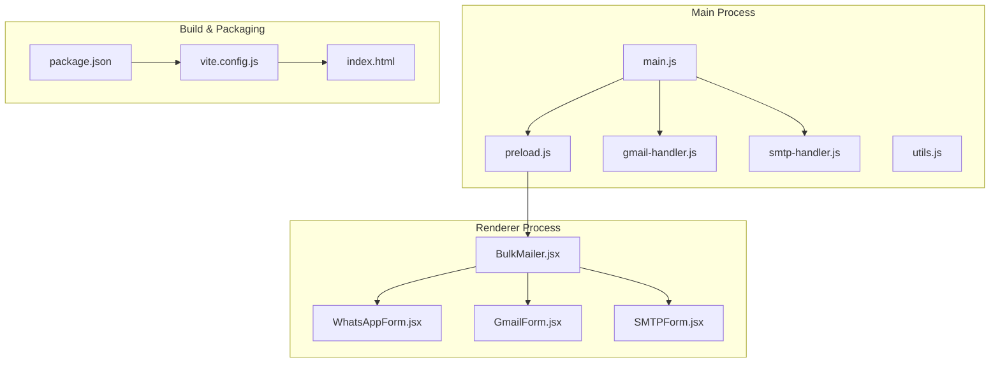
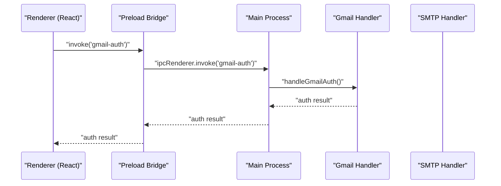
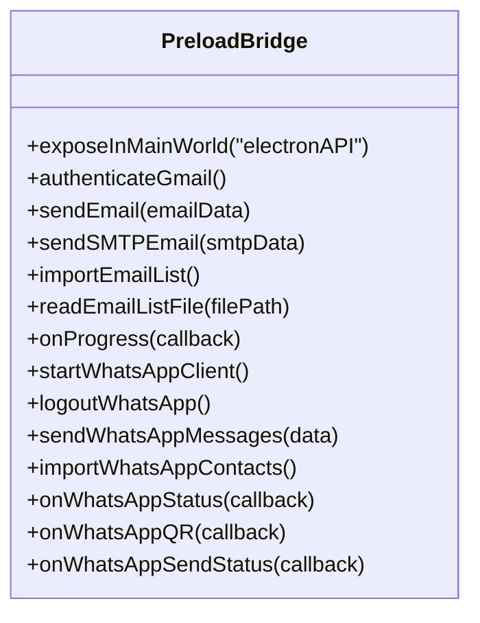
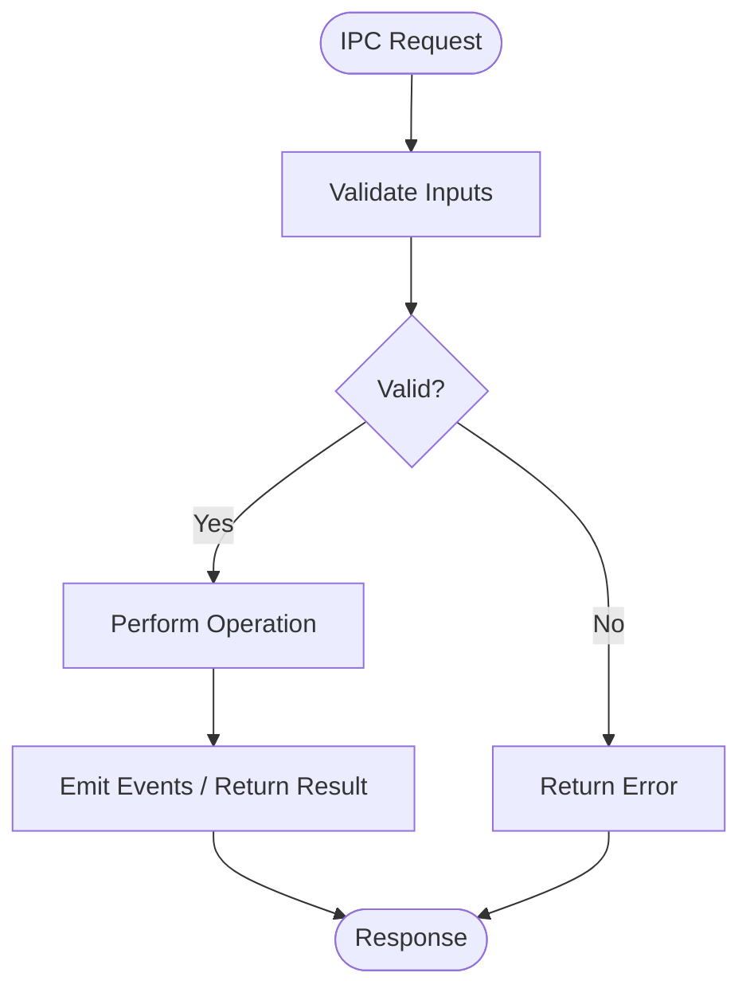
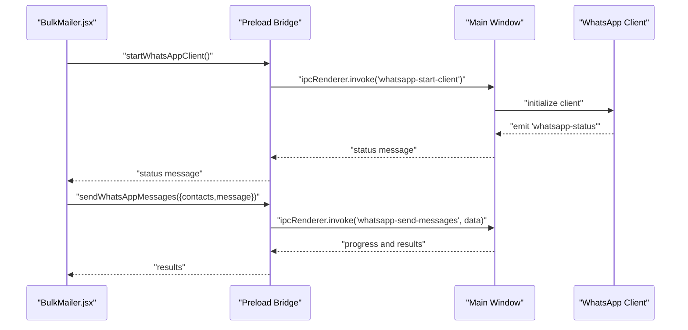
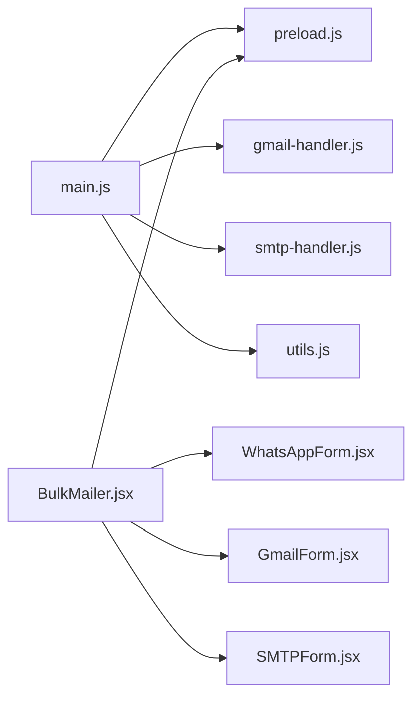

# Security Model and Isolation

<cite>
**Referenced Files in This Document**
- [main.js](file://electron/src/electron/main.js)
- [preload.js](file://electron/src/electron/preload.js)
- [gmail-handler.js](file://electron/src/electron/gmail-handler.js)
- [smtp-handler.js](file://electron/src/electron/smtp-handler.js)
- [utils.js](file://electron/src/electron/utils.js)
- [BulkMailer.jsx](file://electron/src/components/BulkMailer.jsx)
- [WhatsAppForm.jsx](file://electron/src/components/WhatsAppForm.jsx)
- [GmailForm.jsx](file://electron/src/components/GmailForm.jsx)
- [SMTPForm.jsx](file://electron/src/components/SMTPForm.jsx)
- [package.json](file://electron/package.json)
- [vite.config.js](file://electron/vite.config.js)
- [index.html](file://electron/index.html)
</cite>

## Table of Contents
1. [Introduction](#introduction)
2. [Project Structure](#project-structure)
3. [Core Components](#core-components)
4. [Architecture Overview](#architecture-overview)
5. [Detailed Component Analysis](#detailed-component-analysis)
6. [Dependency Analysis](#dependency-analysis)
7. [Performance Considerations](#performance-considerations)
8. [Troubleshooting Guide](#troubleshooting-guide)
9. [Conclusion](#conclusion)

## Introduction
This document explains the Electron security model implementation in the project, focusing on context isolation, preload scripts, and IPC security patterns. It documents the BrowserWindow webPreferences configuration, the responsibilities of the preload script, and how the main process restricts sensitive operations. It also covers input validation strategies and best practices for desktop application security aligned with Electron security guidelines.

## Project Structure
The Electron application is organized into:
- Main process code under electron/src/electron/, including BrowserWindow creation, IPC handlers, and platform integrations
- Renderer UI built with React and served via Vite, located under electron/src/ui/ and electron/src/components/
- Build and packaging configuration under electron/

**Diagram sources**
- [main.js](file://electron/src/electron/main.js#L20-L51)
- [preload.js](file://electron/src/electron/preload.js#L1-L41)
- [gmail-handler.js](file://electron/src/electron/gmail-handler.js#L1-L227)
- [smtp-handler.js](file://electron/src/electron/smtp-handler.js#L1-L110)
- [BulkMailer.jsx](file://electron/src/components/BulkMailer.jsx#L1-L482)
- [package.json](file://electron/package.json#L1-L49)
- [vite.config.js](file://electron/vite.config.js#L1-L17)
- [index.html](file://electron/index.html#L1-L13)

**Section sources**
- [main.js](file://electron/src/electron/main.js#L1-L51)
- [package.json](file://electron/package.json#L1-L49)

## Core Components
- BrowserWindow with security-focused webPreferences
- Preload script exposing a minimal Electron API surface to the renderer
- IPC handlers in the main process managing sensitive operations
- Renderer components validating inputs and delegating to the preload API

Key security configurations:
- nodeIntegration: false
- contextIsolation: true
- enableRemoteModule: false
- webSecurity: true
- preload script path configured

These settings enforce a strict boundary between the renderer and main process, preventing direct access to Node.js APIs from the renderer and isolating the context.

**Section sources**
- [main.js](file://electron/src/electron/main.js#L24-L30)
- [preload.js](file://electron/src/electron/preload.js#L1-L41)

## Architecture Overview
The application follows a secure IPC pattern:
- Renderer invokes window.electronAPI methods exposed by the preload script
- Preload script forwards requests to ipcRenderer.invoke
- Main process handles IPC via ipcMain.handle and performs sensitive operations
- Results are sent back via ipcRenderer.on listeners or response values

**Diagram sources**
- [preload.js](file://electron/src/electron/preload.js#L6-L8)
- [main.js](file://electron/src/electron/main.js#L103-L105)
- [gmail-handler.js](file://electron/src/electron/gmail-handler.js#L15-L130)

**Section sources**
- [main.js](file://electron/src/electron/main.js#L102-L108)
- [preload.js](file://electron/src/electron/preload.js#L4-L40)

## Detailed Component Analysis

### BrowserWindow Security Configuration
The BrowserWindow is created with strict security defaults:
- nodeIntegration: false prevents Node.js APIs from being directly accessible in the renderer
- contextIsolation: true ensures the renderer runs in an isolated world separate from the main context
- enableRemoteModule: false disables the remote module that could bypass context isolation
- webSecurity: true enforces same-origin policy and related security checks
- preload: path specifies the preload script that bridges the secure IPC channel

These settings form the foundation for a secure renderer.

**Section sources**
- [main.js](file://electron/src/electron/main.js#L20-L32)

### Preload Script Responsibilities
The preload script exposes a controlled API surface to the renderer:
- Uses contextBridge.exposeInMainWorld to publish window.electronAPI
- Exposes only whitelisted methods for Gmail, SMTP, file operations, and WhatsApp
- Provides event listeners for progress and status updates
- Delegates all sensitive operations to ipcRenderer.invoke

Responsibilities:
- Validate argument shapes before invoking IPC
- Return sanitized responses to the renderer
- Avoid exposing internal Electron APIs or Node.js modules
- Maintain a minimal interface to reduce attack surface

**Diagram sources**
- [preload.js](file://electron/src/electron/preload.js#L4-L40)

**Section sources**
- [preload.js](file://electron/src/electron/preload.js#L1-L41)

### IPC Handlers and Sensitive Operations
The main process registers ipcMain.handle handlers for all sensitive operations:
- Gmail: authentication, token retrieval, and email sending
- SMTP: email sending with configurable transport
- WhatsApp: client lifecycle, QR display, message sending, and logout
- File dialogs and parsing for email lists

Security patterns:
- Validate inputs and configuration before performing operations
- Use dedicated handler functions for each operation
- Emit progress/status events via event channels
- Clean up resources and sessions on logout or app exit

**Diagram sources**
- [gmail-handler.js](file://electron/src/electron/gmail-handler.js#L141-L214)
- [smtp-handler.js](file://electron/src/electron/smtp-handler.js#L6-L105)
- [main.js](file://electron/src/electron/main.js#L111-L177)

**Section sources**
- [gmail-handler.js](file://electron/src/electron/gmail-handler.js#L1-L227)
- [smtp-handler.js](file://electron/src/electron/smtp-handler.js#L1-L110)
- [main.js](file://electron/src/electron/main.js#L102-L108)

### Renderer Integration and Event Handling
The renderer integrates with the preload bridge:
- BulkMailer.jsx listens to WhatsApp status and QR events
- Uses window.electronAPI methods to trigger operations
- Validates forms and sanitizes inputs before invoking IPC
- Displays progress and results from emitted events

Security practices in the renderer:
- Input validation for email formats and numeric delays
- Controlled enabling/disabling of UI actions during long-running operations
- Graceful error handling and user feedback

**Diagram sources**
- [BulkMailer.jsx](file://electron/src/components/BulkMailer.jsx#L35-L58)
- [BulkMailer.jsx](file://electron/src/components/BulkMailer.jsx#L263-L288)
- [BulkMailer.jsx](file://electron/src/components/BulkMailer.jsx#L368-L415)
- [main.js](file://electron/src/electron/main.js#L111-L177)

**Section sources**
- [BulkMailer.jsx](file://electron/src/components/BulkMailer.jsx#L1-L482)
- [WhatsAppForm.jsx](file://electron/src/components/WhatsAppForm.jsx#L1-L609)

### Input Validation Strategies
The renderer implements client-side validation:
- Email list import validates presence of subject and message
- Email format validation using a regular expression
- Numeric delay validation and bounds
- Contact list validation for WhatsApp bulk messaging

Best practices:
- Validate early and fail fast
- Sanitize inputs before IPC
- Provide clear user feedback on validation failures
- Avoid relying solely on client-side validation for security-sensitive operations

**Section sources**
- [BulkMailer.jsx](file://electron/src/components/BulkMailer.jsx#L149-L179)
- [GmailForm.jsx](file://electron/src/components/GmailForm.jsx#L1-L332)
- [SMTPForm.jsx](file://electron/src/components/SMTPForm.jsx#L1-L390)

### Security Best Practices and Compliance
- Context Isolation: Enforced via webPreferences and contextBridge
- Minimal API Exposure: Only necessary methods exposed via preload
- IPC Validation: Main process validates all inputs and configuration
- Resource Cleanup: Sessions and temporary files cleaned on logout and app exit
- Environment Separation: Development vs production loading paths
- Secure Transport: SMTP TLS configuration and Gmail OAuth2 flow

[No sources needed since this section provides general guidance]

## Dependency Analysis
The main process depends on:
- Electron’s BrowserWindow, ipcMain, dialog, and filesystem APIs
- External libraries for email (googleapis, nodemailer), QR generation, and WhatsApp integration
- Preload script for secure IPC bridging

**Diagram sources**
- [main.js](file://electron/src/electron/main.js#L1-L12)
- [preload.js](file://electron/src/electron/preload.js#L1-L2)
- [gmail-handler.js](file://electron/src/electron/gmail-handler.js#L1-L6)
- [smtp-handler.js](file://electron/src/electron/smtp-handler.js#L1-L4)
- [BulkMailer.jsx](file://electron/src/components/BulkMailer.jsx#L1-L8)

**Section sources**
- [main.js](file://electron/src/electron/main.js#L1-L12)
- [package.json](file://electron/package.json#L20-L31)

## Performance Considerations
- Rate limiting delays between operations to respect service quotas
- Debounce or throttle UI interactions during long-running tasks
- Efficient event handling to avoid memory leaks (removing listeners)
- Minimize IPC chatter by batching operations when possible

[No sources needed since this section provides general guidance]

## Troubleshooting Guide
Common issues and resolutions:
- Electron API not available: Ensure preload is correctly configured and window.electronAPI is present
- Authentication timeouts: Check OAuth redirect URI and environment variables
- File import errors: Verify file filters and path resolution
- WhatsApp client initialization failures: Confirm network connectivity and puppeteer arguments

**Section sources**
- [gmail-handler.js](file://electron/src/electron/gmail-handler.js#L63-L125)
- [main.js](file://electron/src/electron/main.js#L47-L50)

## Conclusion
The application implements a robust Electron security model by enforcing context isolation, exposing a minimal preload API, and centralizing sensitive operations in the main process. Input validation occurs at both the renderer and main process boundaries, and IPC handlers provide structured, validated access to external services. These patterns align with Electron security guidelines and help protect against common vulnerabilities in desktop applications.