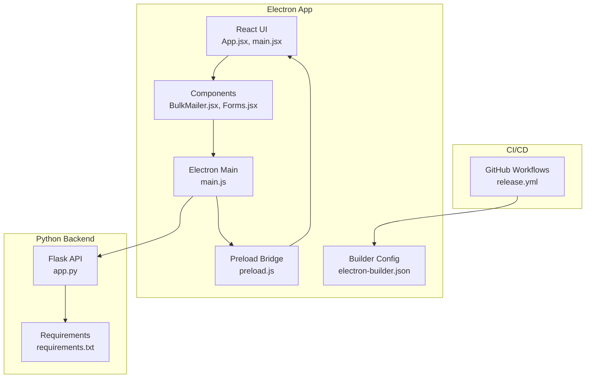
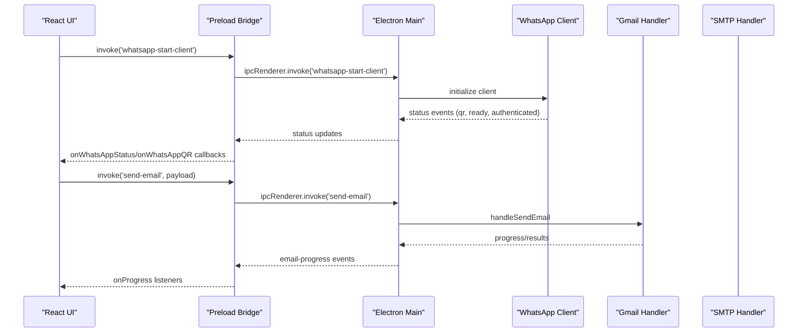
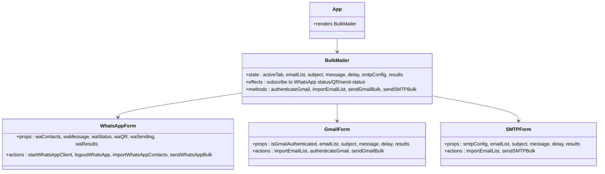
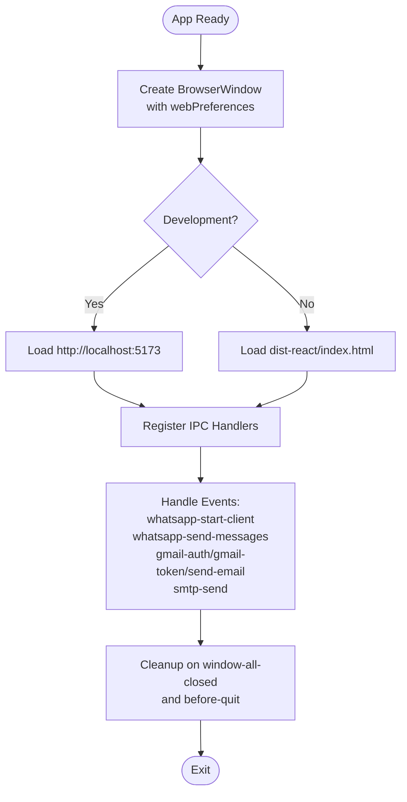
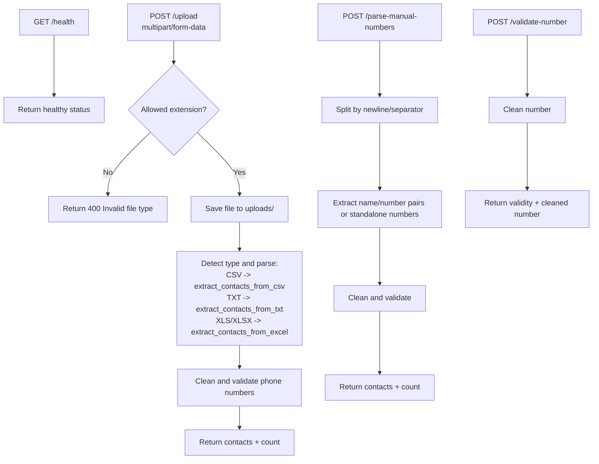
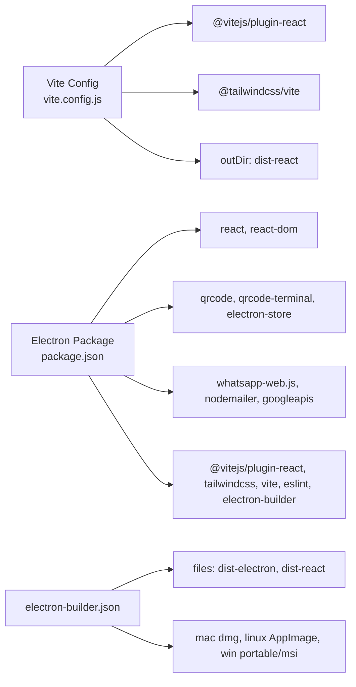
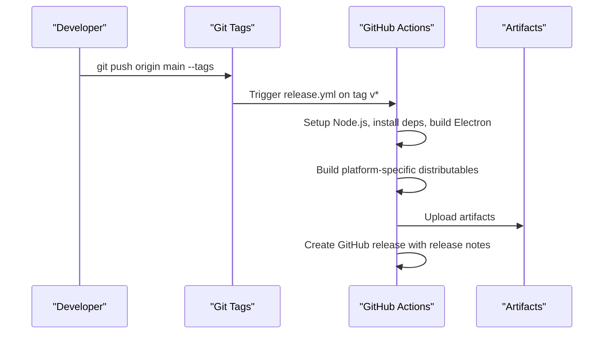

# Development Guidelines

<cite>
**Referenced Files in This Document**
- [README.md](file://README.md)
- [electron/package.json](file://electron/package.json)
- [electron/eslint.config.js](file://electron/eslint.config.js)
- [electron/vite.config.js](file://electron/vite.config.js)
- [electron/electron-builder.json](file://electron/electron-builder.json)
- [electron/src/ui/App.jsx](file://electron/src/ui/App.jsx)
- [electron/src/ui/main.jsx](file://electron/src/ui/main.jsx)
- [electron/src/electron/main.js](file://electron/src/electron/main.js)
- [electron/src/electron/preload.js](file://electron/src/electron/preload.js)
- [electron/src/components/BulkMailer.jsx](file://electron/src/components/BulkMailer.jsx)
- [electron/src/components/WhatsAppForm.jsx](file://electron/src/components/WhatsAppForm.jsx)
- [electron/src/components/GmailForm.jsx](file://electron/src/components/GmailForm.jsx)
- [electron/src/components/SMTPForm.jsx](file://electron/src/components/SMTPForm.jsx)
- [python-backend/app.py](file://python-backend/app.py)
- [python-backend/requirements.txt](file://python-backend/requirements.txt)
- [.github/workflows/release.yml](file://.github/workflows/release.yml)
</cite>

## Table of Contents
1. [Introduction](#introduction)
2. [Project Structure](#project-structure)
3. [Core Components](#core-components)
4. [Architecture Overview](#architecture-overview)
5. [Detailed Component Analysis](#detailed-component-analysis)
6. [Dependency Analysis](#dependency-analysis)
7. [Performance Considerations](#performance-considerations)
8. [Testing Strategies](#testing-strategies)
9. [Contribution Workflow](#contribution-workflow)
10. [Development Environment Setup](#development-environment-setup)
11. [Debugging Techniques](#debugging-techniques)
12. [Continuous Integration and Deployment](#continuous-integration-and-deployment)
13. [Code Review Standards](#code-review-standards)
14. [Documentation Requirements](#documentation-requirements)
15. [Quality Assurance Procedures](#quality-assurance-procedures)
16. [Troubleshooting Guide](#troubleshooting-guide)
17. [Conclusion](#conclusion)

## Introduction
This document provides comprehensive development guidelines for contributors and maintainers working on the Bulk Messaging System. It covers code style standards, component architecture, testing strategies, performance optimization, contribution workflow, environment setup, debugging, CI/CD processes, and quality assurance practices. The project combines an Electron desktop application with React for the UI, Python backend services for contact processing, and integrates with external APIs for WhatsApp and email services.

## Project Structure
The repository is organized into distinct areas:
- Electron application with React UI and Electron main/preload processes
- Python backend for contact processing and validation
- GitHub Actions workflows for CI/CD
- Local development utilities

**Diagram sources**
- [electron/src/ui/App.jsx](file://electron/src/ui/App.jsx#L1-L13)
- [electron/src/ui/main.jsx](file://electron/src/ui/main.jsx#L1-L11)
- [electron/src/electron/main.js](file://electron/src/electron/main.js#L1-L371)
- [electron/src/electron/preload.js](file://electron/src/electron/preload.js#L1-L41)
- [electron/electron-builder.json](file://electron/electron-builder.json#L1-L17)
- [python-backend/app.py](file://python-backend/app.py#L1-L378)
- [python-backend/requirements.txt](file://python-backend/requirements.txt#L1-L7)
- [.github/workflows/release.yml](file://.github/workflows/release.yml#L1-L102)

**Section sources**
- [README.md](file://README.md#L198-L236)
- [electron/package.json](file://electron/package.json#L1-L49)

## Core Components
- React UI and Application Shell
  - App.jsx renders the main application container and mounts BulkMailer.
  - main.jsx initializes the React root and renders App.
- Electron Main Process
  - main.js sets up the BrowserWindow, configures web preferences, handles IPC channels for Gmail, SMTP, and WhatsApp, and manages lifecycle events.
  - preload.js exposes a secure API surface to the renderer via contextBridge.
- Component Architecture
  - BulkMailer.jsx orchestrates tabs (WhatsApp, Gmail, SMTP), manages state, and coordinates IPC calls.
  - WhatsAppForm.jsx, GmailForm.jsx, and SMTPForm.jsx encapsulate UI and user interactions for each channel.
- Python Backend
  - app.py provides endpoints for contact upload, manual number parsing, and single number validation using Flask and pandas.

**Section sources**
- [electron/src/ui/App.jsx](file://electron/src/ui/App.jsx#L1-L13)
- [electron/src/ui/main.jsx](file://electron/src/ui/main.jsx#L1-L11)
- [electron/src/electron/main.js](file://electron/src/electron/main.js#L1-L371)
- [electron/src/electron/preload.js](file://electron/src/electron/preload.js#L1-L41)
- [electron/src/components/BulkMailer.jsx](file://electron/src/components/BulkMailer.jsx#L1-L482)
- [electron/src/components/WhatsAppForm.jsx](file://electron/src/components/WhatsAppForm.jsx#L1-L609)
- [electron/src/components/GmailForm.jsx](file://electron/src/components/GmailForm.jsx#L1-L332)
- [electron/src/components/SMTPForm.jsx](file://electron/src/components/SMTPForm.jsx#L1-L390)
- [python-backend/app.py](file://python-backend/app.py#L1-L378)

## Architecture Overview
The system follows a clear separation of concerns:
- Renderer (React) handles UI and user interactions
- Preload bridges secure IPC calls to the main process
- Main process executes Electron APIs, manages external integrations, and emits status updates
- Python backend provides reusable utilities for contact processing and validation

**Diagram sources**
- [electron/src/electron/main.js](file://electron/src/electron/main.js#L102-L177)
- [electron/src/electron/preload.js](file://electron/src/electron/preload.js#L1-L41)
- [electron/src/components/WhatsAppForm.jsx](file://electron/src/components/WhatsAppForm.jsx#L1-L609)
- [electron/src/components/GmailForm.jsx](file://electron/src/components/GmailForm.jsx#L1-L332)

## Detailed Component Analysis

### React Component Architecture Guidelines
- Prefer functional components with hooks for state and effects
- Centralize cross-tab state in BulkMailer.jsx and pass down props to specialized forms
- Use controlled components for inputs and derive derived state (e.g., recipient counts)
- Manage IPC subscriptions in useEffect and return cleanup functions to prevent leaks
- Keep UI components presentation-focused; delegate data fetching and side effects to the main process

**Diagram sources**
- [electron/src/ui/App.jsx](file://electron/src/ui/App.jsx#L1-L13)
- [electron/src/components/BulkMailer.jsx](file://electron/src/components/BulkMailer.jsx#L1-L482)
- [electron/src/components/WhatsAppForm.jsx](file://electron/src/components/WhatsAppForm.jsx#L1-L609)
- [electron/src/components/GmailForm.jsx](file://electron/src/components/GmailForm.jsx#L1-L332)
- [electron/src/components/SMTPForm.jsx](file://electron/src/components/SMTPForm.jsx#L1-L390)

**Section sources**
- [electron/src/ui/App.jsx](file://electron/src/ui/App.jsx#L1-L13)
- [electron/src/ui/main.jsx](file://electron/src/ui/main.jsx#L1-L11)
- [electron/src/components/BulkMailer.jsx](file://electron/src/components/BulkMailer.jsx#L1-L482)
- [electron/src/components/WhatsAppForm.jsx](file://electron/src/components/WhatsAppForm.jsx#L1-L609)
- [electron/src/components/GmailForm.jsx](file://electron/src/components/GmailForm.jsx#L1-L332)
- [electron/src/components/SMTPForm.jsx](file://electron/src/components/SMTPForm.jsx#L1-L390)

### Electron Main Process and IPC
- Security-first configuration: context isolation enabled, nodeIntegration disabled, preload script defines safe APIs
- IPC channels for WhatsApp (client lifecycle, QR, status, send), Gmail (auth, token, send), and SMTP (send)
- Robust error handling and cleanup on app close/quit
- Status updates propagated via ipcRenderer events to the renderer

**Diagram sources**
- [electron/src/electron/main.js](file://electron/src/electron/main.js#L20-L100)
- [electron/src/electron/main.js](file://electron/src/electron/main.js#L110-L177)
- [electron/src/electron/main.js](file://electron/src/electron/main.js#L179-L213)
- [electron/src/electron/main.js](file://electron/src/electron/main.js#L215-L262)
- [electron/src/electron/main.js](file://electron/src/electron/main.js#L264-L318)
- [electron/src/electron/main.js](file://electron/src/electron/main.js#L342-L371)

**Section sources**
- [electron/src/electron/main.js](file://electron/src/electron/main.js#L1-L371)
- [electron/src/electron/preload.js](file://electron/src/electron/preload.js#L1-L41)

### Python Backend Services
- Flask app with CORS enabled
- Endpoints for health checks, file uploads, manual number parsing, and single number validation
- Uses pandas for robust CSV/Excel parsing and regex-based phone number cleaning
- Secure file handling with allowed extensions and upload directory management

**Diagram sources**
- [python-backend/app.py](file://python-backend/app.py#L225-L229)
- [python-backend/app.py](file://python-backend/app.py#L232-L280)
- [python-backend/app.py](file://python-backend/app.py#L283-L341)
- [python-backend/app.py](file://python-backend/app.py#L343-L370)

**Section sources**
- [python-backend/app.py](file://python-backend/app.py#L1-L378)
- [python-backend/requirements.txt](file://python-backend/requirements.txt#L1-L7)

## Dependency Analysis
- Electron dependencies include React, TailwindCSS, whatsapp-web.js, nodemailer, googleapis, and qrcode libraries
- Vite is configured with React and Tailwind plugins, serving the React app locally and building to dist-react
- electron-builder bundles the React and Electron resources into platform-specific distributables

**Diagram sources**
- [electron/vite.config.js](file://electron/vite.config.js#L1-L17)
- [electron/package.json](file://electron/package.json#L1-L49)
- [electron/electron-builder.json](file://electron/electron-builder.json#L1-L17)

**Section sources**
- [electron/package.json](file://electron/package.json#L1-L49)
- [electron/vite.config.js](file://electron/vite.config.js#L1-L17)
- [electron/electron-builder.json](file://electron/electron-builder.json#L1-L17)

## Performance Considerations
- Electron
  - Headless browser mode for WhatsApp client reduces overhead; ensure sandbox and GPU flags are configured appropriately
  - Minimize heavy DOM rendering; leverage virtualized lists for large contact/email previews
  - Debounce user input for large text areas to reduce re-renders
- React
  - Use React.memo for components that render large lists (e.g., contact previews)
  - Split heavy computations into Web Workers or preload-bound tasks
  - Avoid unnecessary re-renders by memoizing derived values and callbacks
- Python Backend
  - Use pandas vectorized operations for CSV/Excel parsing
  - Stream file reads/writes to avoid loading entire files into memory
  - Cache validated numbers where appropriate to reduce repeated validations
- IPC
  - Batch status updates to reduce IPC overhead
  - Use throttled progress events for long-running operations

[No sources needed since this section provides general guidance]

## Testing Strategies
- Unit Testing
  - React: Use a testing library to test pure functions and component logic (e.g., form validation, state transitions)
  - Python: Write pytest tests for app.py endpoints, ensuring coverage of parsing, validation, and error paths
- Integration Testing
  - Electron: Mock IPC handlers to simulate WhatsApp/Gmail/SMTP flows without external dependencies
  - End-to-end: Use a testing framework to automate UI interactions and verify IPC events
- End-to-End Testing
  - Electron: Automate user flows (connect to WhatsApp, import contacts, send messages) and assert status updates
  - Python: Validate backend endpoints with realistic payloads and edge cases

[No sources needed since this section provides general guidance]

## Contribution Workflow
- Fork the repository and create feature branches with descriptive names
- Follow code style standards enforced by ESLint
- Add tests for new features and update documentation
- Ensure cross-platform compatibility and thorough testing before opening a pull request

**Section sources**
- [README.md](file://README.md#L369-L384)

## Development Environment Setup
- Prerequisites
  - Node.js 16+ and npm for the Electron app
  - Python 3.8+ for backend utilities
  - Google Cloud Console credentials for Gmail API
  - WhatsApp account and SMTP server credentials
- Installation
  - Install Electron dependencies in the electron directory
  - Install Python backend dependencies in python-backend
  - Start the development server from the electron directory
- Configuration
  - Create a .env file in the electron directory with GOOGLE_CLIENT_ID and GOOGLE_CLIENT_SECRET
  - Configure SMTP settings for email sending

**Section sources**
- [README.md](file://README.md#L61-L98)
- [README.md](file://README.md#L111-L118)
- [README.md](file://README.md#L120-L133)

## Debugging Techniques
- Electron
  - Use DevTools in development mode; main process logs are visible in terminal
  - Inspect network requests and IPC traffic in DevTools
  - Validate preload exposure and IPC handler registration
- React
  - Use React DevTools to inspect component props/state
  - Add console logs for IPC callbacks and status updates
- Python Backend
  - Enable Flask debug mode for development
  - Validate file uploads and endpoint responses with curl or Postman

**Section sources**
- [electron/src/electron/main.js](file://electron/src/electron/main.js#L34-L37)
- [python-backend/app.py](file://python-backend/app.py#L372-L378)

## Continuous Integration and Deployment
- GitHub Actions workflows
  - Release workflow builds Electron apps for macOS, Linux, and Windows
  - Distributables include platform-specific packages (DMG, AppImage, EXE, MSI, ZIP, TAR.GZ)
  - Release notes are generated automatically
- Release Process
  - Update version in electron/package.json
  - Push git tags to trigger the workflow
  - Review artifacts and finalize releases

**Diagram sources**
- [.github/workflows/release.yml](file://.github/workflows/release.yml#L1-L102)

**Section sources**
- [.github/workflows/release.yml](file://.github/workflows/release.yml#L1-L102)
- [README.md](file://README.md#L284-L332)

## Code Review Standards
- Code Style
  - Adhere to ESLint configuration for JavaScript/React
  - Use functional components with hooks and avoid class components
- Security
  - Never expose sensitive data in the renderer process
  - Validate and sanitize all user inputs
- Reliability
  - Implement proper error boundaries and graceful degradation
  - Ensure cleanup of external resources (WhatsApp sessions, file handles)
- Documentation
  - Update README for new features and configuration changes
  - Comment complex logic and trade-offs

**Section sources**
- [README.md](file://README.md#L276-L283)
- [electron/eslint.config.js](file://electron/eslint.config.js#L1-L34)

## Documentation Requirements
- Keep README updated with installation, configuration, and usage instructions
- Document new endpoints, configuration options, and breaking changes
- Provide troubleshooting sections for common issues

**Section sources**
- [README.md](file://README.md#L412-L455)

## Quality Assurance Procedures
- Automated Checks
  - Linting with ESLint
  - Building and packaging verification
- Manual QA
  - Cross-platform testing (Windows, macOS, Linux)
  - End-to-end user flows for WhatsApp, Gmail, and SMTP
- Security Review
  - Audit context isolation and IPC exposure
  - Validate OAuth2 and SMTP credential handling

**Section sources**
- [README.md](file://README.md#L333-L341)
- [electron/eslint.config.js](file://electron/eslint.config.js#L1-L34)

## Troubleshooting Guide
- Common Issues
  - WhatsApp QR code not loading: check internet connection and restart the app
  - Gmail authentication failure: verify OAuth2 credentials and API enablement
  - SMTP connection issues: confirm server settings, firewall, and port/security
  - Contact import errors: verify file format, encoding, and column headers
- Support
  - Check README troubleshooting section
  - Review existing issues and create new ones with system information and error logs

**Section sources**
- [README.md](file://README.md#L412-L447)

## Conclusion
This document consolidates development practices for the Bulk Messaging System. By following the outlined guidelines—code style, component architecture, testing, performance, contribution workflow, environment setup, debugging, CI/CD, code review, documentation, and QA—you can contribute effectively and maintain a high-quality, secure, and reliable application across Electron, React, and Python backend components.