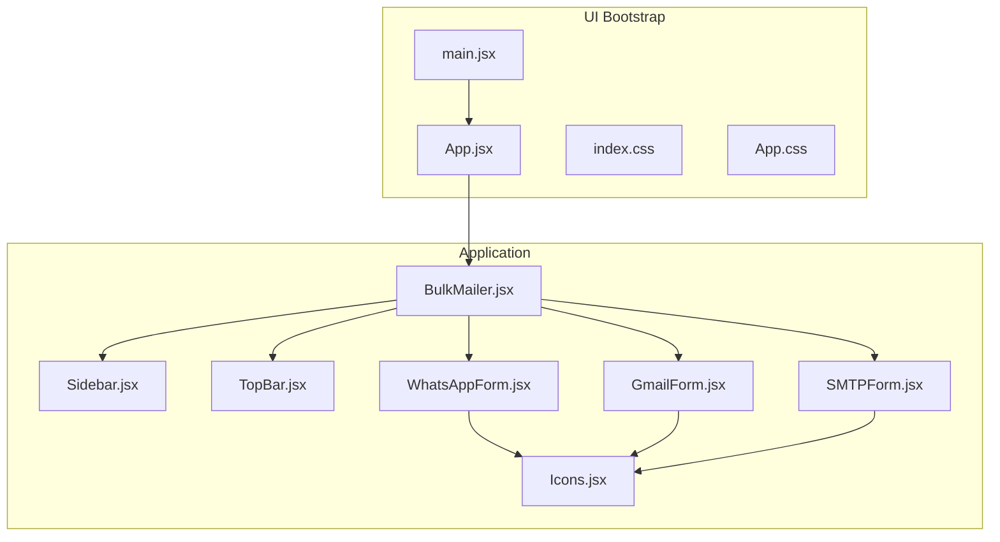
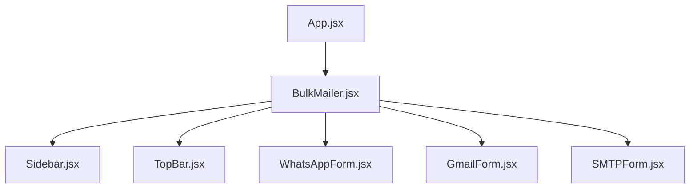
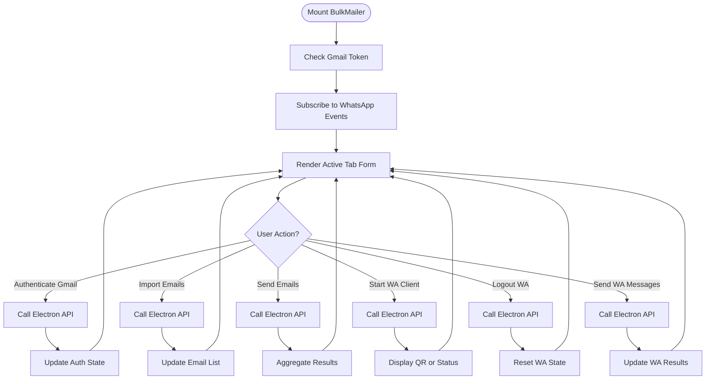
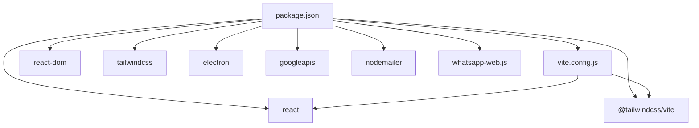

# Frontend user interface

## Introduction
This page describes the React-based user interface architecture for the WhatsApp and email bulk messaging application. It focuses on the component hierarchy starting with App.jsx as the main container and BulkMailer.jsx as the primary application component. The documentation covers the sidebar navigation system, top bar functionality, responsive design using Tailwind CSS, state management patterns with React hooks, modular component architecture, styling guidelines, theme implementation, dark mode support, accessibility features, cross-platform UI consistency, and performance optimization techniques.

## Project structure
The frontend is organized into two main areas:
- UI bootstrap and global styles: electron/src/ui
- Application components and forms: electron/src/components

Key files:
- App.jsx: Root container rendering the main application
- main.jsx: React root initialization and mounting
- BulkMailer.jsx: Central orchestrator managing tabs, state, and Electron API integration
- Sidebar.jsx and TopBar.jsx: Navigation and header components
- WhatsAppForm.jsx, GmailForm.jsx, SMTPForm.jsx: Feature-specific forms
- Icons.jsx: Reusable SVG icon components
- vite.config.js and package.json: Build and dependency configuration
- index.html and dist-react/index.html: HTML entry points for development and production

```mermaid
graph TB
subgraph "UI Bootstrap"
MAIN["main.jsx"]
APP["App.jsx"]
INDEXCSS["index.css"]
APPCSS["App.css"]
end
subgraph "Application"
BULKMAILER["BulkMailer.jsx"]
SIDEBAR["Sidebar.jsx"]
TOPBAR["TopBar.jsx"]
WHATSAPP["WhatsAppForm.jsx"]
GMAIL["GmailForm.jsx"]
SMTP["SMTPForm.jsx"]
ICONS["Icons.jsx"]
end
MAIN --> APP
APP --> BULKMAILER
BULKMAILER --> SIDEBAR
BULKMAILER --> TOPBAR
BULKMAILER --> WHATSAPP
BULKMAILER --> GMAIL
BULKMAILER --> SMTP
WHATSAPP --> ICONS
GMAIL --> ICONS
SMTP --> ICONS
```

## Core components
- App.jsx: Minimal wrapper that renders the main BulkMailer component and applies global CSS.
- BulkMailer.jsx: Central state hub managing tab selection, Electron API integrations, form validation, and rendering the active form.
- Sidebar.jsx: Vertical navigation with icons for switching between Gmail, SMTP, and WhatsApp tabs.
- TopBar.jsx: Header displaying the current active tab and descriptive subtitle.
- Form components: Modular forms for each transport method, encapsulating their own state and actions.
- Icons.jsx: Shared SVG icons used across forms and navigation.

State management highlights:
- Local state via React hooks for UI state, form inputs, and operation results.
- Electron API integration for authentication, file import, QR display, and sending operations.
- Tab-based routing without a router library, using a single activeTab state.

## Architecture overview
The application follows a container/presentational pattern:
- App.jsx mounts the application.
- BulkMailer.jsx acts as the container, holding state and coordinating Electron API calls.
- Sidebar and TopBar are presentational components receiving props for interactivity.
- Each form component is self-contained with its own state and actions.

```mermaid
graph TB
APP["App.jsx"]
BM["BulkMailer.jsx"]
SB["Sidebar.jsx"]
TB["TopBar.jsx"]
WF["WhatsAppForm.jsx"]
GF["GmailForm.jsx"]
SF["SMTPForm.jsx"]
APP --> BM
BM --> SB
BM --> TB
BM --> WF
BM --> GF
BM --> SF
```

## Detailed component analysis

### App.jsx and main.jsx
- main.jsx initializes the React root and mounts App.jsx.
- App.jsx renders BulkMailer inside a styled container and imports global CSS.

Implementation notes:
- StrictMode enabled during development.
- Global CSS files are imported for base styles and animations.

### BulkMailer.jsx
Responsibilities:
- Manage active tab state and render the appropriate form.
- Integrate with Electron APIs for Gmail authentication, email import, and sending.
- Manage WhatsApp client lifecycle, QR display, and message sending.
- Validate forms and orchestrate async operations with loading states.

Key patterns:
- useState/useEffect for local state and side effects.
- Event listeners for WhatsApp status updates.
- Conditional rendering based on activeTab.
- Form validation helpers and result aggregation.

```mermaid
flowchart TD
Start(["Mount BulkMailer"]) --> CheckAuth["Check Gmail Token"]
CheckAuth --> InitListeners["Subscribe to WhatsApp Events"]
InitListeners --> Render["Render Active Tab Form"]
Render --> UserAction{"User Action?"}
UserAction --> |Authenticate Gmail| Auth["Call Electron API"]
UserAction --> |Import Emails| Import["Call Electron API"]
UserAction --> |Send Emails| SendEmails["Call Electron API"]
UserAction --> |Start WA Client| StartWA["Call Electron API"]
UserAction --> |Logout WA| LogoutWA["Call Electron API"]
UserAction --> |Send WA Messages| SendWA["Call Electron API"]
Auth --> UpdateState["Update Auth State"]
Import --> UpdateEmails["Update Email List"]
SendEmails --> Results["Aggregate Results"]
StartWA --> QR["Display QR or Status"]
LogoutWA --> Reset["Reset WA State"]
SendWA --> WAResults["Update WA Results"]
UpdateState --> Render
UpdateEmails --> Render
Results --> Render
QR --> Render
Reset --> Render
WAResults --> Render
```

### Sidebar.jsx
Responsibilities:
- Provide vertical navigation with three icons for Gmail, SMTP, and WhatsApp.
- Apply active state styling based on activeTab.
- Trigger tab changes via onClick handlers.

Design details:
- Fixed width sidebar with centered items.
- Hover and active states with transitions.
- Consistent icon sizing and color scheme.

### TopBar.jsx
Responsibilities:
- Display the current active tab and a descriptive subtitle.
- Provide a consistent header across all views.

Styling:
- Backdrop blur and semi-transparent background for depth.
- Text color and typography aligned with dark theme.

### WhatsAppForm.jsx
Responsibilities:
- Manage WhatsApp connection lifecycle (start, logout).
- Handle QR code display and retry logic.
- Import and manage contact lists (CSV/Text).
- Compose and send mass messages with real-time logging.

State and UX:
- Separate logs and results streams.
- Real-time status indicators with color-coded feedback.
- Manual number input with parsing and validation.
- Disabled states during sending operations.

### GmailForm.jsx
Responsibilities:
- Authenticate with Gmail via Electron API.
- Import email lists and compose bulk emails.
- Configure delay and send via Gmail API.

UX:
- Authentication status indicator.
- Recipient count and readiness checks.
- Real-time email status logging.

### SMTPForm.jsx
Responsibilities:
- Configure SMTP settings (host, port, credentials, SSL).
- Import email lists and compose bulk emails.
- Send via configured SMTP server with delay control.

UX:
- Configuration validation and readiness indicator.
- Recipient count and status display.
- Real-time email status logging.

### Icons.jsx
Responsibilities:
- Provide reusable SVG icons for consistent UI.
- Used across Sidebar and Forms for visual cues.

## Dependency analysis
Build and runtime dependencies:
- React 19 and React DOM for UI rendering.
- Tailwind CSS v4 and @tailwindcss/vite for styling.
- Vite for development server and bundling.
- Electron and related packages for desktop integration.

```mermaid
graph TB
VITE["vite.config.js"]
PKG["package.json"]
REACT["react"]
REACTDOM["react-dom"]
TWCSS["tailwindcss"]
TWCSSVITE["@tailwindcss/vite"]
ELECTRON["electron"]
GOOGLEAPIS["googleapis"]
NODMAILER["nodemailer"]
WWEBJS["whatsapp-web.js"]
PKG --> REACT
PKG --> REACTDOM
PKG --> TWCSS
PKG --> TWCSSVITE
PKG --> VITE
PKG --> ELECTRON
PKG --> GOOGLEAPIS
PKG --> NODMAILER
PKG --> WWEBJS
VITE --> TWCSSVITE
VITE --> REACT
```

## Performance considerations
- Component-level state isolation reduces unnecessary re-renders within forms.
- Conditional rendering of forms minimizes DOM overhead.
- Disabled states prevent redundant operations during async tasks.
- Efficient Tailwind utilities avoid heavy CSS overrides.
- Consider lazy-loading forms for very large datasets or infrequent usage.
- Memoization of derived values (e.g., recipient counts) can reduce recomputation.
- Debounced input handling for large text areas if needed.

[No sources needed since this section provides general guidance]

## Troubleshooting guide
Common issues and resolutions:
- Electron API not available: Ensure the app runs in the Electron environment; alerts guide users accordingly.
- Gmail authentication failures: Verify OAuth configuration and network connectivity; check returned error messages.
- WhatsApp QR loading errors: Retry connection or check console logs; provide explicit retry action.
- Form validation errors: Clear invalid entries and ensure required fields are filled.
- Build issues: Confirm Tailwind and Vite plugin configurations; verify dependencies in package.json.

## Conclusion
The React-based UI is structured around a central container (BulkMailer.jsx) that manages state, integrates with Electron APIs, and renders modular forms for different messaging transports. The design uses Tailwind CSS for a cohesive dark theme, responsive layouts, and accessible focus styles. The component architecture supports easy extension and customization, enabling incremental feature additions and UI refinements. With careful attention to state management, error handling, and performance, the application maintains a consistent cross-platform UI experience.
