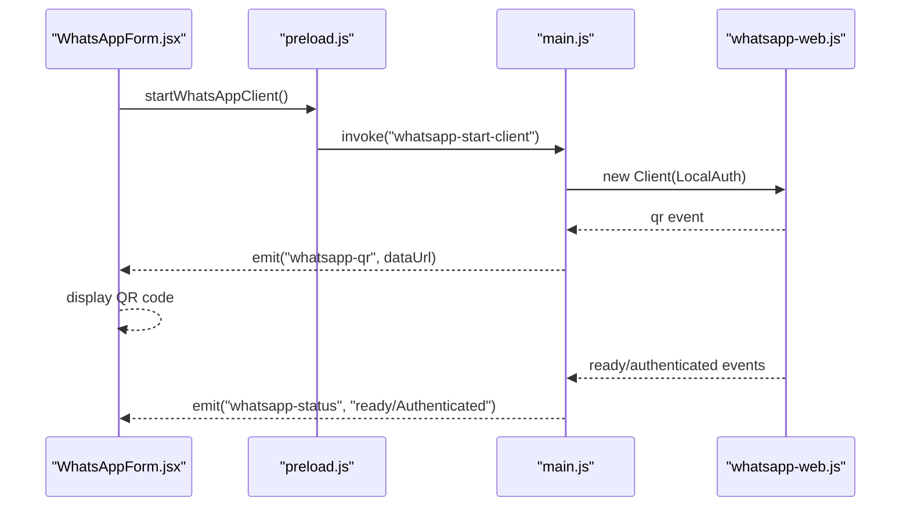
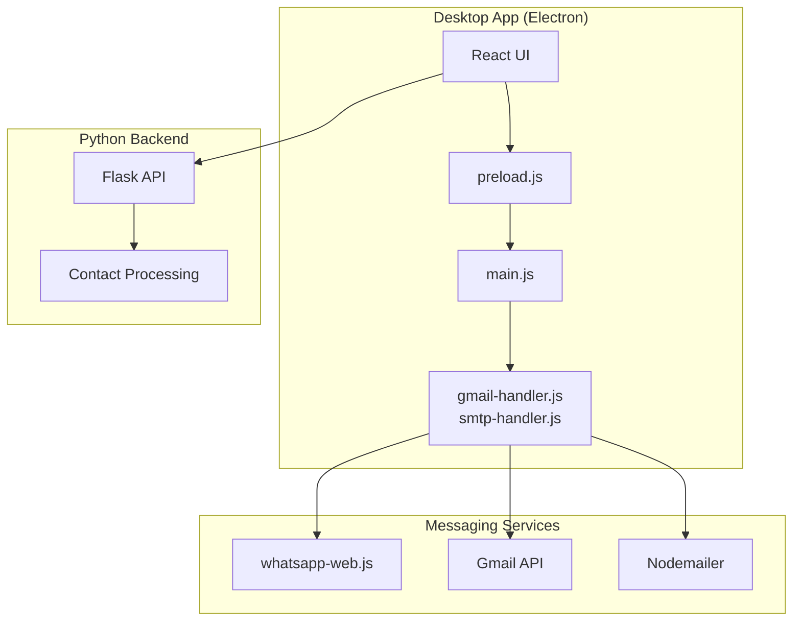
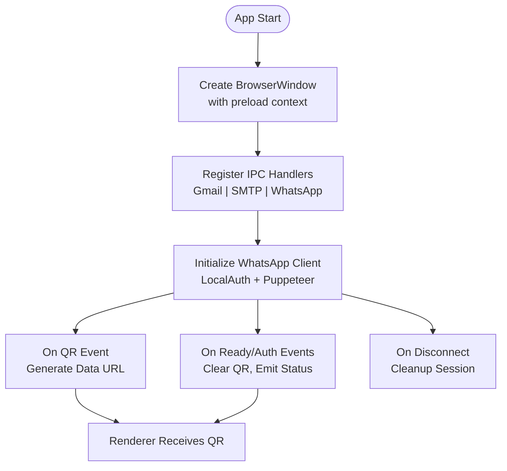
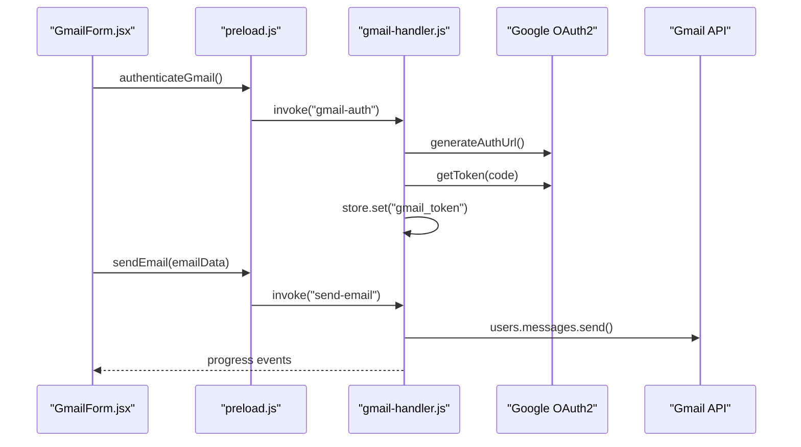

# Getting Started

<cite>
**Referenced Files in This Document**
- [README.md](file://README.md)
- [package.json](file://electron/package.json)
- [requirements.txt](file://python-backend/requirements.txt)
- [main.js](file://electron/src/electron/main.js)
- [gmail-handler.js](file://electron/src/electron/gmail-handler.js)
- [smtp-handler.js](file://electron/src/electron/smtp-handler.js)
- [preload.js](file://electron/src/electron/preload.js)
- [vite.config.js](file://electron/vite.config.js)
- [electron-builder.json](file://electron/electron-builder.json)
- [app.py](file://python-backend/app.py)
- [WhatsAppForm.jsx](file://electron/src/components/WhatsAppForm.jsx)
- [GmailForm.jsx](file://electron/src/components/GmailForm.jsx)
- [SMTPForm.jsx](file://electron/src/components/SMTPForm.jsx)
</cite>

## Table of Contents
1. [Introduction](#introduction)
2. [Prerequisites](#prerequisites)
3. [Installation](#installation)
4. [Environment Configuration](#environment-configuration)
5. [Initial Setup Workflow](#initial-setup-workflow)
6. [Quick Start Examples](#quick-start-examples)
7. [Architecture Overview](#architecture-overview)
8. [Detailed Component Analysis](#detailed-component-analysis)
9. [Dependency Analysis](#dependency-analysis)
10. [Troubleshooting Guide](#troubleshooting-guide)
11. [Verification Steps](#verification-steps)
12. [Next Steps](#next-steps)

## Introduction
This guide helps you set up and run the WhatsappBulkMessaging desktop application. It covers prerequisites, installation, environment configuration, initial setup, quick start examples for each messaging service, troubleshooting, and verification steps. The application combines an Electron + React frontend with a Python backend for advanced contact processing.

## Prerequisites
Ensure your system meets these requirements before installing:
- Node.js 16 or newer
- Python 3.8 or newer
- Google Cloud Console access for Gmail API
- A WhatsApp account
- SMTP server credentials (if using SMTP method)

These prerequisites are documented in the project's Getting Started section.

**Section sources**
- [README.md](file://README.md#L61-L67)

## Installation
Follow these step-by-step instructions to install the application:

1. Clone the repository:
   ```bash
   git clone https://github.com/tashifkhan/bulk-messaging-system
   cd WhatsappBulkMessaging
   ```

2. Install Electron dependencies:
   ```bash
   cd electron
   npm install
   ```

3. Install Python backend dependencies:
   ```bash
   cd ../python-backend
   pip install -r requirements.txt
   ```

4. Start the development server:
   ```bash
   # From the electron directory
   npm run dev
   ```

This starts both the React development server and the Electron main process concurrently.

**Section sources**
- [README.md](file://README.md#L69-L97)
- [package.json](file://electron/package.json#L7-L18)
- [requirements.txt](file://python-backend/requirements.txt#L1-L7)

## Environment Configuration
Configure environment variables for Gmail API authentication:

1. Create a `.env` file in the `electron` directory with your Google OAuth2 credentials:
   ```
   GOOGLE_CLIENT_ID=your_client_id_here
   GOOGLE_CLIENT_SECRET=your_client_secret_here
   ```

2. Follow the Gmail API setup steps in the project documentation to create credentials and enable the Gmail API.

These configurations enable secure OAuth2 authentication for Gmail API integration.

**Section sources**
- [README.md](file://README.md#L111-L118)
- [README.md](file://README.md#L101-L109)
- [gmail-handler.js](file://electron/src/electron/gmail-handler.js#L15-L29)

## Initial Setup Workflow
Connect to WhatsApp using QR code authentication:

1. Open the application and navigate to the WhatsApp tab.
2. Click "Connect to WhatsApp".
3. Scan the QR code displayed in the app using your phone's WhatsApp.
4. Wait for authentication to complete.

The Electron main process manages the WhatsApp client lifecycle, handles QR generation, and emits status updates to the renderer.



**Diagram sources**
- [WhatsAppForm.jsx](file://electron/src/components/WhatsAppForm.jsx#L14-L18)
- [preload.js](file://electron/src/electron/preload.js#L23-L39)
- [main.js](file://electron/src/electron/main.js#L110-L177)

**Section sources**
- [README.md](file://README.md#L136-L143)
- [main.js](file://electron/src/electron/main.js#L110-L177)
- [WhatsAppForm.jsx](file://electron/src/components/WhatsAppForm.jsx#L176-L278)

## Quick Start Examples
### WhatsApp Messaging
1. Connect to WhatsApp using the QR code workflow described above.
2. Import contacts via CSV/Excel or add numbers manually.
3. Compose your message, optionally using `{{name}}` for personalization.
4. Set a delay between messages and click "Send Mass Messages".

The Electron main process sends messages using the WhatsApp Web client and reports progress.

**Section sources**
- [README.md](file://README.md#L136-L160)
- [main.js](file://electron/src/electron/main.js#L179-L213)
- [WhatsAppForm.jsx](file://electron/src/components/WhatsAppForm.jsx#L433-L490)

### Gmail API
1. Navigate to the Gmail tab.
2. Click "Authenticate Gmail" to open the OAuth consent flow.
3. After successful authentication, import or enter email addresses.
4. Compose your email (subject and HTML content supported).
5. Set the delay between emails and click "Send Bulk Email".

The Gmail handler manages OAuth2 flow and sends emails via the Gmail API.

**Section sources**
- [README.md](file://README.md#L164-L171)
- [gmail-handler.js](file://electron/src/electron/gmail-handler.js#L15-L130)
- [GmailForm.jsx](file://electron/src/components/GmailForm.jsx#L61-L101)

### SMTP
1. Navigate to the SMTP tab.
2. Enter your SMTP server configuration (host, port, username, password).
3. Optionally enable secure connection (SSL/TLS).
4. Import or enter email addresses.
5. Compose your email and set the delay between emails.
6. Click "Send SMTP Email".

The SMTP handler validates configuration, connects to the server, and sends emails.

**Section sources**
- [README.md](file://README.md#L173-L180)
- [smtp-handler.js](file://electron/src/electron/smtp-handler.js#L6-L105)
- [SMTPForm.jsx](file://electron/src/components/SMTPForm.jsx#L66-L163)

## Architecture Overview
The application follows a hybrid architecture combining Electron + React for the UI and Python for backend utilities.



**Diagram sources**
- [main.js](file://electron/src/electron/main.js#L1-L50)
- [gmail-handler.js](file://electron/src/electron/gmail-handler.js#L1-L20)
- [smtp-handler.js](file://electron/src/electron/smtp-handler.js#L1-L10)
- [app.py](file://python-backend/app.py#L1-L20)

**Section sources**
- [README.md](file://README.md#L43-L57)
- [package.json](file://electron/package.json#L20-L31)

## Detailed Component Analysis

### Electron Main Process
The main process orchestrates:
- Window creation and development vs production loading
- IPC handlers for Gmail, SMTP, and WhatsApp
- WhatsApp client lifecycle (init, QR, ready, authenticated, disconnected)
- Contact import and email list parsing



**Diagram sources**
- [main.js](file://electron/src/electron/main.js#L20-L100)
- [main.js](file://electron/src/electron/main.js#L110-L177)

**Section sources**
- [main.js](file://electron/src/electron/main.js#L1-L100)
- [main.js](file://electron/src/electron/main.js#L110-L177)

### Gmail Handler
Handles OAuth2 authentication and email sending:
- Validates environment variables
- Opens browser window for consent
- Exchanges authorization code for tokens
- Stores tokens securely
- Sends emails with progress reporting



**Diagram sources**
- [gmail-handler.js](file://electron/src/electron/gmail-handler.js#L15-L130)
- [gmail-handler.js](file://electron/src/electron/gmail-handler.js#L141-L214)
- [GmailForm.jsx](file://electron/src/components/GmailForm.jsx#L3-L18)

**Section sources**
- [gmail-handler.js](file://electron/src/electron/gmail-handler.js#L1-L139)
- [gmail-handler.js](file://electron/src/electron/gmail-handler.js#L141-L227)

### SMTP Handler
Manages SMTP configuration and sending:
- Validates SMTP config
- Saves credentials securely (excluding password)
- Verifies connection
- Sends emails with rate limiting and progress reporting

**Section sources**
- [smtp-handler.js](file://electron/src/electron/smtp-handler.js#L1-L110)
- [SMTPForm.jsx](file://electron/src/components/SMTPForm.jsx#L66-L163)

### Python Backend API
Provides contact processing utilities:
- Upload and parse CSV/Excel/Text files
- Clean and validate phone numbers
- Parse manually entered numbers
- Validate individual numbers

**Section sources**
- [app.py](file://python-backend/app.py#L225-L378)

## Dependency Analysis
Key dependencies and their roles:

```mermaid
graph LR
subgraph "Electron Dependencies"
React[react@^19]
Tailwind[tailwindcss@^4]
WA[whatsapp-web.js@^1.30]
Nodemailer[nodemailer@^7]
Googleapis[googleapis@^150]
end
subgraph "Python Dependencies"
Flask[flask]
Pandas[pandas]
Openpyxl[openpyxl]
Werkzeug[werkzeug]
end
React --> WA
React --> Nodemailer
React --> Googleapis
WA -.-> Python[python-backend]
Nodemailer -.-> Python
Googleapis -.-> Python
```

**Diagram sources**
- [package.json](file://electron/package.json#L20-L31)
- [requirements.txt](file://python-backend/requirements.txt#L1-L7)

**Section sources**
- [package.json](file://electron/package.json#L20-L47)
- [requirements.txt](file://python-backend/requirements.txt#L1-L7)

## Troubleshooting Guide
Common installation and runtime issues:

- **WhatsApp QR Code Not Loading**
  - Check internet connection
  - Restart the application
  - Clear browser cache

- **Gmail Authentication Failed**
  - Verify OAuth2 credentials
  - Check Google Cloud Console settings
  - Ensure Gmail API is enabled

- **SMTP Connection Issues**
  - Verify server settings
  - Check firewall settings
  - Use correct port and security settings

- **Contact Import Errors**
  - Check file format compatibility
  - Verify file encoding (UTF-8)
  - Ensure proper column headers

Additional checks:
- Confirm Node.js 16+ and Python 3.8+ are installed
- Ensure environment variables are correctly set
- Verify development server runs on port 5173

**Section sources**
- [README.md](file://README.md#L412-L446)

## Verification Steps
After completing setup, verify your installation:

1. **Development Server**
   - Confirm the React dev server starts on port 5173
   - Check Electron main process logs for successful window creation

2. **WhatsApp Connection**
   - Launch the app and connect to WhatsApp
   - Verify QR code appears and authenticates successfully
   - Check status updates in the activity log

3. **Gmail API**
   - Authenticate with Gmail
   - Send a test email to yourself
   - Review progress in the activity log

4. **SMTP**
   - Configure SMTP settings
   - Send a test email
   - Confirm delivery status

5. **Python Backend**
   - Start the Flask API
   - Test contact parsing endpoints
   - Verify response formats

**Section sources**
- [vite.config.js](file://electron/vite.config.js#L12-L15)
- [main.js](file://electron/src/electron/main.js#L34-L50)
- [README.md](file://README.md#L136-L180)

## Next Steps
Once verified, explore advanced features:
- Customize message templates
- Configure rate limiting and delays
- Export sending results and statistics
- Integrate with external contact management systems
- Package the application for distribution using electron-builder

Build targets are configured for macOS, Windows, and Linux distributions.

**Section sources**
- [README.md](file://README.md#L342-L353)
- [electron-builder.json](file://electron/electron-builder.json#L1-L17)