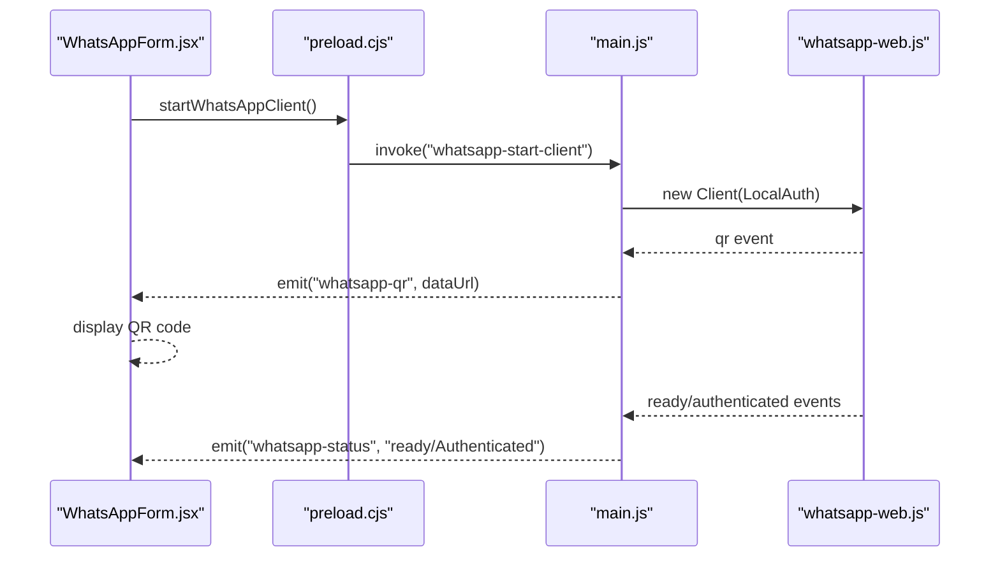
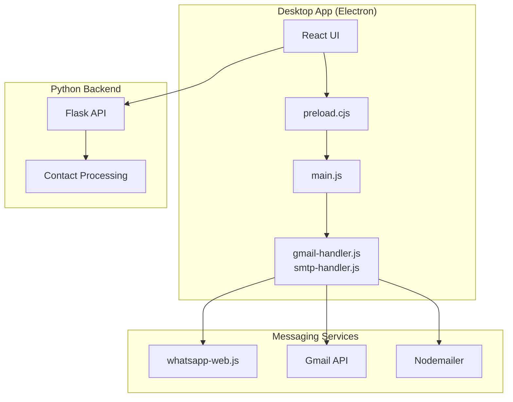
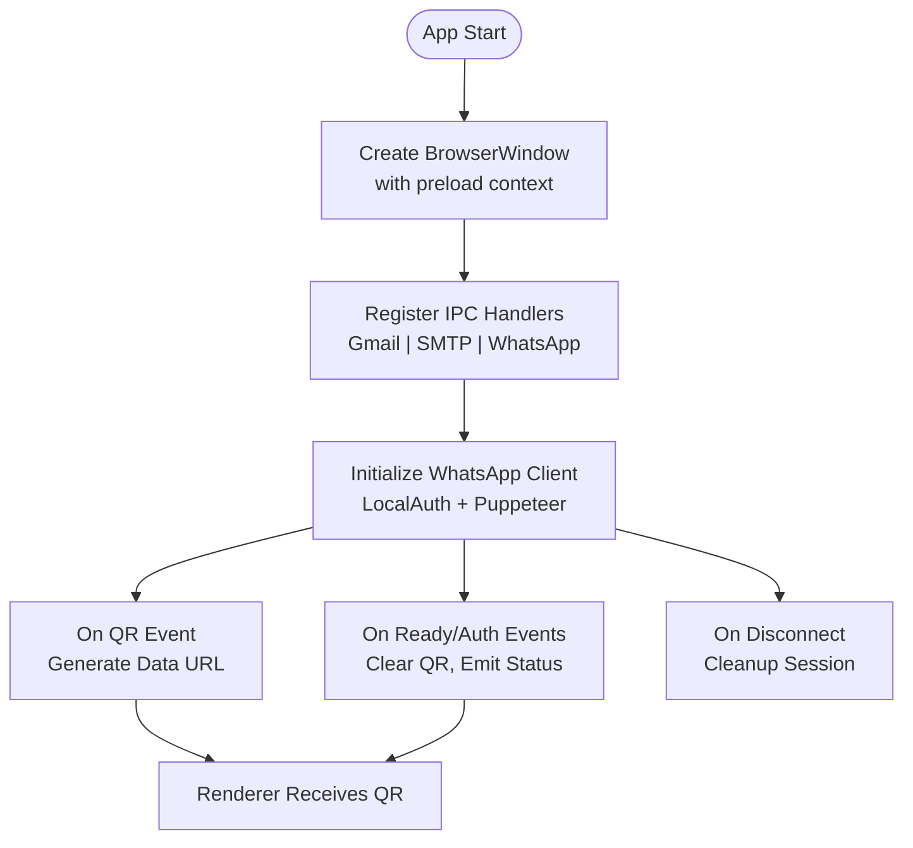
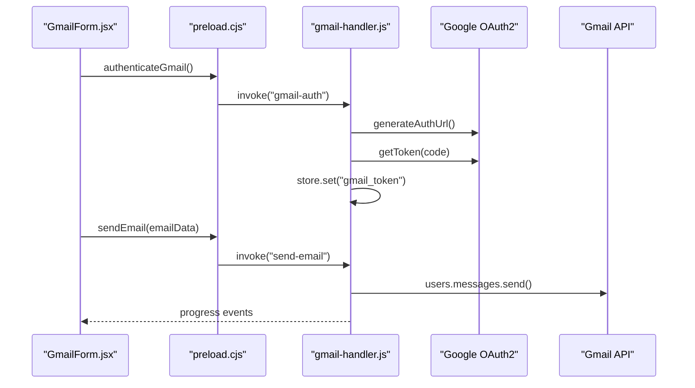

# Getting started

## Introduction

Install Node and Python deps, set Google OAuth env vars if you need Gmail, then run the Electron app from `electron/` and try a channel.

## Prerequisites

- Node.js 20.19 or newer (Vite 8 needs 20.19+ or 22.12+; Electron 43 bundles Node 24 at runtime)
- Python 3.10 or newer for `python-backend/`
- Google Cloud Console access for Gmail API
- A WhatsApp account
- SMTP server credentials if you use SMTP

Clone lands in `bulk-messaging-system`. The desktop app lives in `electron/`. Contact parsers live in `python-backend/`.

## Installation

1. Clone the repository:

```bash
git clone https://github.com/tashifkhan/bulk-messaging-system
cd bulk-messaging-system
```

2. Install Electron dependencies:

```bash
cd electron
npm install
```

3. Install Python backend dependencies:

```bash
cd ../python-backend
python3 -m venv venv
source venv/bin/activate
pip install -r requirements.txt
```

On Windows, activate with `venv\Scripts\activate`.

4. Start the development server from `electron/`:

```bash
# From the electron directory
npm run dev
```

That runs Vite on port 5173 and then launches Electron (`concurrently` + `wait-on`). Optional: start Flask from `python-backend/` with `python app.py` so file import can hit `http://localhost:5000`.

## Environment configuration

Create a `.env` file in `electron/` for Gmail OAuth2:

```
GOOGLE_CLIENT_ID=your_client_id_here
GOOGLE_CLIENT_SECRET=your_client_secret_here
```

Enable the Gmail API in Google Cloud Console, create a desktop OAuth client, and put those values here. WhatsApp and SMTP do not need this file.

## Initial setup workflow

Connect WhatsApp with QR auth:

1. Open the app and go to the WhatsApp tab.
2. Click "Connect to WhatsApp".
3. Scan the QR code with your phone's WhatsApp.
4. Wait until the status reads ready or authenticated.

The main process owns the `whatsapp-web.js` client, turns the QR into a data URL, and pushes status events to the renderer.


```mermaid
sequenceDiagram
participant UI as "WhatsAppForm.jsx"
participant Preload as "preload.cjs"
participant Main as "main.js"
participant WA as "whatsapp-web.js"
UI->>Preload : startWhatsAppClient()
Preload->>Main : invoke("whatsapp-start-client")
Main->>WA : new Client(LocalAuth)
WA-->>Main : qr event
Main-->>UI : emit("whatsapp-qr", dataUrl)
UI-->>UI : display QR code
WA-->>Main : ready/authenticated events
Main-->>UI : emit("whatsapp-status", "ready/Authenticated")
```

If Chromium for Puppeteer is missing, install Chrome or Brave, or set `PUPPETEER_EXECUTABLE_PATH`.

## Quick start examples

### WhatsApp messaging

1. Connect with the QR flow above.
2. Import contacts via CSV/Excel or paste numbers.
3. Compose a message. `{{name}}` personalizes when a name exists.
4. Set a delay between messages and click "Send Mass Messages".

The main process sends through WhatsApp Web and reports progress.

### Gmail API

1. Open the Gmail tab.
2. Click "Authenticate Gmail" and finish the OAuth consent window.
3. Import or enter addresses.
4. Compose subject and HTML body.
5. Set the delay and click "Send Bulk Email".

`gmail-handler.js` stores the token with `electron-store` and sends through the Gmail API.

### SMTP

1. Open the SMTP tab.
2. Enter host, port, username, and password. Enable SSL/TLS if the server needs it.
3. Import or enter addresses.
4. Compose the email, set the delay, and click "Send SMTP Email".

`smtp-handler.js` verifies the transport with Nodemailer, then sends.

## Architecture overview

Electron + React for the UI. Python for contact parsing. Channel work stays in the main process.


```mermaid
graph TB
subgraph "Desktop App (Electron)"
UI[React UI]
Preload[preload.cjs]
Main[main.js]
Handlers[gmail-handler.js<br/>smtp-handler.js]
end
subgraph "Messaging Services"
WA[whatsapp-web.js]
Gmail[Gmail API]
SMTP[Nodemailer]
end
subgraph "Python Backend"
PyAPI[Flask API]
Utils[Contact Processing]
end
UI --> Preload
Preload --> Main
Main --> Handlers
Handlers --> WA
Handlers --> Gmail
Handlers --> SMTP
UI --> PyAPI
PyAPI --> Utils
```

## Detailed component analysis

### Electron main process

`electron/src/electron/main.js` handles:

- Window creation, Vite URL in dev, `dist-react/index.html` in production
- IPC for Gmail, SMTP, WhatsApp, and file dialogs
- WhatsApp client lifecycle (init, QR, ready, authenticated, disconnected)
- Contact and email list parsing via `electron/src/shared/contact-parser.js`


```mermaid
flowchart TD
Start([App Start]) --> CreateWindow["Create BrowserWindow<br/>with preload context"]
CreateWindow --> RegisterHandlers["Register IPC Handlers<br/>Gmail | SMTP | WhatsApp"]
RegisterHandlers --> InitWhatsApp["Initialize WhatsApp Client<br/>LocalAuth + Puppeteer"]
InitWhatsApp --> QR["On QR Event<br/>Generate Data URL"]
InitWhatsApp --> Ready["On Ready/Auth Events<br/>Clear QR, Emit Status"]
InitWhatsApp --> Disconnected["On Disconnect<br/>Cleanup Session"]
QR --> UI["Renderer Receives QR"]
Ready --> UI
```

### Gmail handler

- Checks `GOOGLE_CLIENT_ID` and `GOOGLE_CLIENT_SECRET`
- Opens a BrowserWindow for consent
- Exchanges the code for tokens
- Stores tokens in `electron-store`
- Sends mail and emits progress


```mermaid
sequenceDiagram
participant UI as "GmailForm.jsx"
participant Preload as "preload.cjs"
participant Handler as "gmail-handler.js"
participant Google as "Google OAuth2"
participant GmailAPI as "Gmail API"
UI->>Preload : authenticateGmail()
Preload->>Handler : invoke("gmail-auth")
Handler->>Google : generateAuthUrl()
Handler->>Google : getToken(code)
Handler->>Handler : store.set("gmail_token")
UI->>Preload : sendEmail(emailData)
Preload->>Handler : invoke("send-email")
Handler->>GmailAPI : users.messages.send()
Handler-->>UI : progress events
```

### SMTP handler

- Validates host, port, and credentials
- Saves config without the password
- Verifies the connection
- Sends with delay and progress events

### Python backend API

Flask on port 5000:

- `POST /upload` for CSV, TXT, XLSX, XLS
- `POST /parse-manual-numbers` for pasted text
- `POST /validate-number` for a single number
- `GET /health`

If Flask is down, the Electron app falls back to basic parsing.

## Dependency analysis

Versions from `electron/package.json` and `python-backend/requirements.txt`:

```mermaid
graph LR
subgraph "Electron Dependencies"
React[react@^19.2]
Tailwind[tailwindcss@^4.3]
Electron[electron@^43]
WA[whatsapp-web.js@^1.34]
Nodemailer[nodemailer@^9]
Googleapis[googleapis@^173]
Builder[electron-builder@^26]
end
subgraph "Python Dependencies"
Flask[flask]
FlaskCors[flask-cors]
Pandas[pandas]
Openpyxl[openpyxl]
Xlrd[xlrd]
Werkzeug[werkzeug]
end
React --> WA
React --> Nodemailer
React --> Googleapis
WA -.-> Python[python-backend]
Nodemailer -.-> Python
Googleapis -.-> Python
```

Dev scripts use `concurrently`, `cross-env`, `wait-on`, Vite 8, and ESLint 10. Python packages are unpinned in `requirements.txt`.

## Troubleshooting guide

- **WhatsApp QR code not loading.** Check the network, restart, install Chrome/Brave, or set `PUPPETEER_EXECUTABLE_PATH`.
- **Gmail authentication failed.** Confirm `.env` values, Cloud Console OAuth client type, and that Gmail API is enabled.
- **SMTP connection issues.** Recheck host, port, TLS, and firewall. Gmail SMTP wants an app password.
- **Contact import errors.** Use UTF-8 CSV/Excel/TXT and recognizable name/phone headers.

Also confirm:

- Node.js 20.19+ and Python 3.10+
- Commands run from `electron/` and `python-backend/`, not a `WhatsappBulkMessaging` folder
- Vite is on port 5173 (`strictPort: true`)

## Verification steps

1. **Development server.** Vite on 5173, Electron window opens, DevTools in dev mode.
2. **WhatsApp.** QR appears, scan succeeds, status events show in the log.
3. **Gmail API.** Authenticate, send a test to yourself, watch progress.
4. **SMTP.** Verify config, send a test, confirm delivery status.
5. **Python backend.** `python app.py`, hit `/health`, then upload a sample from `python-backend/sample_contacts.csv`.

## Next steps

- Message templates (`template-save` / `template-list` IPC)
- Send delays and per-recipient errors
- `npm run dist:mac`, `dist:win`, or `dist:linux` from `electron/`

electron-builder targets: macOS dmg (arm64), Windows portable + msi (x64), Linux AppImage (x64). Output is `electron/dist/`.

## Conclusion

Once `npm run dev` shows the window and a WhatsApp QR or SMTP verify works, you are in. Feature docs cover the IPC handlers and parsers next.
