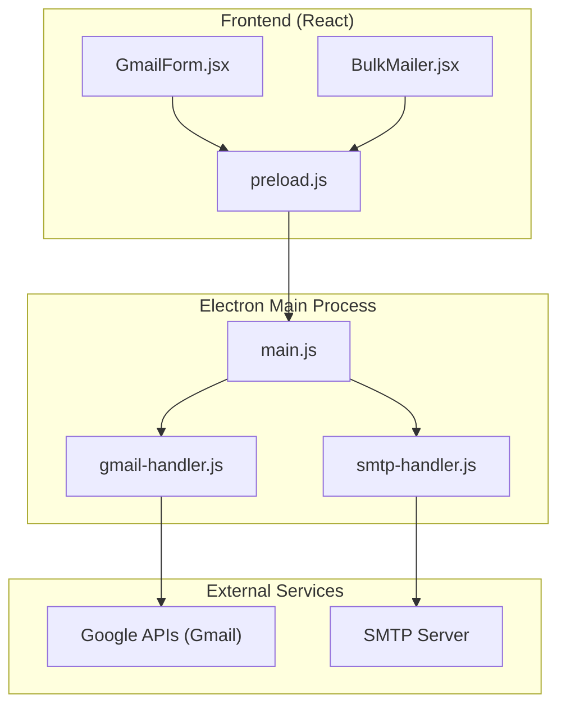
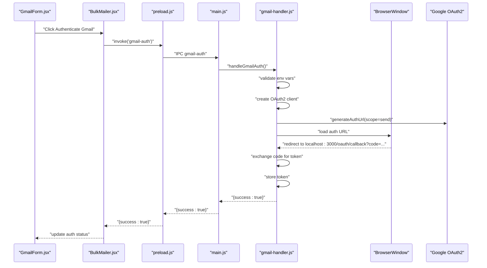
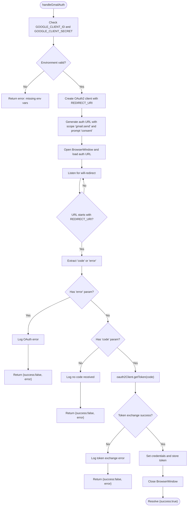
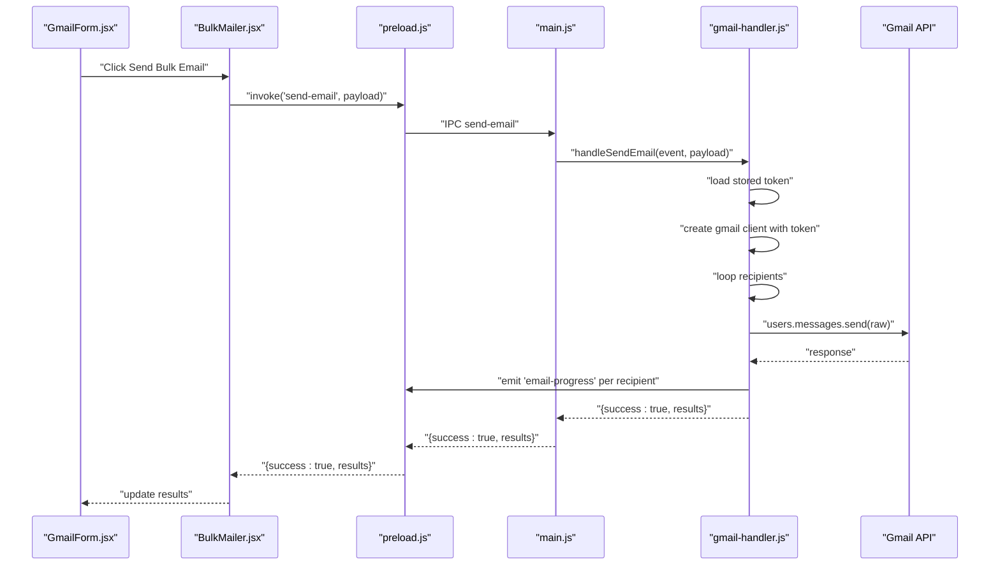
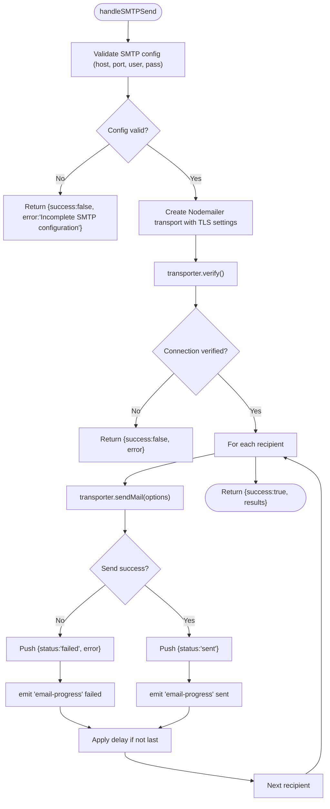
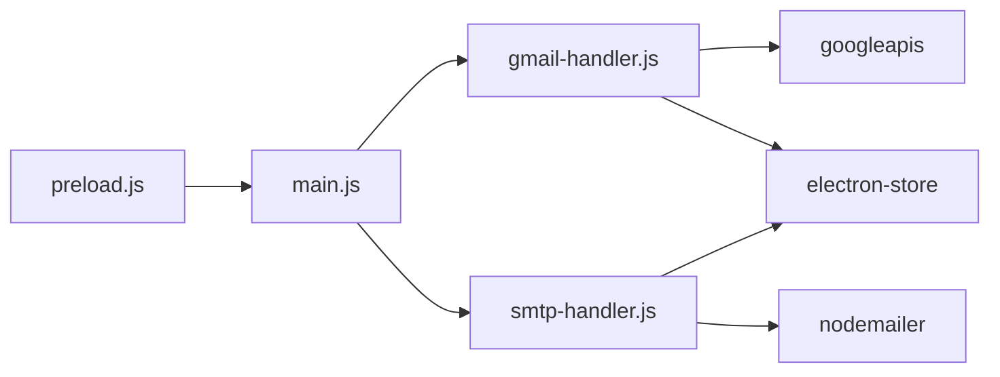

# Authentication and Delivery Troubleshooting

<cite>
**Referenced Files in This Document**
- [gmail-handler.js](file://electron/src/electron/gmail-handler.js)
- [smtp-handler.js](file://electron/src/electron/smtp-handler.js)
- [main.js](file://electron/src/electron/main.js)
- [preload.js](file://electron/src/electron/preload.js)
- [BulkMailer.jsx](file://electron/src/components/BulkMailer.jsx)
- [GmailForm.jsx](file://electron/src/components/GmailForm.jsx)
- [package.json](file://electron/package.json)
- [README.md](file://README.md)
</cite>

## Table of Contents
1. [Introduction](#introduction)
2. [Project Structure](#project-structure)
3. [Core Components](#core-components)
4. [Architecture Overview](#architecture-overview)
5. [Detailed Component Analysis](#detailed-component-analysis)
6. [Dependency Analysis](#dependency-analysis)
7. [Performance Considerations](#performance-considerations)
8. [Troubleshooting Guide](#troubleshooting-guide)
9. [Conclusion](#conclusion)

## Introduction
This document provides a comprehensive troubleshooting guide for Gmail API integration issues within the desktop application. It focuses on authentication failures (invalid client credentials, consent screen errors, OAuth2 flow interruptions), email sending problems (rate limit violations, API quota exceeded errors, delivery failures), and platform-specific considerations for Windows, macOS, and Linux. It also covers debugging techniques using console logs, network inspection, and API response analysis, along with step-by-step resolution guides for certificate issues, proxy configuration, and network connectivity problems. Security-related troubleshooting for blocked applications and suspicious activity warnings is included.

## Project Structure
The application is an Electron-based desktop app with a React frontend and Node/Electron backend. Gmail integration is handled in the Electron main process via the Google APIs client library, while the UI provides authentication and sending controls.

**Diagram sources**
- [GmailForm.jsx](file://electron/src/components/GmailForm.jsx#L1-L332)
- [BulkMailer.jsx](file://electron/src/components/BulkMailer.jsx#L1-L482)
- [preload.js](file://electron/src/electron/preload.js#L1-L41)
- [main.js](file://electron/src/electron/main.js#L1-L371)
- [gmail-handler.js](file://electron/src/electron/gmail-handler.js#L1-L227)
- [smtp-handler.js](file://electron/src/electron/smtp-handler.js#L1-L110)

**Section sources**
- [package.json](file://electron/package.json#L1-L49)
- [README.md](file://README.md#L1-L455)

## Core Components
- Gmail authentication and token management: Handles OAuth2 flow, consent screen, and token persistence.
- Email sending pipeline: Sends emails via Gmail API with progress reporting and rate limiting.
- SMTP transport: Alternative email delivery method with connection verification and TLS handling.
- Frontend integration: UI components for authentication, recipient import, and progress monitoring.

Key implementation references:
- Gmail OAuth2 flow and token exchange: [gmail-handler.js](file://electron/src/electron/gmail-handler.js#L15-L130)
- Gmail send operation and per-recipient progress: [gmail-handler.js](file://electron/src/electron/gmail-handler.js#L141-L214)
- SMTP transport creation and verification: [smtp-handler.js](file://electron/src/electron/smtp-handler.js#L33-L48)
- Frontend IPC exposure and event listeners: [preload.js](file://electron/src/electron/preload.js#L4-L40)
- Electron main process IPC registration: [main.js](file://electron/src/electron/main.js#L102-L108)

**Section sources**
- [gmail-handler.js](file://electron/src/electron/gmail-handler.js#L1-L227)
- [smtp-handler.js](file://electron/src/electron/smtp-handler.js#L1-L110)
- [main.js](file://electron/src/electron/main.js#L102-L108)
- [preload.js](file://electron/src/electron/preload.js#L4-L40)

## Architecture Overview
The application uses Electron’s contextBridge to securely expose IPC methods to the renderer. The main process registers handlers for Gmail authentication, token retrieval, and email sending. The Gmail handler manages OAuth2, opens a browser window for consent, captures the authorization code, exchanges it for tokens, and persists them. The UI triggers these flows and displays progress events.

**Diagram sources**
- [GmailForm.jsx](file://electron/src/components/GmailForm.jsx#L90-L100)
- [BulkMailer.jsx](file://electron/src/components/BulkMailer.jsx#L75-L107)
- [preload.js](file://electron/src/electron/preload.js#L6-L8)
- [main.js](file://electron/src/electron/main.js#L103-L103)
- [gmail-handler.js](file://electron/src/electron/gmail-handler.js#L15-L130)

## Detailed Component Analysis

### Gmail Authentication Handler
Implements OAuth2 authorization, consent screen handling, and token exchange. Logs environment variable checks, redirect handling, and error propagation.

**Diagram sources**
- [gmail-handler.js](file://electron/src/electron/gmail-handler.js#L15-L130)

**Section sources**
- [gmail-handler.js](file://electron/src/electron/gmail-handler.js#L15-L130)

### Gmail Send Handler
Handles bulk email sending via Gmail API, including per-recipient progress updates and rate limiting.

**Diagram sources**
- [GmailForm.jsx](file://electron/src/components/GmailForm.jsx#L228-L254)
- [BulkMailer.jsx](file://electron/src/components/BulkMailer.jsx#L181-L219)
- [preload.js](file://electron/src/electron/preload.js#L8-L21)
- [main.js](file://electron/src/electron/main.js#L105-L105)
- [gmail-handler.js](file://electron/src/electron/gmail-handler.js#L141-L214)

**Section sources**
- [gmail-handler.js](file://electron/src/electron/gmail-handler.js#L141-L214)

### SMTP Transport Handler
Provides SMTP-based email sending with connection verification and TLS configuration.

**Diagram sources**
- [smtp-handler.js](file://electron/src/electron/smtp-handler.js#L6-L105)

**Section sources**
- [smtp-handler.js](file://electron/src/electron/smtp-handler.js#L6-L105)

## Dependency Analysis
- Electron main process registers IPC handlers for Gmail and SMTP operations.
- Frontend uses contextBridge to invoke handlers and listen for progress events.
- Gmail integration depends on googleapis and electron-store for token persistence.
- SMTP integration depends on nodemailer and electron-store for optional configuration persistence.

**Diagram sources**
- [preload.js](file://electron/src/electron/preload.js#L4-L40)
- [main.js](file://electron/src/electron/main.js#L102-L108)
- [gmail-handler.js](file://electron/src/electron/gmail-handler.js#L1-L10)
- [smtp-handler.js](file://electron/src/electron/smtp-handler.js#L1-L4)

**Section sources**
- [package.json](file://electron/package.json#L20-L31)
- [main.js](file://electron/src/electron/main.js#L102-L108)

## Performance Considerations
- Rate limiting: Both Gmail and SMTP handlers apply configurable delays between emails to avoid throttling and spam detection.
- Progress reporting: Real-time updates per recipient improve user feedback and help diagnose slow endpoints.
- Connection verification: SMTP handler verifies transport configuration before sending to reduce runtime failures.

[No sources needed since this section provides general guidance]

## Troubleshooting Guide

### Authentication Failures

Common symptoms:
- Missing environment variables for client credentials.
- Consent screen errors or OAuth error callbacks.
- Authentication window closes unexpectedly or times out.

Diagnostic steps:
- Verify environment variables are present and correct in the Electron process.
- Check the generated OAuth URL and consent screen behavior.
- Inspect redirect handling and captured parameters.
- Review timeout behavior and window lifecycle events.

Resolution steps:
- Confirm GOOGLE_CLIENT_ID and GOOGLE_CLIENT_SECRET are set and accessible to the Electron process.
- Ensure the OAuth consent screen is configured for a desktop application and includes the required scopes.
- Validate the redirect URI matches the registered OAuth client configuration.
- Increase timeout if the consent flow takes longer than 5 minutes.
- Re-run authentication after correcting credentials or consent configuration.

Relevant implementation references:
- Environment variable checks and error returns: [gmail-handler.js](file://electron/src/electron/gmail-handler.js#L19-L29)
- OAuth URL generation with consent prompt: [gmail-handler.js](file://electron/src/electron/gmail-handler.js#L38-L42)
- Redirect handling and authorization code extraction: [gmail-handler.js](file://electron/src/electron/gmail-handler.js#L74-L116)
- Timeout handling and window closure: [gmail-handler.js](file://electron/src/electron/gmail-handler.js#L63-L125)

**Section sources**
- [gmail-handler.js](file://electron/src/electron/gmail-handler.js#L19-L125)

### OAuth2 Flow Interruptions

Common symptoms:
- Redirect URL mismatch or unexpected parameters.
- Missing authorization code or presence of OAuth error.
- Window closed before completion.

Diagnostic steps:
- Capture and log the redirect URL and query parameters.
- Check for 'error' parameter presence and value.
- Verify the authorization code is extracted and exchanged successfully.

Resolution steps:
- Align redirect URI with OAuth client configuration.
- Ensure the consent screen grants the required scope.
- Retry authentication if interrupted; avoid closing the browser window prematurely.

Relevant implementation references:
- Redirect URL capture and parameter extraction: [gmail-handler.js](file://electron/src/electron/gmail-handler.js#L74-L116)
- Error parameter handling: [gmail-handler.js](file://electron/src/electron/gmail-handler.js#L87-L92)
- Authorization code exchange: [gmail-handler.js](file://electron/src/electron/gmail-handler.js#L96-L109)

**Section sources**
- [gmail-handler.js](file://electron/src/electron/gmail-handler.js#L74-L109)

### Email Sending Problems

Common symptoms:
- Rate limit violations or throttling.
- Delivery failures per recipient.
- Network connectivity or TLS certificate issues.

Diagnostic steps:
- Monitor 'email-progress' events for per-recipient statuses.
- Inspect error messages attached to failed events.
- Verify SMTP connection verification passes before sending.
- Check TLS settings and certificate rejection policies.

Resolution steps:
- Increase delay between emails to respect provider limits.
- For Gmail API, ensure sufficient quota and consider upgrading or scheduling sends.
- For SMTP, adjust host/port/security settings and test connection verification.
- For certificate issues, review TLS configuration and consider disabling unauthorized certificate rejection only for testing.

Relevant implementation references:
- Progress emission and per-recipient updates: [gmail-handler.js](file://electron/src/electron/gmail-handler.js#L167-L206), [smtp-handler.js](file://electron/src/electron/smtp-handler.js#L56-L98)
- SMTP connection verification: [smtp-handler.js](file://electron/src/electron/smtp-handler.js#L47-L48)
- TLS settings for SMTP: [smtp-handler.js](file://electron/src/electron/smtp-handler.js#L42-L44)

**Section sources**
- [gmail-handler.js](file://electron/src/electron/gmail-handler.js#L167-L206)
- [smtp-handler.js](file://electron/src/electron/smtp-handler.js#L47-L48)
- [smtp-handler.js](file://electron/src/electron/smtp-handler.js#L42-L44)

### Platform-Specific Issues (Windows, macOS, Linux)

Common symptoms:
- Application fails to start or load resources.
- Certificate or proxy issues on corporate networks.
- File system permissions affecting token storage.

Diagnostic steps:
- Check Electron app initialization and resource loading paths.
- Verify environment variables and file permissions for token storage.
- Test network connectivity and proxy settings.

Resolution steps:
- Ensure the app is built and distributed for the target platform using electron-builder configurations.
- On Linux/macOS, confirm proper sandbox and security settings for file access.
- On Windows, verify executable permissions and antivirus interference.
- Configure proxies if required by the environment; ensure HTTPS proxy support.

Relevant implementation references:
- Electron app lifecycle and resource loading: [main.js](file://electron/src/electron/main.js#L20-L51)
- Build targets for distribution: [README.md](file://README.md#L328-L332), [electron-builder.json](file://electron/electron-builder.json#L6-L15)

**Section sources**
- [main.js](file://electron/src/electron/main.js#L20-L51)
- [README.md](file://README.md#L328-L332)
- [electron-builder.json](file://electron/electron-builder.json#L6-L15)

### Certificate Issues and Proxy Configuration

Symptoms:
- TLS handshake failures or certificate errors.
- SMTP connection timeouts behind corporate proxies.

Resolution steps:
- For SMTP, temporarily adjust TLS settings to accept unauthorized certificates for testing; revert to strict verification in production.
- Configure system or application-level proxy settings to allow outbound connections to Google APIs and SMTP servers.
- Validate that the proxy supports HTTPS and maintains session continuity.

Relevant implementation references:
- SMTP TLS configuration: [smtp-handler.js](file://electron/src/electron/smtp-handler.js#L42-L44)

**Section sources**
- [smtp-handler.js](file://electron/src/electron/smtp-handler.js#L42-L44)

### Network Connectivity Problems

Symptoms:
- Authentication redirects fail to reach localhost callback.
- Gmail API calls time out or fail.
- SMTP verification hangs or fails.

Resolution steps:
- Verify local firewall allows inbound traffic on the OAuth redirect port.
- Test DNS resolution and connectivity to external endpoints.
- Use network tracing tools to inspect request/response flows and identify blocking endpoints.

Relevant implementation references:
- OAuth redirect URI and browser window handling: [gmail-handler.js](file://electron/src/electron/gmail-handler.js#L11-L11)
- Browser window lifecycle and timeout: [gmail-handler.js](file://electron/src/electron/gmail-handler.js#L47-L125)

**Section sources**
- [gmail-handler.js](file://electron/src/electron/gmail-handler.js#L11-L125)

### Security-Related Troubleshooting

Symptoms:
- Suspicious activity warnings or blocked application notifications.
- OAuth consent screen rejecting the application.

Resolution steps:
- Ensure the OAuth client is configured for desktop application type and includes the required scopes.
- Review Google Cloud Console settings and API enablement.
- Follow Google’s guidelines for OAuth application verification and security practices.

Relevant implementation references:
- OAuth scope and consent prompt configuration: [gmail-handler.js](file://electron/src/electron/gmail-handler.js#L10-L42)

**Section sources**
- [gmail-handler.js](file://electron/src/electron/gmail-handler.js#L10-L42)

### Debugging Techniques

Console logs:
- Use Electron DevTools to inspect logs from the main process and renderer.
- Monitor authentication and send operations for error messages and timing.

Network inspection:
- Use browser developer tools to inspect OAuth redirects and network requests.
- For SMTP, monitor connection verification and send operations.

API response analysis:
- Examine error messages returned by handlers and surface them to the UI.
- Track per-recipient statuses and error details in the activity log.

Relevant implementation references:
- Frontend IPC listeners and alerts: [BulkMailer.jsx](file://electron/src/components/BulkMailer.jsx#L35-L58), [BulkMailer.jsx](file://electron/src/components/BulkMailer.jsx#L75-L107), [BulkMailer.jsx](file://electron/src/components/BulkMailer.jsx#L181-L219)
- Progress event emission: [gmail-handler.js](file://electron/src/electron/gmail-handler.js#L167-L206), [smtp-handler.js](file://electron/src/electron/smtp-handler.js#L56-L98)

**Section sources**
- [BulkMailer.jsx](file://electron/src/components/BulkMailer.jsx#L35-L58)
- [BulkMailer.jsx](file://electron/src/components/BulkMailer.jsx#L75-L107)
- [BulkMailer.jsx](file://electron/src/components/BulkMailer.jsx#L181-L219)
- [gmail-handler.js](file://electron/src/electron/gmail-handler.js#L167-L206)
- [smtp-handler.js](file://electron/src/electron/smtp-handler.js#L56-L98)

## Conclusion
This guide consolidates practical troubleshooting strategies for Gmail API and SMTP integration within the Electron application. By validating credentials, ensuring proper OAuth consent, monitoring progress events, and addressing platform-specific and network conditions, most authentication and delivery issues can be resolved efficiently. Use the referenced implementation files to correlate observed symptoms with code-level diagnostics and apply the recommended resolutions.