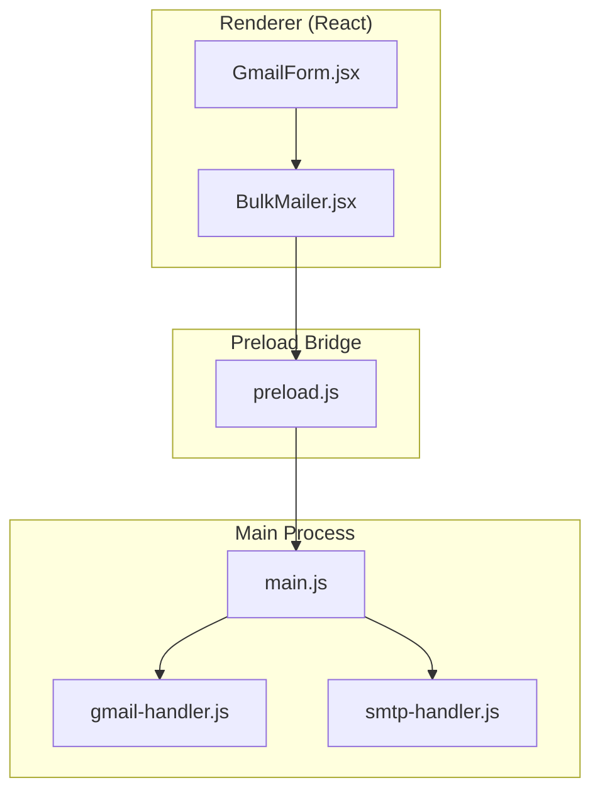
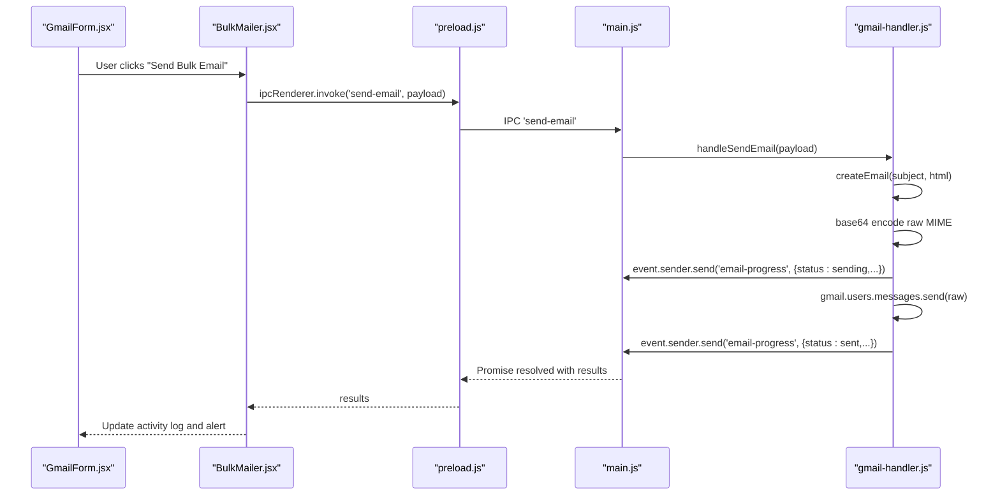
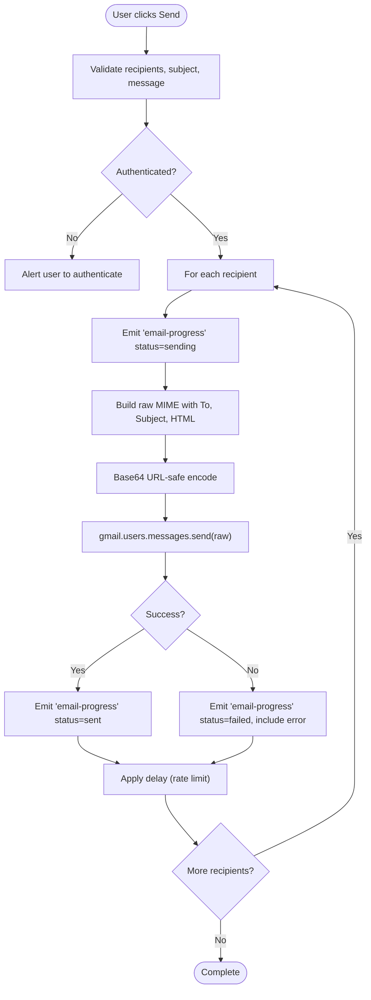
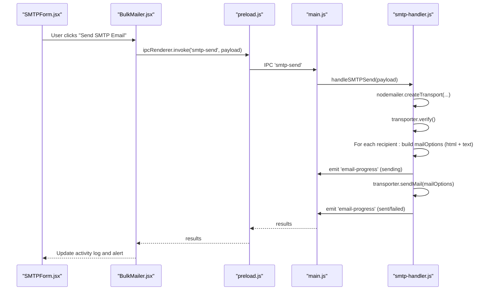
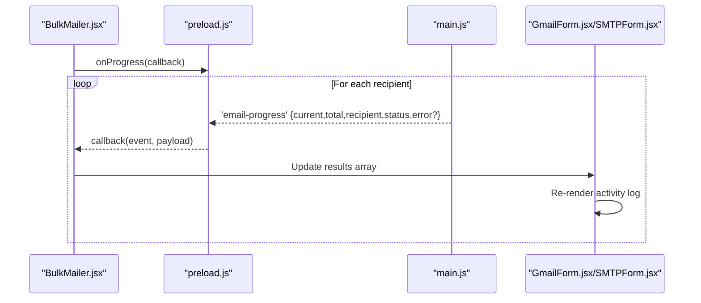
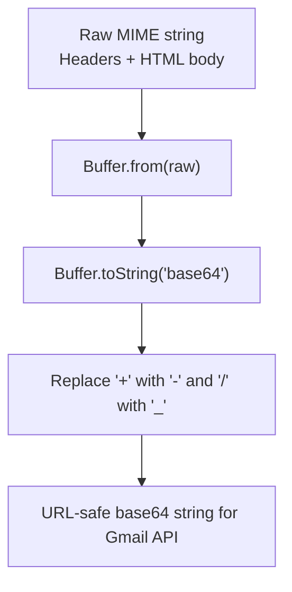
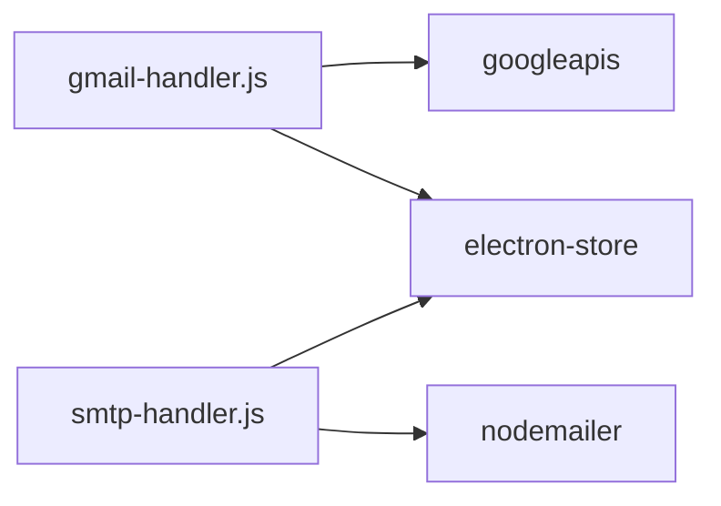

# Email Composition and Sending

<cite>
**Referenced Files in This Document**
- [GmailForm.jsx](file://electron/src/components/GmailForm.jsx)
- [BulkMailer.jsx](file://electron/src/components/BulkMailer.jsx)
- [gmail-handler.js](file://electron/src/electron/gmail-handler.js)
- [smtp-handler.js](file://electron/src/electron/smtp-handler.js)
- [main.js](file://electron/src/electron/main.js)
- [preload.js](file://electron/src/electron/preload.js)
- [package.json](file://electron/package.json)
- [README.md](file://README.md)
</cite>

## Table of Contents
1. [Introduction](#introduction)
2. [Project Structure](#project-structure)
3. [Core Components](#core-components)
4. [Architecture Overview](#architecture-overview)
5. [Detailed Component Analysis](#detailed-component-analysis)
6. [Dependency Analysis](#dependency-analysis)
7. [Performance Considerations](#performance-considerations)
8. [Troubleshooting Guide](#troubleshooting-guide)
9. [Conclusion](#conclusion)

## Introduction
This document explains the email composition and sending functionality for Gmail and SMTP within the desktop application. It covers how users compose HTML emails, how recipients are processed, how bulk sending is implemented with rate limiting and progress tracking, and how the UI integrates with backend logic. It also documents MIME encoding and base64 conversion for Gmail API compatibility, recipient personalization, and common issues such as rate limits and delivery failures.

## Project Structure
The email feature spans the React frontend and Electron main/preload processes:
- UI forms for Gmail and SMTP composition
- Electron IPC handlers for authentication, sending, and progress events
- Backend handlers for Gmail API and SMTP transport
- Preload bridge exposing secure IPC methods to the renderer

**Diagram sources**
- [GmailForm.jsx](file://electron/src/components/GmailForm.jsx#L1-L332)
- [BulkMailer.jsx](file://electron/src/components/BulkMailer.jsx#L1-L482)
- [preload.js](file://electron/src/electron/preload.js#L1-L41)
- [main.js](file://electron/src/electron/main.js#L1-L371)
- [gmail-handler.js](file://electron/src/electron/gmail-handler.js#L1-L227)
- [smtp-handler.js](file://electron/src/electron/smtp-handler.js#L1-L110)

**Section sources**
- [GmailForm.jsx](file://electron/src/components/GmailForm.jsx#L1-L332)
- [BulkMailer.jsx](file://electron/src/components/BulkMailer.jsx#L1-L482)
- [main.js](file://electron/src/electron/main.js#L1-L371)
- [preload.js](file://electron/src/electron/preload.js#L1-L41)
- [gmail-handler.js](file://electron/src/electron/gmail-handler.js#L1-L227)
- [smtp-handler.js](file://electron/src/electron/smtp-handler.js#L1-L110)

## Core Components
- GmailForm: UI for composing and sending emails via Gmail API, including authentication, recipient import, subject/message editing, and activity log display.
- BulkMailer: Orchestrates UI state, form validation, and invokes Electron IPC to authenticate, import recipients, and send emails.
- gmail-handler: Implements OAuth2 flow, token storage, email MIME assembly, base64 encoding, and rate-limited sending with progress events.
- smtp-handler: Handles SMTP configuration, connection verification, HTML/text dual-content emails, and rate-limited sending with progress events.
- main/preload: Expose IPC methods for renderer-to-main communication and progress event subscription.

Key responsibilities:
- HTML content handling: Both Gmail and SMTP handlers accept HTML content and render it as HTML in the sent message.
- Subject formatting: Plain text subject is applied to each message.
- Recipient processing: Recipients are parsed from textarea input, trimmed, filtered, and validated.
- Rate limiting: Configurable delay between sends to avoid throttling.
- Progress tracking: Real-time updates via email-progress events.
- Error handling: Per-recipient failure reporting and UI alerts.

**Section sources**
- [GmailForm.jsx](file://electron/src/components/GmailForm.jsx#L1-L332)
- [BulkMailer.jsx](file://electron/src/components/BulkMailer.jsx#L149-L261)
- [gmail-handler.js](file://electron/src/electron/gmail-handler.js#L141-L226)
- [smtp-handler.js](file://electron/src/electron/smtp-handler.js#L6-L105)
- [main.js](file://electron/src/electron/main.js#L102-L108)
- [preload.js](file://electron/src/electron/preload.js#L17-L21)

## Architecture Overview
The system uses Electron’s IPC to securely communicate between the renderer and main process. The renderer triggers actions (authenticate, import, send) while the main process executes backend logic and emits progress updates.

**Diagram sources**
- [GmailForm.jsx](file://electron/src/components/GmailForm.jsx#L229-L254)
- [BulkMailer.jsx](file://electron/src/components/BulkMailer.jsx#L181-L219)
- [preload.js](file://electron/src/electron/preload.js#L8-L8)
- [main.js](file://electron/src/electron/main.js#L105-L105)
- [gmail-handler.js](file://electron/src/electron/gmail-handler.js#L141-L214)

## Detailed Component Analysis

### Gmail Composition and Sending
- UI composition: Subject and HTML message are captured in GmailForm. Recipients are entered as one-per-line and imported from files.
- Authentication: OAuth2 consent flow opens a browser window for user authorization; tokens are stored securely.
- MIME and base64: The handler constructs a raw MIME message with To, Subject, Content-Type header, and HTML body, then encodes it to base64 with URL-safe characters.
- Rate limiting: A configurable delay is applied between sends.
- Progress tracking: Per-recipient progress events are emitted and displayed in the activity log.

**Diagram sources**
- [GmailForm.jsx](file://electron/src/components/GmailForm.jsx#L181-L254)
- [gmail-handler.js](file://electron/src/electron/gmail-handler.js#L141-L226)

**Section sources**
- [GmailForm.jsx](file://electron/src/components/GmailForm.jsx#L1-L332)
- [gmail-handler.js](file://electron/src/electron/gmail-handler.js#L141-L226)

### SMTP Composition and Sending
- UI composition: SMTP host/port/security/user/password are configured in SMTPForm; recipients and content mirror GmailForm.
- Transport setup: Nodemailer creates a transporter with TLS options and verifies connectivity.
- Dual content: HTML is sent as html; a text version is derived by stripping HTML tags for the text part.
- Rate limiting and progress: Same pattern as Gmail.

**Diagram sources**
- [SMTPForm.jsx](file://electron/src/components/SMTPForm.jsx#L288-L312)
- [BulkMailer.jsx](file://electron/src/components/BulkMailer.jsx#L221-L261)
- [smtp-handler.js](file://electron/src/electron/smtp-handler.js#L6-L105)
- [preload.js](file://electron/src/electron/preload.js#L10-L11)
- [main.js](file://electron/src/electron/main.js#L107-L108)

**Section sources**
- [SMTPForm.jsx](file://electron/src/components/SMTPForm.jsx#L1-L390)
- [smtp-handler.js](file://electron/src/electron/smtp-handler.js#L6-L105)

### UI Integration and Progress Events
- Progress subscription: The preload exposes onProgress to subscribe to email-progress events.
- Activity log: Results are rendered in a scrollable panel with color-coded status indicators.
- Real-time updates: Users receive immediate feedback for each recipient’s send attempt.

**Diagram sources**
- [preload.js](file://electron/src/electron/preload.js#L17-L21)
- [gmail-handler.js](file://electron/src/electron/gmail-handler.js#L166-L206)
- [smtp-handler.js](file://electron/src/electron/smtp-handler.js#L55-L98)
- [GmailForm.jsx](file://electron/src/components/GmailForm.jsx#L276-L326)
- [SMTPForm.jsx](file://electron/src/components/SMTPForm.jsx#L318-L385)

**Section sources**
- [preload.js](file://electron/src/electron/preload.js#L17-L21)
- [GmailForm.jsx](file://electron/src/components/GmailForm.jsx#L276-L326)
- [SMTPForm.jsx](file://electron/src/components/SMTPForm.jsx#L318-L385)

### HTML Email Templates and Dynamic Content
- HTML support: Both Gmail and SMTP handlers accept HTML content and render it as HTML in the sent message.
- Dynamic content insertion: While the current implementation passes the raw HTML message, the architecture supports injecting dynamic placeholders (e.g., recipient name) before sending. For Gmail, the MIME builder would need to incorporate personalized content per recipient; for SMTP, mailOptions could be constructed per iteration with personalized HTML/text.

Note: The WhatsApp module demonstrates a similar pattern for dynamic content injection using placeholder replacement prior to sending.

**Section sources**
- [gmail-handler.js](file://electron/src/electron/gmail-handler.js#L216-L226)
- [smtp-handler.js](file://electron/src/electron/smtp-handler.js#L64-L70)
- [main.js](file://electron/src/electron/main.js#L191-L191)

### MIME Encoding and Base64 Conversion for Gmail API
- Raw MIME construction: The handler builds a raw message with headers (To, Subject, Content-Type) and HTML body.
- Base64 encoding: The entire raw MIME string is encoded to base64 and normalized to URL-safe characters for Gmail API compatibility.

**Diagram sources**
- [gmail-handler.js](file://electron/src/electron/gmail-handler.js#L216-L226)

**Section sources**
- [gmail-handler.js](file://electron/src/electron/gmail-handler.js#L216-L226)

## Dependency Analysis
External libraries and their roles:
- googleapis: Gmail API OAuth2 and message sending.
- nodemailer: SMTP transport and email sending.
- electron-store: Secure local storage for tokens/configurations.
- qrcode: QR generation for WhatsApp (unrelated to email but part of the app).

**Diagram sources**
- [gmail-handler.js](file://electron/src/electron/gmail-handler.js#L3-L5)
- [smtp-handler.js](file://electron/src/electron/smtp-handler.js#L1-L2)
- [package.json](file://electron/package.json#L20-L31)

**Section sources**
- [package.json](file://electron/package.json#L20-L31)
- [gmail-handler.js](file://electron/src/electron/gmail-handler.js#L3-L5)
- [smtp-handler.js](file://electron/src/electron/smtp-handler.js#L1-L2)

## Performance Considerations
- Rate limiting: Configurable delay between sends reduces the risk of throttling and improves reliability.
- Batch size: Large recipient lists increase total send time; consider batching and monitoring progress.
- Network stability: SMTP and Gmail API calls depend on network conditions; implement retries at the application level if needed.
- Rendering overhead: The activity log updates frequently; ensure efficient state updates to keep UI responsive.

[No sources needed since this section provides general guidance]

## Troubleshooting Guide
Common issues and resolutions:
- Gmail authentication failures
  - Verify environment variables for client ID and secret.
  - Confirm OAuth consent screen and redirect URI configuration.
  - Ensure the app remains open during the consent flow.
- Missing credentials or token errors
  - Check that the token is stored and retrievable.
- SMTP connection issues
  - Validate host, port, and security settings.
  - Use correct authentication credentials and port combinations.
- Rate limits and API quotas
  - Respect provider limits; adjust delay to stay within quotas.
  - Monitor per-minute and daily sending caps.
- Delivery failures
  - Inspect per-recipient error messages in the activity log.
  - Validate recipient addresses and content formatting.

**Section sources**
- [gmail-handler.js](file://electron/src/electron/gmail-handler.js#L15-L130)
- [smtp-handler.js](file://electron/src/electron/smtp-handler.js#L17-L21)
- [README.md](file://README.md#L400-L438)

## Conclusion
The application provides robust, user-friendly email composition and sending for both Gmail API and SMTP. The UI enables HTML-rich content, recipient management, and real-time progress tracking, while the backend enforces rate limiting, handles MIME encoding for Gmail, and supports dual HTML/text content for SMTP. By following the troubleshooting guidance and respecting provider quotas, users can reliably send bulk emails with clear feedback and error handling.