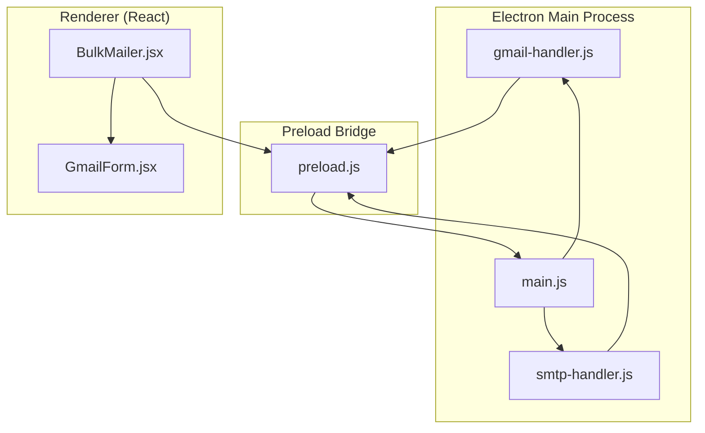
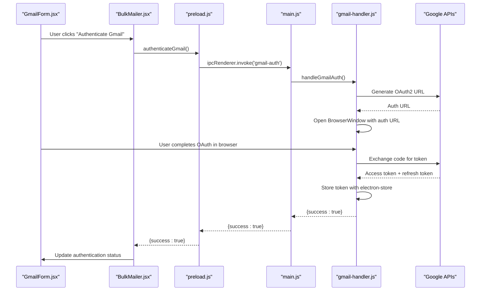
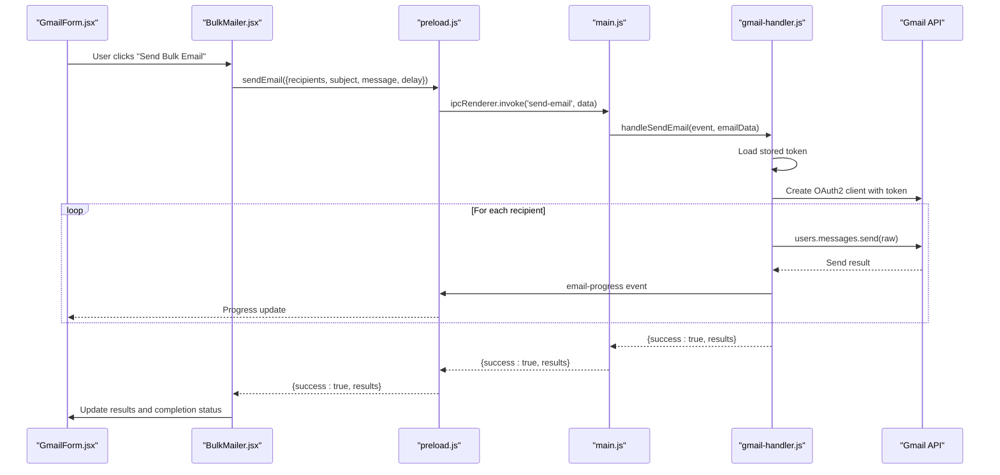
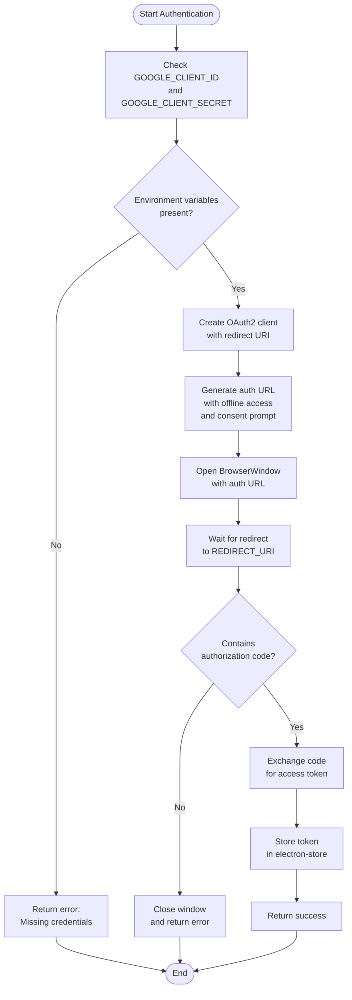
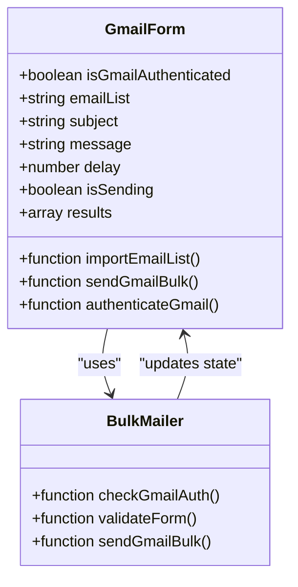
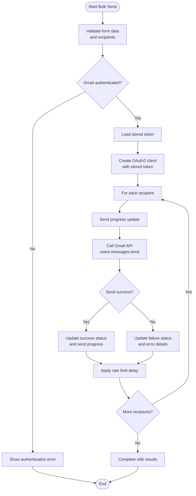
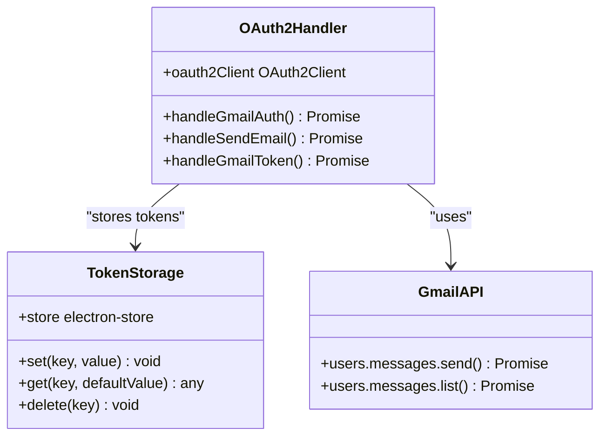
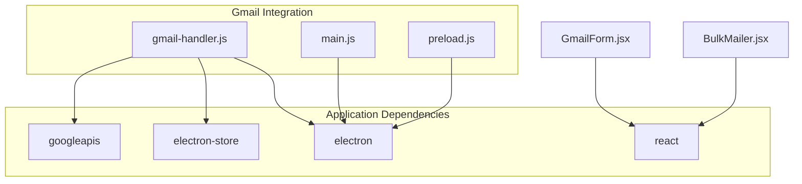

# Gmail API Integration

<cite>
**Referenced Files in This Document**
- [gmail-handler.js](file://electron/src/electron/gmail-handler.js)
- [main.js](file://electron/src/electron/main.js)
- [preload.js](file://electron/src/electron/preload.js)
- [GmailForm.jsx](file://electron/src/components/GmailForm.jsx)
- [BulkMailer.jsx](file://electron/src/components/BulkMailer.jsx)
- [smtp-handler.js](file://electron/src/electron/smtp-handler.js)
- [README.md](file://README.md)
- [package.json](file://electron/package.json)
</cite>

## Table of Contents
1. [Introduction](#introduction)
2. [Project Structure](#project-structure)
3. [Core Components](#core-components)
4. [Architecture Overview](#architecture-overview)
5. [Detailed Component Analysis](#detailed-component-analysis)
6. [Dependency Analysis](#dependency-analysis)
7. [Performance Considerations](#performance-considerations)
8. [Troubleshooting Guide](#troubleshooting-guide)
9. [Conclusion](#conclusion)
10. [Appendices](#appendices)

## Introduction
This document provides comprehensive documentation for Gmail API integration and OAuth2 authentication within the desktop application. It covers the complete OAuth2 flow, including client ID/secret configuration, consent screen setup, and token management. It also explains email composition with HTML support, subject handling, and the current implementation limitations around attachments. The document details the bulk email sending implementation with rate limiting and progress tracking, and addresses token storage, refresh mechanisms, and credential security. Finally, it includes troubleshooting guidance for authentication failures, API quota issues, and permission problems, along with best practices for Gmail API usage and security considerations.

## Project Structure
The Gmail integration is implemented across several modules:
- Electron main process handlers for Gmail authentication and email sending
- Preload bridge exposing secure IPC methods to the renderer
- React components for user interface and form handling
- SMTP handler for comparison and alternative email sending

**Diagram sources**
- [gmail-handler.js](file://electron/src/electron/gmail-handler.js#L1-L227)
- [main.js](file://electron/src/electron/main.js#L102-L108)
- [preload.js](file://electron/src/electron/preload.js#L4-L40)
- [BulkMailer.jsx](file://electron/src/components/BulkMailer.jsx#L1-L482)
- [GmailForm.jsx](file://electron/src/components/GmailForm.jsx#L1-L332)
- [smtp-handler.js](file://electron/src/electron/smtp-handler.js#L1-L110)

**Section sources**
- [gmail-handler.js](file://electron/src/electron/gmail-handler.js#L1-L227)
- [main.js](file://electron/src/electron/main.js#L102-L108)
- [preload.js](file://electron/src/electron/preload.js#L4-L40)
- [BulkMailer.jsx](file://electron/src/components/BulkMailer.jsx#L1-L482)
- [GmailForm.jsx](file://electron/src/components/GmailForm.jsx#L1-L332)
- [smtp-handler.js](file://electron/src/electron/smtp-handler.js#L1-L110)

## Core Components
- Gmail OAuth2 Handler: Manages OAuth2 flow, token acquisition, and storage
- Electron Main Process: Exposes IPC handlers for authentication and email sending
- Preload Bridge: Provides secure IPC methods to renderer
- Gmail Form Component: UI for authentication, recipient management, and email composition
- Bulk Mailer Component: Orchestrates authentication checks, form validation, and bulk sending
- SMTP Handler: Alternative email sending mechanism for comparison

Key implementation highlights:
- OAuth2 scopes configured for Gmail send capability
- Token storage using electron-store
- Rate limiting with configurable delays
- Real-time progress tracking via IPC events
- HTML email support in both Gmail API and SMTP modes

**Section sources**
- [gmail-handler.js](file://electron/src/electron/gmail-handler.js#L9-L130)
- [main.js](file://electron/src/electron/main.js#L102-L108)
- [preload.js](file://electron/src/electron/preload.js#L4-L21)
- [GmailForm.jsx](file://electron/src/components/GmailForm.jsx#L1-L332)
- [BulkMailer.jsx](file://electron/src/components/BulkMailer.jsx#L60-L107)
- [smtp-handler.js](file://electron/src/electron/smtp-handler.js#L6-L105)

## Architecture Overview
The Gmail integration follows a multi-layered architecture with clear separation of concerns:

**Diagram sources**
- [GmailForm.jsx](file://electron/src/components/GmailForm.jsx#L91-L100)
- [BulkMailer.jsx](file://electron/src/components/BulkMailer.jsx#L75-L107)
- [preload.js](file://electron/src/electron/preload.js#L6-L9)
- [main.js](file://electron/src/electron/main.js#L103-L103)
- [gmail-handler.js](file://electron/src/electron/gmail-handler.js#L15-L130)

The bulk email sending flow:

**Diagram sources**
- [GmailForm.jsx](file://electron/src/components/GmailForm.jsx#L229-L254)
- [BulkMailer.jsx](file://electron/src/components/BulkMailer.jsx#L181-L219)
- [preload.js](file://electron/src/electron/preload.js#L8-L21)
- [main.js](file://electron/src/electron/main.js#L105-L105)
- [gmail-handler.js](file://electron/src/electron/gmail-handler.js#L141-L214)

## Detailed Component Analysis

### Gmail OAuth2 Handler
The OAuth2 handler manages the complete authentication flow:

**Diagram sources**
- [gmail-handler.js](file://electron/src/electron/gmail-handler.js#L15-L130)

Key implementation details:
- OAuth2 scopes configured for Gmail send capability
- Redirect URI set to localhost callback
- Consent prompt forced to ensure refresh token acquisition
- 5-minute timeout for authentication flow
- Token storage using electron-store with automatic encryption

**Section sources**
- [gmail-handler.js](file://electron/src/electron/gmail-handler.js#L9-L130)

### Gmail Form Component
The Gmail form provides a comprehensive interface for email composition and bulk sending:

**Diagram sources**
- [GmailForm.jsx](file://electron/src/components/GmailForm.jsx#L3-L18)
- [BulkMailer.jsx](file://electron/src/components/BulkMailer.jsx#L10-L25)

The form implements:
- Real-time recipient count and status display
- Email validation with regex pattern
- Delay configuration for rate limiting
- Activity log with color-coded status indicators
- Integration with authentication and sending flows

**Section sources**
- [GmailForm.jsx](file://electron/src/components/GmailForm.jsx#L1-L332)
- [BulkMailer.jsx](file://electron/src/components/BulkMailer.jsx#L149-L219)

### Bulk Email Sending Implementation
The bulk sending implementation includes comprehensive rate limiting and progress tracking:

**Diagram sources**
- [gmail-handler.js](file://electron/src/electron/gmail-handler.js#L141-L214)
- [BulkMailer.jsx](file://electron/src/components/BulkMailer.jsx#L181-L219)

Implementation characteristics:
- Configurable delay between emails (default 1000ms)
- Real-time progress updates via IPC events
- Individual recipient status tracking
- Error handling with detailed error messages
- Results aggregation for completion reporting

**Section sources**
- [gmail-handler.js](file://electron/src/electron/gmail-handler.js#L141-L214)
- [BulkMailer.jsx](file://electron/src/components/BulkMailer.jsx#L181-L219)

### Token Storage and Refresh Mechanisms
The application implements secure token storage and management:

**Diagram sources**
- [gmail-handler.js](file://electron/src/electron/gmail-handler.js#L7-L13)
- [gmail-handler.js](file://electron/src/electron/gmail-handler.js#L132-L139)

Token management features:
- Automatic token persistence using electron-store
- Token loading on subsequent sessions
- OAuth2 client reinitialization with stored credentials
- Secure storage with automatic encryption

**Section sources**
- [gmail-handler.js](file://electron/src/electron/gmail-handler.js#L7-L13)
- [gmail-handler.js](file://electron/src/electron/gmail-handler.js#L132-L139)

## Dependency Analysis
The Gmail integration relies on several key dependencies:

**Diagram sources**
- [package.json](file://electron/package.json#L20-L31)
- [gmail-handler.js](file://electron/src/electron/gmail-handler.js#L1-L6)
- [main.js](file://electron/src/electron/main.js#L1-L12)
- [preload.js](file://electron/src/electron/preload.js#L1-L2)

External service dependencies:
- Google OAuth2 endpoints for authentication
- Gmail API v1 for email sending
- Electron runtime for desktop application

**Section sources**
- [package.json](file://electron/package.json#L20-L31)
- [gmail-handler.js](file://electron/src/electron/gmail-handler.js#L1-L6)
- [main.js](file://electron/src/electron/main.js#L1-L12)

## Performance Considerations
The implementation includes several performance and reliability features:

- Rate limiting: Configurable delays between email sends to avoid rate limits
- Asynchronous processing: Non-blocking UI during authentication and sending
- Progress tracking: Real-time feedback for long-running operations
- Error isolation: Individual recipient error handling without stopping the entire batch
- Memory management: Proper cleanup of BrowserWindow instances after OAuth flow

Best practices for optimal performance:
- Set appropriate delay values based on target provider limits
- Monitor API quotas and adjust batch sizes accordingly
- Use efficient recipient list management
- Implement proper error handling and retry logic for transient failures

## Troubleshooting Guide

### Authentication Failures
Common authentication issues and solutions:

**Missing Environment Variables**
- Symptom: Authentication returns error about missing client credentials
- Solution: Ensure GOOGLE_CLIENT_ID and GOOGLE_CLIENT_SECRET are set in .env file
- Verification: Check environment variable loading in OAuth2 handler

**OAuth Consent Screen Issues**
- Symptom: Authentication fails with consent screen errors
- Solution: Verify OAuth consent screen configuration in Google Cloud Console
- Verification: Confirm OAuth2 client type and authorized redirect URIs

**Token Exchange Failures**
- Symptom: Authorization code received but token exchange fails
- Solution: Check network connectivity and Google API availability
- Verification: Review OAuth2 client configuration and scopes

**Section sources**
- [gmail-handler.js](file://electron/src/electron/gmail-handler.js#L15-L130)
- [README.md](file://README.md#L101-L118)

### API Quota Issues
Gmail API quota limitations and mitigation strategies:

**Daily Quota Limits**
- Free Gmail accounts: ~500 emails per day
- Solution: Implement batch processing with appropriate delays
- Monitoring: Track send attempts and failures

**Rate Limiting**
- Symptom: 429 Too Many Requests responses
- Solution: Increase delay between sends, implement exponential backoff
- Prevention: Monitor API response headers for rate limit information

**Section sources**
- [README.md](file://README.md#L398-L402)

### Permission Problems
Permission-related issues and resolutions:

**Insufficient Scopes**
- Symptom: Authentication succeeds but email sending fails
- Solution: Ensure proper OAuth2 scopes are requested and granted
- Verification: Check token scope validation

**Account Restrictions**
- Symptom: Gmail API access denied
- Solution: Review Google Cloud Console API restrictions and account status
- Verification: Confirm API is enabled and billing is properly configured

**Section sources**
- [gmail-handler.js](file://electron/src/electron/gmail-handler.js#L10-L42)

### Security Considerations
Security measures implemented in the application:

**Credential Protection**
- Environment variables for client secrets
- Electron store encryption for token storage
- No plaintext password storage
- Secure IPC bridge with context isolation

**Best Practices**
- Regular credential rotation
- Principle of least privilege for OAuth scopes
- Network security for local development
- Secure handling of user data

**Section sources**
- [gmail-handler.js](file://electron/src/electron/gmail-handler.js#L7-L13)
- [README.md](file://README.md#L333-L340)

## Conclusion
The Gmail API integration provides a robust, secure, and user-friendly solution for bulk email sending. The implementation successfully handles OAuth2 authentication, token management, and bulk email operations with comprehensive error handling and progress tracking. While the current implementation focuses on HTML email support and basic rate limiting, it provides a solid foundation for future enhancements including attachment support and advanced analytics.

The modular architecture ensures maintainability and extensibility, while security considerations are addressed through proper credential handling and secure storage mechanisms. The application demonstrates best practices for desktop application development with Electron, including proper separation of concerns and secure IPC communication.

## Appendices

### Configuration Requirements
- Google Cloud Console project with Gmail API enabled
- OAuth2 client credentials with proper redirect URIs
- Environment variables for client ID and secret
- Electron store for token persistence

### API Reference
- Gmail API v1 users.messages.send endpoint
- OAuth2 authorization and token endpoints
- Google APIs Node.js client library

### Future Enhancements
- Attachment support for email sending
- Advanced analytics and delivery tracking
- Enhanced error handling and retry mechanisms
- Multi-threaded sending for improved performance
- Integration with Google Analytics for campaign monitoring