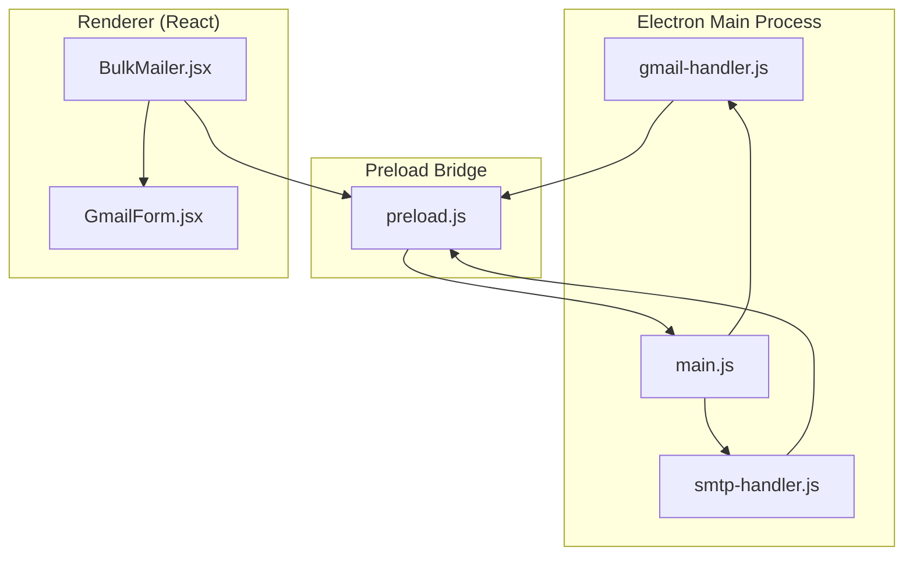
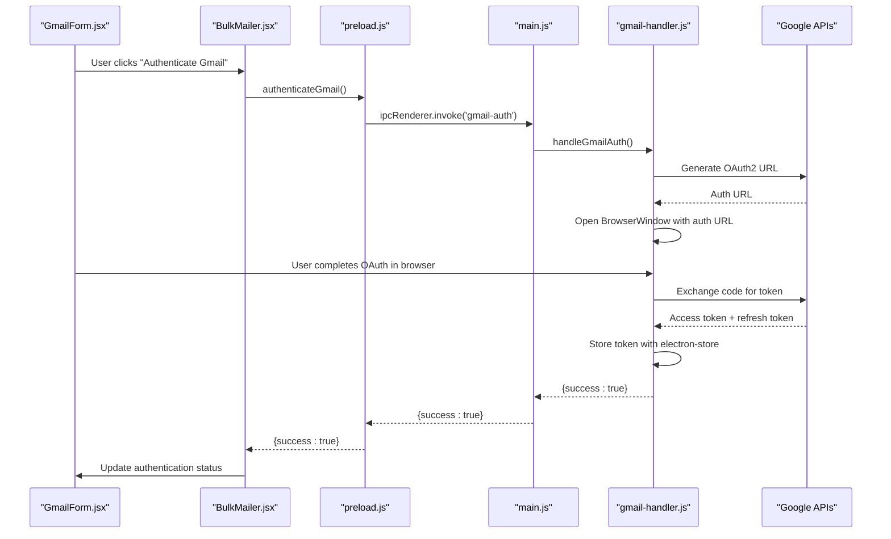
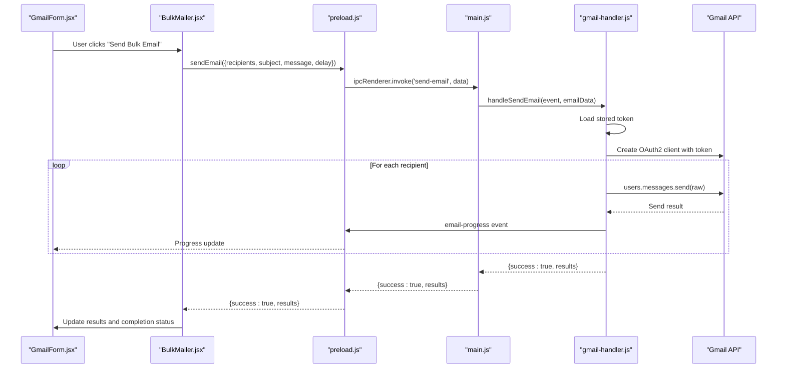
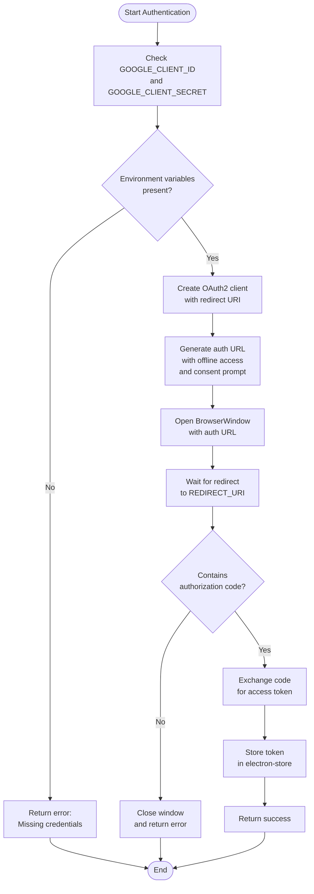
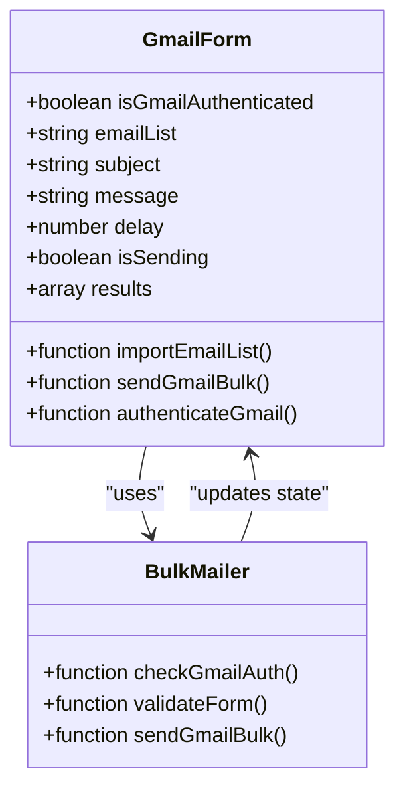
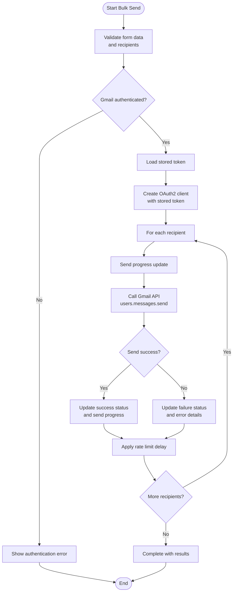
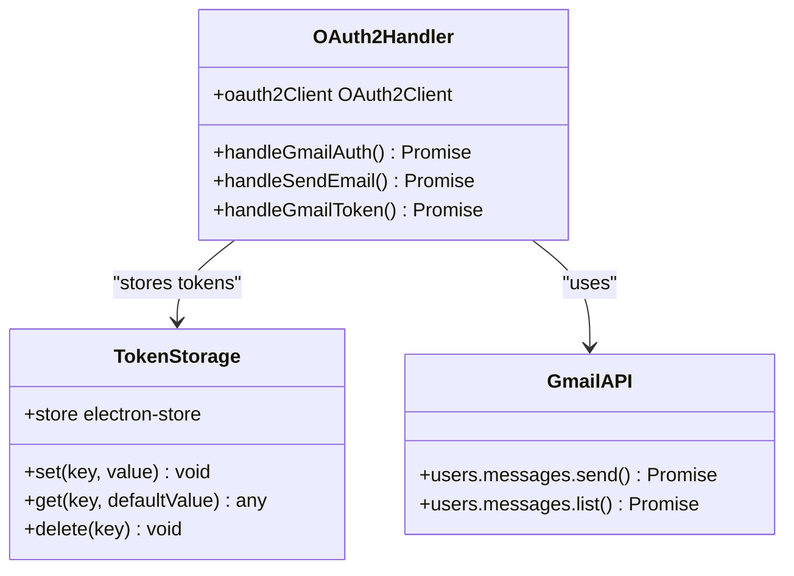
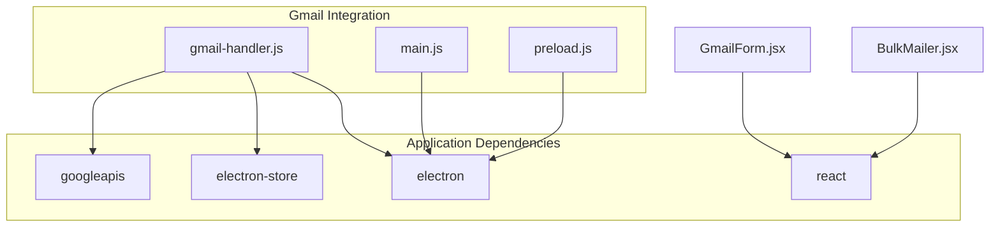

# Gmail API integration

## Introduction
This page provides detailed documentation for Gmail API integration and OAuth2 authentication within the desktop application. It covers the complete OAuth2 flow, including client ID/secret configuration, consent screen setup, and token management. It also explains email composition with HTML support, subject handling, and the current implementation limitations around attachments. The document details the bulk email sending implementation with rate limiting and progress tracking, and addresses token storage, refresh mechanisms, and credential security. Finally, it includes troubleshooting guidance for authentication failures, API quota issues, and permission problems, along with best practices for Gmail API usage and security considerations.

## Project structure
The Gmail integration is implemented across several modules:
- Electron main process handlers for Gmail authentication and email sending
- Preload bridge exposing secure IPC methods to the renderer
- React components for user interface and form handling
- SMTP handler for comparison and alternative email sending

```mermaid
graph TB
subgraph "Electron Main Process"
GM["gmail-handler.js"]
MM["main.js"]
SM["smtp-handler.js"]
end
subgraph "Preload Bridge"
PR["preload.js"]
end
subgraph "Renderer (React)"
BM["BulkMailer.jsx"]
GF["GmailForm.jsx"]
end
BM --> GF
BM --> PR
PR --> MM
MM --> GM
MM --> SM
GM --> PR
SM --> PR
```

## Core components
- Gmail OAuth2 Handler: Manages OAuth2 flow, token acquisition, and storage
- Electron Main Process: Exposes IPC handlers for authentication and email sending
- Preload Bridge: Provides secure IPC methods to renderer
- Gmail Form Component: UI for authentication, recipient management, and email composition
- Bulk Mailer Component: Orchestrates authentication checks, form validation, and bulk sending
- SMTP Handler: Alternative email sending mechanism for comparison

Key implementation highlights:
- OAuth2 scopes configured for Gmail send capability
- Token storage using electron-store
- Rate limiting with configurable delays
- Real-time progress tracking via IPC events
- HTML email support in both Gmail API and SMTP modes

## Architecture overview
The Gmail integration follows a multi-layered architecture with clear separation of concerns:

```mermaid
sequenceDiagram
participant UI as "GmailForm.jsx"
participant BM as "BulkMailer.jsx"
participant PR as "preload.js"
participant MM as "main.js"
participant GH as "gmail-handler.js"
participant GA as "Google APIs"
UI->>BM : User clicks "Authenticate Gmail"
BM->>PR : authenticateGmail()
PR->>MM : ipcRenderer.invoke('gmail-auth')
MM->>GH : handleGmailAuth()
GH->>GA : Generate OAuth2 URL
GA-->>GH : Auth URL
GH->>GH : Open BrowserWindow with auth URL
UI->>GH : User completes OAuth in browser
GH->>GA : Exchange code for token
GA-->>GH : Access token + refresh token
GH->>GH : Store token with electron-store
GH-->>MM : {success : true}
MM-->>PR : {success : true}
PR-->>BM : {success : true}
BM->>UI : Update authentication status
```

The bulk email sending flow:

```mermaid
sequenceDiagram
participant UI as "GmailForm.jsx"
participant BM as "BulkMailer.jsx"
participant PR as "preload.js"
participant MM as "main.js"
participant GH as "gmail-handler.js"
participant GA as "Gmail API"
UI->>BM : User clicks "Send Bulk Email"
BM->>PR : sendEmail({recipients, subject, message, delay})
PR->>MM : ipcRenderer.invoke('send-email', data)
MM->>GH : handleSendEmail(event, emailData)
GH->>GH : Load stored token
GH->>GA : Create OAuth2 client with token
loop For each recipient
GH->>GA : users.messages.send(raw)
GA-->>GH : Send result
GH->>PR : email-progress event
PR-->>UI : Progress update
end
GH-->>MM : {success : true, results}
MM-->>PR : {success : true, results}
PR-->>BM : {success : true, results}
BM->>UI : Update results and completion status
```

## Detailed component analysis

### Gmail OAuth2 handler
The OAuth2 handler manages the complete authentication flow:

```mermaid
flowchart TD
Start([Start Authentication]) --> CheckEnv["Check GOOGLE_CLIENT_ID<br/>and GOOGLE_CLIENT_SECRET"]
CheckEnv --> EnvOK{"Environment variables<br/>present?"}
EnvOK --> |No| ReturnError["Return error:<br/>Missing credentials"]
EnvOK --> |Yes| CreateClient["Create OAuth2 client<br/>with redirect URI"]
CreateClient --> GenerateURL["Generate auth URL<br/>with offline access<br/>and consent prompt"]
GenerateURL --> OpenWindow["Open BrowserWindow<br/>with auth URL"]
OpenWindow --> WaitRedirect["Wait for redirect<br/>to REDIRECT_URI"]
WaitRedirect --> HasCode{"Contains<br/>authorization code?"}
HasCode --> |No| CloseWindow["Close window<br/>and return error"]
HasCode --> |Yes| ExchangeToken["Exchange code<br/>for access token"]
ExchangeToken --> StoreToken["Store token<br/>in electron-store"]
StoreToken --> Success["Return success"]
ReturnError --> End([End])
CloseWindow --> End
Success --> End
```

Key implementation details:
- OAuth2 scopes configured for Gmail send capability
- Redirect URI set to localhost callback
- Consent prompt forced to ensure refresh token acquisition
- 5-minute timeout for authentication flow
- Token storage using electron-store with automatic encryption

### Gmail form component
The Gmail form provides a detailed interface for email composition and bulk sending:

```mermaid
classDiagram
class GmailForm {
+boolean isGmailAuthenticated
+string emailList
+string subject
+string message
+number delay
+boolean isSending
+array results
+function importEmailList()
+function sendGmailBulk()
+function authenticateGmail()
}
class BulkMailer {
+function checkGmailAuth()
+function validateForm()
+function sendGmailBulk()
}
GmailForm --> BulkMailer : "uses"
BulkMailer --> GmailForm : "updates state"
```

The form implements:
- Real-time recipient count and status display
- Email validation with regex pattern
- Delay configuration for rate limiting
- Activity log with color-coded status indicators
- Integration with authentication and sending flows

### Bulk email sending implementation
The bulk sending implementation includes detailed rate limiting and progress tracking:

```mermaid
flowchart TD
Start([Start Bulk Send]) --> Validate["Validate form data<br/>and recipients"]
Validate --> AuthCheck{"Gmail authenticated?"}
AuthCheck --> |No| ShowError["Show authentication error"]
AuthCheck --> |Yes| LoadToken["Load stored token"]
LoadToken --> CreateClient["Create OAuth2 client<br/>with stored token"]
CreateClient --> LoopStart["For each recipient"]
LoopStart --> SendProgress["Send progress update"]
SendProgress --> SendEmail["Call Gmail API<br/>users.messages.send"]
SendEmail --> Success{"Send success?"}
Success --> |Yes| UpdateSuccess["Update success status<br/>and send progress"]
Success --> |No| UpdateFailure["Update failure status<br/>and error details"]
UpdateSuccess --> Delay["Apply rate limit delay"]
UpdateFailure --> Delay
Delay --> MoreRecipients{"More recipients?"}
MoreRecipients --> |Yes| LoopStart
MoreRecipients --> |No| Complete["Complete with results"]
ShowError --> End([End])
Complete --> End
```

Implementation characteristics:
- Configurable delay between emails (default 1000ms)
- Real-time progress updates via IPC events
- Individual recipient status tracking
- Error handling with detailed error messages
- Results aggregation for completion reporting

### Token storage and refresh mechanisms
The application implements secure token storage and management:

```mermaid
classDiagram
class TokenStorage {
+store electron-store
+set(key, value) void
+get(key, defaultValue) any
+delete(key) void
}
class OAuth2Handler {
+oauth2Client OAuth2Client
+handleGmailAuth() Promise
+handleSendEmail() Promise
+handleGmailToken() Promise
}
class GmailAPI {
+users.messages.send() Promise
+users.messages.list() Promise
}
OAuth2Handler --> TokenStorage : "stores tokens"
OAuth2Handler --> GmailAPI : "uses"
```

Token management features:
- Automatic token persistence using electron-store
- Token loading on subsequent sessions
- OAuth2 client reinitialization with stored credentials
- Secure storage with automatic encryption

## Dependency analysis
The Gmail integration relies on several key dependencies:

```mermaid
graph TB
subgraph "Application Dependencies"
GA["googleapis"]
ES["electron-store"]
EL["electron"]
RE["react"]
end
subgraph "Gmail Integration"
GH["gmail-handler.js"]
MM["main.js"]
PR["preload.js"]
end
GH --> GA
GH --> ES
GH --> EL
MM --> EL
PR --> EL
GF["GmailForm.jsx"] --> RE
BM["BulkMailer.jsx"] --> RE
```

External service dependencies:
- Google OAuth2 endpoints for authentication
- Gmail API v1 for email sending
- Electron runtime for desktop application

## Performance considerations
The implementation includes several performance and reliability features:

- Rate limiting: Configurable delays between email sends to avoid rate limits
- Asynchronous processing: Non-blocking UI during authentication and sending
- Progress tracking: Real-time feedback for long-running operations
- Error isolation: Individual recipient error handling without stopping the entire batch
- Memory management: Proper cleanup of BrowserWindow instances after OAuth flow

Best practices for optimal performance:
- Set appropriate delay values based on target provider limits
- Monitor API quotas and adjust batch sizes accordingly
- Use efficient recipient list management
- Implement proper error handling and retry logic for transient failures

## Troubleshooting guide

### Authentication failures
Common authentication issues and solutions:

**Missing Environment Variables**
- Symptom: Authentication returns error about missing client credentials
- Solution: Ensure GOOGLE_CLIENT_ID and GOOGLE_CLIENT_SECRET are set in.env file
- Verification: Check environment variable loading in OAuth2 handler

**OAuth Consent Screen Issues**
- Symptom: Authentication fails with consent screen errors
- Solution: Verify OAuth consent screen configuration in Google Cloud Console
- Verification: Confirm OAuth2 client type and authorized redirect URIs

**Token Exchange Failures**
- Symptom: Authorization code received but token exchange fails
- Solution: Check network connectivity and Google API availability
- Verification: Review OAuth2 client configuration and scopes

### API quota issues
Gmail API quota limitations and mitigation strategies:

**Daily Quota Limits**
- Free Gmail accounts: ~500 emails per day
- Solution: Implement batch processing with appropriate delays
- Monitoring: Track send attempts and failures

**Rate Limiting**
- Symptom: 429 Too Many Requests responses
- Solution: Increase delay between sends, implement exponential backoff
- Prevention: Monitor API response headers for rate limit information

### Permission problems
Permission-related issues and resolutions:

**Insufficient Scopes**
- Symptom: Authentication succeeds but email sending fails
- Solution: Ensure proper OAuth2 scopes are requested and granted
- Verification: Check token scope validation

**Account Restrictions**
- Symptom: Gmail API access denied
- Solution: Review Google Cloud Console API restrictions and account status
- Verification: Confirm API is enabled and billing is properly configured

### Security considerations
Security measures implemented in the application:

**Credential Protection**
- Environment variables for client secrets
- Electron store encryption for token storage
- No plaintext password storage
- Secure IPC bridge with context isolation

**Best Practices**
- Regular credential rotation
- Principle of least privilege for OAuth scopes
- Network security for local development
- Secure handling of user data

## Conclusion
The Gmail API integration provides a reliable, secure, and user-friendly solution for bulk email sending. The implementation successfully handles OAuth2 authentication, token management, and bulk email operations with detailed error handling and progress tracking. While the current implementation focuses on HTML email support and basic rate limiting, it provides a solid foundation for future enhancements including attachment support and advanced analytics.

The modular architecture ensures maintainability and extensibility, while security considerations are addressed through proper credential handling and secure storage mechanisms. The application demonstrates best practices for desktop application development with Electron, including proper separation of concerns and secure IPC communication.

## Appendices

### Configuration requirements
- Google Cloud Console project with Gmail API enabled
- OAuth2 client credentials with proper redirect URIs
- Environment variables for client ID and secret
- Electron store for token persistence

### API reference
- Gmail API v1 users.messages.send endpoint
- OAuth2 authorization and token endpoints
- Google APIs Node.js client library

### Future enhancements
- Attachment support for email sending
- Advanced analytics and delivery tracking
- Improved error handling and retry mechanisms
- Multi-threaded sending for improved performance
- Integration with Google Analytics for campaign monitoring
