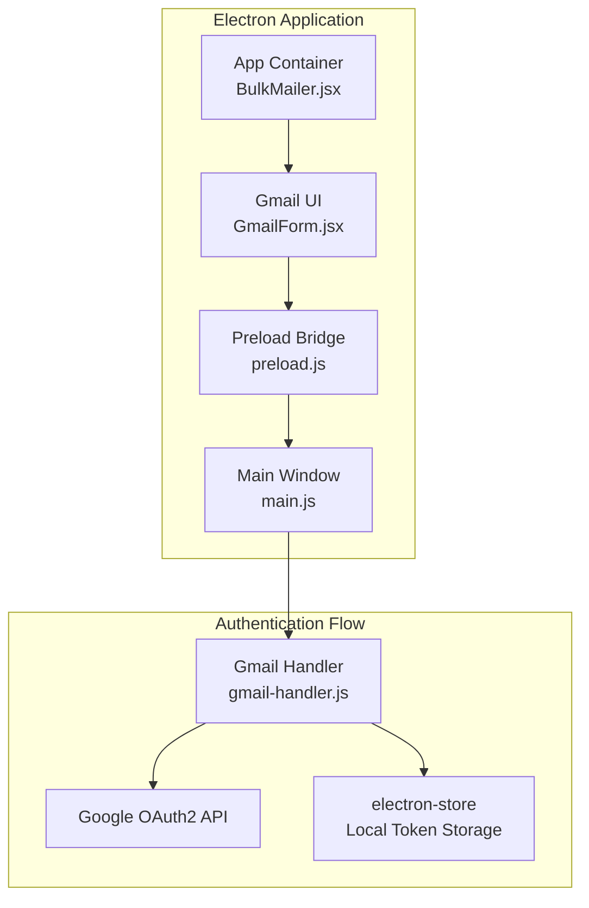
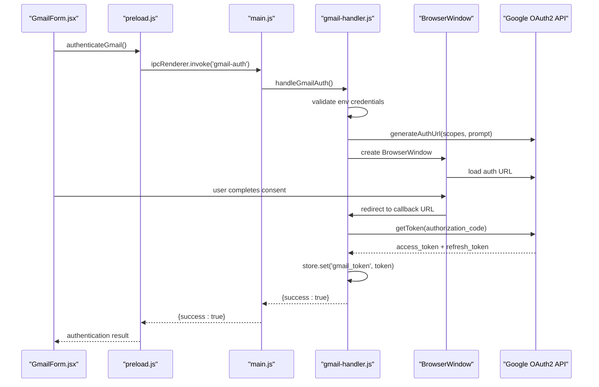
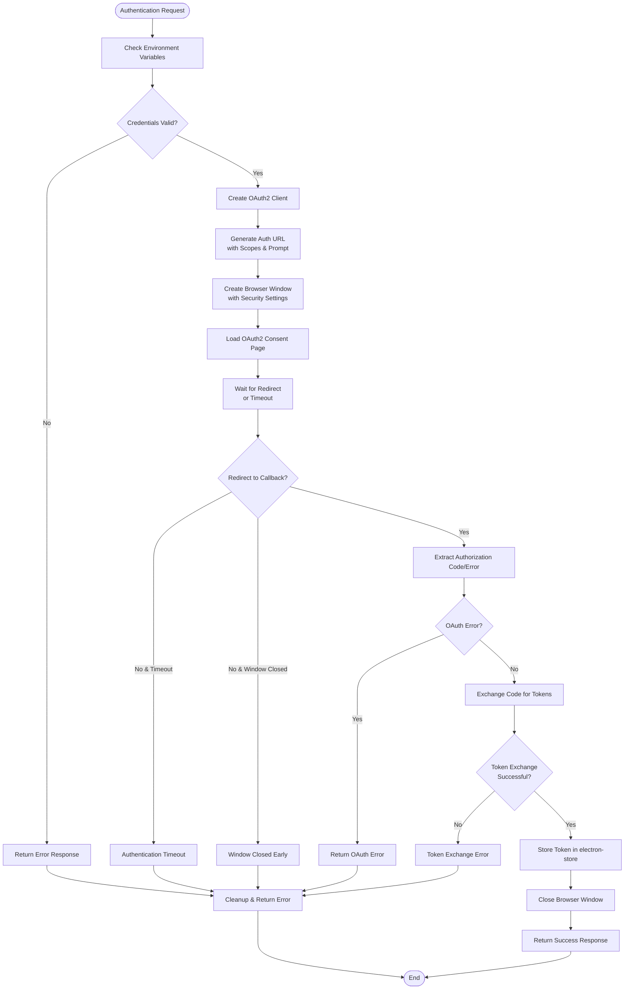
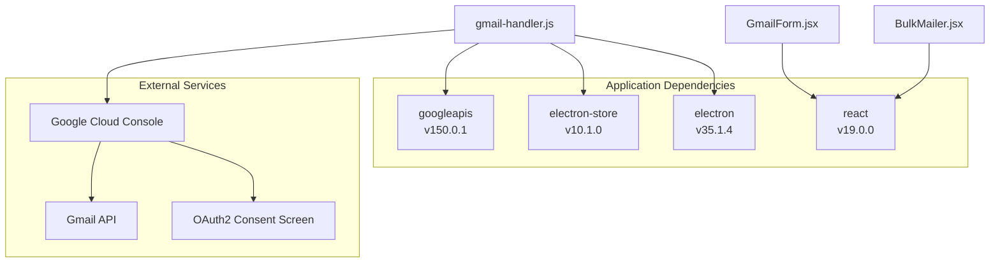

# OAuth2 Authentication Flow

<cite>
**Referenced Files in This Document**
- [gmail-handler.js](file://electron/src/electron/gmail-handler.js)
- [main.js](file://electron/src/electron/main.js)
- [preload.js](file://electron/src/electron/preload.js)
- [GmailForm.jsx](file://electron/src/components/GmailForm.jsx)
- [BulkMailer.jsx](file://electron/src/components/BulkMailer.jsx)
- [package.json](file://electron/package.json)
- [README.md](file://README.md)
- [smtp-handler.js](file://electron/src/electron/smtp-handler.js)
</cite>

## Table of Contents
1. [Introduction](#introduction)
2. [Project Structure](#project-structure)
3. [Core Components](#core-components)
4. [Architecture Overview](#architecture-overview)
5. [Detailed Component Analysis](#detailed-component-analysis)
6. [Dependency Analysis](#dependency-analysis)
7. [Performance Considerations](#performance-considerations)
8. [Troubleshooting Guide](#troubleshooting-guide)
9. [Conclusion](#conclusion)
10. [Appendices](#appendices)

## Introduction
This document provides comprehensive documentation for the Gmail OAuth2 authentication implementation in the desktop application. It covers the complete OAuth2 flow including client ID/secret configuration, consent screen setup, redirect URI handling, browser window implementation for OAuth2 consent, token exchange and storage, and troubleshooting for common issues. The implementation leverages Electron's main/preload process model, Google APIs client library, and secure local storage via electron-store.

## Project Structure
The Gmail OAuth2 implementation spans three primary areas:
- Electron main process: IPC registration and orchestration
- Preload script: Secure IPC bridge exposing safe APIs to the renderer
- Renderer components: UI integration and user interaction



**Diagram sources**
- [main.js](file://electron/src/electron/main.js#L102-L105)
- [preload.js](file://electron/src/electron/preload.js#L4-L21)
- [GmailForm.jsx](file://electron/src/components/GmailForm.jsx#L91-L99)
- [BulkMailer.jsx](file://electron/src/components/BulkMailer.jsx#L60-L73)
- [gmail-handler.js](file://electron/src/electron/gmail-handler.js#L15-L130)

**Section sources**
- [main.js](file://electron/src/electron/main.js#L102-L105)
- [preload.js](file://electron/src/electron/preload.js#L4-L21)
- [GmailForm.jsx](file://electron/src/components/GmailForm.jsx#L91-L99)
- [BulkMailer.jsx](file://electron/src/components/BulkMailer.jsx#L60-L73)

## Core Components
The OAuth2 implementation consists of four core components working together:

### 1. Gmail Handler (Authentication Engine)
The central authentication module that manages OAuth2 lifecycle:
- Validates environment credentials
- Generates OAuth2 URLs with proper scopes
- Manages browser window for consent
- Handles token exchange and storage
- Implements timeout and error management

### 2. Main Process IPC Registration
Registers all authentication-related IPC handlers:
- `gmail-auth`: Initiates OAuth2 flow
- `gmail-token`: Checks token availability
- `send-email`: Sends emails using stored credentials

### 3. Preload Bridge
Provides secure access to authentication APIs:
- Exposes `authenticateGmail`, `getGmailToken`, `sendEmail`
- Bridges renderer to main process safely
- Handles progress events for email sending

### 4. UI Integration
Two-way integration between UI and authentication:
- Authentication button triggers OAuth2 flow
- Token status displayed in UI
- Progress tracking during email sending

**Section sources**
- [gmail-handler.js](file://electron/src/electron/gmail-handler.js#L15-L130)
- [main.js](file://electron/src/electron/main.js#L102-L105)
- [preload.js](file://electron/src/electron/preload.js#L4-L21)
- [GmailForm.jsx](file://electron/src/components/GmailForm.jsx#L91-L99)
- [BulkMailer.jsx](file://electron/src/components/BulkMailer.jsx#L60-L73)

## Architecture Overview
The OAuth2 flow follows a secure, multi-process architecture designed to isolate sensitive operations in the main process while maintaining a responsive UI.



**Diagram sources**
- [GmailForm.jsx](file://electron/src/components/GmailForm.jsx#L91-L99)
- [preload.js](file://electron/src/electron/preload.js#L6-L8)
- [main.js](file://electron/src/electron/main.js#L102-L105)
- [gmail-handler.js](file://electron/src/electron/gmail-handler.js#L15-L130)

## Detailed Component Analysis

### Gmail Handler Implementation
The authentication engine implements a robust OAuth2 flow with comprehensive error handling and timeout management.

#### Configuration and Initialization
- **Scopes**: Requested scope is `https://www.googleapis.com/auth/gmail.send`
- **Redirect URI**: `http://localhost:3000/oauth/callback`
- **Prompt Parameter**: Uses `consent` to ensure refresh token acquisition
- **Access Type**: Offline access for long-term token usage

#### Authentication URL Generation
The handler generates OAuth2 URLs with:
- Proper scope specification for Gmail send permissions
- Consent prompt to guarantee refresh token retrieval
- Offline access type for persistent authentication

#### Browser Window Implementation
The implementation creates a dedicated browser window for OAuth2 consent:
- **Security Settings**: Node integration disabled, context isolation enabled
- **Window Size**: 800x800 pixels for optimal consent screen display
- **Show Policy**: Hidden until ready-to-show event for smooth UX
- **Timeout Handling**: 5-minute timeout prevents hanging windows

#### Redirect Handling and Token Exchange
The handler monitors redirects and processes authentication responses:
- **Callback Detection**: Watches for URLs starting with configured redirect URI
- **Error Extraction**: Parses OAuth error parameters from redirect URL
- **Authorization Code Extraction**: Retrieves code parameter for token exchange
- **Token Exchange**: Uses Google APIs client to exchange code for tokens
- **Credential Storage**: Stores tokens securely using electron-store

#### Timeout and Error Management
Comprehensive error handling ensures graceful failure scenarios:
- **Authentication Timeout**: Closes window after 5 minutes
- **Window Closure**: Handles user-initiated window closure
- **Network Errors**: Catches and reports token exchange failures
- **Consent Screen Errors**: Processes OAuth error responses



**Diagram sources**
- [gmail-handler.js](file://electron/src/electron/gmail-handler.js#L15-L130)

**Section sources**
- [gmail-handler.js](file://electron/src/electron/gmail-handler.js#L10-L130)

### Main Process IPC Integration
The main process registers and handles all authentication-related IPC operations with proper error propagation.

#### IPC Handler Registration
- **`gmail-auth`**: Primary authentication handler
- **`gmail-token`**: Token availability checker
- **`send-email`**: Email sending with stored credentials

#### Error Propagation
All handlers return structured responses with success flags and error details, enabling robust UI feedback.

**Section sources**
- [main.js](file://electron/src/electron/main.js#L102-L105)

### Preload Bridge Security Model
The preload script implements a secure IPC bridge that exposes only necessary authentication APIs to the renderer process.

#### Exposed APIs
- **Authentication**: `authenticateGmail()`, `getGmailToken()`
- **Email Operations**: `sendEmail()`
- **Event Listeners**: Progress tracking for email operations

#### Security Features
- **Context Isolation**: Prevents direct Node.js access from renderer
- **Selective Exposure**: Only authentication-related APIs exposed
- **IPC Validation**: All renderer-to-main calls use explicit IPC channels

**Section sources**
- [preload.js](file://electron/src/electron/preload.js#L4-L21)

### UI Integration Components
The UI components provide seamless user interaction with the authentication system.

#### GmailForm Component
- **Authentication Button**: Triggers OAuth2 flow with proper error handling
- **Status Display**: Shows authentication status with visual indicators
- **Progress Tracking**: Displays real-time email sending progress
- **Validation**: Comprehensive form validation before sending

#### BulkMailer Integration
- **Token Checking**: Automatically checks authentication status on load
- **Error Handling**: Graceful handling of missing Electron APIs
- **User Feedback**: Clear alerts for authentication success/failure
- **Form Validation**: Email format validation and recipient count verification

**Section sources**
- [GmailForm.jsx](file://electron/src/components/GmailForm.jsx#L91-L99)
- [BulkMailer.jsx](file://electron/src/components/BulkMailer.jsx#L60-L73)

## Dependency Analysis
The OAuth2 implementation relies on several key dependencies and external services.



**Diagram sources**
- [package.json](file://electron/package.json#L20-L31)
- [gmail-handler.js](file://electron/src/electron/gmail-handler.js#L3-L5)

### External Dependencies
- **googleapis**: Provides OAuth2 client implementation and Gmail API integration
- **electron-store**: Handles secure local token storage
- **electron**: Main process and BrowserWindow for OAuth2 consent
- **react**: UI components for user interaction

### Google Cloud Configuration
The implementation requires specific Google Cloud Console setup:
- OAuth2 Client ID (Desktop application)
- Enabled Gmail API
- Proper OAuth2 consent screen configuration
- Correct redirect URI setup

**Section sources**
- [package.json](file://electron/package.json#L20-L31)
- [README.md](file://README.md#L101-L119)

## Performance Considerations
The OAuth2 implementation includes several performance optimizations and considerations:

### Token Reuse
- Stored tokens eliminate repeated authentication prompts
- OAuth2 client reinitialization only when necessary
- Efficient token validation reduces unnecessary API calls

### Rate Limiting
- Configurable delays between email sends prevent rate limiting
- Progress tracking enables user control over sending speed
- Batch processing with controlled intervals

### Memory Management
- Browser windows closed after authentication completion
- Timeout cleanup prevents memory leaks
- Proper error handling ensures resource cleanup

## Troubleshooting Guide

### Common OAuth2 Issues and Solutions

#### Invalid Client Credentials
**Symptoms**: Authentication fails immediately with credential errors
**Causes**: Missing or incorrect GOOGLE_CLIENT_ID/GOOGLE_CLIENT_SECRET
**Solutions**:
- Verify environment variables are set correctly
- Confirm Google Cloud Console project configuration
- Ensure OAuth2 client credentials match project settings

#### Consent Screen Errors
**Symptoms**: OAuth error responses during consent process
**Causes**: Mismatched redirect URIs, invalid scopes, or user rejection
**Solutions**:
- Verify redirect URI matches Google Cloud Console configuration
- Check scope permissions and user consent
- Ensure proper OAuth2 consent screen setup

#### Token Exchange Failures
**Symptoms**: Authentication succeeds but token retrieval fails
**Causes**: Network issues, expired authorization codes, or API errors
**Solutions**:
- Retry authentication process
- Check network connectivity
- Verify Google APIs are enabled in project

#### Authentication Timeout
**Symptoms**: Window closes after 5 minutes without user interaction
**Causes**: Slow network, blocked pop-ups, or user inactivity
**Solutions**:
- Ensure popup blockers are disabled
- Check network connectivity
- Retry authentication with improved conditions

#### Token Storage Issues
**Symptoms**: Authentication works but tokens aren't persisted
**Causes**: electron-store initialization errors or permission issues
**Solutions**:
- Verify electron-store installation
- Check application data directory permissions
- Restart application to refresh storage

### Environment Setup Checklist
1. **Google Cloud Console Configuration**:
   - Create project and enable Gmail API
   - Configure OAuth2 consent screen
   - Create Desktop OAuth2 client ID
   - Download and place credentials JSON

2. **Environment Variables**:
   ```env
   GOOGLE_CLIENT_ID=your_client_id_here
   GOOGLE_CLIENT_SECRET=your_client_secret_here
   ```

3. **Redirect URI Configuration**:
   - Ensure redirect URI matches `http://localhost:3000/oauth/callback`
   - Verify in Google Cloud Console OAuth2 client settings

4. **Application Permissions**:
   - Grant necessary Gmail permissions
   - Verify user account has Gmail access
   - Check for domain restrictions if applicable

**Section sources**
- [README.md](file://README.md#L101-L119)
- [gmail-handler.js](file://electron/src/electron/gmail-handler.js#L20-L29)

## Conclusion
The Gmail OAuth2 authentication implementation provides a secure, robust, and user-friendly solution for desktop email integration. The multi-process architecture ensures sensitive operations remain isolated while maintaining a responsive user experience. Key strengths include comprehensive error handling, timeout management, secure token storage, and seamless UI integration. The implementation follows OAuth2 best practices with proper scope management, consent screen handling, and refresh token acquisition for persistent authentication.

## Appendices

### Step-by-Step Google Cloud Console Setup
1. Navigate to Google Cloud Console
2. Create a new project or select existing one
3. Enable the Gmail API for the project
4. Go to "Credentials" → "Create Credentials" → "OAuth 2.0 Client IDs"
5. Select "Desktop application" as application type
6. Download the JSON file containing client credentials
7. Configure OAuth2 consent screen with required scopes
8. Set redirect URI to `http://localhost:3000/oauth/callback`
9. Copy client ID and secret to environment variables

### Environment Variable Configuration
Create a `.env` file in the electron directory:
```env
GOOGLE_CLIENT_ID=your_client_id_here
GOOGLE_CLIENT_SECRET=your_client_secret_here
```

### Security Best Practices
- Store client secrets securely in environment variables
- Use offline access type for long-term token persistence
- Implement proper timeout handling to prevent hanging sessions
- Validate all user inputs before initiating authentication
- Use HTTPS for production deployments when applicable