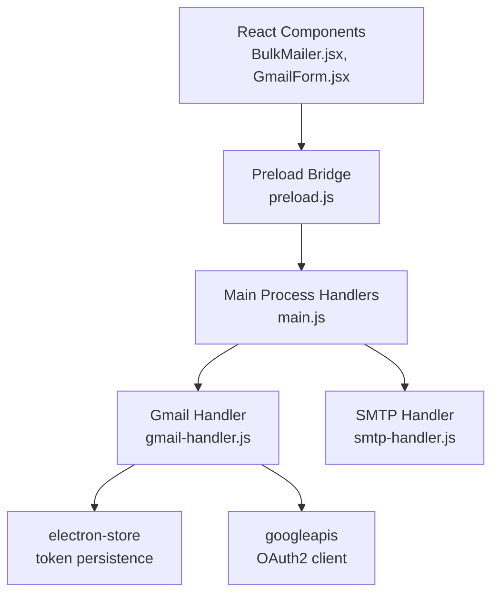
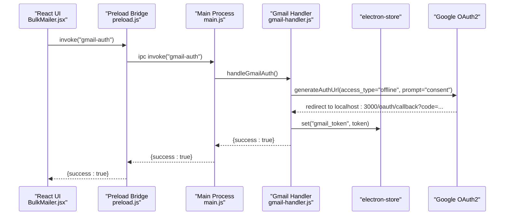
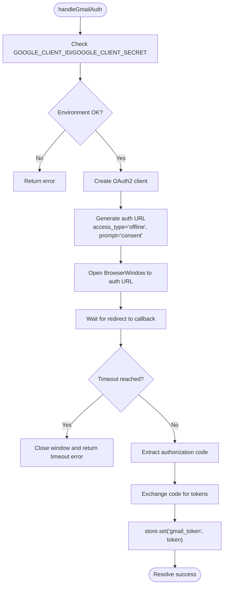
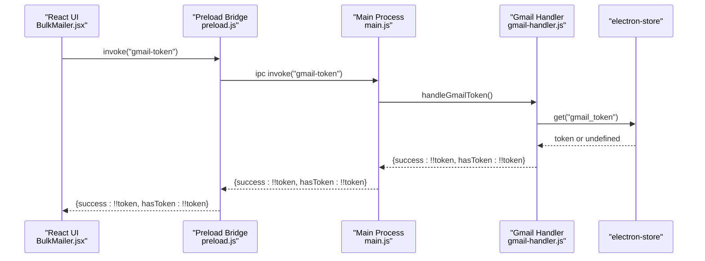
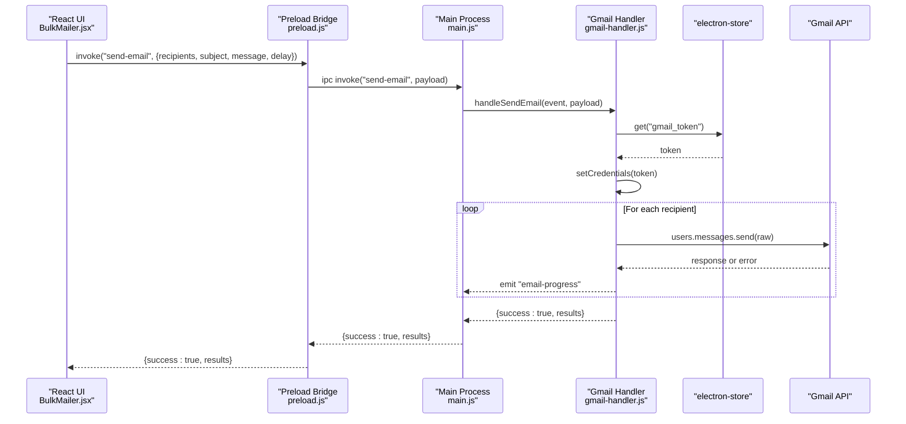
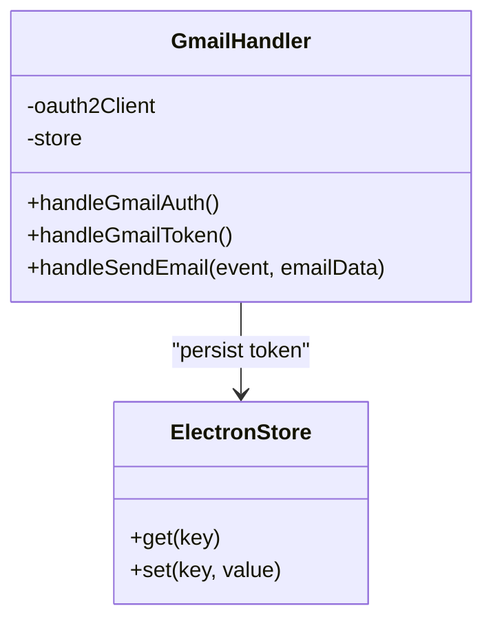
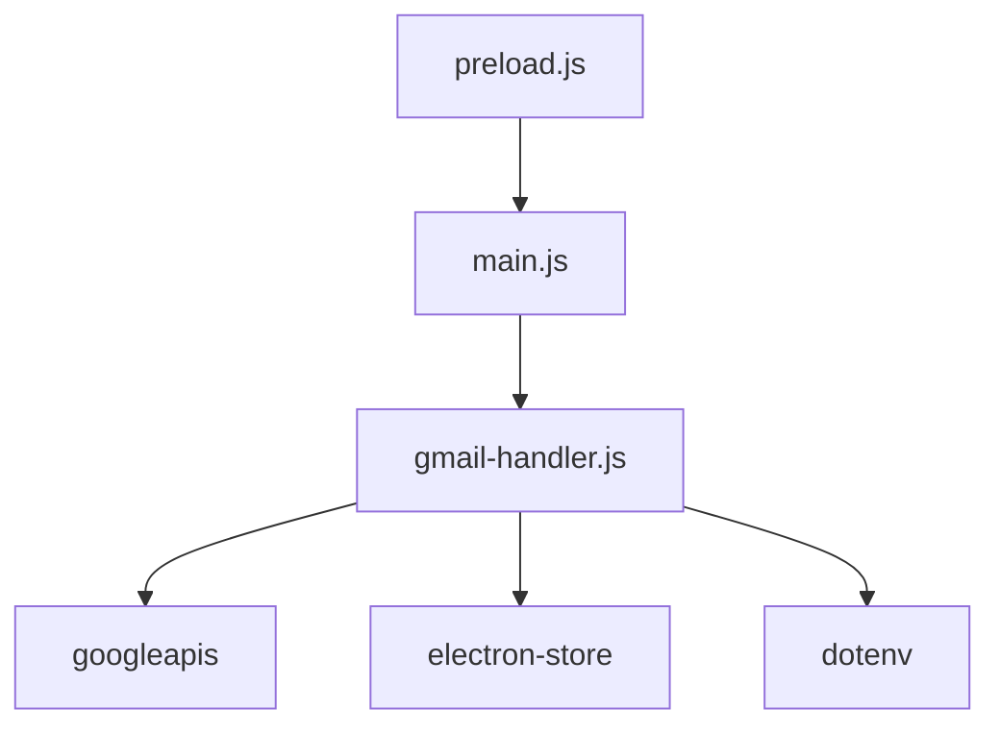

# Token Storage and Management

<cite>
**Referenced Files in This Document**
- [gmail-handler.js](file://electron/src/electron/gmail-handler.js)
- [main.js](file://electron/src/electron/main.js)
- [preload.js](file://electron/src/electron/preload.js)
- [package.json](file://electron/package.json)
- [BulkMailer.jsx](file://electron/src/components/BulkMailer.jsx)
- [GmailForm.jsx](file://electron/src/components/GmailForm.jsx)
- [smtp-handler.js](file://electron/src/electron/smtp-handler.js)
</cite>

## Table of Contents
1. [Introduction](#introduction)
2. [Project Structure](#project-structure)
3. [Core Components](#core-components)
4. [Architecture Overview](#architecture-overview)
5. [Detailed Component Analysis](#detailed-component-analysis)
6. [Dependency Analysis](#dependency-analysis)
7. [Performance Considerations](#performance-considerations)
8. [Troubleshooting Guide](#troubleshooting-guide)
9. [Conclusion](#conclusion)

## Introduction
This document explains the Gmail OAuth2 token storage and management system implemented in the Electron application. It covers how credentials are persisted using electron-store, how authentication flows work, and how token usage is integrated into email sending. It also documents the current limitations around automatic token refresh and outlines recommended approaches for token lifecycle management, security hardening, and troubleshooting.

## Project Structure
The token management system spans three primary areas:
- Electron main process handlers for Gmail authentication and sending
- Frontend React components that trigger authentication and send operations
- Electron preload bridge exposing IPC APIs to the renderer

**Diagram sources**
- [main.js](file://electron/src/electron/main.js#L102-L105)
- [gmail-handler.js](file://electron/src/electron/gmail-handler.js#L1-L227)
- [preload.js](file://electron/src/electron/preload.js#L1-L41)
- [BulkMailer.jsx](file://electron/src/components/BulkMailer.jsx#L60-L107)
- [GmailForm.jsx](file://electron/src/components/GmailForm.jsx#L1-L332)
- [smtp-handler.js](file://electron/src/electron/smtp-handler.js#L1-L110)

**Section sources**
- [main.js](file://electron/src/electron/main.js#L102-L105)
- [gmail-handler.js](file://electron/src/electron/gmail-handler.js#L1-L227)
- [preload.js](file://electron/src/electron/preload.js#L1-L41)
- [BulkMailer.jsx](file://electron/src/components/BulkMailer.jsx#L60-L107)
- [GmailForm.jsx](file://electron/src/components/GmailForm.jsx#L1-L332)
- [smtp-handler.js](file://electron/src/electron/smtp-handler.js#L1-L110)

## Core Components
- Gmail authentication and token exchange: Creates an OAuth2 client, opens a consent flow, exchanges the authorization code for tokens, and persists them.
- Token retrieval: Checks for existing stored tokens to determine authentication state.
- Email sending: Uses stored tokens to authorize Gmail API calls for bulk sending.
- Frontend integration: Exposes IPC methods to trigger authentication and sending from React components.

Key implementation references:
- Authentication flow and token persistence: [gmail-handler.js](file://electron/src/electron/gmail-handler.js#L15-L130)
- Token existence check: [gmail-handler.js](file://electron/src/electron/gmail-handler.js#L132-L139)
- Email sending with stored token: [gmail-handler.js](file://electron/src/electron/gmail-handler.js#L141-L227)
- Frontend IPC exposure: [preload.js](file://electron/src/electron/preload.js#L4-L21)
- Frontend triggers: [BulkMailer.jsx](file://electron/src/components/BulkMailer.jsx#L75-L107), [BulkMailer.jsx](file://electron/src/components/BulkMailer.jsx#L181-L219)

**Section sources**
- [gmail-handler.js](file://electron/src/electron/gmail-handler.js#L15-L139)
- [gmail-handler.js](file://electron/src/electron/gmail-handler.js#L141-L227)
- [preload.js](file://electron/src/electron/preload.js#L4-L21)
- [BulkMailer.jsx](file://electron/src/components/BulkMailer.jsx#L75-L107)
- [BulkMailer.jsx](file://electron/src/components/BulkMailer.jsx#L181-L219)

## Architecture Overview
The system uses a browser-based OAuth2 flow inside an Electron BrowserWindow. After receiving an authorization code, the main process exchanges it for tokens and stores them via electron-store. Subsequent email sends reuse the stored token through a configured OAuth2 client.

**Diagram sources**
- [BulkMailer.jsx](file://electron/src/components/BulkMailer.jsx#L75-L107)
- [preload.js](file://electron/src/electron/preload.js#L6-L7)
- [main.js](file://electron/src/electron/main.js#L103-L104)
- [gmail-handler.js](file://electron/src/electron/gmail-handler.js#L15-L130)

## Detailed Component Analysis

### Gmail Authentication and Token Exchange
- Environment validation ensures client ID and secret are present before initiating OAuth.
- An OAuth2 client is created with the configured redirect URI.
- A consent flow is opened in a hidden BrowserWindow; a 5-minute timeout guards against hanging windows.
- On redirect, the handler extracts the authorization code, exchanges it for tokens, sets credentials on the OAuth2 client, and persists the token object.

**Diagram sources**
- [gmail-handler.js](file://electron/src/electron/gmail-handler.js#L15-L130)

**Section sources**
- [gmail-handler.js](file://electron/src/electron/gmail-handler.js#L15-L130)

### Token Retrieval and Authentication State
- The frontend checks authentication state by querying the stored token existence.
- The main process exposes an IPC handler to retrieve token presence.

**Diagram sources**
- [BulkMailer.jsx](file://electron/src/components/BulkMailer.jsx#L60-L73)
- [preload.js](file://electron/src/electron/preload.js#L7-L7)
- [main.js](file://electron/src/electron/main.js#L104-L104)
- [gmail-handler.js](file://electron/src/electron/gmail-handler.js#L132-L139)

**Section sources**
- [BulkMailer.jsx](file://electron/src/components/BulkMailer.jsx#L60-L73)
- [gmail-handler.js](file://electron/src/electron/gmail-handler.js#L132-L139)

### Email Sending with Stored Tokens
- Before sending, the handler retrieves the stored token and configures an OAuth2 client.
- It iterates recipients, constructs MIME emails, and calls the Gmail API.
- Progress events are emitted to the renderer for real-time updates.

**Diagram sources**
- [BulkMailer.jsx](file://electron/src/components/BulkMailer.jsx#L181-L219)
- [preload.js](file://electron/src/electron/preload.js#L8-L8)
- [main.js](file://electron/src/electron/main.js#L105-L105)
- [gmail-handler.js](file://electron/src/electron/gmail-handler.js#L141-L227)

**Section sources**
- [gmail-handler.js](file://electron/src/electron/gmail-handler.js#L141-L227)
- [BulkMailer.jsx](file://electron/src/components/BulkMailer.jsx#L181-L219)

### Token Storage with electron-store
- Tokens are persisted under the key "gmail_token".
- The store instance is created in the Gmail handler module and reused for get/set operations.
- The store is local to the machine and managed by electron-store.

**Diagram sources**
- [gmail-handler.js](file://electron/src/electron/gmail-handler.js#L7-L7)
- [gmail-handler.js](file://electron/src/electron/gmail-handler.js#L104-L104)
- [gmail-handler.js](file://electron/src/electron/gmail-handler.js#L134-L134)

**Section sources**
- [gmail-handler.js](file://electron/src/electron/gmail-handler.js#L7-L7)
- [gmail-handler.js](file://electron/src/electron/gmail-handler.js#L104-L104)
- [gmail-handler.js](file://electron/src/electron/gmail-handler.js#L134-L134)

### Current Token Refresh Mechanism and Limitations
- The current implementation stores the token object returned by the OAuth2 exchange but does not implement automatic refresh logic in the Gmail handler.
- The Google OAuth2 client supports refreshing tokens internally, but the current code sets credentials once and relies on the stored token object. There is no explicit refresh invocation or token rotation logic in the handler.
- This means long-lived sessions depend on the validity of the stored token object and the absence of network or server-side revocation.

Recommendations for improvement:
- Implement token refresh checks before API calls.
- Use the OAuth2 client’s built-in refresh mechanism when credentials expire.
- Add token validation and error handling for expired or revoked tokens.

[No sources needed since this section provides recommendations based on observed implementation]

### Security Considerations for Token Storage
Observed characteristics:
- Tokens are stored locally using electron-store without explicit encryption.
- The token object includes sensitive fields (access token, refresh token, expiry).
- Environment variables are used for client credentials, which is good practice.

Recommended enhancements:
- Encrypt the token object before storing it using a secure encryption method.
- Restrict file permissions on the store location to the application user.
- Avoid storing unnecessary sensitive data and sanitize stored objects.
- Consider platform-specific secure storage APIs when available.

[No sources needed since this section provides general security guidance]

### Token Lifecycle Management and Cleanup
Current behavior:
- No explicit token deletion or cleanup routine is implemented in the Gmail handler.
- The application does not expose a dedicated "logout" or "clear credentials" action for Gmail.

Recommended lifecycle steps:
- Provide a "Clear Gmail Credentials" action that removes the stored token.
- On application shutdown or user-initiated logout, clear stored tokens.
- Periodically validate token health and proactively re-authenticate if needed.

[No sources needed since this section proposes lifecycle improvements]

## Dependency Analysis
External libraries and their roles:
- googleapis: Provides OAuth2 client and Gmail API integration.
- electron-store: Local key-value storage for tokens.
- dotenv: Loads environment variables for client credentials.

**Diagram sources**
- [gmail-handler.js](file://electron/src/electron/gmail-handler.js#L2-L5)
- [main.js](file://electron/src/electron/main.js#L6-L6)
- [package.json](file://electron/package.json#L20-L31)

**Section sources**
- [gmail-handler.js](file://electron/src/electron/gmail-handler.js#L2-L5)
- [package.json](file://electron/package.json#L20-L31)

## Performance Considerations
- The Gmail handler performs per-recipient API calls with optional delays to respect rate limits.
- Real-time progress events are emitted to keep the UI responsive.
- Consider batching or adjusting delays based on recipient volume and service quotas.

[No sources needed since this section provides general guidance]

## Troubleshooting Guide
Common issues and resolutions:

- Missing environment variables
  - Symptom: Authentication fails early with a missing client ID/secret error.
  - Resolution: Ensure GOOGLE_CLIENT_ID and GOOGLE_CLIENT_SECRET are set in the environment before launching the app.

- Authentication timeout
  - Symptom: The auth window closes after 5 minutes with a timeout error.
  - Resolution: Retry authentication; ensure the system clock is correct and network connectivity is stable.

- No authorization code received
  - Symptom: Redirect occurs but no code is extracted.
  - Resolution: Verify the redirect URI matches the configured value and that the consent flow completes successfully.

- Token exchange error
  - Symptom: Error during token exchange phase.
  - Resolution: Confirm the authorization code is valid and the app has internet access; retry after a short delay.

- Not authenticated with Gmail
  - Symptom: Email sending returns an authentication error.
  - Resolution: Trigger Gmail authentication again; verify token existence via the token check API.

- Storage corruption
  - Symptom: Unexpected errors when retrieving or setting tokens.
  - Resolution: Clear the stored token manually and re-authenticate; inspect the store location for file integrity.

- Refresh failures
  - Symptom: API calls fail due to expired or invalid tokens.
  - Resolution: Implement token refresh logic and add error handling to detect and recover from token expiration.

- Authentication timeouts
  - Symptom: OAuth consent page does not load or redirects fail.
  - Resolution: Check firewall/proxy settings, ensure localhost:3000 is reachable, and retry the flow.

**Section sources**
- [gmail-handler.js](file://electron/src/electron/gmail-handler.js#L15-L130)
- [gmail-handler.js](file://electron/src/electron/gmail-handler.js#L141-L227)
- [BulkMailer.jsx](file://electron/src/components/BulkMailer.jsx#L75-L107)

## Conclusion
The current implementation provides a functional OAuth2 flow for Gmail with persistent token storage via electron-store. It enables authentication, token retrieval, and bulk email sending. However, it lacks automatic token refresh, encryption of stored tokens, and explicit cleanup routines. Enhancing these areas will improve reliability, security, and maintainability of the token lifecycle.