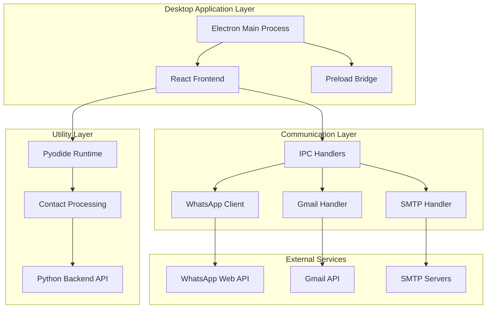
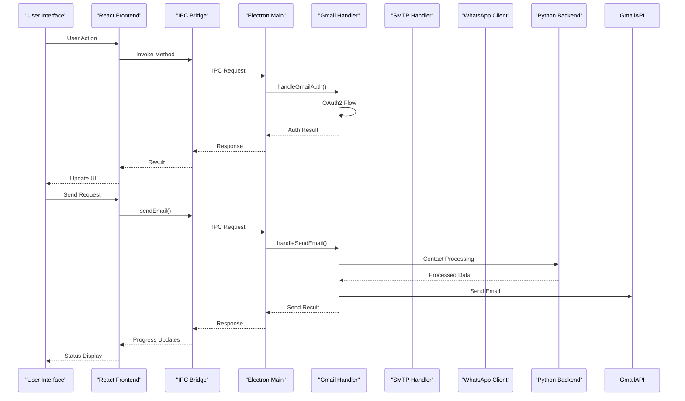
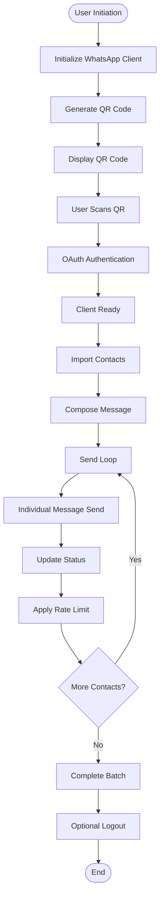
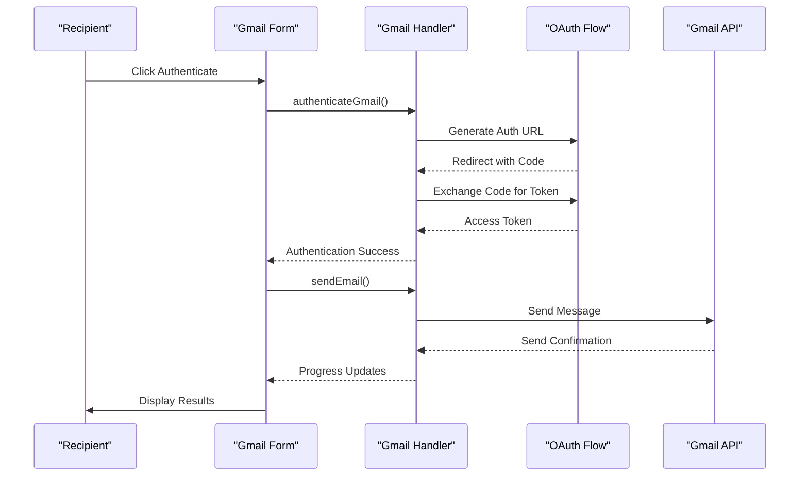
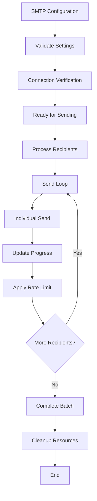
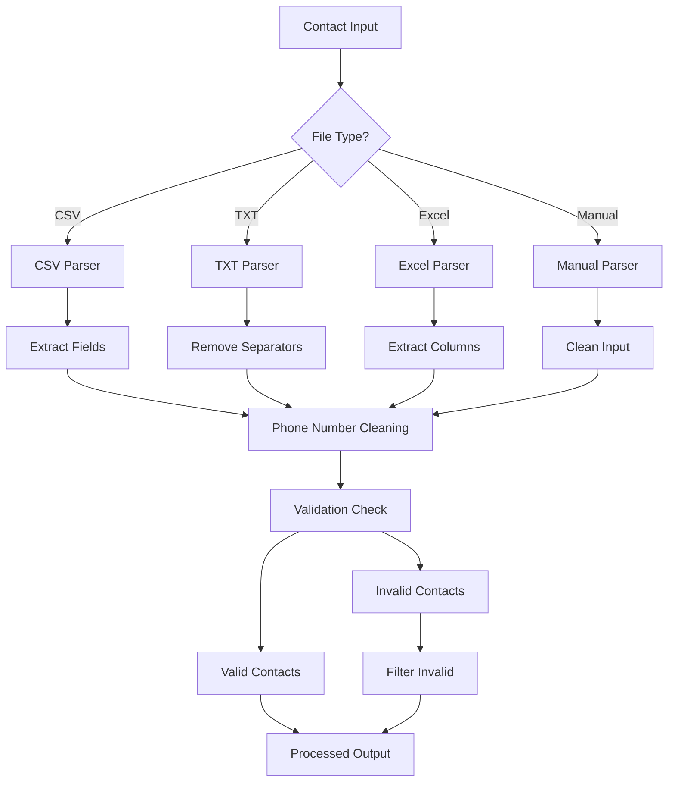
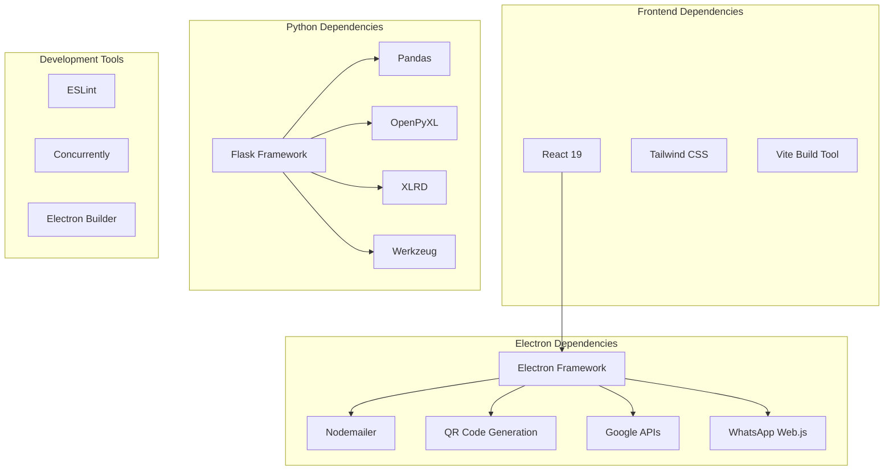

# Project Overview

<cite>
**Referenced Files in This Document**
- [README.md](file://README.md)
- [electron/package.json](file://electron/package.json)
- [python-backend/requirements.txt](file://python-backend/requirements.txt)
- [electron/src/electron/main.js](file://electron/src/electron/main.js)
- [electron/src/ui/App.jsx](file://electron/src/ui/App.jsx)
- [electron/src/components/BulkMailer.jsx](file://electron/src/components/BulkMailer.jsx)
- [electron/src/electron/gmail-handler.js](file://electron/src/electron/gmail-handler.js)
- [electron/src/electron/smtp-handler.js](file://electron/src/electron/smtp-handler.js)
- [electron/src/utils/pyodide.js](file://electron/src/utils/pyodide.js)
- [python-backend/app.py](file://python-backend/app.py)
- [electron/src/electron/preload.js](file://electron/src/electron/preload.js)
- [electron/src/components/WhatsAppForm.jsx](file://electron/src/components/WhatsAppForm.jsx)
- [electron/src/components/GmailForm.jsx](file://electron/src/components/GmailForm.jsx)
- [electron/src/components/SMTPForm.jsx](file://electron/src/components/SMTPForm.jsx)
</cite>

## Table of Contents
1. [Introduction](#introduction)
2. [Project Structure](#project-structure)
3. [Core Components](#core-components)
4. [Architecture Overview](#architecture-overview)
5. [Detailed Component Analysis](#detailed-component-analysis)
6. [Dependency Analysis](#dependency-analysis)
7. [Performance Considerations](#performance-considerations)
8. [Troubleshooting Guide](#troubleshooting-guide)
9. [Conclusion](#conclusion)

## Introduction

WhatsappBulkMessaging is a cross-platform desktop application designed to streamline bulk messaging operations across multiple channels. The application serves as a unified platform for businesses, marketers, and organizations requiring automated mass communication capabilities through WhatsApp, Gmail, and SMTP email services.

The application addresses the growing need for efficient customer outreach and marketing campaigns by providing a centralized solution that eliminates the complexity of managing multiple messaging platforms. Its hybrid architecture combines the power of desktop application deployment with modern web technologies, delivering both native performance and cross-platform compatibility.

Key value propositions include:
- Unified messaging platform reducing operational overhead
- Automated bulk messaging workflows for scalable communication
- Cross-platform availability supporting Windows, macOS, and Linux
- Advanced contact management and validation capabilities
- Real-time progress tracking and monitoring
- Secure credential storage and authentication mechanisms

## Project Structure

The project follows a modular hybrid architecture with clear separation between frontend, backend, and utility components:

**Diagram sources**
- [electron/src/electron/main.js](file://electron/src/electron/main.js#L1-L371)
- [electron/src/electron/preload.js](file://electron/src/electron/preload.js#L1-L41)
- [electron/src/components/BulkMailer.jsx](file://electron/src/components/BulkMailer.jsx#L1-L482)

The structure enables clear component separation while maintaining efficient communication pathways between layers. The hybrid approach leverages Electron's native capabilities for desktop deployment while utilizing React for modern UI development and Python for specialized contact processing tasks.

**Section sources**
- [README.md](file://README.md#L198-L236)
- [electron/package.json](file://electron/package.json#L1-L49)

## Core Components

### Desktop Application Foundation

The application is built on Electron, providing cross-platform desktop deployment capabilities. The main process orchestrates application lifecycle, window management, and security policies. The React frontend delivers a modern, responsive user interface with real-time status updates and interactive controls.

### Communication Infrastructure

The IPC (Inter-Process Communication) system serves as the backbone for cross-layer communication. It exposes secure methods for Gmail authentication, SMTP email sending, and WhatsApp client management while maintaining context isolation for security.

### Utility Processing Engine

The Python backend provides specialized contact processing capabilities including phone number validation, formatting, and extraction from various file formats. This separation ensures robust data processing while keeping the main application lightweight and responsive.

### External Service Integration

Native integrations with WhatsApp Web, Gmail API, and SMTP servers enable seamless communication with external messaging platforms. Each integration maintains its own authentication and configuration requirements while providing unified interfaces through the application's API.

**Section sources**
- [README.md](file://README.md#L43-L58)
- [electron/src/electron/main.js](file://electron/src/electron/main.js#L1-L371)
- [python-backend/app.py](file://python-backend/app.py#L1-L378)

## Architecture Overview

The hybrid architecture combines desktop application capabilities with modern web technologies and specialized backend processing:

**Diagram sources**
- [electron/src/electron/preload.js](file://electron/src/electron/preload.js#L4-L40)
- [electron/src/electron/main.js](file://electron/src/electron/main.js#L102-L108)
- [electron/src/electron/gmail-handler.js](file://electron/src/electron/gmail-handler.js#L15-L130)

The architecture emphasizes security through context isolation, efficient resource utilization through IPC communication, and scalability through modular component design. Each service maintains its own authentication and processing pipeline while contributing to the unified user experience.

**Section sources**
- [README.md](file://README.md#L43-L58)
- [electron/src/electron/preload.js](file://electron/src/electron/preload.js#L1-L41)

## Detailed Component Analysis

### WhatsApp Messaging System

The WhatsApp integration provides comprehensive bulk messaging capabilities through WhatsApp Web API integration:

**Diagram sources**
- [electron/src/electron/main.js](file://electron/src/electron/main.js#L110-L213)
- [electron/src/components/WhatsAppForm.jsx](file://electron/src/components/WhatsAppForm.jsx#L1-L200)

The system implements sophisticated error handling, rate limiting, and status monitoring to ensure reliable bulk messaging operations. The QR code authentication flow provides secure user authentication while maintaining session persistence for subsequent operations.

### Gmail API Integration

The Gmail integration utilizes OAuth2 authentication for secure email sending:

**Diagram sources**
- [electron/src/electron/gmail-handler.js](file://electron/src/electron/gmail-handler.js#L15-L130)
- [electron/src/components/GmailForm.jsx](file://electron/src/components/GmailForm.jsx#L1-L200)

The integration supports HTML email composition, attachment handling, and comprehensive error reporting. The OAuth2 flow ensures secure authentication without exposing user credentials.

### SMTP Email Processing

The SMTP handler provides flexible email delivery through various email providers:

**Diagram sources**
- [electron/src/electron/smtp-handler.js](file://electron/src/electron/smtp-handler.js#L6-L105)
- [electron/src/components/SMTPForm.jsx](file://electron/src/components/SMTPForm.jsx#L1-L200)

The SMTP implementation supports SSL/TLS encryption, custom authentication methods, and comprehensive error handling for various email server configurations.

### Contact Processing Pipeline

The Python backend provides advanced contact processing capabilities:

**Diagram sources**
- [python-backend/app.py](file://python-backend/app.py#L58-L222)
- [electron/src/utils/pyodide.js](file://electron/src/utils/pyodide.js#L26-L33)

The contact processing system handles multiple file formats, performs phone number validation and formatting, removes duplicates, and extracts meaningful contact information from various input sources.

**Section sources**
- [README.md](file://README.md#L5-L42)
- [electron/src/components/BulkMailer.jsx](file://electron/src/components/BulkMailer.jsx#L1-L482)
- [python-backend/app.py](file://python-backend/app.py#L1-L378)

## Dependency Analysis

The application maintains a well-structured dependency hierarchy that balances functionality with security and performance considerations:

**Diagram sources**
- [electron/package.json](file://electron/package.json#L20-L47)
- [python-backend/requirements.txt](file://python-backend/requirements.txt#L1-L7)

The dependency structure ensures that each component has access to necessary resources while maintaining clear boundaries between concerns. The separation between frontend and backend dependencies enables independent development and deployment cycles.

**Section sources**
- [electron/package.json](file://electron/package.json#L1-L49)
- [python-backend/requirements.txt](file://python-backend/requirements.txt#L1-L7)

## Performance Considerations

The application implements several performance optimization strategies:

- **Asynchronous Processing**: All major operations utilize asynchronous patterns to prevent UI blocking
- **Rate Limiting**: Built-in delays prevent overwhelming external services and reduce the risk of account restrictions
- **Resource Management**: Proper cleanup of temporary files and authentication tokens prevents memory leaks
- **Modular Architecture**: Component-based design enables selective loading and improved responsiveness
- **Error Recovery**: Comprehensive error handling with retry mechanisms ensures operation resilience

## Troubleshooting Guide

Common issues and their solutions:

### Authentication Problems
- **WhatsApp QR Code Issues**: Verify network connectivity and restart the application
- **Gmail OAuth Failures**: Check Google Cloud Console configuration and API enablement
- **SMTP Connection Errors**: Validate server settings and firewall configurations

### Performance Issues
- **Slow Contact Processing**: Ensure adequate system resources and optimize file formats
- **Memory Usage**: Monitor for proper cleanup of temporary files and authentication sessions
- **Network Latency**: Implement appropriate rate limiting and retry mechanisms

### Platform-Specific Issues
- **Windows Compatibility**: Verify .NET Framework requirements and antivirus exclusions
- **macOS Permissions**: Check accessibility permissions for screen recording
- **Linux Dependencies**: Ensure libgconf-2-4 and other GTK dependencies are installed

**Section sources**
- [README.md](file://README.md#L412-L455)

## Conclusion

WhatsappBulkMessaging represents a comprehensive solution for modern bulk messaging needs, combining desktop application reliability with web-based user interfaces and specialized backend processing. The hybrid architecture successfully addresses the challenges of cross-platform deployment while maintaining security, performance, and scalability.

The application's unified approach to WhatsApp, Gmail, and SMTP messaging provides significant value for businesses and organizations requiring automated communication capabilities. Its modular design enables future enhancements while maintaining backward compatibility and operational stability.

Through careful attention to security, performance, and user experience, the application establishes itself as a robust foundation for enterprise-grade bulk messaging operations across multiple communication channels.