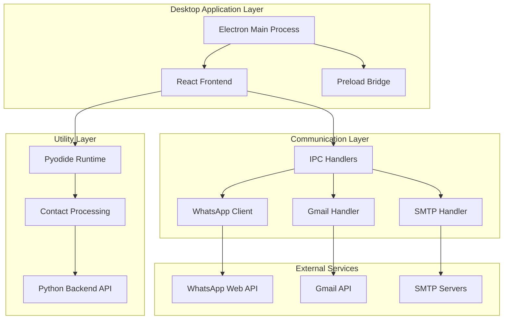
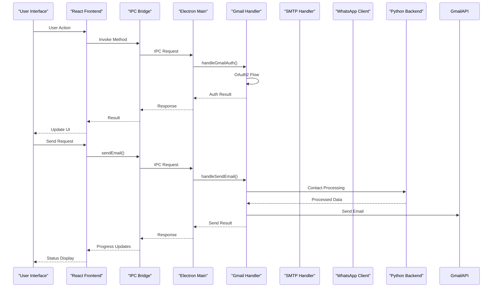
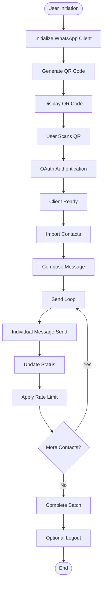
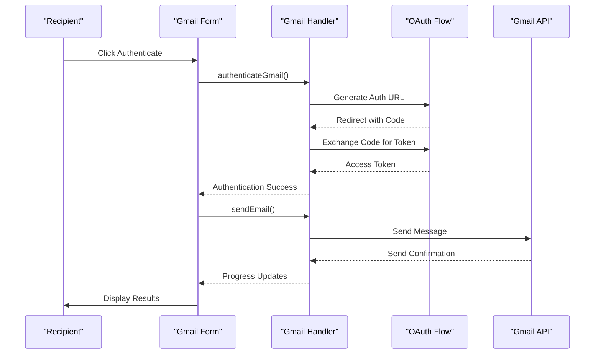
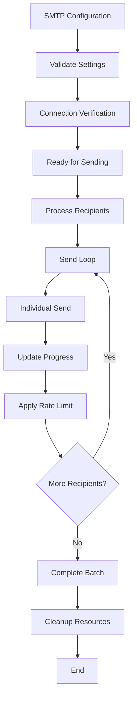
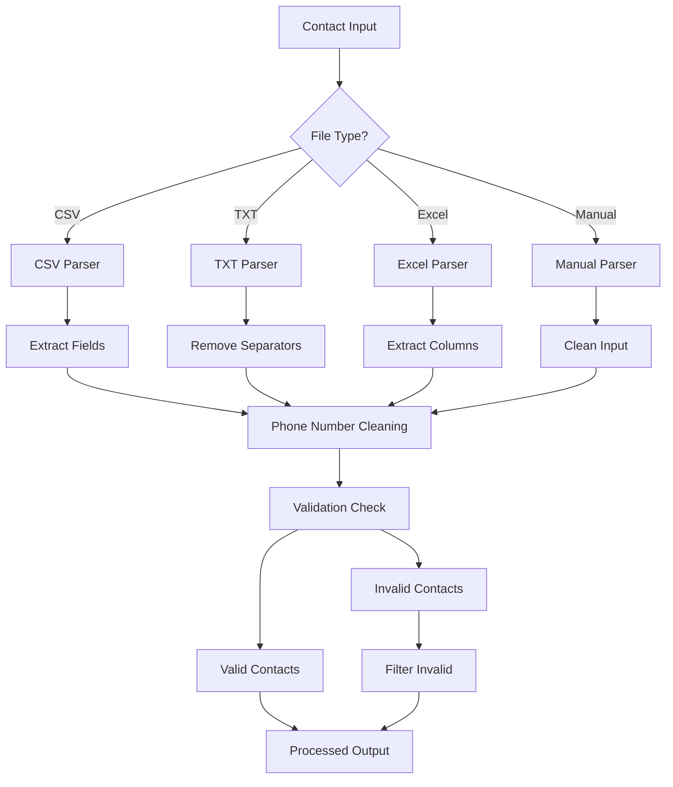
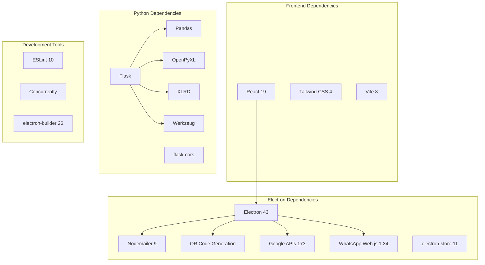

# Project overview

## Introduction

bulk-messaging-system is an Electron desktop app for bulk WhatsApp, Gmail, and SMTP sends. React 19 for the UI, Python for contact parsing, main-process handlers for the integrations.

In short:

- One UI for WhatsApp, Gmail, and SMTP
- Bulk send loops with delays and progress
- Windows, macOS, and Linux builds
- Contact import and phone cleaning
- Live progress in the UI
- Local credential and session storage

Repo: [https://github.com/tashifkhan/bulk-messaging-system](https://github.com/tashifkhan/bulk-messaging-system). Desktop code is `electron/`. Parsers are `python-backend/`.

## Project structure

Layout by layer:

```mermaid
graph TB
subgraph "Desktop Application Layer"
Electron[Electron Main Process]
React[React Frontend]
Preload[Preload Bridge]
end
subgraph "Communication Layer"
IPC[IPC Handlers]
GmailHandler[Gmail Handler]
SMTPHandler[SMTP Handler]
WhatsAppClient[WhatsApp Client]
end
subgraph "Utility Layer"
Pyodide[Pyodide Runtime]
PythonBackend[Python Backend API]
ContactProcessor[Contact Processing]
end
subgraph "External Services"
WhatsAppWeb[WhatsApp Web API]
GmailAPI[Gmail API]
SMTPServers[SMTP Servers]
end
Electron --> React
Electron --> Preload
React --> IPC
IPC --> GmailHandler
IPC --> SMTPHandler
IPC --> WhatsAppClient
React --> Pyodide
Pyodide --> ContactProcessor
ContactProcessor --> PythonBackend
GmailHandler --> GmailAPI
SMTPHandler --> SMTPServers
WhatsAppClient --> WhatsAppWeb
```

On disk:

- `electron/` Electron 43 app. Main process in `src/electron/` (`main.js`, `preload.cjs`, handlers). React UI in `src/ui/` and `src/components/`. Shared parsers in `src/shared/`.
- `python-backend/` Flask on port 5000 (`app.py`, `extract_contacts.py`, `parse_manual_numbers.py`, `validate_number.py`).
- `localhost/` older local helpers. Not the packaged app.

Layers stay separate. Electron ships the desktop shell, React draws the UI, Python parses contacts, IPC ties them together.

## Core components

### Desktop application foundation

Electron hosts the shell. The main process owns lifecycle, windows, and security prefs. React renders the UI and status updates.

### Communication infrastructure

IPC is how the renderer asks the main process to talk to Gmail, SMTP, and WhatsApp without Node APIs in the page.

### Utility processing engine

The Python backend validates phones and pulls contacts out of CSV, TXT, and Excel. Parsing stays in Python so the UI process does not grow a spreadsheet library.

### External service integration

WhatsApp Web, Gmail API, and SMTP each keep their own auth. The UI talks to them through the same IPC-shaped handlers.

## Architecture overview

Layers in play:

```mermaid
sequenceDiagram
participant User as "User Interface"
participant React as "React Frontend"
participant IPC as "IPC Bridge"
participant Main as "Electron Main"
participant Gmail as "Gmail Handler"
participant SMTP as "SMTP Handler"
participant WA as "WhatsApp Client"
participant Python as "Python Backend"
User->>React : User Action
React->>IPC : Invoke Method
IPC->>Main : IPC Request
Main->>Gmail : handleGmailAuth()
Gmail->>Gmail : OAuth2 Flow
Gmail-->>Main : Auth Result
Main-->>IPC : Response
IPC-->>React : Result
React-->>User : Update UI
User->>React : Send Request
React->>IPC : sendEmail()
IPC->>Main : IPC Request
Main->>Gmail : handleSendEmail()
Gmail->>Python : Contact Processing
Python-->>Gmail : Processed Data
Gmail->>GmailAPI : Send Email
Gmail-->>Main : Send Result
Main-->>IPC : Response
IPC-->>React : Progress Updates
React-->>User : Status Display
```

Context isolation keeps the renderer away from Node. IPC carries auth and send calls. Each channel keeps its own credentials and pipeline.

## Detailed component analysis

### WhatsApp messaging system

WhatsApp sends go through `whatsapp-web.js` ^1.34:

```mermaid
flowchart TD
Start([User Initiation]) --> ClientInit["Initialize WhatsApp Client"]
ClientInit --> QRGen["Generate QR Code"]
QRGen --> QRDisplay["Display QR Code"]
QRDisplay --> Scan["User Scans QR"]
Scan --> Auth["OAuth Authentication"]
Auth --> Ready["Client Ready"]
Ready --> ContactImport["Import Contacts"]
ContactImport --> MessageCompose["Compose Message"]
MessageCompose --> SendLoop["Send Loop"]
SendLoop --> IndividualSend["Individual Message Send"]
IndividualSend --> StatusUpdate["Update Status"]
StatusUpdate --> Delay["Apply Rate Limit"]
Delay --> NextContact{"More Contacts?"}
NextContact --> |Yes| SendLoop
NextContact --> |No| Complete["Complete Batch"]
Complete --> Logout["Optional Logout"]
Logout --> End([End])
```

Sends are delayed on purpose, errors are logged per recipient, and LocalAuth keeps the QR session until you logout.

### Gmail API integration

Gmail uses OAuth2 so the app never sees the account password (`googleapis` ^173):

```mermaid
sequenceDiagram
participant User as "User"
participant UI as "Gmail Form"
participant Handler as "Gmail Handler"
participant OAuth as "OAuth Flow"
participant GmailAPI as "Gmail API"
participant User as "Recipient"
User->>UI : Click Authenticate
UI->>Handler : authenticateGmail()
Handler->>OAuth : Generate Auth URL
OAuth-->>Handler : Redirect with Code
Handler->>OAuth : Exchange Code for Token
OAuth-->>Handler : Access Token
Handler-->>UI : Authentication Success
UI->>Handler : sendEmail()
Handler->>GmailAPI : Send Message
GmailAPI-->>Handler : Send Confirmation
Handler-->>UI : Progress Updates
UI->>User : Display Results
```

HTML bodies work today. Attachments are not wired up yet. Errors and progress come back over IPC. Tokens stay in the main process store.

### SMTP email processing

SMTP is the generic provider path when you have host, port, and a password (`nodemailer` ^9):

```mermaid
flowchart TD
Config[SMTP Configuration] --> Validate[Validate Settings]
Validate --> Verify[Connection Verification]
Verify --> Ready[Ready for Sending]
Ready --> Process[Process Recipients]
Process --> SendLoop[Send Loop]
SendLoop --> IndividualSend[Individual Send]
IndividualSend --> Progress[Update Progress]
Progress --> RateLimit[Apply Rate Limit]
RateLimit --> Next{"More Recipients?"}
Next --> |Yes| SendLoop
Next --> |No| Complete[Complete Batch]
Complete --> Cleanup[Cleanup Resources]
Cleanup --> End[End]
```

SSL/TLS, username/password auth, verify-before-send, and per-recipient errors are all in the handler.

### Contact processing pipeline

Python turns files and pasted text into cleaned contact rows:

```mermaid
flowchart TD
Input[Contact Input] --> FileType{File Type?}
FileType --> |CSV| CSVParser[CSV Parser]
FileType --> |TXT| TXTParser[TXT Parser]
FileType --> |Excel| ExcelParser[Excel Parser]
FileType --> |Manual| ManualParser[Manual Parser]
CSVParser --> CSVExtract[Extract Fields]
TXTParser --> TXTRemove[Remove Separators]
ExcelParser --> ExcelExtract[Extract Columns]
ManualParser --> ManualClean[Clean Input]
CSVExtract --> PhoneClean[Phone Number Cleaning]
TXTRemove --> PhoneClean
ExcelExtract --> PhoneClean
ManualClean --> PhoneClean
PhoneClean --> Validate[Validation Check]
Validate --> Valid[Valid Contacts]
Validate --> Invalid[Invalid Contacts]
Valid --> Output[Processed Output]
Invalid --> Filter[Filter Invalid]
Filter --> Output
```

CSV, TXT, Excel, or paste. Numbers get cleaned, invalid rows drop out, and names come along when the file has them.

## Dependency analysis

Dependencies, grouped by layer:

```mermaid
graph TB
subgraph "Frontend Dependencies"
React[React 19]
TailwindCSS[Tailwind CSS 4]
Vite[Vite 8]
end
subgraph "Electron Dependencies"
Electron[Electron 43]
Nodemailer[Nodemailer 9]
QRCode[QR Code Generation]
GoogleAPIs[Google APIs 173]
WWebJS[WhatsApp Web.js 1.34]
Store[electron-store 11]
end
subgraph "Python Dependencies"
Flask[Flask]
FlaskCors[flask-cors]
Pandas[Pandas]
OpenPyXL[OpenPyXL]
XLRD[XLRD]
Werkzeug[Werkzeug]
end
subgraph "Development Tools"
ESLint[ESLint 10]
Concurrently[Concurrently]
Builder[electron-builder 26]
end
React --> Electron
Electron --> Nodemailer
Electron --> QRCode
Electron --> GoogleAPIs
Electron --> WWebJS
Flask --> Pandas
Flask --> OpenPyXL
Flask --> XLRD
Flask --> Werkzeug
```

Frontend and Python deps install separately. That keeps Electron packages smaller and lets you hack parsers without rebuilding the UI.

## Performance considerations

- Long operations stay async so the UI does not freeze.
- Fixed delays between sends to avoid provider bans.
- Temp files and auth artifacts are removed when sessions end.
- Forms load per channel instead of one giant screen.
- Structured errors and retries on transient failures.

## Troubleshooting guide

Stuff that usually breaks first:

### Authentication problems

- **WhatsApp QR issues.** Check network, restart the app, rescan. Install Chrome or Brave if Puppeteer cannot find a browser.
- **Gmail OAuth failures.** Confirm Cloud Console credentials and that Gmail API is enabled.
- **SMTP connection errors.** Recheck host, port, TLS, and firewall rules.

### Performance issues

- **Slow contact processing.** Use smaller files or simpler formats; watch CPU while pandas runs.
- **Memory usage.** Confirm temp files and auth folders are cleaned after sessions.
- **Network latency.** Keep the send delay; retries help more than slamming the API.

### Platform-specific issues

- **Windows.** Watch antivirus quarantining the binary.
- **macOS permissions.** Grant whatever the OS asks for if Chromium/WhatsApp automation is blocked.
- **Linux deps.** Install the usual GTK packages if the window will not start.

## Conclusion

Three channels, one desktop shell. The rest of these docs zoom into the IPC handlers, Python parsers, and auth paths that make that possible.
