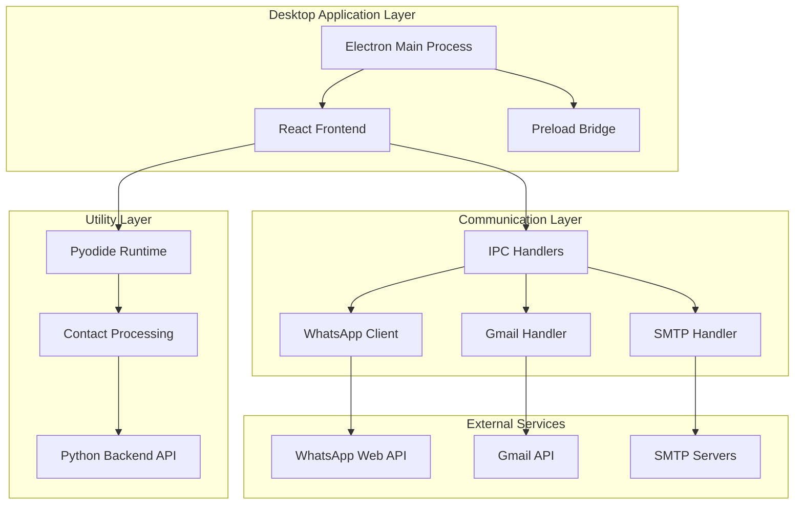
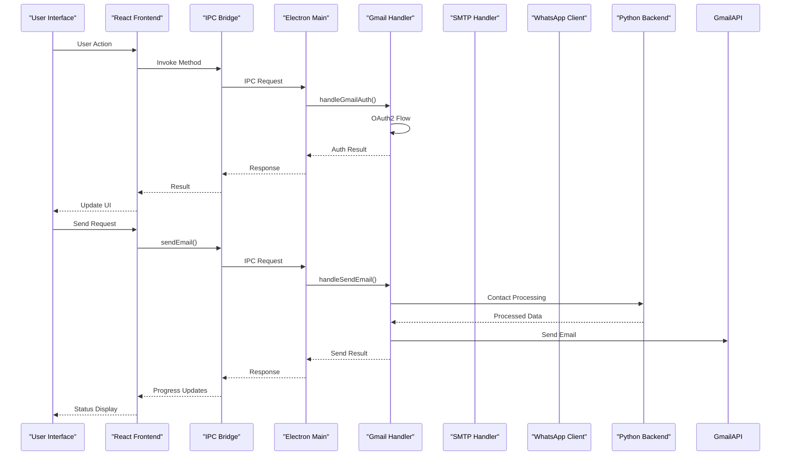
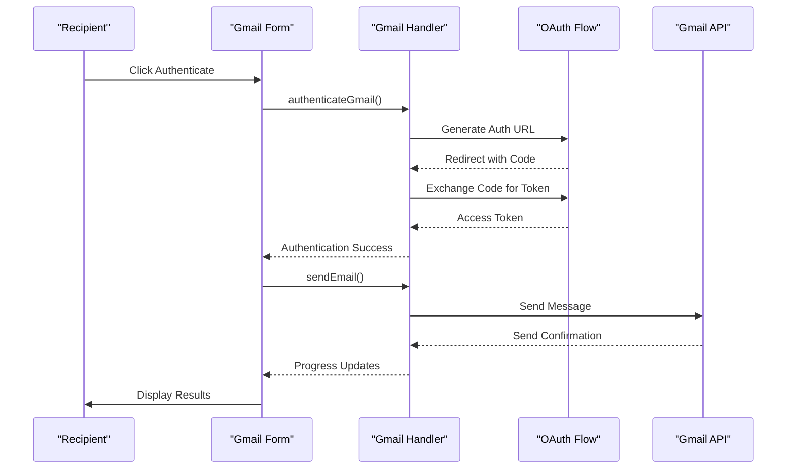
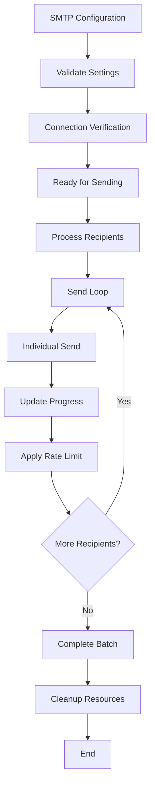
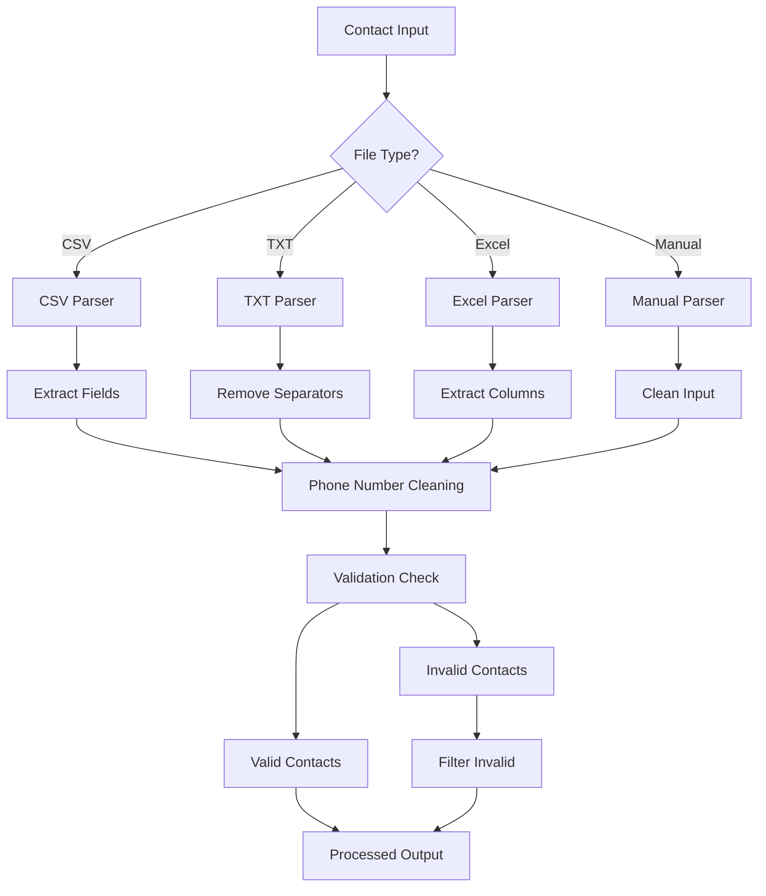
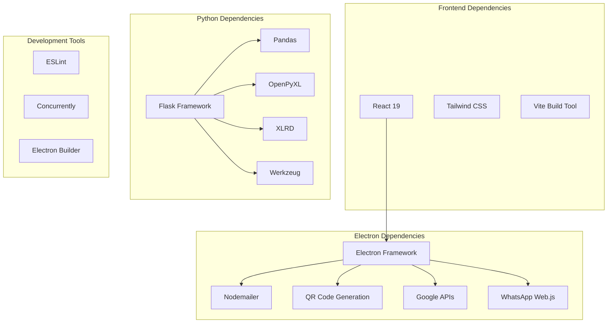

# Project overview

## Introduction

WhatsappBulkMessaging is a cross-platform desktop application designed to streamline bulk messaging operations across multiple channels. The application is a unified platform for businesses, marketers, and organizations requiring automated mass communication capabilities through WhatsApp, Gmail, and SMTP email services.

The application addresses the growing need for efficient customer outreach and marketing campaigns by providing a centralized solution that eliminates the complexity of managing multiple messaging platforms. Its hybrid architecture combines the power of desktop application deployment with modern web technologies, delivering both native performance and cross-platform compatibility.

Key value propositions include:
- Unified messaging platform reducing operational overhead
- Automated bulk messaging workflows for scalable communication
- Cross-platform availability supporting Windows, macOS, and Linux
- Advanced contact management and validation capabilities
- Real-time progress tracking and monitoring
- Secure credential storage and authentication mechanisms

## Project structure

The project follows a modular hybrid architecture with clear separation between frontend, backend, and utility components:

```mermaid
graph TB
subgraph "Desktop Application Layer"
Electron[Electron Main Process]
React[React Frontend]
Preload[Preload Bridge]
end
subgraph "Communication Layer"
IPC[IPC Handlers]
GmailHandler[Gmail Handler]
SMTPHandler[SMTP Handler]
WhatsAppClient[WhatsApp Client]
end
subgraph "Utility Layer"
Pyodide[Pyodide Runtime]
PythonBackend[Python Backend API]
ContactProcessor[Contact Processing]
end
subgraph "External Services"
WhatsAppWeb[WhatsApp Web API]
GmailAPI[Gmail API]
SMTPServers[SMTP Servers]
end
Electron --> React
Electron --> Preload
React --> IPC
IPC --> GmailHandler
IPC --> SMTPHandler
IPC --> WhatsAppClient
React --> Pyodide
Pyodide --> ContactProcessor
ContactProcessor --> PythonBackend
GmailHandler --> GmailAPI
SMTPHandler --> SMTPServers
WhatsAppClient --> WhatsAppWeb
```

The structure enables clear component separation while maintaining efficient communication pathways between layers. The hybrid approach uses Electron's native capabilities for desktop deployment while using React for modern UI development and Python for specialized contact processing tasks.

## Core components

### Desktop application foundation

The application is built on Electron, providing cross-platform desktop deployment capabilities. The main process orchestrates application lifecycle, window management, and security policies. The React frontend delivers a modern, responsive user interface with real-time status updates and interactive controls.

### Communication infrastructure

The IPC (Inter-Process Communication) system is the backbone for cross-layer communication. It exposes secure methods for Gmail authentication, SMTP email sending, and WhatsApp client management while maintaining context isolation for security.

### Utility processing engine

The Python backend provides specialized contact processing capabilities including phone number validation, formatting, and extraction from various file formats. This separation ensures reliable data processing while keeping the main application lightweight and responsive.

### External service integration

Native integrations with WhatsApp Web, Gmail API, and SMTP servers enable smooth communication with external messaging platforms. Each integration maintains its own authentication and configuration requirements while providing unified interfaces through the application's API.

## Architecture overview

The hybrid architecture combines desktop application capabilities with modern web technologies and specialized backend processing:

```mermaid
sequenceDiagram
participant User as "User Interface"
participant React as "React Frontend"
participant IPC as "IPC Bridge"
participant Main as "Electron Main"
participant Gmail as "Gmail Handler"
participant SMTP as "SMTP Handler"
participant WA as "WhatsApp Client"
participant Python as "Python Backend"
User->>React : User Action
React->>IPC : Invoke Method
IPC->>Main : IPC Request
Main->>Gmail : handleGmailAuth()
Gmail->>Gmail : OAuth2 Flow
Gmail-->>Main : Auth Result
Main-->>IPC : Response
IPC-->>React : Result
React-->>User : Update UI
User->>React : Send Request
React->>IPC : sendEmail()
IPC->>Main : IPC Request
Main->>Gmail : handleSendEmail()
Gmail->>Python : Contact Processing
Python-->>Gmail : Processed Data
Gmail->>GmailAPI : Send Email
Gmail-->>Main : Send Result
Main-->>IPC : Response
IPC-->>React : Progress Updates
React-->>User : Status Display
```

The architecture emphasizes security through context isolation, efficient resource utilization through IPC communication, and scalability through modular component design. Each service maintains its own authentication and processing pipeline while contributing to the unified user experience.

## Detailed component analysis

### WhatsApp messaging system

The WhatsApp integration provides detailed bulk messaging capabilities through WhatsApp Web API integration:

```mermaid
flowchart TD
Start([User Initiation]) --> ClientInit["Initialize WhatsApp Client"]
ClientInit --> QRGen["Generate QR Code"]
QRGen --> QRDisplay["Display QR Code"]
QRDisplay --> Scan["User Scans QR"]
Scan --> Auth["OAuth Authentication"]
Auth --> Ready["Client Ready"]
Ready --> ContactImport["Import Contacts"]
ContactImport --> MessageCompose["Compose Message"]
MessageCompose --> SendLoop["Send Loop"]
SendLoop --> IndividualSend["Individual Message Send"]
IndividualSend --> StatusUpdate["Update Status"]
StatusUpdate --> Delay["Apply Rate Limit"]
Delay --> NextContact{"More Contacts?"}
NextContact --> |Yes| SendLoop
NextContact --> |No| Complete["Complete Batch"]
Complete --> Logout["Optional Logout"]
Logout --> End([End])
```

The system implements sophisticated error handling, rate limiting, and status monitoring to ensure reliable bulk messaging operations. The QR code authentication flow provides secure user authentication while maintaining session persistence for subsequent operations.

### Gmail API integration

The Gmail integration uses OAuth2 authentication for secure email sending:

```mermaid
sequenceDiagram
participant User as "User"
participant UI as "Gmail Form"
participant Handler as "Gmail Handler"
participant OAuth as "OAuth Flow"
participant GmailAPI as "Gmail API"
participant User as "Recipient"
User->>UI : Click Authenticate
UI->>Handler : authenticateGmail()
Handler->>OAuth : Generate Auth URL
OAuth-->>Handler : Redirect with Code
Handler->>OAuth : Exchange Code for Token
OAuth-->>Handler : Access Token
Handler-->>UI : Authentication Success
UI->>Handler : sendEmail()
Handler->>GmailAPI : Send Message
GmailAPI-->>Handler : Send Confirmation
Handler-->>UI : Progress Updates
UI->>User : Display Results
```

The integration supports HTML email composition, attachment handling, and detailed error reporting. The OAuth2 flow ensures secure authentication without exposing user credentials.

### SMTP email processing

The SMTP handler provides flexible email delivery through various email providers:

```mermaid
flowchart TD
Config[SMTP Configuration] --> Validate[Validate Settings]
Validate --> Verify[Connection Verification]
Verify --> Ready[Ready for Sending]
Ready --> Process[Process Recipients]
Process --> SendLoop[Send Loop]
SendLoop --> IndividualSend[Individual Send]
IndividualSend --> Progress[Update Progress]
Progress --> RateLimit[Apply Rate Limit]
RateLimit --> Next{"More Recipients?"}
Next --> |Yes| SendLoop
Next --> |No| Complete[Complete Batch]
Complete --> Cleanup[Cleanup Resources]
Cleanup --> End[End]
```

The SMTP implementation supports SSL/TLS encryption, custom authentication methods, and detailed error handling for various email server configurations.

### Contact processing pipeline

The Python backend provides advanced contact processing capabilities:

```mermaid
flowchart TD
Input[Contact Input] --> FileType{File Type?}
FileType --> |CSV| CSVParser[CSV Parser]
FileType --> |TXT| TXTParser[TXT Parser]
FileType --> |Excel| ExcelParser[Excel Parser]
FileType --> |Manual| ManualParser[Manual Parser]
CSVParser --> CSVExtract[Extract Fields]
TXTParser --> TXTRemove[Remove Separators]
ExcelParser --> ExcelExtract[Extract Columns]
ManualParser --> ManualClean[Clean Input]
CSVExtract --> PhoneClean[Phone Number Cleaning]
TXTRemove --> PhoneClean
ExcelExtract --> PhoneClean
ManualClean --> PhoneClean
PhoneClean --> Validate[Validation Check]
Validate --> Valid[Valid Contacts]
Validate --> Invalid[Invalid Contacts]
Valid --> Output[Processed Output]
Invalid --> Filter[Filter Invalid]
Filter --> Output
```

The contact processing system handles multiple file formats, performs phone number validation and formatting, removes duplicates, and extracts meaningful contact information from various input sources.

## Dependency analysis

The application maintains a well-structured dependency hierarchy that balances functionality with security and performance considerations:

```mermaid
graph TB
subgraph "Frontend Dependencies"
React[React 19]
TailwindCSS[Tailwind CSS]
Vite[Vite Build Tool]
end
subgraph "Electron Dependencies"
Electron[Electron Framework]
Nodemailer[Nodemailer]
QRCode[QR Code Generation]
GoogleAPIs[Google APIs]
WWebJS[WhatsApp Web.js]
end
subgraph "Python Dependencies"
Flask[Flask Framework]
Pandas[Pandas]
OpenPyXL[OpenPyXL]
XLRD[XLRD]
Werkzeug[Werkzeug]
end
subgraph "Development Tools"
ESLint[ESLint]
Concurrently[Concurrently]
Builder[Electron Builder]
end
React --> Electron
Electron --> Nodemailer
Electron --> QRCode
Electron --> GoogleAPIs
Electron --> WWebJS
Flask --> Pandas
Flask --> OpenPyXL
Flask --> XLRD
Flask --> Werkzeug
```

The dependency structure ensures that each component has access to necessary resources while maintaining clear boundaries between concerns. The separation between frontend and backend dependencies enables independent development and deployment cycles.

## Performance considerations

The application implements several performance optimization strategies:

- **Asynchronous Processing**: All major operations use asynchronous patterns to prevent UI blocking
- **Rate Limiting**: Built-in delays prevent overwhelming external services and reduce the risk of account restrictions
- **Resource Management**: Proper cleanup of temporary files and authentication tokens prevents memory leaks
- **Modular Architecture**: Component-based design enables selective loading and improved responsiveness
- **Error Recovery**: Detailed error handling with retry mechanisms ensures operation resilience

## Troubleshooting guide

Common issues and their solutions:

### Authentication problems
- **WhatsApp QR Code Issues**: Verify network connectivity and restart the application
- **Gmail OAuth Failures**: Check Google Cloud Console configuration and API enablement
- **SMTP Connection Errors**: Validate server settings and firewall configurations

### Performance issues
- **Slow Contact Processing**: Ensure adequate system resources and optimize file formats
- **Memory Usage**: Monitor for proper cleanup of temporary files and authentication sessions
- **Network Latency**: Implement appropriate rate limiting and retry mechanisms

### Platform-Specific issues
- **Windows Compatibility**: Verify.NET Framework requirements and antivirus exclusions
- **macOS Permissions**: Check accessibility permissions for screen recording
- **Linux Dependencies**: Ensure libgconf-2-4 and other GTK dependencies are installed

## Conclusion

WhatsappBulkMessaging represents a detailed solution for modern bulk messaging needs, combining desktop application reliability with web-based user interfaces and specialized backend processing. The hybrid architecture successfully addresses the challenges of cross-platform deployment while maintaining security, performance, and scalability.

The application's unified approach to WhatsApp, Gmail, and SMTP messaging provides significant value for businesses and organizations requiring automated communication capabilities. Its modular design enables future enhancements while maintaining backward compatibility and operational stability.

Through careful attention to security, performance, and user experience, the application establishes itself as a reliable foundation for enterprise-grade bulk messaging operations across multiple communication channels.
