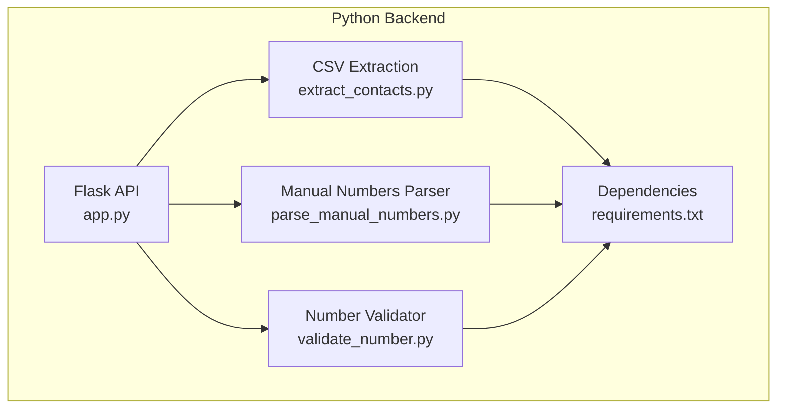
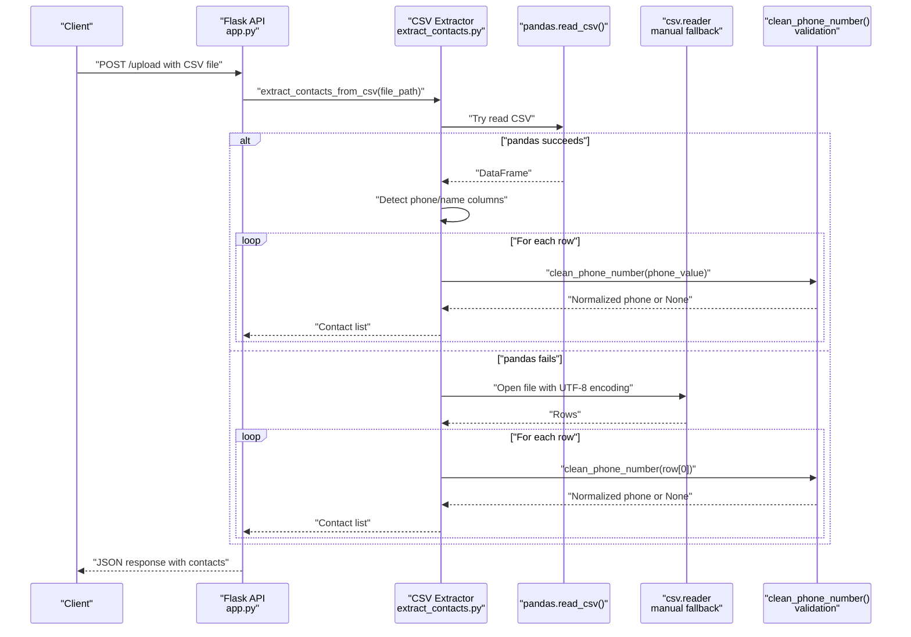
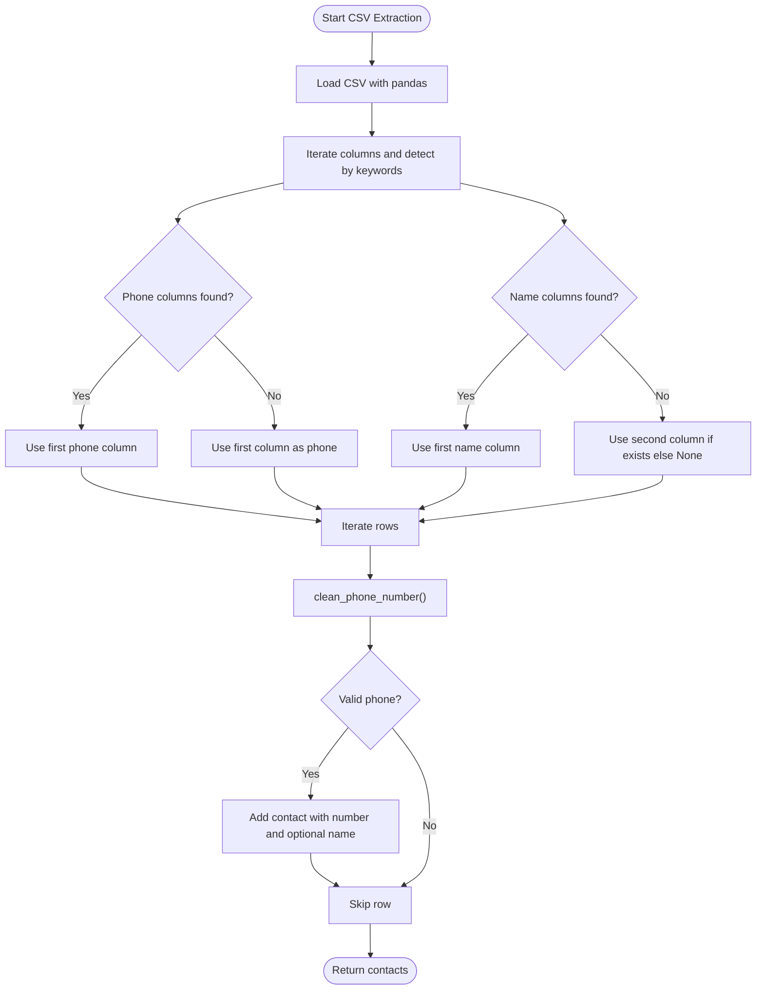
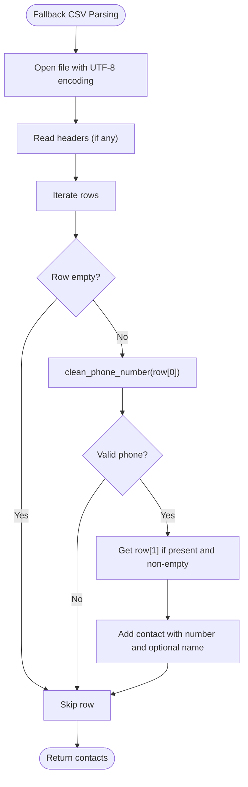
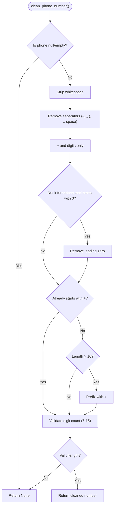
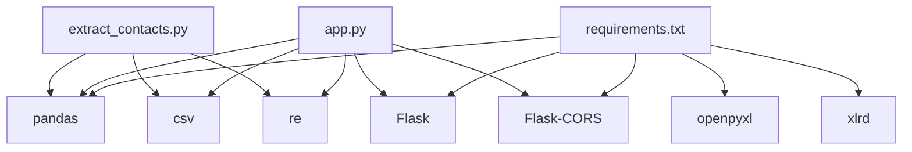

# CSV File Extraction

<cite>
**Referenced Files in This Document**
- [app.py](file://python-backend/app.py)
- [extract_contacts.py](file://python-backend/extract_contacts.py)
- [parse_manual_numbers.py](file://python-backend/parse_manual_numbers.py)
- [validate_number.py](file://python-backend/validate_number.py)
- [requirements.txt](file://python-backend/requirements.txt)
- [README.md](file://README.md)
</cite>

## Table of Contents
1. [Introduction](#introduction)
2. [Project Structure](#project-structure)
3. [Core Components](#core-components)
4. [Architecture Overview](#architecture-overview)
5. [Detailed Component Analysis](#detailed-component-analysis)
6. [Dependency Analysis](#dependency-analysis)
7. [Performance Considerations](#performance-considerations)
8. [Troubleshooting Guide](#troubleshooting-guide)
9. [Conclusion](#conclusion)

## Introduction
This document explains the CSV file contact extraction functionality used to import phone numbers and names from CSV files for bulk messaging. It covers the automatic column detection algorithm, fallback parsing when pandas fails, phone number cleaning and validation, supported formats and column naming variations, and common parsing errors with their solutions.

## Project Structure
The CSV extraction feature is implemented in the Python backend module and integrates with the Flask API. The relevant files are organized as follows:
- Python backend utilities for contact extraction and number validation
- Flask API endpoints for uploading CSV files and extracting contacts
- Manual number parsing utilities for alternative input formats
- Dependencies required for CSV and Excel processing

**Diagram sources**
- [app.py](file://python-backend/app.py#L1-L378)
- [extract_contacts.py](file://python-backend/extract_contacts.py#L1-L177)
- [parse_manual_numbers.py](file://python-backend/parse_manual_numbers.py#L1-L61)
- [validate_number.py](file://python-backend/validate_number.py#L1-L27)
- [requirements.txt](file://python-backend/requirements.txt#L1-L7)

**Section sources**
- [README.md](file://README.md#L184-L196)
- [requirements.txt](file://python-backend/requirements.txt#L1-L7)

## Core Components
- CSV extraction with automatic column detection for phone and name columns
- Fallback manual CSV reader with UTF-8 encoding handling
- Phone number cleaning and validation with international number formatting
- Flask API endpoint for CSV uploads and contact extraction
- Manual number parsing utilities for alternative input formats

Key implementation references:
- Column detection and fallback parsing: [extract_contacts.py](file://python-backend/extract_contacts.py#L25-L81)
- Phone number cleaning and validation: [extract_contacts.py](file://python-backend/extract_contacts.py#L9-L22)
- Flask API CSV extraction: [app.py](file://python-backend/app.py#L58-L125)
- Manual number parsing: [parse_manual_numbers.py](file://python-backend/parse_manual_numbers.py#L22-L54)

**Section sources**
- [extract_contacts.py](file://python-backend/extract_contacts.py#L1-L177)
- [app.py](file://python-backend/app.py#L58-L125)
- [parse_manual_numbers.py](file://python-backend/parse_manual_numbers.py#L1-L61)

## Architecture Overview
The CSV extraction pipeline consists of:
- A Flask route that receives CSV uploads
- An extraction function that attempts pandas-based parsing
- A fallback manual CSV reader for robustness
- A shared phone number cleaning and validation routine

**Diagram sources**
- [app.py](file://python-backend/app.py#L232-L280)
- [extract_contacts.py](file://python-backend/extract_contacts.py#L25-L81)

## Detailed Component Analysis

### Automatic Column Detection Algorithm
The system detects phone and name columns using keyword matching:
- Phone keywords: phone, number, mobile, cell, tel
- Name keywords: name, contact, person

Detection logic:
- Iterate through DataFrame columns and convert header to lowercase
- Match headers against phone and name keyword sets
- Select the first phone column found; otherwise default to the first column
- Select the first name column found; otherwise default to the second column if available

**Diagram sources**
- [extract_contacts.py](file://python-backend/extract_contacts.py#L25-L81)

**Section sources**
- [extract_contacts.py](file://python-backend/extract_contacts.py#L25-L81)

### Fallback Parsing Mechanism (Manual CSV Reader)
When pandas fails to parse the CSV, the system falls back to a manual CSV reader:
- Opens the file with UTF-8 encoding
- Reads rows using csv.reader
- Uses the first column as phone and the second column as name if present
- Applies the same phone number cleaning routine

**Diagram sources**
- [extract_contacts.py](file://python-backend/extract_contacts.py#L60-L81)

**Section sources**
- [extract_contacts.py](file://python-backend/extract_contacts.py#L60-L81)

### Phone Number Cleaning and Validation
The cleaning routine performs the following steps:
- Strip whitespace and handle null/NaN values
- Remove separators (-, spaces, parentheses, dots)
- Allow only digits and plus sign
- Remove leading zeros if not international format
- Prefix with plus if the number appears international-length (>10 digits) and lacks plus
- Validate digit count (between 7 and 15 digits)

**Diagram sources**
- [extract_contacts.py](file://python-backend/extract_contacts.py#L9-L22)

**Section sources**
- [extract_contacts.py](file://python-backend/extract_contacts.py#L9-L22)

### Supported CSV Formats and Column Naming Variations
Supported file formats:
- CSV: comma-separated values
- Excel: .xlsx and .xls files
- Text: plain text files (one contact per line)

Column naming variations recognized by the automatic detection:
- Phone-related headers: phone, number, mobile, cell, tel
- Name-related headers: name, contact, person

Examples of typical column headers:
- Phone: Phone, Mobile, Cell, Tel, Number, PhoneNumber
- Name: Name, Contact, Person, FullName, DisplayName

Note: If no matching headers are found, the system defaults to the first column for phone and the second column for name if available.

**Section sources**
- [extract_contacts.py](file://python-backend/extract_contacts.py#L33-L44)
- [README.md](file://README.md#L184-L188)

### Common Parsing Errors and Solutions
Common issues and resolutions:
- Empty or malformed CSV: The fallback manual parser handles basic CSV files even when pandas fails
- Non-UTF-8 encoding: The fallback parser explicitly opens files with UTF-8 encoding
- Missing headers: The system defaults to first and second columns when headers do not match keywords
- Invalid phone numbers: Numbers outside the 7–15 digit range are ignored
- Mixed separators: The cleaning routine removes separators and validates digits

**Section sources**
- [extract_contacts.py](file://python-backend/extract_contacts.py#L60-L81)
- [app.py](file://python-backend/app.py#L100-L124)

## Dependency Analysis
The CSV extraction feature relies on the following external dependencies:
- pandas: for reading CSV and Excel files
- openpyxl and xlrd: for Excel file support
- csv: for manual CSV parsing fallback
- re: for regex-based phone number detection and cleaning
- Flask and CORS: for the API layer

**Diagram sources**
- [requirements.txt](file://python-backend/requirements.txt#L1-L7)
- [app.py](file://python-backend/app.py#L1-L11)
- [extract_contacts.py](file://python-backend/extract_contacts.py#L1-L6)

**Section sources**
- [requirements.txt](file://python-backend/requirements.txt#L1-L7)
- [app.py](file://python-backend/app.py#L1-L11)

## Performance Considerations
- Prefer UTF-8 encoded files to avoid fallback parsing overhead
- Use consistent column headers to reduce fallback logic
- Limit file size and row count for optimal pandas performance
- Validate phone numbers early to minimize downstream processing

## Troubleshooting Guide
- CSV parsing fails: Ensure the file is UTF-8 encoded and has consistent separators
- No contacts extracted: Verify column headers match phone/name keywords or accept default column selection
- Invalid phone numbers ignored: Confirm numbers contain 7–15 digits after cleaning
- Excel files not supported: Install required dependencies (openpyxl/xlrd) as listed in requirements

**Section sources**
- [extract_contacts.py](file://python-backend/extract_contacts.py#L60-L81)
- [requirements.txt](file://python-backend/requirements.txt#L1-L7)

## Conclusion
The CSV contact extraction feature provides robust automatic column detection, resilient fallback parsing, and comprehensive phone number cleaning with international formatting. By following the supported formats and naming conventions, users can reliably import contacts from CSV files for bulk messaging workflows.