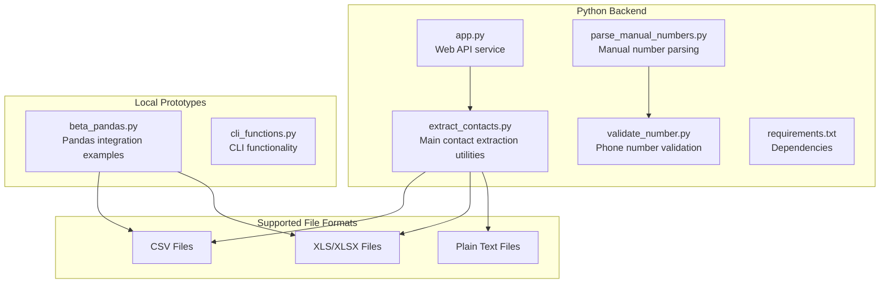
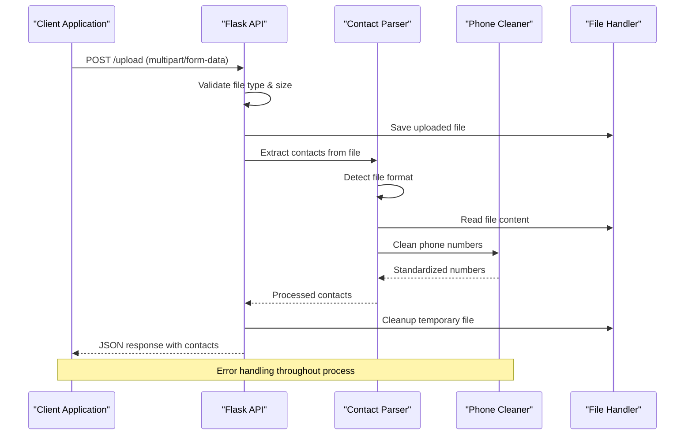
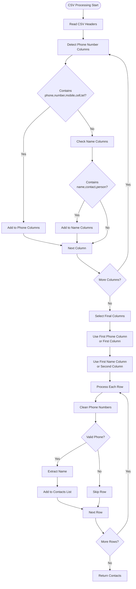
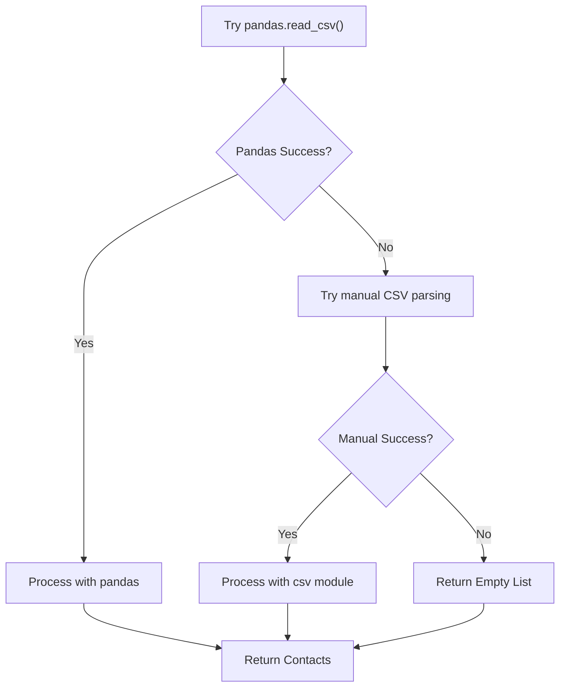
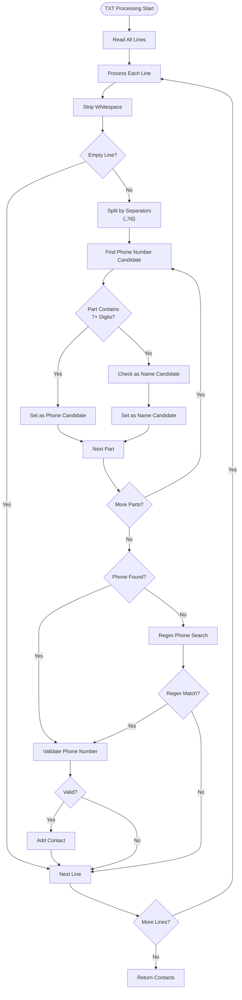
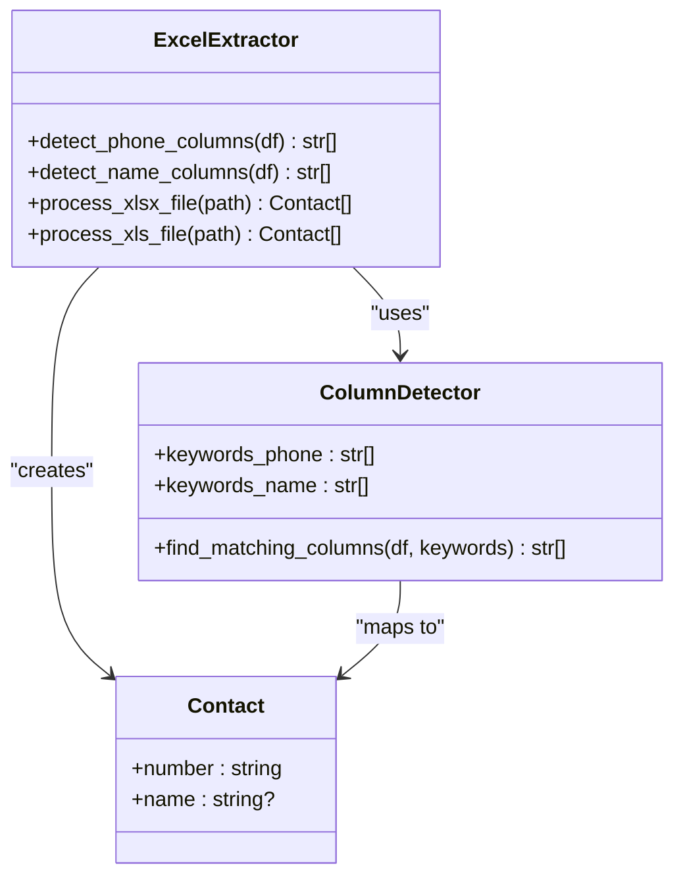
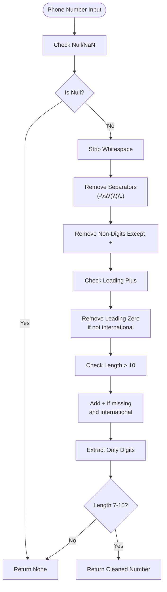
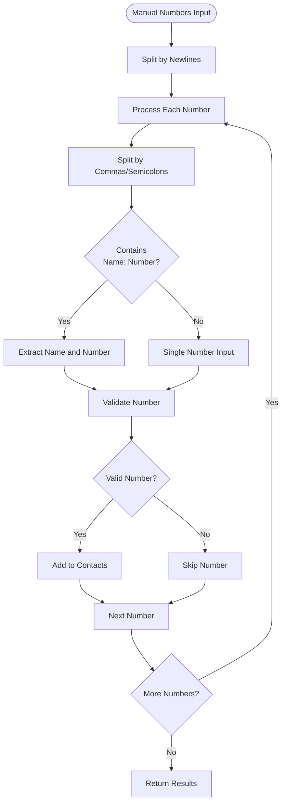
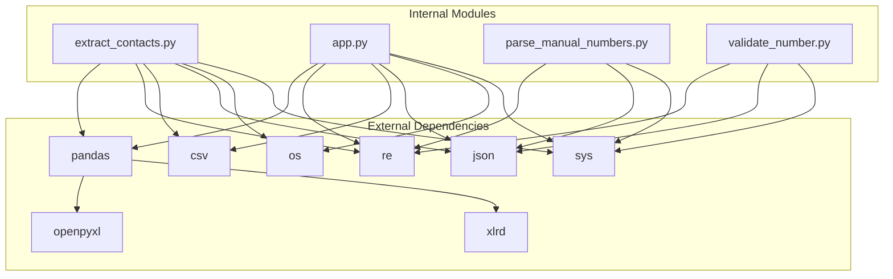
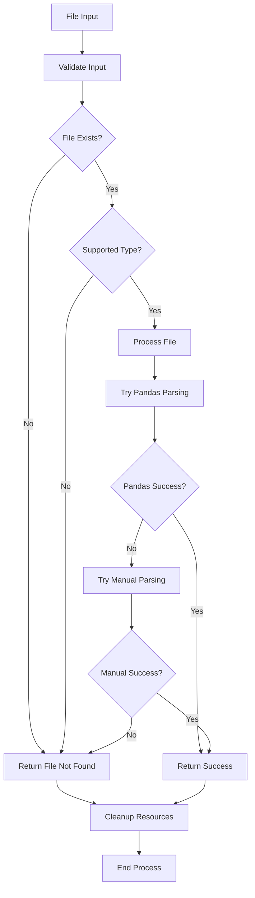

# Contact Extraction Utilities

<cite>
**Referenced Files in This Document**
- [extract_contacts.py](file://python-backend/extract_contacts.py)
- [app.py](file://python-backend/app.py)
- [parse_manual_numbers.py](file://python-backend/parse_manual_numbers.py)
- [validate_number.py](file://python-backend/validate_number.py)
- [requirements.txt](file://python-backend/requirements.txt)
- [README.md](file://README.md)
- [beta_pandas.py](file://localhost/prototypes/beta_pandas.py)
- [cli_functions.py](file://localhost/cli_functions.py)
</cite>

## Table of Contents
1. [Introduction](#introduction)
2. [Project Structure](#project-structure)
3. [Core Components](#core-components)
4. [Architecture Overview](#architecture-overview)
5. [Detailed Component Analysis](#detailed-component-analysis)
6. [Dependency Analysis](#dependency-analysis)
7. [Performance Considerations](#performance-considerations)
8. [Troubleshooting Guide](#troubleshooting-guide)
9. [Conclusion](#conclusion)

## Introduction

The Contact Extraction Utilities provide a comprehensive solution for importing and processing contact information from multiple file formats. This system supports CSV, Excel (.xlsx and .xls), and plain text files, with sophisticated phone number cleaning and validation capabilities. The utilities are designed to handle various edge cases, malformed data, and provide robust error recovery mechanisms.

The system integrates seamlessly with both standalone command-line usage and web-based API services, making it suitable for desktop applications, web services, and batch processing scenarios.

## Project Structure

The contact extraction functionality is organized within the Python backend module, with supporting components for validation and manual number parsing:

**Diagram sources**
- [extract_contacts.py](file://python-backend/extract_contacts.py#L1-L177)
- [app.py](file://python-backend/app.py#L1-L378)
- [requirements.txt](file://python-backend/requirements.txt#L1-L7)

**Section sources**
- [README.md](file://README.md#L184-L188)
- [requirements.txt](file://python-backend/requirements.txt#L1-L7)

## Core Components

The contact extraction system consists of four primary components, each serving a specific purpose in the contact processing pipeline:

### Main Contact Extraction Module (`extract_contacts.py`)

This module provides the core functionality for extracting contacts from various file formats. It implements intelligent column detection, fallback parsing mechanisms, and comprehensive error handling.

### Web API Service (`app.py`)

The Flask-based web service exposes the contact extraction capabilities through RESTful endpoints, supporting file uploads and real-time processing with proper error handling and response formatting.

### Manual Number Parser (`parse_manual_numbers.py`)

This component handles manually entered phone numbers with flexible parsing logic that can accommodate various input formats and separator combinations.

### Phone Number Validator (`validate_number.py`)

A specialized utility for validating and cleaning individual phone numbers with standardized formatting rules.

**Section sources**
- [extract_contacts.py](file://python-backend/extract_contacts.py#L1-L177)
- [app.py](file://python-backend/app.py#L1-L378)
- [parse_manual_numbers.py](file://python-backend/parse_manual_numbers.py#L1-L61)
- [validate_number.py](file://python-backend/validate_number.py#L1-L27)

## Architecture Overview

The contact extraction system follows a modular architecture with clear separation of concerns:

**Diagram sources**
- [app.py](file://python-backend/app.py#L232-L280)
- [extract_contacts.py](file://python-backend/extract_contacts.py#L25-L81)

The architecture implements a fallback mechanism where each file format handler attempts pandas-based parsing first, with manual fallback parsing for edge cases and error recovery.

**Section sources**
- [app.py](file://python-backend/app.py#L58-L125)
- [extract_contacts.py](file://python-backend/extract_contacts.py#L25-L81)

## Detailed Component Analysis

### CSV File Processing

The CSV extraction function implements sophisticated automatic column detection and fallback parsing mechanisms:

#### Column Detection Algorithm

**Diagram sources**
- [extract_contacts.py](file://python-backend/extract_contacts.py#L25-L81)
- [app.py](file://python-backend/app.py#L58-L125)

#### Fallback Parsing Mechanism

When pandas parsing fails, the system automatically falls back to manual CSV parsing:

**Diagram sources**
- [extract_contacts.py](file://python-backend/extract_contacts.py#L59-L81)
- [app.py](file://python-backend/app.py#L100-L125)

**Section sources**
- [extract_contacts.py](file://python-backend/extract_contacts.py#L25-L81)
- [app.py](file://python-backend/app.py#L58-L125)

### TXT File Parsing Logic

The TXT file parser implements regex-based phone number detection with flexible separator handling:

#### Phone Number Detection Algorithm

**Diagram sources**
- [extract_contacts.py](file://python-backend/extract_contacts.py#L84-L118)
- [app.py](file://python-backend/app.py#L128-L175)

#### Separator Handling

The TXT parser supports multiple separator types:
- Comma (`,`) for comma-separated values
- Semicolon (`;`) for semicolon-separated values  
- Tab (`\t`) for tab-separated values
- Pipe (`|`) for pipe-separated values

**Section sources**
- [extract_contacts.py](file://python-backend/extract_contacts.py#L84-L118)
- [app.py](file://python-backend/app.py#L128-L175)

### Excel File Processing

The Excel processing functionality supports both modern `.xlsx` and legacy `.xls` formats through pandas integration:

#### Column Mapping Strategy

**Diagram sources**
- [extract_contacts.py](file://python-backend/extract_contacts.py#L121-L157)
- [app.py](file://python-backend/app.py#L178-L222)

**Section sources**
- [extract_contacts.py](file://python-backend/extract_contacts.py#L121-L157)
- [app.py](file://python-backend/app.py#L178-L222)

### Phone Number Cleaning and Validation

The phone number cleaning function implements comprehensive validation with international format support:

#### Cleaning Algorithm

**Diagram sources**
- [extract_contacts.py](file://python-backend/extract_contacts.py#L9-L22)
- [app.py](file://python-backend/app.py#L28-L55)

**Section sources**
- [extract_contacts.py](file://python-backend/extract_contacts.py#L9-L22)
- [app.py](file://python-backend/app.py#L28-L55)

### Manual Number Parsing

The manual number parsing utility handles various input formats with flexible separator detection:

#### Parsing Strategy

**Diagram sources**
- [parse_manual_numbers.py](file://python-backend/parse_manual_numbers.py#L22-L54)

**Section sources**
- [parse_manual_numbers.py](file://python-backend/parse_manual_numbers.py#L22-L54)

## Dependency Analysis

The contact extraction utilities have a well-defined dependency structure with clear external library requirements:

**Diagram sources**
- [requirements.txt](file://python-backend/requirements.txt#L1-L7)
- [extract_contacts.py](file://python-backend/extract_contacts.py#L1-L7)
- [app.py](file://python-backend/app.py#L1-L9)

**Section sources**
- [requirements.txt](file://python-backend/requirements.txt#L1-L7)
- [extract_contacts.py](file://python-backend/extract_contacts.py#L1-L7)
- [app.py](file://python-backend/app.py#L1-L9)

## Performance Considerations

The contact extraction utilities implement several performance optimization techniques:

### Memory Management
- Streaming file processing for large CSV files
- Lazy evaluation of pandas DataFrames
- Proper resource cleanup and file handle management

### Processing Efficiency
- Early termination for empty files
- Optimized regex patterns for phone number detection
- Minimal memory allocation during processing

### Error Recovery
- Graceful degradation from pandas to manual parsing
- Comprehensive exception handling with logging
- Resource cleanup on failure

### Scalability Features
- Configurable file size limits (16MB default)
- Efficient column detection algorithms
- Optimized phone number validation

**Section sources**
- [app.py](file://python-backend/app.py#L21-L22)
- [extract_contacts.py](file://python-backend/extract_contacts.py#L59-L81)

## Troubleshooting Guide

### Common Issues and Solutions

#### File Format Compatibility
- **Issue**: Excel files not opening
  - **Solution**: Ensure `openpyxl` and `xlrd` are installed for `.xlsx` and `.xls` respectively
  - **Reference**: [requirements.txt](file://python-backend/requirements.txt#L4-L5)

#### Phone Number Validation Failures
- **Issue**: Valid phone numbers rejected
  - **Solution**: Check number length (7-15 digits) and international format requirements
  - **Reference**: [validate_number.py](file://python-backend/validate_number.py#L16-L18)

#### Memory Issues with Large Files
- **Issue**: Out of memory errors
  - **Solution**: Process files in smaller chunks or use streaming approaches
  - **Reference**: [app.py](file://python-backend/app.py#L21-L22)

#### Encoding Problems
- **Issue**: Special characters not displaying correctly
  - **Solution**: Ensure UTF-8 encoding for text files
  - **Reference**: [extract_contacts.py](file://python-backend/extract_contacts.py#L87-L88)

### Error Handling Strategies

The system implements comprehensive error handling across all components:

**Diagram sources**
- [extract_contacts.py](file://python-backend/extract_contacts.py#L160-L177)
- [app.py](file://python-backend/app.py#L232-L280)

**Section sources**
- [extract_contacts.py](file://python-backend/extract_contacts.py#L160-L177)
- [app.py](file://python-backend/app.py#L232-L280)

## Conclusion

The Contact Extraction Utilities provide a robust, scalable solution for processing contact information from multiple file formats. The system's architecture emphasizes reliability through fallback mechanisms, comprehensive error handling, and flexible parsing strategies.

Key strengths include:
- **Multi-format Support**: Seamless processing of CSV, Excel, and text files
- **Intelligent Parsing**: Automatic column detection with fallback mechanisms
- **Robust Validation**: Comprehensive phone number cleaning and validation
- **Error Resilience**: Graceful degradation and comprehensive error handling
- **Performance Optimization**: Memory-efficient processing and resource management

The utilities serve as a foundation for larger applications requiring contact management capabilities, with clear extension points for additional file formats and processing features.