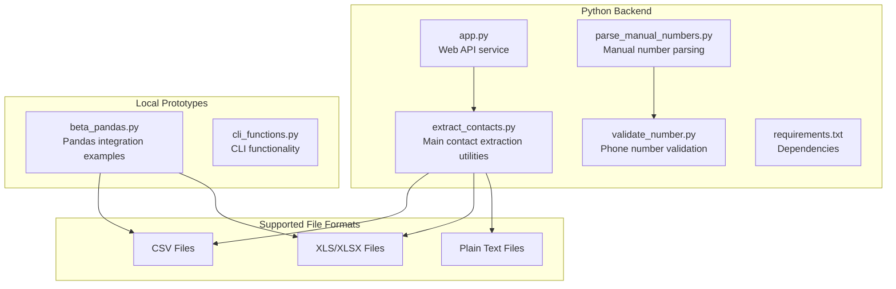
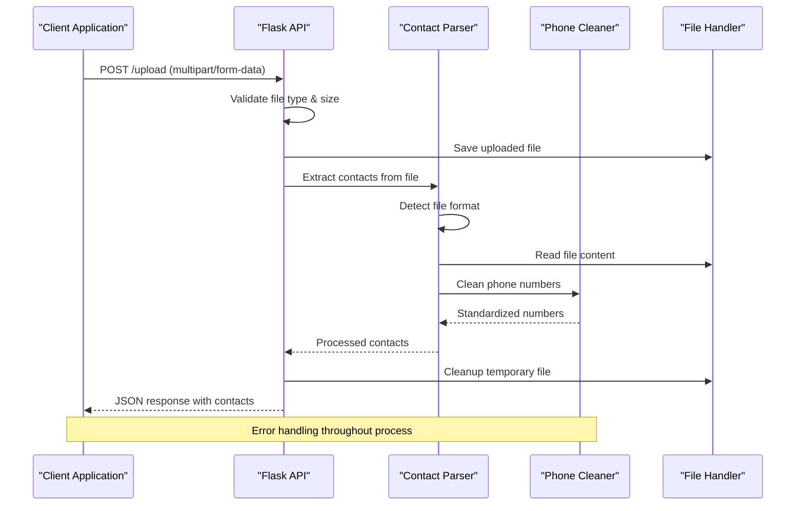
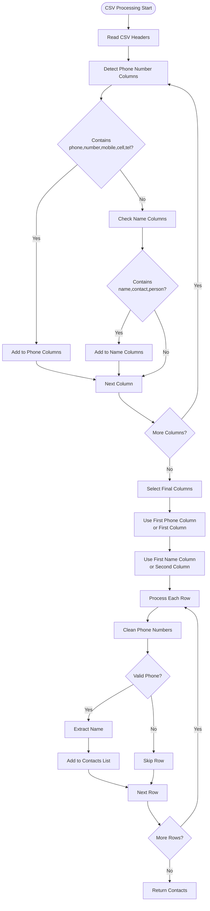
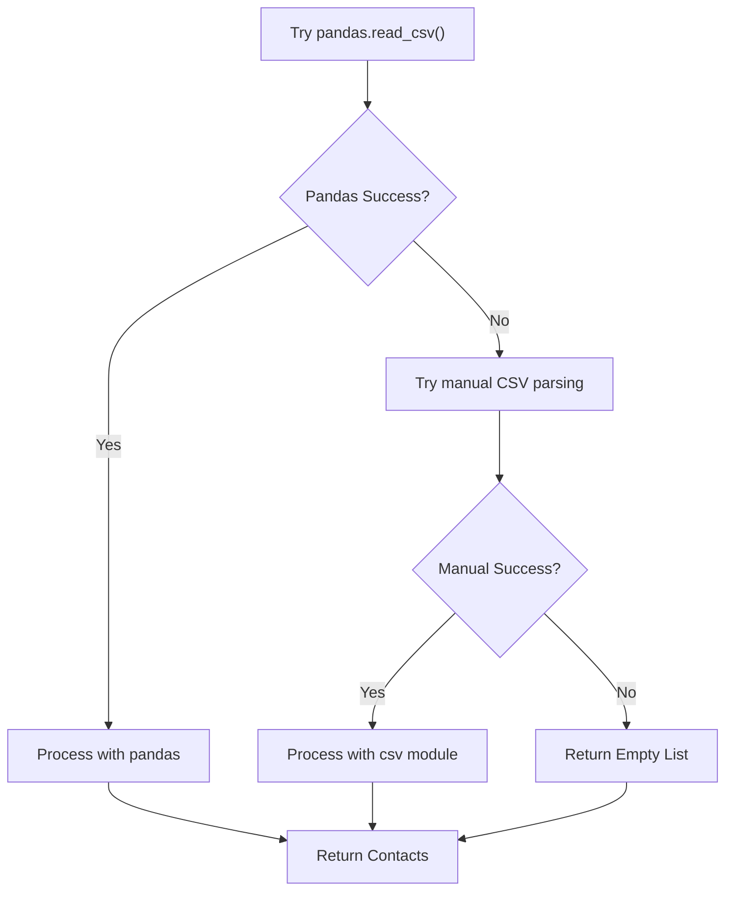
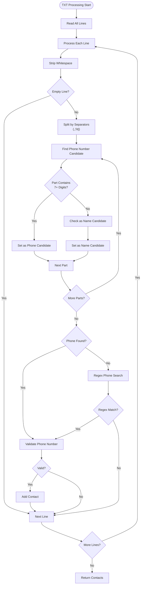
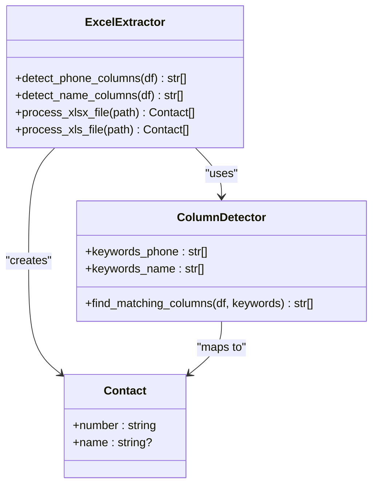
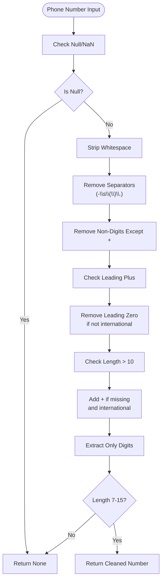
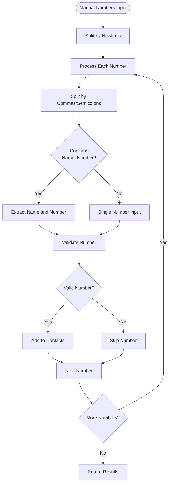
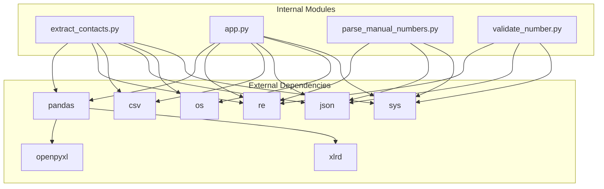
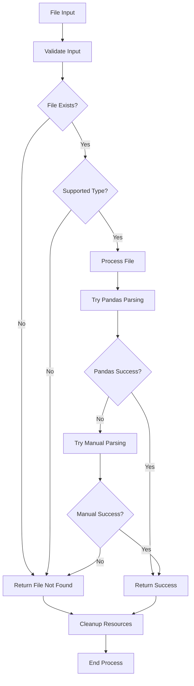

# Contact extraction utilities

## Introduction

The Contact Extraction Utilities provide a detailed solution for importing and processing contact information from multiple file formats. This system supports CSV, Excel (.xlsx and.xls), and plain text files, with sophisticated phone number cleaning and validation capabilities. The utilities are designed to handle various edge cases, malformed data, and provide reliable error recovery mechanisms.

The system integrates smoothly with both standalone command-line usage and web-based API services, making it suitable for desktop applications, web services, and batch processing scenarios.

## Project structure

The contact extraction functionality is organized within the Python backend module, with supporting components for validation and manual number parsing:

```mermaid
graph TB
subgraph "Python Backend"
EC[extract_contacts.py<br/>Main contact extraction utilities]
APP[app.py<br/>Web API service]
PMN[parse_manual_numbers.py<br/>Manual number parsing]
VN[validate_number.py<br/>Phone number validation]
RT[requirements.txt<br/>Dependencies]
end
subgraph "Local Prototypes"
BP[beta_pandas.py<br/>Pandas integration examples]
CF[cli_functions.py<br/>CLI functionality]
end
subgraph "Supported File Formats"
CSV[CSV Files]
XLS[XLS/XLSX Files]
TXT[Plain Text Files]
end
EC --> CSV
EC --> XLS
EC --> TXT
APP --> EC
PMN --> VN
BP --> CSV
BP --> XLS
```

## Core components

The contact extraction system consists of four primary components, each serving a specific purpose in the contact processing pipeline:

### Main contact extraction module (`extract_contacts.py`)

This module provides the core functionality for extracting contacts from various file formats. It implements intelligent column detection, fallback parsing mechanisms, and detailed error handling.

### Web API service (`app.py`)

The Flask-based web service exposes the contact extraction capabilities through RESTful endpoints, supporting file uploads and real-time processing with proper error handling and response formatting.

### Manual number parser (`parse_manual_numbers.py`)

This component handles manually entered phone numbers with flexible parsing logic that can accommodate various input formats and separator combinations.

### Phone number validator (`validate_number.py`)

A specialized utility for validating and cleaning individual phone numbers with standardized formatting rules.

## Architecture overview

The contact extraction system follows a modular architecture with clear separation of concerns:

```mermaid
sequenceDiagram
participant Client as "Client Application"
participant API as "Flask API"
participant Parser as "Contact Parser"
participant Cleaner as "Phone Cleaner"
participant FileHandler as "File Handler"
Client->>API : POST /upload (multipart/form-data)
API->>API : Validate file type & size
API->>FileHandler : Save uploaded file
API->>Parser : Extract contacts from file
Parser->>Parser : Detect file format
Parser->>FileHandler : Read file content
Parser->>Cleaner : Clean phone numbers
Cleaner-->>Parser : Standardized numbers
Parser-->>API : Processed contacts
API->>FileHandler : Cleanup temporary file
API-->>Client : JSON response with contacts
Note over Client,Cleaner : Error handling throughout process
```

The architecture implements a fallback mechanism where each file format handler attempts pandas-based parsing first, with manual fallback parsing for edge cases and error recovery.

## Detailed component analysis

### CSV file processing

The CSV extraction function implements sophisticated automatic column detection and fallback parsing mechanisms:

#### Column detection algorithm

```mermaid
flowchart TD
Start([CSV Processing Start]) --> ReadHeaders["Read CSV Headers"]
ReadHeaders --> DetectPhoneCols["Detect Phone Number Columns"]
DetectPhoneCols --> CheckKeywords{"Contains<br/>phone,number,mobile,cell,tel?"}
CheckKeywords --> |Yes| AddToPhone["Add to Phone Columns"]
CheckKeywords --> |No| CheckNameCols["Check Name Columns"]
CheckNameCols --> CheckNameKeywords{"Contains<br/>name,contact,person?"}
CheckNameKeywords --> |Yes| AddToName["Add to Name Columns"]
CheckNameKeywords --> |No| NextCol["Next Column"]
AddToPhone --> NextCol
AddToName --> NextCol
NextCol --> MoreCols{"More Columns?"}
MoreCols --> |Yes| DetectPhoneCols
MoreCols --> |No| SelectColumns["Select Final Columns"]
SelectColumns --> UseFirstPhone["Use First Phone Column<br/>or First Column"]
UseFirstPhone --> UseSecondName["Use First Name Column<br/>or Second Column"]
UseSecondName --> ProcessRows["Process Each Row"]
ProcessRows --> CleanPhone["Clean Phone Numbers"]
CleanPhone --> ValidatePhone{"Valid Phone?"}
ValidatePhone --> |Yes| ExtractName["Extract Name"]
ValidatePhone --> |No| SkipRow["Skip Row"]
ExtractName --> AddContact["Add to Contacts List"]
SkipRow --> NextRow["Next Row"]
AddContact --> NextRow
NextRow --> MoreRows{"More Rows?"}
MoreRows --> |Yes| ProcessRows
MoreRows --> |No| ReturnContacts["Return Contacts"]
```

#### Fallback parsing mechanism

When pandas parsing fails, the system automatically falls back to manual CSV parsing:

```mermaid
flowchart TD
PandasTry["Try pandas.read_csv()"] --> PandasSuccess{"Pandas Success?"}
PandasSuccess --> |Yes| PandasProcess["Process with pandas"]
PandasSuccess --> |No| ManualTry["Try manual CSV parsing"]
ManualTry --> ManualSuccess{"Manual Success?"}
ManualSuccess --> |Yes| ManualProcess["Process with csv module"]
ManualSuccess --> |No| ErrorReturn["Return Empty List"]
PandasProcess --> ReturnContacts["Return Contacts"]
ManualProcess --> ReturnContacts
ErrorReturn --> ReturnContacts
```

### TXT file parsing logic

The TXT file parser implements regex-based phone number detection with flexible separator handling:

#### Phone number detection algorithm

```mermaid
flowchart TD
Start([TXT Processing Start]) --> ReadLines["Read All Lines"]
ReadLines --> ProcessLine["Process Each Line"]
ProcessLine --> StripWhitespace["Strip Whitespace"]
StripWhitespace --> CheckEmpty{"Empty Line?"}
CheckEmpty --> |Yes| NextLine["Next Line"]
CheckEmpty --> |No| SplitParts["Split by Separators<br/>(,;\\t|)"]
SplitParts --> FindPhone["Find Phone Number Candidate"]
FindPhone --> CheckPart{"Part Contains<br/>7+ Digits?"}
CheckPart --> |Yes| SetPhone["Set as Phone Candidate"]
CheckPart --> |No| CheckName["Check as Name Candidate"]
CheckName --> SetName["Set as Name Candidate"]
SetPhone --> NextPart["Next Part"]
SetName --> NextPart
NextPart --> MoreParts{"More Parts?"}
MoreParts --> |Yes| FindPhone
MoreParts --> |No| CheckCandidates{"Phone Found?"}
CheckCandidates --> |Yes| ValidatePhone["Validate Phone Number"]
CheckCandidates --> |No| RegexSearch["Regex Phone Search"]
RegexSearch --> RegexFound{"Regex Match?"}
RegexFound --> |Yes| ValidatePhone
RegexFound --> |No| NextLine
ValidatePhone --> PhoneValid{"Valid?"}
PhoneValid --> |Yes| AddContact["Add Contact"]
PhoneValid --> |No| NextLine
AddContact --> NextLine
NextLine --> MoreLines{"More Lines?"}
MoreLines --> |Yes| ProcessLine
MoreLines --> |No| ReturnContacts["Return Contacts"]
```

#### Separator handling

The TXT parser supports multiple separator types:
- Comma (`,`) for comma-separated values
- Semicolon (`;`) for semicolon-separated values
- Tab (`\t`) for tab-separated values
- Pipe (`|`) for pipe-separated values

### Excel file processing

The Excel processing functionality supports both modern `.xlsx` and legacy `.xls` formats through pandas integration:

#### Column mapping strategy

```mermaid
classDiagram
class ExcelExtractor {
+detect_phone_columns(df) str[]
+detect_name_columns(df) str[]
+process_xlsx_file(path) Contact[]
+process_xls_file(path) Contact[]
}
class ColumnDetector {
+keywords_phone : str[]
+keywords_name : str[]
+find_matching_columns(df, keywords) str[]
}
class Contact {
+number : string
+name : string?
}
ExcelExtractor --> ColumnDetector : "uses"
ExcelExtractor --> Contact : "creates"
ColumnDetector --> Contact : "maps to"
```

### Phone number cleaning and validation

The phone number cleaning function implements detailed validation with international format support:

#### Cleaning algorithm

```mermaid
flowchart TD
Start([Phone Number Input]) --> CheckNull["Check Null/NaN"]
CheckNull --> NullCheck{"Is Null?"}
NullCheck --> |Yes| ReturnNull["Return None"]
NullCheck --> |No| StripWhitespace["Strip Whitespace"]
StripWhitespace --> RemoveSeparators["Remove Separators<br/>(-\\s\\(\\)\\.)"]
RemoveSeparators --> RemoveNonDigits["Remove Non-Digits Except +"]
RemoveNonDigits --> CheckPlus["Check Leading Plus"]
CheckPlus --> RemoveLeadingZeros["Remove Leading Zero<br/>if not international"]
RemoveLeadingZeros --> CheckLength["Check Length > 10"]
CheckLength --> AddPlus["Add + if missing<br/>and international"]
AddPlus --> ExtractDigits["Extract Only Digits"]
ExtractDigits --> ValidateRange{"Length 7-15?"}
ValidateRange --> |No| ReturnNull
ValidateRange --> |Yes| ReturnCleaned["Return Cleaned Number"]
```

### Manual number parsing

The manual number parsing utility handles various input formats with flexible separator detection:

#### Parsing strategy

```mermaid
flowchart TD
Start([Manual Numbers Input]) --> SplitByNewlines["Split by Newlines"]
SplitByNewlines --> ProcessNumbers["Process Each Number"]
ProcessNumbers --> SplitBySeparators["Split by Commas/Semicolons"]
SplitBySeparators --> CheckFormat{"Contains<br/>Name: Number?"}
CheckFormat --> |Yes| ExtractPair["Extract Name and Number"]
CheckFormat --> |No| SingleNumber["Single Number Input"]
ExtractPair --> ValidateNumber["Validate Number"]
SingleNumber --> ValidateNumber
ValidateNumber --> CheckValid{"Valid Number?"}
CheckValid --> |Yes| AddContact["Add to Contacts"]
CheckValid --> |No| SkipNumber["Skip Number"]
AddContact --> NextNumber["Next Number"]
SkipNumber --> NextNumber
NextNumber --> MoreNumbers{"More Numbers?"}
MoreNumbers --> |Yes| ProcessNumbers
MoreNumbers --> |No| ReturnResults["Return Results"]
```

## Dependency analysis

The contact extraction utilities have a well-defined dependency structure with clear external library requirements:

```mermaid
graph TB
subgraph "External Dependencies"
PANDAS[pandas]
OPENPYXL[openpyxl]
XLDRD[xlrd]
RE[re]
CSV[csv]
JSON[json]
OS[os]
SYS[sys]
end
subgraph "Internal Modules"
EXTRACT[extract_contacts.py]
APP[app.py]
MANUAL[parse_manual_numbers.py]
VALIDATE[validate_number.py]
end
EXTRACT --> PANDAS
EXTRACT --> RE
EXTRACT --> CSV
EXTRACT --> JSON
EXTRACT --> OS
EXTRACT --> SYS
APP --> PANDAS
APP --> RE
APP --> CSV
APP --> JSON
APP --> OS
APP --> SYS
MANUAL --> RE
MANUAL --> JSON
MANUAL --> SYS
VALIDATE --> RE
VALIDATE --> JSON
VALIDATE --> SYS
PANDAS --> OPENPYXL
PANDAS --> XLDRD
```

## Performance considerations

The contact extraction utilities implement several performance optimization techniques:

### Memory management
- Streaming file processing for large CSV files
- Lazy evaluation of pandas DataFrames
- Proper resource cleanup and file handle management

### Processing efficiency
- Early termination for empty files
- Optimized regex patterns for phone number detection
- Minimal memory allocation during processing

### Error recovery
- Graceful degradation from pandas to manual parsing
- Detailed exception handling with logging
- Resource cleanup on failure

### Scalability features
- Configurable file size limits (16MB default)
- Efficient column detection algorithms
- Optimized phone number validation

## Troubleshooting guide

### Common issues and solutions

#### File format compatibility
- **Issue**: Excel files not opening
  - **Solution**: Ensure `openpyxl` and `xlrd` are installed for `.xlsx` and `.xls` respectively
  - **Reference**: `requirements.txt`

#### Phone number validation failures
- **Issue**: Valid phone numbers rejected
  - **Solution**: Check number length (7-15 digits) and international format requirements
  - **Reference**: `validate_number.py`

#### Memory issues with large files
- **Issue**: Out of memory errors
  - **Solution**: Process files in smaller chunks or use streaming approaches
  - **Reference**: `app.py`

#### Encoding problems
- **Issue**: Special characters not displaying correctly
  - **Solution**: Ensure UTF-8 encoding for text files
  - **Reference**: `extract_contacts.py`

### Error handling strategies

The system implements detailed error handling across all components:

```mermaid
flowchart TD
Input[File Input] --> ValidateInput["Validate Input"]
ValidateInput --> CheckFile{"File Exists?"}
CheckFile --> |No| ReturnError["Return File Not Found"]
CheckFile --> |Yes| CheckType{"Supported Type?"}
CheckType --> |No| ReturnError
CheckType --> |Yes| ProcessFile["Process File"]
ProcessFile --> TryPandas["Try Pandas Parsing"]
TryPandas --> PandasSuccess{"Pandas Success?"}
PandasSuccess --> |Yes| ReturnSuccess["Return Success"]
PandasSuccess --> |No| TryManual["Try Manual Parsing"]
TryManual --> ManualSuccess{"Manual Success?"}
ManualSuccess --> |Yes| ReturnSuccess
ManualSuccess --> |No| ReturnError
ReturnError --> Cleanup["Cleanup Resources"]
ReturnSuccess --> Cleanup
Cleanup --> End[End Process]
```

## Conclusion

The Contact Extraction Utilities provide a reliable, scalable solution for processing contact information from multiple file formats. The system's architecture emphasizes reliability through fallback mechanisms, detailed error handling, and flexible parsing strategies.

Key strengths include:
- **Multi-format Support**: Smooth processing of CSV, Excel, and text files
- **Intelligent Parsing**: Automatic column detection with fallback mechanisms
- **Reliable Validation**: Detailed phone number cleaning and validation
- **Error Resilience**: Graceful degradation and detailed error handling
- **Performance Optimization**: Memory-efficient processing and resource management

The utilities are a foundation for larger applications requiring contact management capabilities, with clear extension points for additional file formats and processing features.
