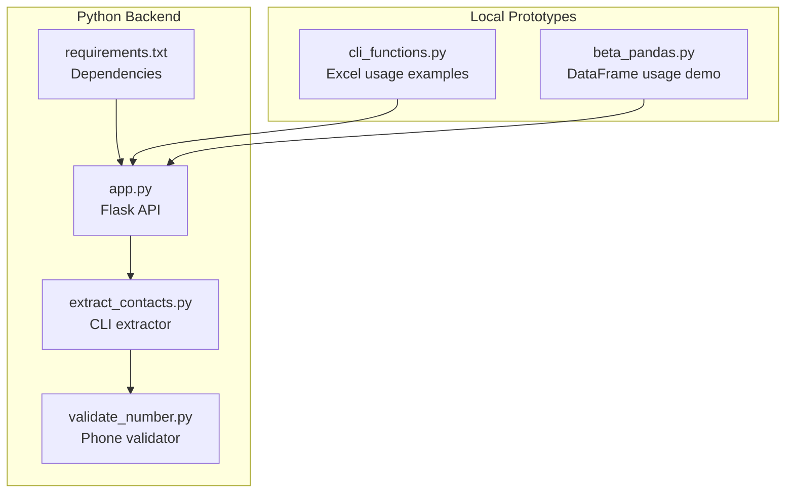
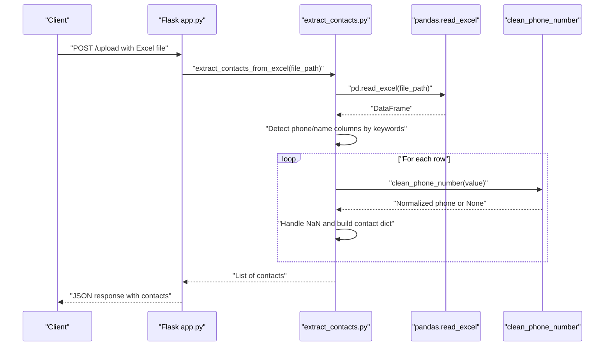
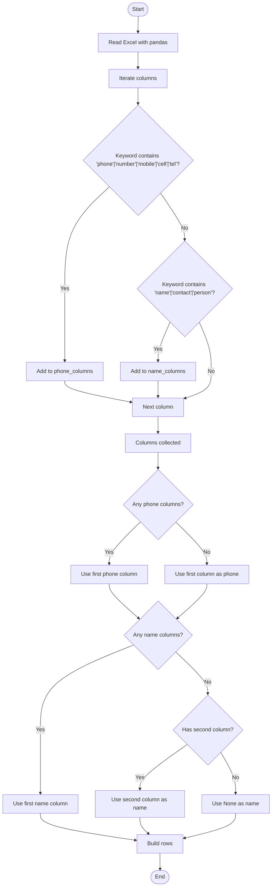
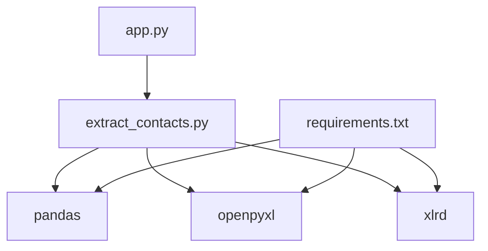

# Excel File Extraction

<cite>
**Referenced Files in This Document**
- [extract_contacts.py](file://python-backend/extract_contacts.py)
- [app.py](file://python-backend/app.py)
- [requirements.txt](file://python-backend/requirements.txt)
- [validate_number.py](file://python-backend/validate_number.py)
- [cli_functions.py](file://localhost/cli_functions.py)
- [beta_pandas.py](file://localhost/prototypes/beta_pandas.py)
</cite>

## Table of Contents
1. [Introduction](#introduction)
2. [Project Structure](#project-structure)
3. [Core Components](#core-components)
4. [Architecture Overview](#architecture-overview)
5. [Detailed Component Analysis](#detailed-component-analysis)
6. [Dependency Analysis](#dependency-analysis)
7. [Performance Considerations](#performance-considerations)
8. [Troubleshooting Guide](#troubleshooting-guide)
9. [Conclusion](#conclusion)

## Introduction
This document explains the Excel file contact extraction pipeline powered by pandas integration. It covers how the system detects phone number and name columns in Excel files (.xlsx and .xls), processes pandas DataFrames, handles NaN values and data types, and manages encoding considerations. It also documents fallback mechanisms when pandas encounters corrupted Excel files and provides examples of supported formats, column naming variations, and common issues.

## Project Structure
The Excel extraction feature is implemented in two primary locations:
- A standalone CLI script that extracts contacts from CSV, TXT, and Excel files
- A Flask API that accepts uploads, routes to the same extraction logic, and returns structured results

**Diagram sources**
- [extract_contacts.py](file://python-backend/extract_contacts.py#L1-L177)
- [app.py](file://python-backend/app.py#L1-L378)
- [requirements.txt](file://python-backend/requirements.txt#L1-L7)
- [validate_number.py](file://python-backend/validate_number.py#L1-L27)
- [cli_functions.py](file://localhost/cli_functions.py#L1-L360)
- [beta_pandas.py](file://localhost/prototypes/beta_pandas.py#L1-L50)

**Section sources**
- [extract_contacts.py](file://python-backend/extract_contacts.py#L1-L177)
- [app.py](file://python-backend/app.py#L1-L378)
- [requirements.txt](file://python-backend/requirements.txt#L1-L7)

## Core Components
- Phone number cleaning and normalization
  - Removes separators and validates digit count
  - Adds international prefix when applicable
- Column detection algorithm
  - Keyword-based matching for phone and name columns
  - Fallback selection when keywords are absent
- pandas DataFrame processing
  - Reading Excel files with pandas
  - Iterating rows and handling NaN values
- Fallback mechanisms
  - Graceful handling of exceptions during Excel parsing
  - Minimal return when extraction fails

Key implementation references:
- Phone cleaning: [clean_phone_number](file://python-backend/extract_contacts.py#L9-L22)
- Excel extraction: [extract_contacts_from_excel](file://python-backend/extract_contacts.py#L121-L157)
- Column detection: [keyword matching loop](file://python-backend/extract_contacts.py#L127-L135)
- Row iteration and NaN handling: [row processing](file://python-backend/extract_contacts.py#L142-L154)

**Section sources**
- [extract_contacts.py](file://python-backend/extract_contacts.py#L9-L22)
- [extract_contacts.py](file://python-backend/extract_contacts.py#L121-L157)

## Architecture Overview
The system integrates pandas for Excel parsing and applies a consistent column detection and phone cleaning workflow across formats.

**Diagram sources**
- [app.py](file://python-backend/app.py#L232-L280)
- [extract_contacts.py](file://python-backend/extract_contacts.py#L121-L157)
- [extract_contacts.py](file://python-backend/extract_contacts.py#L9-L22)

## Detailed Component Analysis

### Excel Column Detection Algorithm
The algorithm identifies phone and name columns using keyword matching against column names:
- Phone keywords: ["phone", "number", "mobile", "cell", "tel"]
- Name keywords: ["name", "contact", "person"]

Selection logic:
- If any phone column is found, the first match is used
- Otherwise, the first column is used as phone
- If any name column is found, the first match is used
- Otherwise, the second column is used as name (if available)

**Diagram sources**
- [extract_contacts.py](file://python-backend/extract_contacts.py#L121-L157)

**Section sources**
- [extract_contacts.py](file://python-backend/extract_contacts.py#L121-L157)

### pandas DataFrame Processing Workflow
- Reading Excel files
  - Uses pandas to load .xlsx and .xls files
  - Internally relies on installed engines (openpyxl for .xlsx, xlrd for .xls)
- Iterating rows
  - Iterates over DataFrame rows to extract values
- Handling NaN values
  - Checks for numeric NaN types and skips invalid entries
- Data type conversion
  - Converts values to string before stripping and cleaning
- Encoding considerations
  - The extraction logic does not enforce encoding; pandas defaults apply

References:
- DataFrame creation: [pd.read_excel](file://python-backend/extract_contacts.py#L124)
- Row iteration and NaN checks: [row processing](file://python-backend/extract_contacts.py#L142-L154)
- Dependencies for engines: [requirements.txt](file://python-backend/requirements.txt#L3-L5)

**Section sources**
- [extract_contacts.py](file://python-backend/extract_contacts.py#L124-L154)
- [requirements.txt](file://python-backend/requirements.txt#L3-L5)

### Automatic Phone Number and Name Column Identification
- Phone column identification
  - Keywords searched in lowercase column names
  - First matching column is selected; otherwise first column
- Name column identification
  - Keywords searched in lowercase column names
  - First matching column is selected; otherwise second column if available
- Fallback behavior
  - If no columns match, the algorithm falls back to first/second columns

References:
- Keyword matching: [phone and name detection](file://python-backend/extract_contacts.py#L127-L140)

**Section sources**
- [extract_contacts.py](file://python-backend/extract_contacts.py#L127-L140)

### Phone Number Cleaning and Validation
- Removes separators and non-digits except plus sign
- Strips leading zeros when not international
- Adds plus sign for international-like numbers
- Validates digit count to ensure realistic lengths

References:
- Cleaning logic: [clean_phone_number](file://python-backend/extract_contacts.py#L9-L22)

**Section sources**
- [extract_contacts.py](file://python-backend/extract_contacts.py#L9-L22)

### Fallback Mechanisms for Corrupted Excel Files
- The Excel extraction function wraps pandas loading in a try-except block
- On failure, the function returns an empty list without raising errors
- This prevents API crashes and allows graceful degradation

References:
- Exception handling: [try-except around pd.read_excel](file://python-backend/extract_contacts.py#L123-L156)

**Section sources**
- [extract_contacts.py](file://python-backend/extract_contacts.py#L123-L156)

### Supported Excel Formats and Column Naming Variations
- Supported formats
  - .xlsx and .xls are supported via pandas read_excel
  - Engines: openpyxl for .xlsx, xlrd for .xls
- Column naming variations
  - Phone columns: "phone", "number", "mobile", "cell", "tel" (case-insensitive)
  - Name columns: "name", "contact", "person" (case-insensitive)
- Practical examples
  - Column names like "Mobile Number", "Tel", "Contact Person" are recognized
  - If none match, the algorithm uses the first column as phone and second as name (if present)

References:
- Engines: [requirements.txt](file://python-backend/requirements.txt#L3-L5)
- Keyword matching: [column detection](file://python-backend/extract_contacts.py#L127-L140)

**Section sources**
- [requirements.txt](file://python-backend/requirements.txt#L3-L5)
- [extract_contacts.py](file://python-backend/extract_contacts.py#L127-L140)

### Common Issues with Excel File Processing
- Empty or malformed Excel files
  - pandas may raise errors; the extractor catches and returns empty results
- Missing expected columns
  - The algorithm falls back to first/second columns; ensure data layout aligns with expectations
- Mixed data types
  - Values are coerced to strings before cleaning; ensure phone numbers are readable text or numbers
- Encoding and locale differences
  - The extractor does not enforce encoding; rely on pandas defaults

References:
- Error handling: [exception handling](file://python-backend/extract_contacts.py#L123-L156)
- Engine-related errors: [EmptyDataError and KeyError examples](file://localhost/cli_functions.py#L134-L143)

**Section sources**
- [extract_contacts.py](file://python-backend/extract_contacts.py#L123-L156)
- [cli_functions.py](file://localhost/cli_functions.py#L134-L143)

## Dependency Analysis
The Excel extraction depends on pandas and its engines for reading Excel files.

**Diagram sources**
- [extract_contacts.py](file://python-backend/extract_contacts.py#L1-L177)
- [requirements.txt](file://python-backend/requirements.txt#L1-L7)

**Section sources**
- [requirements.txt](file://python-backend/requirements.txt#L1-L7)
- [extract_contacts.py](file://python-backend/extract_contacts.py#L1-L177)

## Performance Considerations
- Large Excel files
  - Reading and iterating rows scales linearly with the number of rows
  - Consider chunking or limiting rows for very large datasets
- Keyword matching
  - Linear scan over columns; negligible overhead compared to IO
- Memory usage
  - Entire DataFrame is loaded into memory; consider streaming alternatives for extremely large files
- Engine choice
  - openpyxl is efficient for .xlsx; xlrd for .xls; ensure correct engine is installed

[No sources needed since this section provides general guidance]

## Troubleshooting Guide
- Excel file not readable
  - Verify file format and engine installation
  - Confirm that the file is not password-protected or corrupted
- Unexpected empty results
  - Check column names for expected keywords
  - Ensure phone numbers are present and not entirely blank
- Phone number validation failures
  - Confirm the number meets digit count requirements after cleaning
  - Review separator characters and prefixes

References:
- Engine installation: [requirements.txt](file://python-backend/requirements.txt#L3-L5)
- Validation logic: [clean_phone_number](file://python-backend/extract_contacts.py#L9-L22)

**Section sources**
- [requirements.txt](file://python-backend/requirements.txt#L3-L5)
- [extract_contacts.py](file://python-backend/extract_contacts.py#L9-L22)

## Conclusion
The Excel contact extraction pipeline leverages pandas to read .xlsx and .xls files, applies robust keyword-based column detection, and cleans phone numbers consistently. It gracefully handles exceptions and provides fallback behavior for corrupted or misformatted files. By aligning column names with supported keywords and ensuring proper engine installation, users can reliably extract contacts from Excel spreadsheets.