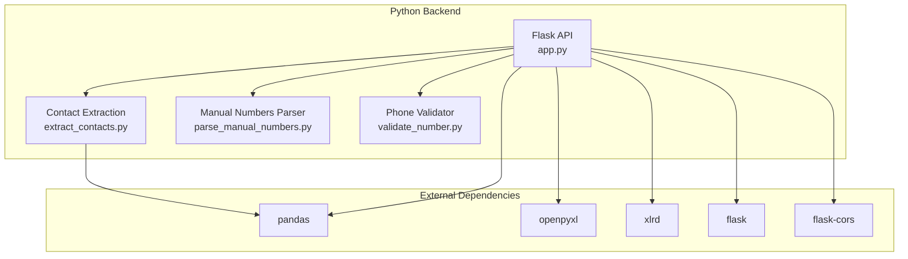
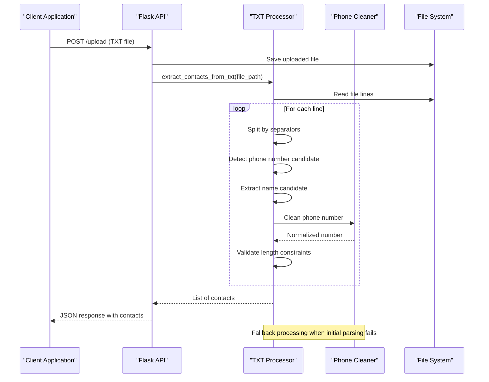
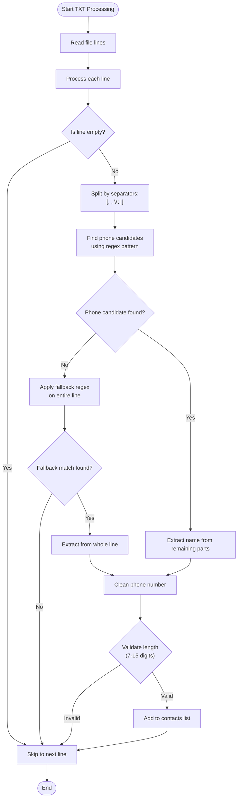
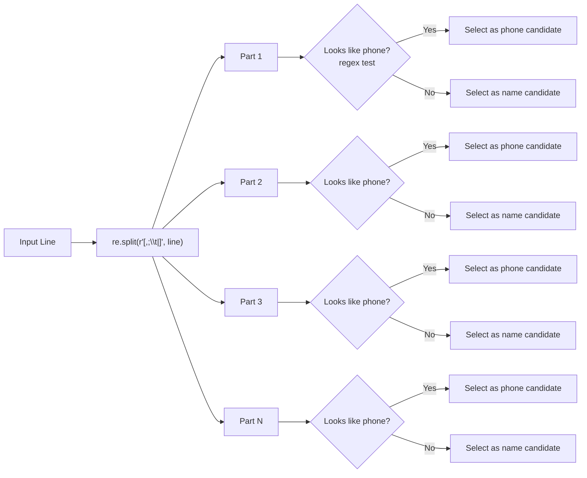
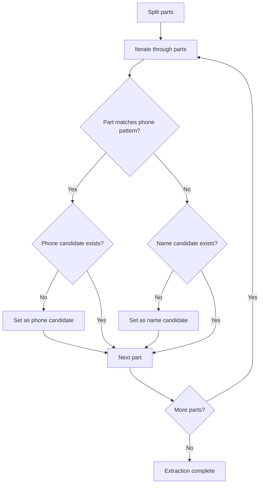
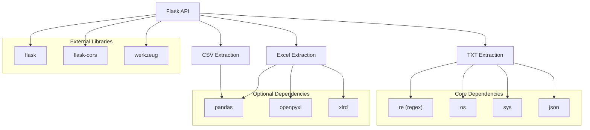

# TXT File Extraction

<cite>
**Referenced Files in This Document**
- [app.py](file://python-backend/app.py)
- [extract_contacts.py](file://python-backend/extract_contacts.py)
- [parse_manual_numbers.py](file://python-backend/parse_manual_numbers.py)
- [validate_number.py](file://python-backend/validate_number.py)
- [requirements.txt](file://python-backend/requirements.txt)
- [README.md](file://README.md)
</cite>

## Table of Contents
1. [Introduction](#introduction)
2. [Project Structure](#project-structure)
3. [Core Components](#core-components)
4. [Architecture Overview](#architecture-overview)
5. [Detailed Component Analysis](#detailed-component-analysis)
6. [Dependency Analysis](#dependency-analysis)
7. [Performance Considerations](#performance-considerations)
8. [Troubleshooting Guide](#troubleshooting-guide)
9. [Conclusion](#conclusion)

## Introduction
This document provides comprehensive documentation for TXT file contact extraction capabilities within the Bulk Messaging System. It focuses on the regex-based phone number detection algorithm, multi-separator splitting logic, name extraction when names are combined with phone numbers, supported TXT formats, mixed format handling, edge cases, and fallback parsing strategies.

## Project Structure
The TXT extraction functionality is implemented in two primary locations:
- A Flask-based API service that handles file uploads and contact extraction
- Standalone Python utilities for direct command-line usage



**Diagram sources**
- [app.py](file://python-backend/app.py#L1-L378)
- [extract_contacts.py](file://python-backend/extract_contacts.py#L1-L177)
- [parse_manual_numbers.py](file://python-backend/parse_manual_numbers.py#L1-L61)
- [validate_number.py](file://python-backend/validate_number.py#L1-L27)
- [requirements.txt](file://python-backend/requirements.txt#L1-L7)

**Section sources**
- [README.md](file://README.md#L182-L197)
- [requirements.txt](file://python-backend/requirements.txt#L1-L7)

## Core Components
The TXT extraction system consists of several key components working together:

### Phone Number Cleaning Algorithm
The core phone number cleaning function performs systematic normalization:
- Removes common separators (hyphens, spaces, parentheses, periods)
- Strips non-digit characters except plus signs
- Handles country code detection and normalization
- Validates length constraints (7-15 digits)

### TXT File Processing Pipeline
The TXT extraction follows a multi-stage approach:
1. Line-by-line processing with UTF-8 encoding
2. Multi-separator splitting using comma, semicolon, tab, and pipe delimiters
3. Pattern-based phone number detection using regex
4. Fallback extraction when separators are absent
5. Name extraction from remaining parts

### Fallback Parsing Strategies
When initial parsing fails, the system employs progressive fallback mechanisms:
- Separator-based splitting with multiple delimiter support
- Whole-line regex matching for phone numbers
- Name extraction from remaining text segments
- Graceful error handling and empty line skipping

**Section sources**
- [app.py](file://python-backend/app.py#L28-L56)
- [extract_contacts.py](file://python-backend/extract_contacts.py#L9-L22)
- [app.py](file://python-backend/app.py#L128-L175)

## Architecture Overview
The TXT extraction architecture implements a layered approach with robust error handling and fallback mechanisms.



**Diagram sources**
- [app.py](file://python-backend/app.py#L232-L280)
- [app.py](file://python-backend/app.py#L128-L175)
- [app.py](file://python-backend/app.py#L28-L56)

## Detailed Component Analysis

### TXT Extraction Algorithm
The TXT extraction algorithm implements sophisticated pattern matching and parsing logic.



**Diagram sources**
- [app.py](file://python-backend/app.py#L128-L175)
- [extract_contacts.py](file://python-backend/extract_contacts.py#L84-L118)

### Phone Number Detection Patterns
The system uses sophisticated regex patterns for phone number identification:

#### Primary Detection Pattern
The main pattern `[\d+\-\(\)\s]{7,}` identifies phone numbers by:
- Matching digits (`\d+`)
- Including plus signs (`+`)
- Allowing hyphens (`\-`)
- Permitting parentheses (`\(\)`)
- Supporting spaces (`\s`)
- Requiring minimum 7 characters for validation

#### Fallback Detection Pattern
The fallback pattern `[\+]?[\d\-\(\)\s]{7,}` handles:
- Optional leading plus sign
- Flexible digit and separator combinations
- Whole-line matching when separators are absent

### Multi-Separator Splitting Logic
The system supports four primary separators with equal precedence:



**Diagram sources**
- [app.py](file://python-backend/app.py#L142)
- [extract_contacts.py](file://python-backend/extract_contacts.py#L93)

### Name Extraction Process
When names are combined with phone numbers, the system implements intelligent extraction:

#### Mixed Format Handling
The algorithm prioritizes:
1. **First phone candidate**: Selected when multiple phone-like segments exist
2. **First non-empty segment**: Used as name when no clear phone candidate exists
3. **Fallback extraction**: When separators are absent, the system extracts from the entire line

#### Name Candidate Selection


**Diagram sources**
- [app.py](file://python-backend/app.py#L148-L154)
- [extract_contacts.py](file://python-backend/extract_contacts.py#L96-L102)

### Supported TXT Formats and Examples

#### Standard Separated Format
```
John Doe,123-456-7890
Jane Smith;john.doe@gmail.com|+1-555-0123
Bob Wilson|+44 20 7946 0958
Alice Brown,555.123.4567
```

#### Mixed Format Handling
```
+1-555-0123 John Smith
5551234567 Jane Doe
+442079460958 Bob Wilson
```

#### Edge Case Examples
```
John Doe,123-456-7890,,Extra Field
  
123-456-7890
Jane Smith
```

### Error Recovery Mechanisms
The system implements comprehensive error handling:

#### File Processing Errors
- UTF-8 encoding enforcement
- Graceful handling of unreadable files
- Empty file and directory handling

#### Parsing Failures
- Line-by-line processing with individual error isolation
- Empty line skipping
- Partial parsing continuation on errors

#### Phone Number Validation
- Length validation (7-15 digits)
- Format normalization
- Country code detection and correction

**Section sources**
- [app.py](file://python-backend/app.py#L132-L175)
- [extract_contacts.py](file://python-backend/extract_contacts.py#L86-L118)

## Dependency Analysis
The TXT extraction system relies on several key dependencies:



**Diagram sources**
- [requirements.txt](file://python-backend/requirements.txt#L1-L7)
- [app.py](file://python-backend/app.py#L1-L11)

### External Dependencies Impact
- **pandas**: Enables structured data processing for CSV/Excel files
- **openpyxl/xlrd**: Provides Excel file format support
- **flask/flask-cors**: Powers the web API interface
- **werkzeug**: Handles file uploads and security

**Section sources**
- [requirements.txt](file://python-backend/requirements.txt#L1-L7)
- [app.py](file://python-backend/app.py#L1-L11)

## Performance Considerations
The TXT extraction system is optimized for efficiency and scalability:

### Algorithm Complexity
- **Time Complexity**: O(n × m) where n is number of lines and m is average parts per line
- **Space Complexity**: O(k) where k is number of valid contacts extracted
- **Memory Usage**: Linear with respect to file size

### Optimization Strategies
- Single-pass line processing
- Early termination on empty lines
- Minimal regex operations per line
- Efficient string operations for phone number cleaning

### Scalability Factors
- File size limitations (16MB max upload)
- Memory constraints for large files
- Regex compilation caching
- Streaming file processing

## Troubleshooting Guide

### Common Issues and Solutions

#### Phone Number Not Detected
**Symptoms**: Phone numbers appear as empty or invalid
**Causes**:
- Numbers shorter than 7 digits or longer than 15 digits
- Unrecognized separators or formatting
- Leading zeros in international numbers

**Solutions**:
- Ensure numbers meet length requirements
- Use recognized separators (spaces, hyphens, parentheses)
- Include country codes for international numbers

#### Mixed Format Problems
**Symptoms**: Names incorrectly extracted or phone numbers missed
**Causes**:
- Ambiguous separators causing misinterpretation
- Names containing phone number patterns
- Missing separators in lines

**Solutions**:
- Use consistent separator usage
- Place phone numbers first when mixing formats
- Include explicit separators between name and number

#### File Encoding Issues
**Symptoms**: Characters appear corrupted or parsing fails
**Causes**:
- Non-UTF-8 file encoding
- Special characters not properly handled
- BOM (Byte Order Mark) interference

**Solutions**:
- Save files in UTF-8 encoding
- Remove BOM if present
- Verify character encoding compatibility

#### Performance Issues
**Symptoms**: Slow processing for large files
**Causes**:
- Very large file sizes exceeding limits
- Complex regex patterns
- Memory constraints

**Solutions**:
- Split large files into smaller chunks
- Optimize regex patterns
- Monitor memory usage during processing

### Error Codes and Messages
The system provides structured error reporting:
- File not found errors
- Unsupported file type errors
- Processing exceptions with detailed messages
- Validation failures with specific reasons

**Section sources**
- [app.py](file://python-backend/app.py#L172-L173)
- [README.md](file://README.md#L434-L438)

## Conclusion
The TXT file extraction system provides robust, flexible contact processing with sophisticated regex-based phone number detection and intelligent name extraction. Its multi-layered approach ensures reliable parsing across various formats while maintaining strong error handling and performance characteristics. The system successfully handles edge cases, mixed formats, and provides comprehensive fallback mechanisms for maximum compatibility with diverse contact data sources.

The implementation demonstrates best practices in:
- Progressive parsing with multiple fallback strategies
- Comprehensive error handling and recovery
- Efficient regex pattern matching
- Flexible separator support
- International phone number normalization

This foundation enables reliable bulk messaging operations while maintaining data integrity and user experience across different contact data formats.