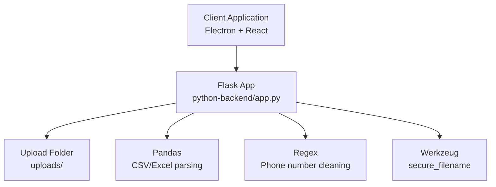
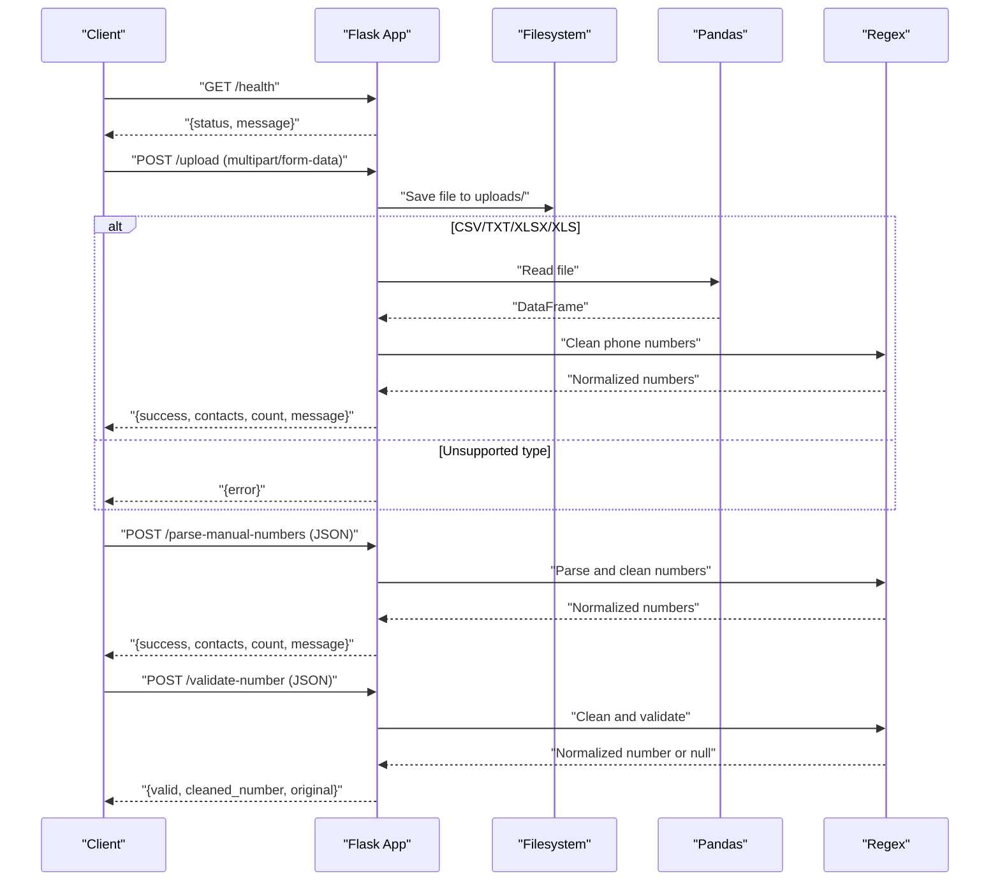
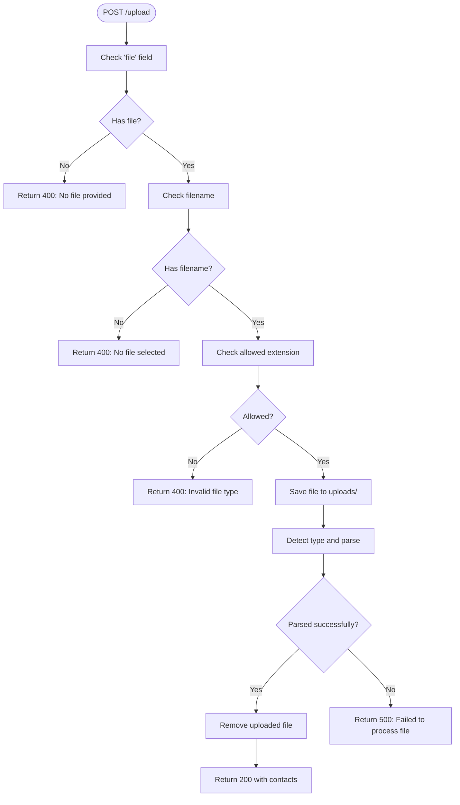
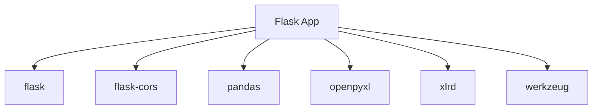

# Flask API Endpoints

<cite>
**Referenced Files in This Document**
- [python-backend/app.py](file://python-backend/app.py)
- [python-backend/extract_contacts.py](file://python-backend/extract_contacts.py)
- [python-backend/parse_manual_numbers.py](file://python-backend/parse_manual_numbers.py)
- [python-backend/validate_number.py](file://python-backend/validate_number.py)
- [python-backend/requirements.txt](file://python-backend/requirements.txt)
- [python-backend/README.md](file://python-backend/README.md)
- [README.md](file://README.md)
</cite>

## Table of Contents
1. [Introduction](#introduction)
2. [Project Structure](#project-structure)
3. [Core Components](#core-components)
4. [Architecture Overview](#architecture-overview)
5. [Detailed Component Analysis](#detailed-component-analysis)
6. [Dependency Analysis](#dependency-analysis)
7. [Performance Considerations](#performance-considerations)
8. [Troubleshooting Guide](#troubleshooting-guide)
9. [Conclusion](#conclusion)
10. [Appendices](#appendices)

## Introduction
This document provides comprehensive API documentation for the Flask-based contact processing endpoints used by the desktop application for bulk messaging. It covers:
- Health check endpoint for system monitoring
- File upload endpoint for importing contacts from CSV, TXT, and Excel files
- Manual number parsing endpoint for direct phone number input
- Single number validation endpoint for individual phone number verification

It includes request/response schemas, HTTP status codes, error handling patterns, authentication requirements, practical usage examples with curl commands, and guidance on rate limiting, file size limits, and security measures.

## Project Structure
The API is implemented in a dedicated Python backend module with a Flask application that exposes four endpoints:
- Health check: GET /health
- File upload: POST /upload
- Manual number parsing: POST /parse-manual-numbers
- Number validation: POST /validate-number

**Diagram sources**
- [python-backend/app.py](file://python-backend/app.py#L10-L22)
- [python-backend/requirements.txt](file://python-backend/requirements.txt#L1-L7)

**Section sources**
- [python-backend/app.py](file://python-backend/app.py#L10-L22)
- [python-backend/README.md](file://python-backend/README.md#L39-L62)

## Core Components
- Flask application with CORS enabled for cross-origin requests
- File upload handling with allowed extensions and size limit
- Phone number cleaning and validation logic
- Contact extraction from CSV, TXT, and Excel files
- Manual number parsing with flexible input formats
- Health check endpoint returning system status

Key configurations:
- Upload folder: uploads/
- Allowed file types: txt, csv, xlsx, xls
- Max content length: 16 MB
- CORS enabled globally

**Section sources**
- [python-backend/app.py](file://python-backend/app.py#L10-L22)
- [python-backend/app.py](file://python-backend/app.py#L24-L25)
- [python-backend/app.py](file://python-backend/app.py#L225-L229)
- [python-backend/app.py](file://python-backend/app.py#L232-L280)
- [python-backend/app.py](file://python-backend/app.py#L283-L341)
- [python-backend/app.py](file://python-backend/app.py#L343-L370)

## Architecture Overview
The API follows a straightforward request-response model:
- Clients send HTTP requests to the endpoints
- The Flask app validates inputs and performs operations
- Responses are returned as JSON with appropriate status codes

**Diagram sources**
- [python-backend/app.py](file://python-backend/app.py#L225-L370)
- [python-backend/extract_contacts.py](file://python-backend/extract_contacts.py#L25-L81)
- [python-backend/parse_manual_numbers.py](file://python-backend/parse_manual_numbers.py#L22-L54)
- [python-backend/validate_number.py](file://python-backend/validate_number.py#L6-L19)

## Detailed Component Analysis

### Health Check Endpoint
- Path: GET /health
- Purpose: System monitoring and readiness probe
- Request: No body required
- Response:
  - Success: 200 OK with JSON object containing status and message
- Example curl command:
  - curl -s http://localhost:5000/health
- Notes:
  - No authentication required
  - Typical use: Kubernetes liveness/readiness probes

Response schema:
- Field: status (string) - "healthy"
- Field: message (string) - descriptive status text

HTTP status codes:
- 200 OK

**Section sources**
- [python-backend/app.py](file://python-backend/app.py#L225-L229)
- [python-backend/README.md](file://python-backend/README.md#L41-L44)

### File Upload Endpoint
- Path: POST /upload
- Purpose: Import contacts from CSV, TXT, or Excel files
- Request:
  - Content-Type: multipart/form-data
  - Field: file (required)
- Response:
  - Success: 200 OK with JSON object containing success flag, contacts array, count, and message
  - Error: 400 Bad Request for invalid or unsupported files, or 500 Internal Server Error for processing failures
- Example curl command:
  - curl -s -F "file=@sample.csv" http://localhost:5000/upload
  - curl -s -F "file=@contacts.xlsx" http://localhost:5000/upload
  - curl -s -F "file=@numbers.txt" http://localhost:5000/upload
- Notes:
  - Supported file types: txt, csv, xlsx, xls
  - Maximum file size: 16 MB
  - Uploaded files are removed after processing

Request schema:
- Field: file (binary) - file to upload

Response schema (success):
- Field: success (boolean) - true
- Field: contacts (array) - array of contact objects
  - Each contact object:
    - number (string) - normalized phone number
    - name (string or null) - contact name or auto-generated placeholder
- Field: count (integer) - number of contacts extracted
- Field: message (string) - operation summary

Response schema (error):
- Field: error (string) - error description

HTTP status codes:
- 200 OK (on success)
- 400 Bad Request (no file, empty filename, invalid file type)
- 500 Internal Server Error (processing failure)

Processing logic:
- Validates presence and extension of uploaded file
- Saves file securely to uploads/ directory
- Detects file type and parses accordingly:
  - CSV: reads with pandas, detects phone/name columns, cleans numbers
  - TXT: splits by separators, attempts to detect phone number patterns
  - Excel: reads with pandas, similar column detection and cleaning
- Removes uploaded file after processing

**Diagram sources**
- [python-backend/app.py](file://python-backend/app.py#L232-L280)

**Section sources**
- [python-backend/app.py](file://python-backend/app.py#L14-L21)
- [python-backend/app.py](file://python-backend/app.py#L232-L280)
- [python-backend/README.md](file://python-backend/README.md#L46-L50)

### Manual Number Parsing Endpoint
- Path: POST /parse-manual-numbers
- Purpose: Parse manually entered phone numbers with optional names
- Request:
  - Content-Type: application/json
  - Body: JSON object with numbers field
- Response:
  - Success: 200 OK with JSON object containing success flag, contacts array, count, and message
  - Error: 400 Bad Request if numbers field is missing, or 500 Internal Server Error for processing failures
- Example curl command:
  - curl -s -H "Content-Type: application/json" -d '{"numbers":"+1234567890\n555-123-4567"}' http://localhost:5000/parse-manual-numbers
  - curl -s -H "Content-Type: application/json" -d '{"numbers":"John:+1234567890\nJane:555-123-4567"}' http://localhost:5000/parse-manual-numbers
- Notes:
  - Supports newline, comma, and semicolon separators
  - Recognizes "Name: Number" or "Number - Name" formats

Request schema:
- Field: numbers (string) - one or more phone numbers separated by newlines, commas, or semicolons

Response schema (success):
- Field: success (boolean) - true
- Field: contacts (array) - array of contact objects
  - Each contact object:
    - number (string) - normalized phone number
    - name (string or null) - contact name or auto-generated placeholder
- Field: count (integer) - number of contacts parsed
- Field: message (string) - operation summary

Response schema (error):
- Field: error (string) - error description

HTTP status codes:
- 200 OK (on success)
- 400 Bad Request (missing numbers field)
- 500 Internal Server Error (processing failure)

Parsing logic:
- Splits input by newlines, commas, or semicolons
- Attempts to split by colon or dash to separate name and number
- Validates and normalizes each number
- Ignores empty entries

**Section sources**
- [python-backend/app.py](file://python-backend/app.py#L283-L341)
- [python-backend/README.md](file://python-backend/README.md#L52-L56)

### Single Number Validation Endpoint
- Path: POST /validate-number
- Purpose: Validate and normalize a single phone number
- Request:
  - Content-Type: application/json
  - Body: JSON object with number field
- Response:
  - Success: 200 OK with JSON object indicating validity and normalized number
  - Error: 400 Bad Request if number field is missing, or 500 Internal Server Error for processing failures
- Example curl command:
  - curl -s -H "Content-Type: application/json" -d '{"number":"+1234567890"}' http://localhost:5000/validate-number
- Notes:
  - Returns cleaned number if valid, otherwise null

Request schema:
- Field: number (string) - phone number to validate

Response schema (success):
- Field: valid (boolean) - true if number is valid, false otherwise
- Field: cleaned_number (string or null) - normalized number or null if invalid
- Field: original (string) - original input number

Response schema (error):
- Field: error (string) - error description

HTTP status codes:
- 200 OK (on success)
- 400 Bad Request (missing number field)
- 500 Internal Server Error (processing failure)

Validation logic:
- Cleans and normalizes the number using regex rules
- Validates digit count and format constraints
- Returns normalized number if valid, null otherwise

**Section sources**
- [python-backend/app.py](file://python-backend/app.py#L343-L370)
- [python-backend/README.md](file://python-backend/README.md#L58-L62)

## Dependency Analysis
External dependencies used by the Flask application:
- flask: Web framework
- flask-cors: Enable CORS for cross-origin requests
- pandas: Read CSV and Excel files
- openpyxl: Read Excel (.xlsx) files
- xlrd: Read legacy Excel (.xls) files
- werkzeug: Secure filename handling

**Diagram sources**
- [python-backend/requirements.txt](file://python-backend/requirements.txt#L1-L7)

**Section sources**
- [python-backend/requirements.txt](file://python-backend/requirements.txt#L1-L7)

## Performance Considerations
- File size limit: 16 MB enforced via MAX_CONTENT_LENGTH
- CPU-bound parsing: Regex and pandas operations; large files may take time
- Memory usage: Depends on file size and number of contacts
- Recommendations:
  - Validate file sizes client-side before upload
  - Consider streaming or chunked processing for very large files
  - Use asynchronous processing for heavy workloads
  - Implement rate limiting at the application level if needed

[No sources needed since this section provides general guidance]

## Troubleshooting Guide
Common issues and resolutions:
- Health check fails:
  - Ensure the Flask server is running on the expected host/port
  - Check network connectivity and firewall settings
- Upload endpoint returns 400:
  - Verify the file field is present and not empty
  - Confirm file extension is one of txt, csv, xlsx, xls
  - Check file size does not exceed 16 MB
- Upload endpoint returns 500:
  - Inspect server logs for exceptions during file processing
  - Validate file encoding and structure
- Manual number parsing returns 400:
  - Ensure the JSON body contains a numbers field
- Number validation returns 400:
  - Ensure the JSON body contains a number field
- CORS errors:
  - Confirm flask-cors is enabled and origin is allowed
- Rate limiting:
  - Implement application-level throttling if needed
  - Consider external rate limiting proxies

**Section sources**
- [python-backend/app.py](file://python-backend/app.py#L225-L370)
- [python-backend/README.md](file://python-backend/README.md#L107-L112)

## Conclusion
The Flask API provides essential contact processing capabilities for the desktop application:
- Health check for monitoring
- File upload with robust parsing for CSV, TXT, and Excel
- Manual number parsing with flexible input formats
- Single number validation with normalization

The endpoints are designed for simplicity and reliability, with clear error handling and sensible defaults. For production deployments, consider adding authentication, rate limiting, and input sanitization as needed.

[No sources needed since this section summarizes without analyzing specific files]

## Appendices

### Authentication Requirements
- No authentication is required for any of the endpoints
- For production environments, consider adding authentication middleware or API keys

**Section sources**
- [python-backend/app.py](file://python-backend/app.py#L10-L11)

### Practical Usage Examples
- Health check:
  - curl -s http://localhost:5000/health
- Upload CSV:
  - curl -s -F "file=@sample.csv" http://localhost:5000/upload
- Upload Excel:
  - curl -s -F "file=@contacts.xlsx" http://localhost:5000/upload
- Upload TXT:
  - curl -s -F "file=@numbers.txt" http://localhost:5000/upload
- Manual numbers:
  - curl -s -H "Content-Type: application/json" -d '{"numbers":"+1234567890\n555-123-4567"}' http://localhost:5000/parse-manual-numbers
- Validate number:
  - curl -s -H "Content-Type: application/json" -d '{"number":"+1234567890"}' http://localhost:5000/validate-number

**Section sources**
- [python-backend/README.md](file://python-backend/README.md#L39-L62)

### Security Measures
- CORS enabled globally; restrict origins in production
- Secure filename handling via werkzeug.secure_filename
- File type validation against allowed extensions
- Maximum content length set to 16 MB
- Consider adding input validation and sanitization

**Section sources**
- [python-backend/app.py](file://python-backend/app.py#L10-L11)
- [python-backend/app.py](file://python-backend/app.py#L14-L21)
- [python-backend/app.py](file://python-backend/app.py#L24-L25)

### Rate Limiting Considerations
- No built-in rate limiting in the current implementation
- Recommended approaches:
  - Use Flask-Limiter or similar libraries
  - Implement application-level counters
  - Place a reverse proxy with rate limiting in front of the API

[No sources needed since this section provides general guidance]

### File Size Limits
- Maximum upload size: 16 MB
- Enforced via Flask’s MAX_CONTENT_LENGTH configuration

**Section sources**
- [python-backend/app.py](file://python-backend/app.py#L21)

### Supported File Formats
- CSV: Comma-separated values with automatic column detection for phone and name
- TXT: One contact per line; supports "Name: Number" and "Number - Name" formats
- Excel: .xlsx and .xls files with automatic column detection

**Section sources**
- [python-backend/README.md](file://python-backend/README.md#L64-L87)