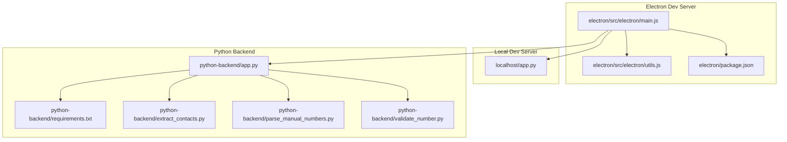
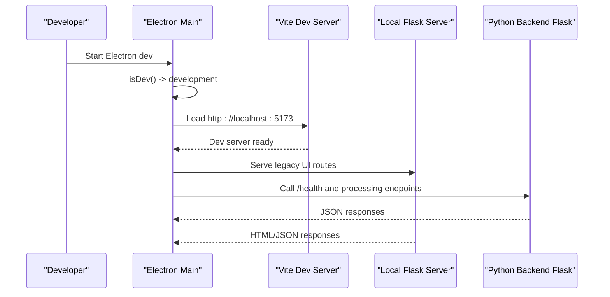
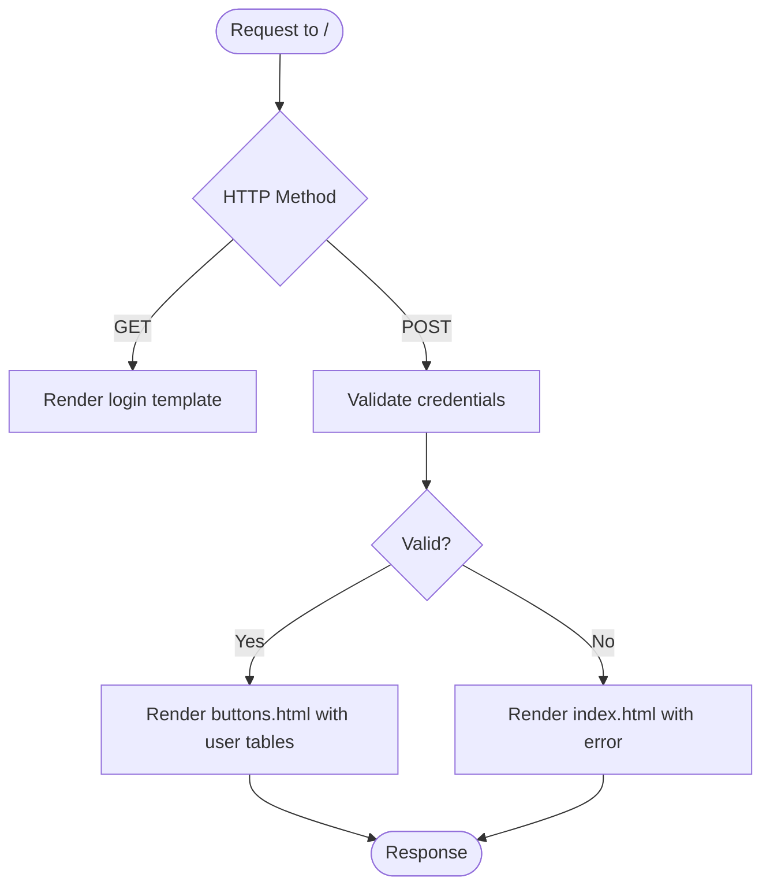
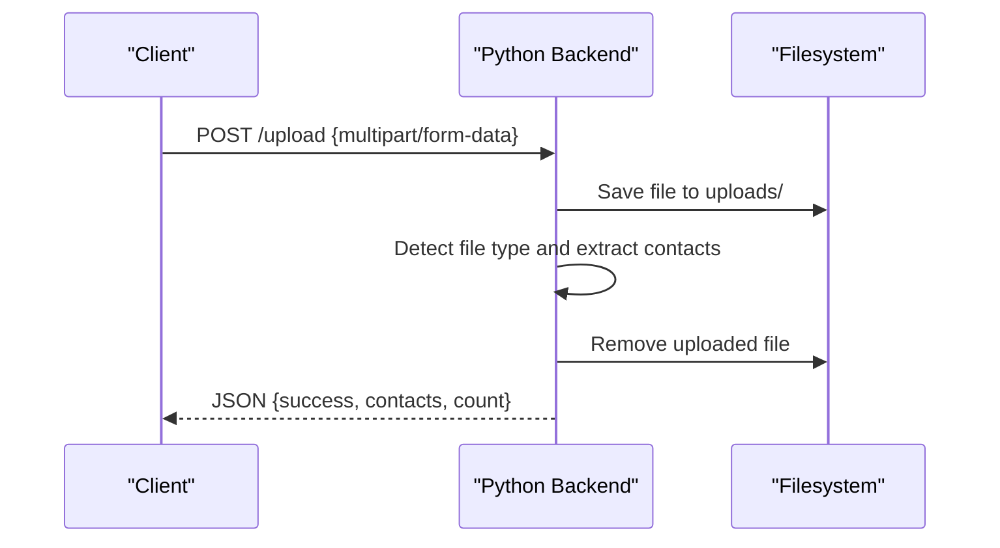
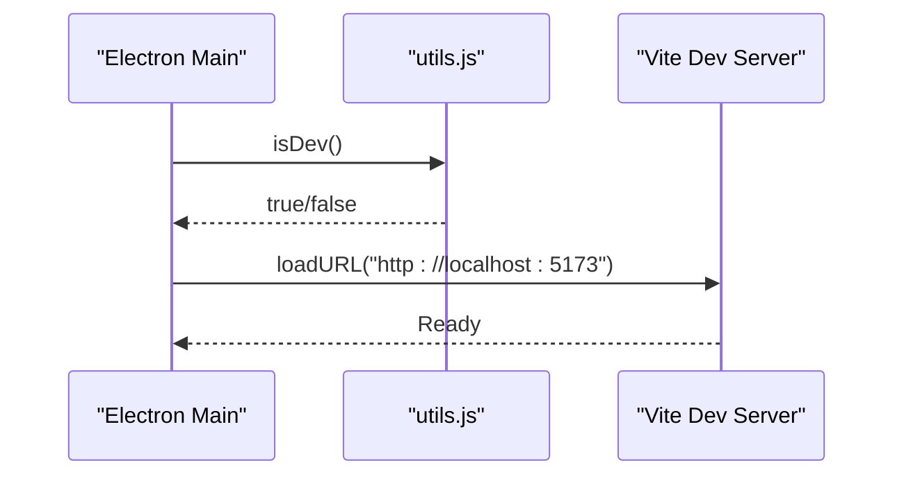
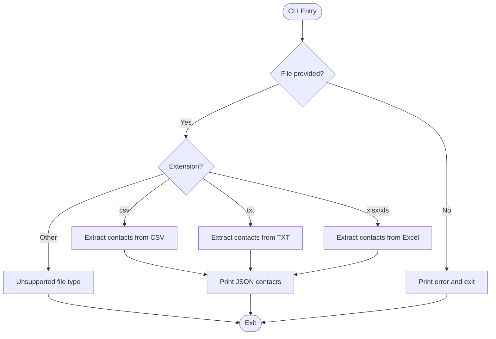
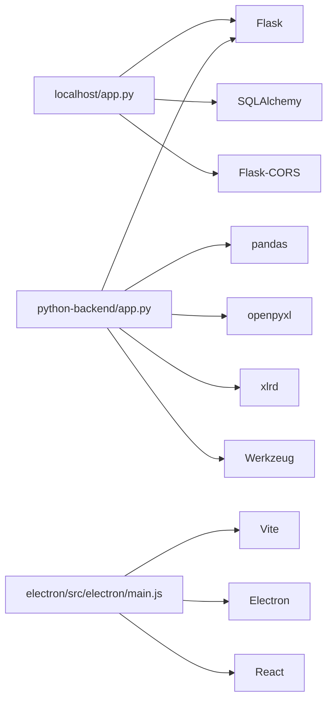

# Local Development Server

<cite>
**Referenced Files in This Document**
- [localhost/app.py](file://localhost/app.py)
- [localhost/cli_functions.py](file://localhost/cli_functions.py)
- [python-backend/app.py](file://python-backend/app.py)
- [python-backend/requirements.txt](file://python-backend/requirements.txt)
- [electron/src/electron/main.js](file://electron/src/electron/main.js)
- [electron/package.json](file://electron/package.json)
- [electron/src/electron/utils.js](file://electron/src/electron/utils.js)
- [python-backend/extract_contacts.py](file://python-backend/extract_contacts.py)
- [python-backend/parse_manual_numbers.py](file://python-backend/parse_manual_numbers.py)
- [python-backend/validate_number.py](file://python-backend/validate_number.py)
- [README.md](file://README.md)
</cite>

## Table of Contents
1. [Introduction](#introduction)
2. [Project Structure](#project-structure)
3. [Core Components](#core-components)
4. [Architecture Overview](#architecture-overview)
5. [Detailed Component Analysis](#detailed-component-analysis)
6. [Dependency Analysis](#dependency-analysis)
7. [Performance Considerations](#performance-considerations)
8. [Troubleshooting Guide](#troubleshooting-guide)
9. [Conclusion](#conclusion)
10. [Appendices](#appendices)

## Introduction
This document explains the local development server implementation and command-line interface functions for the project. It covers:
- Flask development server configuration with debug mode, host binding, and port settings
- CLI functions for local testing and development workflows
- Development environment setup, including dependency installation and server startup procedures
- Examples of local API testing, development workflow integration, and debugging techniques
- The relationship between local development server and production deployment
- Common development issues, environment variable configuration, and performance considerations for local testing

## Project Structure
The project includes two local development servers and a set of Python utilities:
- A Flask-based local development server for user management and file upload workflows
- A separate Flask-based Python backend service for contact processing and validation
- Electron main process that launches a React/Vite dev server and integrates with the Python backend
- Python utilities for contact extraction, manual number parsing, and phone number validation

**Diagram sources**
- [electron/src/electron/main.js](file://electron/src/electron/main.js#L34-L50)
- [electron/src/electron/utils.js](file://electron/src/electron/utils.js#L3-L5)
- [electron/package.json](file://electron/package.json#L7-L19)
- [localhost/app.py](file://localhost/app.py#L305-L306)
- [python-backend/app.py](file://python-backend/app.py#L372-L377)
- [python-backend/requirements.txt](file://python-backend/requirements.txt#L1-L7)
- [python-backend/extract_contacts.py](file://python-backend/extract_contacts.py#L160-L177)
- [python-backend/parse_manual_numbers.py](file://python-backend/parse_manual_numbers.py#L57-L61)
- [python-backend/validate_number.py](file://python-backend/validate_number.py#L22-L27)

**Section sources**
- [README.md](file://README.md#L198-L236)
- [electron/src/electron/main.js](file://electron/src/electron/main.js#L34-L50)
- [localhost/app.py](file://localhost/app.py#L305-L306)
- [python-backend/app.py](file://python-backend/app.py#L372-L377)

## Core Components
- Local Flask development server (localhost/app.py): Provides HTML forms and JSON APIs for user registration/login, dynamic table creation, and file upload handling. It runs with debug mode enabled.
- Python backend Flask service (python-backend/app.py): Offers health checks, file upload processing, contact extraction from CSV/Excel/TXT, manual number parsing, and phone number validation. It binds to host 0.0.0.0 and port 5034.
- Electron main process (electron/src/electron/main.js): Launches the React/Vite dev server at http://localhost:5173 in development mode and loads the Electron window accordingly.
- Python utilities: Standalone scripts for extracting contacts, parsing manual numbers, and validating phone numbers.

Key configuration highlights:
- Local dev server: debug=True, default host/port unspecified (Flask defaults)
- Python backend: debug=True, host="0.0.0.0", port=5034
- Electron dev server: Vite dev server at http://localhost:5173

**Section sources**
- [localhost/app.py](file://localhost/app.py#L305-L306)
- [python-backend/app.py](file://python-backend/app.py#L372-L377)
- [electron/src/electron/main.js](file://electron/src/electron/main.js#L34-L50)
- [electron/package.json](file://electron/package.json#L7-L19)

## Architecture Overview
The local development architecture integrates Electron, a React/Vite dev server, and two Flask services:
- Electron main process detects development mode and loads the React dev server URL
- The local Flask server handles user and file operations for the legacy UI
- The Python backend Flask service exposes REST endpoints for contact processing and validation
- Python utilities can be invoked directly for offline testing

**Diagram sources**
- [electron/src/electron/main.js](file://electron/src/electron/main.js#L34-L50)
- [localhost/app.py](file://localhost/app.py#L46-L124)
- [python-backend/app.py](file://python-backend/app.py#L225-L280)

## Detailed Component Analysis

### Local Flask Development Server (localhost/app.py)
- Purpose: Legacy UI and file upload workflows with user management and dynamic table creation
- Flask configuration:
  - Debug mode enabled
  - SQLite database configured
  - CORS enabled for all routes
- Routes:
  - HTML forms for login/signup and file upload
  - JSON APIs for login/signup, table loading, file upload, and table selection
- Data model: User table with JSON field for dynamic tables
- File upload handling: Validates allowed extensions and saves uploads

**Diagram sources**
- [localhost/app.py](file://localhost/app.py#L46-L76)

**Section sources**
- [localhost/app.py](file://localhost/app.py#L10-L306)

### Python Backend Flask Service (python-backend/app.py)
- Purpose: REST API for contact processing and validation
- Flask configuration:
  - Debug mode enabled
  - Host bound to 0.0.0.0
  - Port set to 5034
  - Upload folder configured with allowed file types and size limit
- Endpoints:
  - GET /health: Health check
  - POST /upload: Upload and process CSV/Excel/TXT files
  - POST /parse-manual-numbers: Parse manual number entries
  - POST /validate-number: Validate a single phone number
- Utilities:
  - Phone number cleaning and normalization
  - Contact extraction from multiple file formats
  - Error handling and cleanup

**Diagram sources**
- [python-backend/app.py](file://python-backend/app.py#L232-L280)

**Section sources**
- [python-backend/app.py](file://python-backend/app.py#L10-L377)

### Electron Development Server Integration
- Development mode detection via environment variable
- Loads React/Vite dev server at http://localhost:5173
- Enables DevTools in development
- Integrates with both local Flask and Python backend services

**Diagram sources**
- [electron/src/electron/main.js](file://electron/src/electron/main.js#L34-L50)
- [electron/src/electron/utils.js](file://electron/src/electron/utils.js#L3-L5)

**Section sources**
- [electron/src/electron/main.js](file://electron/src/electron/main.js#L34-L50)
- [electron/src/electron/utils.js](file://electron/src/electron/utils.js#L3-L5)
- [electron/package.json](file://electron/package.json#L7-L19)

### Python Utilities (CLI Functions)
- Purpose: Standalone CLI utilities for contact processing and validation
- Functions:
  - Contact extraction from CSV/Excel/TXT
  - Manual number parsing with name/number detection
  - Phone number validation and normalization
- Usage: Run as Python scripts with file arguments or stdin/stdout

**Diagram sources**
- [python-backend/extract_contacts.py](file://python-backend/extract_contacts.py#L160-L177)
- [python-backend/parse_manual_numbers.py](file://python-backend/parse_manual_numbers.py#L57-L61)
- [python-backend/validate_number.py](file://python-backend/validate_number.py#22-L27)

**Section sources**
- [python-backend/extract_contacts.py](file://python-backend/extract_contacts.py#L1-L177)
- [python-backend/parse_manual_numbers.py](file://python-backend/parse_manual_numbers.py#L1-L61)
- [python-backend/validate_number.py](file://python-backend/validate_number.py#L1-L27)

## Dependency Analysis
- Local Flask server depends on:
  - Flask, SQLAlchemy, Flask-CORS, Werkzeug
- Python backend depends on:
  - Flask, Flask-CORS, pandas, openpyxl, xlrd, werkzeug
- Electron dev server depends on:
  - Vite, concurrently, wait-on, electron, react, react-dom

**Diagram sources**
- [localhost/app.py](file://localhost/app.py#L1-L14)
- [python-backend/app.py](file://python-backend/app.py#L1-L11)
- [python-backend/requirements.txt](file://python-backend/requirements.txt#L1-L7)
- [electron/package.json](file://electron/package.json#L20-L47)

**Section sources**
- [localhost/app.py](file://localhost/app.py#L1-L14)
- [python-backend/app.py](file://python-backend/app.py#L1-L11)
- [python-backend/requirements.txt](file://python-backend/requirements.txt#L1-L7)
- [electron/package.json](file://electron/package.json#L20-L47)

## Performance Considerations
- Local Flask server:
  - Uses SQLite in-memory-like persistence; suitable for development
  - File uploads saved to filesystem; ensure adequate disk space
  - Debug mode enabled; avoid enabling in production
- Python backend:
  - Max upload size limited to 16 MB
  - File processing performed synchronously; consider async for heavy loads
  - Phone number cleaning and validation are CPU-bound; batch processing recommended
- Electron dev server:
  - Vite hot reload improves iteration speed
  - Puppeteer headless mode reduces overhead for WhatsApp integration

[No sources needed since this section provides general guidance]

## Troubleshooting Guide
Common development issues and resolutions:
- Local Flask server not starting:
  - Ensure Python dependencies are installed
  - Confirm debug mode is enabled and host/port defaults are acceptable
- Python backend not reachable:
  - Verify host binding to 0.0.0.0 and port 5034
  - Check firewall and network configuration
- Electron dev server failing to load:
  - Confirm Vite dev server is running at http://localhost:5173
  - Ensure NODE_ENV is set to development
- File upload errors:
  - Validate allowed file types and sizes
  - Check upload directory permissions
- Phone number validation failures:
  - Ensure numbers meet length and format requirements
  - Use the validation endpoint to diagnose issues

**Section sources**
- [python-backend/app.py](file://python-backend/app.py#L17-L21)
- [python-backend/app.py](file://python-backend/app.py#L232-L280)
- [electron/src/electron/main.js](file://electron/src/electron/main.js#L34-L50)
- [python-backend/validate_number.py](file://python-backend/validate_number.py#L6-L19)

## Conclusion
The local development environment combines an Electron-based UI with two Flask services: a legacy local server for user and file operations, and a Python backend for contact processing and validation. Development workflows leverage Vite for rapid UI iteration, while the Python backend provides robust APIs for data preparation. Proper environment configuration and dependency management are essential for smooth local development and testing.

[No sources needed since this section summarizes without analyzing specific files]

## Appendices

### Development Environment Setup
- Install Electron dependencies:
  - Navigate to electron directory and run npm install
- Install Python backend dependencies:
  - Navigate to python-backend directory and run pip install -r requirements.txt
- Start development server:
  - From electron directory, run npm run dev to launch both React/Vite and Electron

**Section sources**
- [README.md](file://README.md#L69-L98)
- [README.md](file://README.md#L240-L274)

### Local API Testing Examples
- Health check:
  - GET http://localhost:5034/health
- Upload and process contacts:
  - POST http://localhost:5034/upload with multipart/form-data
- Parse manual numbers:
  - POST http://localhost:5034/parse-manual-numbers with JSON payload
- Validate phone number:
  - POST http://localhost:5034/validate-number with JSON payload

**Section sources**
- [python-backend/app.py](file://python-backend/app.py#L225-L370)

### Relationship Between Local Development and Production Deployment
- Local development:
  - Electron dev server loads Vite dev server at http://localhost:5173
  - Local Flask server runs with debug mode enabled
  - Python backend runs with debug mode and binds to 0.0.0.0:5034
- Production deployment:
  - Electron builds static assets and runs packaged app
  - Python backend can be deployed behind a reverse proxy or containerized
  - Local Flask server is intended for development and should not be used in production

**Section sources**
- [electron/src/electron/main.js](file://electron/src/electron/main.js#L34-L50)
- [python-backend/app.py](file://python-backend/app.py#L372-L377)
- [localhost/app.py](file://localhost/app.py#L305-L306)

### Environment Variable Configuration
- Electron development:
  - NODE_ENV=development enables dev server loading
- Python backend:
  - No explicit environment variables required; configure host/port in app.run()

**Section sources**
- [electron/src/electron/utils.js](file://electron/src/electron/utils.js#L3-L5)
- [python-backend/app.py](file://python-backend/app.py#L372-L377)