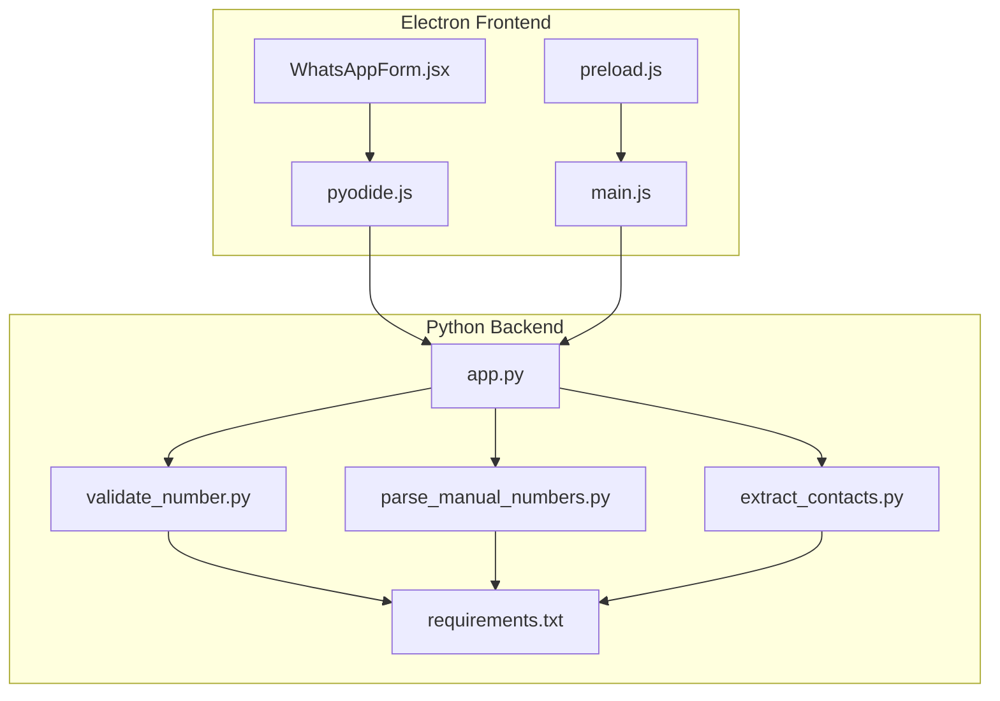
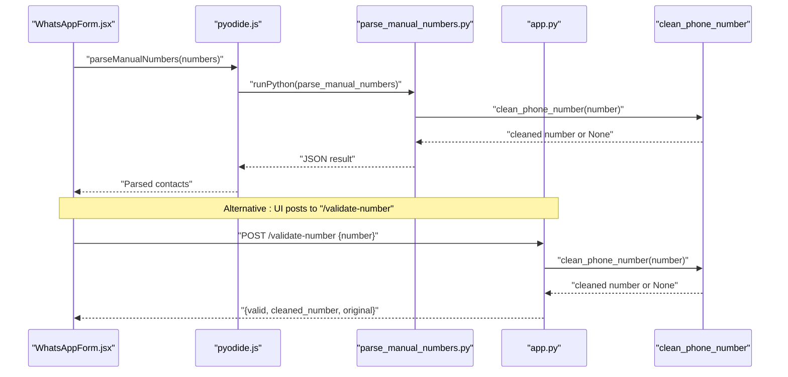
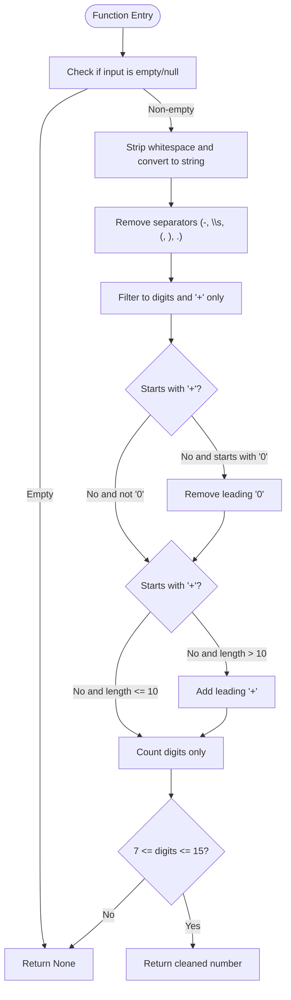
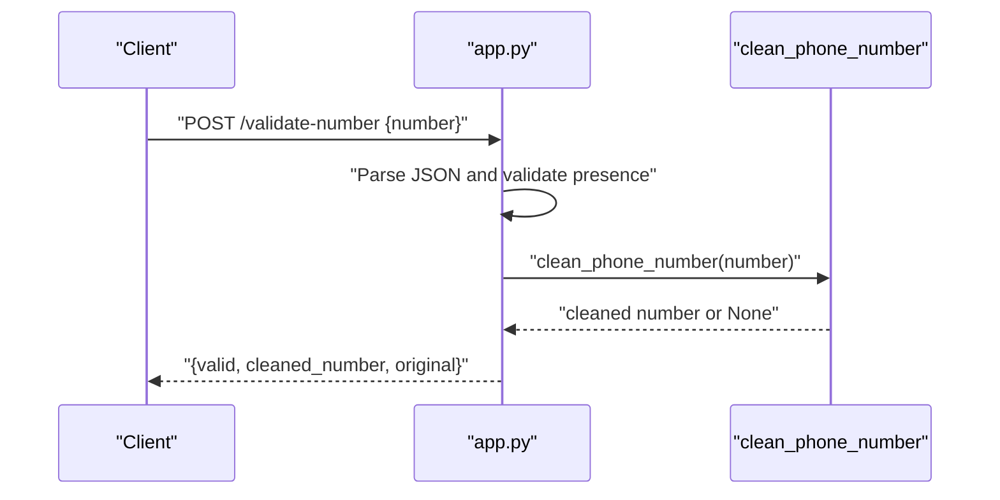
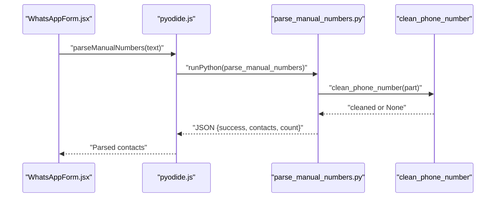
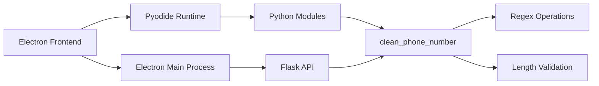

# Phone Number Validation

<cite>
**Referenced Files in This Document**
- [validate_number.py](file://python-backend/validate_number.py)
- [parse_manual_numbers.py](file://python-backend/parse_manual_numbers.py)
- [app.py](file://python-backend/app.py)
- [extract_contacts.py](file://python-backend/extract_contacts.py)
- [pyodide.js](file://electron/src/utils/pyodide.js)
- [WhatsAppForm.jsx](file://electron/src/components/WhatsAppForm.jsx)
- [main.js](file://electron/src/electron/main.js)
- [preload.js](file://electron/src/electron/preload.js)
- [requirements.txt](file://python-backend/requirements.txt)
</cite>

## Table of Contents
1. [Introduction](#introduction)
2. [Project Structure](#project-structure)
3. [Core Components](#core-components)
4. [Architecture Overview](#architecture-overview)
5. [Detailed Component Analysis](#detailed-component-analysis)
6. [Dependency Analysis](#dependency-analysis)
7. [Performance Considerations](#performance-considerations)
8. [Troubleshooting Guide](#troubleshooting-guide)
9. [Conclusion](#conclusion)

## Introduction
This document explains the phone number validation and cleaning logic used across the application. It focuses on the clean_phone_number function that standardizes phone numbers by removing non-digit characters except plus signs, handling international number formatting, and validating length constraints (minimum 7, maximum 15 digits). It also documents the regex-based cleaning process, validation criteria, supported formats, and integration with the validation API endpoint and error handling strategies.

## Project Structure
The phone number validation spans two layers:
- Python backend service that exposes validation and parsing endpoints
- Electron frontend that integrates with the backend and Pyodide for manual number parsing

**Diagram sources**
- [app.py](file://python-backend/app.py#L1-L378)
- [validate_number.py](file://python-backend/validate_number.py#L1-L27)
- [parse_manual_numbers.py](file://python-backend/parse_manual_numbers.py#L1-L61)
- [extract_contacts.py](file://python-backend/extract_contacts.py#L1-L177)
- [pyodide.js](file://electron/src/utils/pyodide.js#L1-L33)
- [WhatsAppForm.jsx](file://electron/src/components/WhatsAppForm.jsx#L1-L609)
- [main.js](file://electron/src/electron/main.js#L1-L371)
- [preload.js](file://electron/src/electron/preload.js#L1-L41)
- [requirements.txt](file://python-backend/requirements.txt#L1-L7)

**Section sources**
- [app.py](file://python-backend/app.py#L1-L378)
- [validate_number.py](file://python-backend/validate_number.py#L1-L27)
- [parse_manual_numbers.py](file://python-backend/parse_manual_numbers.py#L1-L61)
- [extract_contacts.py](file://python-backend/extract_contacts.py#L1-L177)
- [pyodide.js](file://electron/src/utils/pyodide.js#L1-L33)
- [WhatsAppForm.jsx](file://electron/src/components/WhatsAppForm.jsx#L1-L609)
- [main.js](file://electron/src/electron/main.js#L1-L371)
- [preload.js](file://electron/src/electron/preload.js#L1-L41)
- [requirements.txt](file://python-backend/requirements.txt#L1-L7)

## Core Components
- clean_phone_number: The core function that cleans and validates phone numbers according to the specified rules.
- Validation API endpoint: Exposes POST /validate-number to validate a single phone number.
- Manual number parser: Parses manually entered phone numbers with optional names and applies the same cleaning logic.
- Contact extraction utilities: Provide clean_phone_number for CSV, TXT, and Excel files.

Key behaviors:
- Removes separators and spaces: hyphens, spaces, parentheses, dots
- Keeps digits and plus signs
- Strips leading zeros when not international
- Adds a leading plus for long numbers that look international
- Validates digit count between 7 and 15

**Section sources**
- [validate_number.py](file://python-backend/validate_number.py#L6-L19)
- [app.py](file://python-backend/app.py#L28-L56)
- [parse_manual_numbers.py](file://python-backend/parse_manual_numbers.py#L6-L19)
- [extract_contacts.py](file://python-backend/extract_contacts.py#L9-L22)

## Architecture Overview
The validation pipeline integrates the frontend and backend as follows:
- Frontend collects manual numbers and invokes Pyodide to run Python parsing
- Alternatively, the backend exposes a validation endpoint for external clients
- Both paths converge on the same clean_phone_number logic

**Diagram sources**
- [WhatsAppForm.jsx](file://electron/src/components/WhatsAppForm.jsx#L41-L62)
- [pyodide.js](file://electron/src/utils/pyodide.js#L26-L33)
- [parse_manual_numbers.py](file://python-backend/parse_manual_numbers.py#L22-L54)
- [app.py](file://python-backend/app.py#L343-L369)
- [validate_number.py](file://python-backend/validate_number.py#L6-L19)

## Detailed Component Analysis

### clean_phone_number Implementation
The function performs a series of regex-based transformations and validations:
- Input sanitization: strip whitespace and coerce to string
- Separator removal: remove hyphens, spaces, parentheses, dots
- Character filtering: keep only digits and plus signs
- Leading zero handling: strip leading zeros unless international
- International prefix injection: add plus for long numbers that look international
- Length validation: ensure digit count is between 7 and 15

**Diagram sources**
- [validate_number.py](file://python-backend/validate_number.py#L6-L19)
- [app.py](file://python-backend/app.py#L28-L56)
- [parse_manual_numbers.py](file://python-backend/parse_manual_numbers.py#L6-L19)
- [extract_contacts.py](file://python-backend/extract_contacts.py#L9-L22)

**Section sources**
- [validate_number.py](file://python-backend/validate_number.py#L6-L19)
- [app.py](file://python-backend/app.py#L28-L56)
- [parse_manual_numbers.py](file://python-backend/parse_manual_numbers.py#L6-L19)
- [extract_contacts.py](file://python-backend/extract_contacts.py#L9-L22)

### Validation API Endpoint
The backend exposes a POST endpoint to validate a single phone number:
- Request: JSON body with "number"
- Response: JSON with "valid", "cleaned_number", and "original"
- Error handling: returns 400 for missing number, 500 for exceptions

**Diagram sources**
- [app.py](file://python-backend/app.py#L343-L369)

**Section sources**
- [app.py](file://python-backend/app.py#L343-L369)

### Manual Number Parsing Integration
The Electron frontend uses Pyodide to run Python parsing for manual numbers:
- The frontend calls parseManualNumbers which loads Pyodide and executes parse_manual_numbers.py
- The Python module applies clean_phone_number to each candidate and returns structured results

**Diagram sources**
- [WhatsAppForm.jsx](file://electron/src/components/WhatsAppForm.jsx#L41-L62)
- [pyodide.js](file://electron/src/utils/pyodide.js#L26-L33)
- [parse_manual_numbers.py](file://python-backend/parse_manual_numbers.py#L22-L54)

**Section sources**
- [WhatsAppForm.jsx](file://electron/src/components/WhatsAppForm.jsx#L41-L62)
- [pyodide.js](file://electron/src/utils/pyodide.js#L26-L33)
- [parse_manual_numbers.py](file://python-backend/parse_manual_numbers.py#L22-L54)

### Contact Extraction Utilities
The backend provides utilities to extract contacts from various file formats. Each utility uses the shared clean_phone_number function to normalize numbers before returning structured contact data.

**Section sources**
- [app.py](file://python-backend/app.py#L58-L125)
- [app.py](file://python-backend/app.py#L128-L175)
- [app.py](file://python-backend/app.py#L178-L222)
- [extract_contacts.py](file://python-backend/extract_contacts.py#L25-L81)
- [extract_contacts.py](file://python-backend/extract_contacts.py#L84-L118)
- [extract_contacts.py](file://python-backend/extract_contacts.py#L121-L157)

## Dependency Analysis
- Python backend depends on Flask, CORS, pandas, openpyxl, xlrd, and werkzeug
- The frontend uses Pyodide to execute Python code in the browser for manual number parsing
- The Electron main process handles IPC communication with the renderer process

**Diagram sources**
- [requirements.txt](file://python-backend/requirements.txt#L1-L7)
- [pyodide.js](file://electron/src/utils/pyodide.js#L1-L33)
- [main.js](file://electron/src/electron/main.js#L1-L371)
- [app.py](file://python-backend/app.py#L1-L378)
- [validate_number.py](file://python-backend/validate_number.py#L1-L27)

**Section sources**
- [requirements.txt](file://python-backend/requirements.txt#L1-L7)
- [pyodide.js](file://electron/src/utils/pyodide.js#L1-L33)
- [main.js](file://electron/src/electron/main.js#L1-L371)
- [app.py](file://python-backend/app.py#L1-L378)
- [validate_number.py](file://python-backend/validate_number.py#L1-L27)

## Performance Considerations
- Regex operations are linear in input length; the function performs a small fixed number of passes
- Length checks are O(1) after digit extraction
- For large datasets, prefer batch processing via file uploads rather than repeated API calls
- Consider caching cleaned numbers if the same numbers are processed multiple times

## Troubleshooting Guide
Common validation failures and causes:
- Too short or too long: numbers with fewer than 7 or more than 15 digits after cleaning
- Invalid characters: presence of non-digit characters besides plus signs after cleaning
- Ambiguous international format: numbers starting with 0 and fewer than 11 digits are treated as national and leading zeros are stripped

Integration tips:
- When using the validation endpoint, ensure the request body contains a "number" field
- When parsing manual numbers, separate name and number with colon or dash; the system attempts to detect which part is the number
- If Pyodide fails to load, verify network connectivity and that the Python script path is correct

**Section sources**
- [app.py](file://python-backend/app.py#L343-L369)
- [parse_manual_numbers.py](file://python-backend/parse_manual_numbers.py#L22-L54)
- [pyodide.js](file://electron/src/utils/pyodide.js#L1-L33)

## Conclusion
The phone number validation and cleaning logic is centralized in clean_phone_number, which is reused across the backend endpoints and frontend Pyodide integration. It provides robust normalization and validation with clear constraints, enabling reliable downstream processing for mass messaging workflows.