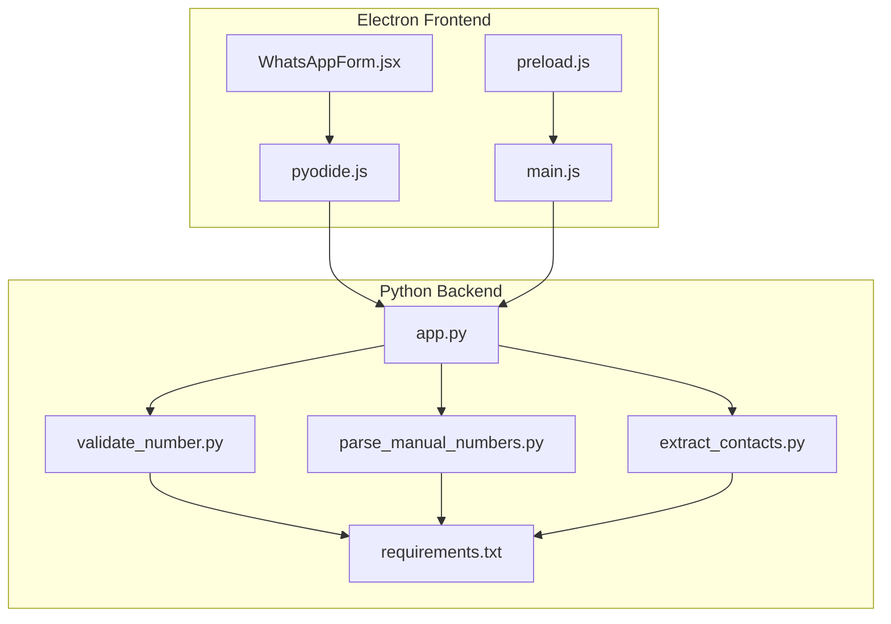
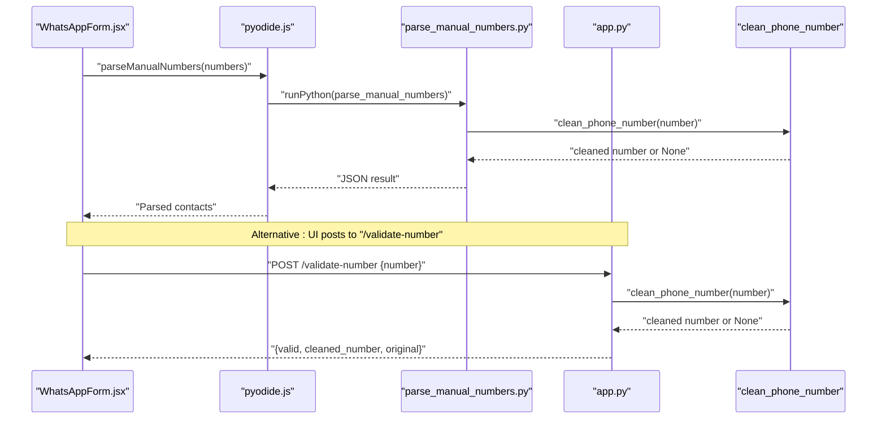
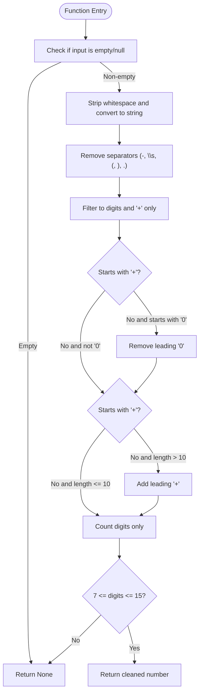
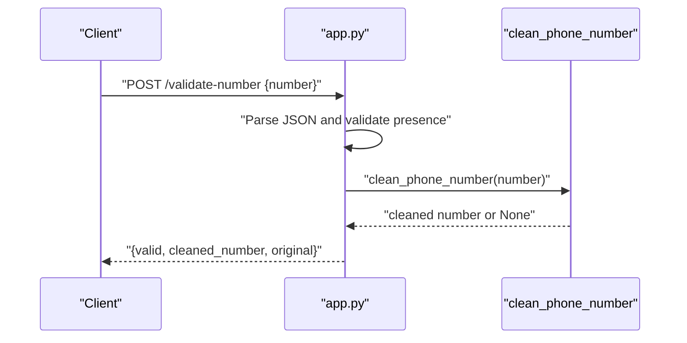
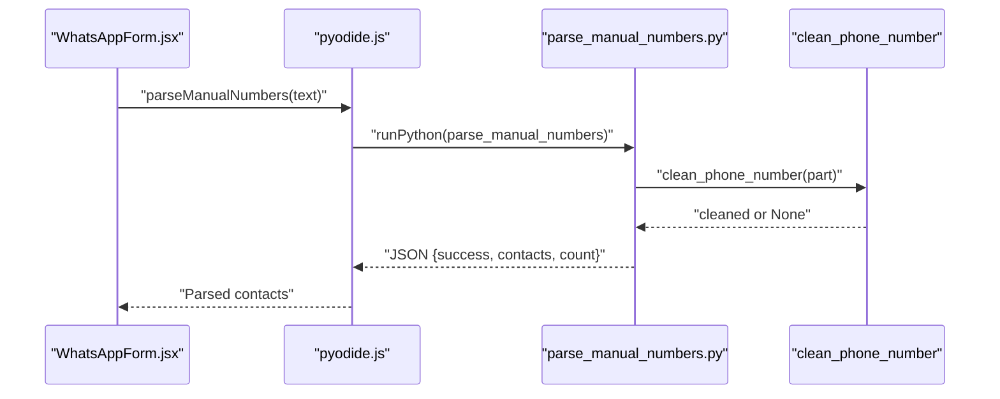
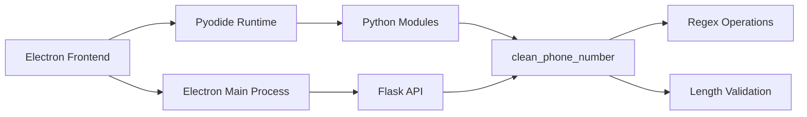

# Phone number validation

## Introduction
This page explains the phone number validation and cleaning logic used across the application. It focuses on the clean_phone_number function that standardizes phone numbers by removing non-digit characters except plus signs, handling international number formatting, and validating length constraints (minimum 7, maximum 15 digits). It also documents the regex-based cleaning process, validation criteria, supported formats, and integration with the validation API endpoint and error handling strategies.

## Project structure
The phone number validation spans two layers:
- Python backend service that exposes validation and parsing endpoints
- Electron frontend that integrates with the backend and Pyodide for manual number parsing

```mermaid
graph TB
subgraph "Electron Frontend"
FE_UI["WhatsAppForm.jsx"]
FE_PY["pyodide.js"]
FE_MAIN["main.js"]
FE_PRELOAD["preload.js"]
end
subgraph "Python Backend"
BE_APP["app.py"]
BE_VALIDATE["validate_number.py"]
BE_PARSE["parse_manual_numbers.py"]
BE_EXTRACT["extract_contacts.py"]
BE_REQ["requirements.txt"]
end
FE_UI --> FE_PY
FE_PY --> BE_APP
FE_MAIN --> BE_APP
FE_PRELOAD --> FE_MAIN
BE_APP --> BE_VALIDATE
BE_APP --> BE_PARSE
BE_APP --> BE_EXTRACT
BE_VALIDATE --> BE_REQ
BE_PARSE --> BE_REQ
BE_EXTRACT --> BE_REQ
```

## Core components
- clean_phone_number: The core function that cleans and validates phone numbers according to the specified rules.
- Validation API endpoint: Exposes POST /validate-number to validate a single phone number.
- Manual number parser: Parses manually entered phone numbers with optional names and applies the same cleaning logic.
- Contact extraction utilities: Provide clean_phone_number for CSV, TXT, and Excel files.

Key behaviors:
- Removes separators and spaces: hyphens, spaces, parentheses, dots
- Keeps digits and plus signs
- Strips leading zeros when not international
- Adds a leading plus for long numbers that look international
- Validates digit count between 7 and 15

## Architecture overview
The validation pipeline integrates the frontend and backend as follows:
- Frontend collects manual numbers and invokes Pyodide to run Python parsing
- Alternatively, the backend exposes a validation endpoint for external clients
- Both paths converge on the same clean_phone_number logic

```mermaid
sequenceDiagram
participant UI as "WhatsAppForm.jsx"
participant PY as "pyodide.js"
participant PYMOD as "parse_manual_numbers.py"
participant API as "app.py"
participant CLEAN as "clean_phone_number"
UI->>PY : "parseManualNumbers(numbers)"
PY->>PYMOD : "runPython(parse_manual_numbers)"
PYMOD->>CLEAN : "clean_phone_number(number)"
CLEAN-->>PYMOD : "cleaned number or None"
PYMOD-->>PY : "JSON result"
PY-->>UI : "Parsed contacts"
Note over UI,API : Alternative : UI posts to "/validate-number"
UI->>API : "POST /validate-number {number}"
API->>CLEAN : "clean_phone_number(number)"
CLEAN-->>API : "cleaned number or None"
API-->>UI : "{valid, cleaned_number, original}"
```

## Detailed component analysis

### clean_phone_number implementation
The function performs a series of regex-based transformations and validations:
- Input sanitization: strip whitespace and coerce to string
- Separator removal: remove hyphens, spaces, parentheses, dots
- Character filtering: keep only digits and plus signs
- Leading zero handling: strip leading zeros unless international
- International prefix injection: add plus for long numbers that look international
- Length validation: ensure digit count is between 7 and 15

```mermaid
flowchart TD
Start(["Function Entry"]) --> CheckEmpty["Check if input is empty/null"]
CheckEmpty --> |Empty| ReturnNone["Return None"]
CheckEmpty --> |Non-empty| Strip["Strip whitespace and convert to string"]
Strip --> RemoveSeparators["Remove separators (-, \\s, (, ), .)"]
RemoveSeparators --> FilterChars["Filter to digits and '+' only"]
FilterChars --> LeadingZero{"Starts with '+'?"}
LeadingZero --> |No and starts with '0'| StripZero["Remove leading '0'"]
LeadingZero --> |No and not '0'| CheckLength{"Starts with '+'?"}
StripZero --> CheckLength
CheckLength --> |No and length > 10| AddPlus["Add leading '+'"]
CheckLength --> |No and length <= 10| ValidateDigits["Count digits only"]
AddPlus --> ValidateDigits
ValidateDigits --> RangeCheck{"7 <= digits <= 15?"}
RangeCheck --> |No| ReturnNone
RangeCheck --> |Yes| ReturnCleaned["Return cleaned number"]
```

### Validation API endpoint
The backend exposes a POST endpoint to validate a single phone number:
- Request: JSON body with "number"
- Response: JSON with "valid", "cleaned_number", and "original"
- Error handling: returns 400 for missing number, 500 for exceptions

```mermaid
sequenceDiagram
participant Client as "Client"
participant API as "app.py"
participant CLEAN as "clean_phone_number"
Client->>API : "POST /validate-number {number}"
API->>API : "Parse JSON and validate presence"
API->>CLEAN : "clean_phone_number(number)"
CLEAN-->>API : "cleaned number or None"
API-->>Client : "{valid, cleaned_number, original}"
```

### Manual number parsing integration
The Electron frontend uses Pyodide to run Python parsing for manual numbers:
- The frontend calls parseManualNumbers which loads Pyodide and executes parse_manual_numbers.py
- The Python module applies clean_phone_number to each candidate and returns structured results

```mermaid
sequenceDiagram
participant UI as "WhatsAppForm.jsx"
participant PY as "pyodide.js"
participant MOD as "parse_manual_numbers.py"
participant CLEAN as "clean_phone_number"
UI->>PY : "parseManualNumbers(text)"
PY->>MOD : "runPython(parse_manual_numbers)"
MOD->>CLEAN : "clean_phone_number(part)"
CLEAN-->>MOD : "cleaned or None"
MOD-->>PY : "JSON {success, contacts, count}"
PY-->>UI : "Parsed contacts"
```

### Contact extraction utilities
The backend provides utilities to extract contacts from various file formats. Each utility uses the shared clean_phone_number function to normalize numbers before returning structured contact data.

## Dependency analysis
- Python backend depends on Flask, CORS, pandas, openpyxl, xlrd, and werkzeug
- The frontend uses Pyodide to execute Python code in the browser for manual number parsing
- The Electron main process handles IPC communication with the renderer process

```mermaid
graph LR
FE["Electron Frontend"] --> PY["Pyodide Runtime"]
PY --> PYMOD["Python Modules"]
FE --> MAIN["Electron Main Process"]
MAIN --> API["Flask API"]
PYMOD --> CLEAN["clean_phone_number"]
API --> CLEAN
CLEAN --> RE["Regex Operations"]
CLEAN --> LEN["Length Validation"]
```

## Performance considerations
- Regex operations are linear in input length; the function performs a small fixed number of passes
- Length checks are O(1) after digit extraction
- For large datasets, prefer batch processing via file uploads rather than repeated API calls
- Consider caching cleaned numbers if the same numbers are processed multiple times

## Troubleshooting guide
Common validation failures and causes:
- Too short or too long: numbers with fewer than 7 or more than 15 digits after cleaning
- Invalid characters: presence of non-digit characters besides plus signs after cleaning
- Ambiguous international format: numbers starting with 0 and fewer than 11 digits are treated as national and leading zeros are stripped

Integration tips:
- When using the validation endpoint, ensure the request body contains a "number" field
- When parsing manual numbers, separate name and number with colon or dash; the system attempts to detect which part is the number
- If Pyodide fails to load, verify network connectivity and that the Python script path is correct

## Conclusion
The phone number validation and cleaning logic is centralized in clean_phone_number, which is reused across the backend endpoints and frontend Pyodide integration. It provides reliable normalization and validation with clear constraints, enabling reliable downstream processing for mass messaging workflows.
