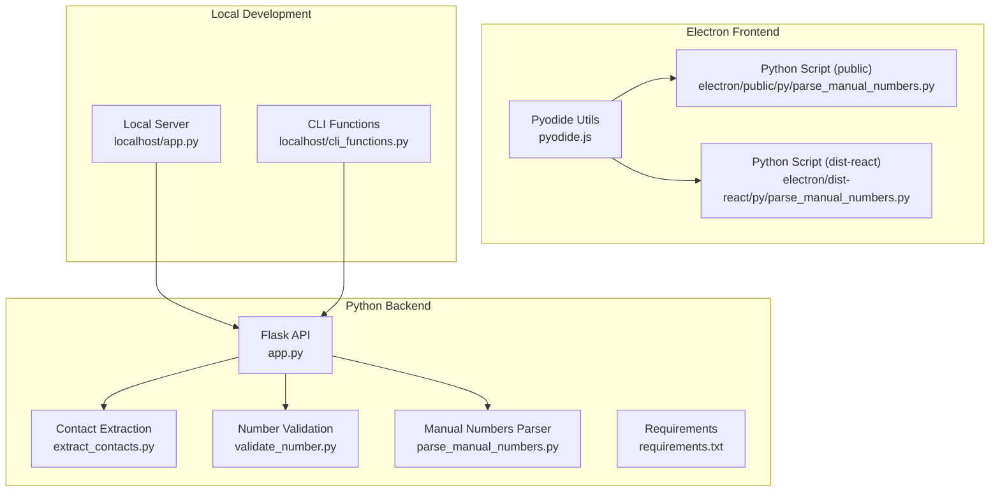
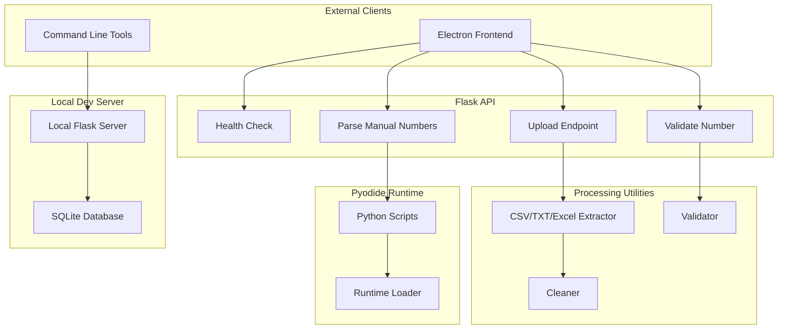
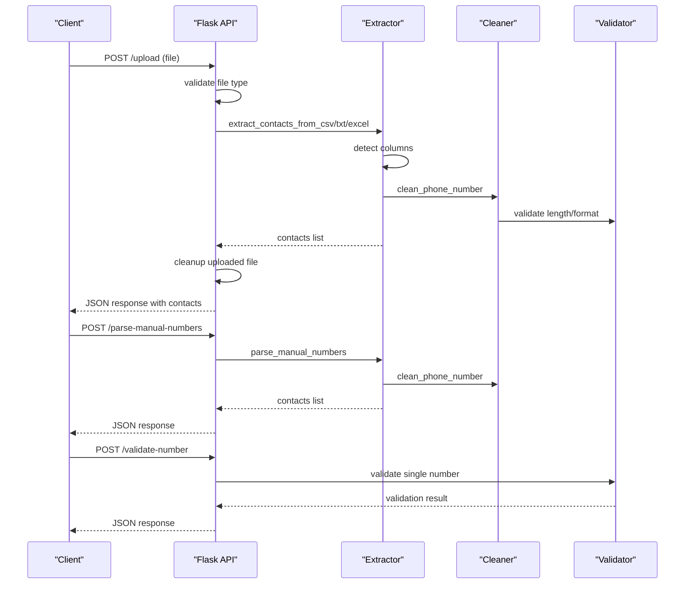
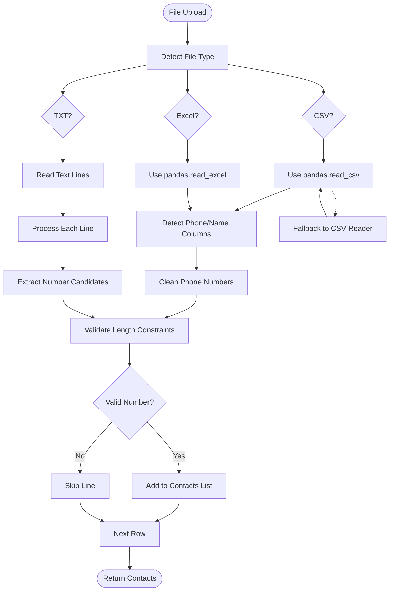
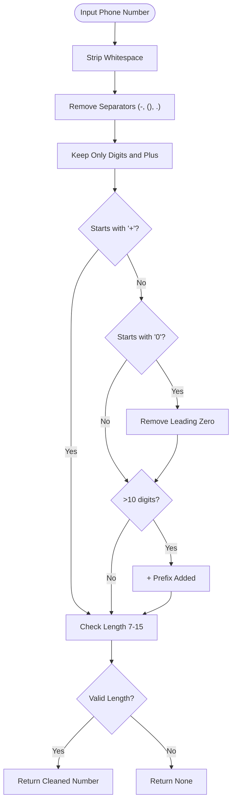
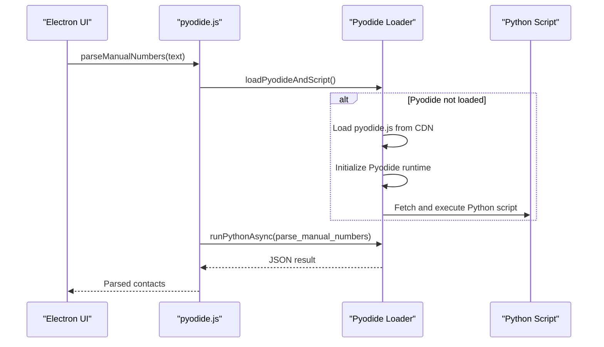
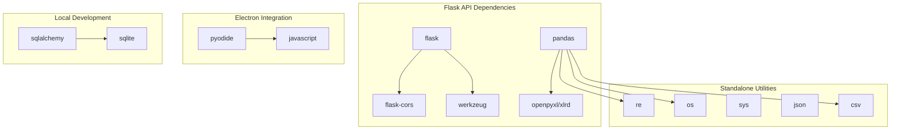

# Python Backend Services

<cite>
**Referenced Files in This Document**
- [app.py](file://python-backend/app.py)
- [extract_contacts.py](file://python-backend/extract_contacts.py)
- [validate_number.py](file://python-backend/validate_number.py)
- [parse_manual_numbers.py](file://python-backend/parse_manual_numbers.py)
- [requirements.txt](file://python-backend/requirements.txt)
- [README.md](file://python-backend/README.md)
- [pyodide.js](file://electron/src/utils/pyodide.js)
- [parse_manual_numbers.py](file://electron/public/py/parse_manual_numbers.py)
- [parse_manual_numbers.py](file://electron/dist-react/py/parse_manual_numbers.py)
- [cli_functions.py](file://localhost/cli_functions.py)
- [app.py](file://localhost/app.py)
- [README.md](file://README.md)
</cite>

## Table of Contents
1. [Introduction](#introduction)
2. [Project Structure](#project-structure)
3. [Core Components](#core-components)
4. [Architecture Overview](#architecture-overview)
5. [Detailed Component Analysis](#detailed-component-analysis)
6. [Dependency Analysis](#dependency-analysis)
7. [Performance Considerations](#performance-considerations)
8. [Troubleshooting Guide](#troubleshooting-guide)
9. [Security Considerations](#security-considerations)
10. [Conclusion](#conclusion)

## Introduction
This document provides comprehensive documentation for the Python backend services and utilities that power contact processing and validation in the WhatsApp bulk messaging system. The backend consists of a Flask-based API for file uploads and phone number validation, along with standalone utilities for extracting contacts from CSV, TXT, and Excel files, validating individual phone numbers, and parsing manually entered numbers. It also covers integration with the Pyodide runtime for browser-based Python execution within the Electron application, local development server implementation, and command-line interface functions.

The backend is designed to:
- Support multiple file formats with automatic format detection
- Extract and clean phone numbers with flexible international formatting
- Provide robust error handling and fallback parsing
- Integrate seamlessly with the Electron frontend via Pyodide
- Offer a lightweight local development server for testing and validation

## Project Structure
The Python backend is organized into modular components:
- Flask API server for contact processing and validation
- Standalone utilities for file-based and manual number parsing
- Pyodide integration for browser-based Python execution
- Local development server and CLI functions for testing

**Diagram sources**
- [app.py](file://python-backend/app.py#L1-L378)
- [extract_contacts.py](file://python-backend/extract_contacts.py#L1-L177)
- [validate_number.py](file://python-backend/validate_number.py#L1-L27)
- [parse_manual_numbers.py](file://python-backend/parse_manual_numbers.py#L1-L61)
- [requirements.txt](file://python-backend/requirements.txt#L1-L7)
- [pyodide.js](file://electron/src/utils/pyodide.js#L1-L33)
- [parse_manual_numbers.py](file://electron/public/py/parse_manual_numbers.py#L1-L61)
- [parse_manual_numbers.py](file://electron/dist-react/py/parse_manual_numbers.py#L1-L61)
- [app.py](file://localhost/app.py#L1-L306)
- [cli_functions.py](file://localhost/cli_functions.py#L1-L360)

**Section sources**
- [README.md](file://README.md#L223-L236)
- [README.md](file://python-backend/README.md#L1-L128)

## Core Components
This section outlines the primary backend components and their responsibilities.

- Flask API server
  - Provides endpoints for health checks, file uploads, manual number parsing, and phone number validation
  - Implements file type validation, secure filename handling, and cleanup of uploaded files
  - Uses pandas for CSV and Excel parsing with fallback to pure Python parsing

- Contact extraction utilities
  - Extracts contacts from CSV, TXT, and Excel files
  - Detects phone number and name columns automatically
  - Cleans and standardizes phone numbers with flexible international formatting

- Phone number validation utility
  - Validates and cleans individual phone numbers
  - Enforces length constraints and international formatting rules

- Manual numbers parser
  - Parses manually entered phone numbers with optional names
  - Supports multiple input formats and separators

- Pyodide integration
  - Loads Pyodide runtime and executes Python scripts in the browser
  - Enables manual number parsing directly from the Electron UI

- Local development server and CLI functions
  - Provides a local Flask server for development and testing
  - Offers CLI functions for sending WhatsApp messages and managing contacts

**Section sources**
- [app.py](file://python-backend/app.py#L225-L378)
- [extract_contacts.py](file://python-backend/extract_contacts.py#L25-L157)
- [validate_number.py](file://python-backend/validate_number.py#L6-L19)
- [parse_manual_numbers.py](file://python-backend/parse_manual_numbers.py#L22-L54)
- [pyodide.js](file://electron/src/utils/pyodide.js#L5-L33)
- [app.py](file://localhost/app.py#L1-L306)
- [cli_functions.py](file://localhost/cli_functions.py#L1-L360)

## Architecture Overview
The backend architecture follows a layered design:
- Presentation layer: Flask API endpoints
- Processing layer: Contact extraction and validation utilities
- Integration layer: Pyodide runtime for browser-based Python execution
- Persistence layer: SQLite database for user management (local development server)

**Diagram sources**
- [app.py](file://python-backend/app.py#L225-L378)
- [extract_contacts.py](file://python-backend/extract_contacts.py#L25-L157)
- [validate_number.py](file://python-backend/validate_number.py#L6-L19)
- [parse_manual_numbers.py](file://python-backend/parse_manual_numbers.py#L22-L54)
- [pyodide.js](file://electron/src/utils/pyodide.js#L5-L33)
- [app.py](file://localhost/app.py#L1-L306)

## Detailed Component Analysis

### Flask API Implementation
The Flask API provides four main endpoints:
- Health check endpoint for monitoring
- File upload endpoint for CSV, TXT, XLSX, and XLS files
- Manual numbers parsing endpoint
- Single number validation endpoint

Key implementation details:
- CORS is enabled for cross-origin requests
- File upload handling with secure filename validation
- Automatic file type detection and processing
- Cleanup of uploaded files after processing
- Comprehensive error handling with appropriate HTTP status codes

**Diagram sources**
- [app.py](file://python-backend/app.py#L232-L378)
- [extract_contacts.py](file://python-backend/extract_contacts.py#L25-L157)
- [validate_number.py](file://python-backend/validate_number.py#L6-L19)
- [parse_manual_numbers.py](file://python-backend/parse_manual_numbers.py#L22-L54)

**Section sources**
- [app.py](file://python-backend/app.py#L225-L378)

### Contact Extraction Utilities
The contact extraction utilities support three file formats with automatic format detection:

#### CSV Processing
- Uses pandas for efficient CSV reading
- Automatically detects phone number and name columns based on header keywords
- Falls back to pure Python CSV reader for malformed files
- Handles UTF-8 encoding and various separator formats

#### TXT Processing
- Processes plain text files with flexible formatting
- Splits lines by common separators (comma, semicolon, tab, pipe)
- Attempts to identify phone numbers using regex patterns
- Extracts names from the remaining parts of each line

#### Excel Processing
- Supports both .xlsx and .xls formats via pandas
- Automatically detects column headers for phone numbers and names
- Handles missing values and NaN entries gracefully

**Diagram sources**
- [extract_contacts.py](file://python-backend/extract_contacts.py#L25-L157)

**Section sources**
- [extract_contacts.py](file://python-backend/extract_contacts.py#L25-L157)

### Phone Number Validation Logic
The phone number validation logic implements the following rules:
- Removes all non-digit characters except plus signs
- Strips leading zeros for domestic numbers
- Adds plus sign prefix for international numbers (>10 digits)
- Validates length constraints (minimum 7, maximum 15 digits)
- Handles mixed formatting (parentheses, dashes, spaces)

**Diagram sources**
- [validate_number.py](file://python-backend/validate_number.py#L6-L19)
- [extract_contacts.py](file://python-backend/extract_contacts.py#L9-L22)

**Section sources**
- [validate_number.py](file://python-backend/validate_number.py#L6-L19)
- [extract_contacts.py](file://python-backend/extract_contacts.py#L9-L22)

### Manual Numbers Parser
The manual numbers parser handles various input formats:
- One number per line
- Name: Number format
- Number - Name format
- Mixed separators (colon, dash, pipe)

Processing logic:
- Splits input by newlines and common separators
- Attempts to identify phone numbers using regex patterns
- Extracts names from the remaining parts
- Applies the same cleaning and validation logic as file-based processing

**Section sources**
- [parse_manual_numbers.py](file://python-backend/parse_manual_numbers.py#L22-L54)

### Pyodide Runtime Integration
The Electron application integrates with Pyodide to enable browser-based Python execution:
- Dynamically loads Pyodide runtime from CDN
- Fetches and executes Python scripts in the browser
- Provides a wrapper function for parsing manual numbers
- Escapes special characters for safe Python string handling

**Diagram sources**
- [pyodide.js](file://electron/src/utils/pyodide.js#L5-L33)
- [parse_manual_numbers.py](file://electron/public/py/parse_manual_numbers.py#L1-L61)

**Section sources**
- [pyodide.js](file://electron/src/utils/pyodide.js#L5-L33)
- [parse_manual_numbers.py](file://electron/public/py/parse_manual_numbers.py#L1-L61)

### Local Development Server
The local development server provides:
- User authentication and session management
- File upload and storage
- Dynamic table creation for user data
- API endpoints for frontend integration
- SQLite database persistence

Key features:
- SQL authentication with user registration
- File upload with secure filename handling
- Dynamic table creation based on user input
- CORS-enabled API endpoints for frontend integration
- SQLite database for persistent storage

**Section sources**
- [app.py](file://localhost/app.py#L1-L306)

### Command-Line Interface Functions
The CLI functions provide:
- WhatsApp message sending via Selenium WebDriver
- Contact import and filtering capabilities
- Message scheduling functionality
- File-based contact processing

Capabilities:
- Send messages to all numbers in CSV/Excel files
- Filter contacts by tags or names
- Schedule messages for future delivery
- Handle various file formats and error conditions

**Section sources**
- [cli_functions.py](file://localhost/cli_functions.py#L1-L360)

## Dependency Analysis
The Python backend has minimal external dependencies focused on web serving and data processing:

**Diagram sources**
- [requirements.txt](file://python-backend/requirements.txt#L1-L7)
- [app.py](file://python-backend/app.py#L1-L11)
- [extract_contacts.py](file://python-backend/extract_contacts.py#L1-L7)
- [app.py](file://localhost/app.py#L1-L14)

**Section sources**
- [requirements.txt](file://python-backend/requirements.txt#L1-L7)

## Performance Considerations
The backend implements several performance optimization techniques:

- Efficient file processing
  - Uses pandas for fast CSV and Excel parsing
  - Implements fallback parsing for edge cases
  - Minimizes memory usage by processing files line-by-line for TXT files

- Regex optimization
  - Pre-compiles regex patterns for phone number detection
  - Uses efficient character class matching
  - Avoids excessive backtracking in patterns

- Memory management
  - Cleans up uploaded files immediately after processing
  - Uses generators for large file processing
  - Avoids loading entire files into memory unnecessarily

- Error handling efficiency
  - Implements early exit for invalid inputs
  - Uses try-except blocks around expensive operations
  - Provides fallback parsing to minimize processing failures

- Browser-based execution
  - Pyodide runtime is loaded once and reused
  - Python scripts are cached after initial load
  - Minimal overhead for repeated parsing operations

## Troubleshooting Guide
Common issues and their solutions:

### File Processing Errors
- **Empty or malformed files**: The system provides fallback parsing for CSV files when pandas fails
- **Encoding issues**: Files are processed with UTF-8 encoding; ensure proper file encoding
- **Column header variations**: The system searches for common keywords in column names

### Phone Number Validation Failures
- **Invalid length**: Numbers must be between 7 and 15 digits after cleaning
- **Unsupported characters**: Only digits, plus signs, and common separators are allowed
- **Format inconsistencies**: The cleaner removes separators and applies international formatting rules

### Pyodide Integration Issues
- **CDN loading failures**: The system attempts to load Pyodide from CDN; check network connectivity
- **Script execution errors**: Python scripts are executed asynchronously; check console for error messages
- **Memory limitations**: Large input texts may exceed Pyodide memory limits

### Local Development Server Issues
- **Database initialization**: The server creates tables on startup; ensure proper permissions
- **File upload errors**: Check upload directory permissions and available disk space
- **CORS issues**: Ensure proper CORS configuration for frontend integration

**Section sources**
- [app.py](file://python-backend/app.py#L100-L124)
- [extract_contacts.py](file://python-backend/extract_contacts.py#L59-L81)
- [pyodide.js](file://electron/src/utils/pyodide.js#L7-L16)

## Security Considerations
The backend implements several security measures:

- Input validation and sanitization
  - Secure filename handling prevents directory traversal attacks
  - File type validation restricts uploads to allowed formats
  - Phone number cleaning removes potentially malicious characters

- File processing security
  - Uploaded files are deleted after processing
  - CSV parsing falls back to pure Python reader to avoid pandas vulnerabilities
  - TXT file processing strips whitespace and validates input

- Pyodide runtime security
  - Python scripts are executed in isolated browser context
  - Input text is escaped before Python string injection
  - Runtime is loaded from trusted CDN

- Database security (local development)
  - SQLite database stored locally with proper permissions
  - SQL injection prevention through ORM usage
  - User credentials stored securely

- CORS configuration
  - Flask-CORS enabled for controlled cross-origin requests
  - Proper headers set for API responses

Best practices for production deployment:
- Use HTTPS for all API endpoints
- Implement rate limiting for file uploads
- Add authentication and authorization for sensitive operations
- Monitor and log all API requests
- Regular security updates for dependencies

**Section sources**
- [app.py](file://python-backend/app.py#L14-L21)
- [app.py](file://python-backend/app.py#L241-L244)
- [pyodide.js](file://electron/src/utils/pyodide.js#L28-L30)
- [app.py](file://localhost/app.py#L11-L14)

## Conclusion
The Python backend services provide a robust foundation for contact processing and validation in the WhatsApp bulk messaging system. The modular design enables seamless integration with the Electron frontend while maintaining flexibility for local development and testing. Key strengths include comprehensive file format support, intelligent phone number cleaning and validation, efficient processing algorithms, and secure browser-based Python execution via Pyodide.

The implementation demonstrates good engineering practices with proper error handling, fallback mechanisms, and security considerations. The architecture supports future enhancements such as additional file formats, improved validation rules, and expanded integration capabilities.

For production deployment, consider adding comprehensive logging, monitoring, authentication, and rate limiting to complement the existing security measures. The modular structure makes it straightforward to extend functionality while maintaining backward compatibility.