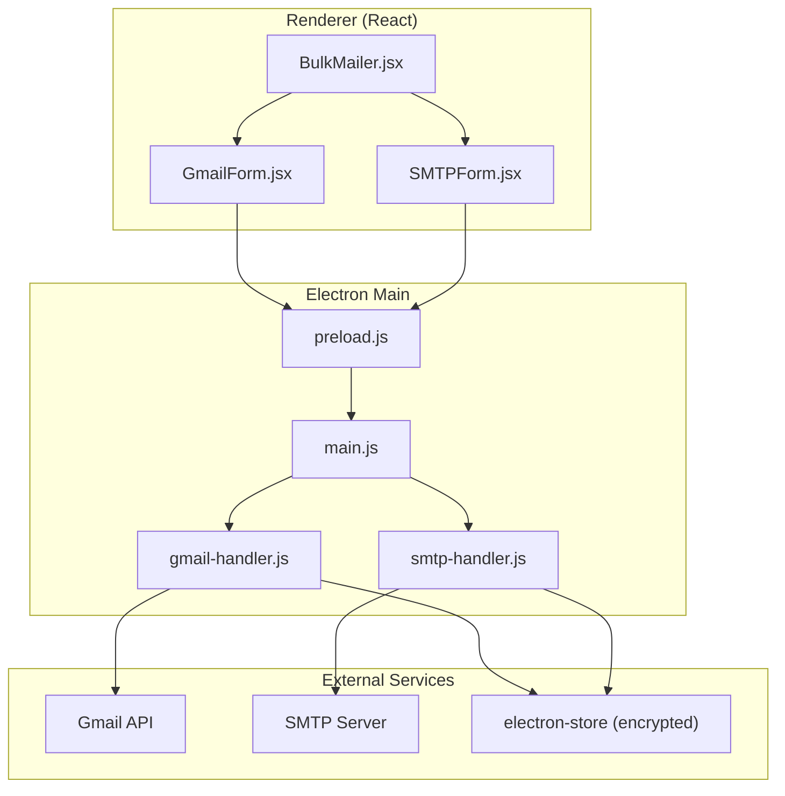
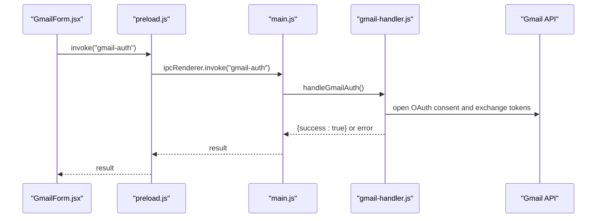
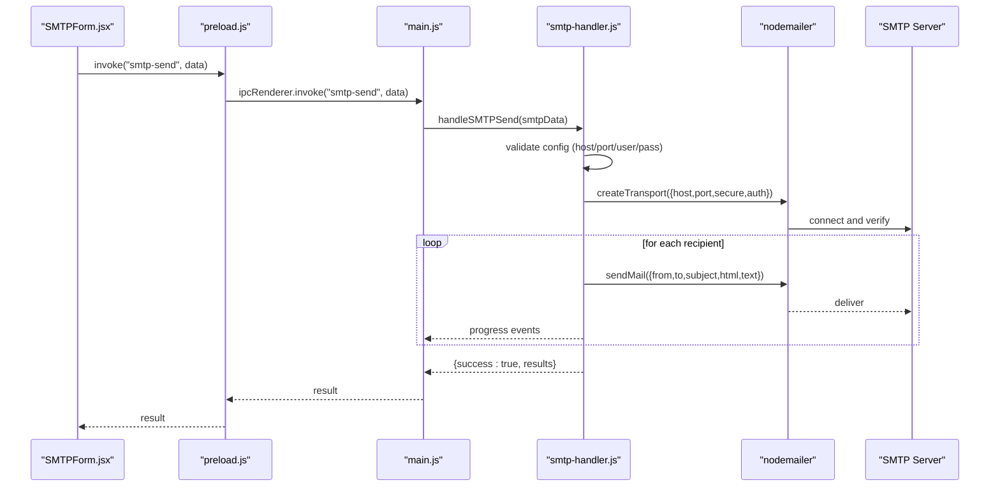
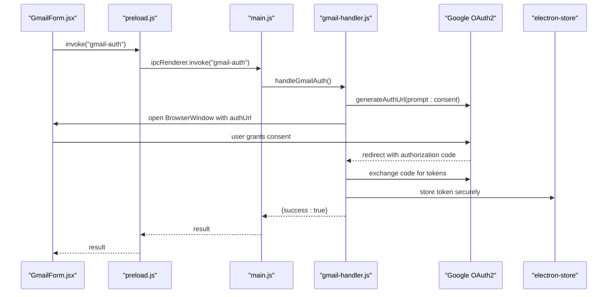
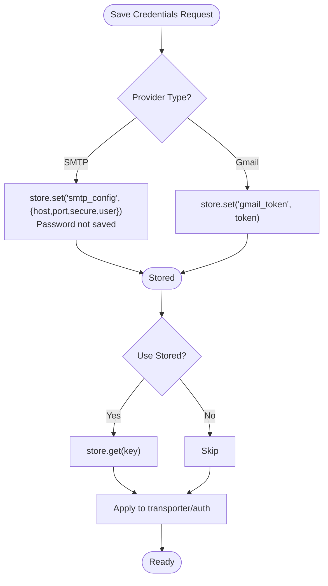
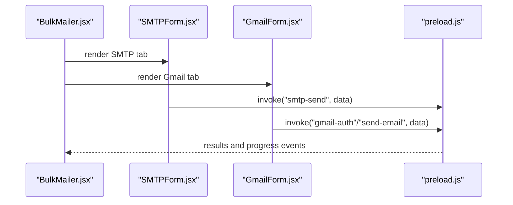
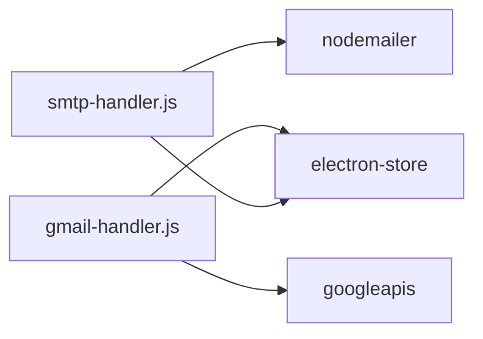

# SMTP Authentication

<cite>
**Referenced Files in This Document**
- [README.md](file://README.md)
- [package.json](file://electron/package.json)
- [main.js](file://electron/src/electron/main.js)
- [preload.js](file://electron/src/electron/preload.js)
- [gmail-handler.js](file://electron/src/electron/gmail-handler.js)
- [smtp-handler.js](file://electron/src/electron/smtp-handler.js)
- [BulkMailer.jsx](file://electron/src/components/BulkMailer.jsx)
- [GmailForm.jsx](file://electron/src/components/GmailForm.jsx)
- [SMTPForm.jsx](file://electron/src/components/SMTPForm.jsx)
- [electron-builder.json](file://electron/electron-builder.json)
</cite>

## Table of Contents
1. [Introduction](#introduction)
2. [Project Structure](#project-structure)
3. [Core Components](#core-components)
4. [Architecture Overview](#architecture-overview)
5. [Detailed Component Analysis](#detailed-component-analysis)
6. [Dependency Analysis](#dependency-analysis)
7. [Performance Considerations](#performance-considerations)
8. [Troubleshooting Guide](#troubleshooting-guide)
9. [Conclusion](#conclusion)
10. [Appendices](#appendices)

## Introduction
This document explains SMTP authentication methods and credential management in the application. It covers username/password authentication, encrypted credential storage, OAuth2 Gmail authentication, and best practices for secure operation. It also documents common failure scenarios, troubleshooting steps, and step-by-step setup guides for popular email providers.

## Project Structure
The application is an Electron + React desktop app with dedicated modules for authentication and email sending:
- Electron main process handles IPC, Gmail OAuth2, and SMTP operations
- Renderer components manage UI and user interactions
- Credential storage uses encrypted local storage

**Diagram sources**
- [main.js](file://electron/src/electron/main.js#L103-L108)
- [preload.js](file://electron/src/electron/preload.js#L4-L21)
- [gmail-handler.js](file://electron/src/electron/gmail-handler.js#L15-L130)
- [smtp-handler.js](file://electron/src/electron/smtp-handler.js#L6-L105)
- [GmailForm.jsx](file://electron/src/components/GmailForm.jsx#L1-L332)
- [SMTPForm.jsx](file://electron/src/components/SMTPForm.jsx#L1-L390)

**Section sources**
- [README.md](file://README.md#L1-L455)
- [package.json](file://electron/package.json#L1-L49)

## Core Components
- Gmail OAuth2 authentication flow with browser window and token persistence
- SMTP username/password authentication with optional encrypted credential saving
- Encrypted credential storage using electron-store
- IPC bridge exposing safe methods to renderer process
- UI components for configuring and sending emails

Key implementation references:
- Gmail OAuth2: [handleGmailAuth](file://electron/src/electron/gmail-handler.js#L15-L130), [handleSendEmail](file://electron/src/electron/gmail-handler.js#L141-L214)
- SMTP send: [handleSMTPSend](file://electron/src/electron/smtp-handler.js#L6-L105)
- Credential storage: [Store initialization](file://electron/src/electron/smtp-handler.js#L4), [getSavedSMTPConfig](file://electron/src/electron/smtp-handler.js#L107-L110)
- IPC exposure: [preload.js](file://electron/src/electron/preload.js#L4-L21)
- UI orchestration: [BulkMailer.jsx](file://electron/src/components/BulkMailer.jsx#L181-L261)

**Section sources**
- [gmail-handler.js](file://electron/src/electron/gmail-handler.js#L1-L227)
- [smtp-handler.js](file://electron/src/electron/smtp-handler.js#L1-L110)
- [preload.js](file://electron/src/electron/preload.js#L1-L41)
- [BulkMailer.jsx](file://electron/src/components/BulkMailer.jsx#L1-L482)

## Architecture Overview
The renderer invokes main-process methods via IPC. The main process performs authentication and sends emails, persisting credentials securely when requested.

**Diagram sources**
- [GmailForm.jsx](file://electron/src/components/GmailForm.jsx#L91-L107)
- [preload.js](file://electron/src/electron/preload.js#L6-L7)
- [main.js](file://electron/src/electron/main.js#L103-L105)
- [gmail-handler.js](file://electron/src/electron/gmail-handler.js#L15-L130)

## Detailed Component Analysis

### SMTP Username/Password Authentication
SMTP authentication uses nodemailer with explicit credentials. The handler validates configuration, optionally persists non-sensitive SMTP metadata, creates a transporter, verifies connectivity, and sends emails with progress updates.

Key behaviors:
- Validates presence of host, port, user, and pass
- Optional saving of non-sensitive SMTP metadata (without password)
- TLS verification with self-signed certificate allowance
- Per-recipient progress reporting via IPC
- Delay between emails for rate limiting

Security considerations:
- Password is not persisted; only non-sensitive metadata may be saved
- TLS verification occurs before sending
- Self-signed certificate verification can be disabled for testing environments

**Diagram sources**
- [SMTPForm.jsx](file://electron/src/components/SMTPForm.jsx#L288-L312)
- [preload.js](file://electron/src/electron/preload.js#L10-L11)
- [main.js](file://electron/src/electron/main.js#L108)
- [smtp-handler.js](file://electron/src/electron/smtp-handler.js#L6-L105)

**Section sources**
- [smtp-handler.js](file://electron/src/electron/smtp-handler.js#L6-L105)
- [SMTPForm.jsx](file://electron/src/components/SMTPForm.jsx#L1-L390)

### Gmail OAuth2 Authentication
The application uses Google OAuth2 with a browser window for consent and token exchange. Tokens are stored securely and reused for sending emails.

Token lifecycle:
- Token retrieval checks for stored credentials
- Token is attached to Gmail API client for sending
- Self-signed certificate verification disabled for API transport

**Diagram sources**
- [GmailForm.jsx](file://electron/src/components/GmailForm.jsx#L91-L107)
- [preload.js](file://electron/src/electron/preload.js#L6-L7)
- [main.js](file://electron/src/electron/main.js#L103-L105)
- [gmail-handler.js](file://electron/src/electron/gmail-handler.js#L15-L130)
- [gmail-handler.js](file://electron/src/electron/gmail-handler.js#L141-L214)

**Section sources**
- [gmail-handler.js](file://electron/src/electron/gmail-handler.js#L1-L227)
- [GmailForm.jsx](file://electron/src/components/GmailForm.jsx#L1-L332)

### Credential Storage and Security
- SMTP metadata (host, port, secure flag, user) can be saved when requested; passwords are intentionally omitted
- Gmail tokens are stored securely in encrypted local storage
- Electron’s contextBridge exposes only safe IPC methods to renderer

Security controls:
- electron-store encrypts stored data at rest
- Renderer cannot access Node.js APIs directly due to context isolation
- Only whitelisted IPC methods are exposed

**Diagram sources**
- [smtp-handler.js](file://electron/src/electron/smtp-handler.js#L22-L31)
- [gmail-handler.js](file://electron/src/electron/gmail-handler.js#L104-L104)
- [preload.js](file://electron/src/electron/preload.js#L4-L21)

**Section sources**
- [smtp-handler.js](file://electron/src/electron/smtp-handler.js#L22-L31)
- [gmail-handler.js](file://electron/src/electron/gmail-handler.js#L104-L104)
- [preload.js](file://electron/src/electron/preload.js#L1-L41)

### UI Integration and Workflows
- BulkMailer orchestrates form rendering and validation
- SMTPForm collects host/port/user/pass and triggers send
- GmailForm manages OAuth flow and sends emails via API
- Both emit progress events to the activity log

**Diagram sources**
- [BulkMailer.jsx](file://electron/src/components/BulkMailer.jsx#L417-L481)
- [SMTPForm.jsx](file://electron/src/components/SMTPForm.jsx#L288-L312)
- [GmailForm.jsx](file://electron/src/components/GmailForm.jsx#L91-L107)
- [preload.js](file://electron/src/electron/preload.js#L4-L21)

**Section sources**
- [BulkMailer.jsx](file://electron/src/components/BulkMailer.jsx#L1-L482)
- [SMTPForm.jsx](file://electron/src/components/SMTPForm.jsx#L1-L390)
- [GmailForm.jsx](file://electron/src/components/GmailForm.jsx#L1-L332)

## Dependency Analysis
External libraries and their roles:
- nodemailer: SMTP transport and sending
- googleapis: Gmail API client and OAuth2 flow
- electron-store: encrypted local storage for credentials
- whatsapp-web.js: WhatsApp integration (unrelated to SMTP but part of the app)

**Diagram sources**
- [smtp-handler.js](file://electron/src/electron/smtp-handler.js#L1-L2)
- [gmail-handler.js](file://electron/src/electron/gmail-handler.js#L3-L4)
- [package.json](file://electron/package.json#L20-L31)

**Section sources**
- [package.json](file://electron/package.json#L1-L49)

## Performance Considerations
- Rate limiting: configurable delay between emails to avoid throttling and detection
- Connection verification: SMTP verify reduces failures mid-batch
- Batch progress: real-time updates minimize perceived latency
- Token reuse: OAuth2 tokens avoid repeated consent prompts

[No sources needed since this section provides general guidance]

## Troubleshooting Guide

Common SMTP errors and resolutions:
- Invalid credentials
  - Verify username/email and password
  - Ensure secure flag matches server requirements (SSL/TLS)
  - Confirm firewall and network access to SMTP host/port
- Account disabled or locked
  - Reset password or unlock account via provider portal
  - Use app-specific passwords for providers requiring it
- Two-factor authentication requirements
  - Use app-specific passwords for Gmail
  - Enable less secure apps or use OAuth2 where supported
- Provider-specific issues
  - Gmail: Use App Passwords and correct host/port
  - Outlook: Use TLS on port 587

Common Gmail OAuth2 errors and resolutions:
- Missing environment variables
  - Ensure GOOGLE_CLIENT_ID and GOOGLE_CLIENT_SECRET are set
- Consent screen issues
  - Re-run OAuth flow; ensure prompt consent is configured
- Token exchange failures
  - Check redirect URI and network connectivity
  - Clear stored token and re-authenticate

Credential storage issues:
- Encrypted store not available
  - Ensure electron-store is installed and initialized
  - Check permissions for app data directory

**Section sources**
- [README.md](file://README.md#L412-L447)
- [gmail-handler.js](file://electron/src/electron/gmail-handler.js#L15-L130)
- [smtp-handler.js](file://electron/src/electron/smtp-handler.js#L6-L105)

## Conclusion
The application supports both SMTP username/password and Gmail OAuth2 authentication. SMTP credentials are not persisted, while Gmail tokens are stored securely. The UI provides guided workflows, progress tracking, and robust error handling. Follow the provider-specific setup guides and best practices to maintain secure, reliable email delivery.

[No sources needed since this section summarizes without analyzing specific files]

## Appendices

### Step-by-Step: Gmail SMTP (App Password)
- Obtain App Password from Google account settings
- Use host: smtp.gmail.com, port: 587 (TLS), secure: false
- Enter username and App Password in SMTP form
- Optionally save non-sensitive SMTP metadata

**Section sources**
- [README.md](file://README.md#L120-L127)
- [SMTPForm.jsx](file://electron/src/components/SMTPForm.jsx#L82-L162)

### Step-by-Step: Outlook SMTP
- Host: smtp-mail.outlook.com, Port: 587, Secure: false (TLS)
- Enter username and password in SMTP form
- Optionally save non-sensitive SMTP metadata

**Section sources**
- [README.md](file://README.md#L128-L133)
- [SMTPForm.jsx](file://electron/src/components/SMTPForm.jsx#L82-L162)

### Best Practices for Credential Security
- Prefer OAuth2 where available (Gmail)
- Use app-specific passwords for SMTP providers
- Limit saved metadata; never persist passwords
- Regularly rotate credentials and monitor usage
- Enforce rate limits and validate inputs
- Keep dependencies updated and review security advisories

**Section sources**
- [README.md](file://README.md#L333-L341)
- [smtp-handler.js](file://electron/src/electron/smtp-handler.js#L22-L31)
- [gmail-handler.js](file://electron/src/electron/gmail-handler.js#L104-L104)