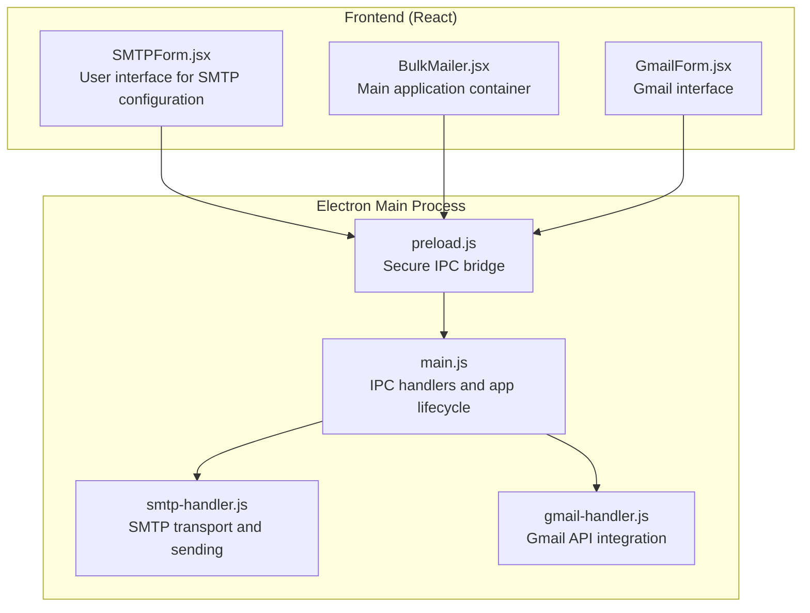
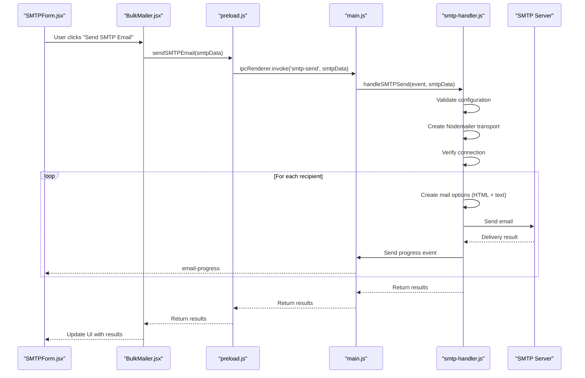
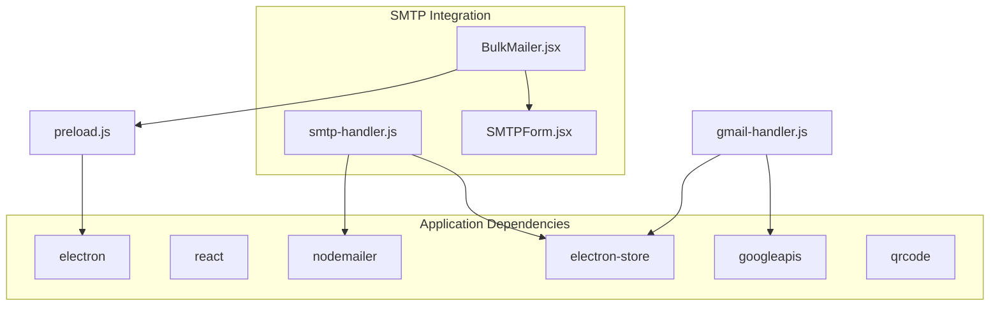

# SMTP Email Integration

<cite>
**Referenced Files in This Document**
- [README.md](file://README.md)
- [electron/src/components/SMTPForm.jsx](file://electron/src/components/SMTPForm.jsx)
- [electron/src/components/BulkMailer.jsx](file://electron/src/components/BulkMailer.jsx)
- [electron/src/electron/smtp-handler.js](file://electron/src/electron/smtp-handler.js)
- [electron/src/electron/main.js](file://electron/src/electron/main.js)
- [electron/src/electron/preload.js](file://electron/src/electron/preload.js)
- [electron/src/components/GmailForm.jsx](file://electron/src/components/GmailForm.jsx)
- [electron/src/electron/gmail-handler.js](file://electron/src/electron/gmail-handler.js)
- [electron/package.json](file://electron/package.json)
</cite>

## Table of Contents
1. [Introduction](#introduction)
2. [Project Structure](#project-structure)
3. [Core Components](#core-components)
4. [Architecture Overview](#architecture-overview)
5. [Detailed Component Analysis](#detailed-component-analysis)
6. [Dependency Analysis](#dependency-analysis)
7. [Performance Considerations](#performance-considerations)
8. [Troubleshooting Guide](#troubleshooting-guide)
9. [Conclusion](#conclusion)

## Introduction
This document provides comprehensive documentation for SMTP email integration and configuration within the Bulk Messaging System. It covers SMTP server setup, authentication, connection verification, email composition with HTML support, bulk sending with configurable delays and progress monitoring, provider-specific configurations, and security considerations. The system integrates SMTP email sending alongside other messaging channels (WhatsApp and Gmail API) in a cross-platform Electron application.

## Project Structure
The SMTP integration spans the frontend React components and the Electron main process. The frontend provides a user interface for configuring SMTP settings, composing emails, and monitoring progress. The Electron main process handles secure IPC communication, credential storage, and the actual SMTP transport creation and email sending.

**Diagram sources**
- [electron/src/components/SMTPForm.jsx](file://electron/src/components/SMTPForm.jsx#L1-L390)
- [electron/src/components/BulkMailer.jsx](file://electron/src/components/BulkMailer.jsx#L1-L482)
- [electron/src/electron/main.js](file://electron/src/electron/main.js#L1-L371)
- [electron/src/electron/preload.js](file://electron/src/electron/preload.js#L1-L41)
- [electron/src/electron/smtp-handler.js](file://electron/src/electron/smtp-handler.js#L1-L110)
- [electron/src/electron/gmail-handler.js](file://electron/src/electron/gmail-handler.js#L1-L227)

**Section sources**
- [README.md](file://README.md#L1-L455)
- [electron/src/components/SMTPForm.jsx](file://electron/src/components/SMTPForm.jsx#L1-L390)
- [electron/src/components/BulkMailer.jsx](file://electron/src/components/BulkMailer.jsx#L1-L482)
- [electron/src/electron/main.js](file://electron/src/electron/main.js#L1-L371)
- [electron/src/electron/preload.js](file://electron/src/electron/preload.js#L1-L41)
- [electron/src/electron/smtp-handler.js](file://electron/src/electron/smtp-handler.js#L1-L110)
- [electron/src/electron/gmail-handler.js](file://electron/src/electron/gmail-handler.js#L1-L227)

## Core Components
- SMTPForm: Provides the UI for SMTP configuration, recipient management, email composition, and sending controls.
- BulkMailer: Orchestrates the application state, form validation, and IPC calls to the Electron main process.
- smtp-handler: Creates the Nodemailer transport, verifies connections, sends emails, and manages progress events.
- main.js: Registers IPC handlers for SMTP operations and manages the Electron application lifecycle.
- preload.js: Exposes a secure API surface to the renderer process for SMTP operations.
- GmailForm and gmail-handler: Provide complementary email sending capabilities via Gmail API for comparison and alternative usage.

**Section sources**
- [electron/src/components/SMTPForm.jsx](file://electron/src/components/SMTPForm.jsx#L1-L390)
- [electron/src/components/BulkMailer.jsx](file://electron/src/components/BulkMailer.jsx#L1-L482)
- [electron/src/electron/smtp-handler.js](file://electron/src/electron/smtp-handler.js#L1-L110)
- [electron/src/electron/main.js](file://electron/src/electron/main.js#L107-L108)
- [electron/src/electron/preload.js](file://electron/src/electron/preload.js#L10-L11)
- [electron/src/components/GmailForm.jsx](file://electron/src/components/GmailForm.jsx#L1-L332)
- [electron/src/electron/gmail-handler.js](file://electron/src/electron/gmail-handler.js#L141-L214)

## Architecture Overview
The SMTP integration follows a layered architecture:
- Frontend Layer: React components manage user input and display progress.
- IPC Layer: Secure inter-process communication via Electron's contextBridge.
- Main Process Layer: Handles SMTP operations, credential storage, and progress reporting.
- Transport Layer: Uses Nodemailer to connect to SMTP servers and send emails.

**Diagram sources**
- [electron/src/components/SMTPForm.jsx](file://electron/src/components/SMTPForm.jsx#L288-L310)
- [electron/src/components/BulkMailer.jsx](file://electron/src/components/BulkMailer.jsx#L221-L261)
- [electron/src/electron/preload.js](file://electron/src/electron/preload.js#L10-L11)
- [electron/src/electron/main.js](file://electron/src/electron/main.js#L107-L108)
- [electron/src/electron/smtp-handler.js](file://electron/src/electron/smtp-handler.js#L6-L105)

## Detailed Component Analysis

### SMTP Configuration and Form Handling
The SMTP configuration UI allows users to set host, port, username/email, password, and secure connection preferences. The form validates that all required fields are present before enabling the send button.

Key configuration aspects:
- Host: SMTP server hostname (e.g., smtp.gmail.com)
- Port: Numeric port (commonly 587 for TLS, 465 for SSL)
- Username/Email: Sender's email address
- Password: Authentication credential
- Secure: Boolean flag for SSL/TLS mode

The form displays configuration status and provides import functionality for email lists.

**Section sources**
- [electron/src/components/SMTPForm.jsx](file://electron/src/components/SMTPForm.jsx#L82-L162)
- [electron/src/components/SMTPForm.jsx](file://electron/src/components/SMTPForm.jsx#L181-L189)
- [electron/src/components/SMTPForm.jsx](file://electron/src/components/SMTPForm.jsx#L210-L225)
- [electron/src/components/SMTPForm.jsx](file://electron/src/components/SMTPForm.jsx#L242-L271)
- [electron/src/components/SMTPForm.jsx](file://electron/src/components/SMTPForm.jsx#L273-L312)

### SMTP Transport Creation and Connection Verification
The SMTP handler creates a Nodemailer transport with the provided configuration and performs a connection verification step before sending emails. It supports both SSL (port 465) and TLS (port 587) modes based on the secure flag.

Connection verification ensures the transport is ready before proceeding with bulk sending, preventing unnecessary failures later in the process.

**Section sources**
- [electron/src/electron/smtp-handler.js](file://electron/src/electron/smtp-handler.js#L33-L45)
- [electron/src/electron/smtp-handler.js](file://electron/src/electron/smtp-handler.js#L47-L48)

### Email Composition and Content Handling
Email composition supports HTML content with automatic text/plain conversion. The handler strips HTML tags to create a plain text version for the text part of the email, ensuring compatibility with email clients that do not support HTML.

Features:
- HTML message body
- Automatic text/plain generation from HTML
- Proper MIME structure for multipart emails

**Section sources**
- [electron/src/electron/smtp-handler.js](file://electron/src/electron/smtp-handler.js#L64-L70)

### Bulk Sending Implementation with Progress Monitoring
The SMTP handler implements a loop to send emails to each recipient with configurable delays. It emits progress events after each send operation, allowing the UI to display real-time status updates.

Progress monitoring includes:
- Current position in the queue
- Total recipient count
- Individual recipient status (sent/failed)
- Error details for failed deliveries

Rate limiting is achieved through configurable delays between emails, helping to avoid spam detection and respecting provider rate limits.

**Section sources**
- [electron/src/electron/smtp-handler.js](file://electron/src/electron/smtp-handler.js#L50-L99)
- [electron/src/electron/smtp-handler.js](file://electron/src/electron/smtp-handler.js#L55-L61)
- [electron/src/electron/smtp-handler.js](file://electron/src/electron/smtp-handler.js#L76-L81)
- [electron/src/electron/smtp-handler.js](file://electron/src/electron/smtp-handler.js#L83-L87)

### Credential Storage and Security
The SMTP handler provides an option to save SMTP configuration to encrypted storage. It stores host, port, secure flag, and username while intentionally omitting the password for security reasons. This enables users to quickly reconfigure subsequent sessions without re-entering sensitive credentials.

Storage behavior:
- Encrypted local storage via electron-store
- Selective credential persistence (excludes password)
- Retrieval of saved configuration for convenience

**Section sources**
- [electron/src/electron/smtp-handler.js](file://electron/src/electron/smtp-handler.js#L22-L31)
- [electron/src/electron/smtp-handler.js](file://electron/src/electron/smtp-handler.js#L107-L109)

### Provider-Specific Configurations
Provider-specific SMTP configurations are documented in the project README. These configurations help users set up SMTP for popular email services.

Common provider configurations:
- Gmail SMTP: Host smtp.gmail.com, Port 587 (TLS) or 465 (SSL), requires App Password
- Outlook/Hotmail SMTP: Host smtp-mail.outlook.com, Port 587, TLS

These settings guide users in configuring their SMTP credentials correctly for each provider.

**Section sources**
- [README.md](file://README.md#L120-L133)

### Integration with Application Lifecycle
The main process registers an IPC handler for SMTP operations and exposes it through the preload bridge. The BulkMailer component coordinates form validation, prepares email data, and manages the sending lifecycle.

Integration points:
- IPC registration for 'smtp-send'
- Secure API exposure via contextBridge
- Form validation and error handling
- Progress event subscription

**Section sources**
- [electron/src/electron/main.js](file://electron/src/electron/main.js#L107-L108)
- [electron/src/electron/preload.js](file://electron/src/electron/preload.js#L10-L11)
- [electron/src/components/BulkMailer.jsx](file://electron/src/components/BulkMailer.jsx#L221-L261)

## Dependency Analysis
The SMTP integration relies on several key dependencies and their relationships:

**Diagram sources**
- [electron/package.json](file://electron/package.json#L20-L31)
- [electron/src/electron/smtp-handler.js](file://electron/src/electron/smtp-handler.js#L1-L4)
- [electron/src/electron/gmail-handler.js](file://electron/src/electron/gmail-handler.js#L1-L7)

**Section sources**
- [electron/package.json](file://electron/package.json#L20-L31)
- [electron/src/electron/smtp-handler.js](file://electron/src/electron/smtp-handler.js#L1-L4)
- [electron/src/electron/gmail-handler.js](file://electron/src/electron/gmail-handler.js#L1-L7)

## Performance Considerations
- Rate limiting: Configurable delays between emails prevent rate limiting and spam detection.
- Connection reuse: Nodemailer transports are reused for the duration of the sending session.
- Progress reporting: Real-time updates minimize perceived latency and improve user experience.
- Memory management: Large recipient lists are processed iteratively to avoid memory pressure.
- Network efficiency: Single SMTP connection handles multiple emails in sequence.

## Troubleshooting Guide

### Connection Failures
Common causes and solutions:
- Incorrect host/port configuration: Verify provider-specific settings
- Firewall/proxy blocking: Check network connectivity and proxy settings
- DNS resolution issues: Ensure proper DNS configuration
- Self-signed certificate errors: The handler accepts self-signed certificates for development

Diagnostic steps:
- Test SMTP server accessibility using telnet or openssl s_client
- Verify DNS resolution of the SMTP hostname
- Check firewall rules and proxy configurations
- Validate network connectivity to the SMTP server

**Section sources**
- [electron/src/electron/smtp-handler.js](file://electron/src/electron/smtp-handler.js#L42-L44)

### Authentication Errors
Common causes and solutions:
- Invalid username/password combination
- Disabled SMTP access in email provider settings
- Two-factor authentication requirements
- App-specific password requirements (Gmail)

Diagnostic steps:
- Verify email provider's SMTP settings and authentication requirements
- Test credentials with a known working SMTP client
- Check email provider's security settings for SMTP access
- Ensure correct password type (app-specific vs. regular password for Gmail)

**Section sources**
- [README.md](file://README.md#L122-L127)

### Delivery Issues
Common causes and solutions:
- Invalid recipient addresses
- Email content blocked by spam filters
- Rate limiting by email provider
- Attachment size limits exceeded

Diagnostic steps:
- Validate recipient email formats
- Review email content for spam trigger words
- Adjust rate limiting settings
- Check email provider's attachment policies

**Section sources**
- [electron/src/components/BulkMailer.jsx](file://electron/src/components/BulkMailer.jsx#L149-L179)

### UI and Progress Issues
Common causes and solutions:
- Progress events not updating in UI
- Delay settings not taking effect
- Form validation preventing send operations

Diagnostic steps:
- Verify IPC event listeners are properly attached
- Check delay configuration values
- Review form validation logic for required fields

**Section sources**
- [electron/src/electron/preload.js](file://electron/src/electron/preload.js#L17-L21)
- [electron/src/components/SMTPForm.jsx](file://electron/src/components/SMTPForm.jsx#L278-L285)

## Conclusion
The SMTP email integration provides a robust, secure, and user-friendly solution for bulk email sending within the Bulk Messaging System. It offers comprehensive configuration options, real-time progress monitoring, and strong security practices including encrypted credential storage. The integration supports major email providers and includes extensive troubleshooting guidance to ensure reliable email delivery. The modular architecture enables easy maintenance and future enhancements while maintaining cross-platform compatibility.