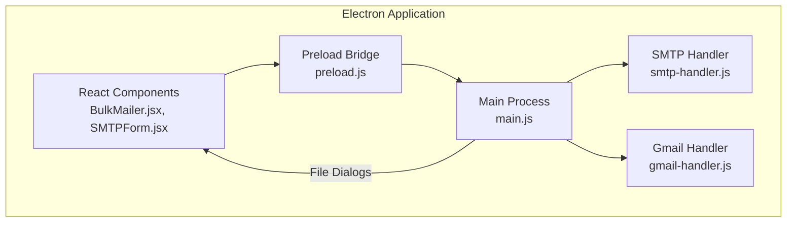
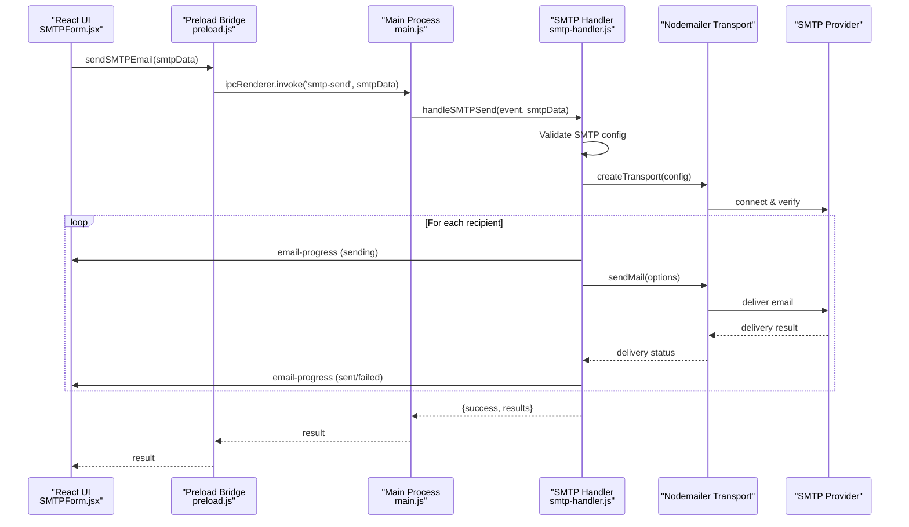
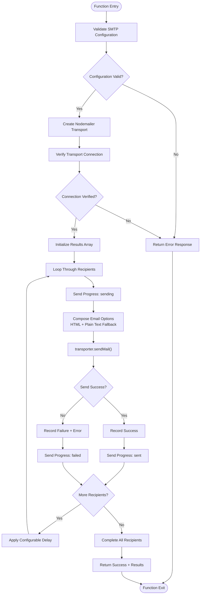
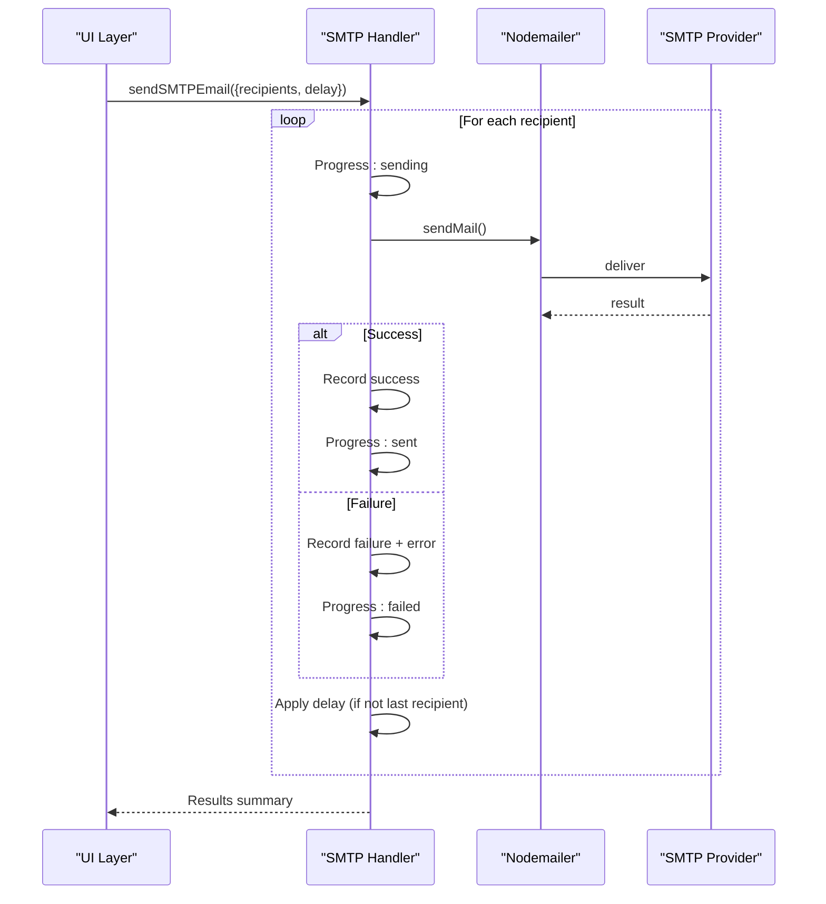
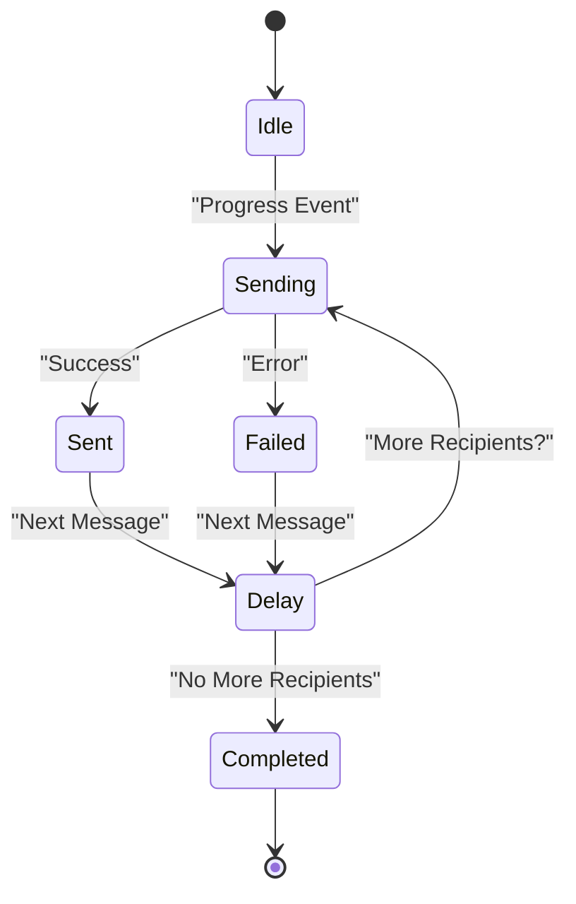
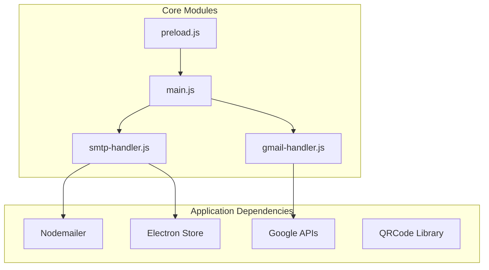

# SMTP Email Sending Implementation

<cite>
**Referenced Files in This Document**
- [smtp-handler.js](file://electron/src/electron/smtp-handler.js)
- [gmail-handler.js](file://electron/src/electron/gmail-handler.js)
- [main.js](file://electron/src/electron/main.js)
- [preload.js](file://electron/src/electron/preload.js)
- [BulkMailer.jsx](file://electron/src/components/BulkMailer.jsx)
- [SMTPForm.jsx](file://electron/src/components/SMTPForm.jsx)
- [pyodide.js](file://electron/src/utils/pyodide.js)
- [README.md](file://README.md)
</cite>

## Table of Contents
1. [Introduction](#introduction)
2. [Project Structure](#project-structure)
3. [Core Components](#core-components)
4. [Architecture Overview](#architecture-overview)
5. [Detailed Component Analysis](#detailed-component-analysis)
6. [Dependency Analysis](#dependency-analysis)
7. [Performance Considerations](#performance-considerations)
8. [Troubleshooting Guide](#troubleshooting-guide)
9. [Conclusion](#conclusion)
10. [Appendices](#appendices)

## Introduction
This document provides comprehensive technical documentation for the SMTP email sending implementation and bulk messaging capabilities within the desktop application. It covers email composition with HTML content support and automatic plain text fallback generation, attachment handling limitations and workarounds, bulk sending implementation with configurable delays, progress tracking and real-time status updates, rate limiting mechanisms and delivery throttling, error handling for individual message failures and partial delivery scenarios, email validation requirements and recipient formatting, and practical guidance for common sending issues including spam filtering, deliverability problems, and provider-specific restrictions.

## Project Structure
The email sending functionality is implemented across the Electron main process, preload bridge, React components, and handler modules. The key components include:
- Electron main process: IPC handlers for SMTP and Gmail, file dialogs, and progress tracking
- Preload bridge: Secure IPC exposure for renderer-side operations
- Handler modules: SMTP and Gmail email sending logic
- React components: UI for SMTP configuration, recipient import, email composition, and progress display
- Utilities: Pyodide integration for Python-based number parsing

**Diagram sources**
- [main.js](file://electron/src/electron/main.js#L1-L371)
- [preload.js](file://electron/src/electron/preload.js#L1-L41)
- [smtp-handler.js](file://electron/src/electron/smtp-handler.js#L1-L110)
- [gmail-handler.js](file://electron/src/electron/gmail-handler.js#L1-L227)
- [BulkMailer.jsx](file://electron/src/components/BulkMailer.jsx#L1-L482)
- [SMTPForm.jsx](file://electron/src/components/SMTPForm.jsx#L1-L390)

**Section sources**
- [main.js](file://electron/src/electron/main.js#L1-L371)
- [preload.js](file://electron/src/electron/preload.js#L1-L41)
- [smtp-handler.js](file://electron/src/electron/smtp-handler.js#L1-L110)
- [gmail-handler.js](file://electron/src/electron/gmail-handler.js#L1-L227)
- [BulkMailer.jsx](file://electron/src/components/BulkMailer.jsx#L1-L482)
- [SMTPForm.jsx](file://electron/src/components/SMTPForm.jsx#L1-L390)

## Core Components
This section outlines the primary components involved in SMTP email sending and bulk messaging:

- SMTP Handler: Implements SMTP transport creation, connection verification, email composition with HTML and plain text fallback, progress reporting, rate limiting, and error handling
- Gmail Handler: Manages OAuth2 authentication, token storage, and email sending via Gmail API
- Main Process: Exposes IPC handlers for SMTP and Gmail operations, manages file dialogs for email list import, and coordinates progress events
- Preload Bridge: Provides secure IPC methods to the renderer process for authentication, sending, file operations, and progress listeners
- React Components: Provide UI for SMTP configuration, recipient import, email composition, delay configuration, and real-time progress display
- Pyodide Utilities: Enable Python-based number parsing for contact management

Key implementation highlights:
- HTML email support with automatic plain text fallback generation
- Configurable delays between messages for rate limiting and deliverability
- Real-time progress updates via IPC events
- Error handling for individual message failures with partial delivery reporting
- Email validation for recipient formatting
- Attachment handling limitations and suggested workarounds

**Section sources**
- [smtp-handler.js](file://electron/src/electron/smtp-handler.js#L6-L105)
- [gmail-handler.js](file://electron/src/electron/gmail-handler.js#L141-L214)
- [main.js](file://electron/src/electron/main.js#L107-L108)
- [preload.js](file://electron/src/electron/preload.js#L4-L21)
- [BulkMailer.jsx](file://electron/src/components/BulkMailer.jsx#L149-L179)
- [SMTPForm.jsx](file://electron/src/components/SMTPForm.jsx#L288-L312)

## Architecture Overview
The email sending architecture follows a layered approach with clear separation of concerns:

**Diagram sources**
- [SMTPForm.jsx](file://electron/src/components/SMTPForm.jsx#L288-L312)
- [preload.js](file://electron/src/electron/preload.js#L10-L11)
- [main.js](file://electron/src/electron/main.js#L107-L108)
- [smtp-handler.js](file://electron/src/electron/smtp-handler.js#L6-L105)

**Section sources**
- [smtp-handler.js](file://electron/src/electron/smtp-handler.js#L6-L105)
- [main.js](file://electron/src/electron/main.js#L107-L108)
- [preload.js](file://electron/src/electron/preload.js#L10-L11)
- [SMTPForm.jsx](file://electron/src/components/SMTPForm.jsx#L288-L312)

## Detailed Component Analysis

### SMTP Handler Implementation
The SMTP handler module encapsulates the complete email sending workflow:

**Diagram sources**
- [smtp-handler.js](file://electron/src/electron/smtp-handler.js#L6-L105)

Key implementation characteristics:
- SMTP configuration validation with host, port, user, and password checks
- Transport creation with SSL/TLS support and self-signed certificate handling
- Connection verification before sending
- Email composition with HTML content and automatic plain text fallback generation
- Real-time progress reporting for each recipient
- Configurable delay between messages for rate limiting
- Comprehensive error handling with individual failure recording

**Section sources**
- [smtp-handler.js](file://electron/src/electron/smtp-handler.js#L6-L105)

### Email Composition and Content Generation
The email composition system supports rich HTML content with automatic plain text fallback:

- HTML content support: The message body is passed directly as HTML content
- Plain text fallback generation: Plain text version is created by stripping HTML tags from the message content
- Content-Type specification: Uses text/html MIME type for HTML emails
- Character encoding: UTF-8 character encoding for international content support

Implementation considerations:
- HTML emails should use proper HTML structure with DOCTYPE declarations for best rendering
- Plain text fallback ensures compatibility with email clients that disable HTML rendering
- Content length validation should be considered for large HTML documents

**Section sources**
- [smtp-handler.js](file://electron/src/electron/smtp-handler.js#L64-L70)

### Attachment Handling Limitations and Workarounds
Current implementation limitations:
- No native attachment support in the SMTP handler
- Email composition is limited to subject, HTML body, and plain text fallback

Recommended workarounds:
- Use inline images with proper base64 encoding within HTML content
- For external files, consider converting to embedded content or linking to hosted resources
- For large attachments, consider alternative delivery methods such as cloud storage links
- Implement pre-processing to convert file content to appropriate HTML representation

**Section sources**
- [smtp-handler.js](file://electron/src/electron/smtp-handler.js#L64-L70)

### Bulk Sending Implementation with Rate Limiting
The bulk sending implementation includes several mechanisms for controlled delivery:

**Diagram sources**
- [smtp-handler.js](file://electron/src/electron/smtp-handler.js#L50-L105)

Rate limiting and throttling mechanisms:
- Configurable delay between messages (default 1000ms)
- Conditional delay application (no delay after the last message)
- Progress tracking for each recipient with real-time updates
- Individual error handling with partial delivery reporting

**Section sources**
- [smtp-handler.js](file://electron/src/electron/smtp-handler.js#L50-L105)

### Progress Tracking and Real-Time Status Updates
The system provides comprehensive progress tracking through IPC events:

Progress event structure:
- Current position in batch
- Total recipient count
- Recipient email address
- Status: sending, sent, or failed
- Error details when applicable

**Section sources**
- [smtp-handler.js](file://electron/src/electron/smtp-handler.js#L55-L98)
- [gmail-handler.js](file://electron/src/electron/gmail-handler.js#L166-L206)

### Error Handling and Partial Delivery Scenarios
The implementation handles errors at multiple levels:

Individual message failure handling:
- Each recipient is processed independently
- Failures are recorded with specific error messages
- Partial delivery scenarios are supported with mixed success/failure results
- Progress updates reflect individual recipient outcomes

System-level error handling:
- SMTP configuration validation errors
- Transport connection verification failures
- Network connectivity issues
- Authentication failures

**Section sources**
- [smtp-handler.js](file://electron/src/electron/smtp-handler.js#L88-L98)
- [gmail-handler.js](file://electron/src/electron/gmail-handler.js#L195-L206)

### Email Validation and Recipient Formatting
Recipient validation occurs in the UI layer:

Validation rules:
- Non-empty recipient list
- Valid email format using regex pattern
- Subject and message content validation
- Trimmed whitespace handling

Recipient formatting:
- Line-by-line input with newline separation
- Automatic trimming of whitespace
- Filtering of empty entries
- Support for comma-separated values in CSV files

**Section sources**
- [BulkMailer.jsx](file://electron/src/components/BulkMailer.jsx#L149-L179)
- [main.js](file://electron/src/electron/main.js#L279-L318)

### UI Components for SMTP Configuration
The SMTP form provides a comprehensive interface for email composition:

Key UI elements:
- SMTP server configuration fields (host, port, username, password)
- Secure connection toggle
- Recipient import functionality
- Email composition area with character counting
- Delay configuration slider
- Real-time activity log with color-coded status indicators

Progress visualization:
- Color-coded status indicators (green for sent, red for failed)
- Timestamped entries
- Scrollable activity log
- Real-time updates during sending

**Section sources**
- [SMTPForm.jsx](file://electron/src/components/SMTPForm.jsx#L66-L314)

## Dependency Analysis
The email sending implementation relies on several key dependencies and external integrations:

**Diagram sources**
- [smtp-handler.js](file://electron/src/electron/smtp-handler.js#L1-L2)
- [gmail-handler.js](file://electron/src/electron/gmail-handler.js#L1-L5)
- [main.js](file://electron/src/electron/main.js#L1-L12)

External service integrations:
- SMTP providers for email delivery
- Google APIs for Gmail authentication and sending
- QR code generation for WhatsApp authentication
- File system access for contact import

**Section sources**
- [smtp-handler.js](file://electron/src/electron/smtp-handler.js#L1-L2)
- [gmail-handler.js](file://electron/src/electron/gmail-handler.js#L1-L5)
- [main.js](file://electron/src/electron/main.js#L1-L12)

## Performance Considerations
Several factors impact the performance and reliability of bulk email sending:

Processing efficiency:
- HTML to plain text conversion is performed synchronously for each message
- Connection verification occurs once per session
- Delay mechanism prevents overwhelming provider servers

Memory management:
- Results arrays grow linearly with recipient count
- Progress events are emitted for each recipient
- Large recipient lists may impact UI responsiveness

Network optimization:
- Single transport connection reused for all messages
- Configurable delays reduce network pressure
- Connection verification prevents unnecessary retries

Scalability recommendations:
- Consider batching recipients for very large lists
- Monitor provider rate limits and adjust delays accordingly
- Implement backoff strategies for persistent failures
- Use connection pooling for high-volume scenarios

## Troubleshooting Guide

### Common SMTP Issues
Connection and authentication problems:
- Verify SMTP host, port, and security settings match provider requirements
- Check firewall and network connectivity
- Ensure proper SSL/TLS configuration for secure connections
- Validate username/password credentials

Delivery failures:
- Review individual recipient error messages in the activity log
- Check provider-specific error codes and rate limit notifications
- Verify recipient email addresses are properly formatted
- Monitor progress events for failed recipients

### Provider-Specific Restrictions
Gmail SMTP considerations:
- Use app-specific passwords instead of regular account passwords
- Enable "Less secure app access" or configure OAuth2 authentication
- Monitor daily sending quotas and adjust batch sizes accordingly

Outlook/Hotmail SMTP:
- Verify SMTP settings: host, port, and security requirements
- Check for IP reputation issues if sending from shared hosting
- Implement proper DKIM/SPF/DNS configurations for improved deliverability

### Deliverability and Spam Prevention
Best practices:
- Implement proper sender reputation management
- Use consistent sender identity across messages
- Include unsubscribe links and proper headers
- Monitor bounce rates and engagement metrics
- Respect provider rate limits and implement appropriate delays

### UI and Configuration Issues
Recipient import problems:
- Ensure CSV files have proper column headers or use first column as email
- Verify file encoding is UTF-8
- Check that email addresses contain "@" symbol and proper format

Progress tracking issues:
- Verify IPC event listeners are properly attached
- Check that progress events are being emitted from the main process
- Ensure UI components are subscribed to progress updates

**Section sources**
- [smtp-handler.js](file://electron/src/electron/smtp-handler.js#L18-L20)
- [gmail-handler.js](file://electron/src/electron/gmail-handler.js#L146-L148)
- [BulkMailer.jsx](file://electron/src/components/BulkMailer.jsx#L149-L179)

## Conclusion
The SMTP email sending implementation provides a robust foundation for bulk email delivery with comprehensive features including HTML content support, automatic plain text fallback generation, configurable rate limiting, real-time progress tracking, and detailed error handling. The modular architecture ensures maintainability while the UI components provide an intuitive interface for managing email campaigns. While current limitations exist around attachment handling, the system's design allows for future enhancements and provides clear pathways for extending functionality. Proper configuration, adherence to provider guidelines, and implementation of best practices for deliverability will ensure reliable email delivery at scale.

## Appendices

### Configuration Reference
SMTP server settings:
- Host: SMTP server hostname or IP address
- Port: Standard ports (587 for TLS, 465 for SSL)
- Username: Email address or username for authentication
- Password: App password or authentication token
- Secure: Enable SSL/TLS encryption

### Email Template Examples
HTML email structure recommendations:
- Use semantic HTML tags for proper rendering
- Include proper DOCTYPE declaration
- Implement responsive design for mobile devices
- Use inline styles for better compatibility
- Provide plain text alternatives for accessibility

Content formatting guidelines:
- Keep subject lines concise and compelling
- Use clear, scannable content structure
- Include proper spacing and formatting
- Test across different email clients and devices

### Security Considerations
Credential storage:
- Passwords are not saved to prevent security risks
- Use encrypted storage for sensitive configuration data
- Implement proper access controls and permissions

Network security:
- Enable SSL/TLS for all SMTP connections
- Validate server certificates appropriately
- Monitor for man-in-the-middle attacks
- Use secure authentication methods