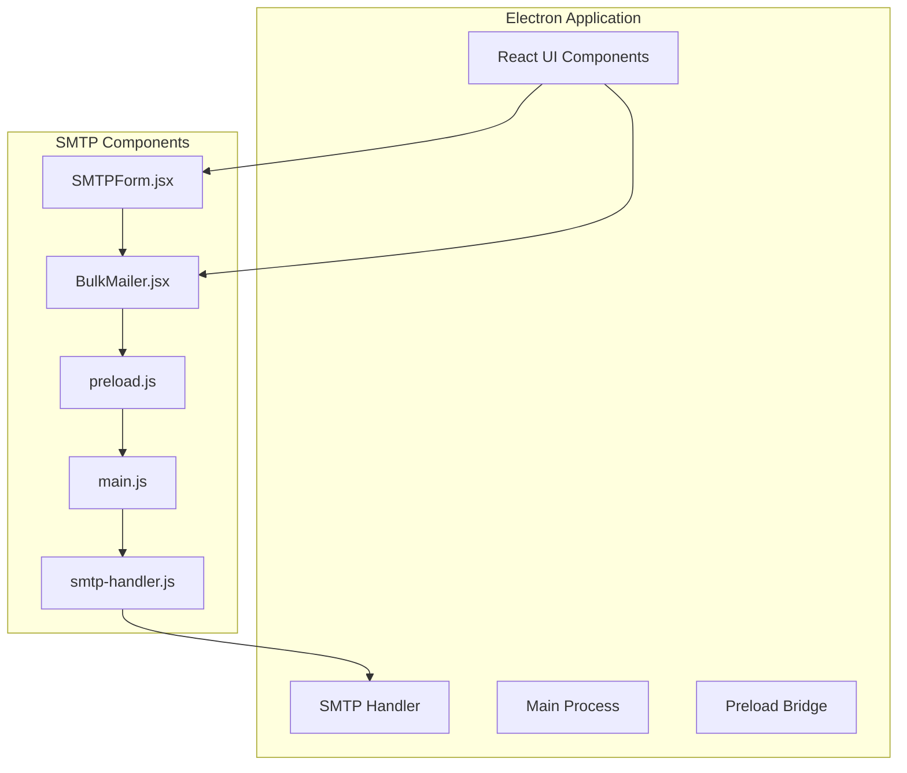
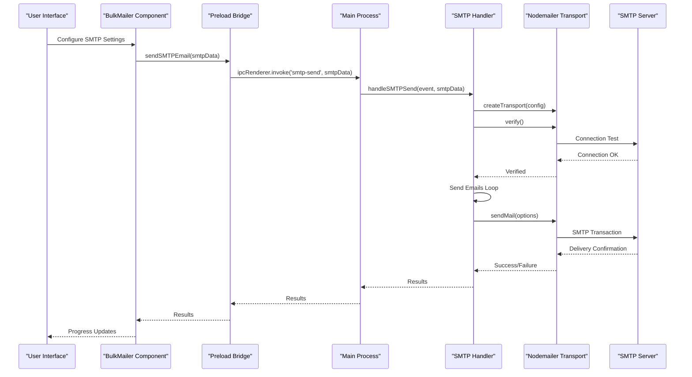
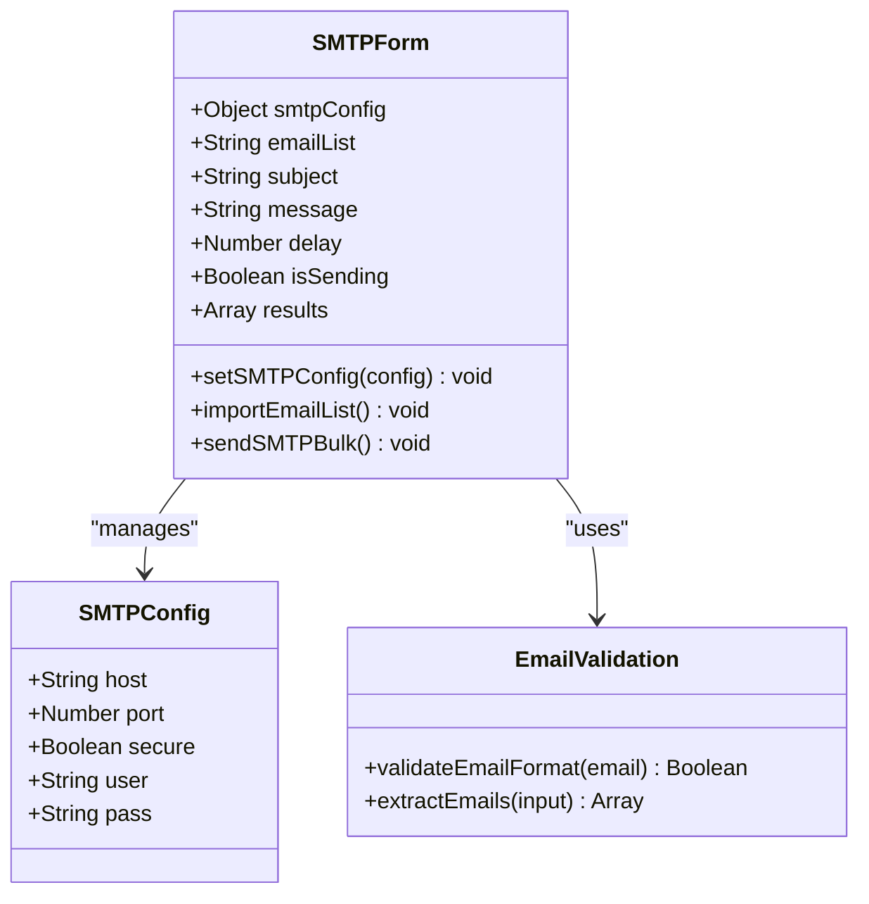
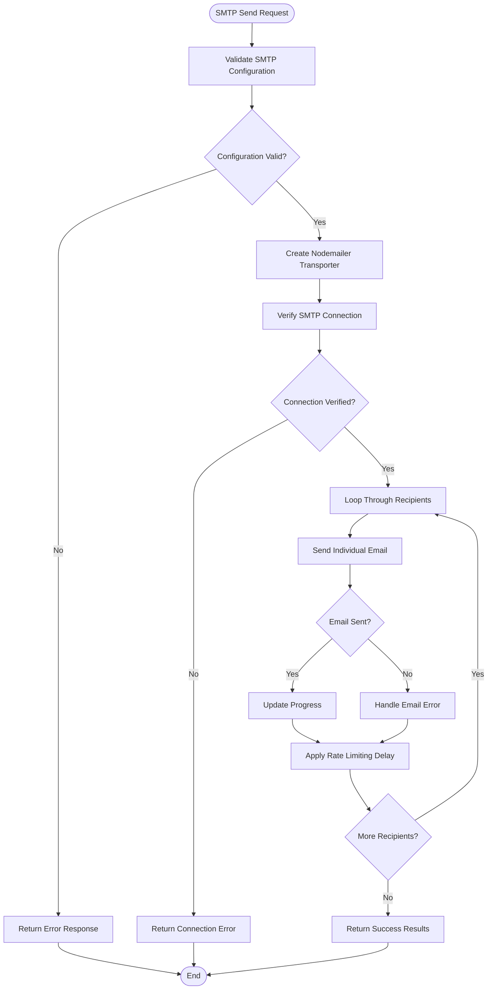
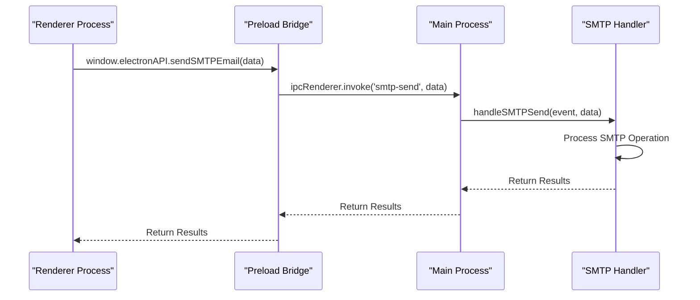
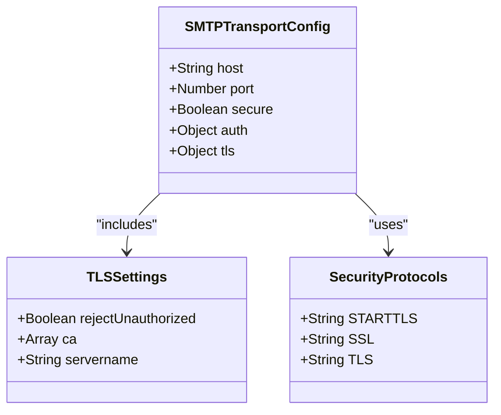
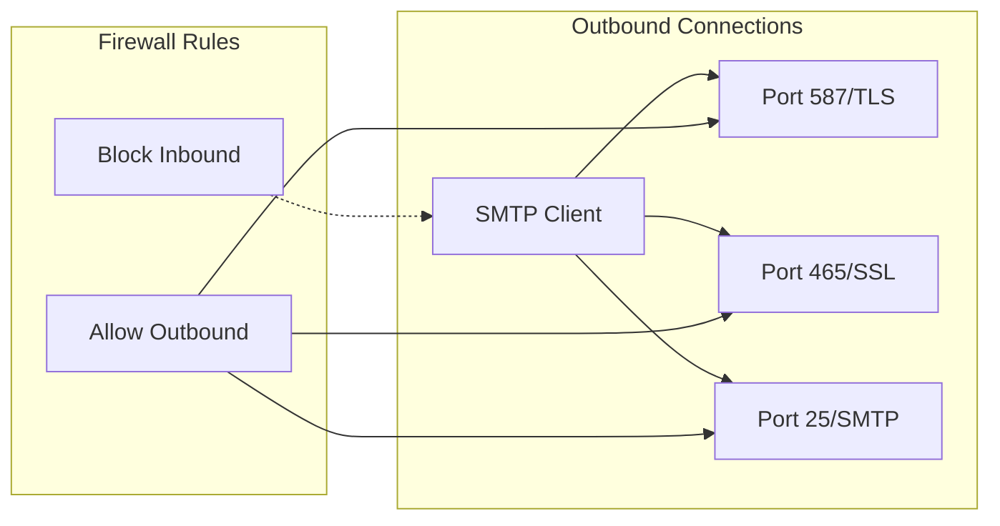
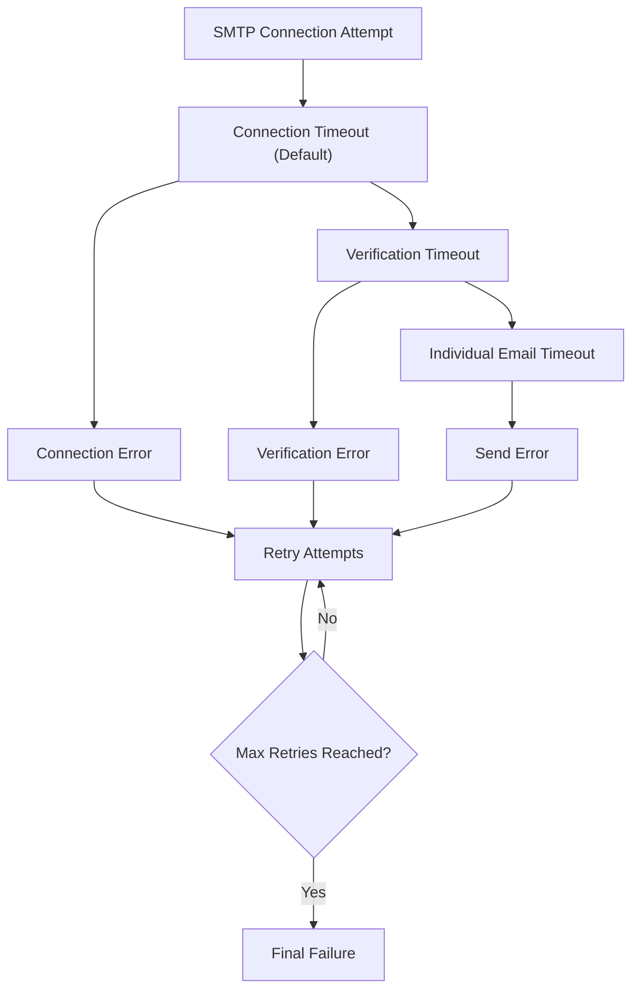

# SMTP server configuration

## Introduction

This page provides detailed SMTP server configuration and setup documentation for the bulk messaging application. It covers host configuration requirements, port selection guidelines, security protocol settings, TLS/SSL configuration options, certificate validation settings, provider-specific server settings for major email providers, firewall and network configuration requirements, connection timeout settings, retry mechanisms, and troubleshooting guides for common connection issues.

The application supports both Gmail API and SMTP server configurations, with a focus on secure email delivery through configurable transport protocols and reliable error handling mechanisms.

## Project structure

The SMTP functionality is implemented across several key components within the Electron application architecture:


```mermaid
graph TB
subgraph "Electron Application"
UI[React UI Components]
Handler[SMTP Handler]
Main[Main Process]
Preload[Preload Bridge]
end
subgraph "SMTP Components"
SMTPForm[SMTPForm.jsx]
BulkMailer[BulkMailer.jsx]
SMTPHandler[smtp-handler.js]
MainProcess[main.js]
PreloadAPI[preload.js]
end
UI --> SMTPForm
UI --> BulkMailer
SMTPForm --> BulkMailer
BulkMailer --> PreloadAPI
PreloadAPI --> MainProcess
MainProcess --> SMTPHandler
SMTPHandler --> Handler
```

## Core components

The SMTP configuration system consists of several interconnected components that work together to provide secure email delivery capabilities:

### SMTP configuration form
The user interface component allows users to configure SMTP server settings including host, port, username, password, and security options.

### SMTP handler
The backend handler manages the actual SMTP connection, authentication, and email sending process using Nodemailer.

### IPC communication layer
The Electron IPC system facilitates secure communication between the renderer process (UI) and main process (SMTP operations).

## Architecture overview

The SMTP configuration follows a layered architecture with clear separation of concerns:


```mermaid
sequenceDiagram
participant User as "User Interface"
participant Mailer as "BulkMailer Component"
participant Preload as "Preload Bridge"
participant Main as "Main Process"
participant Handler as "SMTP Handler"
participant Transport as "Nodemailer Transport"
participant SMTP as "SMTP Server"
User->>Mailer : Configure SMTP Settings
Mailer->>Preload : sendSMTPEmail(smtpData)
Preload->>Main : ipcRenderer.invoke('smtp-send', smtpData)
Main->>Handler : handleSMTPSend(event, smtpData)
Handler->>Transport : createTransport(config)
Handler->>Transport : verify()
Transport->>SMTP : Connection Test
SMTP-->>Transport : Connection OK
Transport-->>Handler : Verified
Handler->>Handler : Send Emails Loop
Handler->>Transport : sendMail(options)
Transport->>SMTP : SMTP Transaction
SMTP-->>Transport : Delivery Confirmation
Transport-->>Handler : Success/Failure
Handler-->>Main : Results
Main-->>Preload : Results
Preload-->>Mailer : Results
Mailer-->>User : Progress Updates
```

## Detailed component analysis

### SMTP configuration form component

The SMTP form component provides a detailed interface for configuring email server settings:


```mermaid
classDiagram
class SMTPForm {
+Object smtpConfig
+String emailList
+String subject
+String message
+Number delay
+Boolean isSending
+Array results
+setSMTPConfig(config) void
+importEmailList() void
+sendSMTPBulk() void
}
class SMTPConfig {
+String host
+Number port
+Boolean secure
+String user
+String pass
}
class EmailValidation {
+validateEmailFormat(email) Boolean
+extractEmails(input) Array
}
SMTPForm --> SMTPConfig : "manages"
SMTPForm --> EmailValidation : "uses"
```

### SMTP handler implementation

The SMTP handler manages the complete email sending process with reliable error handling and progress tracking:


```mermaid
flowchart TD
Start([SMTP Send Request]) --> ValidateConfig["Validate SMTP Configuration"]
ValidateConfig --> ConfigValid{"Configuration Valid?"}
ConfigValid --> |No| ReturnError["Return Error Response"]
ConfigValid --> |Yes| CreateTransporter["Create Nodemailer Transporter"]
CreateTransporter --> VerifyConnection["Verify SMTP Connection"]
VerifyConnection --> ConnectionOK{"Connection Verified?"}
ConnectionOK --> |No| ReturnConnectionError["Return Connection Error"]
ConnectionOK --> |Yes| LoopRecipients["Loop Through Recipients"]
LoopRecipients --> SendEmail["Send Individual Email"]
SendEmail --> EmailSuccess{"Email Sent?"}
EmailSuccess --> |Yes| UpdateProgress["Update Progress"]
EmailSuccess --> |No| HandleError["Handle Email Error"]
UpdateProgress --> Delay["Apply Rate Limiting Delay"]
HandleError --> Delay
Delay --> MoreRecipients{"More Recipients?"}
MoreRecipients --> |Yes| LoopRecipients
MoreRecipients --> |No| ReturnSuccess["Return Success Results"]
ReturnError --> End([End])
ReturnConnectionError --> End
ReturnSuccess --> End
```

### IPC communication layer

The Electron IPC system provides secure communication between the renderer and main processes:


```mermaid
sequenceDiagram
participant Renderer as "Renderer Process"
participant Preload as "Preload Bridge"
participant Main as "Main Process"
participant Handler as "SMTP Handler"
Renderer->>Preload : window.electronAPI.sendSMTPEmail(data)
Preload->>Main : ipcRenderer.invoke('smtp-send', data)
Main->>Handler : handleSMTPSend(event, data)
Handler->>Handler : Process SMTP Operation
Handler-->>Main : Return Results
Main-->>Preload : Return Results
Preload-->>Renderer : Return Results
```

## Provider-Specific SMTP settings

### Gmail SMTP configuration

Gmail requires specific configuration settings for secure SMTP access:

| Setting | Value | Description |
|---------|-------|-------------|
| Host | `smtp.gmail.com` | Gmail SMTP server hostname |
| Port | `587` (TLS) or `465` (SSL) | Recommended port for Gmail |
| Security | TLS/SSL | Use TLS for port 587, SSL for port 465 |
| Authentication | App Password | Use App Password instead of regular password |

### Outlook/Hotmail SMTP configuration

Microsoft Outlook requires specific SMTP settings:

| Setting | Value | Description |
|---------|-------|-------------|
| Host | `smtp-mail.outlook.com` | Outlook SMTP server hostname |
| Port | `587` | Standard port for Outlook SMTP |
| Security | TLS | Outlook requires TLS encryption |
| Authentication | Standard Credentials | Use username and password |

### Yahoo SMTP configuration

Yahoo Mail requires specific SMTP configuration:

| Setting | Value | Description |
|---------|-------|-------------|
| Host | `smtp.mail.yahoo.com` | Yahoo SMTP server hostname |
| Port | `587` (TLS) or `465` (SSL) | Recommended ports |
| Security | TLS/SSL | Use appropriate security protocol |
| Authentication | Standard Credentials | Use Yahoo account credentials |

### Custom SMTP server configuration

For custom SMTP servers, the configuration follows standard patterns:

| Setting | Example Value | Description |
|---------|---------------|-------------|
| Host | `smtp.yourcompany.com` | Your SMTP server hostname |
| Port | `587` | Common SMTP port |
| Security | TLS | Recommended for security |
| Authentication | Username/Password | Standard SMTP authentication |

## Security configuration

### TLS/SSL configuration options

The SMTP handler provides flexible security configuration options:


```mermaid
classDiagram
class SMTPTransportConfig {
+String host
+Number port
+Boolean secure
+Object auth
+Object tls
}
class TLSSettings {
+Boolean rejectUnauthorized
+Array ca
+String servername
}
class SecurityProtocols {
+String STARTTLS
+String SSL
+String TLS
}
SMTPTransportConfig --> TLSSettings : "includes"
SMTPTransportConfig --> SecurityProtocols : "uses"
```

### Certificate validation settings

The application provides certificate validation flexibility:

- **Certificate Validation**: Disabled for self-signed certificates (`rejectUnauthorized: false`)
- **Custom CA Certificates**: Can be configured for enterprise environments
- **Hostname Verification**: Server name verification for secure connections

### Credential storage and security

The application implements secure credential storage:

- **Encrypted Storage**: SMTP credentials are stored securely using electron-store
- **Selective Storage**: Host, port, and user are stored; passwords are not saved
- **Memory Management**: Credentials are loaded only when needed

## Connection and network requirements

### Firewall configuration

SMTP connections require specific firewall configurations:


```mermaid
graph LR
subgraph "Outbound Connections"
SMTPClient[SMTP Client]
Port587[Port 587/TLS]
Port465[Port 465/SSL]
Port25[Port 25/SMTP]
end
subgraph "Firewall Rules"
Allow[Allow Outbound]
Block[Block Inbound]
end
SMTPClient --> Port587
SMTPClient --> Port465
SMTPClient --> Port25
Allow --> Port587
Allow --> Port465
Allow --> Port25
Block -.-> SMTPClient
```

### Network requirements

The application requires:

- **Outbound Access**: TCP connections to SMTP servers on configured ports
- **DNS Resolution**: Ability to resolve SMTP server hostnames
- **Time Synchronization**: Accurate system time for certificate validation
- **Proxy Support**: Optional proxy configuration for restricted networks

### Rate limiting and throttling

The system implements intelligent rate limiting:

- **Default Delay**: 1000ms between email sends
- **Configurable Delays**: Users can adjust delay intervals
- **Provider Limits**: Respects provider-specific sending limits
- **Backoff Strategies**: Gradual increase in delays for failed attempts

## Timeouts and retry mechanisms

### Connection timeouts

The SMTP handler implements detailed timeout mechanisms:


```mermaid
flowchart TD
ConnectionAttempt[SMTP Connection Attempt] --> ConnectTimeout["Connection Timeout (Default)"]
ConnectTimeout --> VerifyTimeout["Verification Timeout"]
VerifyTimeout --> SendTimeout["Individual Email Timeout"]
ConnectTimeout --> ConnectionError[Connection Error]
VerifyTimeout --> VerificationError[Verification Error]
SendTimeout --> SendError[Send Error]
ConnectionError --> RetryAttempts[Retry Attempts]
VerificationError --> RetryAttempts
SendError --> RetryAttempts
RetryAttempts --> MaxRetries{Max Retries Reached?}
MaxRetries --> |No| RetryAttempts
MaxRetries --> |Yes| FinalFailure[Final Failure]
```

### Retry strategies

The system employs progressive retry strategies:

- **Immediate Retry**: First failure triggers immediate retry
- **Exponential Backoff**: Subsequent failures use increasing delays
- **Maximum Attempts**: Configurable maximum retry attempts
- **Error Classification**: Different handling for different error types

### Progress tracking

Real-time progress tracking provides detailed feedback:

- **Individual Email Status**: Success/failure for each recipient
- **Overall Progress**: Percentage completion indicator
- **Error Details**: Specific error messages for failed attempts
- **Timing Information**: Delivery timestamps and durations

## Troubleshooting guide

### Common SMTP connection issues

#### Authentication failures
- **Symptoms**: "Authentication failed" or "Invalid credentials"
- **Solutions**:
  - Verify username/password combination
  - Check for App Password requirements (Gmail)
  - Ensure two-factor authentication settings are correct

#### Port blocking issues
- **Symptoms**: Connection timeouts or refused connections
- **Solutions**:
  - Verify firewall allows outbound connections on configured port
  - Check with network administrator for blocked ports
  - Try alternative ports (587 vs 465)

#### Certificate validation errors
- **Symptoms**: "Certificate verification failed" errors
- **Solutions**:
  - Check system date/time synchronization
  - Verify certificate chain validity
  - Consider enterprise certificate authority configuration

#### DNS resolution problems
- **Symptoms**: "Host not found" or "DNS resolution failed"
- **Solutions**:
  - Verify SMTP server hostname spelling
  - Test DNS resolution using command line tools
  - Check network connectivity and DNS server configuration

### Network connectivity failures

#### Proxy configuration issues
- **Symptoms**: Connection timeouts behind corporate firewalls
- **Solutions**:
  - Configure proxy settings in network preferences
  - Verify proxy authentication requirements
  - Test proxy connectivity independently

#### ISP blocking issues
- **Symptoms**: Consistent connection failures to specific providers
- **Solutions**:
  - Contact ISP to unblock SMTP ports
  - Use alternative SMTP providers
  - Configure SMTP over different ports

### Performance and rate limiting issues

#### Excessive rate limiting
- **Symptoms**: Slow sending speeds or frequent delays
- **Solutions**:
  - Adjust delay settings in configuration
  - Reduce batch sizes for large mailing lists
  - Implement staggered sending schedules

#### Memory and resource issues
- **Symptoms**: Application slowdown or crashes during bulk sending
- **Solutions**:
  - Monitor system resources during operation
  - Reduce concurrent connections
  - Optimize email content size

## Configuration examples

### Gmail SMTP configuration example

```javascript
const gmailSMTPConfig = {
    host: "smtp.gmail.com",
    port: 587,
    secure: false, // Use TLS
    user: "your-email@gmail.com",
    pass: "your-app-password"
};
```

### Outlook SMTP configuration example

```javascript
const outlookSMTPConfig = {
    host: "smtp-mail.outlook.com",
    port: 587,
    secure: true, // Use SSL
    user: "your-email@outlook.com",
    pass: "your-password"
};
```

### Custom SMTP configuration example

```javascript
const customSMTPConfig = {
    host: "smtp.yourcompany.com",
    port: 587,
    secure: false, // Use TLS
    user: "sender@yourcompany.com",
    pass: "your-password"
};
```

### Enterprise SMTP configuration example

```javascript
const enterpriseSMTPConfig = {
    host: "smtp.internal.company.com",
    port: 465,
    secure: true,
    user: "username@company.com",
    pass: "enterprise-password",
    tls: {
        rejectUnauthorized: true,
        ca: ["path/to/certificate.pem"]
    }
};
```

## Conclusion

The SMTP server configuration system provides a detailed solution for secure email delivery with reliable error handling, flexible security options, and extensive provider support. The implementation follows modern security practices while maintaining ease of use for end users.

Key strengths of the configuration system include:

- **Flexible Security Options**: Support for TLS, SSL, and custom certificate validation
- **Provider-Specific Optimizations**: Pre-configured settings for major email providers
- **Reliable Error Handling**: Detailed error reporting and recovery mechanisms
- **Performance Optimization**: Intelligent rate limiting and progress tracking
- **Security Best Practices**: Encrypted credential storage and secure communication

The system is designed to handle various deployment scenarios from individual users to enterprise environments, with clear configuration options for different network and security requirements.
