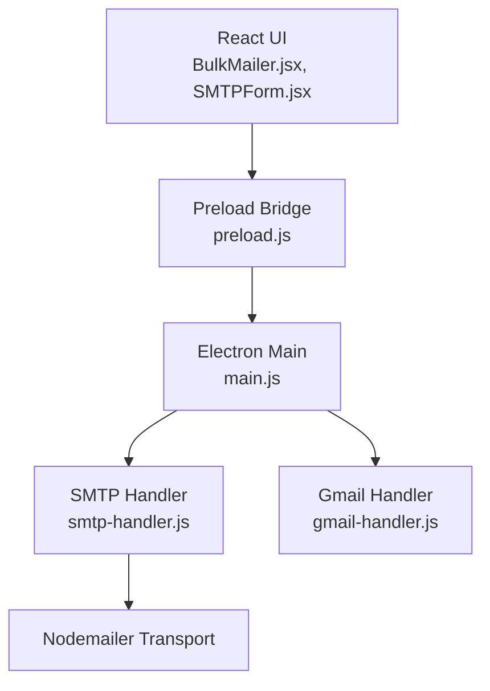
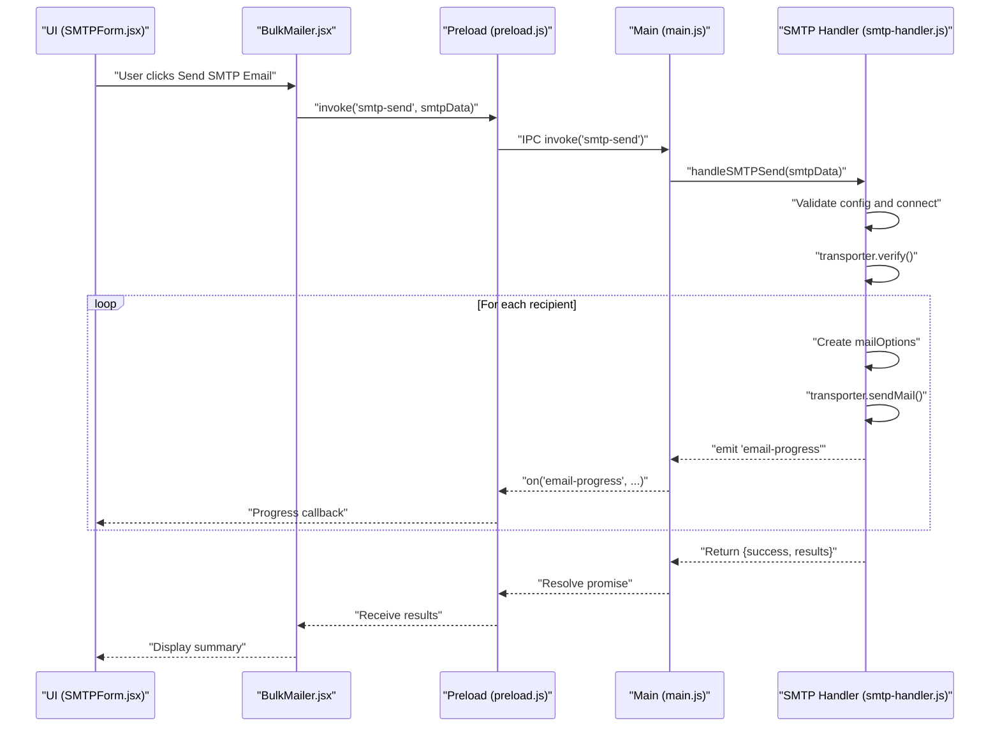
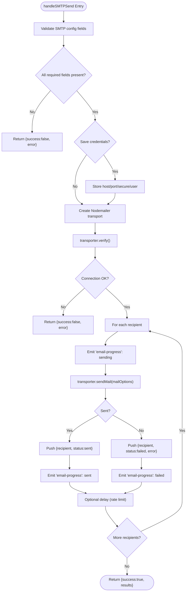
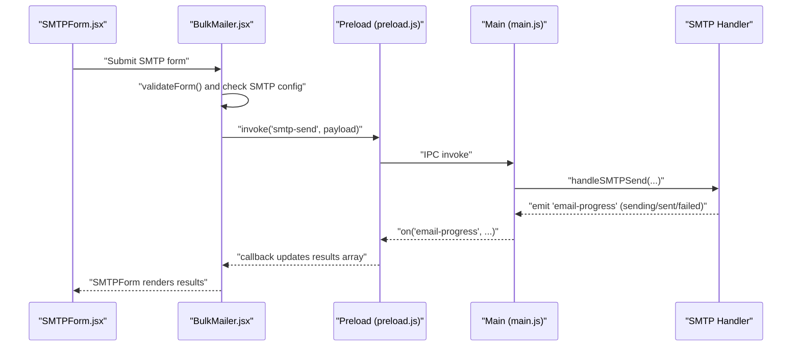
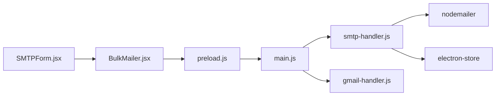

# SMTP troubleshooting and error handling

## Introduction
This page provides detailed troubleshooting guidance for SMTP integration issues within the application. It explains common error scenarios, diagnostic steps for network and provider-specific problems, and practical resolutions. It also covers log analysis, SSL/TLS certificate handling, and performance optimization strategies such as connection verification, rate limiting, and progress reporting.

## Project structure
The application integrates SMTP email sending through Electron's main process and a React UI. The Electron main process exposes IPC handlers for email operations, while the renderer invokes them securely via a preload bridge. SMTP operations are handled by a dedicated handler that validates configuration, verifies connectivity, and sends emails with progress updates.

```mermaid
graph TB
UI["React UI<br/>BulkMailer.jsx, SMTPForm.jsx"] --> Preload["Preload Bridge<br/>preload.js"]
Preload --> Main["Electron Main<br/>main.js"]
Main --> SMTPHandler["SMTP Handler<br/>smtp-handler.js"]
SMTPHandler --> Nodemailer["Nodemailer Transport"]
Main --> GmailHandler["Gmail Handler<br/>gmail-handler.js"]
```

## Core components
- Electron main process IPC handlers for SMTP and Gmail
- Preload bridge exposing secure IPC methods
- SMTP handler performing configuration validation, connection verification, and per-recipient sending with progress events
- UI components for SMTP configuration, recipient import, and real-time activity logging

Key implementation references:
- SMTP send handler and transport creation
- Connection verification and per-email sending loop
- Progress events emitted to the renderer
- UI form validation and submission flow

## Architecture overview
The SMTP workflow is initiated from the UI, routed through the preload bridge, executed in the main process, and emits progress events back to the UI for display.

```mermaid
sequenceDiagram
participant UI as "UI (SMTPForm.jsx)"
participant BM as "BulkMailer.jsx"
participant PR as "Preload (preload.js)"
participant MP as "Main (main.js)"
participant SH as "SMTP Handler (smtp-handler.js)"
UI->>BM : "User clicks Send SMTP Email"
BM->>PR : "invoke('smtp-send', smtpData)"
PR->>MP : "IPC invoke('smtp-send')"
MP->>SH : "handleSMTPSend(smtpData)"
SH->>SH : "Validate config and connect"
SH->>SH : "transporter.verify()"
loop For each recipient
SH->>SH : "Create mailOptions"
SH->>SH : "transporter.sendMail()"
SH-->>MP : "emit 'email-progress'"
MP-->>PR : "on('email-progress', ...)"
PR-->>UI : "Progress callback"
end
SH-->>MP : "Return {success, results}"
MP-->>PR : "Resolve promise"
PR-->>BM : "Receive results"
BM-->>UI : "Display summary"
```

## Detailed component analysis

### SMTP handler: configuration, verification, and delivery
The SMTP handler performs:
- Configuration validation (host, port, user, pass)
- Optional credential saving (encrypted storage)
- Transport creation with TLS options
- Connection verification
- Per-recipient email sending with progress events
- Error handling and result aggregation

```mermaid
flowchart TD
Start(["handleSMTPSend Entry"]) --> Validate["Validate SMTP config fields"]
Validate --> Valid{"All required fields present?"}
Valid --> |No| ReturnError["Return {success:false, error}"]
Valid --> |Yes| SaveCreds{"Save credentials?"}
SaveCreds --> |Yes| Store["Store host/port/secure/user"]
SaveCreds --> |No| CreateTransport["Create Nodemailer transport"]
Store --> CreateTransport
CreateTransport --> Verify["transporter.verify()"]
Verify --> Verified{"Connection OK?"}
Verified --> |No| ReturnVerifyError["Return {success:false, error}"]
Verified --> |Yes| Loop["For each recipient"]
Loop --> ProgressSending["Emit 'email-progress': sending"]
ProgressSending --> SendMail["transporter.sendMail(mailOptions)"]
SendMail --> Sent{"Sent?"}
Sent --> |Yes| PushSuccess["Push {recipient, status:sent}"]
Sent --> |No| PushFail["Push {recipient, status:failed, error}"]
PushSuccess --> ProgressSent["Emit 'email-progress': sent"]
PushFail --> ProgressFail["Emit 'email-progress': failed"]
ProgressSent --> Delay["Optional delay (rate limit)"]
ProgressFail --> Delay
Delay --> Next{"More recipients?"}
Next --> |Yes| Loop
Next --> |No| Done(["Return {success:true, results}"])
```

### UI integration: form validation and progress logging
The UI validates inputs, constructs the SMTP payload, and listens for progress events to render real-time status.

```mermaid
sequenceDiagram
participant UI as "SMTPForm.jsx"
participant BM as "BulkMailer.jsx"
participant PR as "Preload (preload.js)"
participant MP as "Main (main.js)"
participant SH as "SMTP Handler"
UI->>BM : "Submit SMTP form"
BM->>BM : "validateForm() and check SMTP config"
BM->>PR : "invoke('smtp-send', payload)"
PR->>MP : "IPC invoke"
MP->>SH : "handleSMTPSend(...)"
SH-->>MP : "emit 'email-progress' (sending/sent/failed)"
MP-->>PR : "on('email-progress', ...)"
PR-->>BM : "callback updates results array"
BM-->>UI : "SMTPForm renders results"
```

## Dependency analysis
- Electron main process registers IPC handlers for SMTP and Gmail.
- Preload exposes safe IPC methods to the renderer.
- SMTP handler depends on Nodemailer for transport and on electron-store for optional credential persistence.
- UI components depend on Electron APIs exposed via preload.

```mermaid
graph LR
SMTPForm["SMTPForm.jsx"] --> BulkMailer["BulkMailer.jsx"]
BulkMailer --> Preload["preload.js"]
Preload --> Main["main.js"]
Main --> SMTPHandler["smtp-handler.js"]
SMTPHandler --> Nodemailer["nodemailer"]
SMTPHandler --> Store["electron-store"]
Main --> GmailHandler["gmail-handler.js"]
```

## Performance considerations
- Connection verification: The handler calls a verification step before sending to detect misconfiguration early.
- Rate limiting: A configurable delay is applied between emails to reduce the risk of throttling or rate limits.
- Progress reporting: Real-time progress events allow users to monitor sending status and diagnose slow deliveries.

Recommendations:
- Increase delay for providers with strict rate limits.
- Batch recipients thoughtfully to avoid exceeding provider quotas.
- Monitor progress events to identify intermittent failures and adjust timing.

## Troubleshooting guide

### Common SMTP errors and meanings
- Authentication failure
  - Cause: Incorrect username/password or missing/invalid app-specific credentials.
  - Symptom: Immediate failure during authentication or initial connection verification.
- Connection timeout
  - Cause: Network issues, firewall blocking, or incorrect port/security settings.
  - Symptom: Failure during verification or first send attempt.
- TLS/SSL handshake failure
  - Cause: Mismatched security mode (port vs. secure flag), unsupported cipher, or self-signed certificate.
  - Symptom: Handshake errors or certificate warnings.
- Certificate validation error
  - Cause: Untrusted CA, expired certificate, or hostname mismatch.
  - Symptom: Certificate-related error messages.
- Delivery rejection
  - Cause: Spam filters, blocked sender, or recipient domain policy.
  - Symptom: SMTP response indicating rejection; often surfaced as a thrown error in the send operation.

Provider-specific notes:
- Gmail SMTP typically requires App Passwords or OAuth2. The project supports Gmail API integration via OAuth2; for SMTP, ensure App Passwords are used when required.
- Outlook SMTP commonly uses TLS on port 587; confirm security setting matches the port.

### Diagnostic steps
- Verify SMTP configuration
  - Confirm host, port, user, and pass are provided and correct.
  - Match secure flag with the intended port (SSL/TLS).
- Test connectivity
  - Use a command-line SMTP client or online SMTP tester to validate host/port/firewall.
  - Ensure outbound ports are open (commonly 587, 465).
- Inspect DNS and MX records
  - Resolve the SMTP host and verify MX records for the sender domain.
- Check firewall and proxy
  - Temporarily disable firewall or add exceptions for the app.
  - If behind a corporate proxy, configure proxy settings appropriately.
- Validate certificates
  - For self-signed certificates, review TLS options and consider CA trust chain.
  - Ensure system clock is correct to avoid certificate expiry issues.

### Provider-Specific troubleshooting
- Gmail
  - Use App Passwords or enable 2FA and generate an App Password.
  - Confirm TLS on port 587 or SSL on port 465.
  - Prefer OAuth2 for API-based sending when available.
- Outlook/Hotmail
  - Use TLS on port 587.
  - Ensure account allows SMTP access and is not restricted by policies.
- Yahoo
  - Use TLS on port 587.
  - Confirm SMTP access is enabled in account settings.

### Log analysis and debugging approaches
- Enable verbose logging
  - Capture Electron main process logs and renderer logs during SMTP operations.
  - Use the progress events to correlate timestamps and statuses.
- Inspect error messages
  - Errors thrown during sendMail or verification include actionable details.
- UI activity log
  - The UI displays per-recipient status and error messages for quick diagnosis.

### Certificate validation, SSL/TLS, and CA issues
- TLS options
  - The handler sets TLS to reject unauthorized certificates by default; adjust only if necessary for self-signed environments.
- Certificate authorities
  - Ensure system trust stores include the CA chain for the SMTP host.
- Hostname verification
  - Mismatches cause certificate errors; verify the SMTP host matches the certificate.

### Solutions and step-by-step resolution guides

#### Authentication failures
1. Verify credentials
   - Confirm username/email and password/app password are correct.
2. Enable less secure apps or use App Passwords (where applicable)
   - Some providers require App Passwords for SMTP access.
3. Check provider-specific requirements
   - Ensure two-factor authentication settings and app permissions are configured.

#### Connection timeouts
1. Validate host and port
   - Confirm the SMTP host resolves and the port is reachable.
2. Check firewall and network
   - Temporarily disable firewall or whitelist the app.
3. Test with a known-good client
   - Use telnet or openssl s_client to test connectivity.

#### TLS/SSL handshake failures
1. Match security mode to port
   - Use SSL on port 465; TLS on port 587.
2. Update TLS options cautiously
   - Only modify TLS settings if dealing with self-signed certificates.
3. Update system trust store
   - Ensure intermediate CAs are installed.

#### Certificate authority issues
1. Verify certificate chain
   - Ensure the server presents a valid chain recognized by the OS.
2. Update trust store
   - Install missing intermediate certificates.
3. Consider temporary TLS adjustments (self-signed environments only)
   - Use TLS options carefully and revert afterward.

#### Delivery rejections
1. Check recipient validity
   - Ensure recipient addresses are properly formatted.
2. Review provider policies
   - Exceeding rate limits or triggering spam filters causes rejections.
3. Use lower rate and monitor progress
   - Increase delays between emails to avoid throttling.

### Best practices and recommendations
- Always verify configuration before sending.
- Use rate limiting to avoid throttling.
- Monitor progress events to identify failing recipients quickly.
- Prefer OAuth2 for Gmail API when possible.
- Keep TLS settings aligned with provider requirements.

## Conclusion
This guide consolidates SMTP troubleshooting practices grounded in the application's implementation. By validating configuration, verifying connections, aligning TLS settings with provider requirements, and monitoring progress events, most SMTP issues can be diagnosed and resolved efficiently. Adopt rate limiting and provider-specific configurations to maintain reliable delivery.
