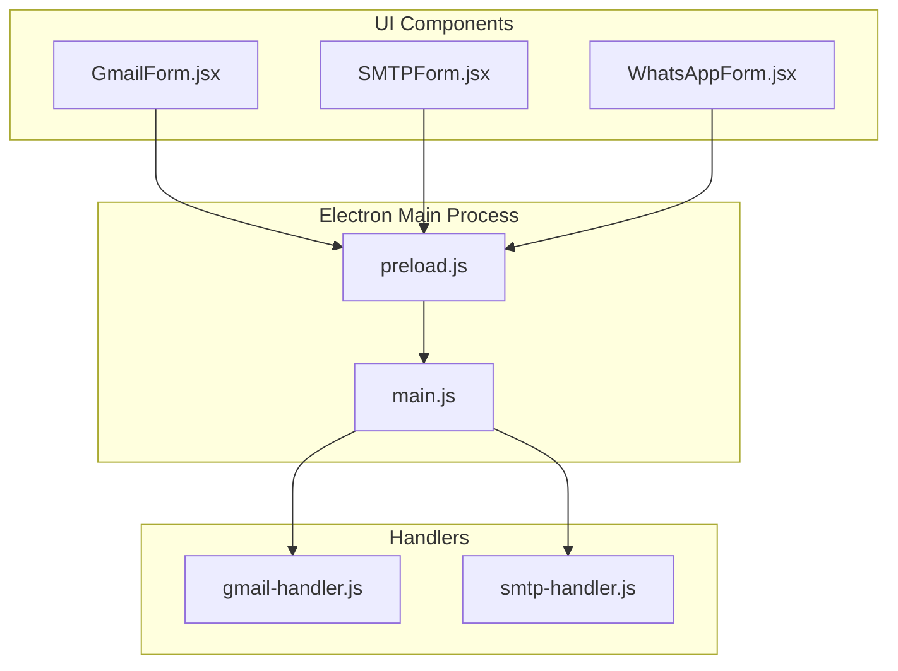
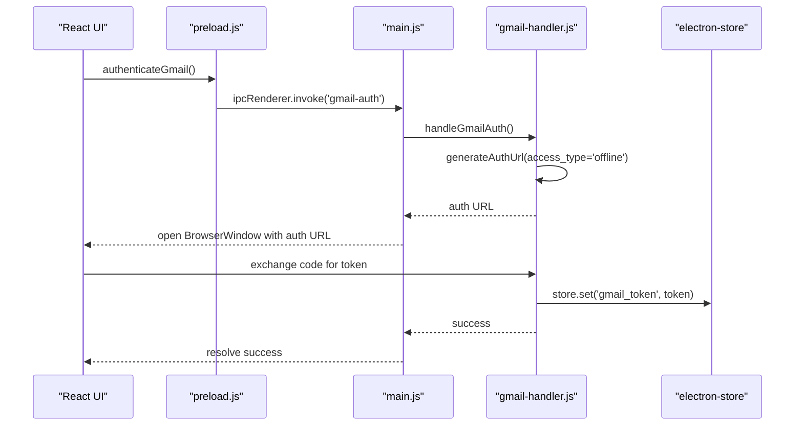
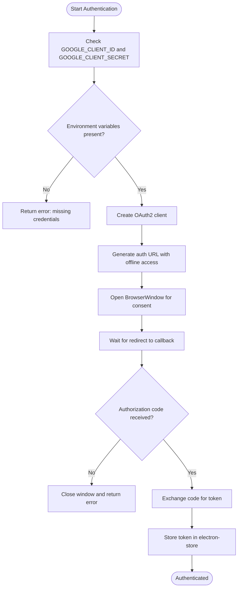
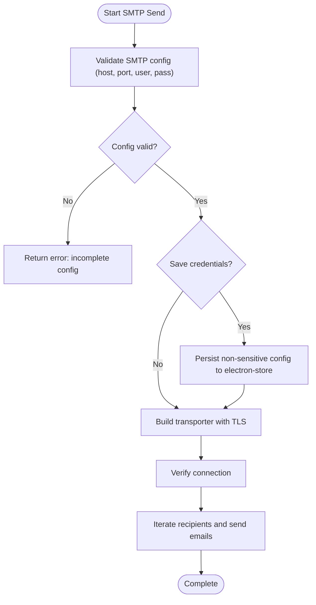
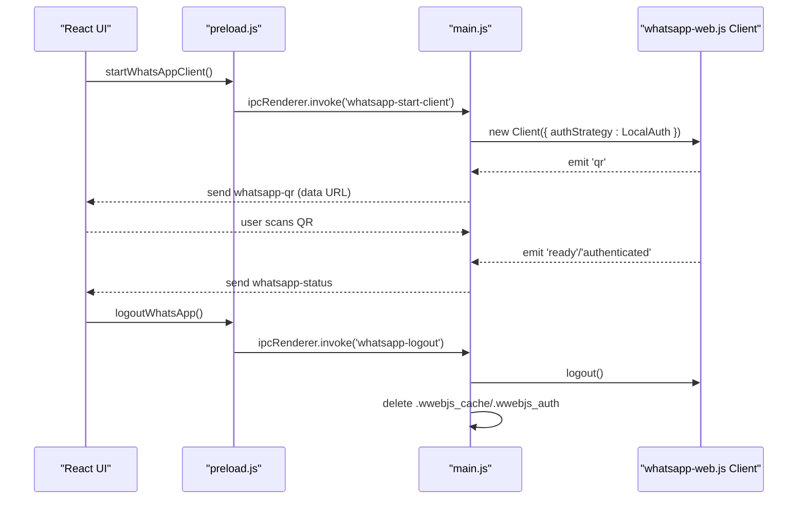
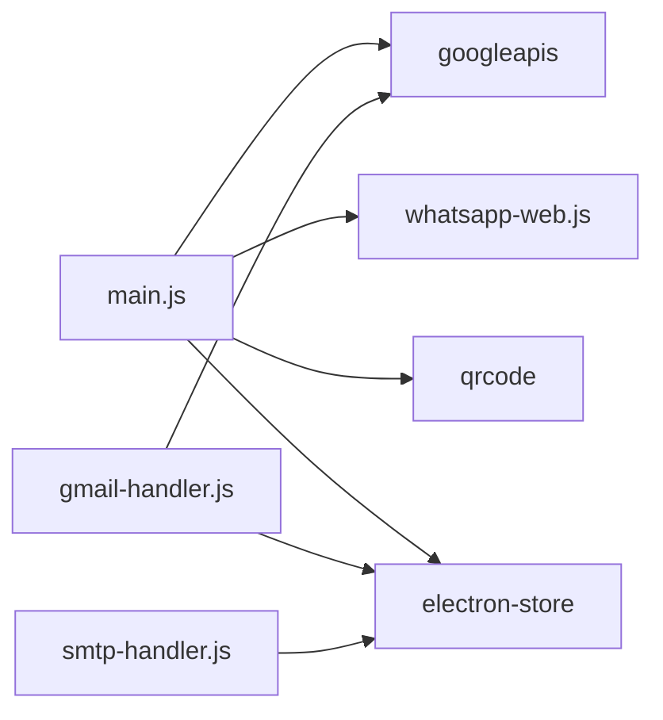

# Authentication Security

<cite>
**Referenced Files in This Document**
- [main.js](file://electron/src/electron/main.js)
- [gmail-handler.js](file://electron/src/electron/gmail-handler.js)
- [smtp-handler.js](file://electron/src/electron/smtp-handler.js)
- [preload.js](file://electron/src/electron/preload.js)
- [GmailForm.jsx](file://electron/src/components/GmailForm.jsx)
- [SMTPForm.jsx](file://electron/src/components/SMTPForm.jsx)
- [WhatsAppForm.jsx](file://electron/src/components/WhatsAppForm.jsx)
- [package.json](file://electron/package.json)
</cite>

## Table of Contents
1. [Introduction](#introduction)
2. [Project Structure](#project-structure)
3. [Core Components](#core-components)
4. [Architecture Overview](#architecture-overview)
5. [Detailed Component Analysis](#detailed-component-analysis)
6. [Dependency Analysis](#dependency-analysis)
7. [Performance Considerations](#performance-considerations)
8. [Troubleshooting Guide](#troubleshooting-guide)
9. [Conclusion](#conclusion)

## Introduction
This document analyzes the authentication security implementations across supported services in the application. It covers:
- OAuth2 authentication security for Gmail API, including token storage, refresh token management, and secure credential handling
- SMTP authentication security, including credential encryption, SSL/TLS enforcement, and secure connection establishment
- Local authentication security for WhatsApp Web using LocalAuth strategy
- Token lifecycle management, expiration handling, and secure storage mechanisms
- Security considerations for API key management, credential rotation, and access control patterns

## Project Structure
The application is an Electron-based desktop app with React UI components and Node.js backend handlers. Authentication flows are implemented in dedicated handler modules and exposed via IPC to the renderer process.

**Diagram sources**
- [main.js](file://electron/src/electron/main.js#L1-L371)
- [gmail-handler.js](file://electron/src/electron/gmail-handler.js#L1-L227)
- [smtp-handler.js](file://electron/src/electron/smtp-handler.js#L1-L110)
- [preload.js](file://electron/src/electron/preload.js#L1-L41)
- [GmailForm.jsx](file://electron/src/components/GmailForm.jsx#L1-L332)
- [SMTPForm.jsx](file://electron/src/components/SMTPForm.jsx#L1-L390)
- [WhatsAppForm.jsx](file://electron/src/components/WhatsAppForm.jsx#L1-L609)

**Section sources**
- [main.js](file://electron/src/electron/main.js#L1-L371)
- [gmail-handler.js](file://electron/src/electron/gmail-handler.js#L1-L227)
- [smtp-handler.js](file://electron/src/electron/smtp-handler.js#L1-L110)
- [preload.js](file://electron/src/electron/preload.js#L1-L41)
- [GmailForm.jsx](file://electron/src/components/GmailForm.jsx#L1-L332)
- [SMTPForm.jsx](file://electron/src/components/SMTPForm.jsx#L1-L390)
- [WhatsAppForm.jsx](file://electron/src/components/WhatsAppForm.jsx#L1-L609)

## Core Components
- Gmail OAuth2 handler: Generates authorization URLs, exchanges authorization codes for tokens, stores tokens securely, and sends emails using stored credentials.
- SMTP handler: Validates configuration, optionally persists non-sensitive config, creates TLS-enabled transporters, verifies connections, and sends emails.
- WhatsApp Web client: Uses LocalAuth strategy for device-linked sessions, QR-based authentication, and automatic cleanup of cached files.

Key security controls observed:
- Environment-based credential loading for Gmail
- Electron Store for encrypted local persistence
- TLS enforcement for SMTP connections
- LocalAuth for isolated device sessions
- Context isolation and web security enabled in BrowserWindow

**Section sources**
- [gmail-handler.js](file://electron/src/electron/gmail-handler.js#L1-L227)
- [smtp-handler.js](file://electron/src/electron/smtp-handler.js#L1-L110)
- [main.js](file://electron/src/electron/main.js#L110-L177)

## Architecture Overview
The authentication architecture separates concerns across main process handlers, renderer IPC exposure, and UI components.

**Diagram sources**
- [gmail-handler.js](file://electron/src/electron/gmail-handler.js#L15-L130)
- [main.js](file://electron/src/electron/main.js#L102-L105)
- [preload.js](file://electron/src/electron/preload.js#L6-L8)

## Detailed Component Analysis

### Gmail OAuth2 Authentication Security
- Credential loading: Client ID and secret are loaded from environment variables, preventing hardcoded secrets in source.
- Authorization flow: Offline access is requested to obtain refresh tokens; consent prompt ensures explicit user approval.
- Token storage: Tokens are persisted using electron-store, which provides OS-level encrypted storage on supported platforms.
- Token usage: Stored tokens are applied to the OAuth2 client before sending emails; missing tokens block email operations.
- Timeout and error handling: Authentication window enforces a 5-minute timeout and handles OAuth errors and missing authorization codes.

**Diagram sources**
- [gmail-handler.js](file://electron/src/electron/gmail-handler.js#L15-L130)

**Section sources**
- [gmail-handler.js](file://electron/src/electron/gmail-handler.js#L1-L227)
- [GmailForm.jsx](file://electron/src/components/GmailForm.jsx#L1-L332)

### SMTP Authentication Security
- Configuration validation: Ensures host, port, user, and password are provided before attempting to connect.
- Optional credential persistence: Non-sensitive configuration (host, port, secure flag, user) can be saved; passwords are intentionally omitted for security.
- Transport creation: Nodemailer transporter configured with TLS; secure flag selects port 465 vs others.
- Certificate handling: TLS verification can be relaxed for self-signed certificates, but this introduces risk and should be used cautiously.
- Connection verification: Transport.verify() confirms connectivity prior to sending.

**Diagram sources**
- [smtp-handler.js](file://electron/src/electron/smtp-handler.js#L6-L110)

**Section sources**
- [smtp-handler.js](file://electron/src/electron/smtp-handler.js#L1-L110)
- [SMTPForm.jsx](file://electron/src/components/SMTPForm.jsx#L1-L390)

### WhatsApp Web Local Authentication Security
- LocalAuth strategy: Uses LocalAuth to maintain device-linked sessions locally, avoiding persistent cloud credentials.
- QR-based authentication: Generates QR codes for user scanning; QR data is transmitted via IPC to the renderer for display.
- Session lifecycle: Automatic cleanup of .wwebjs_cache and .wwebjs_auth directories on startup and logout to remove cached session data.
- Headless browser: Puppeteer runs in headless mode with hardened arguments to reduce attack surface.

**Diagram sources**
- [main.js](file://electron/src/electron/main.js#L110-L177)
- [main.js](file://electron/src/electron/main.js#L342-L371)

**Section sources**
- [main.js](file://electron/src/electron/main.js#L110-L177)
- [main.js](file://electron/src/electron/main.js#L320-L371)
- [WhatsAppForm.jsx](file://electron/src/components/WhatsAppForm.jsx#L1-L609)

## Dependency Analysis
External dependencies relevant to authentication:
- googleapis: Provides OAuth2 client and Gmail API integration
- nodemailer: Handles SMTP transport and TLS
- whatsapp-web.js: Implements WhatsApp Web client with LocalAuth
- electron-store: Provides encrypted local storage for tokens and configs
- qrcode: Converts QR strings to data URLs for display

**Diagram sources**
- [package.json](file://electron/package.json#L20-L31)
- [gmail-handler.js](file://electron/src/electron/gmail-handler.js#L1-L10)
- [smtp-handler.js](file://electron/src/electron/smtp-handler.js#L1-L5)
- [main.js](file://electron/src/electron/main.js#L6-L12)

**Section sources**
- [package.json](file://electron/package.json#L20-L31)

## Performance Considerations
- Gmail rate limiting: Built-in delays between email sends to avoid throttling; adjust delay parameter to balance speed and compliance.
- SMTP batching: Loop-based sending with per-recipient delays; consider batching strategies for very large lists.
- WhatsApp throttling: Delays between message sends and registration checks prevent account restrictions.
- Storage I/O: electron-store writes occur on token exchange and optional config saves; minimize unnecessary writes.

## Troubleshooting Guide
Common issues and resolutions:
- Gmail authentication failures:
  - Missing environment variables: Ensure GOOGLE_CLIENT_ID and GOOGLE_CLIENT_SECRET are set before starting.
  - Timeout or closed window: Increase awareness of 5-minute timeout; reattempt authentication.
  - Missing authorization code: Verify redirect URI and consent flow completion.
- SMTP connection problems:
  - Incomplete configuration: Provide host, port, user, and password.
  - TLS certificate issues: Use secure flag appropriately; avoid disabling certificate verification unless necessary.
  - Connection verification failure: Confirm server settings and network access.
- WhatsApp session issues:
  - QR generation errors: Check QR code rendering and IPC channels.
  - Session cleanup: On logout or app close, cached files are removed; ensure proper shutdown sequences.

**Section sources**
- [gmail-handler.js](file://electron/src/electron/gmail-handler.js#L19-L29)
- [gmail-handler.js](file://electron/src/electron/gmail-handler.js#L66-L72)
- [gmail-handler.js](file://electron/src/electron/gmail-handler.js#L109-L113)
- [smtp-handler.js](file://electron/src/electron/smtp-handler.js#L17-L20)
- [smtp-handler.js](file://electron/src/electron/smtp-handler.js#L42-L44)
- [main.js](file://electron/src/electron/main.js#L342-L371)

## Conclusion
The application implements robust authentication security across services:
- Gmail OAuth2 uses environment-based credentials, offline access for refresh tokens, and encrypted local storage for tokens.
- SMTP authentication enforces TLS, validates configuration, and avoids persisting sensitive data unnecessarily.
- WhatsApp Web employs LocalAuth with QR-based authentication and cleans cached session data to mitigate exposure risks.

Recommended enhancements for production hardening:
- Implement token refresh logic for Gmail when tokens expire
- Enforce certificate verification for SMTP (avoid disabling unauthorized certs)
- Add credential rotation mechanisms and secure secret management
- Introduce access control patterns and audit logs for sensitive operations