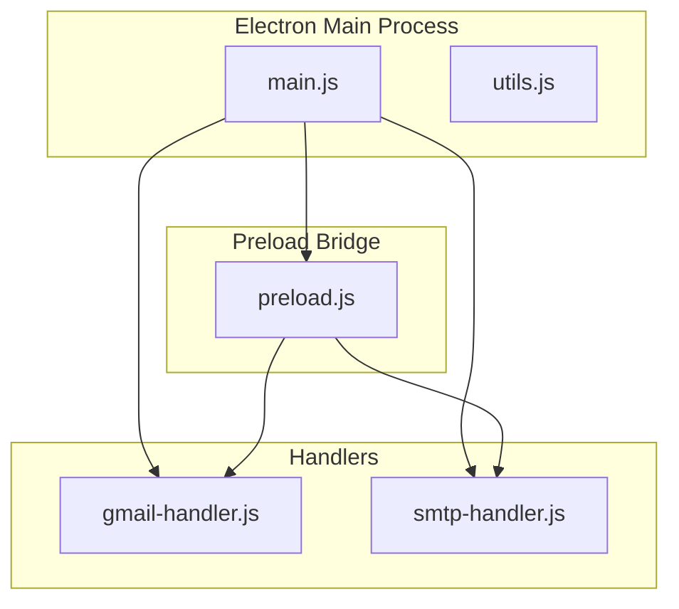
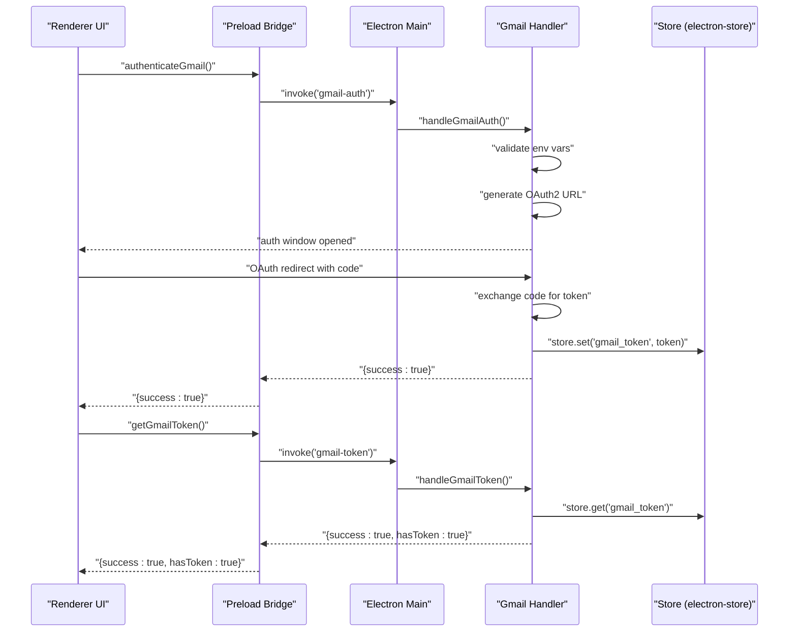
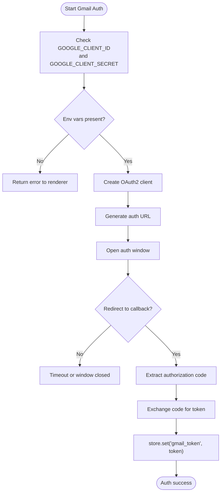
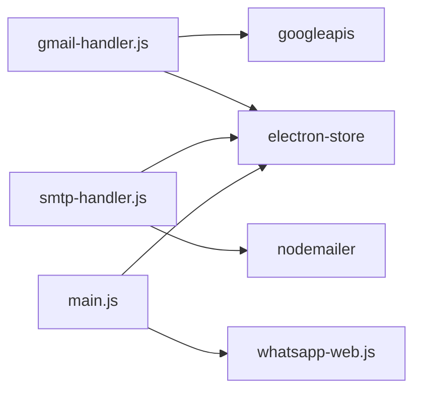

# Credential Storage and Encryption

<cite>
**Referenced Files in This Document**
- [main.js](file://electron/src/electron/main.js)
- [preload.js](file://electron/src/electron/preload.js)
- [gmail-handler.js](file://electron/src/electron/gmail-handler.js)
- [smtp-handler.js](file://electron/src/electron/smtp-handler.js)
- [package.json](file://electron/package.json)
- [README.md](file://README.md)
</cite>

## Table of Contents
1. [Introduction](#introduction)
2. [Project Structure](#project-structure)
3. [Core Components](#core-components)
4. [Architecture Overview](#architecture-overview)
5. [Detailed Component Analysis](#detailed-component-analysis)
6. [Dependency Analysis](#dependency-analysis)
7. [Performance Considerations](#performance-considerations)
8. [Troubleshooting Guide](#troubleshooting-guide)
9. [Conclusion](#conclusion)
10. [Appendices](#appendices)

## Introduction
This document explains how the application securely stores and manages credentials across all authentication methods. It focuses on:
- Use of electron-store for secure credential persistence
- Data serialization and access control
- Encryption strategies for sensitive data, token obfuscation, and secure configuration management
- Lifecycle management of credentials: creation, validation, rotation, and secure deletion
- Security patterns for API keys, OAuth tokens, and SMTP credentials
- Best practices for backup, recovery, and secure sharing between application instances

The project’s README explicitly mentions encrypted storage as a security feature, and the Electron main process integrates electron-store to persist tokens and configurations.

**Section sources**
- [README.md](file://README.md#L333-L341)

## Project Structure
The credential-related logic spans the Electron main process, preload bridge, and handler modules:
- Electron main process initializes the app, sets up IPC handlers, and manages cleanup.
- Preload exposes a controlled API surface to the renderer via contextBridge.
- Handler modules encapsulate authentication flows and credential persistence.

**Diagram sources**
- [main.js](file://electron/src/electron/main.js#L1-L120)
- [preload.js](file://electron/src/electron/preload.js#L1-L41)
- [gmail-handler.js](file://electron/src/electron/gmail-handler.js#L1-L130)
- [smtp-handler.js](file://electron/src/electron/smtp-handler.js#L1-L110)

**Section sources**
- [main.js](file://electron/src/electron/main.js#L1-L120)
- [preload.js](file://electron/src/electron/preload.js#L1-L41)
- [gmail-handler.js](file://electron/src/electron/gmail-handler.js#L1-L130)
- [smtp-handler.js](file://electron/src/electron/smtp-handler.js#L1-L110)

## Core Components
- Electron main process: registers IPC handlers for Gmail, SMTP, and WhatsApp; manages app lifecycle and cleanup.
- Preload bridge: exposes a minimal, typed API to renderer code via contextBridge.
- Gmail handler: orchestrates OAuth2 flow, validates environment variables, persists tokens, and sends emails.
- SMTP handler: validates configuration, optionally persists non-sensitive config, and sends emails.

Key security-relevant points:
- electron-store is used for persistent storage of tokens and configurations.
- Environment variables are required for OAuth2 client credentials.
- Passwords are not persisted in SMTP configuration; only non-sensitive fields are saved.

**Section sources**
- [main.js](file://electron/src/electron/main.js#L102-L109)
- [gmail-handler.js](file://electron/src/electron/gmail-handler.js#L7-L139)
- [smtp-handler.js](file://electron/src/electron/smtp-handler.js#L4-L109)

## Architecture Overview
The credential lifecycle is orchestrated through IPC from the renderer to the main process, which interacts with external services and persists tokens securely.

**Diagram sources**
- [gmail-handler.js](file://electron/src/electron/gmail-handler.js#L15-L139)
- [preload.js](file://electron/src/electron/preload.js#L4-L11)
- [main.js](file://electron/src/electron/main.js#L102-L105)

## Detailed Component Analysis

### Electron Main Process and IPC
- Registers IPC handlers for Gmail, SMTP, and WhatsApp.
- Exposes renderer-safe methods via preload bridge.
- Performs cleanup on app close and logout, including deletion of cached files.

Security implications:
- Centralized IPC registration reduces attack surface in renderer.
- Cleanup routines remove cached authentication artifacts.

**Section sources**
- [main.js](file://electron/src/electron/main.js#L102-L109)
- [main.js](file://electron/src/electron/main.js#L342-L371)

### Preload Bridge (Secure IPC)
- Exposes a typed API surface to renderer code.
- Uses contextBridge to isolate Node.js APIs from renderer.

Security implications:
- Prevents direct access to Node.js modules from renderer.
- Reduces risk of prototype pollution and remote code execution.

**Section sources**
- [preload.js](file://electron/src/electron/preload.js#L1-L41)

### Gmail Handler: OAuth2 and Token Persistence
Responsibilities:
- Validates environment variables for OAuth2 client credentials.
- Generates OAuth2 authorization URL and opens an embedded browser window.
- Handles redirects, extracts authorization code, exchanges for token, and persists it.
- Retrieves stored token for subsequent operations.

Data persistence:
- Uses electron-store to save the token under a dedicated key.
- Token is retrieved from store when sending emails.

Access control:
- Renderer invokes via preload bridge; main process validates and performs OAuth.
- No sensitive data is exposed to renderer.

**Diagram sources**
- [gmail-handler.js](file://electron/src/electron/gmail-handler.js#L15-L139)

**Section sources**
- [gmail-handler.js](file://electron/src/electron/gmail-handler.js#L15-L139)

### SMTP Handler: Configuration and Credential Handling
Responsibilities:
- Validates SMTP configuration fields.
- Optionally persists non-sensitive configuration (host, port, secure, user).
- Sends emails using nodemailer with provided credentials.
- Does not persist passwords.

Data persistence:
- Non-sensitive SMTP config is saved to store for convenience.
- Password remains in memory only.

Access control:
- Renderer passes credentials directly to main process for immediate use.
- No long-term storage of secrets.

**Section sources**
- [smtp-handler.js](file://electron/src/electron/smtp-handler.js#L6-L109)

### WhatsApp Client: Local Authentication
- Uses LocalAuth strategy for session persistence.
- Clears cached files on startup and logout.
- Emits QR codes and status events to renderer.

Security implications:
- Session files are managed by the library; app cleans them on logout.
- QR generation occurs in main process; renderer receives only data URLs.

**Section sources**
- [main.js](file://electron/src/electron/main.js#L110-L177)
- [main.js](file://electron/src/electron/main.js#L320-L340)
- [main.js](file://electron/src/electron/main.js#L342-L371)

## Dependency Analysis
External libraries involved in credential handling:
- electron-store: persistent key-value store for tokens and non-sensitive configs.
- googleapis: OAuth2 client and Gmail API integration.
- nodemailer: SMTP transport and email sending.
- whatsapp-web.js: WhatsApp Web session management with LocalAuth.

**Diagram sources**
- [gmail-handler.js](file://electron/src/electron/gmail-handler.js#L1-L139)
- [smtp-handler.js](file://electron/src/electron/smtp-handler.js#L1-L110)
- [main.js](file://electron/src/electron/main.js#L1-L120)
- [package.json](file://electron/package.json#L20-L31)

**Section sources**
- [package.json](file://electron/package.json#L20-L31)

## Performance Considerations
- Token retrieval and persistence: electron-store operations are lightweight but should be minimized during high-throughput sending.
- Rate limiting: Both Gmail and SMTP handlers include configurable delays to avoid throttling and improve reliability.
- Memory usage: Avoid keeping large credential objects in memory beyond their use window.

[No sources needed since this section provides general guidance]

## Troubleshooting Guide
Common credential-related issues and resolutions:
- Missing environment variables for Gmail OAuth2:
  - Ensure GOOGLE_CLIENT_ID and GOOGLE_CLIENT_SECRET are set in the environment.
- Gmail authentication failures:
  - Verify OAuth consent screen configuration and that the redirect URI matches expectations.
- SMTP configuration errors:
  - Confirm host, port, user, and pass are provided; secure flag matches server requirements.
- WhatsApp logout and cache cleanup:
  - Use the logout IPC to clear session and cached files; errors are handled gracefully.

**Section sources**
- [gmail-handler.js](file://electron/src/electron/gmail-handler.js#L15-L139)
- [smtp-handler.js](file://electron/src/electron/smtp-handler.js#L6-L109)
- [main.js](file://electron/src/electron/main.js#L342-L371)

## Conclusion
The application employs a layered approach to credential security:
- electron-store persists tokens and non-sensitive configurations.
- OAuth2 is handled in the main process with environment-controlled client credentials.
- SMTP credentials are passed directly to the main process without persistent storage of passwords.
- Cleanup routines ensure cached authentication artifacts are removed on logout and app exit.

These practices align with secure defaults: minimize persistent secrets, keep sensitive data in memory, and centralize credential operations in the main process.

[No sources needed since this section summarizes without analyzing specific files]

## Appendices

### Best Practices for Credential Lifecycle
- Creation
  - Use environment variables for OAuth2 client credentials.
  - Persist only non-sensitive configuration; avoid saving passwords.
- Validation
  - Validate configuration fields before establishing connections.
  - Verify token presence and freshness before sending.
- Rotation
  - Re-authenticate via OAuth2 when tokens expire or scopes change.
  - Rotate SMTP credentials periodically and update stored non-sensitive config.
- Secure Deletion
  - Clear tokens and cached files on logout and app shutdown.
  - Remove temporary authentication artifacts.

**Section sources**
- [gmail-handler.js](file://electron/src/electron/gmail-handler.js#L15-L139)
- [smtp-handler.js](file://electron/src/electron/smtp-handler.js#L6-L109)
- [main.js](file://electron/src/electron/main.js#L342-L371)

### Backup and Recovery Procedures
- Back up the electron-store database location (platform-dependent) along with any exported non-sensitive configurations.
- Recovery involves restoring the store and re-authenticating via OAuth2 if necessary.
- For SMTP, re-enter passwords upon restoration.

**Section sources**
- [gmail-handler.js](file://electron/src/electron/gmail-handler.js#L104-L139)
- [smtp-handler.js](file://electron/src/electron/smtp-handler.js#L23-L31)

### Secure Sharing Between Instances
- Avoid sharing persistent credentials across instances; each instance should authenticate independently.
- Use environment variables and local store per-user profile.
- For multi-instance deployments, manage credentials centrally with secure secret management systems outside the app.

[No sources needed since this section provides general guidance]