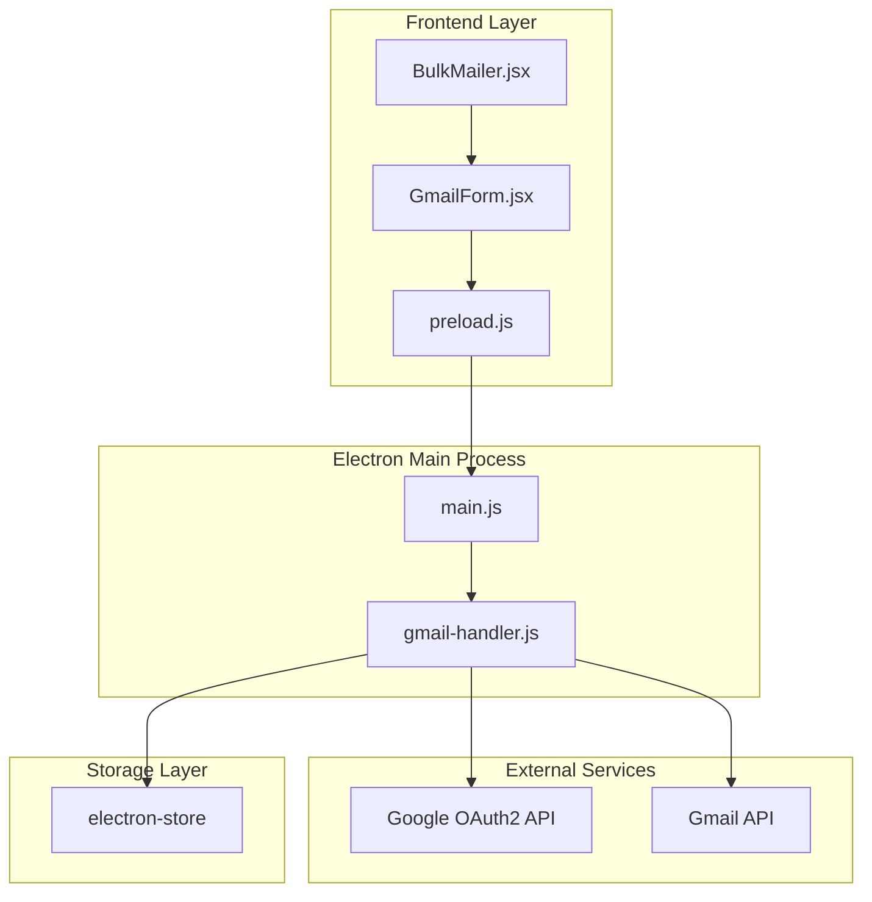
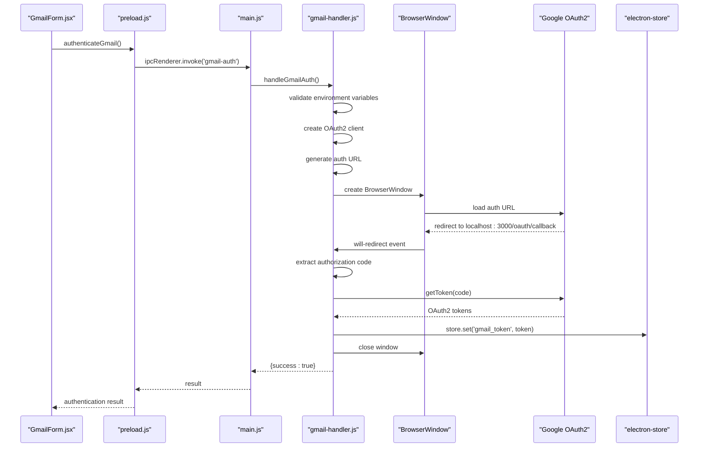
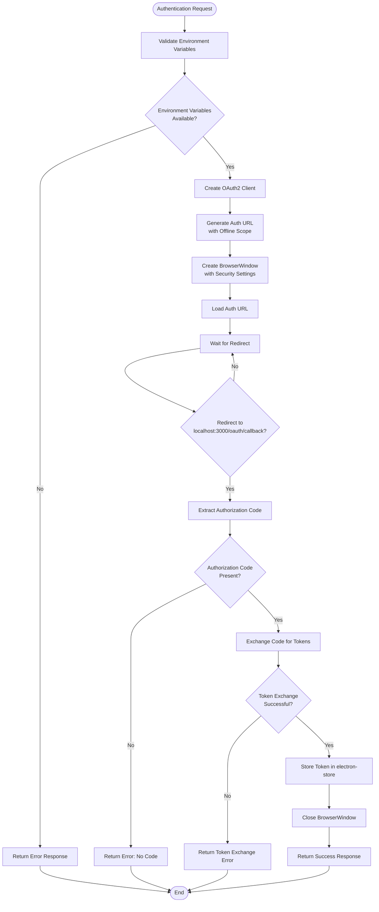
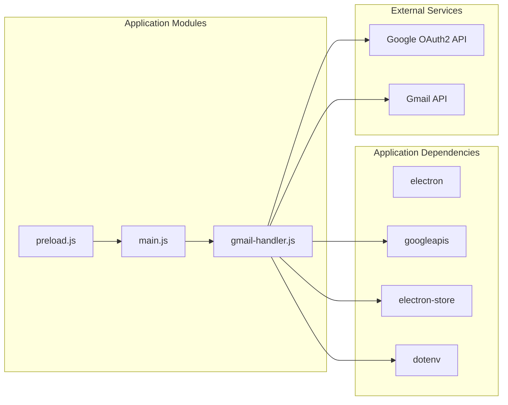

# Gmail OAuth2 Security

<cite>
**Referenced Files in This Document**
- [gmail-handler.js](file://electron/src/electron/gmail-handler.js)
- [main.js](file://electron/src/electron/main.js)
- [preload.js](file://electron/src/electron/preload.js)
- [GmailForm.jsx](file://electron/src/components/GmailForm.jsx)
- [BulkMailer.jsx](file://electron/src/components/BulkMailer.jsx)
- [package.json](file://electron/package.json)
- [README.md](file://README.md)
</cite>

## Table of Contents
1. [Introduction](#introduction)
2. [Project Structure](#project-structure)
3. [Core Components](#core-components)
4. [Architecture Overview](#architecture-overview)
5. [Detailed Component Analysis](#detailed-component-analysis)
6. [Dependency Analysis](#dependency-analysis)
7. [Performance Considerations](#performance-considerations)
8. [Troubleshooting Guide](#troubleshooting-guide)
9. [Conclusion](#conclusion)

## Introduction
This document provides comprehensive documentation for the Gmail OAuth2 authentication security implementation in the bulk messaging application. It covers the complete OAuth2 flow, including client ID/secret configuration, redirect URI setup, consent screen handling, token storage mechanisms using electron-store, refresh token management, and security considerations such as scope limitations and secure token transmission. The implementation leverages Electron's BrowserWindow-based OAuth flow with context isolation and security headers.

## Project Structure
The Gmail OAuth2 implementation spans multiple layers of the application architecture:

**Diagram sources**
- [GmailForm.jsx](file://electron/src/components/GmailForm.jsx#L1-L332)
- [BulkMailer.jsx](file://electron/src/components/BulkMailer.jsx#L1-L482)
- [preload.js](file://electron/src/electron/preload.js#L1-L41)
- [main.js](file://electron/src/electron/main.js#L1-L371)
- [gmail-handler.js](file://electron/src/electron/gmail-handler.js#L1-L227)

**Section sources**
- [GmailForm.jsx](file://electron/src/components/GmailForm.jsx#L1-L332)
- [BulkMailer.jsx](file://electron/src/components/BulkMailer.jsx#L1-L482)
- [preload.js](file://electron/src/electron/preload.js#L1-L41)
- [main.js](file://electron/src/electron/main.js#L1-L371)
- [gmail-handler.js](file://electron/src/electron/gmail-handler.js#L1-L227)

## Core Components
The Gmail OAuth2 implementation consists of several key components working together to provide secure authentication and email sending capabilities:

### OAuth2 Configuration
The system uses a minimal scope focused solely on email sending functionality:
- Scope: `https://www.googleapis.com/auth/gmail.send`
- Redirect URI: `http://localhost:3000/oauth/callback`
- Access type: `offline` for refresh token acquisition
- Consent prompt: `consent` to ensure refresh token retrieval

### Token Storage Mechanism
Credentials are persisted using electron-store with automatic encryption:
- Storage location: Application-specific storage directory
- Encryption: Automatic encryption provided by electron-store
- Token structure: Complete OAuth2 token object including access_token, refresh_token, expires_in, and token_type

### BrowserWindow-Based Authentication Flow
The authentication process utilizes Electron's BrowserWindow with enhanced security:
- Context isolation enabled
- Node.js integration disabled
- Web security enabled
- Window timeout protection (5 minutes)

**Section sources**
- [gmail-handler.js](file://electron/src/electron/gmail-handler.js#L10-L11)
- [gmail-handler.js](file://electron/src/electron/gmail-handler.js#L32-L42)
- [gmail-handler.js](file://electron/src/electron/gmail-handler.js#L47-L55)
- [gmail-handler.js](file://electron/src/electron/gmail-handler.js#L104-L104)

## Architecture Overview
The OAuth2 authentication architecture follows Electron's secure IPC pattern with clear separation of concerns:

**Diagram sources**
- [GmailForm.jsx](file://electron/src/components/GmailForm.jsx#L75-L107)
- [preload.js](file://electron/src/electron/preload.js#L6-L6)
- [main.js](file://electron/src/electron/main.js#L103-L103)
- [gmail-handler.js](file://electron/src/electron/gmail-handler.js#L15-L130)

## Detailed Component Analysis

### Gmail Authentication Handler
The core authentication logic is implemented in the gmail-handler.js module:

#### OAuth2 Client Configuration
The handler creates a Google OAuth2 client with specific security parameters:
- Client ID and Secret loaded from environment variables
- Redirect URI configured for local development
- Scope limited to email sending operations only
- Offline access type for refresh token acquisition

#### BrowserWindow Implementation
The authentication flow uses a dedicated BrowserWindow with enhanced security:
- Context isolation enabled to prevent renderer process compromise
- Node.js integration disabled for security isolation
- Web security enabled to prevent XSS attacks
- Window timeout protection prevents hanging authentication
- Ready-to-show event ensures proper window display

#### Redirect Handling and Error Management
The handler implements robust redirect handling:
- Redirect URL validation against configured redirect URI
- Authorization code extraction from URL parameters
- OAuth error handling with descriptive error messages
- Timeout management with automatic cleanup
- Window closure on completion or failure

#### Token Storage and Retrieval
Token persistence uses electron-store with automatic encryption:
- Token stored under 'gmail_token' key
- Complete token object stored for future use
- Token retrieval for subsequent email operations
- Automatic encryption provided by electron-store

**Diagram sources**
- [gmail-handler.js](file://electron/src/electron/gmail-handler.js#L15-L130)
- [gmail-handler.js](file://electron/src/electron/gmail-handler.js#L74-L125)

**Section sources**
- [gmail-handler.js](file://electron/src/electron/gmail-handler.js#L15-L130)
- [gmail-handler.js](file://electron/src/electron/gmail-handler.js#L132-L139)

### Electron Main Process Integration
The main.js file integrates the Gmail handler through IPC handlers:

#### IPC Handler Registration
The main process registers three key IPC handlers:
- `gmail-auth`: Initiates Gmail authentication flow
- `gmail-token`: Checks for existing authentication
- `send-email`: Sends bulk emails using stored credentials

#### Security Configuration
The main process maintains security through:
- Context isolation in BrowserWindow creation
- Node.js integration disabled in BrowserWindow
- Web security enabled for protection against XSS
- Proper error handling and cleanup

**Section sources**
- [main.js](file://electron/src/electron/main.js#L102-L105)
- [main.js](file://electron/src/electron/main.js#L20-L51)

### Frontend Integration Components
The React components provide user interface and integration points:

#### GmailForm Component
The GmailForm component manages the user-facing authentication interface:
- Authentication status display with visual indicators
- Email list import functionality
- Form validation and error handling
- Real-time progress tracking during email sending

#### BulkMailer Integration
The BulkMailer component coordinates the overall application flow:
- Authentication state management
- Form validation and preparation
- Error handling and user feedback
- Integration with Electron IPC for authentication

**Section sources**
- [GmailForm.jsx](file://electron/src/components/GmailForm.jsx#L1-L332)
- [BulkMailer.jsx](file://electron/src/components/BulkMailer.jsx#L60-L107)

### Preload Script Security Bridge
The preload.js script establishes a secure IPC bridge:
- Exposes only necessary methods to renderer process
- Implements proper error handling and validation
- Provides structured API for authentication operations
- Maintains context isolation while enabling functionality

**Section sources**
- [preload.js](file://electron/src/electron/preload.js#L4-L40)

## Dependency Analysis
The Gmail OAuth2 implementation relies on several key dependencies and external services:

**Diagram sources**
- [package.json](file://electron/package.json#L20-L31)
- [gmail-handler.js](file://electron/src/electron/gmail-handler.js#L2-L5)
- [main.js](file://electron/src/electron/main.js#L6-L7)

### External Dependencies
The implementation depends on:
- **googleapis**: Google API client library for OAuth2 and Gmail API
- **electron-store**: Secure credential storage with automatic encryption
- **dotenv**: Environment variable loading for client credentials
- **electron**: Desktop application framework with BrowserWindow

### Security Dependencies
The security model relies on:
- **Context isolation**: Prevents renderer process compromise
- **Node.js integration disabled**: Reduces attack surface
- **Web security enabled**: Protection against XSS attacks
- **Automatic token encryption**: electron-store encryption for credential protection

**Section sources**
- [package.json](file://electron/package.json#L20-L31)
- [gmail-handler.js](file://electron/src/electron/gmail-handler.js#L2-L5)

## Performance Considerations
The OAuth2 implementation incorporates several performance and scalability considerations:

### Token Management Efficiency
- Single token storage reduces database queries
- Automatic token encryption handled by electron-store
- Minimal memory footprint for token objects
- Efficient redirect handling with timeout protection

### Rate Limiting and Throttling
- Configurable delay between email sends (default 1000ms)
- Progress tracking enables user feedback
- Batch processing with individual error handling
- Graceful degradation on failures

### Resource Management
- BrowserWindow cleanup on completion or timeout
- Memory-efficient token storage
- Proper error handling prevents resource leaks
- Timeout protection prevents hanging processes

## Troubleshooting Guide

### Common Authentication Issues
**Missing Environment Variables**
- Symptom: Authentication returns error about missing client credentials
- Solution: Ensure GOOGLE_CLIENT_ID and GOOGLE_CLIENT_SECRET are set in .env file
- Prevention: Validate environment variables before OAuth2 initialization

**OAuth2 Redirect Problems**
- Symptom: Authentication window closes without completing flow
- Solution: Verify redirect URI matches Google OAuth2 console configuration
- Prevention: Ensure localhost:3000/oauth/callback is whitelisted in OAuth2 consent screen

**Token Storage Failures**
- Symptom: Authentication succeeds but emails fail to send
- Solution: Check electron-store permissions and application data directory
- Prevention: Implement token validation before email operations

### Security Considerations and Best Practices

#### Scope Limitations
The implementation uses minimal required scope:
- Only requests `https://www.googleapis.com/auth/gmail.send`
- Avoids broader scopes that could increase security risk
- Follows principle of least privilege for API access

#### Refresh Token Management
- Uses offline access type to acquire refresh tokens
- Stores complete token objects for seamless renewal
- Handles token expiration transparently through Google API client
- Implements proper cleanup on authentication failures

#### Secure Transmission
- All OAuth2 communication occurs over HTTPS
- Token storage uses electron-store encryption
- BrowserWindow security settings prevent credential leakage
- Context isolation protects against renderer process attacks

#### Error Handling and Recovery
- Comprehensive error handling throughout OAuth2 flow
- Timeout protection prevents hanging authentication
- Graceful degradation on network failures
- User-friendly error messages with actionable guidance

**Section sources**
- [gmail-handler.js](file://electron/src/electron/gmail-handler.js#L20-L29)
- [gmail-handler.js](file://electron/src/electron/gmail-handler.js#L74-L125)
- [gmail-handler.js](file://electron/src/electron/gmail-handler.js#L146-L148)

## Conclusion
The Gmail OAuth2 authentication implementation provides a secure, efficient, and user-friendly solution for integrating Gmail API functionality into the bulk messaging application. The implementation follows Electron security best practices through context isolation, proper IPC handling, and secure credential storage. Key security features include minimal scope usage, refresh token management, automatic encryption, and comprehensive error handling. The modular architecture allows for easy maintenance and extension while maintaining strong security guarantees.

The system successfully balances security requirements with usability, providing users with a straightforward authentication experience while protecting their credentials and maintaining compliance with Google's OAuth2 security guidelines. The implementation serves as a robust foundation for secure email automation in desktop applications.