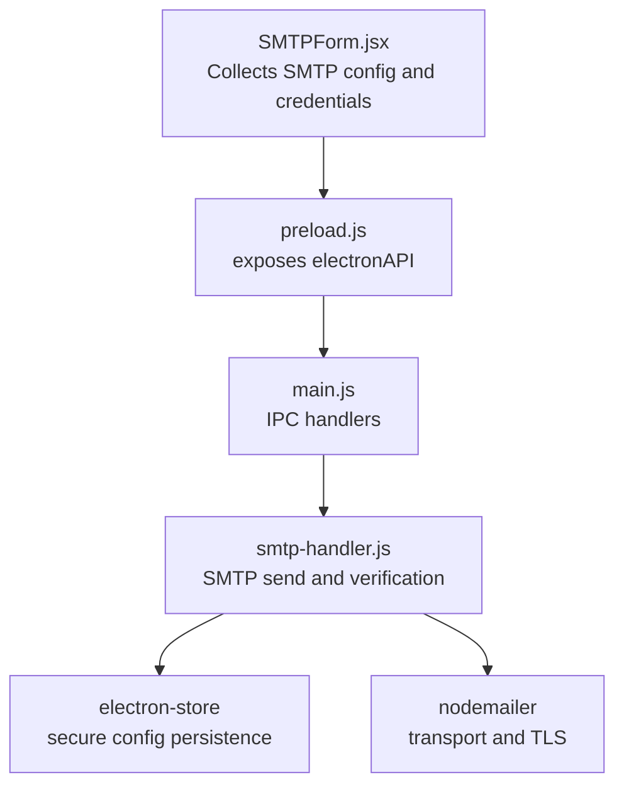
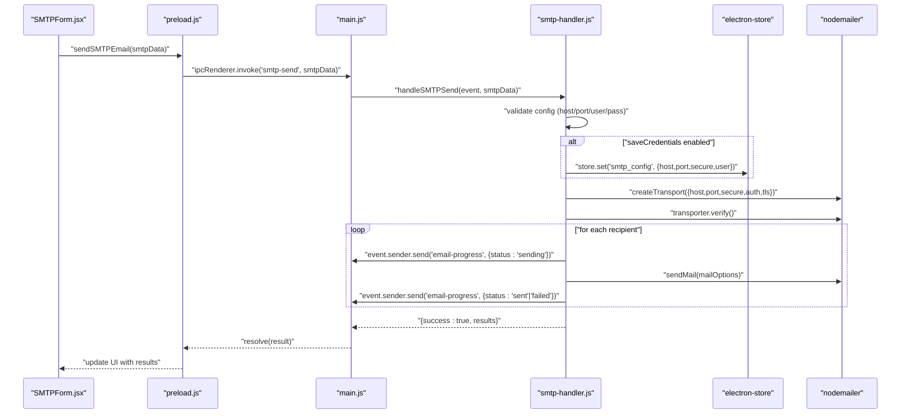
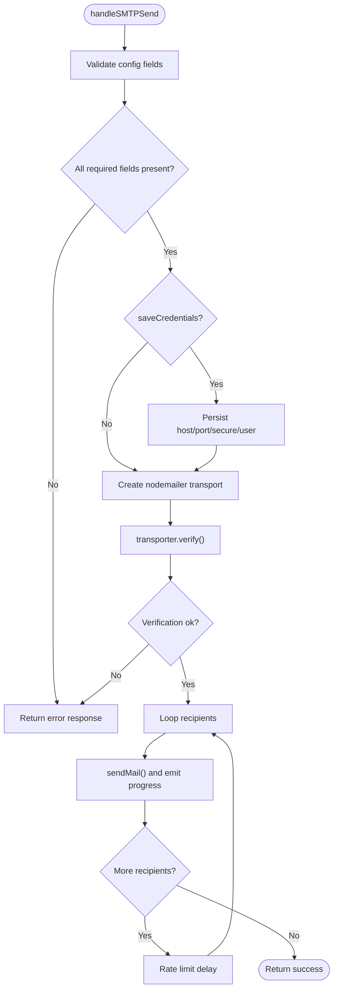
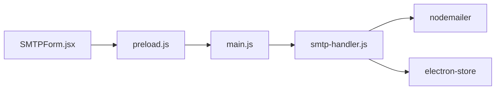

# SMTP Authentication Security

<cite>
**Referenced Files in This Document**
- [smtp-handler.js](file://electron/src/electron/smtp-handler.js)
- [main.js](file://electron/src/electron/main.js)
- [preload.js](file://electron/src/electron/preload.js)
- [SMTPForm.jsx](file://electron/src/components/SMTPForm.jsx)
- [package.json](file://electron/package.json)
- [utils.js](file://electron/src/electron/utils.js)
</cite>

## Table of Contents
1. [Introduction](#introduction)
2. [Project Structure](#project-structure)
3. [Core Components](#core-components)
4. [Architecture Overview](#architecture-overview)
5. [Detailed Component Analysis](#detailed-component-analysis)
6. [Dependency Analysis](#dependency-analysis)
7. [Performance Considerations](#performance-considerations)
8. [Troubleshooting Guide](#troubleshooting-guide)
9. [Conclusion](#conclusion)

## Introduction
This document provides comprehensive security-focused documentation for SMTP authentication and transport within the application. It covers credential storage and encryption using electron-store, SSL/TLS enforcement for secure connections, server verification, and best practices for configuration and troubleshooting. The goal is to help developers and operators deploy secure SMTP functionality while minimizing risk exposure.

## Project Structure
The SMTP security implementation spans three primary areas:
- Electron main process handler for SMTP operations
- Frontend form for collecting SMTP configuration and credentials
- Preload bridge exposing IPC APIs to the renderer

**Diagram sources**
- [SMTPForm.jsx](file://electron/src/components/SMTPForm.jsx#L1-L390)
- [preload.js](file://electron/src/electron/preload.js#L1-L41)
- [main.js](file://electron/src/electron/main.js#L107-L108)
- [smtp-handler.js](file://electron/src/electron/smtp-handler.js#L1-L110)

**Section sources**
- [main.js](file://electron/src/electron/main.js#L1-L371)
- [preload.js](file://electron/src/electron/preload.js#L1-L41)
- [SMTPForm.jsx](file://electron/src/components/SMTPForm.jsx#L1-L390)
- [smtp-handler.js](file://electron/src/electron/smtp-handler.js#L1-L110)

## Core Components
- SMTP handler: Validates configuration, creates a secure transport, verifies connectivity, sends emails, and optionally persists non-sensitive configuration.
- Preload bridge: Exposes a typed API surface to the renderer for SMTP operations.
- Main process: Registers IPC handlers and manages Electron lifecycle.
- Frontend form: Collects SMTP host, port, username, password, and secure flag; disables controls during sending.

Key security-relevant behaviors:
- Credential storage: Only non-secret configuration is persisted via electron-store; passwords are intentionally not stored.
- Transport creation: Uses nodemailer with explicit secure flag and TLS options.
- Connection verification: Calls verify() before sending to detect misconfiguration early.
- Progress events: Emits real-time status updates for monitoring.

**Section sources**
- [smtp-handler.js](file://electron/src/electron/smtp-handler.js#L6-L105)
- [preload.js](file://electron/src/electron/preload.js#L4-L21)
- [main.js](file://electron/src/electron/main.js#L107-L108)
- [SMTPForm.jsx](file://electron/src/components/SMTPForm.jsx#L82-L162)

## Architecture Overview
The SMTP workflow integrates frontend configuration collection, backend transport creation, and secure credential handling.

**Diagram sources**
- [SMTPForm.jsx](file://electron/src/components/SMTPForm.jsx#L288-L312)
- [preload.js](file://electron/src/electron/preload.js#L10-L11)
- [main.js](file://electron/src/electron/main.js#L107-L108)
- [smtp-handler.js](file://electron/src/electron/smtp-handler.js#L6-L105)

## Detailed Component Analysis

### SMTP Handler Security Behavior
- Configuration validation: Ensures host, port, user, and pass are present before proceeding.
- Optional credential persistence: When requested, stores host, port, secure flag, and user; intentionally excludes password.
- Transport creation: Sets secure mode based on user selection and passes credentials; TLS options include rejectUnauthorized toggling.
- Connection verification: Calls verify() to confirm connectivity and basic authentication readiness.
- Per-recipient sending: Emits progress events and applies rate limiting delays between sends.

**Diagram sources**
- [smtp-handler.js](file://electron/src/electron/smtp-handler.js#L6-L105)

**Section sources**
- [smtp-handler.js](file://electron/src/electron/smtp-handler.js#L6-L105)

### Frontend SMTP Form Security Inputs
- Host and Port: Text inputs for server address and numeric port.
- Username/Email: Text input for authentication identity.
- Password: Secure input masked by the browser.
- Secure connection checkbox: Toggles the secure flag used by the transport.

Operational security notes:
- The form disables inputs during sending to prevent mid-operation changes.
- The form does not persist credentials; only the handler supports optional persistence of non-secret fields.

**Section sources**
- [SMTPForm.jsx](file://electron/src/components/SMTPForm.jsx#L82-L162)

### Electron IPC and Security Model
- Preload exposes a minimal API surface to the renderer, reducing attack surface.
- IPC handlers are registered in the main process for SMTP operations.
- The main process enforces context isolation and disables remote module.

**Section sources**
- [preload.js](file://electron/src/electron/preload.js#L4-L21)
- [main.js](file://electron/src/electron/main.js#L20-L31)
- [main.js](file://electron/src/electron/main.js#L107-L108)

### Credential Storage and Encryption
- Non-secret configuration is persisted using electron-store when the user opts-in.
- Passwords are not persisted by design; the handler explicitly avoids storing the password field.
- The store key used is a simple string; encryption behavior depends on the underlying electron-store implementation and platform keychain facilities.

Recommendations:
- Keep saveCredentials opt-in and off by default for most deployments.
- Consider prompting users for explicit confirmation before saving configuration.
- Ensure the application runs with appropriate permissions to leverage OS keychain integration where available.

**Section sources**
- [smtp-handler.js](file://electron/src/electron/smtp-handler.js#L22-L31)
- [smtp-handler.js](file://electron/src/electron/smtp-handler.js#L107-L110)

### SSL/TLS Enforcement and Certificate Validation
Observed behavior:
- The transport is created with a secure flag based on user selection.
- TLS options include a setting that controls certificate rejection behavior.
- The handler performs a connection verification step prior to sending.

Security implications:
- Using the secure flag enables implicit TLS on appropriate ports.
- The TLS option for certificate rejection is configurable; the current implementation sets it to a value that allows self-signed certificates.
- Verification helps detect misconfiguration early but does not replace proper certificate validation.

Best practice recommendations:
- Prefer secure connections (secure flag) for production use.
- Avoid disabling certificate validation in production; keep TLS certificate rejection enabled.
- Ensure the server presents a valid certificate chain recognized by the OS trust store.

**Section sources**
- [smtp-handler.js](file://electron/src/electron/smtp-handler.js#L34-L45)
- [smtp-handler.js](file://electron/src/electron/smtp-handler.js#L47-L48)

### SMTP Server Verification and Authentication Method Validation
- The handler calls a verification routine on the transport before sending emails.
- Authentication credentials are supplied to the transport; errors during verification indicate misconfiguration or invalid credentials.

Operational guidance:
- Run verification in development to catch configuration mistakes quickly.
- Monitor progress events for failed attempts to diagnose server-side issues.

**Section sources**
- [smtp-handler.js](file://electron/src/electron/smtp-handler.js#L47-L48)
- [smtp-handler.js](file://electron/src/electron/smtp-handler.js#L63-L72)

### Security Best Practices for SMTP Configuration
- Ports and TLS:
  - Use port 465 with implicit TLS when available.
  - Use port 587 with explicit TLS (STARTTLS) when 465 is not supported.
  - Disable insecure plaintext ports for authentication.
- STARTTLS:
  - Prefer servers that enforce STARTTLS upgrades.
  - Avoid configurations that disable certificate validation in production.
- Credential handling:
  - Never persist passwords.
  - Use app-specific or OAuth-based credentials when possible.
  - Limit permissions granted to credentials.
- Network and runtime:
  - Enforce context isolation and disable remote modules.
  - Minimize exposed IPC surfaces.
  - Validate and sanitize all user-provided configuration values.

[No sources needed since this section provides general guidance]

## Dependency Analysis
External libraries and their roles in SMTP security:
- nodemailer: Creates and manages transports, handles authentication, and manages TLS.
- electron-store: Provides local storage for non-secret configuration with platform-backed encryption where available.

**Diagram sources**
- [smtp-handler.js](file://electron/src/electron/smtp-handler.js#L1-L2)
- [package.json](file://electron/package.json#L20-L31)
- [preload.js](file://electron/src/electron/preload.js#L4-L11)
- [main.js](file://electron/src/electron/main.js#L6-L7)

**Section sources**
- [package.json](file://electron/package.json#L20-L31)
- [smtp-handler.js](file://electron/src/electron/smtp-handler.js#L1-L2)
- [preload.js](file://electron/src/electron/preload.js#L4-L11)
- [main.js](file://electron/src/electron/main.js#L6-L7)

## Performance Considerations
- Rate limiting: A configurable delay is applied between sends to avoid overwhelming the server and to reduce the chance of throttling.
- Batch size: Consider chunking large recipient lists to balance throughput and reliability.
- Connection reuse: The transport is created per operation; reusing a single transport could improve performance but requires careful error handling.

[No sources needed since this section provides general guidance]

## Troubleshooting Guide
Common SMTP authentication and connection issues:

- Incomplete configuration
  - Symptom: Immediate failure with a configuration error.
  - Cause: Missing host, port, user, or password.
  - Action: Ensure all required fields are filled in the form.

- Authentication failures
  - Symptom: Verification or sendMail errors indicating bad credentials.
  - Causes: Incorrect username/password, disabled 2FA/app-specific passwords, or server policy changes.
  - Actions: Confirm credentials, enable required security settings, and retry verification.

- TLS/certificate errors
  - Symptom: Certificate validation failures or handshake errors.
  - Causes: Self-signed certificates, expired certificates, or mismatched hostnames.
  - Actions: Use a server with a valid certificate chain, or adjust TLS settings only for testing.

- Server verification failures
  - Symptom: Failure during the verification step.
  - Causes: Wrong host/port, firewall restrictions, or server misconfiguration.
  - Actions: Test connectivity externally, verify DNS resolution, and confirm server availability.

- Progress monitoring
  - Use the emitted progress events to track per-recipient status and capture error messages for diagnostics.

**Section sources**
- [smtp-handler.js](file://electron/src/electron/smtp-handler.js#L18-L20)
- [smtp-handler.js](file://electron/src/electron/smtp-handler.js#L47-L48)
- [smtp-handler.js](file://electron/src/electron/smtp-handler.js#L88-L98)

## Conclusion
The application’s SMTP implementation emphasizes secure defaults and explicit user control. It validates configuration, verifies connectivity, and securely handles credentials by avoiding password persistence. For production, prefer secure connections with strict certificate validation, enforce STARTTLS, and apply robust credential policies. The modular architecture isolates sensitive operations in the main process and minimizes exposed surfaces through the preload bridge.