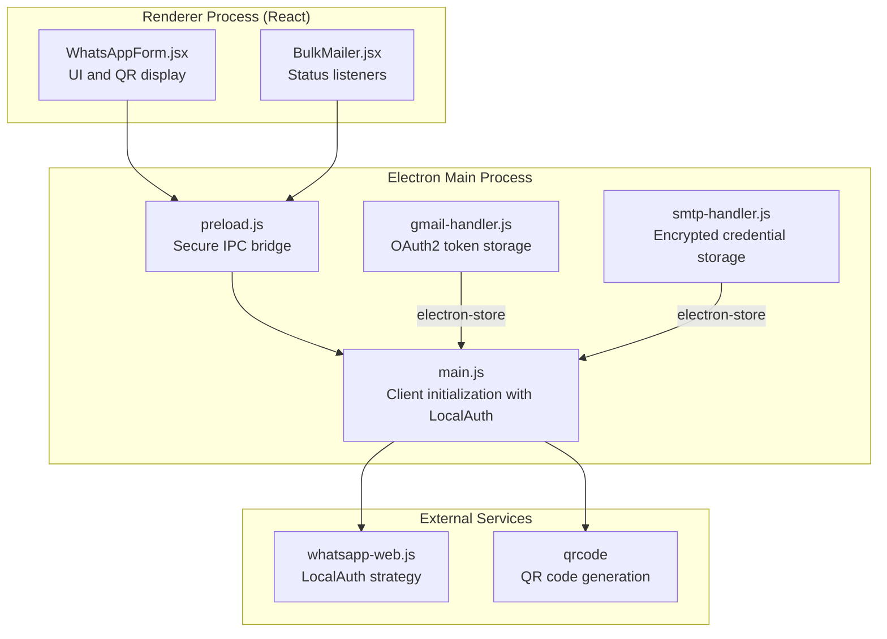
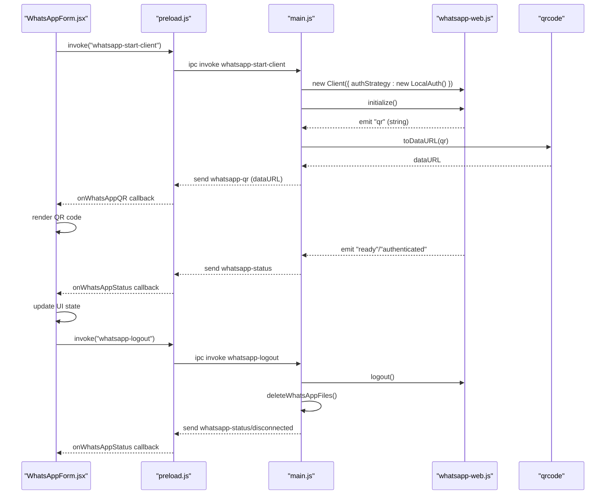
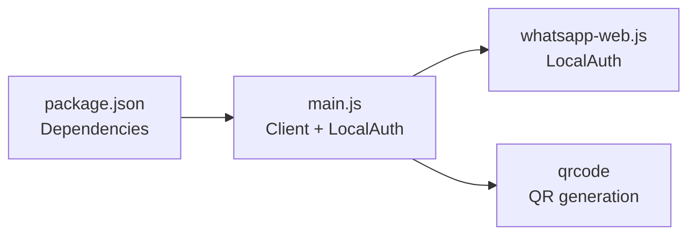

# WhatsApp LocalAuth security

## Introduction
This page explains the WhatsApp Web LocalAuth security implementation in the desktop application. It focuses on how persistent sessions are managed using LocalAuth, how QR code authentication works, and how session tokens are generated and stored. It also covers automatic reconnection mechanisms, security considerations such as session hijacking prevention and unauthorized access protection, and practical troubleshooting guidance for authentication failures and session restoration issues.

## Project structure
The application is an Electron + React desktop app with a dedicated Electron main process that integrates WhatsApp Web via the whatsapp-web.js library. LocalAuth is configured in the main process to persist authentication state locally, enabling automatic reconnection across application restarts.

```mermaid
graph TB
subgraph "Electron Main Process"
MAIN["main.js<br/>Client initialization with LocalAuth"]
PRELOAD["preload.js<br/>Secure IPC bridge"]
GMHL["gmail-handler.js<br/>OAuth2 token storage"]
SMTPH["smtp-handler.js<br/>Encrypted credential storage"]
end
subgraph "Renderer Process (React)"
WA_FORM["WhatsAppForm.jsx<br/>UI and QR display"]
BULK_M["BulkMailer.jsx<br/>Status listeners"]
end
subgraph "External Services"
WWEB["whatsapp-web.js<br/>LocalAuth strategy"]
QR["qrcode<br/>QR code generation"]
end
WA_FORM --> PRELOAD
BULK_M --> PRELOAD
PRELOAD --> MAIN
MAIN --> WWEB
MAIN --> QR
GMHL --> |"electron-store"| MAIN
SMTPH --> |"electron-store"| MAIN
```

## Core components
- LocalAuth-based Client: The main process creates a WhatsApp client with LocalAuth to persist authentication state automatically.
- QR Code Authentication: The main process emits QR events, which are converted to data URLs and sent to the renderer for display.
- Session Cleanup: Dedicated cleanup routines remove cached and auth directories to prevent stale session reuse.
- Secure IPC Bridge: The preload script exposes only necessary methods to the renderer, reducing attack surface.
- UI Integration: The React components listen for status and QR updates, displaying connection state and QR code to the user.

Key implementation references:
- LocalAuth configuration and event handling: `main.js`
- QR code generation and transmission: `main.js`
- Session cleanup on logout and app lifecycle: `main.js`
- Secure IPC exposure: `preload.js`
- UI status and QR rendering: `WhatsAppForm.jsx`, `BulkMailer.jsx`

## Architecture overview
The LocalAuth strategy enables persistent sessions by storing authentication artifacts in a local directory. The main process initializes the client with LocalAuth, listens for QR and status events, and forwards them to the renderer via IPC. The renderer displays the QR code and updates the UI state. On logout or app shutdown, the application cleans up cached and auth directories to prevent unauthorized reuse.

```mermaid
sequenceDiagram
participant UI as "WhatsAppForm.jsx"
participant Preload as "preload.js"
participant Main as "main.js"
participant WWeb as "whatsapp-web.js"
participant QR as "qrcode"
UI->>Preload : invoke("whatsapp-start-client")
Preload->>Main : ipc invoke whatsapp-start-client
Main->>WWeb : new Client({ authStrategy : new LocalAuth() })
Main->>WWeb : initialize()
WWeb-->>Main : emit "qr" (string)
Main->>QR : toDataURL(qr)
QR-->>Main : dataURL
Main-->>Preload : send whatsapp-qr (dataURL)
Preload-->>UI : onWhatsAppQR callback
UI->>UI : render QR code
WWeb-->>Main : emit "ready"/"authenticated"
Main-->>Preload : send whatsapp-status
Preload-->>UI : onWhatsAppStatus callback
UI->>UI : update UI state
UI->>Preload : invoke("whatsapp-logout")
Preload->>Main : ipc invoke whatsapp-logout
Main->>WWeb : logout()
Main->>Main : deleteWhatsAppFiles()
Main-->>Preload : send whatsapp-status/disconnected
Preload-->>UI : onWhatsAppStatus callback
```

## Detailed component analysis

### LocalAuth strategy and persistent sessions
- Strategy: LocalAuth persists authentication state in a local directory, enabling automatic reconnection when the client starts again.
- Directory cleanup: The application deletes cached and auth directories on startup and logout to ensure fresh or cleaned sessions.
- Event-driven lifecycle: The main process emits status and QR events, allowing the renderer to reflect current state.

Security implications:
- Local storage: Session artifacts are stored locally; protect the application directory and restrict filesystem access.
- Cleanup on exit: Deleting auth directories prevents session hijacking via stale artifacts.

References:
- Client creation with LocalAuth: `main.js`
- Startup cleanup: `main.js`
- Logout cleanup: `main.js`
- Disconnection cleanup: `main.js`

### QR code authentication security
- QR generation: The main process converts the QR string to a data URL using the qrcode library and sends it to the renderer.
- Renderer display: The UI renders the QR code image and handles loading errors gracefully.
- Security considerations:
  - QR is ephemeral; ensure it is cleared upon authentication success.
  - Avoid exposing QR data outside the renderer via IPC channels.

References:
- QR event emission and data URL conversion: `main.js`
- QR UI rendering and error handling: `WhatsAppForm.jsx`

### Session token generation and storage
- Token generation: LocalAuth generates and manages session tokens internally for persistent authentication.
- Storage location: Tokens are stored in a local directory managed by LocalAuth.
- No manual token manipulation: The implementation relies on the library's internal handling of tokens and artifacts.

References:
- LocalAuth usage: `main.js`

### Automatic reconnection mechanisms
- Ready/authentication events: The main process listens for "ready" and "authenticated" events and clears the QR display upon success.
- UI feedback: The renderer updates the status and removes the QR overlay when the client becomes ready.

References:
- Event handling: `main.js`
- UI state updates: `WhatsAppForm.jsx`

### Security considerations
- Session hijacking prevention:
  - Clean up cached and auth directories on logout and app close to prevent reuse of stale artifacts.
  - Avoid exposing QR data outside the renderer; rely on IPC for minimal data transfer.
- Unauthorized access protection:
  - Restrict filesystem permissions on the application directory.
  - Use secure IPC to prevent malicious renderer access to sensitive operations.
- Secure session cleanup:
  - Centralized cleanup functions ensure consistent removal of session artifacts.

References:
- Cleanup functions: `main.js`
- Secure IPC: `preload.js`

### Configuration options and persistence across restarts
- LocalAuth configuration: The client is initialized with LocalAuth, enabling automatic session restoration.
- Application lifecycle hooks: Startup and shutdown routines manage cleanup to maintain a clean state.
- UI state persistence: The renderer maintains UI state (status, QR, results) but does not store sensitive session data.

References:
- LocalAuth configuration: `main.js`
- Lifecycle cleanup: `main.js`, `main.js`, `main.js`
- UI persistence: `WhatsAppForm.jsx`

## Dependency analysis
The LocalAuth implementation depends on the whatsapp-web.js library and related utilities. The Electron main process orchestrates client lifecycle and IPC, while the renderer handles UI updates.

```mermaid
graph LR
PJSON["package.json<br/>Dependencies"]
MAIN["main.js<br/>Client + LocalAuth"]
WWEB["whatsapp-web.js<br/>LocalAuth"]
QR["qrcode<br/>QR generation"]
PJSON --> MAIN
MAIN --> WWEB
MAIN --> QR
```

## Performance considerations
- Headless browser: The client runs in headless mode to reduce resource usage.
- Minimal IPC overhead: Only essential events (status, QR) are transmitted to the renderer.
- Cleanup timing: Cleanup occurs on startup and shutdown to avoid accumulating stale artifacts.

[No sources needed since this section provides general guidance]

## Troubleshooting guide
Common issues and resolutions for authentication failures and session restoration problems:

- QR code not loading
  - Symptoms: Empty QR area or error message in UI.
  - Actions: Retry connection, check network connectivity, and verify QR event handling.
  - References: `main.js`, `WhatsAppForm.jsx`

- Authentication failure
  - Symptoms: "Authentication failed" status messages.
  - Actions: Clear cached and auth directories, restart the client, and ensure device is linked.
  - References: `main.js`, `main.js`

- Session not restored on restart
  - Symptoms: Requires scanning QR on every launch.
  - Actions: Verify LocalAuth directory exists and is writable; ensure startup cleanup is not removing artifacts prematurely.
  - References: `main.js`, `main.js`

- Logout issues
  - Symptoms: Stuck in "Connected" state after logout.
  - Actions: Trigger logout IPC handler; confirm cleanup of cached and auth directories.
  - References: `main.js`, `preload.js`

- Disconnection handling
  - Symptoms: "Client disconnected" status.
  - Actions: Restart client; verify network stability and event listeners.
  - References: `main.js`

## Conclusion
The application implements WhatsApp Web LocalAuth to achieve persistent sessions with QR code-based authentication. The main process manages client lifecycle, QR generation, and secure cleanup of session artifacts, while the renderer provides user feedback and status updates. By combining LocalAuth with reliable cleanup routines and secure IPC, the system balances convenience with security. Proper troubleshooting practices and awareness of session storage implications help maintain reliable and secure operation.
