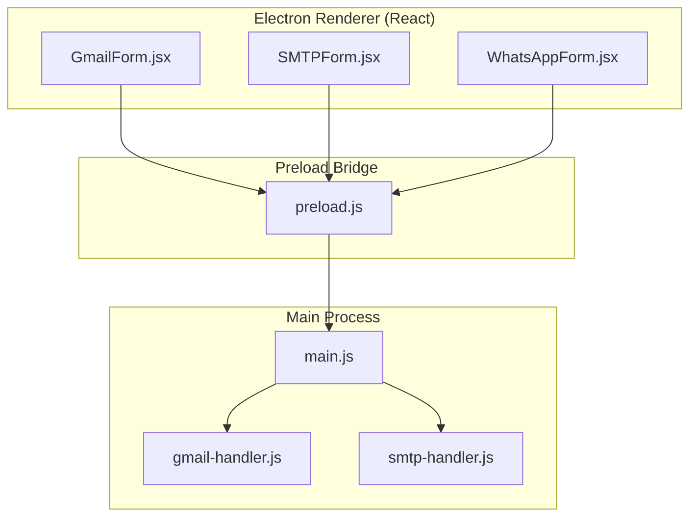
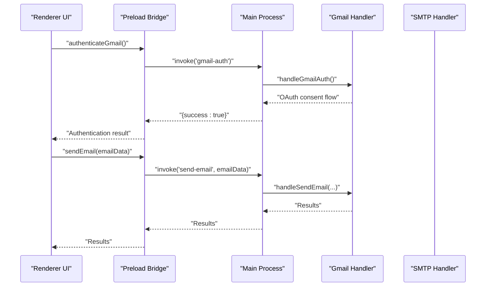
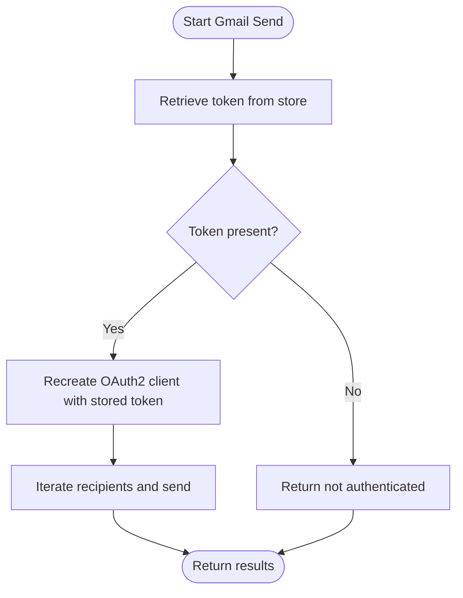
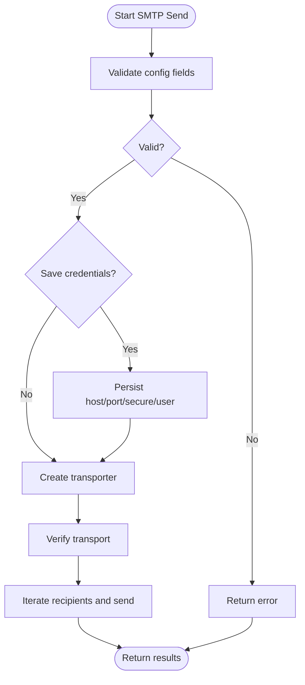
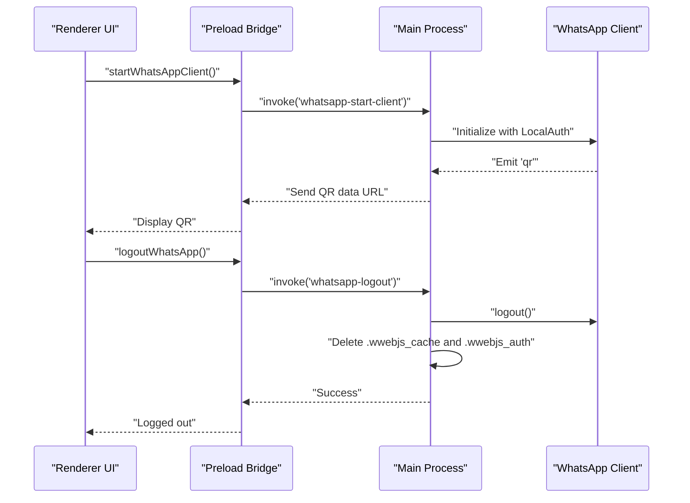
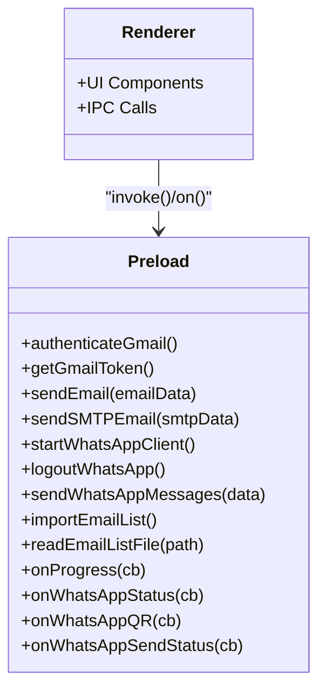
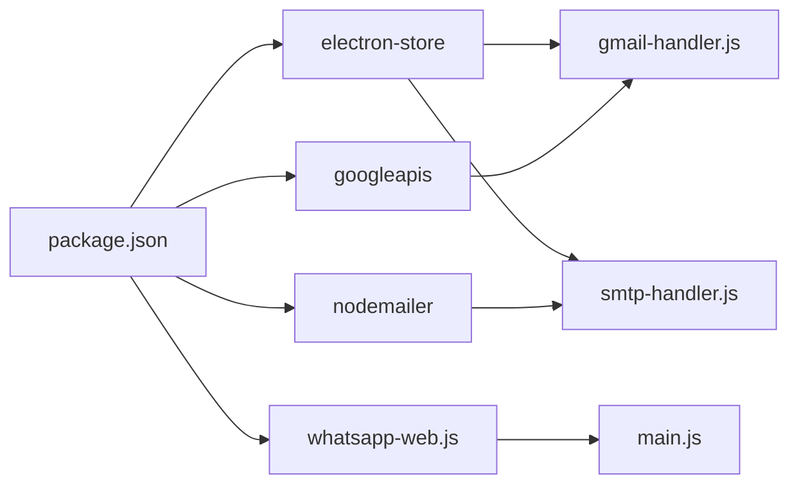

# Credential Storage and Encryption

<cite>
**Referenced Files in This Document**
- [README.md](file://README.md)
- [main.js](file://electron/src/electron/main.js)
- [preload.js](file://electron/src/electron/preload.js)
- [gmail-handler.js](file://electron/src/electron/gmail-handler.js)
- [smtp-handler.js](file://electron/src/electron/smtp-handler.js)
- [GmailForm.jsx](file://electron/src/components/GmailForm.jsx)
- [SMTPForm.jsx](file://electron/src/components/SMTPForm.jsx)
- [WhatsAppForm.jsx](file://electron/src/components/WhatsAppForm.jsx)
- [package.json](file://electron/package.json)
- [localhost/app.py](file://localhost/app.py)
</cite>

## Table of Contents
1. [Introduction](#introduction)
2. [Project Structure](#project-structure)
3. [Core Components](#core-components)
4. [Architecture Overview](#architecture-overview)
5. [Detailed Component Analysis](#detailed-component-analysis)
6. [Dependency Analysis](#dependency-analysis)
7. [Performance Considerations](#performance-considerations)
8. [Troubleshooting Guide](#troubleshooting-guide)
9. [Conclusion](#conclusion)

## Introduction
This document explains how the application securely stores and manages credentials for OAuth2 (Gmail), SMTP, and WhatsApp authentication. It covers the storage mechanisms, encryption practices, key management, secure retrieval, and lifecycle management from creation to destruction. It also documents platform-specific protections and outlines security considerations for backups, recovery, and secure deletion.

## Project Structure
The credential-related logic spans the Electron main process, preload bridge, and React UI components:
- Electron main process initializes and manages the WhatsApp client and IPC handlers.
- Preload exposes a secure API surface to the renderer.
- Handlers manage Gmail OAuth2 tokens and SMTP configurations.
- UI components collect user inputs and trigger secure operations.

**Diagram sources**
- [GmailForm.jsx](file://electron/src/components/GmailForm.jsx#L1-L332)
- [SMTPForm.jsx](file://electron/src/components/SMTPForm.jsx#L1-L390)
- [WhatsAppForm.jsx](file://electron/src/components/WhatsAppForm.jsx#L1-L609)
- [preload.js](file://electron/src/electron/preload.js#L1-L41)
- [main.js](file://electron/src/electron/main.js#L1-L371)
- [gmail-handler.js](file://electron/src/electron/gmail-handler.js#L1-L227)
- [smtp-handler.js](file://electron/src/electron/smtp-handler.js#L1-L110)

**Section sources**
- [README.md](file://README.md#L333-L341)
- [main.js](file://electron/src/electron/main.js#L1-L371)
- [preload.js](file://electron/src/electron/preload.js#L1-L41)
- [gmail-handler.js](file://electron/src/electron/gmail-handler.js#L1-L227)
- [smtp-handler.js](file://electron/src/electron/smtp-handler.js#L1-L110)
- [GmailForm.jsx](file://electron/src/components/GmailForm.jsx#L1-L332)
- [SMTPForm.jsx](file://electron/src/components/SMTPForm.jsx#L1-L390)
- [WhatsAppForm.jsx](file://electron/src/components/WhatsAppForm.jsx#L1-L609)

## Core Components
- Gmail OAuth2 token storage: Tokens are persisted locally and refreshed transparently when needed.
- SMTP configuration storage: Host/port/secure/user are saved; passwords are intentionally not stored.
- WhatsApp authentication: Uses local authentication strategy and cleans cache/auth files on logout/close.
- Secure IPC bridge: Renderer cannot directly access Node.js APIs; only whitelisted methods are exposed.

Key security features highlighted in the project:
- Context isolation and secure IPC
- OAuth2 for Gmail
- Encrypted storage for sensitive data
- Input validation and rate limiting

**Section sources**
- [README.md](file://README.md#L333-L341)
- [gmail-handler.js](file://electron/src/electron/gmail-handler.js#L104-L105)
- [smtp-handler.js](file://electron/src/electron/smtp-handler.js#L22-L31)
- [main.js](file://electron/src/electron/main.js#L320-L340)

## Architecture Overview
The credential lifecycle is orchestrated through the renderer UI, the preload bridge, and the main process handlers. The UI collects inputs, the preload exposes safe IPC methods, and the main process persists or retrieves credentials securely.

**Diagram sources**
- [GmailForm.jsx](file://electron/src/components/GmailForm.jsx#L1-L332)
- [preload.js](file://electron/src/electron/preload.js#L4-L11)
- [main.js](file://electron/src/electron/main.js#L102-L108)
- [gmail-handler.js](file://electron/src/electron/gmail-handler.js#L15-L130)
- [gmail-handler.js](file://electron/src/electron/gmail-handler.js#L141-L214)

## Detailed Component Analysis

### Gmail OAuth2 Token Storage
- Token persistence: The handler stores the OAuth2 token using a secure local store after successful consent.
- Retrieval: On subsequent sends, the token is retrieved from the store and applied to the OAuth2 client.
- Refresh behavior: The handler reconstructs the OAuth2 client with stored credentials for sending emails.

**Diagram sources**
- [gmail-handler.js](file://electron/src/electron/gmail-handler.js#L132-L139)
- [gmail-handler.js](file://electron/src/electron/gmail-handler.js#L141-L214)

**Section sources**
- [gmail-handler.js](file://electron/src/electron/gmail-handler.js#L104-L105)
- [gmail-handler.js](file://electron/src/electron/gmail-handler.js#L132-L139)
- [gmail-handler.js](file://electron/src/electron/gmail-handler.js#L141-L214)

### SMTP Credentials Storage
- Configuration persistence: When requested, the handler saves host, port, secure flag, and user to the store.
- Password handling: The password is not persisted; it remains in memory during the operation and is not written to disk.
- Transport verification: The handler verifies connectivity before sending.

**Diagram sources**
- [smtp-handler.js](file://electron/src/electron/smtp-handler.js#L6-L105)
- [smtp-handler.js](file://electron/src/electron/smtp-handler.js#L107-L110)

**Section sources**
- [smtp-handler.js](file://electron/src/electron/smtp-handler.js#L18-L21)
- [smtp-handler.js](file://electron/src/electron/smtp-handler.js#L22-L31)
- [smtp-handler.js](file://electron/src/electron/smtp-handler.js#L33-L48)

### WhatsApp Authentication Data Lifecycle
- Initialization: The main process creates a WhatsApp client with a local authentication strategy.
- QR generation: QR codes are generated and sent to the renderer for scanning.
- Logout and cleanup: On logout or app close, the handler deletes cached and auth directories to remove traces.

**Diagram sources**
- [main.js](file://electron/src/electron/main.js#L110-L177)
- [main.js](file://electron/src/electron/main.js#L342-L371)
- [preload.js](file://electron/src/electron/preload.js#L23-L39)

**Section sources**
- [main.js](file://electron/src/electron/main.js#L110-L177)
- [main.js](file://electron/src/electron/main.js#L320-L340)
- [main.js](file://electron/src/electron/main.js#L342-L371)

### Secure IPC Bridge and Renderer Exposure
- The preload script exposes a limited API surface to the renderer, preventing direct access to Node.js modules.
- Renderer invokes methods like authenticateGmail, sendEmail, sendSMTPEmail, and WhatsApp controls via invoke/on patterns.

**Diagram sources**
- [preload.js](file://electron/src/electron/preload.js#L4-L40)

**Section sources**
- [preload.js](file://electron/src/electron/preload.js#L1-L41)

### UI Credential Collection Patterns
- GmailForm: Initiates OAuth consent and displays authentication status.
- SMTPForm: Collects host, port, user, password, and optional SSL/TLS toggle; supports saving non-secret config.
- WhatsAppForm: Manages connection lifecycle and displays QR code and logs.

**Section sources**
- [GmailForm.jsx](file://electron/src/components/GmailForm.jsx#L1-L332)
- [SMTPForm.jsx](file://electron/src/components/SMTPForm.jsx#L1-L390)
- [WhatsAppForm.jsx](file://electron/src/components/WhatsAppForm.jsx#L1-L609)

## Dependency Analysis
- Electron dependencies include electron-store for secure local storage, googleapis for OAuth2, nodemailer for SMTP, and whatsapp-web.js for WhatsApp integration.
- The preload and main process depend on these modules to implement secure credential handling.

**Diagram sources**
- [package.json](file://electron/package.json#L20-L31)
- [gmail-handler.js](file://electron/src/electron/gmail-handler.js#L1-L14)
- [smtp-handler.js](file://electron/src/electron/smtp-handler.js#L1-L5)
- [main.js](file://electron/src/electron/main.js#L8-L12)

**Section sources**
- [package.json](file://electron/package.json#L20-L31)

## Performance Considerations
- Token reuse: Reusing stored tokens avoids repeated OAuth flows, reducing latency.
- Transport verification: Verifying SMTP connectivity once before sending improves throughput.
- Rate limiting: Delays between sends mitigate provider throttling and improve reliability.

[No sources needed since this section provides general guidance]

## Troubleshooting Guide
Common credential-related issues and resolutions:
- Gmail authentication failures: Verify environment variables and OAuth consent flow completion.
- Missing token errors: Ensure the token was stored after consent and that the store is accessible.
- SMTP connection issues: Confirm host/port/security settings and that the transport verifies successfully.
- WhatsApp QR loading problems: Retry initialization and check network connectivity.
- Cleanup after logout: Ensure cache and auth directories are deleted on logout or app close.

**Section sources**
- [gmail-handler.js](file://electron/src/electron/gmail-handler.js#L16-L130)
- [gmail-handler.js](file://electron/src/electron/gmail-handler.js#L141-L214)
- [smtp-handler.js](file://electron/src/electron/smtp-handler.js#L6-L105)
- [main.js](file://electron/src/electron/main.js#L320-L340)
- [main.js](file://electron/src/electron/main.js#L342-L371)

## Conclusion
The application implements secure credential handling by:
- Using OAuth2 for Gmail with token storage and retrieval
- Persisting minimal SMTP configuration while excluding passwords
- Leveraging local authentication for WhatsApp and cleaning cache/auth directories on logout
- Enforcing a secure IPC bridge to prevent renderer-side exposure of sensitive operations

These practices align with the documented security features and provide a robust foundation for protecting sensitive data across platforms.