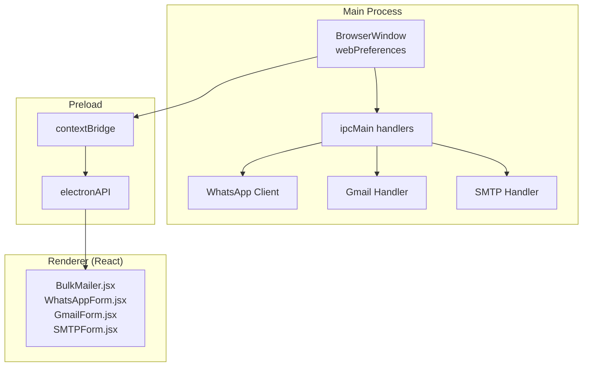
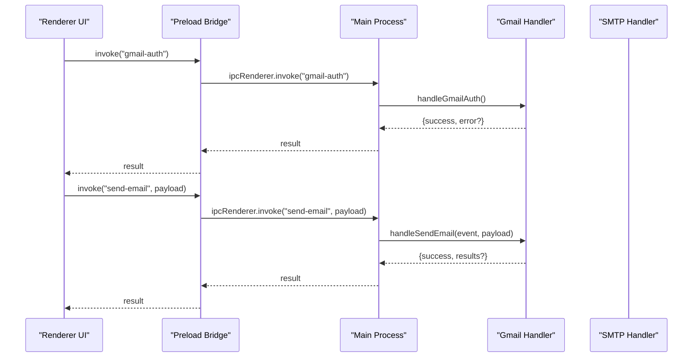
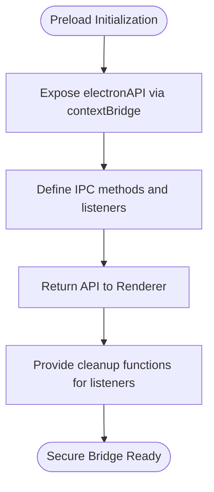
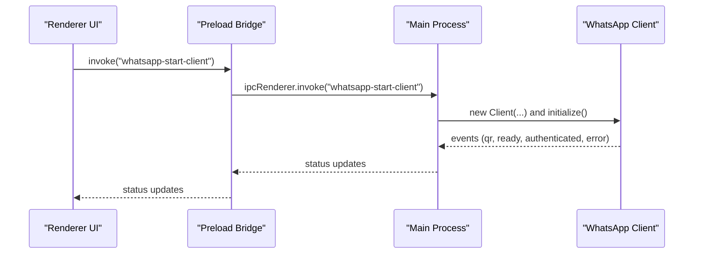
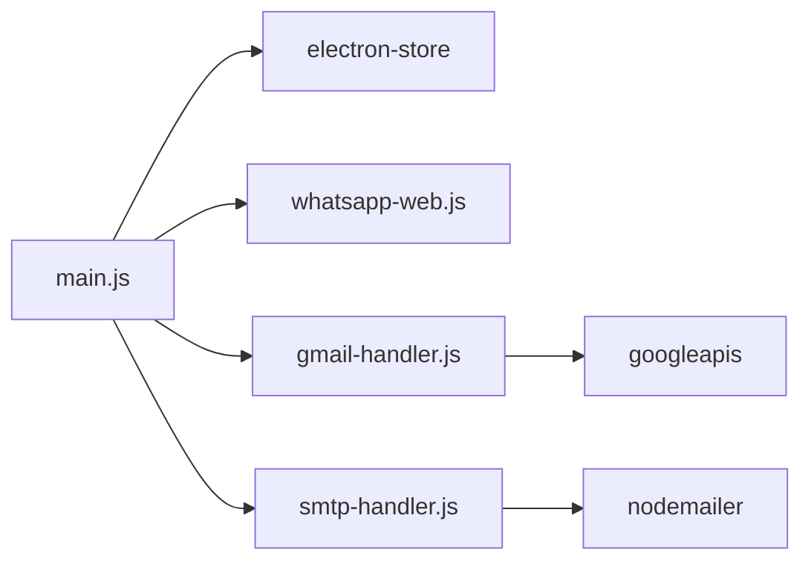

# Electron security model

## Introduction
This page provides detailed security documentation for the Electron application's security model. It focuses on context isolation configuration, nodeIntegration and webPreferences hardening, preload script security architecture, IPC communication patterns, webSecurity implications, remote module restrictions, sandboxing techniques, privilege separation between main and renderer processes, and best practices for secure Electron development. It also covers vulnerability mitigation strategies, compliance considerations, and common pitfalls with prevention methods.

## Project structure
The Electron application follows a clear separation of concerns:
- Main process: Initializes BrowserWindow, configures webPreferences, registers IPC handlers, and manages external integrations (WhatsApp, Gmail, SMTP).
- Renderer process: React UI that communicates with the main process via a controlled preload bridge.
- Preload script: Exposes a minimal, auditable API surface to the renderer using contextBridge.
- Handlers: Implement secure operations in the main process for Gmail, SMTP, and WhatsApp.

```mermaid
graph TB
subgraph "Main Process"
MW["BrowserWindow<br/>webPreferences"]
IPC["ipcMain handlers"]
WH["WhatsApp Client"]
GH["Gmail Handler"]
SH["SMTP Handler"]
end
subgraph "Preload"
CB["contextBridge"]
API["electronAPI"]
end
subgraph "Renderer (React)"
UI["BulkMailer.jsx<br/>WhatsAppForm.jsx<br/>GmailForm.jsx<br/>SMTPForm.jsx"]
end
MW --> IPC
IPC --> WH
IPC --> GH
IPC --> SH
MW --> CB
CB --> API
API --> UI
```

## Core components
- Context Isolation: Enabled in BrowserWindow webPreferences to prevent renderer access to Node.js APIs.
- Node Integration: Disabled to eliminate direct Node.js access in the renderer.
- Remote Module: Disabled to prevent unsafe remote object exposure.
- webSecurity: Enabled to enforce same-origin policy and mitigate XSS risks.
- Preload Bridge: Uses contextBridge to expose a minimal, typed API surface to the renderer.
- IPC Handlers: Centralized in main process for all privileged operations.

Security implications:
- Disabling nodeIntegration and enabling context isolation prevents prototype pollution and DOM-based exploits.
- Enabling webSecurity enforces CORS and same-origin policies.
- Disabling remote module eliminates potential RCE vectors via remote.require.
- Preload bridge ensures only explicitly exposed methods reach the renderer.

## Architecture overview
The security architecture relies on strict privilege separation:
- Main process: Executes privileged operations, manages external services, and validates inputs.
- Renderer process: UI-only, with no direct access to Node.js or Electron internals.
- Preload: Acts as a gatekeeper, exposing only safe IPC invocations.

```mermaid
sequenceDiagram
participant UI as "Renderer UI"
participant PB as "Preload Bridge"
participant MP as "Main Process"
participant GH as "Gmail Handler"
participant SH as "SMTP Handler"
UI->>PB : invoke("gmail-auth")
PB->>MP : ipcRenderer.invoke("gmail-auth")
MP->>GH : handleGmailAuth()
GH-->>MP : {success, error?}
MP-->>PB : result
PB-->>UI : result
UI->>PB : invoke("send-email", payload)
PB->>MP : ipcRenderer.invoke("send-email", payload)
MP->>GH : handleSendEmail(event, payload)
GH-->>MP : {success, results?}
MP-->>PB : result
PB-->>UI : result
```

## Detailed component analysis

### Context isolation and webPreferences hardening
- Context Isolation: Enabled to prevent renderer scripts from accessing Node.js globals.
- Node Integration: Disabled to eliminate direct Node.js usage in the renderer.
- Remote Module: Disabled to avoid exposing Electron's remote APIs.
- webSecurity: Enabled to enforce same-origin policy and reduce XSS attack surface.
- Preload Path: Explicitly configured to load the secure preload script.

Security benefits:
- Prototype injection attacks are mitigated.
- Renderer cannot tamper with main process objects.
- Cross-origin resource access is restricted.

### Preload script security architecture
The preload script exposes a controlled API surface:
- Uses contextBridge to attach electronAPI to the window object.
- Exposes only explicit IPC invocations and event listeners.
- Returns cleanup functions for event listeners to prevent memory leaks.

Security benefits:
- Renderer cannot access Node.js APIs directly.
- IPC calls are auditable and typed.
- Event listener registration is explicit and removable.

```mermaid
flowchart TD
Start(["Preload Initialization"]) --> Expose["Expose electronAPI via contextBridge"]
Expose --> DefineMethods["Define IPC methods and listeners"]
DefineMethods --> ReturnAPI["Return API to Renderer"]
ReturnAPI --> Cleanup["Provide cleanup functions for listeners"]
Cleanup --> End(["Secure Bridge Ready"])
```

### IPC communication security patterns
- ipcMain.handle registrations in main process centralize privileged operations.
- Renderer invokes IPC using ipcRenderer.invoke for request-response semantics.
- Event-driven updates (e.g., WhatsApp status) use ipcRenderer.on with cleanup.

Security benefits:
- No direct renderer-to-main process code execution.
- Request-response pattern reduces ambiguity and improves auditability.
- Event listeners are removed on unmount to prevent leaks.

```mermaid
sequenceDiagram
participant UI as "Renderer UI"
participant PB as "Preload Bridge"
participant MP as "Main Process"
participant WH as "WhatsApp Client"
UI->>PB : invoke("whatsapp-start-client")
PB->>MP : ipcRenderer.invoke("whatsapp-start-client")
MP->>WH : new Client(...) and initialize()
WH-->>MP : events (qr, ready, authenticated, error)
MP-->>PB : status updates
PB-->>UI : status updates
```

### Gmail handler security
- OAuth2 flow runs in a dedicated BrowserWindow with context isolation.
- Redirect handling validates the OAuth callback and exchanges code for tokens.
- Tokens are stored securely using electron-store.
- Email sending uses the authenticated client with progress reporting.

Security benefits:
- OAuth2 is handled in a separate isolated window.
- Token exchange occurs in main process with environment variable validation.
- Progress events are sent via event.sender to avoid exposing internal state.

### SMTP handler security
- Validates SMTP configuration before creating transport.
- Supports TLS verification and optional certificate bypass for self-signed certs.
- Stores partial SMTP config (without password) when requested.
- Sends emails with rate limiting and progress updates.

Security benefits:
- Transport creation is validated and verified.
- Partial credential storage avoids plaintext passwords.
- Controlled rate limiting reduces risk of throttling or blocking.

### Renderer UI integration and security
- BulkMailer listens for WhatsApp status and QR updates via electronAPI.
- UI components validate inputs and display sanitized progress.
- Event listeners are cleaned up on component unmount.

Security benefits:
- Renderer remains UI-only with no direct access to Electron APIs.
- Input validation reduces risk of malformed data reaching main process.
- Cleanup prevents memory leaks and unintended event subscriptions.

### Sandbox and privilege separation
- The application does not enable BrowserWindow sandbox option in the provided code.
- Security relies on context isolation, disabled nodeIntegration, disabled remote module, and webSecurity.
- External service integrations (WhatsApp Web, Gmail API, SMTP) are executed in the main process.

Security implications:
- Without sandbox, renderer-level exploits could potentially escape to OS-level primitives.
- The current configuration mitigates most common renderer-side vulnerabilities.
- Consider enabling sandbox for additional defense-in-depth.

## Dependency analysis
External dependencies relevant to security:
- electron-store: Provides encrypted local storage for tokens and configs.
- googleapis: Used for Gmail API authentication and sending.
- nodemailer: Used for SMTP email sending.
- whatsapp-web.js: Used for WhatsApp Web integration.

```mermaid
graph LR
Main["main.js"] --> ES["electron-store"]
Main --> WWeb["whatsapp-web.js"]
Main --> GH["gmail-handler.js"]
Main --> SH["smtp-handler.js"]
GH --> GA["googleapis"]
SH --> NM["nodemailer"]
```

## Performance considerations
- Rate limiting delays between sends reduce provider throttling and improve reliability.
- QR code generation and rendering occur in main process to avoid heavy work in renderer.
- Event-driven progress updates keep UI responsive without blocking.

[No sources needed since this section provides general guidance]

## Troubleshooting guide
Common security-related issues and resolutions:
- Renderer cannot access Node.js APIs: Ensure context isolation is enabled and nodeIntegration is disabled.
- IPC methods missing: Verify preload bridge exposes the method and renderer checks availability before invoking.
- OAuth redirect failures: Confirm redirect URI matches configuration and window is created with context isolation.
- SMTP TLS errors: Validate host/port/security settings and certificate configuration.

## Conclusion
The application implements a reliable Electron security model by using context isolation, disabling nodeIntegration and remote module, enforcing webSecurity, and using a minimal preload bridge. IPC handlers in the main process encapsulate all privileged operations, while the renderer remains UI-only. Additional hardening measures such as enabling sandbox and stricter CSP could further strengthen the model. Adhering to the best practices outlined below will help maintain a secure and compliant application.

[No sources needed since this section summarizes without analyzing specific files]

## Appendices

### Security best practices for electron applications
- Keep Electron and dependencies updated to benefit from security patches.
- Use context isolation, disable nodeIntegration, disable remote module, and enable webSecurity.
- Implement a minimal preload bridge and validate all IPC payloads.
- Store sensitive data using encrypted storage and avoid exposing secrets in renderer.
- Enforce strict Content Security Policy (CSP) and consider enabling sandbox.
- Sanitize and validate all user inputs and file uploads.
- Use HTTPS and TLS for all network communications.
- Implement rate limiting and respect provider quotas.
- Regularly audit third-party libraries for vulnerabilities.

[No sources needed since this section provides general guidance]

### Compliance considerations
- Follow platform-specific guidelines for desktop app distribution.
- Ensure adherence to provider terms (Gmail, WhatsApp, SMTP).
- Implement data retention and deletion policies.
- Provide privacy notices and user controls for data handling.
