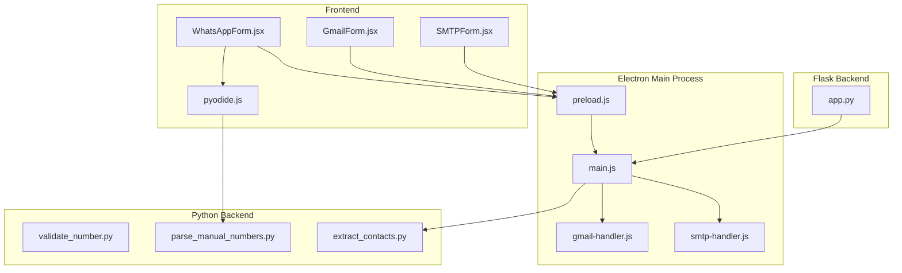
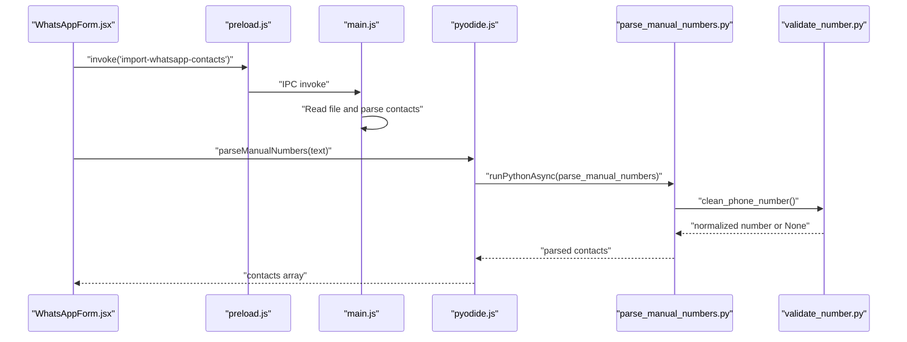
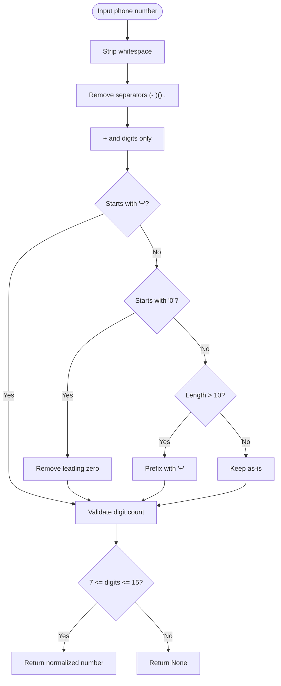
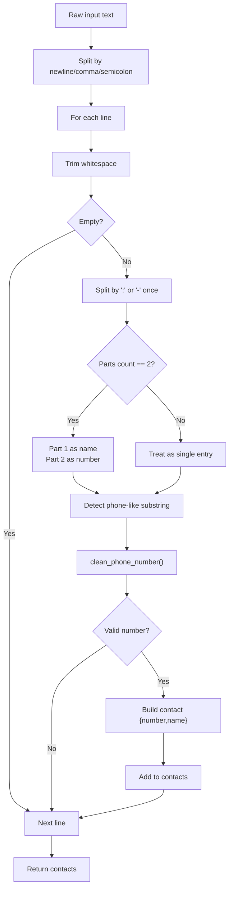
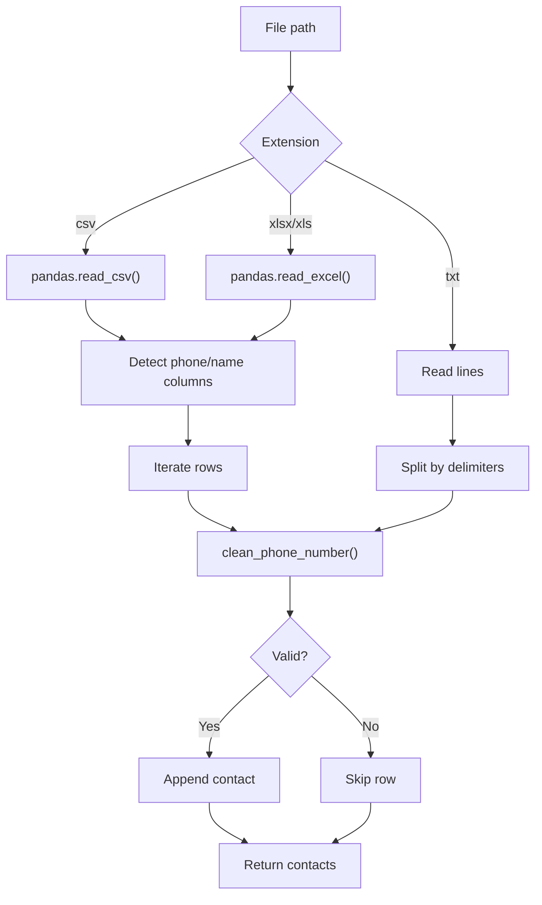
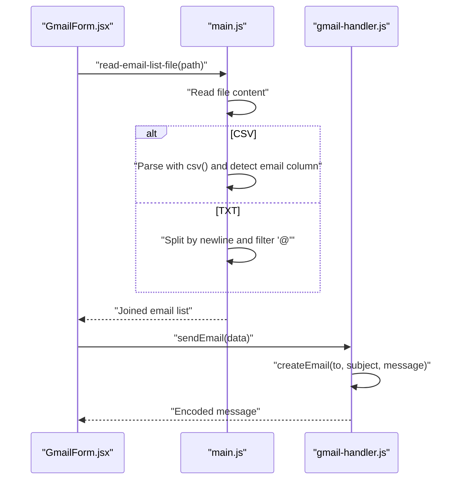
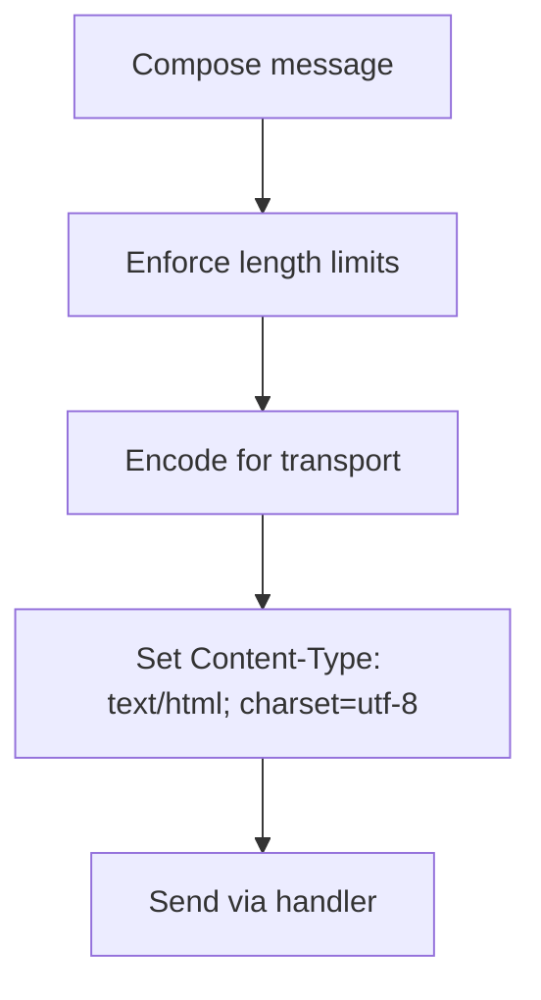
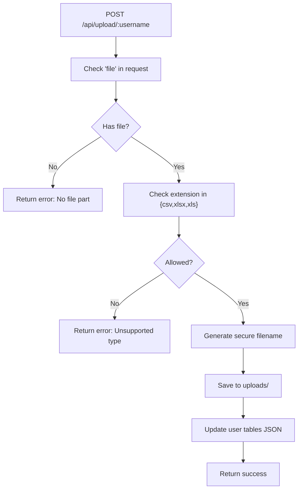
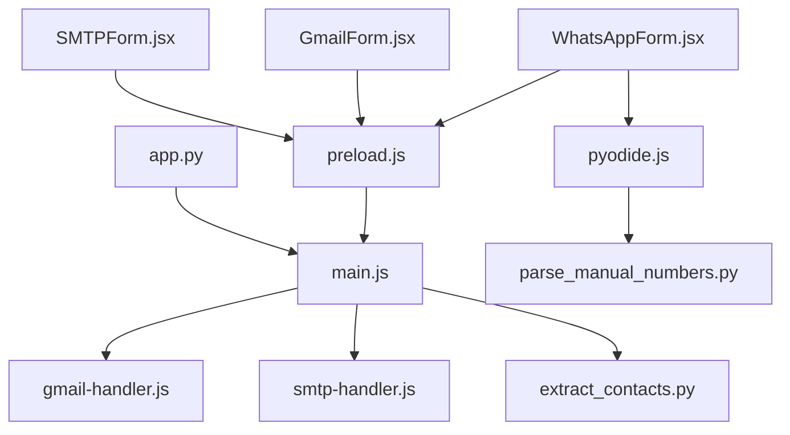

# Input Validation and Sanitization

<cite>
**Referenced Files in This Document**
- [validate_number.py](file://python-backend/validate_number.py)
- [parse_manual_numbers.py](file://python-backend/parse_manual_numbers.py)
- [extract_contacts.py](file://python-backend/extract_contacts.py)
- [main.js](file://electron/src/electron/main.js)
- [preload.js](file://electron/src/electron/preload.js)
- [gmail-handler.js](file://electron/src/electron/gmail-handler.js)
- [smtp-handler.js](file://electron/src/electron/smtp-handler.js)
- [pyodide.js](file://electron/src/utils/pyodide.js)
- [WhatsAppForm.jsx](file://electron/src/components/WhatsAppForm.jsx)
- [GmailForm.jsx](file://electron/src/components/GmailForm.jsx)
- [SMTPForm.jsx](file://electron/src/components/SMTPForm.jsx)
- [app.py](file://localhost/app.py)
</cite>

## Table of Contents
1. [Introduction](#introduction)
2. [Project Structure](#project-structure)
3. [Core Components](#core-components)
4. [Architecture Overview](#architecture-overview)
5. [Detailed Component Analysis](#detailed-component-analysis)
6. [Dependency Analysis](#dependency-analysis)
7. [Performance Considerations](#performance-considerations)
8. [Troubleshooting Guide](#troubleshooting-guide)
9. [Conclusion](#conclusion)

## Introduction
This document details the input validation and sanitization strategies implemented across the application. It focuses on:
- Phone number normalization and validation
- Email address extraction and filtering
- User-provided content sanitization for messages
- Security measures against malicious file uploads, CSV parsing risks, and command injection attempts
- Input encoding strategies, escape sequence handling, and data integrity verification

The analysis covers both Electron main process handlers and Python backend utilities, ensuring a comprehensive understanding of how user inputs are processed, validated, sanitized, and transmitted securely.

## Project Structure
The application comprises:
- Electron main process handlers for WhatsApp, Gmail, and SMTP operations
- Frontend React components for user interaction
- Python utilities for phone number cleaning and contact extraction
- A Flask backend for file upload and user management

**Diagram sources**
- [main.js](file://electron/src/electron/main.js#L1-L371)
- [gmail-handler.js](file://electron/src/electron/gmail-handler.js#L1-L227)
- [smtp-handler.js](file://electron/src/electron/smtp-handler.js#L1-L110)
- [preload.js](file://electron/src/electron/preload.js#L1-L41)
- [WhatsAppForm.jsx](file://electron/src/components/WhatsAppForm.jsx#L1-L609)
- [GmailForm.jsx](file://electron/src/components/GmailForm.jsx#L1-L332)
- [SMTPForm.jsx](file://electron/src/components/SMTPForm.jsx#L1-L390)
- [pyodide.js](file://electron/src/utils/pyodide.js#L1-L33)
- [validate_number.py](file://python-backend/validate_number.py#L1-L27)
- [parse_manual_numbers.py](file://python-backend/parse_manual_numbers.py#L1-L61)
- [extract_contacts.py](file://python-backend/extract_contacts.py#L1-L177)
- [app.py](file://localhost/app.py#L1-L306)

**Section sources**
- [main.js](file://electron/src/electron/main.js#L1-L371)
- [preload.js](file://electron/src/electron/preload.js#L1-L41)
- [WhatsAppForm.jsx](file://electron/src/components/WhatsAppForm.jsx#L1-L609)
- [GmailForm.jsx](file://electron/src/components/GmailForm.jsx#L1-L332)
- [SMTPForm.jsx](file://electron/src/components/SMTPForm.jsx#L1-L390)
- [pyodide.js](file://electron/src/utils/pyodide.js#L1-L33)
- [validate_number.py](file://python-backend/validate_number.py#L1-L27)
- [parse_manual_numbers.py](file://python-backend/parse_manual_numbers.py#L1-L61)
- [extract_contacts.py](file://python-backend/extract_contacts.py#L1-L177)
- [app.py](file://localhost/app.py#L1-L306)

## Core Components
This section outlines the primary validation and sanitization mechanisms implemented in the codebase.

- Phone number cleaning and normalization
  - Removes separators and non-digit characters except plus sign
  - Enforces length constraints and optional international prefix
  - Standardizes local numbers to international format when applicable

- Manual phone number parsing
  - Accepts multiple formats: standalone numbers, name:number pairs, and delimiter-separated entries
  - Uses regex heuristics to detect phone-like substrings
  - Produces normalized contacts with optional names

- Contact extraction from files
  - Supports CSV, TXT, and Excel formats
  - Heuristic detection of phone and name columns
  - Robust fallbacks and error handling for malformed inputs

- Email list parsing
  - Reads CSV with flexible column names or plain text newline-separated entries
  - Filters entries containing "@" to approximate valid email addresses

- Message sanitization
  - Limits message lengths for safety and performance
  - Encodes HTML content appropriately for transport
  - Avoids unsafe inline styles or scripts in HTML messages

- File upload restrictions
  - Whitelists allowed file extensions
  - Uses secure filename generation
  - Stores uploads under controlled paths

**Section sources**
- [validate_number.py](file://python-backend/validate_number.py#L6-L19)
- [parse_manual_numbers.py](file://python-backend/parse_manual_numbers.py#L6-L19)
- [parse_manual_numbers.py](file://python-backend/parse_manual_numbers.py#L22-L54)
- [extract_contacts.py](file://python-backend/extract_contacts.py#L9-L22)
- [extract_contacts.py](file://python-backend/extract_contacts.py#L25-L81)
- [extract_contacts.py](file://python-backend/extract_contacts.py#L84-L118)
- [extract_contacts.py](file://python-backend/extract_contacts.py#L121-L157)
- [main.js](file://electron/src/electron/main.js#L215-L262)
- [main.js](file://electron/src/electron/main.js#L279-L318)
- [gmail-handler.js](file://electron/src/electron/gmail-handler.js#L216-L226)
- [smtp-handler.js](file://electron/src/electron/smtp-handler.js#L64-L70)
- [app.py](file://localhost/app.py#L92-L124)

## Architecture Overview
The validation pipeline spans frontend, Electron main process, and Python utilities:

**Diagram sources**
- [WhatsAppForm.jsx](file://electron/src/components/WhatsAppForm.jsx#L41-L62)
- [preload.js](file://electron/src/electron/preload.js#L24-L27)
- [main.js](file://electron/src/electron/main.js#L215-L262)
- [pyodide.js](file://electron/src/utils/pyodide.js#L26-L33)
- [parse_manual_numbers.py](file://python-backend/parse_manual_numbers.py#L22-L54)
- [validate_number.py](file://python-backend/validate_number.py#L6-L19)

## Detailed Component Analysis

### Phone Number Validation and Normalization
Phone numbers undergo strict cleaning and normalization:
- Strips whitespace and common separators
- Removes non-digit characters except "+"
- Handles leading zeros and optional international prefixes
- Validates digit count within accepted bounds

**Diagram sources**
- [validate_number.py](file://python-backend/validate_number.py#L6-L19)
- [parse_manual_numbers.py](file://python-backend/parse_manual_numbers.py#L6-L19)
- [extract_contacts.py](file://python-backend/extract_contacts.py#L9-L22)

**Section sources**
- [validate_number.py](file://python-backend/validate_number.py#L6-L19)
- [parse_manual_numbers.py](file://python-backend/parse_manual_numbers.py#L6-L19)
- [extract_contacts.py](file://python-backend/extract_contacts.py#L9-L22)

### Manual Phone Number Parsing
The manual parser supports flexible input formats:
- Standalone numbers
- Name-number pairs separated by colon or dash
- Delimiter-separated entries (newline, comma, semicolon, pipe)
- Heuristic detection of phone-like substrings

**Diagram sources**
- [parse_manual_numbers.py](file://python-backend/parse_manual_numbers.py#L22-L54)
- [validate_number.py](file://python-backend/validate_number.py#L6-L19)

**Section sources**
- [parse_manual_numbers.py](file://python-backend/parse_manual_numbers.py#L22-L54)

### Contact Extraction from Files
File-based contact extraction supports multiple formats:
- CSV: heuristic column detection for phone/name; robust fallbacks
- TXT: delimiter-separated lines with optional name
- Excel: pandas-based parsing with similar heuristics

**Diagram sources**
- [extract_contacts.py](file://python-backend/extract_contacts.py#L25-L81)
- [extract_contacts.py](file://python-backend/extract_contacts.py#L84-L118)
- [extract_contacts.py](file://python-backend/extract_contacts.py#L121-L157)
- [validate_number.py](file://python-backend/validate_number.py#L6-L19)

**Section sources**
- [extract_contacts.py](file://python-backend/extract_contacts.py#L25-L81)
- [extract_contacts.py](file://python-backend/extract_contacts.py#L84-L118)
- [extract_contacts.py](file://python-backend/extract_contacts.py#L121-L157)

### Email Address Parsing and Filtering
Email lists are parsed from CSV or plain text:
- CSV: flexible column names (email, Email, ADDRESS, etc.) or first column fallback
- Text: newline-separated entries filtered by presence of "@"
- Transport encoding: HTML content-type header included

**Diagram sources**
- [main.js](file://electron/src/electron/main.js#L279-L318)
- [gmail-handler.js](file://electron/src/electron/gmail-handler.js#L216-L226)

**Section sources**
- [main.js](file://electron/src/electron/main.js#L279-L318)
- [gmail-handler.js](file://electron/src/electron/gmail-handler.js#L216-L226)

### Message Content Sanitization
Message composition includes:
- Length limits for performance and platform constraints
- HTML content-type header for Gmail transport
- Optional HTML stripping for text version in SMTP

**Diagram sources**
- [GmailForm.jsx](file://electron/src/components/GmailForm.jsx#L198-L212)
- [SMTPForm.jsx](file://electron/src/components/SMTPForm.jsx#L257-L271)
- [gmail-handler.js](file://electron/src/electron/gmail-handler.js#L216-L226)
- [smtp-handler.js](file://electron/src/electron/smtp-handler.js#L64-L70)

**Section sources**
- [GmailForm.jsx](file://electron/src/components/GmailForm.jsx#L198-L212)
- [SMTPForm.jsx](file://electron/src/components/SMTPForm.jsx#L257-L271)
- [gmail-handler.js](file://electron/src/electron/gmail-handler.js#L216-L226)
- [smtp-handler.js](file://electron/src/electron/smtp-handler.js#L64-L70)

### File Upload Security Measures
The Flask backend enforces:
- Allowed file extensions whitelist
- Secure filename generation
- Controlled upload path
- JSON responses for API endpoints

**Diagram sources**
- [app.py](file://localhost/app.py#L235-L264)

**Section sources**
- [app.py](file://localhost/app.py#L92-L124)
- [app.py](file://localhost/app.py#L235-L264)

## Dependency Analysis
Key dependencies and interactions:
- Frontend components communicate with Electron main process via contextBridge
- Pyodide loads Python scripts dynamically for manual number parsing
- Handlers depend on environment variables for external services
- File parsing relies on pandas for structured formats

**Diagram sources**
- [preload.js](file://electron/src/electron/preload.js#L4-L40)
- [main.js](file://electron/src/electron/main.js#L1-L371)
- [gmail-handler.js](file://electron/src/electron/gmail-handler.js#L1-L227)
- [smtp-handler.js](file://electron/src/electron/smtp-handler.js#L1-L110)
- [pyodide.js](file://electron/src/utils/pyodide.js#L1-L33)
- [parse_manual_numbers.py](file://python-backend/parse_manual_numbers.py#L1-L61)
- [extract_contacts.py](file://python-backend/extract_contacts.py#L1-L177)
- [app.py](file://localhost/app.py#L1-L306)

**Section sources**
- [preload.js](file://electron/src/electron/preload.js#L4-L40)
- [main.js](file://electron/src/electron/main.js#L1-L371)
- [gmail-handler.js](file://electron/src/electron/gmail-handler.js#L1-L227)
- [smtp-handler.js](file://electron/src/electron/smtp-handler.js#L1-L110)
- [pyodide.js](file://electron/src/utils/pyodide.js#L1-L33)
- [parse_manual_numbers.py](file://python-backend/parse_manual_numbers.py#L1-L61)
- [extract_contacts.py](file://python-backend/extract_contacts.py#L1-L177)
- [app.py](file://localhost/app.py#L1-L306)

## Performance Considerations
- Regex-based cleaning and parsing are efficient for typical contact volumes but should be monitored for very large inputs
- File parsing uses streaming for CSV; ensure appropriate buffering and memory limits
- Message length limits prevent excessive payload sizes and reduce transport overhead
- Rate limiting delays in email sending avoid throttling and improve reliability

## Troubleshooting Guide
Common validation and sanitization issues:
- Invalid phone numbers
  - Cause: Non-digit characters outside "+", incorrect length
  - Resolution: Ensure numeric input with optional "+" prefix and correct digit count

- Malformed CSV/Excel files
  - Cause: Missing headers, unexpected delimiters, mixed encodings
  - Resolution: Validate schema and encoding; provide clear error messages

- Email parsing failures
  - Cause: Missing "@" or unsupported column names
  - Resolution: Use supported column names or rely on first-column fallback

- File upload errors
  - Cause: Unsupported extension or missing file part
  - Resolution: Confirm allowed extensions and proper multipart form submission

**Section sources**
- [validate_number.py](file://python-backend/validate_number.py#L6-L19)
- [extract_contacts.py](file://python-backend/extract_contacts.py#L25-L81)
- [main.js](file://electron/src/electron/main.js#L279-L318)
- [app.py](file://localhost/app.py#L92-L124)

## Conclusion
The application implements layered input validation and sanitization:
- Phone numbers are rigorously normalized and validated
- Manual and file-based contact extraction use robust heuristics and error handling
- Email lists are filtered and encoded for secure transport
- File uploads are restricted and saved securely
- Message content is length-limited and encoded appropriately

These measures collectively mitigate injection risks, maintain data integrity, and ensure reliable operation across diverse input formats.