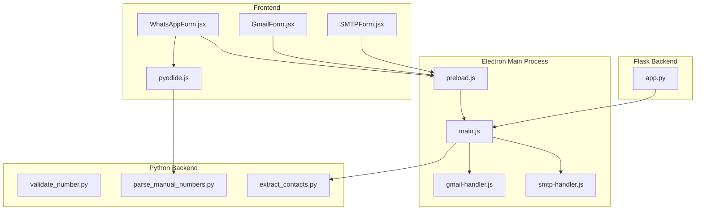
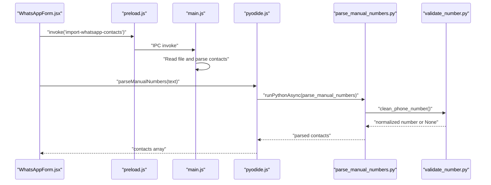
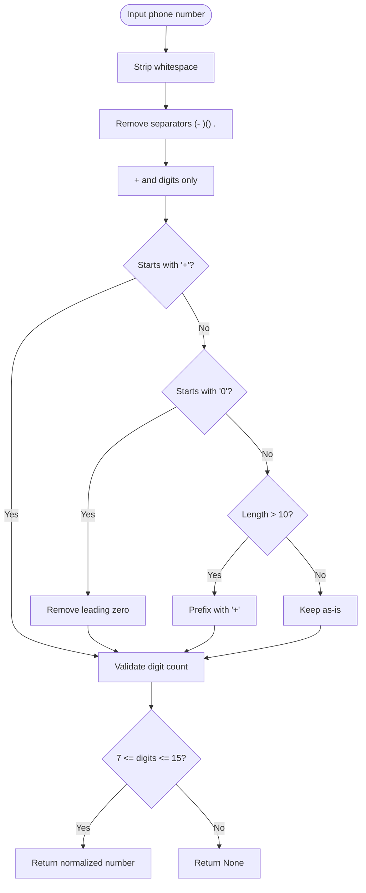
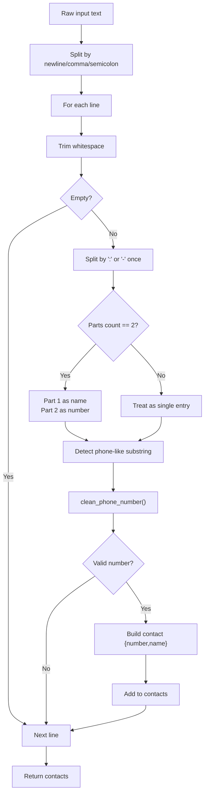
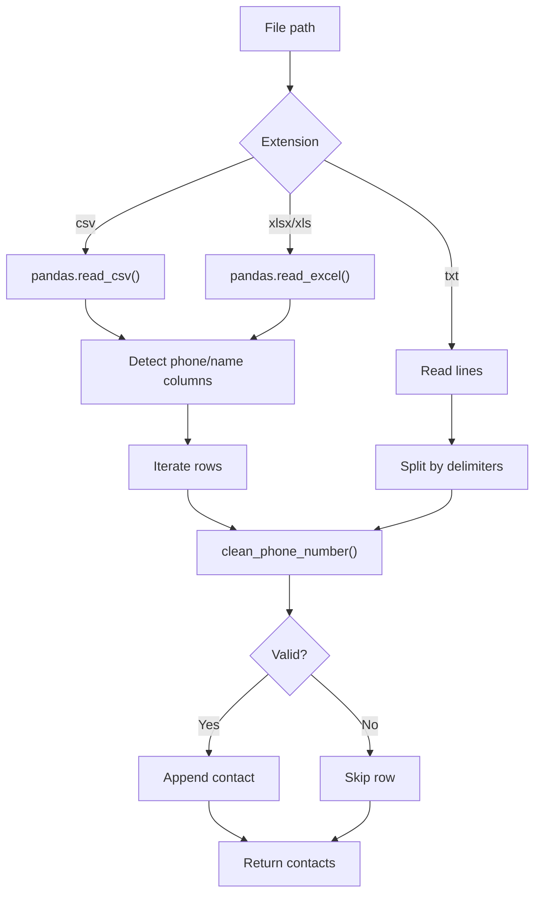
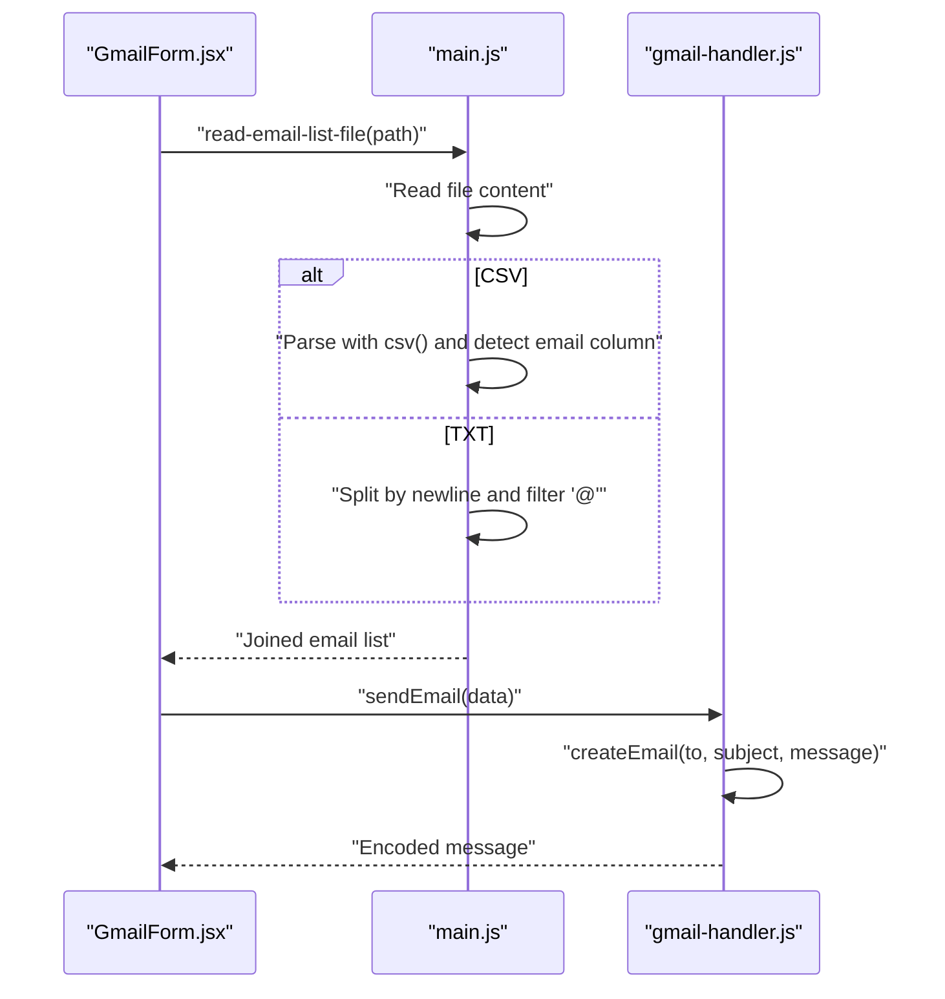
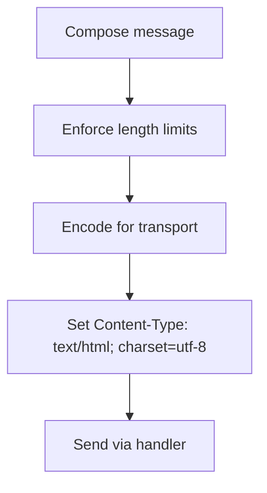
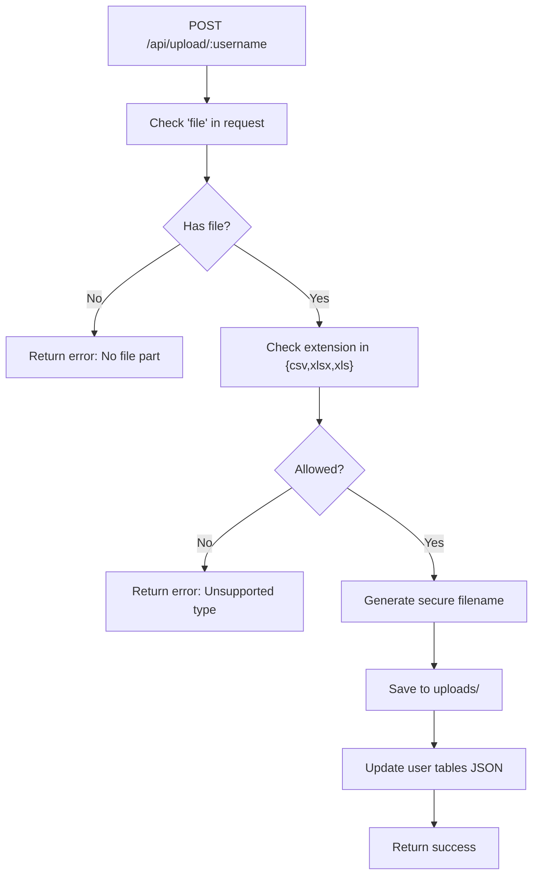
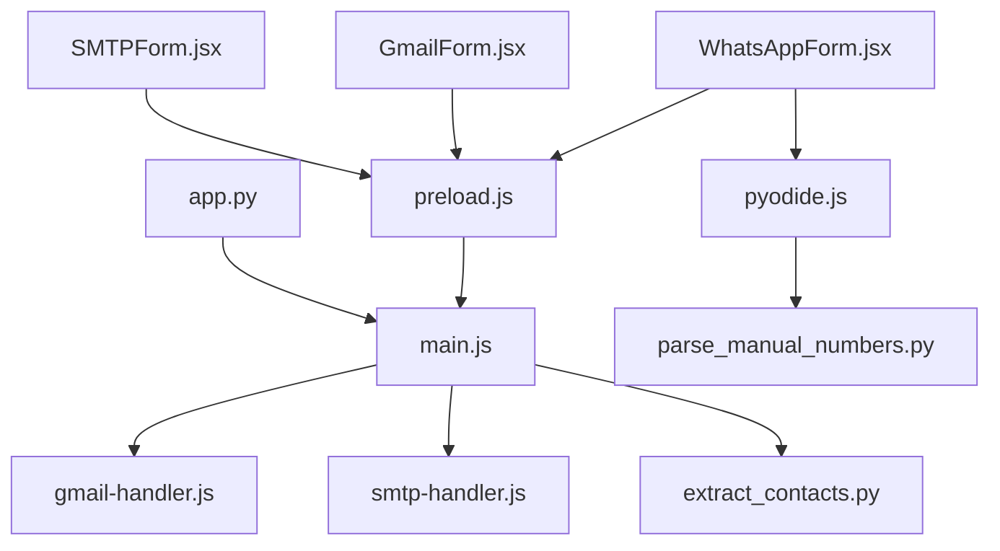

# Input validation and sanitization

## Introduction
This page details the input validation and sanitization strategies implemented across the application. It focuses on:
- Phone number normalization and validation
- Email address extraction and filtering
- User-provided content sanitization for messages
- Security measures against malicious file uploads, CSV parsing risks, and command injection attempts
- Input encoding strategies, escape sequence handling, and data integrity verification

The analysis covers both Electron main process handlers and Python backend utilities, ensuring a detailed understanding of how user inputs are processed, validated, sanitized, and transmitted securely.

## Project structure
The application comprises:
- Electron main process handlers for WhatsApp, Gmail, and SMTP operations
- Frontend React components for user interaction
- Python utilities for phone number cleaning and contact extraction
- A Flask backend for file upload and user management

```mermaid
graph TB
subgraph "Electron Main Process"
M["main.js"]
G["gmail-handler.js"]
S["smtp-handler.js"]
P["preload.js"]
end
subgraph "Frontend"
W["WhatsAppForm.jsx"]
GM["GmailForm.jsx"]
SM["SMTPForm.jsx"]
PY["pyodide.js"]
end
subgraph "Python Backend"
VN["validate_number.py"]
PMN["parse_manual_numbers.py"]
EC["extract_contacts.py"]
end
subgraph "Flask Backend"
L["app.py"]
end
W --> P
GM --> P
SM --> P
P --> M
M --> G
M --> S
W --> PY
PY --> PMN
M --> EC
L --> M
```

## Core components
This section outlines the primary validation and sanitization mechanisms implemented in the codebase.

- Phone number cleaning and normalization
  - Removes separators and non-digit characters except plus sign
  - Enforces length constraints and optional international prefix
  - Standardizes local numbers to international format when applicable

- Manual phone number parsing
  - Accepts multiple formats: standalone numbers, name:number pairs, and delimiter-separated entries
  - Uses regex heuristics to detect phone-like substrings
  - Produces normalized contacts with optional names

- Contact extraction from files
  - Supports CSV, TXT, and Excel formats
  - Heuristic detection of phone and name columns
  - Reliable fallbacks and error handling for malformed inputs

- Email list parsing
  - Reads CSV with flexible column names or plain text newline-separated entries
  - Filters entries containing "@" to approximate valid email addresses

- Message sanitization
  - Limits message lengths for safety and performance
  - Encodes HTML content appropriately for transport
  - Avoids unsafe inline styles or scripts in HTML messages

- File upload restrictions
  - Whitelists allowed file extensions
  - Uses secure filename generation
  - Stores uploads under controlled paths

## Architecture overview
The validation pipeline spans frontend, Electron main process, and Python utilities:

```mermaid
sequenceDiagram
participant UI as "WhatsAppForm.jsx"
participant Preload as "preload.js"
participant Main as "main.js"
participant Py as "pyodide.js"
participant PyMod as "parse_manual_numbers.py"
participant Backend as "validate_number.py"
UI->>Preload : "invoke('import-whatsapp-contacts')"
Preload->>Main : "IPC invoke"
Main->>Main : "Read file and parse contacts"
UI->>Py : "parseManualNumbers(text)"
Py->>PyMod : "runPythonAsync(parse_manual_numbers)"
PyMod->>Backend : "clean_phone_number()"
Backend-->>PyMod : "normalized number or None"
PyMod-->>Py : "parsed contacts"
Py-->>UI : "contacts array"
```

## Detailed component analysis

### Phone number validation and normalization
Phone numbers undergo strict cleaning and normalization:
- Strips whitespace and common separators
- Removes non-digit characters except "+"
- Handles leading zeros and optional international prefixes
- Validates digit count within accepted bounds

```mermaid
flowchart TD
Start(["Input phone number"]) --> Strip["Strip whitespace"]
Strip --> CleanSep["Remove separators (- )() ."]
CleanSep --> KeepDigits["+ and digits only"]
KeepDigits --> PrefixCheck{"Starts with '+'?"}
PrefixCheck --> |No| LeadingZero{"Starts with '0'?"}
LeadingZero --> |Yes| RemoveZero["Remove leading zero"]
LeadingZero --> |No| LongLocal{"Length > 10?"}
LongLocal --> |Yes| AddPlus["Prefix with '+'"]
LongLocal --> |No| KeepLocal["Keep as-is"]
PrefixCheck --> |Yes| ValidateLen["Validate digit count"]
RemoveZero --> ValidateLen
AddPlus --> ValidateLen
KeepLocal --> ValidateLen
ValidateLen --> RangeCheck{"7 <= digits <= 15?"}
RangeCheck --> |Yes| ReturnClean["Return normalized number"]
RangeCheck --> |No| ReturnNone["Return None"]
```

### Manual phone number parsing
The manual parser supports flexible input formats:
- Standalone numbers
- Name-number pairs separated by colon or dash
- Delimiter-separated entries (newline, comma, semicolon, pipe)
- Heuristic detection of phone-like substrings

```mermaid
flowchart TD
Input["Raw input text"] --> SplitLines["Split by newline/comma/semicolon"]
SplitLines --> ForEachLine["For each line"]
ForEachLine --> Trim["Trim whitespace"]
Trim --> EmptyCheck{"Empty?"}
EmptyCheck --> |Yes| NextLine["Next line"]
EmptyCheck --> |No| SplitPair["Split by ':' or '-' once"]
SplitPair --> PartsCount{"Parts count == 2?"}
PartsCount --> |Yes| TryName["Part 1 as name<br/>Part 2 as number"]
PartsCount --> |No| TreatAsSingle["Treat as single entry"]
TryName --> DetectPhone["Detect phone-like substring"]
TreatAsSingle --> DetectPhone
DetectPhone --> Clean["clean_phone_number()"]
Clean --> Valid{"Valid number?"}
Valid --> |Yes| BuildContact["Build contact {number,name}"]
Valid --> |No| NextLine
BuildContact --> Collect["Add to contacts"]
Collect --> NextLine
NextLine --> Done["Return contacts"]
```

### Contact extraction from files
File-based contact extraction supports multiple formats:
- CSV: heuristic column detection for phone/name; reliable fallbacks
- TXT: delimiter-separated lines with optional name
- Excel: pandas-based parsing with similar heuristics

```mermaid
flowchart TD
FilePath["File path"] --> ExtCheck{"Extension"}
ExtCheck --> |csv| ReadCSV["pandas.read_csv()"]
ExtCheck --> |txt| ReadTXT["Read lines"]
ExtCheck --> |xlsx/xls| ReadExcel["pandas.read_excel()"]
ReadCSV --> DetectCols["Detect phone/name columns"]
ReadExcel --> DetectCols
DetectCols --> IterateRows["Iterate rows"]
IterateRows --> CleanPhone["clean_phone_number()"]
CleanPhone --> Valid{"Valid?"}
Valid --> |Yes| AddContact["Append contact"]
Valid --> |No| SkipRow["Skip row"]
ReadTXT --> SplitDelim["Split by delimiters"]
SplitDelim --> CleanPhone
AddContact --> Done["Return contacts"]
SkipRow --> Done
```

### Email address parsing and filtering
Email lists are parsed from CSV or plain text:
- CSV: flexible column names (email, Email, ADDRESS, etc.) or first column fallback
- Text: newline-separated entries filtered by presence of "@"
- Transport encoding: HTML content-type header included

```mermaid
sequenceDiagram
participant UI as "GmailForm.jsx"
participant Main as "main.js"
participant Handler as "gmail-handler.js"
UI->>Main : "read-email-list-file(path)"
Main->>Main : "Read file content"
alt CSV
Main->>Main : "Parse with csv() and detect email column"
else TXT
Main->>Main : "Split by newline and filter '@'"
end
Main-->>UI : "Joined email list"
UI->>Handler : "sendEmail(data)"
Handler->>Handler : "createEmail(to, subject, message)"
Handler-->>UI : "Encoded message"
```

### Message content sanitization
Message composition includes:
- Length limits for performance and platform constraints
- HTML content-type header for Gmail transport
- Optional HTML stripping for text version in SMTP

```mermaid
flowchart TD
Compose["Compose message"] --> Limit["Enforce length limits"]
Limit --> Encode["Encode for transport"]
Encode --> HTMLHeader["Set Content-Type: text/html; charset=utf-8"]
HTMLHeader --> Send["Send via handler"]
```

### File upload security measures
The Flask backend enforces:
- Allowed file extensions whitelist
- Secure filename generation
- Controlled upload path
- JSON responses for API endpoints

```mermaid
flowchart TD
Upload["POST /api/upload/:username"] --> CheckFile["Check 'file' in request"]
CheckFile --> HasFile{"Has file?"}
HasFile --> |No| ErrorNoFile["Return error: No file part"]
HasFile --> |Yes| CheckExt["Check extension in {csv,xlsx,xls}"]
CheckExt --> Allowed{"Allowed?"}
Allowed --> |No| ErrorExt["Return error: Unsupported type"]
Allowed --> |Yes| SecureName["Generate secure filename"]
SecureName --> Save["Save to uploads/"]
Save --> UpdateDB["Update user tables JSON"]
UpdateDB --> Success["Return success"]
```

## Dependency analysis
Key dependencies and interactions:
- Frontend components communicate with Electron main process via contextBridge
- Pyodide loads Python scripts dynamically for manual number parsing
- Handlers depend on environment variables for external services
- File parsing relies on pandas for structured formats

```mermaid
graph TB
W["WhatsAppForm.jsx"] --> P["preload.js"]
GM["GmailForm.jsx"] --> P
SM["SMTPForm.jsx"] --> P
P --> M["main.js"]
M --> GH["gmail-handler.js"]
M --> SH["smtp-handler.js"]
W --> PY["pyodide.js"]
PY --> PMN["parse_manual_numbers.py"]
M --> EC["extract_contacts.py"]
L["app.py"] --> M
```

## Performance considerations
- Regex-based cleaning and parsing are efficient for typical contact volumes but should be monitored for very large inputs
- File parsing uses streaming for CSV; ensure appropriate buffering and memory limits
- Message length limits prevent excessive payload sizes and reduce transport overhead
- Rate limiting delays in email sending avoid throttling and improve reliability

## Troubleshooting guide
Common validation and sanitization issues:
- Invalid phone numbers
  - Cause: Non-digit characters outside "+", incorrect length
  - Resolution: Ensure numeric input with optional "+" prefix and correct digit count

- Malformed CSV/Excel files
  - Cause: Missing headers, unexpected delimiters, mixed encodings
  - Resolution: Validate schema and encoding; provide clear error messages

- Email parsing failures
  - Cause: Missing "@" or unsupported column names
  - Resolution: Use supported column names or rely on first-column fallback

- File upload errors
  - Cause: Unsupported extension or missing file part
  - Resolution: Confirm allowed extensions and proper multipart form submission

## Conclusion
The application implements layered input validation and sanitization:
- Phone numbers are rigorously normalized and validated
- Manual and file-based contact extraction use reliable heuristics and error handling
- Email lists are filtered and encoded for secure transport
- File uploads are restricted and saved securely
- Message content is length-limited and encoded appropriately

These measures collectively mitigate injection risks, maintain data integrity, and ensure reliable operation across diverse input formats.
