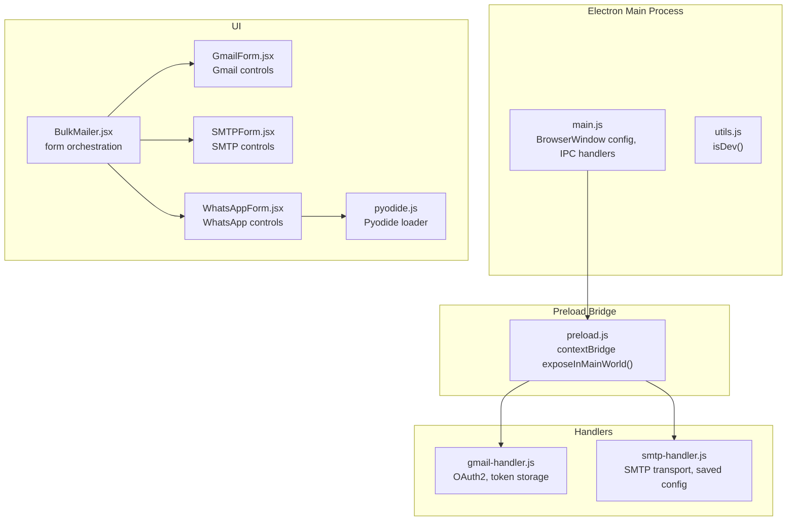
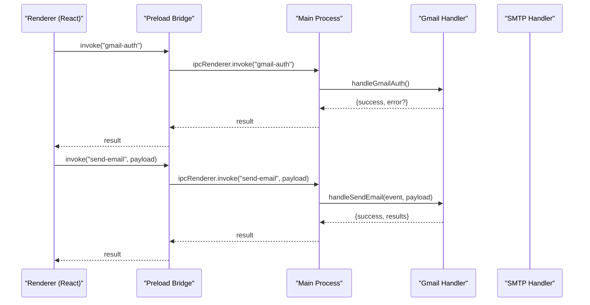
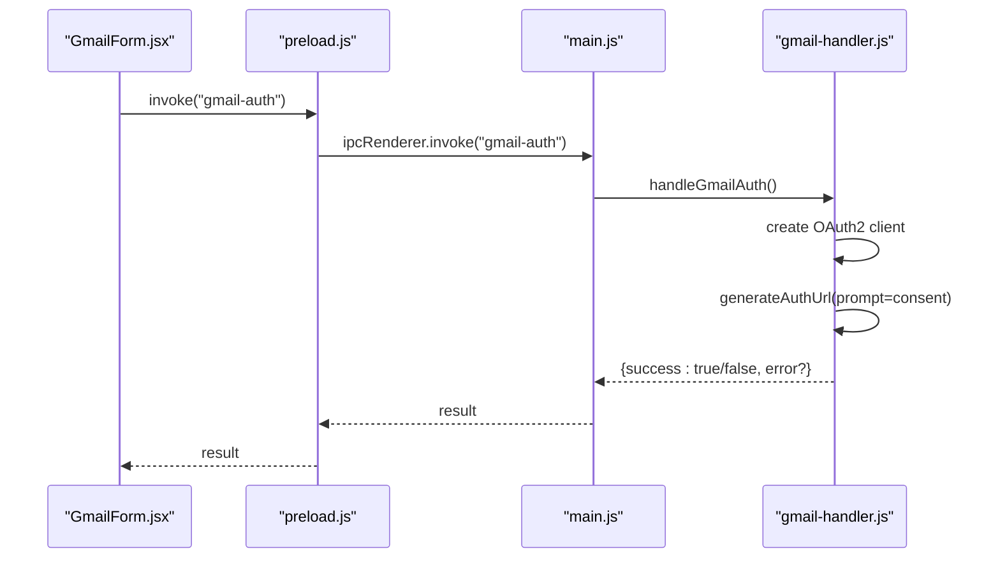
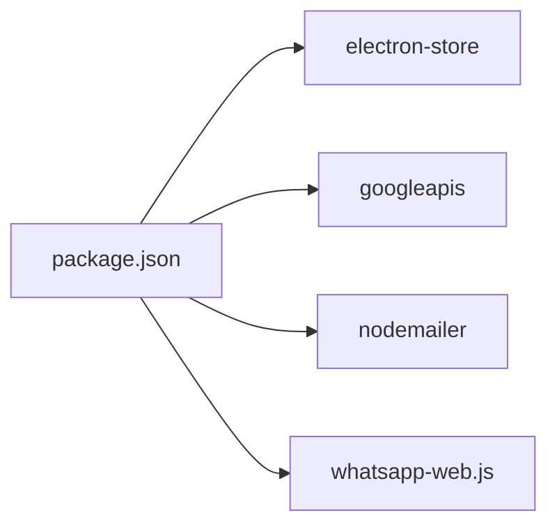

# Security Implementation

<cite>
**Referenced Files in This Document**
- [main.js](file://electron/src/electron/main.js)
- [preload.js](file://electron/src/electron/preload.js)
- [gmail-handler.js](file://electron/src/electron/gmail-handler.js)
- [smtp-handler.js](file://electron/src/electron/smtp-handler.js)
- [utils.js](file://electron/src/electron/utils.js)
- [BulkMailer.jsx](file://electron/src/components/BulkMailer.jsx)
- [GmailForm.jsx](file://electron/src/components/GmailForm.jsx)
- [SMTPForm.jsx](file://electron/src/components/SMTPForm.jsx)
- [WhatsAppForm.jsx](file://electron/src/components/WhatsAppForm.jsx)
- [pyodide.js](file://electron/src/utils/pyodide.js)
- [package.json](file://electron/package.json)
</cite>

## Table of Contents
1. [Introduction](#introduction)
2. [Project Structure](#project-structure)
3. [Core Components](#core-components)
4. [Architecture Overview](#architecture-overview)
5. [Detailed Component Analysis](#detailed-component-analysis)
6. [Dependency Analysis](#dependency-analysis)
7. [Performance Considerations](#performance-considerations)
8. [Troubleshooting Guide](#troubleshooting-guide)
9. [Conclusion](#conclusion)
10. [Appendices](#appendices)

## Introduction
This document provides comprehensive security documentation for the desktop application. It focuses on the Electron security model, preload script security, secure IPC communication, OAuth2 authentication security for Gmail API, SMTP credential security, input validation and sanitization strategies, sandboxing and privilege separation, API key management, and compliance considerations for data protection.

## Project Structure
The application is an Electron desktop app with a React UI. Security-relevant areas include:
- Electron main process and preload bridge
- Gmail and SMTP handlers for secure credential handling and API communication
- Frontend forms and validation logic
- Python integration via Pyodide for number parsing

**Diagram sources**
- [main.js](file://electron/src/electron/main.js#L20-L51)
- [preload.js](file://electron/src/electron/preload.js#L4-L40)
- [gmail-handler.js](file://electron/src/electron/gmail-handler.js#L15-L130)
- [smtp-handler.js](file://electron/src/electron/smtp-handler.js#L6-L105)
- [BulkMailer.jsx](file://electron/src/components/BulkMailer.jsx#L9-L58)
- [GmailForm.jsx](file://electron/src/components/GmailForm.jsx#L3-L18)
- [SMTPForm.jsx](file://electron/src/components/SMTPForm.jsx#L3-L18)
- [WhatsAppForm.jsx](file://electron/src/components/WhatsAppForm.jsx#L5-L18)
- [pyodide.js](file://electron/src/utils/pyodide.js#L5-L24)

**Section sources**
- [main.js](file://electron/src/electron/main.js#L1-L120)
- [preload.js](file://electron/src/electron/preload.js#L1-L41)
- [package.json](file://electron/package.json#L1-L49)

## Core Components
- Electron security model: context isolation enabled, remote module disabled, preload bridge exposes only explicit APIs.
- Secure IPC: handlers registered via ipcMain.handle; renderer communicates via ipcRenderer.invoke/on.
- Gmail OAuth2: environment-based client credentials, offline token retrieval, local token persistence.
- SMTP: credential handling with optional encrypted storage of non-secret config; TLS verification.
- Input validation: frontend form validation for email formats and required fields.
- Privilege separation: main process handles sensitive operations; renderer only triggers via bridge.

**Section sources**
- [main.js](file://electron/src/electron/main.js#L20-L51)
- [preload.js](file://electron/src/electron/preload.js#L4-L40)
- [gmail-handler.js](file://electron/src/electron/gmail-handler.js#L15-L130)
- [smtp-handler.js](file://electron/src/electron/smtp-handler.js#L6-L105)
- [BulkMailer.jsx](file://electron/src/components/BulkMailer.jsx#L149-L179)

## Architecture Overview
The Electron app enforces a strict security boundary between the renderer and main process. The preload script creates a controlled API surface exposed to the renderer. Handlers in the main process manage sensitive operations like OAuth2 and SMTP transport.

**Diagram sources**
- [preload.js](file://electron/src/electron/preload.js#L6-L8)
- [main.js](file://electron/src/electron/main.js#L102-L108)
- [gmail-handler.js](file://electron/src/electron/gmail-handler.js#L15-L130)

## Detailed Component Analysis

### Electron Security Model and Preload Script Security
- Context isolation is enabled in BrowserWindow webPreferences.
- Remote module is disabled.
- Preload script exposes a minimal API surface via contextBridge.
- Renderer invokes IPC only through explicitly exposed methods.

Recommendations:
- Keep preload minimal and review for unintended exposure.
- Avoid exposing Node.js globals or filesystem APIs.
- Validate and sanitize all IPC payloads in main process handlers.

**Section sources**
- [main.js](file://electron/src/electron/main.js#L20-L51)
- [preload.js](file://electron/src/electron/preload.js#L4-L40)

### Secure IPC Communication
- Handlers registered via ipcMain.handle for Gmail, SMTP, and WhatsApp.
- Renderer uses ipcRenderer.invoke for requests and ipcRenderer.on for events.
- Event-driven progress updates for long-running tasks.

Security considerations:
- Validate and sanitize all handler inputs.
- Limit handler scope to necessary operations.
- Avoid leaking internal state via events.

**Section sources**
- [main.js](file://electron/src/electron/main.js#L102-L108)
- [preload.js](file://electron/src/electron/preload.js#L18-L39)

### OAuth2 Authentication Security for Gmail API
- Client ID and secret loaded from environment variables.
- Offline token requested with consent prompt to obtain refresh token.
- Token stored locally using electron-store.
- Auth window configured with context isolation and no node integration.

Security considerations:
- Environment variables must be managed securely outside the app bundle.
- Redirect URI is localhost; ensure no unintended exposure.
- Token storage is local; consider OS keychain integration for production.
- Implement token refresh logic if needed; current implementation relies on stored token.

**Diagram sources**
- [GmailForm.jsx](file://electron/src/components/GmailForm.jsx#L91-L100)
- [gmail-handler.js](file://electron/src/electron/gmail-handler.js#L15-L130)

**Section sources**
- [gmail-handler.js](file://electron/src/electron/gmail-handler.js#L15-L130)

### Token Storage and Refresh Mechanisms
- Tokens persisted via electron-store under a dedicated key.
- No automatic refresh logic present; relies on stored token validity.
- Consider implementing token refresh using the stored token and persisting refreshed credentials.

Best practices:
- Encrypt stored tokens at rest.
- Rotate tokens periodically.
- Implement robust error handling for token expiry.

**Section sources**
- [gmail-handler.js](file://electron/src/electron/gmail-handler.js#L104-L108)
- [gmail-handler.js](file://electron/src/electron/gmail-handler.js#L132-L139)

### SMTP Credential Security
- Credentials passed to handler via IPC; password is not saved to disk.
- Optional saving of non-secret SMTP config (host, port, secure, user).
- TLS verification performed; rejectUnauthorized configurable.

Security considerations:
- Avoid storing passwords in memory longer than necessary.
- Consider encrypting saved SMTP config if persisted.
- Ensure TLS is enabled for production SMTP servers.

**Section sources**
- [smtp-handler.js](file://electron/src/electron/smtp-handler.js#L6-L105)

### Input Validation and Sanitization Strategies
- Frontend validation checks:
  - Required fields for recipients, subject, and message.
  - Basic email format validation using regex.
- Renderer orchestrates validation before invoking handlers.

Recommendations:
- Apply backend validation in handlers as a secondary check.
- Sanitize user inputs before constructing emails or messages.
- Enforce rate limits and input size caps.

**Section sources**
- [BulkMailer.jsx](file://electron/src/components/BulkMailer.jsx#L149-L179)

### Sandbox and Privilege Separation
- Renderer runs in isolated context with preload bridge.
- Main process performs privileged operations (OAuth, SMTP, file dialogs).
- Puppeteer launched with restricted arguments; headless mode enabled.

Recommendations:
- Keep main process handlers minimal and focused.
- Avoid enabling nodeIntegration in BrowserWindow.
- Review puppeteer arguments for least privilege.

**Section sources**
- [main.js](file://electron/src/electron/main.js#L120-L135)

### Network Communication Security
- Gmail API via official client library.
- SMTP via nodemailer with TLS verification.
- QR code generation handled locally; no external rendering of QR images.

Recommendations:
- Pin TLS certificates for SMTP servers.
- Monitor and log network errors.
- Consider adding certificate pinning for critical endpoints.

**Section sources**
- [gmail-handler.js](file://electron/src/electron/gmail-handler.js#L160-L161)
- [smtp-handler.js](file://electron/src/electron/smtp-handler.js#L47-L48)

### Python Integration Security (Pyodide)
- Pyodide dynamically loaded from CDN.
- Python script fetched and executed safely.
- Input sanitized before passing to Python.

Recommendations:
- Verify CDN integrity if required.
- Limit Python script scope and validate inputs rigorously.
- Consider offline packaging of trusted scripts.

**Section sources**
- [pyodide.js](file://electron/src/utils/pyodide.js#L5-L33)

## Dependency Analysis
Key runtime dependencies relevant to security:
- electron-store: local encrypted storage abstraction
- googleapis: OAuth2 and Gmail API client
- nodemailer: SMTP transport with TLS
- whatsapp-web.js: WhatsApp client with LocalAuth

**Diagram sources**
- [package.json](file://electron/package.json#L20-L31)

**Section sources**
- [package.json](file://electron/package.json#L20-L31)

## Performance Considerations
- Rate limiting delays between sends to avoid throttling.
- Asynchronous processing with progress events.
- QR code generation occurs in main process to keep renderer responsive.

Recommendations:
- Tune delay parameters based on provider limits.
- Batch operations where feasible.
- Monitor memory usage during mass operations.

[No sources needed since this section provides general guidance]

## Troubleshooting Guide
Common issues and mitigations:
- Authentication timeouts: increase timeout window or retry mechanism.
- OAuth errors: verify client credentials and redirect URI.
- SMTP verification failures: check server configuration and TLS settings.
- Renderer API not available: ensure preload bridge is loaded and Electron environment is active.

**Section sources**
- [gmail-handler.js](file://electron/src/electron/gmail-handler.js#L63-L125)
- [smtp-handler.js](file://electron/src/electron/smtp-handler.js#L47-L48)
- [BulkMailer.jsx](file://electron/src/components/BulkMailer.jsx#L75-L107)

## Conclusion
The application implements a strong Electron security foundation with context isolation, a minimal preload bridge, and secure IPC. Gmail OAuth2 and SMTP operations are encapsulated in main-process handlers with careful credential handling. Frontend validation and rate limiting help prevent abuse. For production hardening, consider OS keychain integration for tokens, encrypted storage for SMTP configs, stricter TLS policies, and comprehensive error logging.

[No sources needed since this section summarizes without analyzing specific files]

## Appendices

### Security Best Practices Checklist
- Manage secrets via environment variables or OS keychain.
- Encrypt sensitive data at rest.
- Enforce HTTPS and certificate pinning where applicable.
- Validate and sanitize all inputs.
- Implement rate limiting and circuit breakers.
- Regularly audit dependencies and update versions.
- Conduct periodic security reviews and penetration testing.

[No sources needed since this section provides general guidance]