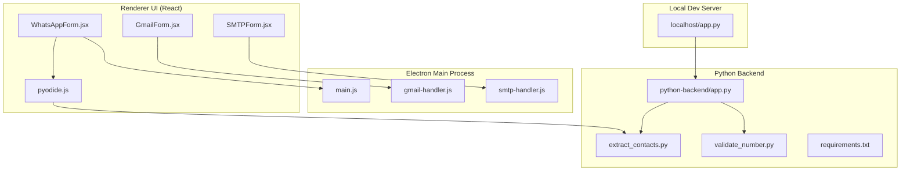
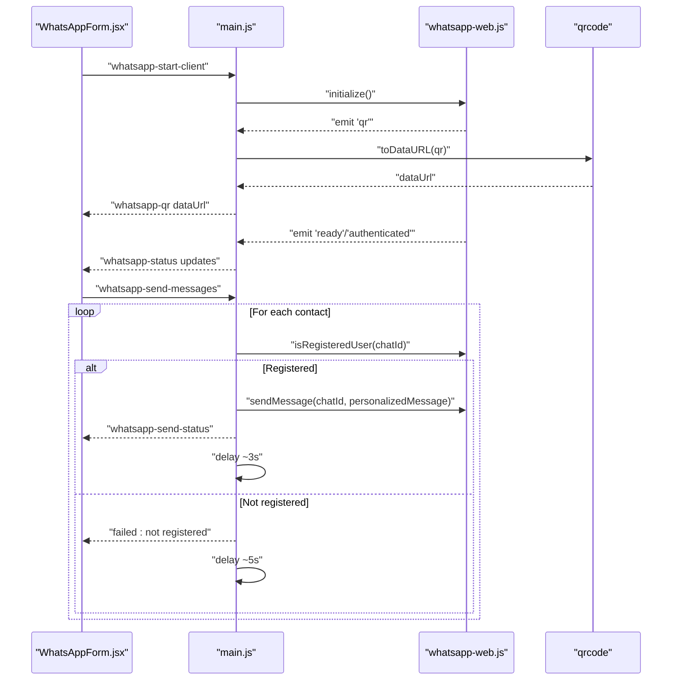
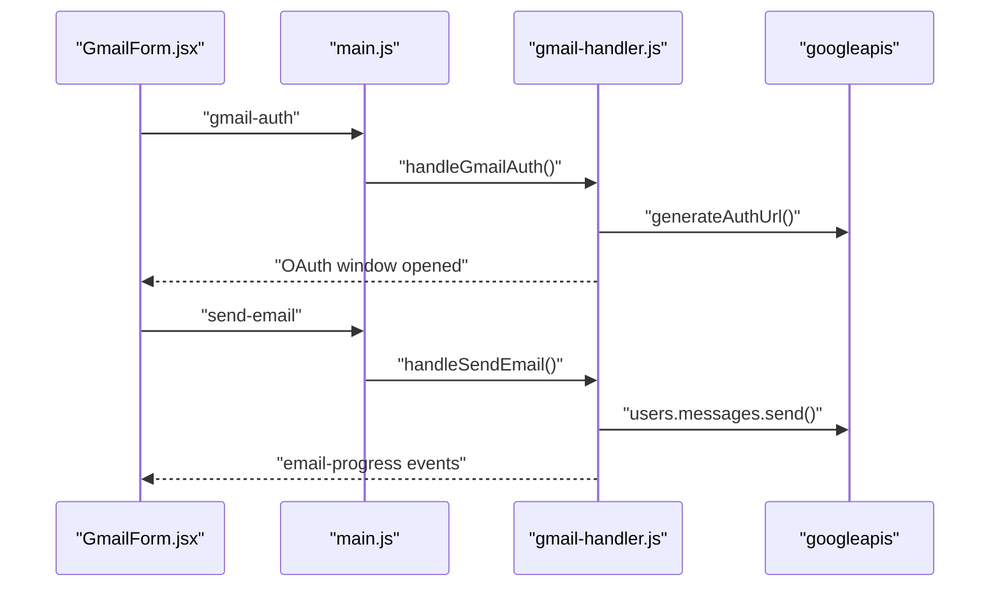
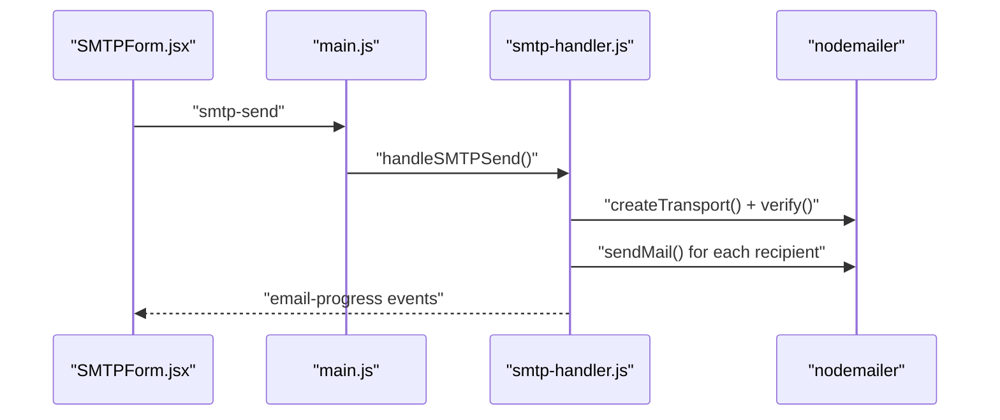
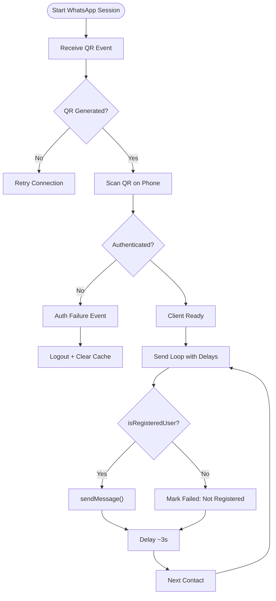
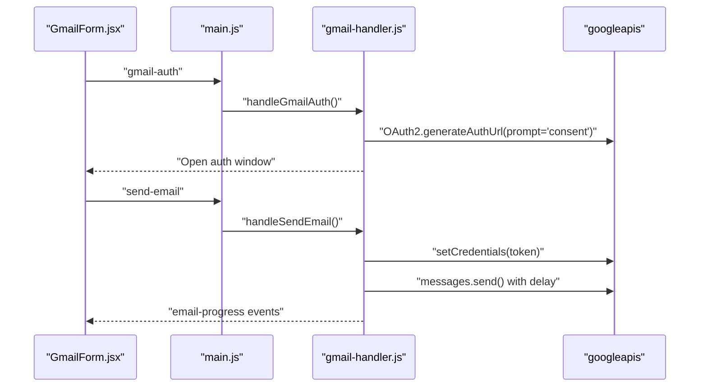
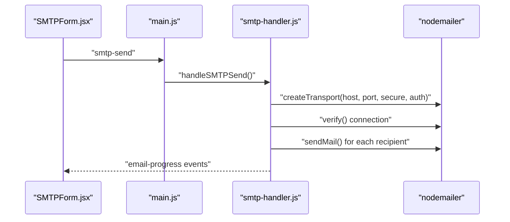
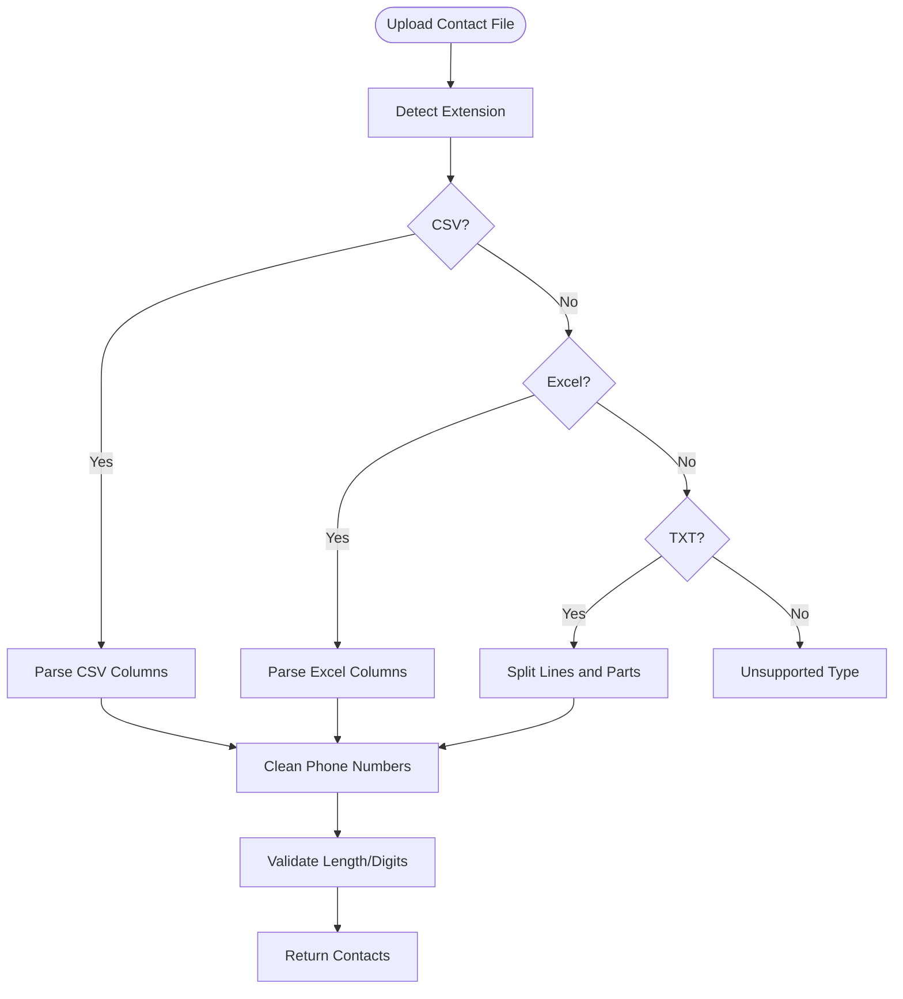
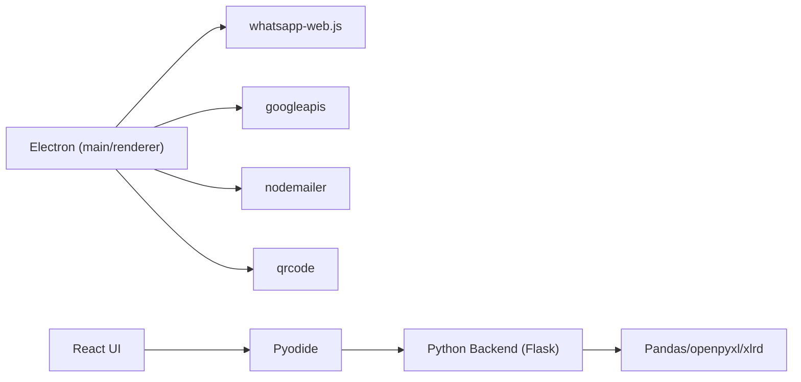

# Troubleshooting Guide

<cite>
**Referenced Files in This Document**
- [README.md](file://README.md)
- [main.js](file://electron/src/electron/main.js)
- [gmail-handler.js](file://electron/src/electron/gmail-handler.js)
- [smtp-handler.js](file://electron/src/electron/smtp-handler.js)
- [WhatsAppForm.jsx](file://electron/src/components/WhatsAppForm.jsx)
- [GmailForm.jsx](file://electron/src/components/GmailForm.jsx)
- [SMTPForm.jsx](file://electron/src/components/SMTPForm.jsx)
- [pyodide.js](file://electron/src/utils/pyodide.js)
- [package.json](file://electron/package.json)
- [app.py](file://python-backend/app.py)
- [extract_contacts.py](file://python-backend/extract_contacts.py)
- [validate_number.py](file://python-backend/validate_number.py)
- [requirements.txt](file://python-backend/requirements.txt)
- [localhost/app.py](file://localhost/app.py)
</cite>

## Table of Contents
1. [Introduction](#introduction)
2. [Project Structure](#project-structure)
3. [Core Components](#core-components)
4. [Architecture Overview](#architecture-overview)
5. [Detailed Component Analysis](#detailed-component-analysis)
6. [Dependency Analysis](#dependency-analysis)
7. [Performance Considerations](#performance-considerations)
8. [Troubleshooting Guide](#troubleshooting-guide)
9. [Conclusion](#conclusion)

## Introduction
This guide provides comprehensive troubleshooting procedures for the Bulk Messaging System, focusing on:
- WhatsApp-related issues (QR authentication failures, connection timeouts, rate limiting)
- Gmail API authentication and quota/performance issues
- SMTP connection and credential problems
- Contact import and validation errors
- Application performance, memory, and crash recovery
- Platform-specific diagnostics (Windows, macOS, Linux)
- Security and credential management

The goal is to help users diagnose, isolate, and resolve common issues quickly using actionable steps and diagnostic techniques.

## Project Structure
The system comprises:
- Electron main/renderer processes with React UI
- Python backend for contact processing and validation
- Gmail API and SMTP integrations
- Pyodide-based Python execution in the renderer for manual number parsing

**Diagram sources**
- [main.js](file://electron/src/electron/main.js#L1-L371)
- [gmail-handler.js](file://electron/src/electron/gmail-handler.js#L1-L227)
- [smtp-handler.js](file://electron/src/electron/smtp-handler.js#L1-L110)
- [WhatsAppForm.jsx](file://electron/src/components/WhatsAppForm.jsx#L1-L609)
- [GmailForm.jsx](file://electron/src/components/GmailForm.jsx#L1-L332)
- [SMTPForm.jsx](file://electron/src/components/SMTPForm.jsx#L1-L390)
- [pyodide.js](file://electron/src/utils/pyodide.js#L1-L33)
- [app.py](file://python-backend/app.py#L1-L378)
- [extract_contacts.py](file://python-backend/extract_contacts.py#L1-L177)
- [validate_number.py](file://python-backend/validate_number.py#L1-L27)
- [requirements.txt](file://python-backend/requirements.txt#L1-L7)
- [localhost/app.py](file://localhost/app.py#L1-L306)

**Section sources**
- [README.md](file://README.md#L1-L455)
- [package.json](file://electron/package.json#L1-L49)

## Core Components
- WhatsApp integration: QR generation, authentication events, message sending loop with delays
- Gmail API: OAuth2 flow, token persistence, email sending with progress reporting
- SMTP: Nodemailer transport creation, verification, sending loop with delays
- Contact processing: CSV/Excel/TXT parsing, phone number cleaning/validation, manual number parsing via Pyodide
- UI components: Real-time status, logs, and progress displays

Key implementation references:
- WhatsApp client lifecycle and events: [main.js](file://electron/src/electron/main.js#L110-L177)
- Gmail OAuth and send loop: [gmail-handler.js](file://electron/src/electron/gmail-handler.js#L15-L130), [gmail-handler.js](file://electron/src/electron/gmail-handler.js#L141-L214)
- SMTP send loop and verification: [smtp-handler.js](file://electron/src/electron/smtp-handler.js#L6-L105)
- Contact parsing and validation: [app.py](file://python-backend/app.py#L282-L370), [extract_contacts.py](file://python-backend/extract_contacts.py#L160-L177), [validate_number.py](file://python-backend/validate_number.py#L6-L27)
- Manual number parsing via Pyodide: [pyodide.js](file://electron/src/utils/pyodide.js#L26-L33)

**Section sources**
- [main.js](file://electron/src/electron/main.js#L110-L177)
- [gmail-handler.js](file://electron/src/electron/gmail-handler.js#L15-L130)
- [gmail-handler.js](file://electron/src/electron/gmail-handler.js#L141-L214)
- [smtp-handler.js](file://electron/src/electron/smtp-handler.js#L6-L105)
- [app.py](file://python-backend/app.py#L282-L370)
- [extract_contacts.py](file://python-backend/extract_contacts.py#L160-L177)
- [validate_number.py](file://python-backend/validate_number.py#L6-L27)
- [pyodide.js](file://electron/src/utils/pyodide.js#L26-L33)

## Architecture Overview
High-level flows for each major feature area:

**Diagram sources**
- [main.js](file://electron/src/electron/main.js#L110-L177)
- [main.js](file://electron/src/electron/main.js#L179-L213)
- [WhatsAppForm.jsx](file://electron/src/components/WhatsAppForm.jsx#L1-L609)

**Diagram sources**
- [gmail-handler.js](file://electron/src/electron/gmail-handler.js#L15-L130)
- [gmail-handler.js](file://electron/src/electron/gmail-handler.js#L141-L214)
- [GmailForm.jsx](file://electron/src/components/GmailForm.jsx#L1-L332)

**Diagram sources**
- [smtp-handler.js](file://electron/src/electron/smtp-handler.js#L6-L105)
- [SMTPForm.jsx](file://electron/src/components/SMTPForm.jsx#L1-L390)

## Detailed Component Analysis

### WhatsApp Troubleshooting
Common issues and resolutions:
- QR code not loading or rendering
  - Causes: Puppeteer headless mode, missing sandbox args, QR generation failure
  - Steps: Reconnect, clear cached auth/session files, restart app, check console logs
  - References: [main.js](file://electron/src/electron/main.js#L120-L148), [main.js](file://electron/src/electron/main.js#L320-L340)
- Authentication failures
  - Causes: Expired/invalid session, blocked device, network issues
  - Steps: Logout and clear cache, reconnect, ensure stable internet
  - References: [main.js](file://electron/src/electron/main.js#L162-L164), [main.js](file://electron/src/electron/main.js#L343-L371)
- Disconnections
  - Causes: Network instability, long idle periods
  - Steps: Reconnect, reduce delays, monitor status logs
  - References: [main.js](file://electron/src/electron/main.js#L166-L169)
- Sending delays and rate limiting
  - Mechanism: Built-in delays between messages to avoid detection
  - Steps: Adjust delays, monitor “not registered” vs “failed” statuses
  - References: [main.js](file://electron/src/electron/main.js#L194-L209)

**Diagram sources**
- [main.js](file://electron/src/electron/main.js#L110-L177)
- [main.js](file://electron/src/electron/main.js#L179-L213)

**Section sources**
- [main.js](file://electron/src/electron/main.js#L110-L177)
- [main.js](file://electron/src/electron/main.js#L179-L213)
- [main.js](file://electron/src/electron/main.js#L320-L371)
- [WhatsAppForm.jsx](file://electron/src/components/WhatsAppForm.jsx#L1-L609)

### Gmail API Troubleshooting
Common issues and resolutions:
- OAuth2 authentication failures
  - Causes: Missing environment variables, consent screen not shown, redirect mismatch
  - Steps: Verify GOOGLE_CLIENT_ID/GOOGLE_CLIENT_SECRET, ensure prompt=consent, check redirect URI
  - References: [gmail-handler.js](file://electron/src/electron/gmail-handler.js#L19-L42), [gmail-handler.js](file://electron/src/electron/gmail-handler.js#L63-L125)
- Token retrieval and storage
  - Mechanism: Store refresh token securely; reuse on subsequent runs
  - Steps: Confirm token presence, re-authenticate if missing
  - References: [gmail-handler.js](file://electron/src/electron/gmail-handler.js#L96-L107), [gmail-handler.js](file://electron/src/electron/gmail-handler.js#L132-L139)
- Email sending progress and failures
  - Mechanism: Per-recipient progress events, delay between sends
  - Steps: Inspect email-progress events, adjust delay, review error messages
  - References: [gmail-handler.js](file://electron/src/electron/gmail-handler.js#L163-L207), [GmailForm.jsx](file://electron/src/components/GmailForm.jsx#L288-L322)

**Diagram sources**
- [gmail-handler.js](file://electron/src/electron/gmail-handler.js#L15-L130)
- [gmail-handler.js](file://electron/src/electron/gmail-handler.js#L141-L214)
- [GmailForm.jsx](file://electron/src/components/GmailForm.jsx#L259-L328)

**Section sources**
- [gmail-handler.js](file://electron/src/electron/gmail-handler.js#L15-L130)
- [gmail-handler.js](file://electron/src/electron/gmail-handler.js#L132-L139)
- [gmail-handler.js](file://electron/src/electron/gmail-handler.js#L141-L214)
- [GmailForm.jsx](file://electron/src/components/GmailForm.jsx#L1-L332)

### SMTP Troubleshooting
Common issues and resolutions:
- Connection verification failures
  - Causes: Incorrect host/port/security settings, firewall, TLS issues
  - Steps: Verify credentials, test with nodemailer.verify(), adjust secure flag
  - References: [smtp-handler.js](file://electron/src/electron/smtp-handler.js#L33-L48)
- Authentication failures
  - Causes: Wrong username/password, two-factor auth, app-specific passwords
  - Steps: Use correct credentials, enable less secure apps if required, retry
  - References: [smtp-handler.js](file://electron/src/electron/smtp-handler.js#L38-L41)
- Network connectivity problems
  - Causes: Corporate firewall, ISP blocks, DNS issues
  - Steps: Test external SMTP servers, adjust ports (587/465), verify TLS
  - References: [README.md](file://README.md#L120-L133)
- Email sending progress and failures
  - Mechanism: Per-recipient progress events, delay between sends
  - Steps: Inspect email-progress events, adjust delay, review error messages
  - References: [smtp-handler.js](file://electron/src/electron/smtp-handler.js#L52-L99), [SMTPForm.jsx](file://electron/src/components/SMTPForm.jsx#L346-L382)

**Diagram sources**
- [smtp-handler.js](file://electron/src/electron/smtp-handler.js#L6-L105)
- [SMTPForm.jsx](file://electron/src/components/SMTPForm.jsx#L317-L386)

**Section sources**
- [smtp-handler.js](file://electron/src/electron/smtp-handler.js#L6-L105)
- [README.md](file://README.md#L120-L133)
- [SMTPForm.jsx](file://electron/src/components/SMTPForm.jsx#L1-L390)

### Contact Import and Processing Troubleshooting
Common issues and resolutions:
- Unsupported file formats
  - Supported: CSV, Excel (.xlsx/.xls), TXT
  - Steps: Convert files to supported formats, ensure UTF-8 encoding
  - References: [app.py](file://python-backend/app.py#L247-L257), [extract_contacts.py](file://python-backend/extract_contacts.py#L160-L177)
- CSV parsing errors
  - Causes: Unexpected delimiters, missing headers, mixed encodings
  - Steps: Normalize headers, standardize delimiters, validate encoding
  - References: [app.py](file://python-backend/app.py#L58-L125), [extract_contacts.py](file://python-backend/extract_contacts.py#L25-L81)
- TXT parsing issues
  - Causes: Non-standard separators, extra whitespace
  - Steps: Use comma or tab separators, trim lines
  - References: [app.py](file://python-backend/app.py#L128-L176), [extract_contacts.py](file://python-backend/extract_contacts.py#L84-L118)
- Phone number validation and formatting
  - Mechanism: Cleaning, digit-only checks, length validation
  - Steps: Use validate-number endpoint, review cleaned numbers
  - References: [app.py](file://python-backend/app.py#L343-L370), [validate_number.py](file://python-backend/validate_number.py#L6-L27)
- Manual number parsing via Pyodide
  - Steps: Ensure Pyodide loaded, check console for errors, retry parsing
  - References: [pyodide.js](file://electron/src/utils/pyodide.js#L5-L24), [WhatsAppForm.jsx](file://electron/src/components/WhatsAppForm.jsx#L41-L62)

**Diagram sources**
- [app.py](file://python-backend/app.py#L232-L281)
- [app.py](file://python-backend/app.py#L58-L176)
- [extract_contacts.py](file://python-backend/extract_contacts.py#L25-L177)
- [validate_number.py](file://python-backend/validate_number.py#L6-L27)

**Section sources**
- [app.py](file://python-backend/app.py#L232-L281)
- [app.py](file://python-backend/app.py#L58-L176)
- [extract_contacts.py](file://python-backend/extract_contacts.py#L25-L177)
- [validate_number.py](file://python-backend/validate_number.py#L6-L27)
- [pyodide.js](file://electron/src/utils/pyodide.js#L5-L24)
- [WhatsAppForm.jsx](file://electron/src/components/WhatsAppForm.jsx#L41-L62)

## Dependency Analysis
External libraries and their roles:
- Electron main/renderer: IPC, dialogs, QR generation, WhatsApp client
- Google APIs: OAuth2, Gmail send
- Nodemailer: SMTP transport and sending
- whatsapp-web.js: WhatsApp Web integration
- Pyodide: Python runtime in browser for manual number parsing
- Flask/Pandas: Contact processing backend

**Diagram sources**
- [package.json](file://electron/package.json#L20-L31)
- [requirements.txt](file://python-backend/requirements.txt#L1-L7)

**Section sources**
- [package.json](file://electron/package.json#L20-L31)
- [requirements.txt](file://python-backend/requirements.txt#L1-L7)

## Performance Considerations
- Rate limiting and delays
  - WhatsApp: ~3s delay after successful send; ~5s after failure
  - Gmail/SMTP: configurable delay between emails
  - References: [main.js](file://electron/src/electron/main.js#L194-L209), [gmail-handler.js](file://electron/src/electron/gmail-handler.js#L190-L194), [smtp-handler.js](file://electron/src/electron/smtp-handler.js#L83-L87)
- Memory and session cleanup
  - Clear WhatsApp cache/auth directories on logout/close
  - References: [main.js](file://electron/src/electron/main.js#L320-L340), [main.js](file://electron/src/electron/main.js#L343-L371)
- UI responsiveness
  - Use progress events and disable controls during sending
  - References: [GmailForm.jsx](file://electron/src/components/GmailForm.jsx#L230-L254), [SMTPForm.jsx](file://electron/src/components/SMTPForm.jsx#L288-L312), [WhatsAppForm.jsx](file://electron/src/components/WhatsAppForm.jsx#L470-L490)

[No sources needed since this section provides general guidance]

## Troubleshooting Guide

### WhatsApp Troubleshooting
- QR code not loading
  - Verify internet connectivity and device stability
  - Restart the app and reconnect
  - Clear cached auth/session files and retry
  - References: [main.js](file://electron/src/electron/main.js#L137-L148), [main.js](file://electron/src/electron/main.js#L320-L340)
- Authentication failures
  - Ensure consent screen appears and redirect matches configured URI
  - Re-authenticate if token invalid/expired
  - References: [gmail-handler.js](file://electron/src/electron/gmail-handler.js#L38-L42), [gmail-handler.js](file://electron/src/electron/gmail-handler.js#L96-L107)
- Connection timeouts/disconnections
  - Improve network stability; reconnect and resume
  - Monitor “disconnected” events and reset state
  - References: [main.js](file://electron/src/electron/main.js#L166-L169)
- Rate limiting and delays
  - Adjust delays to balance speed and safety
  - Review “not registered” vs “failed” outcomes
  - References: [main.js](file://electron/src/electron/main.js#L194-L209)

**Section sources**
- [main.js](file://electron/src/electron/main.js#L137-L148)
- [main.js](file://electron/src/electron/main.js#L166-L169)
- [main.js](file://electron/src/electron/main.js#L194-L209)
- [gmail-handler.js](file://electron/src/electron/gmail-handler.js#L38-L42)
- [gmail-handler.js](file://electron/src/electron/gmail-handler.js#L96-L107)

### Gmail API Troubleshooting
- OAuth2 authentication problems
  - Confirm GOOGLE_CLIENT_ID and GOOGLE_CLIENT_SECRET are set
  - Ensure prompt=consent is used to receive refresh tokens
  - Check redirect URI alignment with local callback
  - References: [gmail-handler.js](file://electron/src/electron/gmail-handler.js#L19-L42), [gmail-handler.js](file://electron/src/electron/gmail-handler.js#L63-L125)
- API quota exceeded or throttling
  - Reduce send frequency using delay setting
  - Monitor per-recipient progress and errors
  - References: [gmail-handler.js](file://electron/src/electron/gmail-handler.js#L190-L194), [gmail-handler.js](file://electron/src/electron/gmail-handler.js#L195-L206)
- Permission issues
  - Ensure Gmail API is enabled and OAuth consent screen configured
  - References: [README.md](file://README.md#L101-L110)

**Section sources**
- [gmail-handler.js](file://electron/src/electron/gmail-handler.js#L19-L42)
- [gmail-handler.js](file://electron/src/electron/gmail-handler.js#L63-L125)
- [gmail-handler.js](file://electron/src/electron/gmail-handler.js#L190-L206)
- [README.md](file://README.md#L101-L110)

### SMTP Troubleshooting
- Server configuration errors
  - Verify host, port, and secure flag match provider requirements
  - Use 587/465 as appropriate; enable TLS/SSL accordingly
  - References: [README.md](file://README.md#L120-L133)
- Authentication failures
  - Use correct username/password; consider app-specific passwords
  - References: [smtp-handler.js](file://electron/src/electron/smtp-handler.js#L38-L41)
- Network connectivity problems
  - Test with external SMTP providers; check firewall and DNS
  - References: [smtp-handler.js](file://electron/src/electron/smtp-handler.js#L47-L48)
- Email sending progress and failures
  - Inspect email-progress events; adjust delay and review error messages
  - References: [smtp-handler.js](file://electron/src/electron/smtp-handler.js#L52-L99), [SMTPForm.jsx](file://electron/src/components/SMTPForm.jsx#L346-L382)

**Section sources**
- [README.md](file://README.md#L120-L133)
- [smtp-handler.js](file://electron/src/electron/smtp-handler.js#L38-L48)
- [smtp-handler.js](file://electron/src/electron/smtp-handler.js#L52-L99)
- [SMTPForm.jsx](file://electron/src/components/SMTPForm.jsx#L317-L386)

### Contact Import and Processing Troubleshooting
- File format problems
  - Supported: CSV, Excel (.xlsx/.xls), TXT
  - Ensure UTF-8 encoding and standard delimiters
  - References: [app.py](file://python-backend/app.py#L247-L257), [extract_contacts.py](file://python-backend/extract_contacts.py#L160-L177)
- Validation errors
  - Use validate-number endpoint to check cleaned numbers
  - References: [app.py](file://python-backend/app.py#L343-L370), [validate_number.py](file://python-backend/validate_number.py#L6-L27)
- Manual number parsing via Pyodide
  - Ensure Pyodide is loaded; check console for errors
  - References: [pyodide.js](file://electron/src/utils/pyodide.js#L5-L24), [WhatsAppForm.jsx](file://electron/src/components/WhatsAppForm.jsx#L41-L62)

**Section sources**
- [app.py](file://python-backend/app.py#L247-L257)
- [app.py](file://python-backend/app.py#L343-L370)
- [extract_contacts.py](file://python-backend/extract_contacts.py#L160-L177)
- [validate_number.py](file://python-backend/validate_number.py#L6-L27)
- [pyodide.js](file://electron/src/utils/pyodide.js#L5-L24)
- [WhatsAppForm.jsx](file://electron/src/components/WhatsAppForm.jsx#L41-L62)

### Application Performance, Memory, and Crash Recovery
- Performance tuning
  - Increase delay between messages/emails to avoid throttling
  - Use progress events to keep UI responsive
  - References: [main.js](file://electron/src/electron/main.js#L190-L209), [gmail-handler.js](file://electron/src/electron/gmail-handler.js#L190-L194), [smtp-handler.js](file://electron/src/electron/smtp-handler.js#L83-L87)
- Memory leaks
  - Ensure cleanup of WhatsApp sessions and auth files on logout/close
  - References: [main.js](file://electron/src/electron/main.js#L343-L371), [main.js](file://electron/src/electron/main.js#L320-L340)
- Crash recovery
  - Restart app; clear cache/auth directories if stuck
  - References: [main.js](file://electron/src/electron/main.js#L320-L340)

**Section sources**
- [main.js](file://electron/src/electron/main.js#L320-L371)
- [main.js](file://electron/src/electron/main.js#L190-L209)
- [gmail-handler.js](file://electron/src/electron/gmail-handler.js#L190-L194)
- [smtp-handler.js](file://electron/src/electron/smtp-handler.js#L83-L87)

### Platform-Specific Troubleshooting
- Windows
  - Ensure Node.js and Python prerequisites are installed
  - Use Windows Defender exceptions if needed
  - References: [README.md](file://README.md#L61-L67)
- macOS
  - Use Apple Silicon or Intel builds as applicable
  - Check Gatekeeper and security preferences
  - References: [README.md](file://README.md#L342-L351)
- Linux
  - Install required system dependencies for Electron and Puppeteer
  - References: [README.md](file://README.md#L342-L351)

**Section sources**
- [README.md](file://README.md#L61-L67)
- [README.md](file://README.md#L342-L351)

### Security and Credential Management
- OAuth2 credentials
  - Store GOOGLE_CLIENT_ID and GOOGLE_CLIENT_SECRET securely
  - Use environment variables; avoid committing secrets
  - References: [gmail-handler.js](file://electron/src/electron/gmail-handler.js#L19-L29)
- SMTP credentials
  - Use encrypted storage when saving configs
  - Avoid storing plain-text passwords
  - References: [smtp-handler.js](file://electron/src/electron/smtp-handler.js#L22-L31)
- Encrypted storage
  - Electron Store persists tokens/configs securely
  - References: [gmail-handler.js](file://electron/src/electron/gmail-handler.js#L104-L105), [smtp-handler.js](file://electron/src/electron/smtp-handler.js#L22-L31)

**Section sources**
- [gmail-handler.js](file://electron/src/electron/gmail-handler.js#L19-L29)
- [smtp-handler.js](file://electron/src/electron/smtp-handler.js#L22-L31)

## Conclusion
This guide consolidates practical troubleshooting steps for WhatsApp, Gmail API, SMTP, and contact processing within the Bulk Messaging System. By following the diagnostic flows, adjusting configurations, and leveraging built-in progress/logging mechanisms, most issues can be resolved efficiently. For persistent problems, consult the referenced sections and logs, and consider platform-specific adjustments.