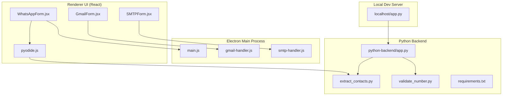
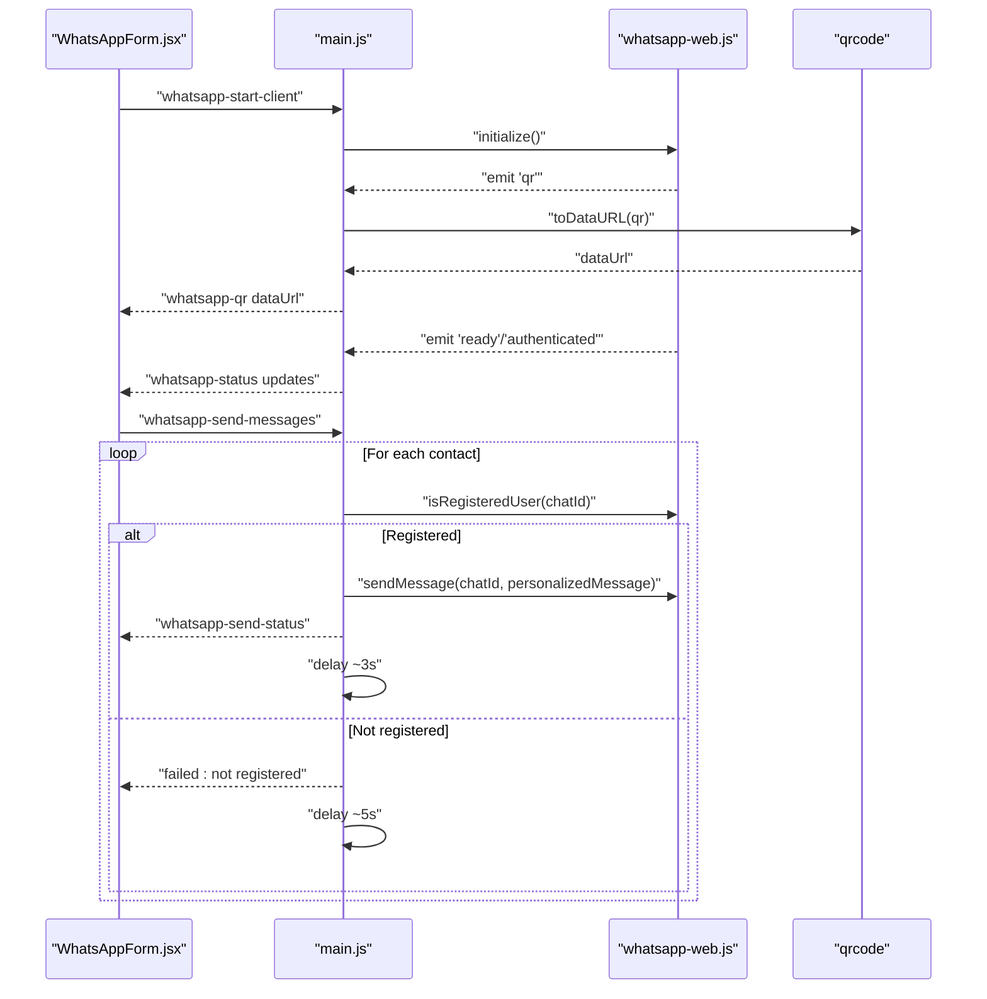
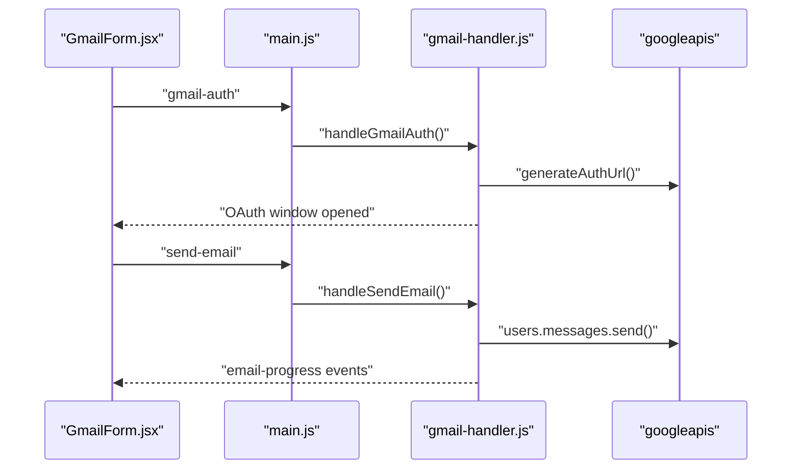
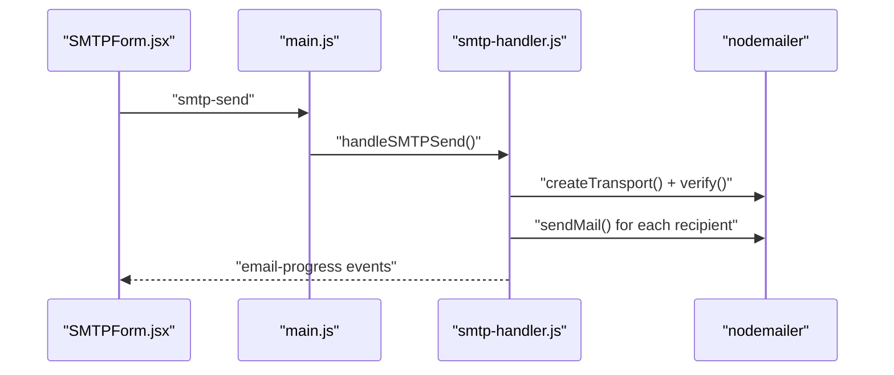
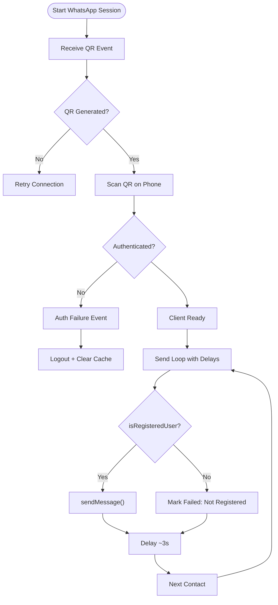
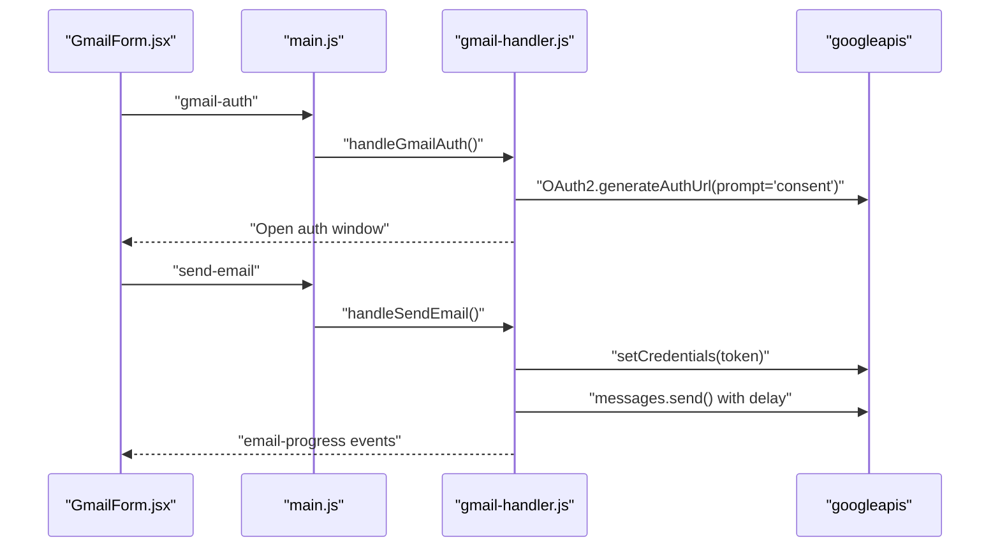
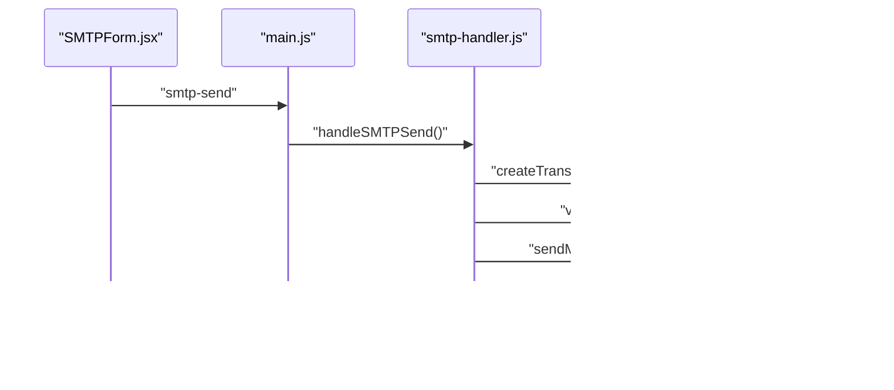
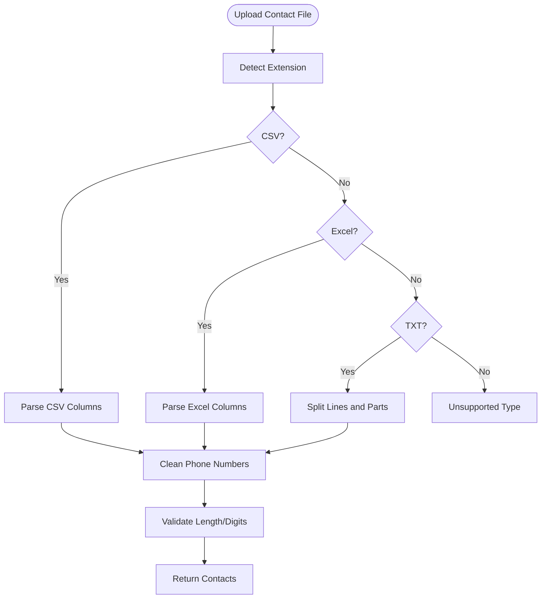
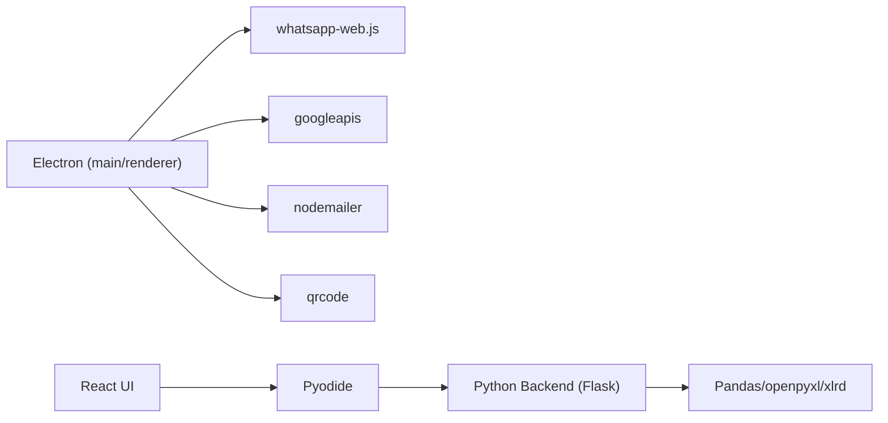

# Troubleshooting guide

## Introduction
This guide provides detailed troubleshooting procedures for the Bulk Messaging System, focusing on:
- WhatsApp-related issues (QR authentication failures, connection timeouts, rate limiting)
- Gmail API authentication and quota/performance issues
- SMTP connection and credential problems
- Contact import and validation errors
- Application performance, memory, and crash recovery
- Platform-specific diagnostics (Windows, macOS, Linux)
- Security and credential management

The goal is to help users diagnose, isolate, and resolve common issues quickly using actionable steps and diagnostic techniques.

## Project structure
The system comprises:
- Electron main/renderer processes with React UI
- Python backend for contact processing and validation
- Gmail API and SMTP integrations
- Pyodide-based Python execution in the renderer for manual number parsing

```mermaid
graph TB
subgraph "Electron Main Process"
M["main.js"]
GH["gmail-handler.js"]
SH["smtp-handler.js"]
end
subgraph "Renderer UI (React)"
WF["WhatsAppForm.jsx"]
GF["GmailForm.jsx"]
SF["SMTPForm.jsx"]
PY["pyodide.js"]
end
subgraph "Python Backend"
PAPP["python-backend/app.py"]
PEXT["extract_contacts.py"]
PVAL["validate_number.py"]
PREQ["requirements.txt"]
end
subgraph "Local Dev Server"
LAP["localhost/app.py"]
end
WF --> PY
WF --> M
GF --> GH
SF --> SH
PY --> PEXT
PAPP --> PEXT
PAPP --> PVAL
LAP --> PAPP
```

## Core components
- WhatsApp integration: QR generation, authentication events, message sending loop with delays
- Gmail API: OAuth2 flow, token persistence, email sending with progress reporting
- SMTP: Nodemailer transport creation, verification, sending loop with delays
- Contact processing: CSV/Excel/TXT parsing, phone number cleaning/validation, manual number parsing via Pyodide
- UI components: Real-time status, logs, and progress displays

Key implementation references:
- WhatsApp client lifecycle and events: `main.js`
- Gmail OAuth and send loop: `gmail-handler.js`, `gmail-handler.js`
- SMTP send loop and verification: `smtp-handler.js`
- Contact parsing and validation: `app.py`, `extract_contacts.py`, `validate_number.py`
- Manual number parsing via Pyodide: `pyodide.js`

## Architecture overview
High-level flows for each major feature area:

```mermaid
sequenceDiagram
participant UI as "WhatsAppForm.jsx"
participant Main as "main.js"
participant WWeb as "whatsapp-web.js"
participant QR as "qrcode"
UI->>Main : "whatsapp-start-client"
Main->>WWeb : "initialize()"
WWeb-->>Main : "emit 'qr'"
Main->>QR : "toDataURL(qr)"
QR-->>Main : "dataUrl"
Main-->>UI : "whatsapp-qr dataUrl"
WWeb-->>Main : "emit 'ready'/'authenticated'"
Main-->>UI : "whatsapp-status updates"
UI->>Main : "whatsapp-send-messages"
loop For each contact
Main->>WWeb : "isRegisteredUser(chatId)"
alt Registered
Main->>WWeb : "sendMessage(chatId, personalizedMessage)"
Main-->>UI : "whatsapp-send-status"
Main->>Main : "delay ~3s"
else Not registered
Main-->>UI : "failed : not registered"
Main->>Main : "delay ~5s"
end
end
```

```mermaid
sequenceDiagram
participant UI as "GmailForm.jsx"
participant Main as "main.js"
participant GH as "gmail-handler.js"
participant GA as "googleapis"
UI->>Main : "gmail-auth"
Main->>GH : "handleGmailAuth()"
GH->>GA : "generateAuthUrl()"
GH-->>UI : "OAuth window opened"
UI->>Main : "send-email"
Main->>GH : "handleSendEmail()"
GH->>GA : "users.messages.send()"
GH-->>UI : "email-progress events"
```

```mermaid
sequenceDiagram
participant UI as "SMTPForm.jsx"
participant Main as "main.js"
participant SH as "smtp-handler.js"
participant NM as "nodemailer"
UI->>Main : "smtp-send"
Main->>SH : "handleSMTPSend()"
SH->>NM : "createTransport() + verify()"
SH->>NM : "sendMail() for each recipient"
SH-->>UI : "email-progress events"
```

## Detailed component analysis

### WhatsApp troubleshooting
Common issues and resolutions:
- QR code not loading or rendering
  - Causes: Puppeteer headless mode, missing sandbox args, QR generation failure
  - Steps: Reconnect, clear cached auth/session files, restart app, check console logs
  - References: `main.js`, `main.js`
- Authentication failures
  - Causes: Expired/invalid session, blocked device, network issues
  - Steps: Logout and clear cache, reconnect, ensure stable internet
  - References: `main.js`, `main.js`
- Disconnections
  - Causes: Network instability, long idle periods
  - Steps: Reconnect, reduce delays, monitor status logs
  - References: `main.js`
- Sending delays and rate limiting
  - Mechanism: Built-in delays between messages to avoid detection
  - Steps: Adjust delays, monitor "not registered" vs "failed" statuses
  - References: `main.js`

```mermaid
flowchart TD
Start(["Start WhatsApp Session"]) --> QR["Receive QR Event"]
QR --> QRFail{"QR Generated?"}
QRFail --> |No| Retry["Retry Connection"]
QRFail --> |Yes| Scan["Scan QR on Phone"]
Scan --> Auth{"Authenticated?"}
Auth --> |No| AuthFail["Auth Failure Event"]
AuthFail --> Cleanup["Logout + Clear Cache"]
Auth --> Ready["Client Ready"]
Ready --> SendLoop["Send Loop with Delays"]
SendLoop --> CheckReg{"isRegisteredUser?"}
CheckReg --> |Yes| SendMessage["sendMessage()"]
CheckReg --> |No| NotReg["Mark Failed: Not Registered"]
SendMessage --> Delay["Delay ~3s"]
NotReg --> Delay
Delay --> Next["Next Contact"]
Next --> SendLoop
```

### Gmail API troubleshooting
Common issues and resolutions:
- OAuth2 authentication failures
  - Causes: Missing environment variables, consent screen not shown, redirect mismatch
  - Steps: Verify GOOGLE_CLIENT_ID/GOOGLE_CLIENT_SECRET, ensure prompt=consent, check redirect URI
  - References: `gmail-handler.js`, `gmail-handler.js`
- Token retrieval and storage
  - Mechanism: Store refresh token securely; reuse on subsequent runs
  - Steps: Confirm token presence, re-authenticate if missing
  - References: `gmail-handler.js`, `gmail-handler.js`
- Email sending progress and failures
  - Mechanism: Per-recipient progress events, delay between sends
  - Steps: Inspect email-progress events, adjust delay, review error messages
  - References: `gmail-handler.js`, `GmailForm.jsx`

```mermaid
sequenceDiagram
participant UI as "GmailForm.jsx"
participant Main as "main.js"
participant GH as "gmail-handler.js"
participant GA as "googleapis"
UI->>Main : "gmail-auth"
Main->>GH : "handleGmailAuth()"
GH->>GA : "OAuth2.generateAuthUrl(prompt='consent')"
GH-->>UI : "Open auth window"
UI->>Main : "send-email"
Main->>GH : "handleSendEmail()"
GH->>GA : "setCredentials(token)"
GH->>GA : "messages.send() with delay"
GH-->>UI : "email-progress events"
```

### SMTP troubleshooting
Common issues and resolutions:
- Connection verification failures
  - Causes: Incorrect host/port/security settings, firewall, TLS issues
  - Steps: Verify credentials, test with nodemailer.verify(), adjust secure flag
  - References: `smtp-handler.js`
- Authentication failures
  - Causes: Wrong username/password, two-factor auth, app-specific passwords
  - Steps: Use correct credentials, enable less secure apps if required, retry
  - References: `smtp-handler.js`
- Network connectivity problems
  - Causes: Corporate firewall, ISP blocks, DNS issues
  - Steps: Test external SMTP servers, adjust ports (587/465), verify TLS
  - References: `README.md`
- Email sending progress and failures
  - Mechanism: Per-recipient progress events, delay between sends
  - Steps: Inspect email-progress events, adjust delay, review error messages
  - References: `smtp-handler.js`, `SMTPForm.jsx`

```mermaid
sequenceDiagram
participant UI as "SMTPForm.jsx"
participant Main as "main.js"
participant SH as "smtp-handler.js"
participant NM as "nodemailer"
UI->>Main : "smtp-send"
Main->>SH : "handleSMTPSend()"
SH->>NM : "createTransport(host, port, secure, auth)"
SH->>NM : "verify() connection"
SH->>NM : "sendMail() for each recipient"
SH-->>UI : "email-progress events"
```

### Contact import and processing troubleshooting
Common issues and resolutions:
- Unsupported file formats
  - Supported: CSV, Excel (.xlsx/.xls), TXT
  - Steps: Convert files to supported formats, ensure UTF-8 encoding
  - References: `app.py`, `extract_contacts.py`
- CSV parsing errors
  - Causes: Unexpected delimiters, missing headers, mixed encodings
  - Steps: Normalize headers, standardize delimiters, validate encoding
  - References: `app.py`, `extract_contacts.py`
- TXT parsing issues
  - Causes: Non-standard separators, extra whitespace
  - Steps: Use comma or tab separators, trim lines
  - References: `app.py`, `extract_contacts.py`
- Phone number validation and formatting
  - Mechanism: Cleaning, digit-only checks, length validation
  - Steps: Use validate-number endpoint, review cleaned numbers
  - References: `app.py`, `validate_number.py`
- Manual number parsing via Pyodide
  - Steps: Ensure Pyodide loaded, check console for errors, retry parsing
  - References: `pyodide.js`, `WhatsAppForm.jsx`

```mermaid
flowchart TD
Start(["Upload Contact File"]) --> Detect["Detect Extension"]
Detect --> CSV{"CSV?"}
CSV --> |Yes| ParseCSV["Parse CSV Columns"]
CSV --> |No| EXCEL{"Excel?"}
EXCEL --> |Yes| ParseXLS["Parse Excel Columns"]
EXCEL --> |No| TXT{"TXT?"}
TXT --> |Yes| ParseTXT["Split Lines and Parts"]
TXT --> |No| Error["Unsupported Type"]
ParseCSV --> Clean["Clean Phone Numbers"]
ParseXLS --> Clean
ParseTXT --> Clean
Clean --> Validate["Validate Length/Digits"]
Validate --> Output["Return Contacts"]
```

## Dependency analysis
External libraries and their roles:
- Electron main/renderer: IPC, dialogs, QR generation, WhatsApp client
- Google APIs: OAuth2, Gmail send
- Nodemailer: SMTP transport and sending
- whatsapp-web.js: WhatsApp Web integration
- Pyodide: Python runtime in browser for manual number parsing
- Flask/Pandas: Contact processing backend

```mermaid
graph LR
E["Electron (main/renderer)"] --> WW["whatsapp-web.js"]
E --> GL["googleapis"]
E --> NM["nodemailer"]
E --> QR["qrcode"]
R["React UI"] --> PY["Pyodide"]
PY --> PC["Python Backend (Flask)"]
PC --> PD["Pandas/openpyxl/xlrd"]
```

## Performance considerations
- Rate limiting and delays
  - WhatsApp: ~3s delay after successful send; ~5s after failure
  - Gmail/SMTP: configurable delay between emails
  - References: `main.js`, `gmail-handler.js`, `smtp-handler.js`
- Memory and session cleanup
  - Clear WhatsApp cache/auth directories on logout/close
  - References: `main.js`, `main.js`
- UI responsiveness
  - Use progress events and disable controls during sending
  - References: `GmailForm.jsx`, `SMTPForm.jsx`, `WhatsAppForm.jsx`

[No sources needed since this section provides general guidance]

## Troubleshooting guide

### WhatsApp troubleshooting
- QR code not loading
  - Verify internet connectivity and device stability
  - Restart the app and reconnect
  - Clear cached auth/session files and retry
  - References: `main.js`, `main.js`
- Authentication failures
  - Ensure consent screen appears and redirect matches configured URI
  - Re-authenticate if token invalid/expired
  - References: `gmail-handler.js`, `gmail-handler.js`
- Connection timeouts/disconnections
  - Improve network stability; reconnect and resume
  - Monitor "disconnected" events and reset state
  - References: `main.js`
- Rate limiting and delays
  - Adjust delays to balance speed and safety
  - Review "not registered" vs "failed" outcomes
  - References: `main.js`

### Gmail API troubleshooting
- OAuth2 authentication problems
  - Confirm GOOGLE_CLIENT_ID and GOOGLE_CLIENT_SECRET are set
  - Ensure prompt=consent is used to receive refresh tokens
  - Check redirect URI alignment with local callback
  - References: `gmail-handler.js`, `gmail-handler.js`
- API quota exceeded or throttling
  - Reduce send frequency using delay setting
  - Monitor per-recipient progress and errors
  - References: `gmail-handler.js`, `gmail-handler.js`
- Permission issues
  - Ensure Gmail API is enabled and OAuth consent screen configured
  - References: `README.md`

### SMTP troubleshooting
- Server configuration errors
  - Verify host, port, and secure flag match provider requirements
  - Use 587/465 as appropriate; enable TLS/SSL accordingly
  - References: `README.md`
- Authentication failures
  - Use correct username/password; consider app-specific passwords
  - References: `smtp-handler.js`
- Network connectivity problems
  - Test with external SMTP providers; check firewall and DNS
  - References: `smtp-handler.js`
- Email sending progress and failures
  - Inspect email-progress events; adjust delay and review error messages
  - References: `smtp-handler.js`, `SMTPForm.jsx`

### Contact import and processing troubleshooting
- File format problems
  - Supported: CSV, Excel (.xlsx/.xls), TXT
  - Ensure UTF-8 encoding and standard delimiters
  - References: `app.py`, `extract_contacts.py`
- Validation errors
  - Use validate-number endpoint to check cleaned numbers
  - References: `app.py`, `validate_number.py`
- Manual number parsing via Pyodide
  - Ensure Pyodide is loaded; check console for errors
  - References: `pyodide.js`, `WhatsAppForm.jsx`

### Application performance, memory, and crash recovery
- Performance tuning
  - Increase delay between messages/emails to avoid throttling
  - Use progress events to keep UI responsive
  - References: `main.js`, `gmail-handler.js`, `smtp-handler.js`
- Memory leaks
  - Ensure cleanup of WhatsApp sessions and auth files on logout/close
  - References: `main.js`, `main.js`
- Crash recovery
  - Restart app; clear cache/auth directories if stuck
  - References: `main.js`

### Platform-Specific troubleshooting
- Windows
  - Ensure Node.js and Python prerequisites are installed
  - Use Windows Defender exceptions if needed
  - References: `README.md`
- macOS
  - Use Apple Silicon or Intel builds as applicable
  - Check Gatekeeper and security preferences
  - References: `README.md`
- Linux
  - Install required system dependencies for Electron and Puppeteer
  - References: `README.md`

### Security and credential management
- OAuth2 credentials
  - Store GOOGLE_CLIENT_ID and GOOGLE_CLIENT_SECRET securely
  - Use environment variables; avoid committing secrets
  - References: `gmail-handler.js`
- SMTP credentials
  - Use encrypted storage when saving configs
  - Avoid storing plain-text passwords
  - References: `smtp-handler.js`
- Encrypted storage
  - Electron Store persists tokens/configs securely
  - References: `gmail-handler.js`, `smtp-handler.js`

## Conclusion
This guide consolidates practical troubleshooting steps for WhatsApp, Gmail API, SMTP, and contact processing within the Bulk Messaging System. By following the diagnostic flows, adjusting configurations, and using built-in progress/logging mechanisms, most issues can be resolved efficiently. For persistent problems, consult the referenced sections and logs, and consider platform-specific adjustments.
