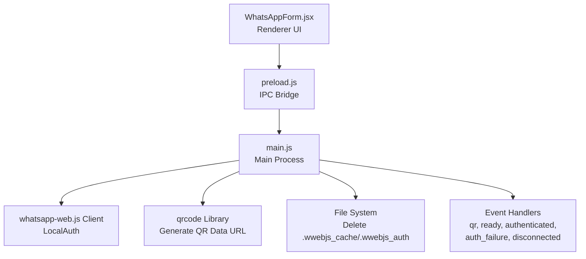
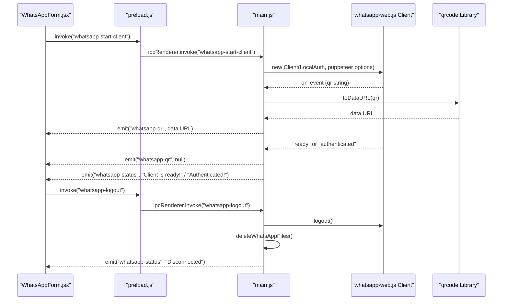
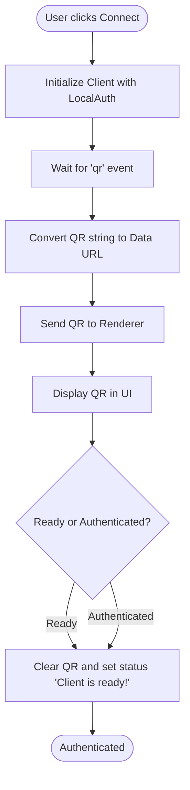
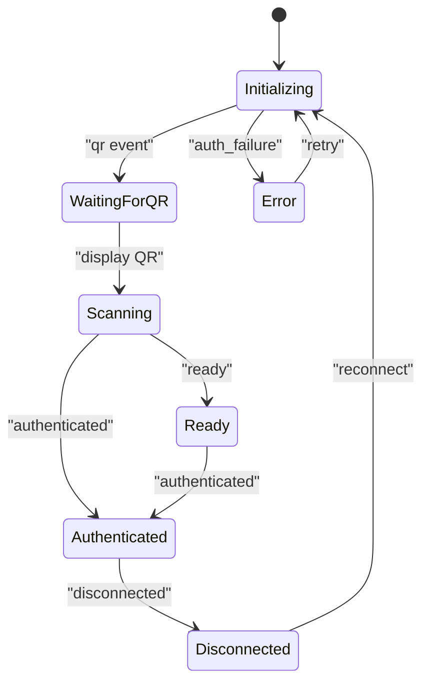
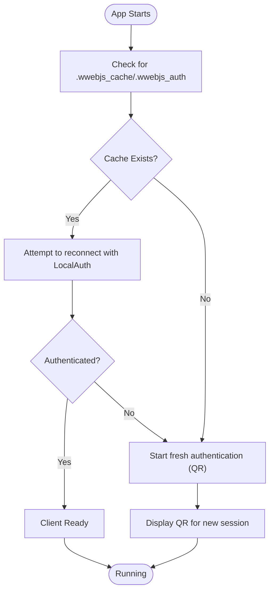
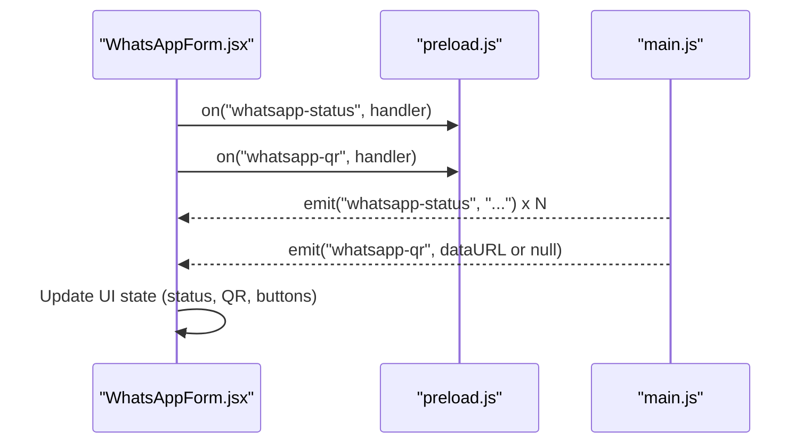
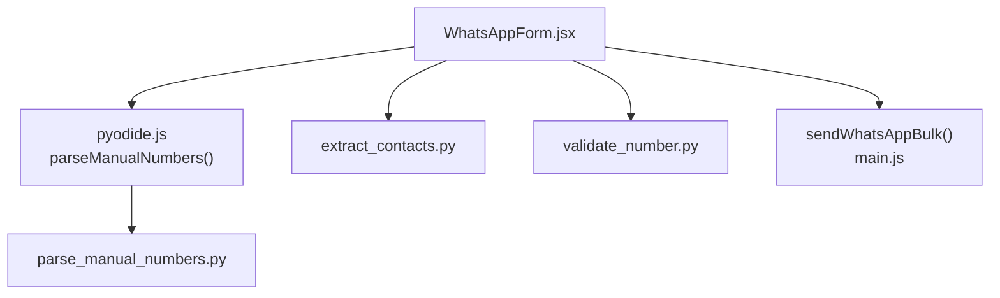
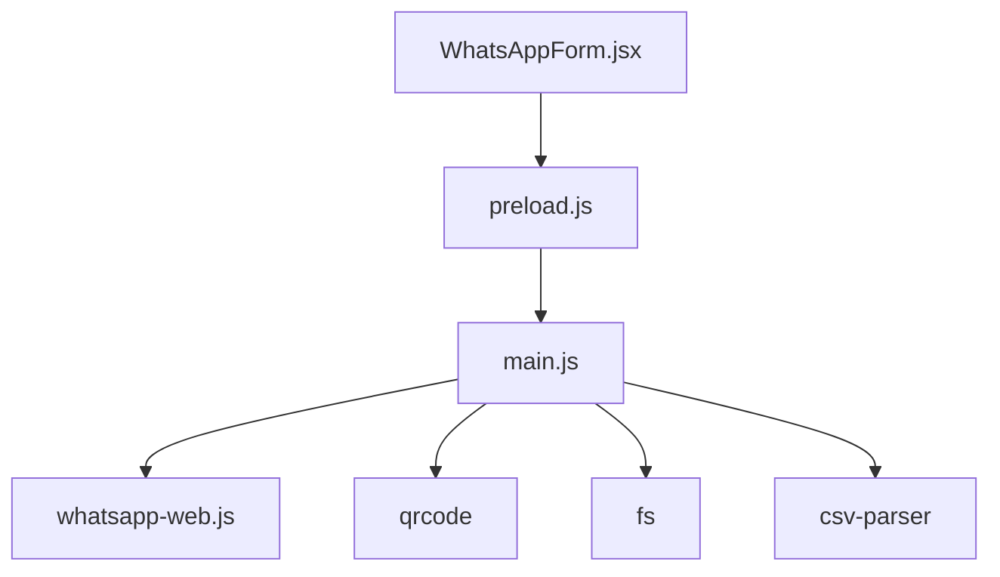

# Authentication and Session Management

<cite>
**Referenced Files in This Document**
- [README.md](file://README.md)
- [main.js](file://electron/src/electron/main.js)
- [preload.js](file://electron/src/electron/preload.js)
- [WhatsAppForm.jsx](file://electron/src/components/WhatsAppForm.jsx)
- [BulkMailer.jsx](file://electron/src/components/BulkMailer.jsx)
- [package.json](file://electron/package.json)
- [pyodide.js](file://electron/src/utils/pyodide.js)
- [extract_contacts.py](file://python-backend/extract_contacts.py)
- [validate_number.py](file://python-backend/validate_number.py)
- [parse_manual_numbers.py](file://python-backend/parse_manual_numbers.py)
</cite>

## Table of Contents
1. [Introduction](#introduction)
2. [Project Structure](#project-structure)
3. [Core Components](#core-components)
4. [Architecture Overview](#architecture-overview)
5. [Detailed Component Analysis](#detailed-component-analysis)
6. [Dependency Analysis](#dependency-analysis)
7. [Performance Considerations](#performance-considerations)
8. [Troubleshooting Guide](#troubleshooting-guide)
9. [Security Considerations](#security-considerations)
10. [Conclusion](#conclusion)

## Introduction
This document explains the WhatsApp authentication and session management system implemented in the Electron application. It focuses on the QR code authentication flow using the LocalAuth strategy from whatsapp-web.js, the client lifecycle (startup, ready state, authentication failure handling, disconnection), session persistence and cache management for automatic reconnection, and practical troubleshooting steps for common issues. It also covers security considerations and best practices for local authentication storage and session cleanup.

## Project Structure
The authentication and session management spans three layers:
- Renderer UI (React): Presents the WhatsApp interface, displays QR code, and shows status/log.
- Preload bridge: Exposes secure IPC methods to the renderer for WhatsApp operations.
- Main process: Runs the whatsapp-web.js client with LocalAuth, handles events, and manages sessions.

**Diagram sources**
- [WhatsAppForm.jsx](file://electron/src/components/WhatsAppForm.jsx#L176-L278)
- [preload.js](file://electron/src/electron/preload.js#L23-L39)
- [main.js](file://electron/src/electron/main.js#L110-L177)
- [package.json](file://electron/package.json#L20-L31)

**Section sources**
- [README.md](file://README.md#L16-L24)
- [main.js](file://electron/src/electron/main.js#L1-L100)
- [preload.js](file://electron/src/electron/preload.js#L1-L41)
- [WhatsAppForm.jsx](file://electron/src/components/WhatsAppForm.jsx#L1-L120)

## Core Components
- WhatsApp client initialization and event handling in the main process using LocalAuth.
- Renderer UI that renders QR code, shows status, and triggers actions.
- IPC bridge exposing WhatsApp operations to the renderer.
- Session cleanup utilities to remove cached authentication and browser data.

Key responsibilities:
- Initialize client with LocalAuth and puppeteer options.
- Emit status updates for QR display, ready, authenticated, auth failure, and disconnection.
- Convert QR string to a data URL for rendering in the UI.
- Persist sessions locally via LocalAuth and clear them on logout or app close.
- Provide robust error handling and user feedback.

**Section sources**
- [main.js](file://electron/src/electron/main.js#L110-L177)
- [main.js](file://electron/src/electron/main.js#L320-L340)
- [preload.js](file://electron/src/electron/preload.js#L23-L39)
- [WhatsAppForm.jsx](file://electron/src/components/WhatsAppForm.jsx#L176-L278)

## Architecture Overview
The system uses a secure IPC model:
- The renderer invokes startWhatsAppClient via preload.js.
- The main process creates a Client with LocalAuth and registers event listeners.
- QR codes are generated as data URLs and sent to the renderer.
- On ready or authenticated, the QR is cleared and status indicates success.
- Logout and app lifecycle hooks trigger cleanup of session files.

**Diagram sources**
- [WhatsAppForm.jsx](file://electron/src/components/WhatsAppForm.jsx#L154-L172)
- [preload.js](file://electron/src/electron/preload.js#L23-L39)
- [main.js](file://electron/src/electron/main.js#L110-L177)
- [main.js](file://electron/src/electron/main.js#L342-L371)

## Detailed Component Analysis

### QR Code Authentication Flow (LocalAuth)
- Initialization: The main process creates a Client with LocalAuth and headless puppeteer options.
- QR Generation: On receiving the "qr" event, the main process converts the QR string to a data URL using the qrcode library and sends it to the renderer.
- UI Rendering: The renderer displays the QR code image and sets status to "Scan QR code to authenticate".
- Completion: On "ready" or "authenticated", the main process clears the QR and updates status to indicate success.

**Diagram sources**
- [main.js](file://electron/src/electron/main.js#L110-L177)
- [main.js](file://electron/src/electron/main.js#L137-L160)
- [WhatsAppForm.jsx](file://electron/src/components/WhatsAppForm.jsx#L176-L278)

**Section sources**
- [main.js](file://electron/src/electron/main.js#L110-L177)
- [package.json](file://electron/package.json#L25-L30)
- [WhatsAppForm.jsx](file://electron/src/components/WhatsAppForm.jsx#L176-L278)

### Client Lifecycle Management
- Startup: Immediate status update indicates initialization, followed by client start.
- Ready State: Emitted when the client is fully initialized and ready to send messages.
- Authentication Failure: Emitted when authentication fails; status includes the failure message.
- Disconnection: Emitted on disconnect; client reference is cleared and status updated.
- Shutdown: On app close or before-quit, the main process attempts logout and deletes session files.

**Diagram sources**
- [main.js](file://electron/src/electron/main.js#L110-L177)
- [main.js](file://electron/src/electron/main.js#L162-L169)

**Section sources**
- [main.js](file://electron/src/electron/main.js#L110-L177)
- [main.js](file://electron/src/electron/main.js#L66-L100)

### Session Persistence and Cache Management
- LocalAuth Strategy: Persists authentication state locally so subsequent runs can reconnect without scanning a QR.
- Cache Cleanup: On logout and app close/quit, the main process deletes the .wwebjs_cache and .wwebjs_auth directories to force re-authentication and clear stale session data.
- Automatic Reconnection: Subsequent starts reuse persisted credentials until invalidated by logout or cache deletion.

**Diagram sources**
- [main.js](file://electron/src/electron/main.js#L320-L340)
- [main.js](file://electron/src/electron/main.js#L342-L371)

**Section sources**
- [main.js](file://electron/src/electron/main.js#L320-L340)
- [main.js](file://electron/src/electron/main.js#L342-L371)

### Renderer Integration and User Experience
- Status Updates: The renderer listens to "whatsapp-status" and "whatsapp-qr" events to reflect current state.
- QR Handling: The renderer displays QR when present and handles load/error states.
- Logout UX: Provides a logout button and clears UI state upon success.

**Diagram sources**
- [WhatsAppForm.jsx](file://electron/src/components/WhatsAppForm.jsx#L35-L58)
- [preload.js](file://electron/src/electron/preload.js#L28-L39)
- [main.js](file://electron/src/electron/main.js#L137-L160)

**Section sources**
- [WhatsAppForm.jsx](file://electron/src/components/WhatsAppForm.jsx#L35-L58)
- [preload.js](file://electron/src/electron/preload.js#L28-L39)

### Contact Import and Message Composition (Supporting Components)
- Manual Number Parsing: Uses Pyodide to run Python scripts for parsing and validating manual numbers.
- Contact Extraction: Python backend utilities extract and normalize contacts from CSV/Excel/Text files.
- Message Personalization: The renderer supports placeholders for personalization.

**Diagram sources**
- [WhatsAppForm.jsx](file://electron/src/components/WhatsAppForm.jsx#L41-L62)
- [pyodide.js](file://electron/src/utils/pyodide.js#L26-L33)
- [parse_manual_numbers.py](file://python-backend/parse_manual_numbers.py#L22-L54)
- [extract_contacts.py](file://python-backend/extract_contacts.py#L25-L81)
- [validate_number.py](file://python-backend/validate_number.py#L6-L19)
- [BulkMailer.jsx](file://electron/src/components/BulkMailer.jsx#L368-L415)

**Section sources**
- [pyodide.js](file://electron/src/utils/pyodide.js#L26-L33)
- [parse_manual_numbers.py](file://python-backend/parse_manual_numbers.py#L22-L54)
- [extract_contacts.py](file://python-backend/extract_contacts.py#L25-L81)
- [validate_number.py](file://python-backend/validate_number.py#L6-L19)
- [BulkMailer.jsx](file://electron/src/components/BulkMailer.jsx#L368-L415)

## Dependency Analysis
External libraries and their roles:
- whatsapp-web.js: Provides the WhatsApp client with LocalAuth strategy.
- qrcode: Converts QR strings to data URLs for rendering.
- fs: Used to delete session cache directories on logout and app lifecycle events.
- csv-parser: Parses CSV contact files in the main process.

**Diagram sources**
- [main.js](file://electron/src/electron/main.js#L8-L12)
- [package.json](file://electron/package.json#L20-L31)

**Section sources**
- [main.js](file://electron/src/electron/main.js#L8-L12)
- [package.json](file://electron/package.json#L20-L31)

## Performance Considerations
- Headless browser: Puppeteer runs headless to reduce overhead; ensure sufficient system resources.
- Delays between sends: The main process introduces deliberate delays to avoid rate limits and improve reliability.
- QR generation: Converting QR strings to data URLs is lightweight but avoid excessive regeneration.
- Cleanup: Deleting cache and auth directories prevents accumulation of stale data.

[No sources needed since this section provides general guidance]

## Troubleshooting Guide
Common issues and resolutions:
- QR code not loading
  - Symptoms: QR image shows as failed or blank.
  - Causes: Network issues, QR generation errors, renderer image load failure.
  - Resolution: Retry connection; check console for QR generation errors; ensure network connectivity.
  - Related code: QR error handling and retry button in the renderer.
  
  **Section sources**
  - [WhatsAppForm.jsx](file://electron/src/components/WhatsAppForm.jsx#L32-L39)
  - [WhatsAppForm.jsx](file://electron/src/components/WhatsAppForm.jsx#L218-L251)

- Authentication failure
  - Symptoms: Status indicates "Authentication failed".
  - Causes: Invalid QR, corrupted session cache, or authentication timeout.
  - Resolution: Clear session cache and retry; ensure device is linked; check logs for detailed messages.
  - Related code: auth_failure event handler and status emission.
  
  **Section sources**
  - [main.js](file://electron/src/electron/main.js#L162-L164)

- Disconnection
  - Symptoms: Status indicates "Client disconnected".
  - Causes: Network issues, browser crash, or external logout.
  - Resolution: Reconnect by initiating authentication again; ensure stable network.
  - Related code: disconnected event handler and client cleanup.
  
  **Section sources**
  - [main.js](file://electron/src/electron/main.js#L166-L169)

- Session corruption or stale cache
  - Symptoms: Repeated authentication failures despite valid credentials.
  - Resolution: Force logout to clear cache and auth directories; restart the client.
  - Related code: logout handler and deleteWhatsAppFiles().
  
  **Section sources**
  - [main.js](file://electron/src/electron/main.js#L342-L371)
  - [main.js](file://electron/src/electron/main.js#L320-L340)

- Application lifecycle cleanup
  - Symptoms: Old session persists after app close.
  - Resolution: Rely on app/window close and before-quit handlers to logout and delete files.
  - Related code: app lifecycle hooks and deleteWhatsAppFiles().
  
  **Section sources**
  - [main.js](file://electron/src/electron/main.js#L66-L100)
  - [main.js](file://electron/src/electron/main.js#L320-L340)

## Security Considerations
- Local authentication storage
  - LocalAuth stores session data locally; protect the application directory and avoid sharing it.
  - Consider restricting file permissions on the .wwebjs_cache and .wwebjs_auth directories.
- Session cleanup
  - Always call logout and delete session files when switching users or ending a session.
  - On app close/quit, ensure cleanup routines run to prevent accidental reuse of stale sessions.
- Input validation
  - Validate and sanitize contact inputs to avoid injection or malformed data.
- Least privilege
  - Run the application with minimal required privileges; avoid unnecessary filesystem access outside designated areas.

[No sources needed since this section provides general guidance]

## Conclusion
The application implements a robust, user-friendly WhatsApp authentication flow using LocalAuth. The QR-based authentication is handled seamlessly across the renderer, preload bridge, and main process, with clear status updates and resilient error handling. Session persistence enables quick reconnection, while explicit cleanup ensures secure and predictable lifecycle management. Following the troubleshooting and security recommendations will help maintain a reliable and secure messaging experience.