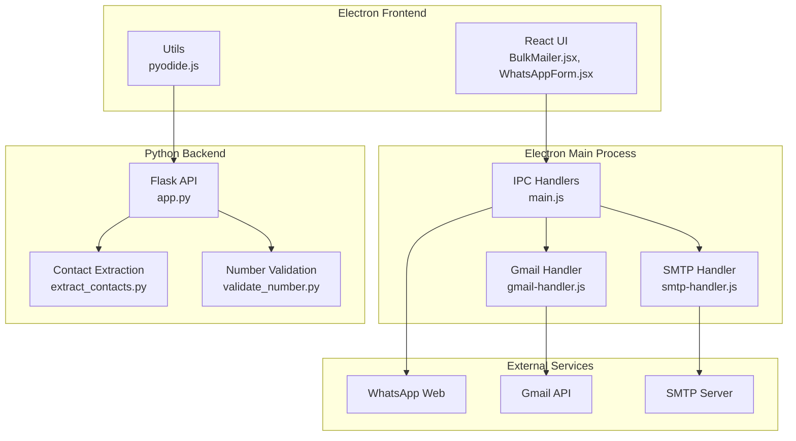
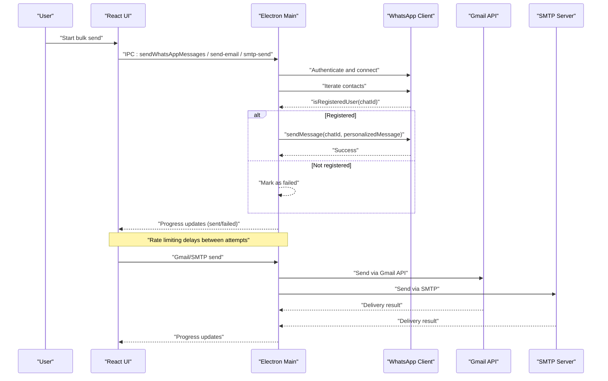
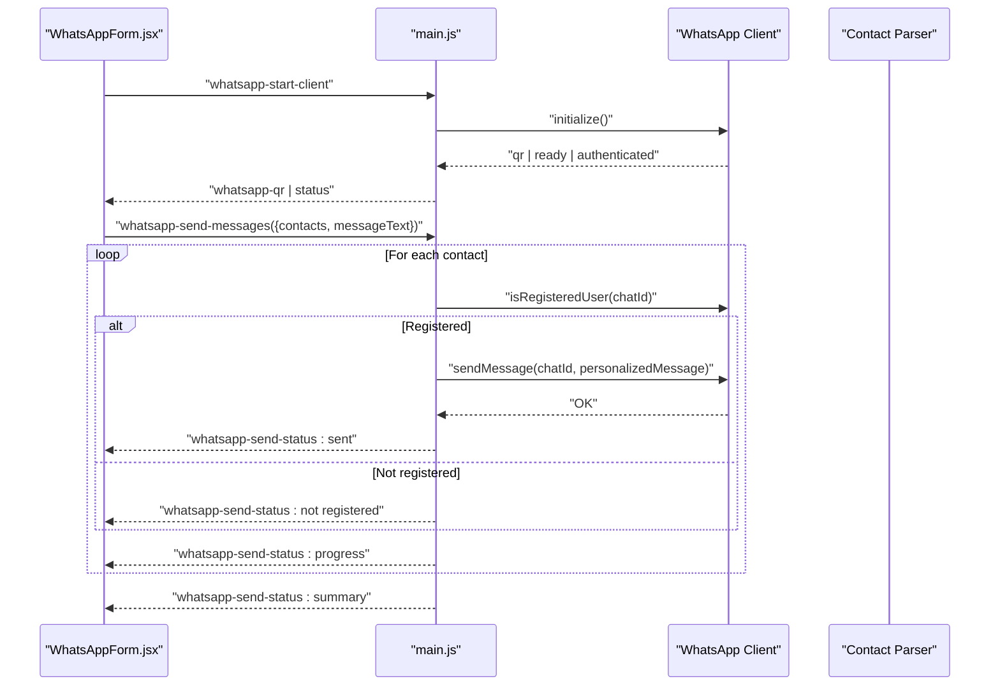
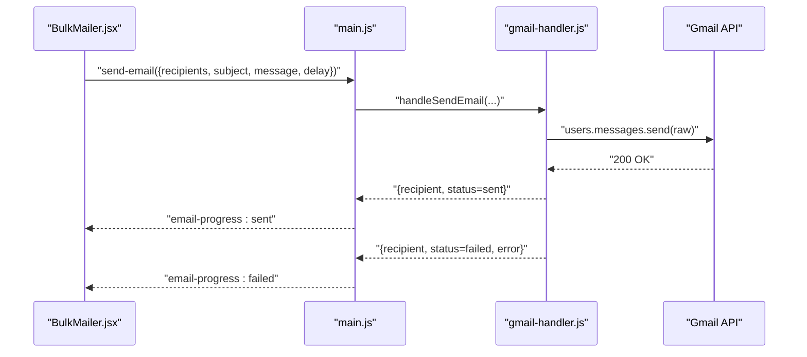
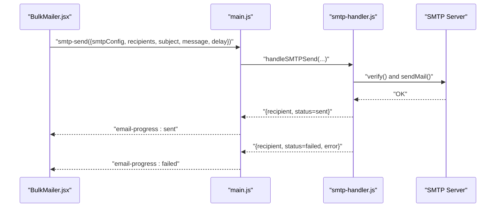
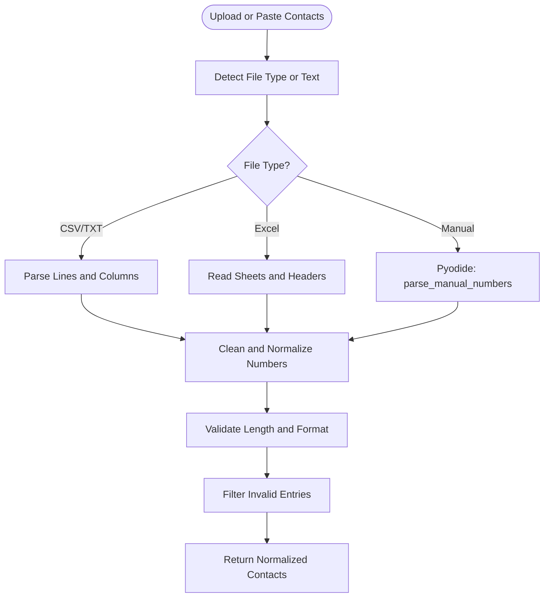
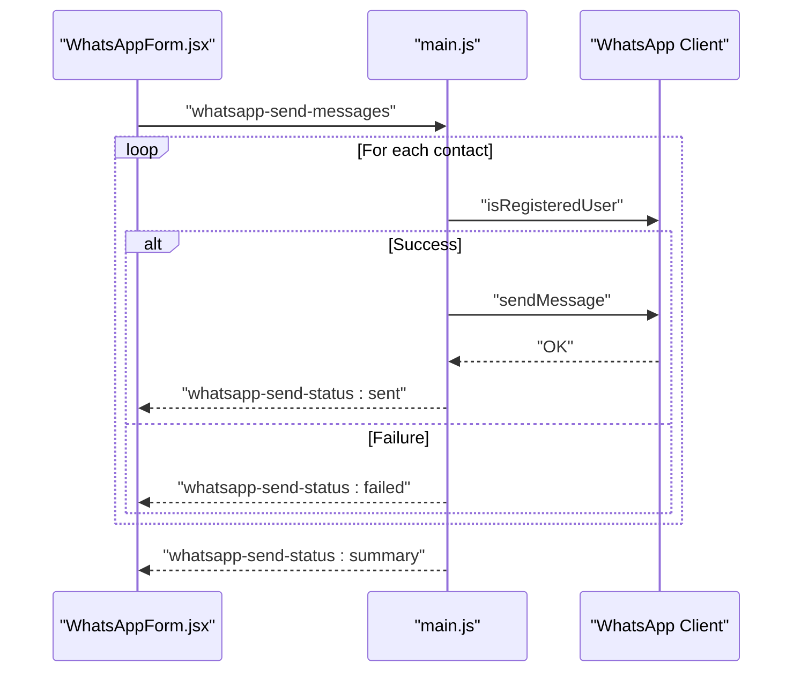
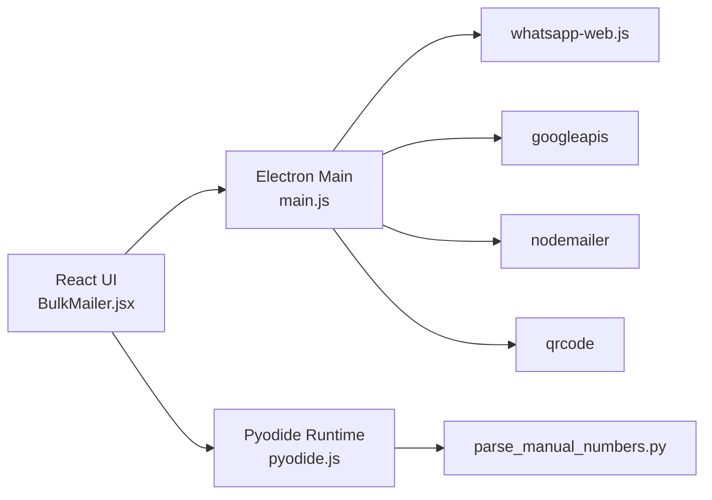

# Bulk Sending Engine

<cite>
**Referenced Files in This Document**
- [README.md](file://README.md)
- [BulkMailer.jsx](file://electron/src/components/BulkMailer.jsx)
- [WhatsAppForm.jsx](file://electron/src/components/WhatsAppForm.jsx)
- [main.js](file://electron/src/electron/main.js)
- [gmail-handler.js](file://electron/src/electron/gmail-handler.js)
- [smtp-handler.js](file://electron/src/electron/smtp-handler.js)
- [pyodide.js](file://electron/src/utils/pyodide.js)
- [app.py](file://python-backend/app.py)
- [extract_contacts.py](file://python-backend/extract_contacts.py)
- [validate_number.py](file://python-backend/validate_number.py)
- [requirements.txt](file://python-backend/requirements.txt)
- [package.json](file://electron/package.json)
</cite>

## Table of Contents
1. [Introduction](#introduction)
2. [Project Structure](#project-structure)
3. [Core Components](#core-components)
4. [Architecture Overview](#architecture-overview)
5. [Detailed Component Analysis](#detailed-component-analysis)
6. [Dependency Analysis](#dependency-analysis)
7. [Performance Considerations](#performance-considerations)
8. [Troubleshooting Guide](#troubleshooting-guide)
9. [Conclusion](#conclusion)

## Introduction
This document explains the bulk message sending engine implemented in the desktop application. It covers the end-to-end workflow for sending WhatsApp messages and emails in bulk, including contact iteration, message personalization, rate limiting, delivery confirmation, progress monitoring, and error handling. It also provides performance optimization techniques and best practices for large-scale campaigns.

## Project Structure
The application is organized as a cross-platform desktop app with:
- Electron main process orchestrating IPC handlers and integrations
- React frontend for user controls and progress display
- Python backend utilities for contact processing and validation
- Local development server and prototype utilities

**Diagram sources**
- [BulkMailer.jsx](file://electron/src/components/BulkMailer.jsx#L1-L482)
- [WhatsAppForm.jsx](file://electron/src/components/WhatsAppForm.jsx#L1-L609)
- [main.js](file://electron/src/electron/main.js#L1-L371)
- [gmail-handler.js](file://electron/src/electron/gmail-handler.js#L1-L227)
- [smtp-handler.js](file://electron/src/electron/smtp-handler.js#L1-L110)
- [app.py](file://python-backend/app.py#L1-L378)
- [extract_contacts.py](file://python-backend/extract_contacts.py#L1-L177)
- [validate_number.py](file://python-backend/validate_number.py#L1-L27)

**Section sources**
- [README.md](file://README.md#L43-L58)
- [package.json](file://electron/package.json#L20-L31)

## Core Components
- Electron main process manages WhatsApp client lifecycle, handles IPC events, and coordinates email sending via Gmail API and SMTP.
- React components provide user controls for connecting to WhatsApp, importing contacts, composing messages, and monitoring progress.
- Python backend exposes REST endpoints for contact import and parsing, and standalone utilities for contact extraction and phone number validation.
- Pyodide runtime enables running Python logic directly in the renderer process for manual number parsing.

Key responsibilities:
- Contact ingestion and normalization
- Message personalization
- Rate limiting and throttling
- Delivery confirmation and status tracking
- Error handling and retries

**Section sources**
- [BulkMailer.jsx](file://electron/src/components/BulkMailer.jsx#L1-L482)
- [main.js](file://electron/src/electron/main.js#L110-L213)
- [gmail-handler.js](file://electron/src/electron/gmail-handler.js#L141-L214)
- [smtp-handler.js](file://electron/src/electron/smtp-handler.js#L6-L105)
- [app.py](file://python-backend/app.py#L232-L370)
- [extract_contacts.py](file://python-backend/extract_contacts.py#L25-L177)
- [validate_number.py](file://python-backend/validate_number.py#L6-L26)
- [pyodide.js](file://electron/src/utils/pyodide.js#L1-L33)

## Architecture Overview
The bulk sending engine integrates three channels:
- WhatsApp Web: QR-based authentication, per-contact registration checks, and per-message delays.
- Gmail API: OAuth2-based sending with per-email delays and progress updates.
- SMTP: Transport-based sending with per-email delays and progress updates.

**Diagram sources**
- [main.js](file://electron/src/electron/main.js#L179-L213)
- [gmail-handler.js](file://electron/src/electron/gmail-handler.js#L141-L214)
- [smtp-handler.js](file://electron/src/electron/smtp-handler.js#L6-L105)

## Detailed Component Analysis

### WhatsApp Bulk Sending
Workflow:
- Initialize WhatsApp client with local authentication strategy.
- Display QR code for user authentication.
- After authentication, iterate over contacts:
  - Construct chat ID from phone number.
  - Check if the number is registered on WhatsApp.
  - Personalize message using {{name}} placeholder.
  - Send message with a fixed delay between attempts.
- Report completion metrics (sent vs failed).

**Diagram sources**
- [main.js](file://electron/src/electron/main.js#L111-L177)
- [main.js](file://electron/src/electron/main.js#L179-L213)
- [WhatsAppForm.jsx](file://electron/src/components/WhatsAppForm.jsx#L1-L609)

Key implementation details:
- Personalization: Replace {{name}} with contact name or default value.
- Registration check: Uses isRegisteredUser(chatId) to avoid sending to unregistered numbers.
- Delays: Fixed delays between attempts to reduce rate limits and detection risk.
- Status reporting: Real-time updates via IPC channels for UI rendering.

**Section sources**
- [main.js](file://electron/src/electron/main.js#L179-L213)
- [WhatsAppForm.jsx](file://electron/src/components/WhatsAppForm.jsx#L470-L488)

### Email Bulk Sending (Gmail API)
Workflow:
- Authenticate via OAuth2 and persist tokens.
- For each recipient:
  - Prepare email payload.
  - Send via Gmail API.
  - Emit progress updates.
  - Apply configurable delay between sends.

**Diagram sources**
- [gmail-handler.js](file://electron/src/electron/gmail-handler.js#L141-L214)
- [BulkMailer.jsx](file://electron/src/components/BulkMailer.jsx#L181-L219)

Key implementation details:
- OAuth2 flow: Generates auth URL, captures authorization code, exchanges for tokens.
- Token persistence: Stores tokens securely for reuse.
- Progress tracking: Emits structured progress events with current/total and per-recipient status.
- Delay-based rate limiting: Applies delay between sends to avoid throttling.

**Section sources**
- [gmail-handler.js](file://electron/src/electron/gmail-handler.js#L15-L139)
- [gmail-handler.js](file://electron/src/electron/gmail-handler.js#L141-L214)
- [BulkMailer.jsx](file://electron/src/components/BulkMailer.jsx#L181-L219)

### Email Bulk Sending (SMTP)
Workflow:
- Validate SMTP configuration.
- Create transport and verify connectivity.
- For each recipient:
  - Build email options (HTML and plain text).
  - Send via SMTP.
  - Emit progress updates.
  - Apply configurable delay between sends.

**Diagram sources**
- [smtp-handler.js](file://electron/src/electron/smtp-handler.js#L6-L105)
- [BulkMailer.jsx](file://electron/src/components/BulkMailer.jsx#L221-L261)

Key implementation details:
- Transport verification: Ensures SMTP server readiness before sending.
- Credential handling: Optional saving of non-secret config (host/port/secure/user).
- Progress tracking: Same event-driven pattern as Gmail API.
- Delay-based rate limiting: Consistent throttling across providers.

**Section sources**
- [smtp-handler.js](file://electron/src/electron/smtp-handler.js#L6-L105)
- [BulkMailer.jsx](file://electron/src/components/BulkMailer.jsx#L221-L261)

### Contact Processing and Validation
The system supports importing contacts from CSV, TXT, and Excel files, and validating/normalizing phone numbers.

**Diagram sources**
- [app.py](file://python-backend/app.py#L232-L280)
- [app.py](file://python-backend/app.py#L283-L341)
- [extract_contacts.py](file://python-backend/extract_contacts.py#L25-L177)
- [validate_number.py](file://python-backend/validate_number.py#L6-L26)
- [pyodide.js](file://electron/src/utils/pyodide.js#L26-L33)

Key implementation details:
- CSV/Excel parsing: Heuristically detects phone and name columns.
- TXT parsing: Splits by separators and extracts likely phone numbers.
- Manual parsing: Uses Pyodide to run Python logic in the renderer for quick number extraction.
- Validation: Enforces digit-only length constraints and optional leading plus sign normalization.

**Section sources**
- [app.py](file://python-backend/app.py#L58-L125)
- [app.py](file://python-backend/app.py#L128-L175)
- [app.py](file://python-backend/app.py#L178-L222)
- [app.py](file://python-backend/app.py#L283-L341)
- [extract_contacts.py](file://python-backend/extract_contacts.py#L25-L177)
- [validate_number.py](file://python-backend/validate_number.py#L6-L26)
- [pyodide.js](file://electron/src/utils/pyodide.js#L26-L33)

### Rate Limiting and Spam Prevention
- WhatsApp:
  - Fixed delays between sending attempts to registered users and between failures.
  - Registration checks prevent sending to unregistered numbers, reducing bounce-related errors.
- Gmail/SMTP:
  - Configurable delay between emails to avoid throttling and rate limits.
  - Progress events allow users to adjust delay dynamically.

Best practices:
- Start with conservative delays and increase gradually based on provider feedback.
- Monitor delivery failures and reduce batch sizes for problematic domains/providers.
- Respect provider-specific rate limits and quotas.

**Section sources**
- [main.js](file://electron/src/electron/main.js#L199-L209)
- [gmail-handler.js](file://electron/src/electron/gmail-handler.js#L190-L194)
- [smtp-handler.js](file://electron/src/electron/smtp-handler.js#L82-L87)

### Delivery Confirmation and Status Tracking
- WhatsApp:
  - Real-time status updates for QR generation, authentication, and per-contact send results.
  - Completion summary with sent and failed counts.
- Gmail/SMTP:
  - Per-email progress events with current/total counters and per-recipient status.
  - Structured failure details for diagnostics.

**Diagram sources**
- [main.js](file://electron/src/electron/main.js#L179-L213)
- [WhatsAppForm.jsx](file://electron/src/components/WhatsAppForm.jsx#L524-L560)

**Section sources**
- [main.js](file://electron/src/electron/main.js#L137-L177)
- [main.js](file://electron/src/electron/main.js#L179-L213)
- [gmail-handler.js](file://electron/src/electron/gmail-handler.js#L163-L207)
- [smtp-handler.js](file://electron/src/electron/smtp-handler.js#L52-L99)
- [WhatsAppForm.jsx](file://electron/src/components/WhatsAppForm.jsx#L524-L560)

### Retry Mechanisms and Error Recovery
- WhatsApp:
  - Attempts to send to registered users only; failures are recorded and retried on subsequent runs.
  - Disconnection handler resets client state and clears cached files.
- Gmail/SMTP:
  - Per-email failure events include error messages; UI can trigger reattempts selectively.
  - Transport verification helps detect misconfiguration early.

Recommendations:
- Implement explicit retry loops for transient failures.
- Persist partial results to resume interrupted campaigns.
- Provide user controls to pause/resume and adjust retry policies.

**Section sources**
- [main.js](file://electron/src/electron/main.js#L166-L170)
- [main.js](file://electron/src/electron/main.js#L343-L371)
- [gmail-handler.js](file://electron/src/electron/gmail-handler.js#L195-L206)
- [smtp-handler.js](file://electron/src/electron/smtp-handler.js#L88-L98)

## Dependency Analysis
External libraries and services:
- Electron: Desktop runtime and IPC
- whatsapp-web.js: WhatsApp Web integration
- googleapis: Gmail API authentication and sending
- nodemailer: SMTP transport
- qrcode: QR code generation for WhatsApp
- Pyodide: Python runtime in the browser for manual number parsing

**Diagram sources**
- [package.json](file://electron/package.json#L20-L31)
- [main.js](file://electron/src/electron/main.js#L1-L12)
- [gmail-handler.js](file://electron/src/electron/gmail-handler.js#L1-L11)
- [smtp-handler.js](file://electron/src/electron/smtp-handler.js#L1-L1)
- [pyodide.js](file://electron/src/utils/pyodide.js#L1-L33)

**Section sources**
- [package.json](file://electron/package.json#L20-L31)
- [requirements.txt](file://python-backend/requirements.txt#L1-L7)

## Performance Considerations
- Concurrency control: Limit simultaneous send operations to respect provider rate limits.
- Batch sizing: Reduce batch size for providers with strict quotas.
- Memory management: Clear cached files and reset client state on disconnects.
- Network resilience: Use exponential backoff for retries and circuit breaker patterns.
- UI responsiveness: Offload heavy tasks to background threads and emit frequent progress updates.

[No sources needed since this section provides general guidance]

## Troubleshooting Guide
Common issues and resolutions:
- WhatsApp QR code not loading:
  - Ensure network connectivity and restart the app.
  - Clear cached files and retry initialization.
- Gmail authentication failures:
  - Verify OAuth2 client credentials and ensure Gmail API is enabled.
- SMTP connection issues:
  - Confirm server settings, ports, and TLS configuration.
- Contact import errors:
  - Validate file format and encoding; ensure proper column headers.

**Section sources**
- [README.md](file://README.md#L412-L447)
- [main.js](file://electron/src/electron/main.js#L321-L340)

## Conclusion
The bulk sending engine integrates WhatsApp Web, Gmail API, and SMTP with robust contact processing, personalization, rate limiting, and progress monitoring. By leveraging IPC handlers, structured progress events, and provider-specific safeguards, it supports reliable large-scale campaigns while maintaining user control and transparency.