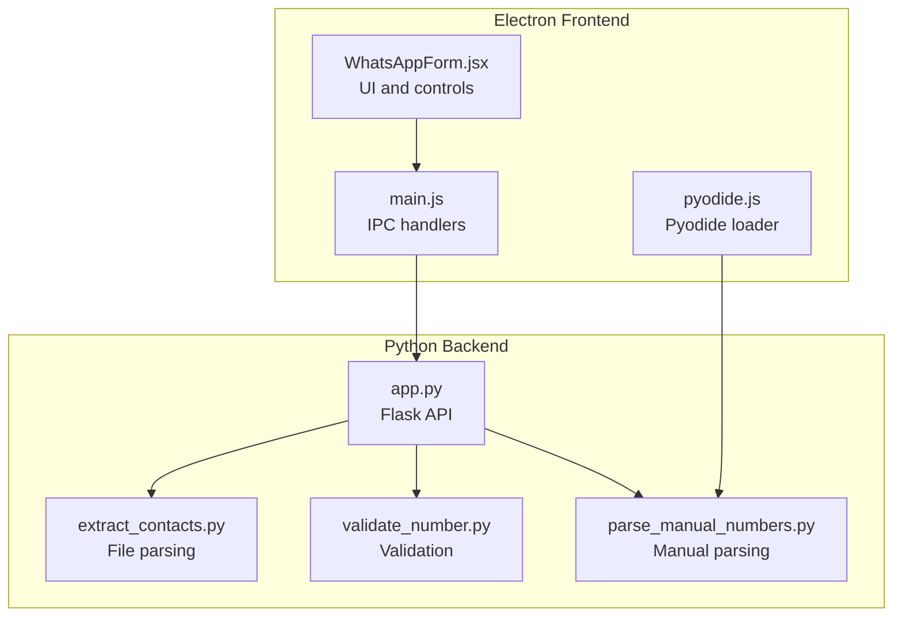
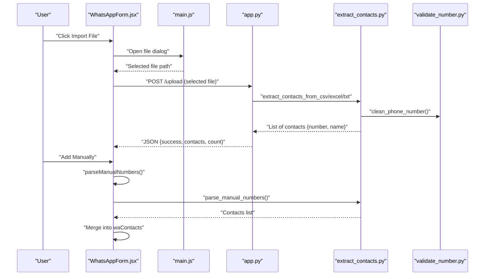
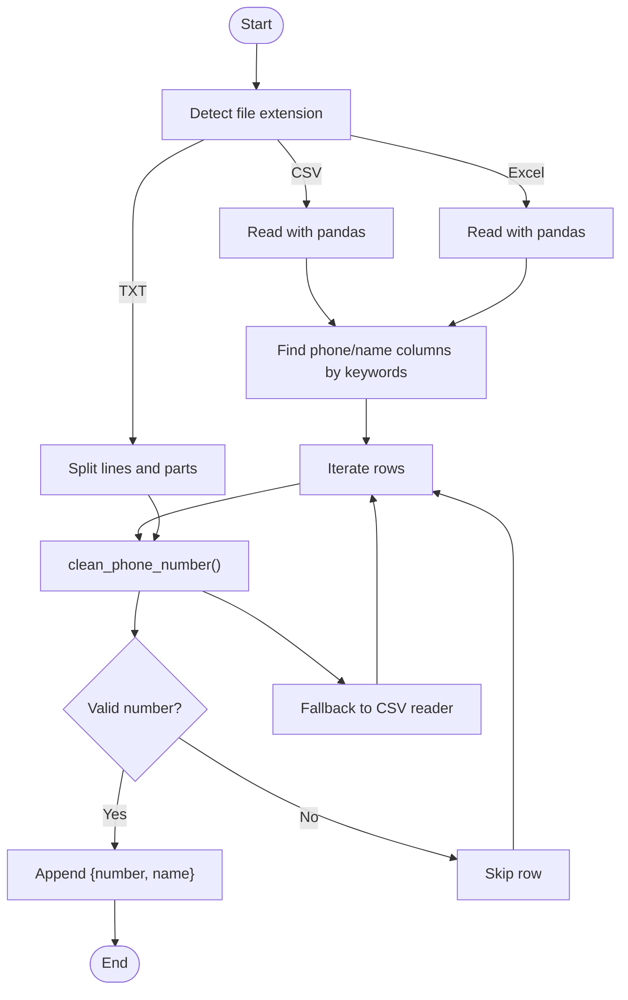
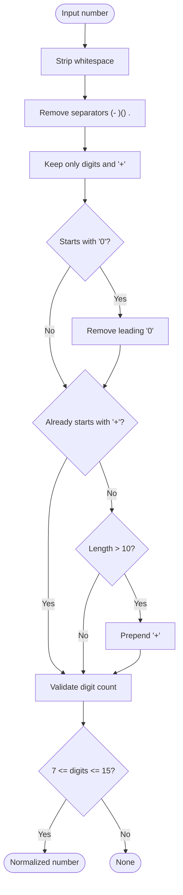
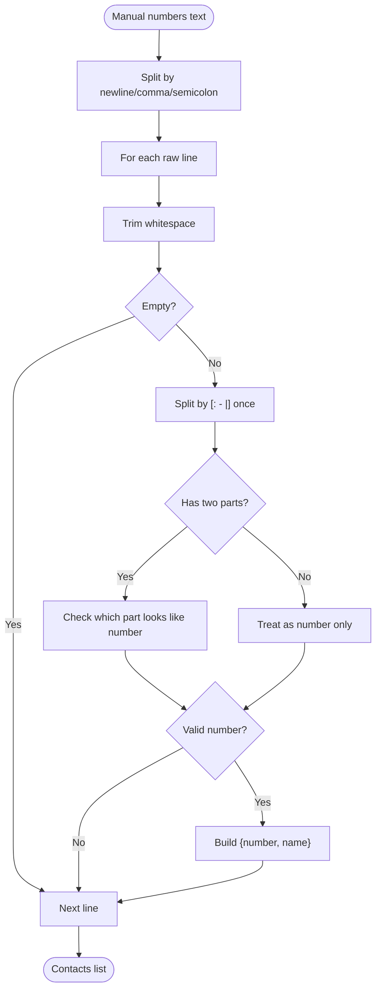
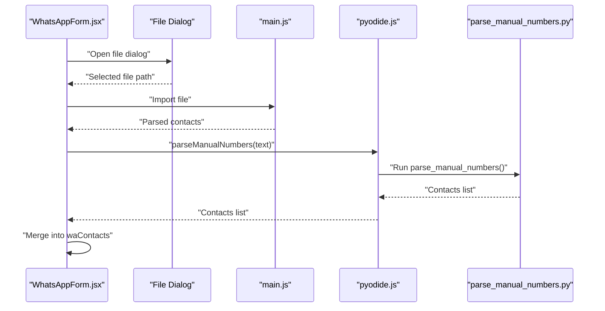
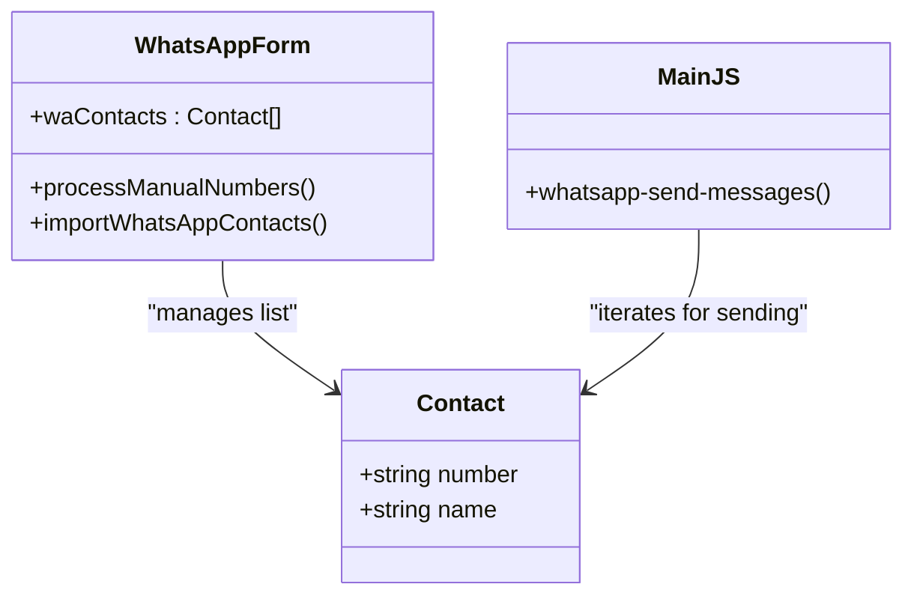
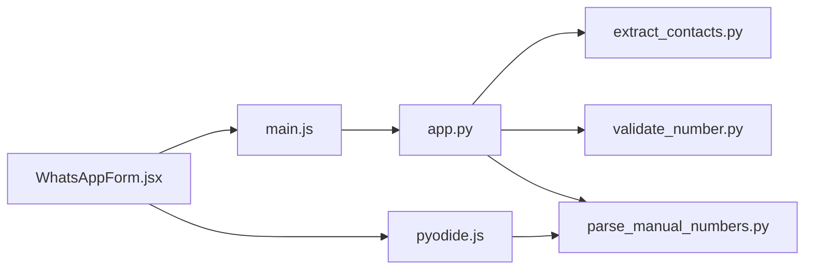

# Contact Import and Management

<cite>
**Referenced Files in This Document**
- [README.md](file://README.md)
- [extract_contacts.py](file://python-backend/extract_contacts.py)
- [validate_number.py](file://python-backend/validate_number.py)
- [parse_manual_numbers.py](file://python-backend/parse_manual_numbers.py)
- [app.py](file://python-backend/app.py)
- [WhatsAppForm.jsx](file://electron/src/components/WhatsAppForm.jsx)
- [main.js](file://electron/src/electron/main.js)
- [pyodide.js](file://electron/src/utils/pyodide.js)
- [parse_manual_numbers.py](file://electron/dist-react/py/parse_manual_numbers.py)
</cite>

## Table of Contents
1. [Introduction](#introduction)
2. [Project Structure](#project-structure)
3. [Core Components](#core-components)
4. [Architecture Overview](#architecture-overview)
5. [Detailed Component Analysis](#detailed-component-analysis)
6. [Dependency Analysis](#dependency-analysis)
7. [Performance Considerations](#performance-considerations)
8. [Troubleshooting Guide](#troubleshooting-guide)
9. [Conclusion](#conclusion)
10. [Appendices](#appendices)

## Introduction
This document explains the contact import and management functionality for the bulk messaging application. It covers how contacts are imported from CSV, TXT, and Excel files, how phone numbers are normalized and validated, and how contacts are prepared for mass messaging. It also documents the contact data model, error handling strategies, and best practices for preparing contact files.

Supported capabilities:
- Automatic detection and parsing of CSV, TXT, and Excel files
- Phone number normalization and validation
- Manual number entry with name parsing
- Contact preview and clearing
- Integration with the WhatsApp messaging pipeline

## Project Structure
The contact import and management system spans both the Electron frontend and the Python backend. The Electron app provides the UI and orchestrates file selection and manual input. The Python backend performs robust parsing and validation of contact data.

**Diagram sources**
- [WhatsAppForm.jsx](file://electron/src/components/WhatsAppForm.jsx#L1-L609)
- [main.js](file://electron/src/electron/main.js#L1-L371)
- [pyodide.js](file://electron/src/utils/pyodide.js#L1-L33)
- [app.py](file://python-backend/app.py#L1-L378)
- [extract_contacts.py](file://python-backend/extract_contacts.py#L1-L177)
- [validate_number.py](file://python-backend/validate_number.py#L1-L27)
- [parse_manual_numbers.py](file://python-backend/parse_manual_numbers.py#L1-L61)

**Section sources**
- [README.md](file://README.md#L182-L197)
- [WhatsAppForm.jsx](file://electron/src/components/WhatsAppForm.jsx#L281-L431)
- [main.js](file://electron/src/electron/main.js#L215-L262)
- [app.py](file://python-backend/app.py#L232-L280)

## Core Components
- File-based import: CSV, TXT, and Excel files are parsed into a unified contact list with number and optional name fields.
- Manual number entry: Users can paste or type numbers with optional names; the system parses and validates them.
- Phone number normalization: Removes separators, enforces international format, and validates digit counts.
- Contact preview and clearing: Users can review imported contacts and clear the list before sending.

Key behaviors:
- Automatic column detection for CSV/Excel by heuristics (keywords like “phone”, “number”, “mobile”, “cell”, “tel” for numbers; “name”, “contact”, “person” for names).
- Fallback parsing for malformed CSV/Excel using CSV reader.
- TXT parsing supports comma, semicolon, tab, or pipe separators and attempts to detect phone numbers in lines.

**Section sources**
- [extract_contacts.py](file://python-backend/extract_contacts.py#L25-L177)
- [parse_manual_numbers.py](file://python-backend/parse_manual_numbers.py#L22-L61)
- [validate_number.py](file://python-backend/validate_number.py#L6-L19)
- [WhatsAppForm.jsx](file://electron/src/components/WhatsAppForm.jsx#L315-L431)

## Architecture Overview
The contact import pipeline integrates Electron UI, IPC, and Python utilities. The Electron app handles file dialogs and manual input, then either invokes Python via Pyodide (browser-side) or the Flask API (desktop mode).

**Diagram sources**
- [WhatsAppForm.jsx](file://electron/src/components/WhatsAppForm.jsx#L304-L361)
- [main.js](file://electron/src/electron/main.js#L215-L262)
- [app.py](file://python-backend/app.py#L232-L280)
- [extract_contacts.py](file://python-backend/extract_contacts.py#L25-L177)
- [validate_number.py](file://python-backend/validate_number.py#L6-L19)
- [parse_manual_numbers.py](file://python-backend/parse_manual_numbers.py#L22-L61)

## Detailed Component Analysis

### File Import System (CSV, TXT, Excel)
- CSV parsing:
  - Uses pandas to read headers and infer phone/name columns by keyword matching.
  - Falls back to CSV reader if pandas fails.
  - Produces contacts with number and optional name; unknown names are auto-assigned.
- TXT parsing:
  - Splits lines by separators and attempts to detect phone numbers via regex.
  - Supports comma, semicolon, tab, and pipe delimiters.
- Excel parsing:
  - Similar to CSV but uses pandas to read Excel sheets.
  - Keyword-based column detection and fallback to first/second columns.

**Diagram sources**
- [extract_contacts.py](file://python-backend/extract_contacts.py#L25-L177)
- [validate_number.py](file://python-backend/validate_number.py#L6-L19)

**Section sources**
- [extract_contacts.py](file://python-backend/extract_contacts.py#L25-L177)

### Phone Number Normalization and Validation
- Removes separators and spaces, keeps digits and plus sign.
- Strips leading zeros when not international.
- Adds plus prefix for long numbers without it.
- Validates digit count to be between 7 and 15 digits.
- Returns normalized number or None if invalid.

**Diagram sources**
- [validate_number.py](file://python-backend/validate_number.py#L6-L19)

**Section sources**
- [validate_number.py](file://python-backend/validate_number.py#L6-L19)

### Manual Number Entry and Parsing
- Supports newline, comma, and semicolon separated entries.
- Optionally pairs a name with a number using colon, dash, or pipe delimiter.
- If no delimiter is present, attempts to detect which part is the number.
- Applies the same normalization and validation logic.

**Diagram sources**
- [parse_manual_numbers.py](file://python-backend/parse_manual_numbers.py#L22-L61)

**Section sources**
- [parse_manual_numbers.py](file://python-backend/parse_manual_numbers.py#L22-L61)

### Electron UI Integration
- Import file button triggers a file dialog and sends the selected path to the backend.
- Manual number input area supports pasting multiple entries and adds them to the contact list.
- Contact preview shows the first few contacts and a clear-all option.
- Pyodide is used to load and run the manual number parser in the browser.

**Diagram sources**
- [WhatsAppForm.jsx](file://electron/src/components/WhatsAppForm.jsx#L304-L361)
- [main.js](file://electron/src/electron/main.js#L215-L262)
- [pyodide.js](file://electron/src/utils/pyodide.js#L26-L33)
- [parse_manual_numbers.py](file://electron/dist-react/py/parse_manual_numbers.py#L22-L61)

**Section sources**
- [WhatsAppForm.jsx](file://electron/src/components/WhatsAppForm.jsx#L304-L361)
- [pyodide.js](file://electron/src/utils/pyodide.js#L26-L33)

### Contact Data Model and Mass Messaging Preparation
- Each contact is represented as an object with:
  - number: normalized phone number string
  - name: optional display name or auto-generated label
- During mass messaging, the message template is personalized by replacing placeholders with the contact’s name (or a default label if missing).
- The application constructs chat identifiers for WhatsApp using the normalized number.

**Diagram sources**
- [WhatsAppForm.jsx](file://electron/src/components/WhatsAppForm.jsx#L363-L431)
- [main.js](file://electron/src/electron/main.js#L179-L213)

**Section sources**
- [WhatsAppForm.jsx](file://electron/src/components/WhatsAppForm.jsx#L363-L431)
- [main.js](file://electron/src/electron/main.js#L179-L213)

## Dependency Analysis
- Electron UI depends on:
  - IPC handlers for file import and manual parsing
  - Pyodide for running Python scripts in the renderer
- Python backend depends on:
  - Pandas for CSV/Excel parsing
  - CSV module for fallback parsing
  - Regex for phone number detection and cleaning
- The Flask API exposes endpoints for file uploads and manual number parsing.

**Diagram sources**
- [WhatsAppForm.jsx](file://electron/src/components/WhatsAppForm.jsx#L1-L609)
- [main.js](file://electron/src/electron/main.js#L1-L371)
- [pyodide.js](file://electron/src/utils/pyodide.js#L1-L33)
- [app.py](file://python-backend/app.py#L1-L378)
- [extract_contacts.py](file://python-backend/extract_contacts.py#L1-L177)
- [validate_number.py](file://python-backend/validate_number.py#L1-L27)
- [parse_manual_numbers.py](file://python-backend/parse_manual_numbers.py#L1-L61)

**Section sources**
- [app.py](file://python-backend/app.py#L1-L378)
- [extract_contacts.py](file://python-backend/extract_contacts.py#L1-L177)
- [validate_number.py](file://python-backend/validate_number.py#L1-L27)
- [parse_manual_numbers.py](file://python-backend/parse_manual_numbers.py#L1-L61)

## Performance Considerations
- CSV/Excel parsing uses pandas for speed and robustness; falls back to CSV reader for resilience.
- TXT parsing splits by common delimiters and uses regex to detect phone numbers efficiently.
- Manual number parsing supports batch input and avoids repeated UI refreshes until parsing completes.
- Consider limiting file sizes and providing progress feedback for large imports.

[No sources needed since this section provides general guidance]

## Troubleshooting Guide
Common issues and resolutions:
- Unsupported file type:
  - Ensure the file extension is CSV, TXT, XLS, or XLSX.
- Malformed CSV/Excel:
  - Verify headers and presence of phone number columns.
  - Confirm UTF-8 encoding and absence of extra blank rows.
- Invalid phone numbers:
  - Numbers must contain 7–15 digits after normalization.
  - Avoid including letters or special characters not recognized as separators.
- Manual number parsing errors:
  - Use one of the supported formats: “+1234567890”, “Name: +1234567890”, or “+1234567890 - Name”.

Best practices:
- Prepare files with clear column names (e.g., “Phone”, “Mobile”, “Name”) to improve automatic detection.
- Use consistent separators within a file (comma, semicolon, or tab).
- Keep phone numbers in international format with a leading plus sign when possible.

**Section sources**
- [README.md](file://README.md#L434-L438)
- [extract_contacts.py](file://python-backend/extract_contacts.py#L25-L177)
- [validate_number.py](file://python-backend/validate_number.py#L6-L19)
- [parse_manual_numbers.py](file://python-backend/parse_manual_numbers.py#L22-L61)

## Conclusion
The contact import and management system provides robust support for CSV, TXT, and Excel files, along with manual number entry. Phone numbers are normalized and validated to ensure reliable mass messaging. The Electron UI offers intuitive controls for importing, previewing, and managing contacts, while the Python backend delivers resilient parsing and validation logic.

[No sources needed since this section summarizes without analyzing specific files]

## Appendices

### Supported File Formats and Data Layouts
- CSV:
  - Columns: phone-like and name-like fields detected by keywords.
  - Example layout:
    - Phone column: “Phone”, “Mobile”, “Cell”, “Tel”
    - Name column: “Name”, “Contact”, “Person”
- TXT:
  - One contact per line; supports comma, semicolon, tab, or pipe separators.
  - Example: “+1234567890,John Doe”
- Excel:
  - Sheet-based; similar to CSV with automatic column detection.

**Section sources**
- [README.md](file://README.md#L184-L189)
- [extract_contacts.py](file://python-backend/extract_contacts.py#L25-L177)

### Contact Data Structure
- number: normalized phone number string
- name: optional display name or auto-generated label

**Section sources**
- [extract_contacts.py](file://python-backend/extract_contacts.py#L56-L58)
- [parse_manual_numbers.py](file://python-backend/parse_manual_numbers.py#L46-L48)