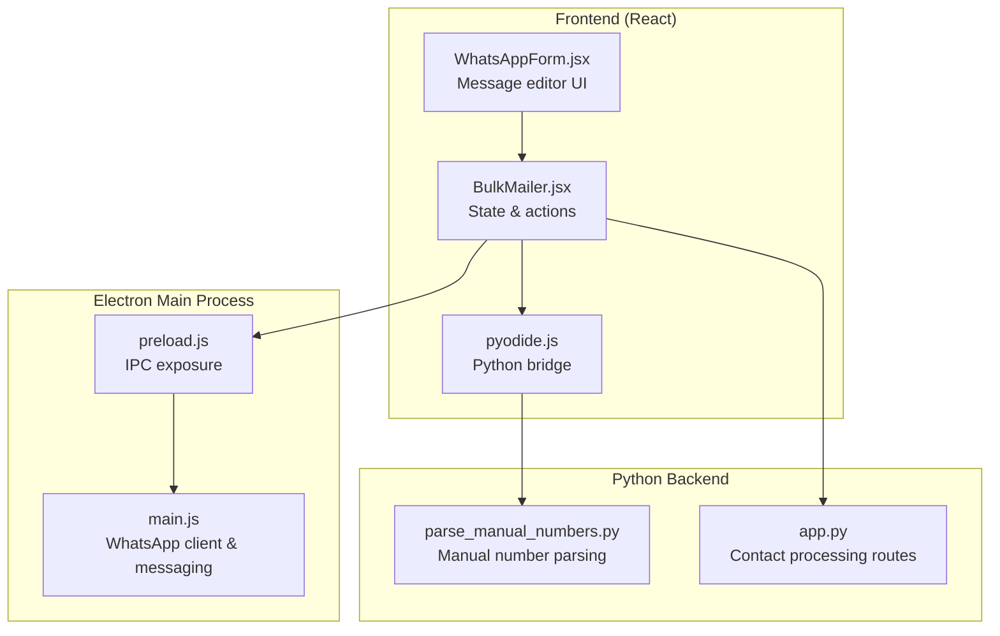
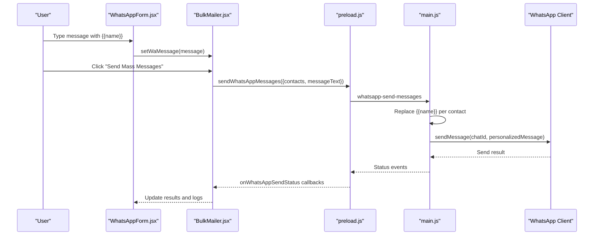
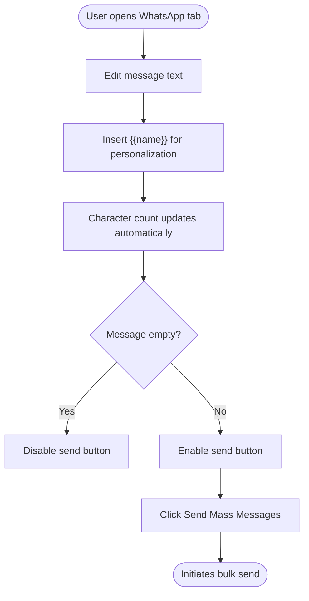
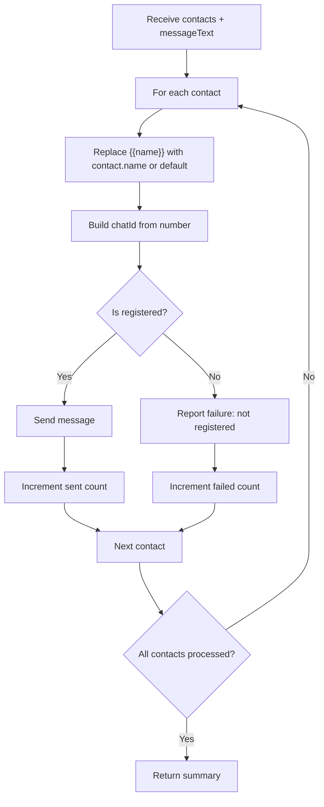
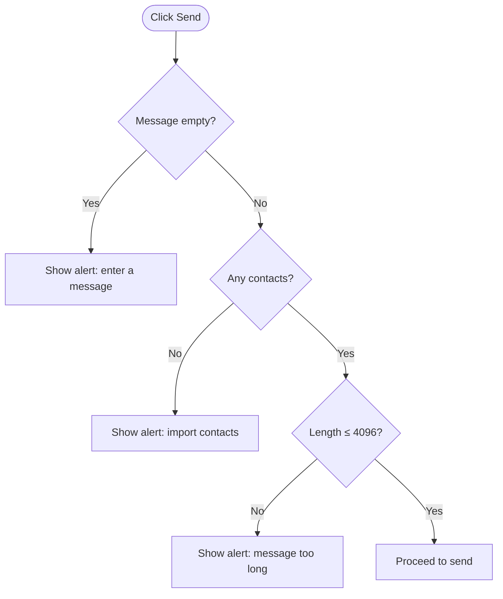
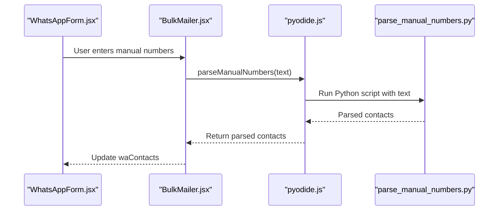
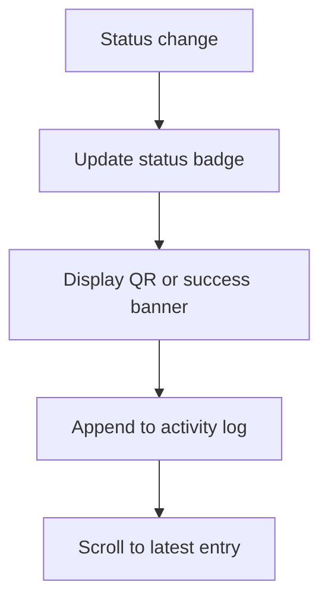
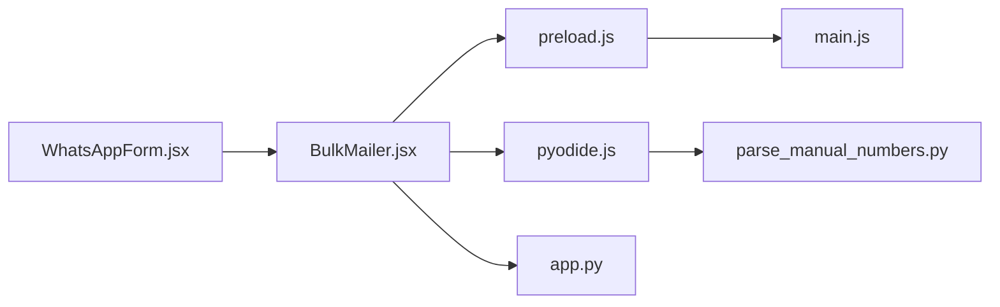

# Message Composition and Templates

<cite>
**Referenced Files in This Document**
- [WhatsAppForm.jsx](file://electron/src/components/WhatsAppForm.jsx)
- [BulkMailer.jsx](file://electron/src/components/BulkMailer.jsx)
- [main.js](file://electron/src/electron/main.js)
- [preload.js](file://electron/src/electron/preload.js)
- [pyodide.js](file://electron/src/utils/pyodide.js)
- [parse_manual_numbers.py](file://electron/dist-react/py/parse_manual_numbers.py)
- [app.py](file://python-backend/app.py)
- [README.md](file://README.md)
</cite>

## Table of Contents
1. [Introduction](#introduction)
2. [Project Structure](#project-structure)
3. [Core Components](#core-components)
4. [Architecture Overview](#architecture-overview)
5. [Detailed Component Analysis](#detailed-component-analysis)
6. [Dependency Analysis](#dependency-analysis)
7. [Performance Considerations](#performance-considerations)
8. [Troubleshooting Guide](#troubleshooting-guide)
9. [Conclusion](#conclusion)

## Introduction
This document explains the message composition and templating functionality for WhatsApp bulk messaging. It covers the editing interface, personalization using {{name}} placeholders, validation and limits, dynamic content generation, preview and character counting, and best practices for crafting engaging messages while complying with platform guidelines.

## Project Structure
The message composition and templating features span the Electron front-end (React components and IPC), the Electron main process (WhatsApp client orchestration), and optional Python utilities for contact parsing and validation.

**Diagram sources**
- [WhatsAppForm.jsx](file://electron/src/components/WhatsAppForm.jsx#L433-L491)
- [BulkMailer.jsx](file://electron/src/components/BulkMailer.jsx#L368-L415)
- [preload.js](file://electron/src/electron/preload.js#L23-L39)
- [main.js](file://electron/src/electron/main.js#L179-L213)
- [pyodide.js](file://electron/src/utils/pyodide.js#L26-L33)
- [parse_manual_numbers.py](file://electron/dist-react/py/parse_manual_numbers.py#L22-L54)
- [app.py](file://python-backend/app.py#L283-L341)

**Section sources**
- [README.md](file://README.md#L134-L161)
- [WhatsAppForm.jsx](file://electron/src/components/WhatsAppForm.jsx#L433-L491)
- [BulkMailer.jsx](file://electron/src/components/BulkMailer.jsx#L368-L415)
- [main.js](file://electron/src/electron/main.js#L179-L213)
- [preload.js](file://electron/src/electron/preload.js#L23-L39)
- [pyodide.js](file://electron/src/utils/pyodide.js#L26-L33)
- [parse_manual_numbers.py](file://electron/dist-react/py/parse_manual_numbers.py#L22-L54)
- [app.py](file://python-backend/app.py#L283-L341)

## Core Components
- Message editor UI with character counter and personalization hint
- Template engine: placeholder replacement with contact data
- Validation and limits: message length and contact parsing
- Preview and feedback: real-time status and logs
- Optional Python utilities for manual number parsing and validation

Key capabilities:
- Personalization using {{name}} placeholders
- Character limit display (4096 characters)
- Dynamic content generation per contact
- Real-time status updates and logs

**Section sources**
- [WhatsAppForm.jsx](file://electron/src/components/WhatsAppForm.jsx#L448-L468)
- [main.js](file://electron/src/electron/main.js#L179-L213)
- [BulkMailer.jsx](file://electron/src/components/BulkMailer.jsx#L368-L415)

## Architecture Overview
The message composition flow integrates UI input, state management, IPC to the main process, and the WhatsApp client. The main process performs personalization and sends messages, reporting status back to the UI.

**Diagram sources**
- [WhatsAppForm.jsx](file://electron/src/components/WhatsAppForm.jsx#L448-L488)
- [BulkMailer.jsx](file://electron/src/components/BulkMailer.jsx#L368-L415)
- [preload.js](file://electron/src/electron/preload.js#L23-L39)
- [main.js](file://electron/src/electron/main.js#L179-L213)

## Detailed Component Analysis

### Message Editor UI
- Text area for composing messages with a placeholder indicating {{name}} personalization
- Character counter showing current length vs. the 4096-character limit
- Disabled state during sending to prevent concurrent edits
- Send button triggers the bulk send action

**Diagram sources**
- [WhatsAppForm.jsx](file://electron/src/components/WhatsAppForm.jsx#L448-L488)

**Section sources**
- [WhatsAppForm.jsx](file://electron/src/components/WhatsAppForm.jsx#L448-L488)

### Template Engine and Personalization
- The main process replaces {{name}} with either the contact’s name or a default fallback ("Friend") before sending
- Chat ID construction uses the contact number with WhatsApp's c.us format
- Unregistered numbers are detected and reported as failures

**Diagram sources**
- [main.js](file://electron/src/electron/main.js#L179-L213)

**Section sources**
- [main.js](file://electron/src/electron/main.js#L179-L213)

### Message Validation and Limits
- Character limit: 4096 characters shown in the editor
- Message presence: send is disabled if the message is empty
- Contact presence: send is disabled if no contacts are loaded
- During sending, the UI disables controls to prevent interruptions

**Diagram sources**
- [WhatsAppForm.jsx](file://electron/src/components/WhatsAppForm.jsx#L470-L476)
- [BulkMailer.jsx](file://electron/src/components/BulkMailer.jsx#L368-L376)

**Section sources**
- [WhatsAppForm.jsx](file://electron/src/components/WhatsAppForm.jsx#L456-L458)
- [WhatsAppForm.jsx](file://electron/src/components/WhatsAppForm.jsx#L470-L476)
- [BulkMailer.jsx](file://electron/src/components/BulkMailer.jsx#L368-L376)

### Contact Data and Manual Parsing
- Manual number parsing supports formats with optional names and multiple separators
- The Electron main process can import CSV/Text files for contacts
- Optional Python utilities provide additional parsing and validation logic

**Diagram sources**
- [WhatsAppForm.jsx](file://electron/src/components/WhatsAppForm.jsx#L327-L358)
- [BulkMailer.jsx](file://electron/src/components/BulkMailer.jsx#L323-L366)
- [pyodide.js](file://electron/src/utils/pyodide.js#L26-L33)
- [parse_manual_numbers.py](file://electron/dist-react/py/parse_manual_numbers.py#L22-L54)

**Section sources**
- [WhatsAppForm.jsx](file://electron/src/components/WhatsAppForm.jsx#L327-L358)
- [BulkMailer.jsx](file://electron/src/components/BulkMailer.jsx#L323-L366)
- [pyodide.js](file://electron/src/utils/pyodide.js#L26-L33)
- [parse_manual_numbers.py](file://electron/dist-react/py/parse_manual_numbers.py#L22-L54)
- [app.py](file://python-backend/app.py#L283-L341)

### Message Preview and Feedback
- Real-time status updates (connecting, ready, authenticated, errors)
- Activity log displays send results with color-coded indicators
- QR code display and retry mechanism for connection issues

**Diagram sources**
- [WhatsAppForm.jsx](file://electron/src/components/WhatsAppForm.jsx#L121-L278)
- [WhatsAppForm.jsx](file://electron/src/components/WhatsAppForm.jsx#L494-L604)

**Section sources**
- [WhatsAppForm.jsx](file://electron/src/components/WhatsAppForm.jsx#L121-L278)
- [WhatsAppForm.jsx](file://electron/src/components/WhatsAppForm.jsx#L494-L604)

## Dependency Analysis
- UI depends on BulkMailer for state and actions
- BulkMailer bridges UI to Electron IPC exposed in preload.js
- Preload.js invokes main.js handlers for WhatsApp operations
- Manual number parsing uses pyodide.js to run Python code in the renderer
- Optional Python backend routes support file uploads and validation

**Diagram sources**
- [WhatsAppForm.jsx](file://electron/src/components/WhatsAppForm.jsx#L433-L491)
- [BulkMailer.jsx](file://electron/src/components/BulkMailer.jsx#L368-L415)
- [preload.js](file://electron/src/electron/preload.js#L23-L39)
- [main.js](file://electron/src/electron/main.js#L179-L213)
- [pyodide.js](file://electron/src/utils/pyodide.js#L26-L33)
- [parse_manual_numbers.py](file://electron/dist-react/py/parse_manual_numbers.py#L22-L54)
- [app.py](file://python-backend/app.py#L283-L341)

**Section sources**
- [preload.js](file://electron/src/electron/preload.js#L23-L39)
- [main.js](file://electron/src/electron/main.js#L179-L213)
- [pyodide.js](file://electron/src/utils/pyodide.js#L26-L33)
- [parse_manual_numbers.py](file://electron/dist-react/py/parse_manual_numbers.py#L22-L54)
- [app.py](file://python-backend/app.py#L283-L341)

## Performance Considerations
- Rate limiting: The main process waits between sending messages to avoid rate limits and reduce spam risk
- Batch size: Consider splitting large contact lists into smaller batches
- Network stability: Ensure reliable connectivity; QR loading and authentication retries are handled
- UI responsiveness: Disable send controls during operations to prevent duplicate submissions

[No sources needed since this section provides general guidance]

## Troubleshooting Guide
Common issues and resolutions:
- QR code not loading: Retry connection or check console for errors
- Authentication failures: Re-scan QR and ensure device permissions
- Send failures: Check registration status; unregistered numbers will fail
- Empty message or no contacts: Ensure message is present and contacts are imported
- Exceeding character limit: Trim message to under 4096 characters

**Section sources**
- [WhatsAppForm.jsx](file://electron/src/components/WhatsAppForm.jsx#L176-L253)
- [main.js](file://electron/src/electron/main.js#L162-L177)
- [main.js](file://electron/src/electron/main.js#L194-L210)
- [WhatsAppForm.jsx](file://electron/src/components/WhatsAppForm.jsx#L470-L476)

## Conclusion
The message composition and templating system provides a robust, user-friendly interface for creating personalized WhatsApp messages at scale. With {{name}} placeholders, a clear character counter, and real-time feedback, users can craft engaging messages while respecting platform limits and best practices. The integration with Electron IPC and optional Python utilities ensures flexible contact processing and validation.