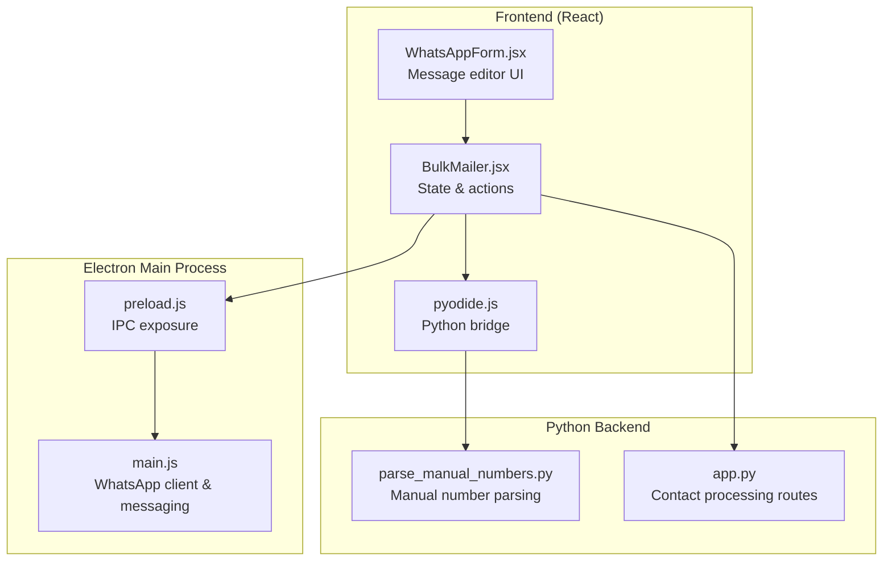
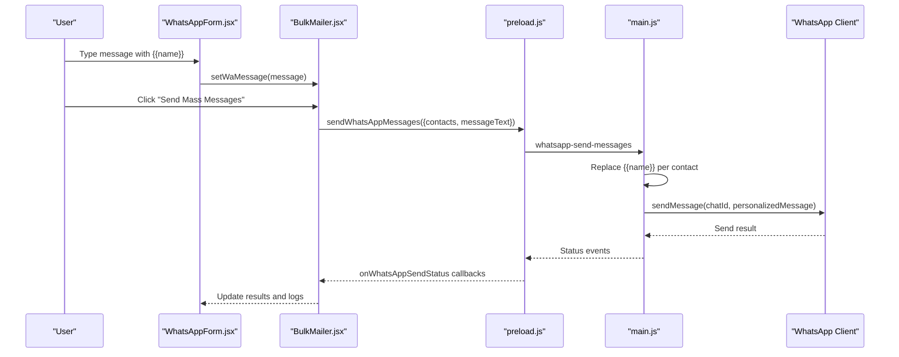
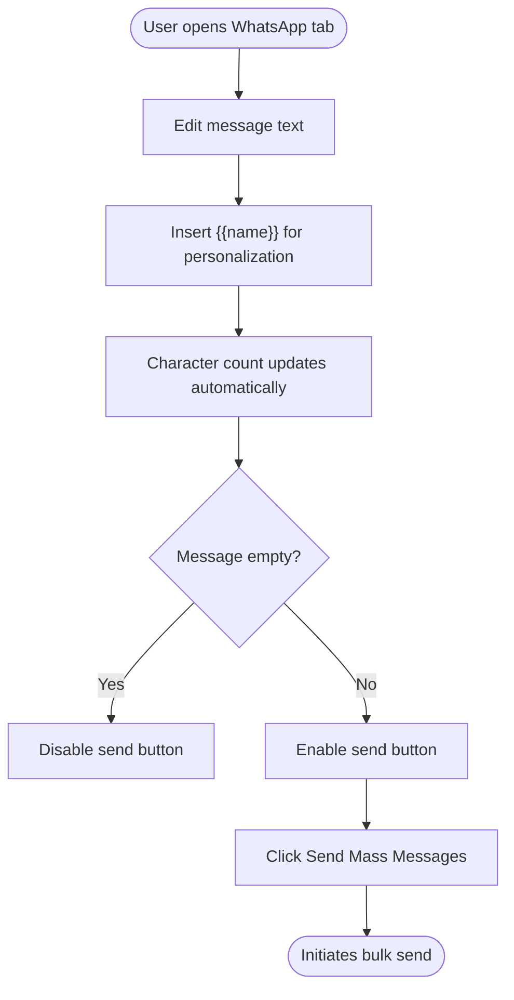
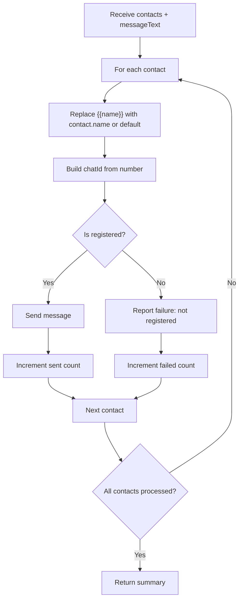
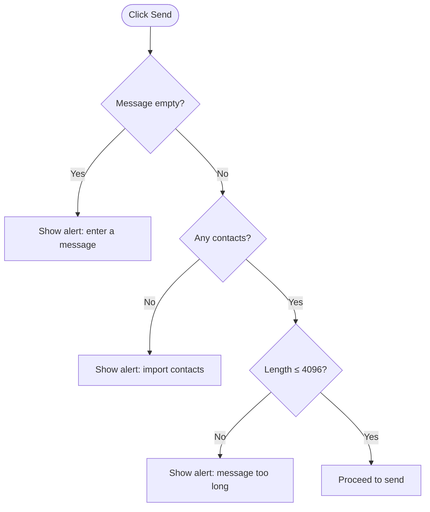
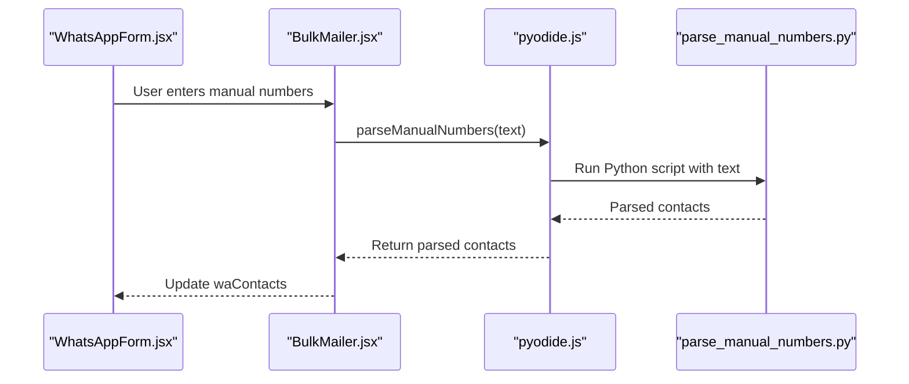
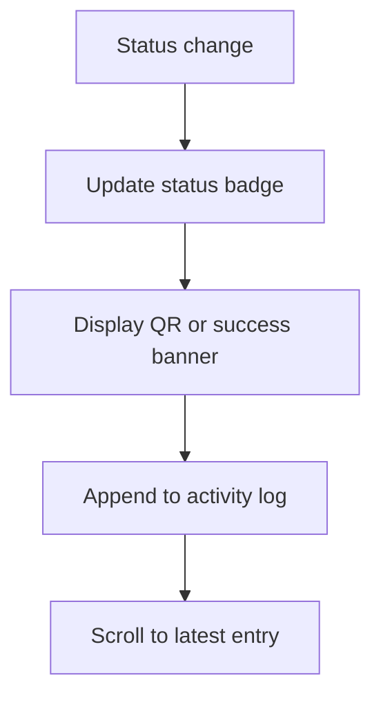
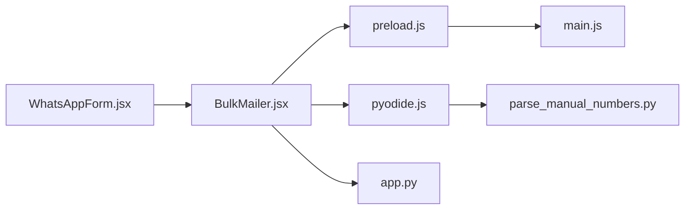

# Message composition and templates

## Introduction
This page explains the message composition and templating functionality for WhatsApp bulk messaging. It covers the editing interface, personalization using {{name}} placeholders, validation and limits, dynamic content generation, preview and character counting, and best practices for crafting engaging messages while complying with platform guidelines.

## Project structure
The message composition and templating features span the Electron front-end (React components and IPC), the Electron main process (WhatsApp client orchestration), and optional Python utilities for contact parsing and validation.

```mermaid
graph TB
subgraph "Frontend (React)"
UI_WA["WhatsAppForm.jsx<br/>Message editor UI"]
BL["BulkMailer.jsx<br/>State & actions"]
PY["pyodide.js<br/>Python bridge"]
end
subgraph "Electron Main Process"
PRE["preload.js<br/>IPC exposure"]
MAIN["main.js<br/>WhatsApp client & messaging"]
end
subgraph "Python Backend"
PYN["parse_manual_numbers.py<br/>Manual number parsing"]
APP["app.py<br/>Contact processing routes"]
end
UI_WA --> BL
BL --> PRE
PRE --> MAIN
BL --> PY
PY --> PYN
BL --> APP
```

## Core components
- Message editor UI with character counter and personalization hint
- Template engine: placeholder replacement with contact data
- Validation and limits: message length and contact parsing
- Preview and feedback: real-time status and logs
- Optional Python utilities for manual number parsing and validation

Key capabilities:
- Personalization using {{name}} placeholders
- Character limit display (4096 characters)
- Dynamic content generation per contact
- Real-time status updates and logs

## Architecture overview
The message composition flow integrates UI input, state management, IPC to the main process, and the WhatsApp client. The main process performs personalization and sends messages, reporting status back to the UI.

```mermaid
sequenceDiagram
participant User as "User"
participant UI as "WhatsAppForm.jsx"
participant BM as "BulkMailer.jsx"
participant IPC as "preload.js"
participant Main as "main.js"
participant WA as "WhatsApp Client"
User->>UI : Type message with {{name}}
UI->>BM : setWaMessage(message)
User->>BM : Click "Send Mass Messages"
BM->>IPC : sendWhatsAppMessages({contacts, messageText})
IPC->>Main : whatsapp-send-messages
Main->>Main : Replace {{name}} per contact
Main->>WA : sendMessage(chatId, personalizedMessage)
WA-->>Main : Send result
Main-->>IPC : Status events
IPC-->>BM : onWhatsAppSendStatus callbacks
BM-->>UI : Update results and logs
```

## Detailed component analysis

### Message editor UI
- Text area for composing messages with a placeholder indicating {{name}} personalization
- Character counter showing current length vs. the 4096-character limit
- Disabled state during sending to prevent concurrent edits
- Send button triggers the bulk send action

```mermaid
flowchart TD
Start(["User opens WhatsApp tab"]) --> Edit["Edit message text"]
Edit --> Placeholder["Insert {{name}} for personalization"]
Placeholder --> Count["Character count updates automatically"]
Count --> Validate{"Message empty?"}
Validate --> |Yes| Disable["Disable send button"]
Validate --> |No| Ready["Enable send button"]
Ready --> Send["Click Send Mass Messages"]
Send --> End(["Initiates bulk send"])
```

### Template engine and personalization
- The main process replaces {{name}} with either the contact's name or a default fallback ("Friend") before sending
- Chat ID construction uses the contact number with WhatsApp's c.us format
- Unregistered numbers are detected and reported as failures

```mermaid
flowchart TD
A["Receive contacts + messageText"] --> B["For each contact"]
B --> C["Replace {{name}} with contact.name or default"]
C --> D["Build chatId from number"]
D --> E{"Is registered?"}
E --> |Yes| F["Send message"]
E --> |No| G["Report failure: not registered"]
F --> H["Increment sent count"]
G --> I["Increment failed count"]
H --> J["Next contact"]
I --> J
J --> K{"All contacts processed?"}
K --> |No| B
K --> |Yes| L["Return summary"]
```

### Message validation and limits
- Character limit: 4096 characters shown in the editor
- Message presence: send is disabled if the message is empty
- Contact presence: send is disabled if no contacts are loaded
- During sending, the UI disables controls to prevent interruptions

```mermaid
flowchart TD
Start(["Click Send"]) --> CheckMsg{"Message empty?"}
CheckMsg --> |Yes| Alert1["Show alert: enter a message"]
CheckMsg --> |No| CheckContacts{"Any contacts?"}
CheckContacts --> |No| Alert2["Show alert: import contacts"]
CheckContacts --> |Yes| Limit{"Length ≤ 4096?"}
Limit --> |No| Alert3["Show alert: message too long"]
Limit --> |Yes| Proceed["Proceed to send"]
```

### Contact data and manual parsing
- Manual number parsing supports formats with optional names and multiple separators
- The Electron main process can import CSV/Text files for contacts
- Optional Python utilities provide additional parsing and validation logic

```mermaid
sequenceDiagram
participant UI as "WhatsAppForm.jsx"
participant BM as "BulkMailer.jsx"
participant PY as "pyodide.js"
participant PYN as "parse_manual_numbers.py"
UI->>BM : User enters manual numbers
BM->>PY : parseManualNumbers(text)
PY->>PYN : Run Python script with text
PYN-->>PY : Parsed contacts
PY-->>BM : Return parsed contacts
BM-->>UI : Update waContacts
```

### Message preview and feedback
- Real-time status updates (connecting, ready, authenticated, errors)
- Activity log displays send results with color-coded indicators
- QR code display and retry mechanism for connection issues

```mermaid
flowchart TD
A["Status change"] --> B["Update status badge"]
B --> C["Display QR or success banner"]
C --> D["Append to activity log"]
D --> E["Scroll to latest entry"]
```

## Dependency analysis
- UI depends on BulkMailer for state and actions
- BulkMailer bridges UI to Electron IPC exposed in preload.js
- Preload.js invokes main.js handlers for WhatsApp operations
- Manual number parsing uses pyodide.js to run Python code in the renderer
- Optional Python backend routes support file uploads and validation

```mermaid
graph LR
UI["WhatsAppForm.jsx"] --> BM["BulkMailer.jsx"]
BM --> PRE["preload.js"]
PRE --> MAIN["main.js"]
BM --> PY["pyodide.js"]
PY --> PYN["parse_manual_numbers.py"]
BM --> APP["app.py"]
```

## Performance considerations
- Rate limiting: The main process waits between sending messages to avoid rate limits and reduce spam risk
- Batch size: Consider splitting large contact lists into smaller batches
- Network stability: Ensure reliable connectivity; QR loading and authentication retries are handled
- UI responsiveness: Disable send controls during operations to prevent duplicate submissions

[No sources needed since this section provides general guidance]

## Troubleshooting guide
Common issues and resolutions:
- QR code not loading: Retry connection or check console for errors
- Authentication failures: Re-scan QR and ensure device permissions
- Send failures: Check registration status; unregistered numbers will fail
- Empty message or no contacts: Ensure message is present and contacts are imported
- Exceeding character limit: Trim message to under 4096 characters

## Conclusion
The message composition and templating system provides a reliable, user-friendly interface for creating personalized WhatsApp messages at scale. With {{name}} placeholders, a clear character counter, and real-time feedback, users can craft engaging messages while respecting platform limits and best practices. The integration with Electron IPC and optional Python utilities ensures flexible contact processing and validation.
