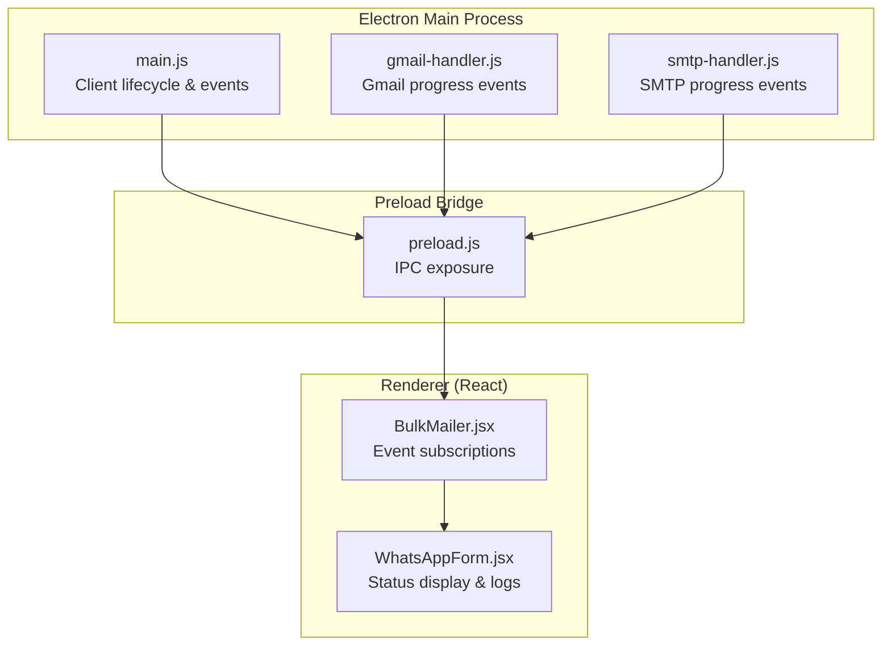
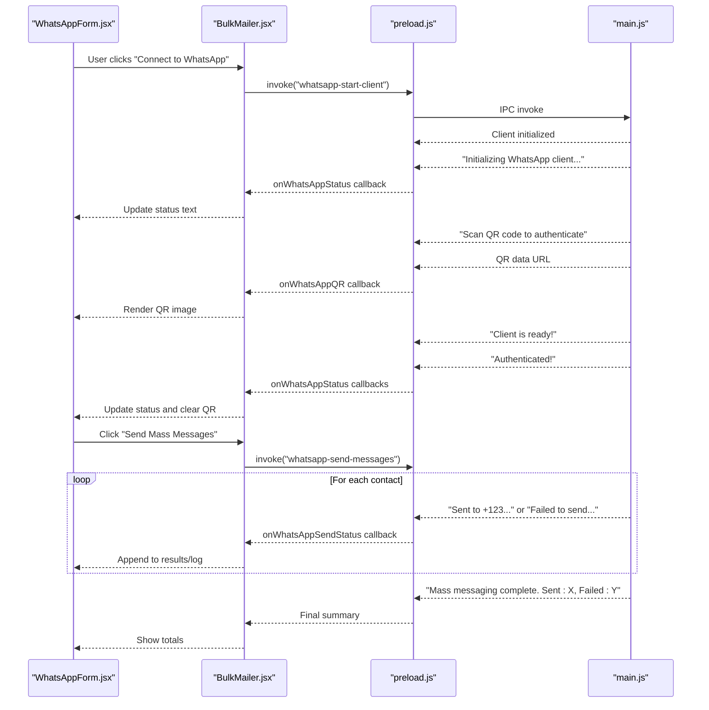
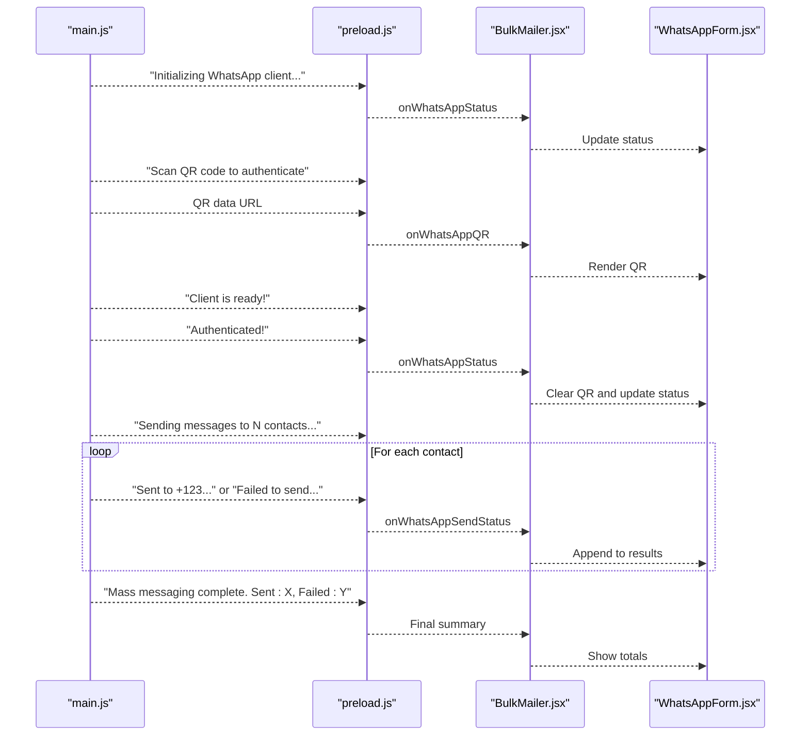
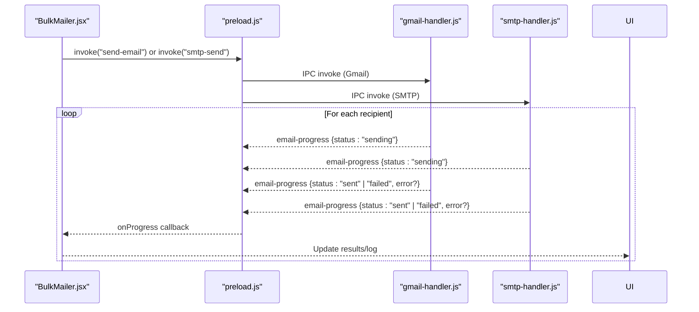
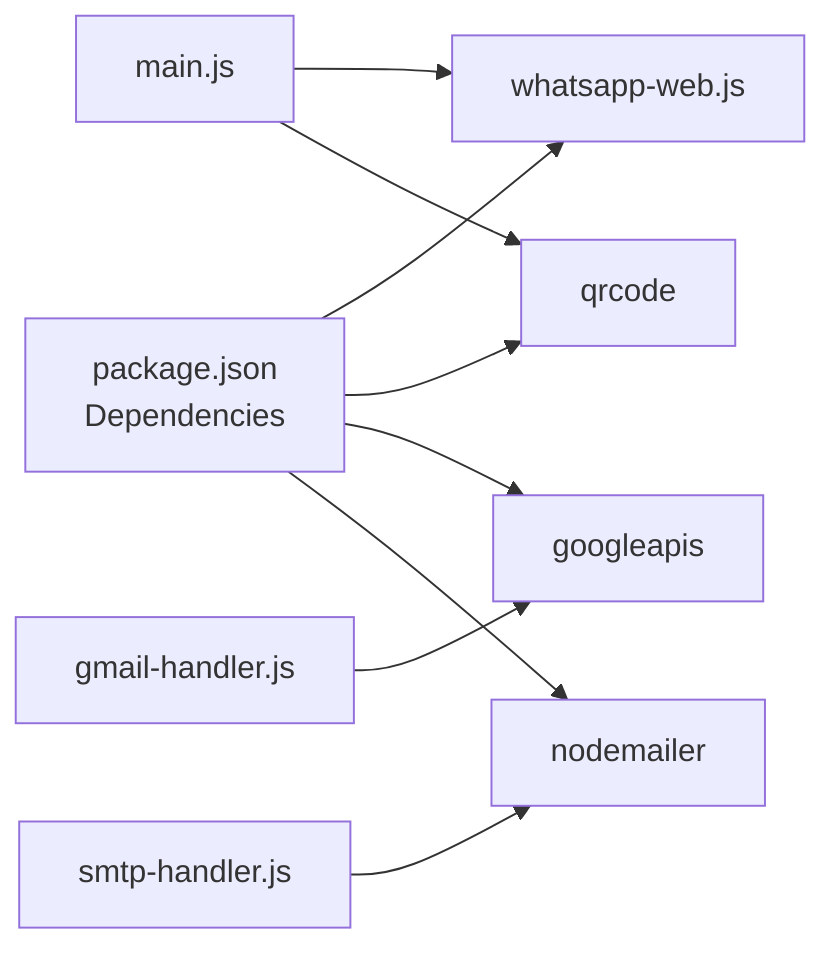

# Status Monitoring and Progress Tracking

<cite>
**Referenced Files in This Document**
- [README.md](file://README.md)
- [main.js](file://electron/src/electron/main.js)
- [preload.js](file://electron/src/electron/preload.js)
- [BulkMailer.jsx](file://electron/src/components/BulkMailer.jsx)
- [WhatsAppForm.jsx](file://electron/src/components/WhatsAppForm.jsx)
- [gmail-handler.js](file://electron/src/electron/gmail-handler.js)
- [smtp-handler.js](file://electron/src/electron/smtp-handler.js)
- [pyodide.js](file://electron/src/utils/pyodide.js)
- [package.json](file://electron/package.json)
</cite>

## Table of Contents
1. [Introduction](#introduction)
2. [Project Structure](#project-structure)
3. [Core Components](#core-components)
4. [Architecture Overview](#architecture-overview)
5. [Detailed Component Analysis](#detailed-component-analysis)
6. [Dependency Analysis](#dependency-analysis)
7. [Performance Considerations](#performance-considerations)
8. [Troubleshooting Guide](#troubleshooting-guide)
9. [Conclusion](#conclusion)

## Introduction
This document explains the real-time status monitoring and progress tracking system for bulk messaging operations. It covers the event-driven status reporting pipeline, including client initialization and authentication, QR code generation, progress updates during message sending, and the frontend UI integration that displays live feedback. It also documents the status message types, progress tracking interface, error reporting, and troubleshooting guidance.

## Project Structure
The status monitoring spans three layers:
- Electron Main Process: Initializes clients, emits status events, and manages long-running operations.
- Preload Bridge: Exposes secure IPC channels to the renderer for receiving status updates.
- Renderer (React): Subscribes to status events, renders real-time UI updates, and aggregates activity logs.

**Diagram sources**
- [main.js](file://electron/src/electron/main.js#L110-L177)
- [gmail-handler.js](file://electron/src/electron/gmail-handler.js#L141-L214)
- [smtp-handler.js](file://electron/src/electron/smtp-handler.js#L6-L105)
- [preload.js](file://electron/src/electron/preload.js#L4-L40)
- [BulkMailer.jsx](file://electron/src/components/BulkMailer.jsx#L35-L58)
- [WhatsAppForm.jsx](file://electron/src/components/WhatsAppForm.jsx#L494-L605)

**Section sources**
- [README.md](file://README.md#L43-L58)
- [package.json](file://electron/package.json#L20-L31)

## Core Components
- WhatsApp client lifecycle and status events:
  - Client initialization, QR code generation, authentication, readiness, and disconnection events are emitted to the renderer.
  - Progress events during mass sending include per-contact status and final summary.
- Gmail and SMTP progress reporting:
  - Per-message progress events include current index, total count, recipient, and status ("sending", "sent", "failed").
- Renderer integration:
  - Event subscriptions for status, QR, and send progress.
  - Real-time UI updates and activity log aggregation.

**Section sources**
- [main.js](file://electron/src/electron/main.js#L110-L177)
- [main.js](file://electron/src/electron/main.js#L179-L213)
- [gmail-handler.js](file://electron/src/electron/gmail-handler.js#L141-L214)
- [smtp-handler.js](file://electron/src/electron/smtp-handler.js#L6-L105)
- [preload.js](file://electron/src/electron/preload.js#L18-L39)
- [BulkMailer.jsx](file://electron/src/components/BulkMailer.jsx#L35-L58)
- [WhatsAppForm.jsx](file://electron/src/components/WhatsAppForm.jsx#L494-L605)

## Architecture Overview
The status monitoring follows an event-driven pattern:
- Main process emits events for client status, QR code, and send progress.
- Preload exposes IPC listeners to the renderer.
- Renderer subscribes to events and updates UI and logs.

**Diagram sources**
- [main.js](file://electron/src/electron/main.js#L110-L177)
- [main.js](file://electron/src/electron/main.js#L179-L213)
- [preload.js](file://electron/src/electron/preload.js#L28-L39)
- [BulkMailer.jsx](file://electron/src/components/BulkMailer.jsx#L263-L415)
- [WhatsAppForm.jsx](file://electron/src/components/WhatsAppForm.jsx#L494-L605)

## Detailed Component Analysis

### WhatsApp Status Reporting Pipeline
- Client lifecycle events:
  - Initialization, QR generation, ready, authenticated, auth failure, and disconnect notifications are sent to the renderer.
- QR code generation:
  - QR string is converted to a data URL and sent to the renderer for display.
- Progress tracking during mass sending:
  - Per-contact status updates ("Sent to...", "Failed to send...").
  - Final summary with sent and failed counts.

**Diagram sources**
- [main.js](file://electron/src/electron/main.js#L110-L177)
- [main.js](file://electron/src/electron/main.js#L179-L213)
- [preload.js](file://electron/src/electron/preload.js#L28-L39)
- [BulkMailer.jsx](file://electron/src/components/BulkMailer.jsx#L394-L415)
- [WhatsAppForm.jsx](file://electron/src/components/WhatsAppForm.jsx#L524-L560)

**Section sources**
- [main.js](file://electron/src/electron/main.js#L110-L177)
- [main.js](file://electron/src/electron/main.js#L179-L213)
- [preload.js](file://electron/src/electron/preload.js#L28-L39)
- [BulkMailer.jsx](file://electron/src/components/BulkMailer.jsx#L394-L415)
- [WhatsAppForm.jsx](file://electron/src/components/WhatsAppForm.jsx#L524-L560)

### Gmail and SMTP Progress Tracking
- Both handlers emit per-message progress events with:
  - current index
  - total count
  - recipient
  - status ("sending", "sent", "failed")
- Failed messages include an error message payload for detailed troubleshooting.

**Diagram sources**
- [gmail-handler.js](file://electron/src/electron/gmail-handler.js#L166-L206)
- [smtp-handler.js](file://electron/src/electron/smtp-handler.js#L55-L98)
- [preload.js](file://electron/src/electron/preload.js#L18-L21)
- [BulkMailer.jsx](file://electron/src/components/BulkMailer.jsx#L181-L261)

**Section sources**
- [gmail-handler.js](file://electron/src/electron/gmail-handler.js#L141-L214)
- [smtp-handler.js](file://electron/src/electron/smtp-handler.js#L6-L105)
- [preload.js](file://electron/src/electron/preload.js#L18-L21)
- [BulkMailer.jsx](file://electron/src/components/BulkMailer.jsx#L181-L261)

### Status Message Types and Interpretation
- WhatsApp client status:
  - Initializing WhatsApp client...
  - Scan QR code to authenticate
  - Client is ready!
  - Authenticated!
  - Authentication failed: <reason>
  - Client disconnected: <reason>
  - Starting WhatsApp client...
  - Failed to initialize client: <error>
  - Disconnected
  - Disconnected (forced)
- WhatsApp send progress:
  - Sending messages to N contacts...
  - Sent to <number>
  - Failed: <number> not registered
  - Failed to send to <number>: <error>
  - Mass messaging complete. Sent: X, Failed: Y
- Email progress (Gmail/SMTP):
  - email-progress with status "sending", "sent", or "failed"
  - Includes current/total and recipient
  - "failed" includes error message

Interpretation guidelines:
- "Initializing" and "Starting" indicate setup phase.
- "Scan QR code" indicates authentication required.
- "Client is ready" and "Authenticated" indicate operational state.
- "Failed" or "Authentication failed" indicates errors requiring action.
- "Sending" indicates ongoing operation; "sent" indicates success; "failed" indicates error with details.

**Section sources**
- [main.js](file://electron/src/electron/main.js#L110-L177)
- [main.js](file://electron/src/electron/main.js#L179-L213)
- [gmail-handler.js](file://electron/src/electron/gmail-handler.js#L166-L206)
- [smtp-handler.js](file://electron/src/electron/smtp-handler.js#L55-L98)

### Progress Tracking Interface
- Sent/Failed counts:
  - Final summary after mass sending includes total sent and failed.
- Individual recipient status:
  - Each status update is appended to the activity log with timestamp and color-coded indicators.
- Real-time rendering:
  - Status text updates immediately upon receiving events.
  - QR code appears/disappears based on authentication state.

**Section sources**
- [main.js](file://electron/src/electron/main.js#L179-L213)
- [WhatsAppForm.jsx](file://electron/src/components/WhatsAppForm.jsx#L524-L560)
- [BulkMailer.jsx](file://electron/src/components/BulkMailer.jsx#L394-L415)

### Error Reporting System
- WhatsApp:
  - Authentication failures report the reason.
  - Disconnection reasons are reported.
  - Initialization failures include error messages.
  - Per-contact send failures include the error message.
- Gmail/SMTP:
  - Detailed error messages are attached to "failed" progress events.
  - Transport verification and token presence are validated before sending.

Troubleshooting guidance:
- WhatsApp QR code not loading:
  - Retry connection; check network and browser cache.
- Authentication failures:
  - Verify credentials and service availability.
- SMTP connection issues:
  - Confirm host/port/security settings and firewall rules.
- Contact import errors:
  - Validate file format and encoding.

**Section sources**
- [main.js](file://electron/src/electron/main.js#L162-L168)
- [main.js](file://electron/src/electron/main.js#L174-L176)
- [main.js](file://electron/src/electron/main.js#L205-L208)
- [gmail-handler.js](file://electron/src/electron/gmail-handler.js#L16-L29)
- [gmail-handler.js](file://electron/src/electron/gmail-handler.js#L195-L206)
- [smtp-handler.js](file://electron/src/electron/smtp-handler.js#L18-L20)
- [smtp-handler.js](file://electron/src/electron/smtp-handler.js#L88-L98)
- [README.md](file://README.md#L412-L447)

### Integration with Frontend UI
- Event subscriptions:
  - onWhatsAppStatus, onWhatsAppQR, onWhatsAppSendStatus for WhatsApp.
  - onProgress for email progress.
- UI updates:
  - Status text color changes based on state (ready, initializing, error).
  - QR code displayed until authenticated.
  - Activity log shows chronological status updates with color-coded severity.

**Section sources**
- [preload.js](file://electron/src/electron/preload.js#L28-L39)
- [BulkMailer.jsx](file://electron/src/components/BulkMailer.jsx#L35-L58)
- [WhatsAppForm.jsx](file://electron/src/components/WhatsAppForm.jsx#L64-L75)
- [WhatsAppForm.jsx](file://electron/src/components/WhatsAppForm.jsx#L205-L253)
- [WhatsAppForm.jsx](file://electron/src/components/WhatsAppForm.jsx#L524-L560)

## Dependency Analysis
The status monitoring relies on:
- Electron IPC for secure event transport.
- whatsapp-web.js for WhatsApp client lifecycle and messaging.
- qrcode for QR code generation.
- googleapis and nodemailer for Gmail and SMTP progress reporting.

**Diagram sources**
- [package.json](file://electron/package.json#L20-L31)
- [main.js](file://electron/src/electron/main.js#L8-L12)
- [gmail-handler.js](file://electron/src/electron/gmail-handler.js#L3-L5)
- [smtp-handler.js](file://electron/src/electron/smtp-handler.js#L1)

**Section sources**
- [package.json](file://electron/package.json#L20-L31)

## Performance Considerations
- Rate limiting:
  - Delays between messages reduce the risk of throttling and improve reliability.
- Asynchronous processing:
  - Events are emitted asynchronously to keep the UI responsive.
- Efficient rendering:
  - Only appending new log entries prevents unnecessary re-renders.

## Troubleshooting Guide
Common issues and resolutions:
- WhatsApp QR code not loading:
  - Retry connection; clear browser cache; ensure network connectivity.
- Gmail authentication failed:
  - Verify OAuth2 credentials and Google Cloud Console settings; confirm Gmail API enabled.
- SMTP connection issues:
  - Validate server settings, ports, and security; check firewall and TLS configuration.
- Contact import errors:
  - Confirm file format compatibility and UTF-8 encoding; ensure proper column headers.

**Section sources**
- [README.md](file://README.md#L412-L447)

## Conclusion
The status monitoring system provides robust, real-time feedback for bulk messaging operations. It leverages Electron IPC to deliver client lifecycle events, QR code generation, and per-message progress updates to the frontend. The UI integrates these events seamlessly, enabling users to track sent/failed counts, monitor individual recipient statuses, and troubleshoot issues effectively.