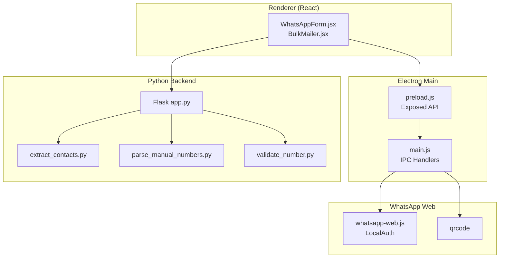
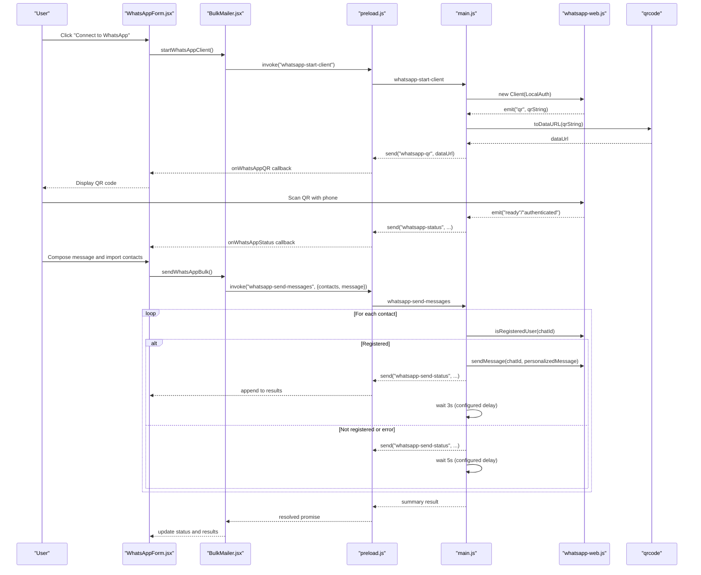
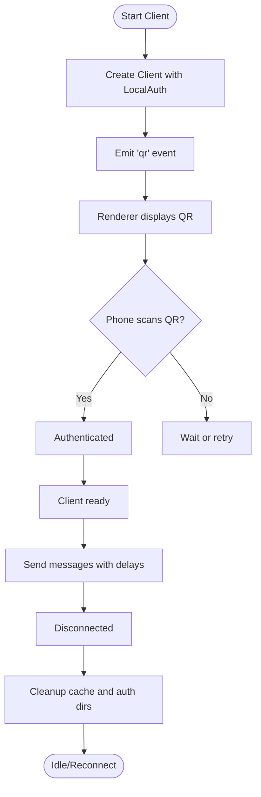
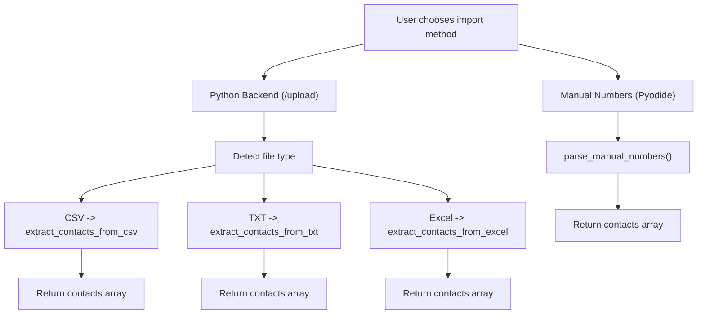
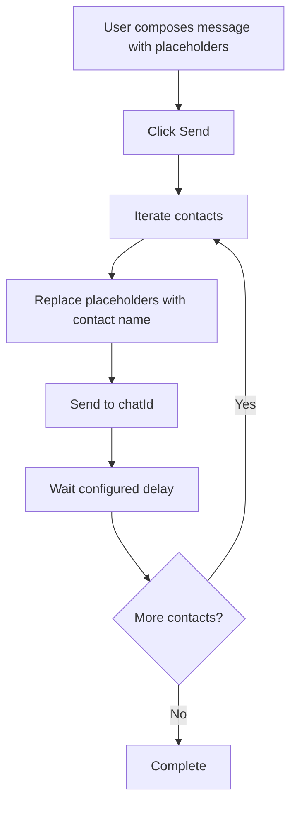
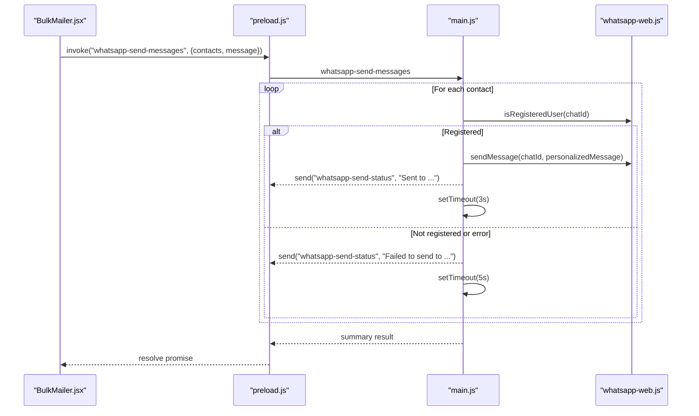
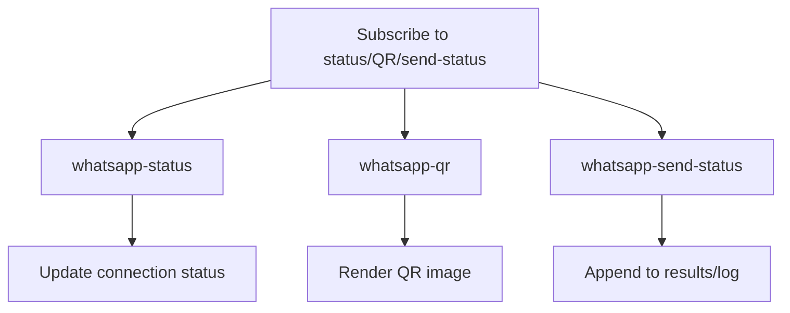
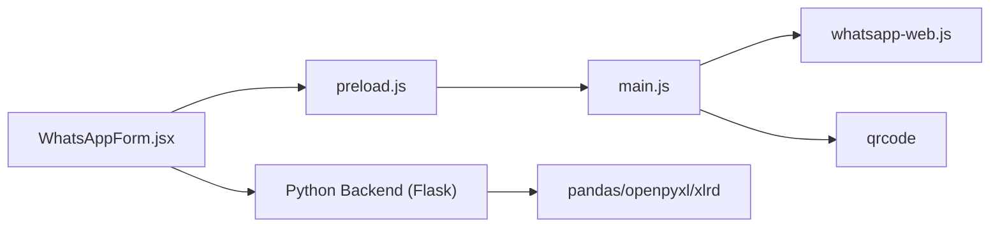

# WhatsApp Integration

<cite>
**Referenced Files in This Document**
- [README.md](file://README.md)
- [electron/src/components/WhatsAppForm.jsx](file://electron/src/components/WhatsAppForm.jsx)
- [electron/src/components/BulkMailer.jsx](file://electron/src/components/BulkMailer.jsx)
- [electron/src/electron/main.js](file://electron/src/electron/main.js)
- [electron/src/electron/preload.js](file://electron/src/electron/preload.js)
- [electron/src/utils/pyodide.js](file://electron/src/utils/pyodide.js)
- [python-backend/app.py](file://python-backend/app.py)
- [python-backend/extract_contacts.py](file://python-backend/extract_contacts.py)
- [python-backend/parse_manual_numbers.py](file://python-backend/parse_manual_numbers.py)
- [python-backend/validate_number.py](file://python-backend/validate_number.py)
- [electron/package.json](file://electron/package.json)
</cite>

## Table of Contents
1. [Introduction](#introduction)
2. [Project Structure](#project-structure)
3. [Core Components](#core-components)
4. [Architecture Overview](#architecture-overview)
5. [Detailed Component Analysis](#detailed-component-analysis)
6. [Dependency Analysis](#dependency-analysis)
7. [Performance Considerations](#performance-considerations)
8. [Troubleshooting Guide](#troubleshooting-guide)
9. [Security Considerations](#security-considerations)
10. [Conclusion](#conclusion)

## Introduction
This document explains the WhatsApp Web integration for bulk messaging, focusing on QR code authentication, session and connection lifecycle, contact import from CSV, Excel, and text files, message composition with personalization, bulk sending with configurable delays, and real-time status monitoring. It also covers troubleshooting and security best practices.

## Project Structure
The integration spans three layers:
- Electron renderer (React UI) for user interaction and status display
- Electron main process for WhatsApp Web.js client lifecycle and IPC
- Python backend for advanced contact processing and validation

**Diagram sources**
- [electron/src/components/WhatsAppForm.jsx](file://electron/src/components/WhatsAppForm.jsx#L1-L609)
- [electron/src/components/BulkMailer.jsx](file://electron/src/components/BulkMailer.jsx#L1-L482)
- [electron/src/electron/main.js](file://electron/src/electron/main.js#L1-L371)
- [electron/src/electron/preload.js](file://electron/src/electron/preload.js#L1-L41)
- [python-backend/app.py](file://python-backend/app.py#L1-L378)
- [python-backend/extract_contacts.py](file://python-backend/extract_contacts.py#L1-L177)
- [python-backend/parse_manual_numbers.py](file://python-backend/parse_manual_numbers.py#L1-L61)
- [python-backend/validate_number.py](file://python-backend/validate_number.py#L1-L27)

**Section sources**
- [README.md](file://README.md#L1-L455)
- [electron/src/components/WhatsAppForm.jsx](file://electron/src/components/WhatsAppForm.jsx#L1-L609)
- [electron/src/components/BulkMailer.jsx](file://electron/src/components/BulkMailer.jsx#L1-L482)
- [electron/src/electron/main.js](file://electron/src/electron/main.js#L1-L371)
- [electron/src/electron/preload.js](file://electron/src/electron/preload.js#L1-L41)
- [python-backend/app.py](file://python-backend/app.py#L1-L378)

## Core Components
- WhatsAppForm: UI for connecting, scanning QR, managing contacts, composing messages, and viewing activity logs.
- BulkMailer: Orchestrates WhatsApp lifecycle, listens to status events, and coordinates IPC with the main process.
- Electron Main: Initializes the WhatsApp client, handles QR generation, connection events, and bulk sending loop with delays.
- Preload Bridge: Exposes secure IPC methods to the renderer for WhatsApp operations.
- Python Backend: Provides REST endpoints for contact import and parsing, including CSV/Excel/Text support and number validation.

**Section sources**
- [electron/src/components/WhatsAppForm.jsx](file://electron/src/components/WhatsAppForm.jsx#L1-L609)
- [electron/src/components/BulkMailer.jsx](file://electron/src/components/BulkMailer.jsx#L1-L482)
- [electron/src/electron/main.js](file://electron/src/electron/main.js#L110-L213)
- [electron/src/electron/preload.js](file://electron/src/electron/preload.js#L23-L39)
- [python-backend/app.py](file://python-backend/app.py#L232-L280)

## Architecture Overview
End-to-end flow for authentication and sending:

**Diagram sources**
- [electron/src/components/WhatsAppForm.jsx](file://electron/src/components/WhatsAppForm.jsx#L137-L173)
- [electron/src/components/BulkMailer.jsx](file://electron/src/components/BulkMailer.jsx#L263-L288)
- [electron/src/electron/preload.js](file://electron/src/electron/preload.js#L23-L39)
- [electron/src/electron/main.js](file://electron/src/electron/main.js#L110-L213)

## Detailed Component Analysis

### QR Code Authentication and Session Lifecycle
- The main process creates a Client with LocalAuth and emits QR codes as data URLs.
- The renderer displays QR until authentication succeeds or errors occur.
- Logout triggers explicit client logout and cleanup of cached auth/session files.

**Diagram sources**
- [electron/src/electron/main.js](file://electron/src/electron/main.js#L110-L177)
- [electron/src/electron/main.js](file://electron/src/electron/main.js#L320-L340)

**Section sources**
- [electron/src/electron/main.js](file://electron/src/electron/main.js#L110-L177)
- [electron/src/electron/main.js](file://electron/src/electron/main.js#L320-L340)
- [electron/src/components/WhatsAppForm.jsx](file://electron/src/components/WhatsAppForm.jsx#L176-L278)

### Contact Import and Parsing
- CSV/Excel/Text import is supported via two paths:
  - Python backend REST endpoints for robust parsing and validation
  - Manual text parsing in the renderer using Pyodide for quick local processing
- The renderer supports CSV/Text locally; Excel is noted as not yet supported in this UI path.

**Diagram sources**
- [python-backend/app.py](file://python-backend/app.py#L232-L280)
- [python-backend/extract_contacts.py](file://python-backend/extract_contacts.py#L25-L81)
- [python-backend/extract_contacts.py](file://python-backend/extract_contacts.py#L84-L118)
- [python-backend/extract_contacts.py](file://python-backend/extract_contacts.py#L121-L157)
- [python-backend/parse_manual_numbers.py](file://python-backend/parse_manual_numbers.py#L22-L54)
- [electron/src/utils/pyodide.js](file://electron/src/utils/pyodide.js#L26-L33)
- [electron/src/components/BulkMailer.jsx](file://electron/src/components/BulkMailer.jsx#L323-L366)

**Section sources**
- [python-backend/app.py](file://python-backend/app.py#L232-L280)
- [python-backend/extract_contacts.py](file://python-backend/extract_contacts.py#L25-L157)
- [python-backend/parse_manual_numbers.py](file://python-backend/parse_manual_numbers.py#L22-L54)
- [electron/src/utils/pyodide.js](file://electron/src/utils/pyodide.js#L26-L33)
- [electron/src/components/BulkMailer.jsx](file://electron/src/components/BulkMailer.jsx#L323-L366)

### Message Composition and Personalization
- Users compose messages in the UI and can use a placeholder to personalize with contact names.
- During sending, the message is personalized by replacing the placeholder with either the contact’s name or a default value.

**Diagram sources**
- [electron/src/components/WhatsAppForm.jsx](file://electron/src/components/WhatsAppForm.jsx#L447-L489)
- [electron/src/electron/main.js](file://electron/src/electron/main.js#L179-L213)

**Section sources**
- [electron/src/components/WhatsAppForm.jsx](file://electron/src/components/WhatsAppForm.jsx#L447-L489)
- [electron/src/electron/main.js](file://electron/src/electron/main.js#L179-L213)

### Bulk Sending Implementation and Delays
- The main process sends messages sequentially to each contact.
- It checks registration status before sending and applies delays to reduce spam risk.
- Real-time progress is emitted via IPC to the renderer for display.

**Diagram sources**
- [electron/src/electron/main.js](file://electron/src/electron/main.js#L179-L213)
- [electron/src/components/BulkMailer.jsx](file://electron/src/components/BulkMailer.jsx#L368-L415)

**Section sources**
- [electron/src/electron/main.js](file://electron/src/electron/main.js#L179-L213)
- [electron/src/components/BulkMailer.jsx](file://electron/src/components/BulkMailer.jsx#L368-L415)

### Real-time Status Monitoring
- The renderer subscribes to three event channels:
  - Connection status updates
  - QR code data URL updates
  - Per-message send status updates
- These are displayed in the activity log with color-coded indicators.

**Diagram sources**
- [electron/src/components/BulkMailer.jsx](file://electron/src/components/BulkMailer.jsx#L35-L58)
- [electron/src/electron/preload.js](file://electron/src/electron/preload.js#L28-L39)
- [electron/src/components/WhatsAppForm.jsx](file://electron/src/components/WhatsAppForm.jsx#L512-L601)

**Section sources**
- [electron/src/components/BulkMailer.jsx](file://electron/src/components/BulkMailer.jsx#L35-L58)
- [electron/src/electron/preload.js](file://electron/src/electron/preload.js#L28-L39)
- [electron/src/components/WhatsAppForm.jsx](file://electron/src/components/WhatsAppForm.jsx#L512-L601)

## Dependency Analysis
Key runtime dependencies for the integration:
- whatsapp-web.js: Core WhatsApp Web client and authentication
- qrcode: QR code rendering for the UI
- Pyodide and Python backend: Contact parsing and validation utilities

**Diagram sources**
- [electron/src/electron/main.js](file://electron/src/electron/main.js#L8-L11)
- [electron/src/electron/preload.js](file://electron/src/electron/preload.js#L1-L41)
- [python-backend/app.py](file://python-backend/app.py#L1-L11)
- [electron/package.json](file://electron/package.json#L20-L31)

**Section sources**
- [electron/package.json](file://electron/package.json#L20-L31)
- [python-backend/app.py](file://python-backend/app.py#L1-L11)

## Performance Considerations
- Sequential sending with delays reduces rate limits and improves reliability.
- Using isRegisteredUser avoids unnecessary send attempts and reduces error noise.
- QR generation occurs only once per session; caching and reuse minimize overhead.
- Consider batching contacts and adding jitter to delays for natural pacing.

## Troubleshooting Guide
Common issues and resolutions:
- QR code not loading
  - Refresh the client and retry; the UI provides a retry button when QR fails to load.
  - Ensure network connectivity and try again.
- Authentication failures
  - Reinitialize the client and re-scan the QR.
  - Confirm the device is linked and not logged out elsewhere.
- Rate limiting and spam detection
  - Increase delays between messages; the current implementation uses fixed delays.
  - Pause periodically and resume to avoid continuous bursts.
- Contact import errors
  - Verify file format and encoding; supported formats include CSV, Excel (.xlsx/.xls), and Text.
  - Ensure phone numbers are valid and standardized before sending.

**Section sources**
- [electron/src/components/WhatsAppForm.jsx](file://electron/src/components/WhatsAppForm.jsx#L216-L251)
- [electron/src/electron/main.js](file://electron/src/electron/main.js#L162-L169)
- [python-backend/app.py](file://python-backend/app.py#L232-L280)
- [README.md](file://README.md#L412-L447)

## Security Considerations
- Context isolation and secure IPC prevent direct Node.js access in the renderer.
- LocalAuth stores session securely; logout clears cached auth files.
- Input validation and sanitization are applied in the Python backend for numbers and contact parsing.
- Use strong authentication for external services (Gmail/SMTP) and rotate credentials regularly.

**Section sources**
- [electron/src/electron/preload.js](file://electron/src/electron/preload.js#L1-L41)
- [electron/src/electron/main.js](file://electron/src/electron/main.js#L343-L371)
- [python-backend/validate_number.py](file://python-backend/validate_number.py#L6-L19)
- [README.md](file://README.md#L333-L341)

## Conclusion
The integration provides a robust, user-friendly pathway to authenticate via QR, manage contacts, compose personalized messages, and send them reliably with real-time feedback. The architecture cleanly separates concerns across renderer, main process, and Python utilities, enabling maintainability and scalability.