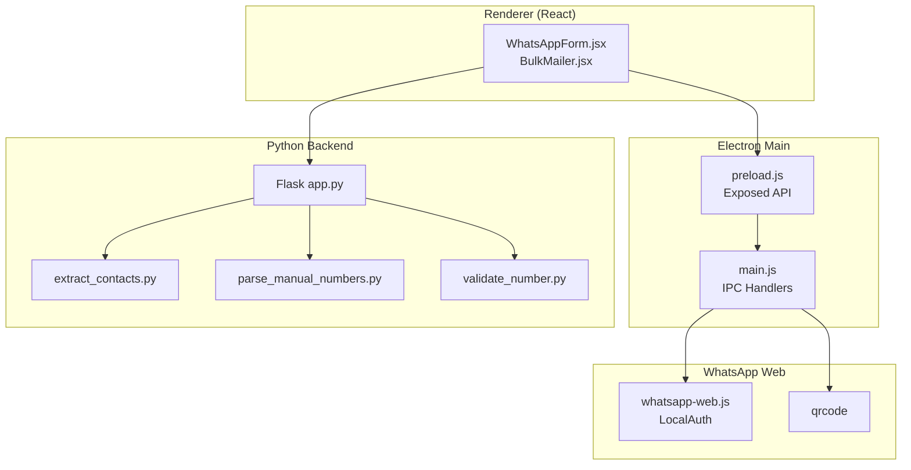
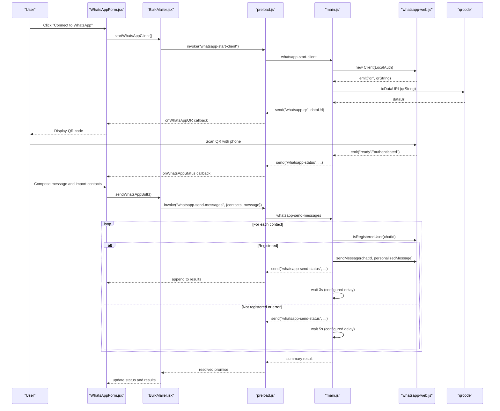
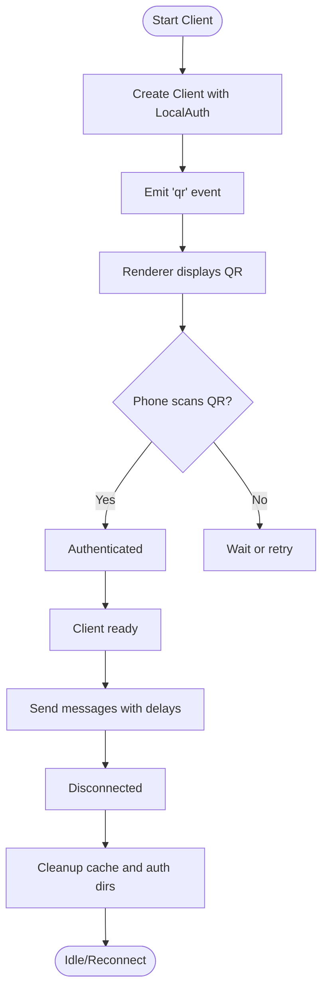
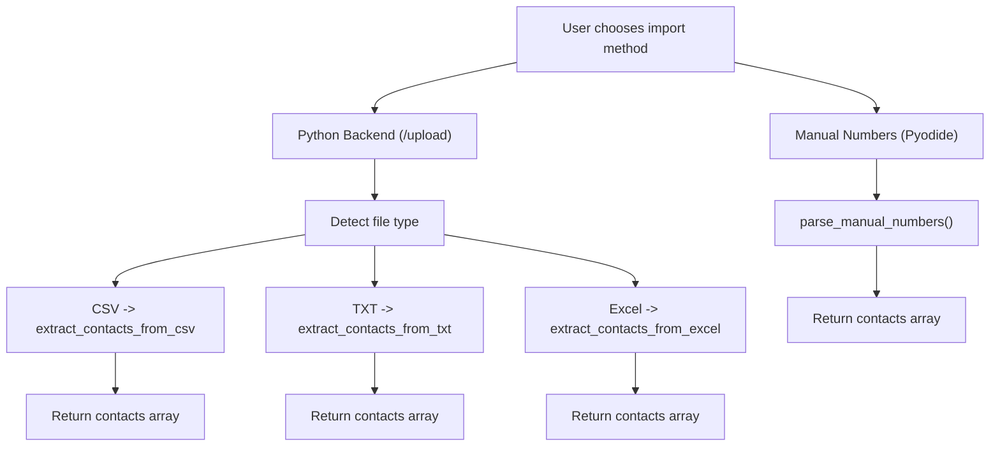
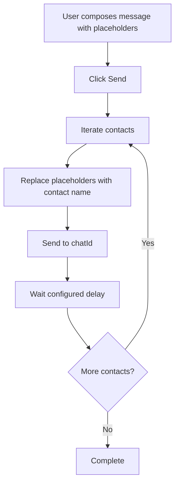
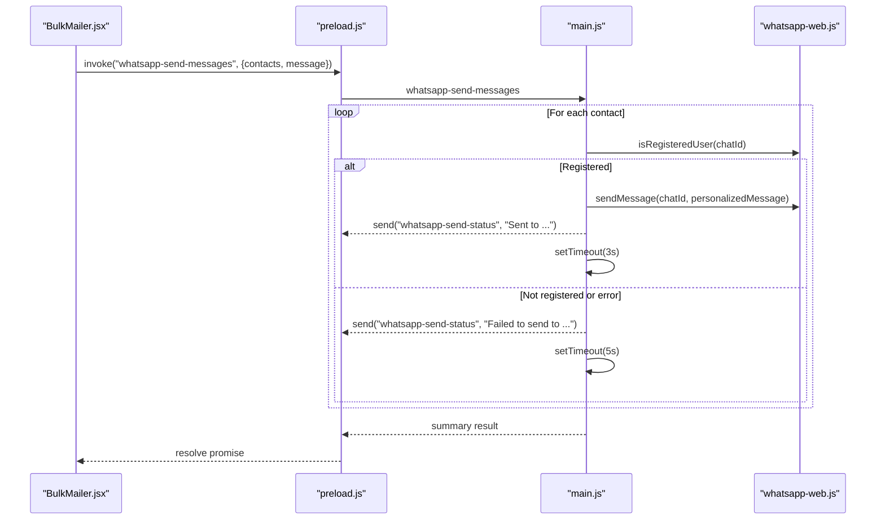
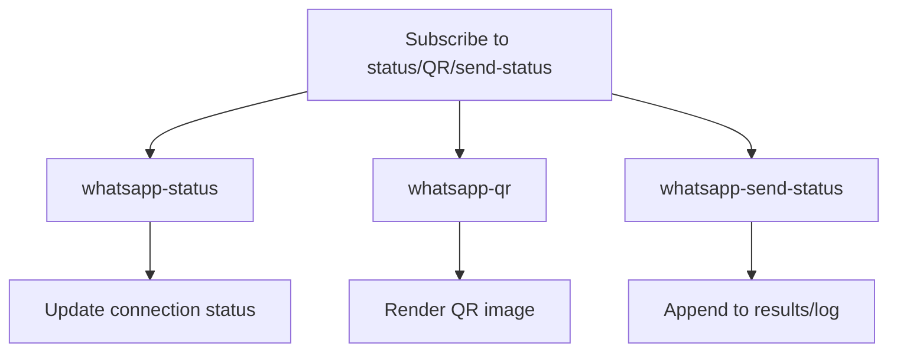
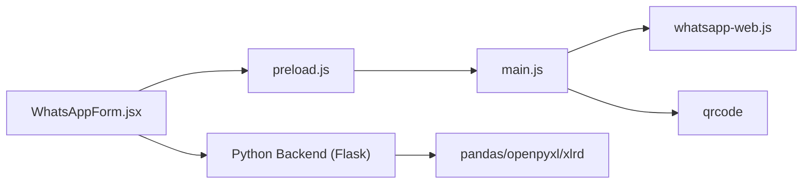

# WhatsApp integration

## Introduction
This page explains the WhatsApp Web integration for bulk messaging, focusing on QR code authentication, session and connection lifecycle, contact import from CSV, Excel, and text files, message composition with personalization, bulk sending with configurable delays, and real-time status monitoring. It also covers troubleshooting and security best practices.

## Project structure
The integration spans three layers:
- Electron renderer (React UI) for user interaction and status display
- Electron main process for WhatsApp Web.js client lifecycle and IPC
- Python backend for advanced contact processing and validation

```mermaid
graph TB
subgraph "Renderer (React)"
UI["WhatsAppForm.jsx<br/>BulkMailer.jsx"]
end
subgraph "Electron Main"
MAIN["main.js<br/>IPC Handlers"]
PRELOAD["preload.js<br/>Exposed API"]
end
subgraph "WhatsApp Web"
WAPI["whatsapp-web.js<br/>LocalAuth"]
QR["qrcode"]
end
subgraph "Python Backend"
PYAPP["Flask app.py"]
EXTRACT["extract_contacts.py"]
PARSE["parse_manual_numbers.py"]
VALID["validate_number.py"]
end
UI --> PRELOAD
PRELOAD --> MAIN
MAIN --> WAPI
MAIN --> QR
UI --> PYAPP
PYAPP --> EXTRACT
PYAPP --> PARSE
PYAPP --> VALID
```

## Core components
- WhatsAppForm: UI for connecting, scanning QR, managing contacts, composing messages, and viewing activity logs.
- BulkMailer: Orchestrates WhatsApp lifecycle, listens to status events, and coordinates IPC with the main process.
- Electron Main: Initializes the WhatsApp client, handles QR generation, connection events, and bulk sending loop with delays.
- Preload Bridge: Exposes secure IPC methods to the renderer for WhatsApp operations.
- Python Backend: Provides REST endpoints for contact import and parsing, including CSV/Excel/Text support and number validation.

## Architecture overview
End-to-end flow for authentication and sending:

```mermaid
sequenceDiagram
participant User as "User"
participant UI as "WhatsAppForm.jsx"
participant BM as "BulkMailer.jsx"
participant IPC as "preload.js"
participant Main as "main.js"
participant WA as "whatsapp-web.js"
participant QRlib as "qrcode"
User->>UI : Click "Connect to WhatsApp"
UI->>BM : startWhatsAppClient()
BM->>IPC : invoke("whatsapp-start-client")
IPC->>Main : whatsapp-start-client
Main->>WA : new Client(LocalAuth)
WA-->>Main : emit("qr", qrString)
Main->>QRlib : toDataURL(qrString)
QRlib-->>Main : dataUrl
Main-->>IPC : send("whatsapp-qr", dataUrl)
IPC-->>UI : onWhatsAppQR callback
UI-->>User : Display QR code
User->>WA : Scan QR with phone
WA-->>Main : emit("ready"/"authenticated")
Main-->>IPC : send("whatsapp-status", ...)
IPC-->>UI : onWhatsAppStatus callback
User->>UI : Compose message and import contacts
UI->>BM : sendWhatsAppBulk()
BM->>IPC : invoke("whatsapp-send-messages", {contacts, message})
IPC->>Main : whatsapp-send-messages
loop For each contact
Main->>WA : isRegisteredUser(chatId)
alt Registered
Main->>WA : sendMessage(chatId, personalizedMessage)
Main-->>IPC : send("whatsapp-send-status", ...)
IPC-->>UI : append to results
Main->>Main : wait 3s (configured delay)
else Not registered or error
Main-->>IPC : send("whatsapp-send-status", ...)
Main->>Main : wait 5s (configured delay)
end
end
Main-->>IPC : summary result
IPC-->>BM : resolved promise
BM-->>UI : update status and results
```

## Detailed component analysis

### QR code authentication and session lifecycle
- The main process creates a Client with LocalAuth and emits QR codes as data URLs.
- The renderer displays QR until authentication succeeds or errors occur.
- Logout triggers explicit client logout and cleanup of cached auth/session files.

```mermaid
flowchart TD
Start(["Start Client"]) --> NewClient["Create Client with LocalAuth"]
NewClient --> EmitQR["Emit 'qr' event"]
EmitQR --> RenderQR["Renderer displays QR"]
RenderQR --> Scanned{"Phone scans QR?"}
Scanned --> |Yes| AuthOK["Authenticated"]
Scanned --> |No| Retry["Wait or retry"]
AuthOK --> Ready["Client ready"]
Ready --> SendLoop["Send messages with delays"]
SendLoop --> Disconnected["Disconnected"]
Disconnected --> Cleanup["Cleanup cache and auth dirs"]
Cleanup --> End(["Idle/Reconnect"])
```

### Contact import and parsing
- CSV/Excel/Text import is supported via two paths:
  - Python backend REST endpoints for reliable parsing and validation
  - Manual text parsing in the renderer using Pyodide for quick local processing
- The renderer supports CSV/Text locally; Excel is noted as not yet supported in this UI path.

```mermaid
flowchart TD
Choose["User chooses import method"] --> Backend["Python Backend (/upload)"]
Choose --> Manual["Manual Numbers (Pyodide)"]
Backend --> Detect["Detect file type"]
Detect --> CSV["CSV -> extract_contacts_from_csv"]
Detect --> TXT["TXT -> extract_contacts_from_txt"]
Detect --> XLSX["Excel -> extract_contacts_from_excel"]
CSV --> ReturnCSV["Return contacts array"]
TXT --> ReturnTXT["Return contacts array"]
XLSX --> ReturnXLSX["Return contacts array"]
Manual --> Parse["parse_manual_numbers()"]
Parse --> ReturnParsed["Return contacts array"]
```

### Message composition and personalization
- Users compose messages in the UI and can use a placeholder to personalize with contact names.
- During sending, the message is personalized by replacing the placeholder with either the contact's name or a default value.

```mermaid
flowchart TD
Compose["User composes message with placeholders"] --> Send["Click Send"]
Send --> Iterate["Iterate contacts"]
Iterate --> Replace["Replace placeholders with contact name"]
Replace --> SendOne["Send to chatId"]
SendOne --> Delay["Wait configured delay"]
Delay --> Next{"More contacts?"}
Next --> |Yes| Iterate
Next --> |No| Done["Complete"]
```

### Bulk sending implementation and delays
- The main process sends messages sequentially to each contact.
- It checks registration status before sending and applies delays to reduce spam risk.
- Real-time progress is emitted via IPC to the renderer for display.

```mermaid
sequenceDiagram
participant BM as "BulkMailer.jsx"
participant IPC as "preload.js"
participant Main as "main.js"
participant WA as "whatsapp-web.js"
BM->>IPC : invoke("whatsapp-send-messages", {contacts, message})
IPC->>Main : whatsapp-send-messages
loop For each contact
Main->>WA : isRegisteredUser(chatId)
alt Registered
Main->>WA : sendMessage(chatId, personalizedMessage)
Main-->>IPC : send("whatsapp-send-status", "Sent to ...")
Main->>Main : setTimeout(3s)
else Not registered or error
Main-->>IPC : send("whatsapp-send-status", "Failed to send to ...")
Main->>Main : setTimeout(5s)
end
end
Main-->>IPC : summary result
IPC-->>BM : resolve promise
```

### Real-time status monitoring
- The renderer subscribes to three event channels:
  - Connection status updates
  - QR code data URL updates
  - Per-message send status updates
- These are displayed in the activity log with color-coded indicators.

```mermaid
flowchart TD
Subscribe["Subscribe to status/QR/send-status"] --> Status["whatsapp-status"]
Subscribe --> QR["whatsapp-qr"]
Subscribe --> SendStatus["whatsapp-send-status"]
Status --> UpdateUI["Update connection status"]
QR --> ShowQR["Render QR image"]
SendStatus --> AppendLog["Append to results/log"]
```

## Dependency analysis
Key runtime dependencies for the integration:
- whatsapp-web.js: Core WhatsApp Web client and authentication
- qrcode: QR code rendering for the UI
- Pyodide and Python backend: Contact parsing and validation utilities

```mermaid
graph LR
UI["WhatsAppForm.jsx"] --> IPC["preload.js"]
IPC --> MAIN["main.js"]
MAIN --> WAPI["whatsapp-web.js"]
MAIN --> QR["qrcode"]
UI --> PY["Python Backend (Flask)"]
PY --> PANDAS["pandas/openpyxl/xlrd"]
```

## Performance considerations
- Sequential sending with delays reduces rate limits and improves reliability.
- Using isRegisteredUser avoids unnecessary send attempts and reduces error noise.
- QR generation occurs only once per session; caching and reuse minimize overhead.
- Consider batching contacts and adding jitter to delays for natural pacing.

## Troubleshooting guide
Common issues and resolutions:
- QR code not loading
  - Refresh the client and retry; the UI provides a retry button when QR fails to load.
  - Ensure network connectivity and try again.
- Authentication failures
  - Reinitialize the client and re-scan the QR.
  - Confirm the device is linked and not logged out elsewhere.
- Rate limiting and spam detection
  - Increase delays between messages; the current implementation uses fixed delays.
  - Pause periodically and resume to avoid continuous bursts.
- Contact import errors
  - Verify file format and encoding; supported formats include CSV, Excel (.xlsx/.xls), and Text.
  - Ensure phone numbers are valid and standardized before sending.

## Security considerations
- Context isolation and secure IPC prevent direct Node.js access in the renderer.
- LocalAuth stores session securely; logout clears cached auth files.
- Input validation and sanitization are applied in the Python backend for numbers and contact parsing.
- Use strong authentication for external services (Gmail/SMTP) and rotate credentials regularly.

## Conclusion
The integration provides a reliable, user-friendly pathway to authenticate via QR, manage contacts, compose personalized messages, and send them reliably with real-time feedback. The architecture cleanly separates concerns across renderer, main process, and Python utilities, enabling maintainability and scalability.
